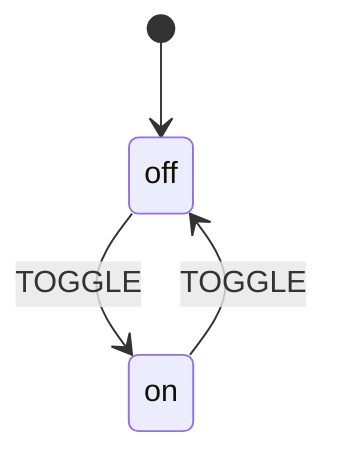

<div align="center">

# ⚙️ XState-StateMachine for Python

### Production-Grade State Machine Runtime — XState-Compatible, Zero Dependencies

<br>

[](https://pypi.org/project/xstate-statemachine/)
[](https://www.python.org/)
[](tests/)
[](LICENSE)
[](pyproject.toml)

<br>

**Define** state machines in JSON or pure Python · **Run** them with async or sync interpreters · **Generate** production boilerplate with one CLI command

<br>

[📦 Installation](#-installation) · [🚀 Quick Start](#-quick-start) · [🐍 Pythonic API](#-pythonic-api) · [⚡ CLI Generator](#-cli-code-generator) · [📖 Full Docs](https://basiltt.github.io/xstate-statemachine/)

</div>

<br>

---

<br>

## ✨ Why XState-StateMachine?

<table>
<tr>
<td width="50%">

### 🎯 The Problem
```
isLoading = True
isError = True       ← impossible!
isAuthenticated = True
```
Managing state with boolean flags leads to **impossible states**, **forgotten edge cases**, and **spaghetti logic** that's impossible to debug.

</td>
<td width="50%">

### ✅ The Solution
```
[idle] → FETCH → [loading] → SUCCESS → [done]
                            → ERROR   → [error]
```
State machines make **every valid state explicit** and **every transition deliberate**. No impossible states. No forgotten edges.

</td>
</tr>
</table>

<br>

## 🏆 Key Features

| | Feature | Description |
|:---:|---------|-------------|
| 🐍 | **Pure Python API** | Define machines as classes, builders, or functions — no JSON needed |
| 📋 | **XState JSON Compatible** | Import machines from [Stately.ai](https://stately.ai) visual editor |
| ⚡ | **Dual Interpreters** | Async (`Interpreter`) + Sync (`SyncInterpreter`) engines |
| 🏗️ | **Hierarchical States** | Nested parent/child states with automatic event bubbling |
| 🔀 | **Parallel States** | Concurrent regions operating independently |
| 🛡️ | **Guards & Actions** | Conditional transitions + side effects with full type hints |
| 🔌 | **Services & Invoke** | Async/sync service calls with `onDone`/`onError` handling |
| ⏱️ | **Delayed Transitions** | Timer-based auto-transitions with `after` |
| 🤖 | **Actor Model** | Spawn isolated child machines with independent lifecycles |
| 🔧 | **CLI Code Generator** | 5 templates → production Python from XState JSON |
| 📊 | **Diagram Export** | Generate Mermaid, PlantUML, or ASCII diagrams |
| 🔌 | **Plugin System** | Observable hooks for logging, metrics, and debugging |
| 💾 | **Snapshots** | Save/restore machine state for persistence and testing |
| 📦 | **Zero Dependencies** | Pure Python standard library — works everywhere |

<br>

---

<br>

## 📦 Installation

```bash
pip install xstate-statemachine
```

<details>
<summary>📋 <b>Other package managers</b></summary>

<br>

```bash
# With uv (fast)
uv pip install xstate-statemachine

# With Poetry
poetry add xstate-statemachine

# Development install
git clone https://github.com/basiltt/xstate-statemachine.git
cd xstate-statemachine
uv pip install -e . --group dev --group lint --group test
```

</details>

<br>

> [!NOTE]
> **Requirements:** Python 3.9+ · No external dependencies · Works on Windows, macOS, Linux

```bash
# Verify installation
python -c "import xstate_statemachine; print(xstate_statemachine.__version__)"
# ✅ Output: 0.5.0
```

<br>

---

<br>

## 🚀 Quick Start

> **Build your first state machine in 60 seconds.**

Choose your preferred style — all three produce identical runtime behavior:

<br>

<table>
<tr>
<td width="33%" align="center"><b>🏛️ Class-Based</b><br><sub>OOP teams, large machines</sub></td>
<td width="33%" align="center"><b>⛓️ Builder</b><br><sub>Fluent API, dynamic assembly</sub></td>
<td width="33%" align="center"><b>🧩 Functional</b><br><sub>Simple scripts, explicit</sub></td>
</tr>
</table>

<br>

### 🏛️ Option A: Pure Python (Recommended)

```python
from xstate_statemachine import State, build_machine, SyncInterpreter, action

# 1️⃣ Define states
off = State("off", initial=True)
on  = State("on")

# 2️⃣ Define transitions
off.to(on,  event="TOGGLE")
on.to(off, event="TOGGLE")

# 3️⃣ Define actions
@action
def log_toggle(interpreter, context, event, action_def):
    print(f"💡 Light is now: {interpreter.active_state_ids}")

# 4️⃣ Build and run
machine = build_machine(id="lightSwitch", states=[off, on], actions=[log_toggle])

interpreter = SyncInterpreter(machine).start()
interpreter.send("TOGGLE")  # off → on
interpreter.send("TOGGLE")  # on → off
interpreter.stop()
```

### 📋 Option B: JSON Configuration (XState Compatible)

```python
from xstate_statemachine import create_machine, SyncInterpreter

config = {
    "id": "lightSwitch",
    "initial": "off",
    "states": {
        "off": {"on": {"TOGGLE": "on"}},
        "on":  {"on": {"TOGGLE": "off"}}
    }
}

machine = create_machine(config)
interpreter = SyncInterpreter(machine).start()

interpreter.send("TOGGLE")  # off → on ✅
interpreter.send("TOGGLE")  # on → off ✅
interpreter.stop()
```

### ⚡ Option C: Generate with CLI

```bash
# 🪄 Generate production-ready Python from any XState JSON
xsm generate-template light_switch.json --template pythonic-class --force
# ✅ Creates: light_switch_logic.py + light_switch_runner.py
```

<br>

---

<br>

## 🧠 Core Concepts

```
                    ┌─────────────────────────────────────────┐
                    │            STATE MACHINE                │
                    │                                         │
                    │   ┌─────────┐   TOGGLE   ┌─────────┐   │
                    │   │         │ ─────────► │         │   │
                    │   │   off   │             │   on    │   │
                    │   │ (init)  │ ◄───────── │         │   │
                    │   └─────────┘   TOGGLE   └─────────┘   │
                    │                                         │
                    │   context: { flips: 0 }                 │
                    └─────────────────────────────────────────┘
```

| Concept | What It Is | Example |
|:--------|:-----------|:--------|
| 🔵 **State** | A distinct mode the system can be in | `"off"`, `"loading"`, `"error"` |
| ⚡ **Event** | Something that happens from outside | `"TOGGLE"`, `"SUBMIT"`, `"TIMEOUT"` |
| ➡️ **Transition** | _"When event X happens in state A, go to state B"_ | `off ─TOGGLE→ on` |
| 🛡️ **Guard** | Boolean condition on a transition | `"isAuthenticated"` — only transition if `True` |
| 🎬 **Action** | Side effect that runs during a transition | `"logToggle"` — runs code when transitioning |
| 💾 **Context** | Mutable data the machine carries | `{ "retries": 0, "user": null }` |
| 🔌 **Service** | Async operation invoked by a state | `"fetchUserData"` — API call, DB query |
| 🏁 **Final State** | Terminal state — the machine is done | `"success"`, `"completed"` |

> [!IMPORTANT]
> **The Golden Rule:** A state machine can only be in **ONE state** at a time (unless using parallel states). It transitions **ONLY** when it receives a matching event. This eliminates impossible states entirely.

<br>

---

<br>

## 📋 JSON Configuration Reference

> **XState JSON is the universal format.** Design machines visually at [stately.ai](https://stately.ai), export JSON, run them directly.

<details>
<summary>📖 <b>Complete JSON Structure (click to expand)</b></summary>

<br>

```json
{
  "id": "myMachine",
  "initial": "idle",
  "context": {
    "retries": 0,
    "data": null
  },
  "states": {
    "idle": {
      "on": {
        "FETCH": {
          "target": "loading",
          "actions": "startLoading",
          "guard": "canFetch"
        }
      },
      "entry": "resetForm",
      "exit": "clearErrors"
    },
    "loading": {
      "invoke": {
        "src": "fetchData",
        "onDone": {
          "target": "success",
          "actions": "storeData"
        },
        "onError": {
          "target": "error",
          "actions": "storeError"
        }
      },
      "after": {
        "5000": "error"
      }
    },
    "success": {
      "type": "final"
    },
    "error": {
      "on": {
        "RETRY": {
          "target": "loading",
          "guard": "hasRetriesLeft",
          "actions": "incrementRetry"
        }
      }
    }
  }
}
```

</details>

### 📝 Field-by-Field Reference

<details>
<summary>🔧 <b>Top-Level Fields</b></summary>

| Field | Type | Required | Description |
|:------|:-----|:---------|:------------|
| `id` | `string` | ✅ **Yes** | Unique machine identifier |
| `initial` | `string` | ✅ **Yes** | Name of the starting state |
| `context` | `object` | ❌ No | Initial mutable data |
| `states` | `object` | ✅ **Yes** | Map of state name → state config |

</details>

<details>
<summary>🔧 <b>State Fields</b></summary>

| Field | Type | Description |
|:------|:-----|:------------|
| `on` | `object` | Map of event name → transition(s) |
| `entry` | `string \| array` | Action(s) to run when entering this state |
| `exit` | `string \| array` | Action(s) to run when leaving this state |
| `invoke` | `object \| array` | Service(s) to start when entering |
| `after` | `object` | Delayed transitions: `{ milliseconds: target }` |
| `type` | `string` | `"atomic"`, `"compound"`, `"parallel"`, or `"final"` |
| `initial` | `string` | Initial child state (compound states) |
| `states` | `object` | Nested child states |
| `onDone` | `object` | Transition when all child regions complete |
| `always` | `object \| array` | Eventless transitions, evaluated immediately |

</details>

<details>
<summary>🔧 <b>Transition Formats</b></summary>

```jsonc
// 🔹 Simple: just a target state name
"CLICK": "active"

// 🔹 With options
"CLICK": {
  "target": "active",
  "guard": "isEnabled",
  "actions": "logClick"
}

// 🔹 Multiple transitions (first matching guard wins)
"SUBMIT": [
  { "target": "success", "guard": "isValid" },
  { "target": "error" }
]

// 🔹 Multiple actions
"SAVE": {
  "target": "saved",
  "actions": ["validate", "persist", "notify"]
}
```

</details>

<details>
<summary>🔧 <b>Eventless Transitions (<code>always</code>)</b></summary>

Eventless transitions fire **immediately** when a state is entered — no event needed:

```json
{
  "id": "router",
  "initial": "checking",
  "context": {"role": "admin"},
  "states": {
    "checking": {
      "always": [
        {"target": "adminPanel",  "guard": "isAdmin"},
        {"target": "userDashboard", "guard": "isUser"},
        {"target": "login"}
      ]
    },
    "adminPanel":    {},
    "userDashboard": {},
    "login":         {}
  }
}
```

When the machine enters `checking`, it evaluates the `always` transitions and moves to the first matching target automatically.

</details>

<br>

---

<br>

## 🐍 Pythonic API

> **New in v0.5.0** — Define state machines in pure Python. No JSON needed.

<table>
<tr>
<td align="center">🏛️</td>
<td><b>Class-Based</b></td>
<td>OOP teams, large machines</td>
<td><code>class MyMachine(StateMachine)</code></td>
</tr>
<tr>
<td align="center">⛓️</td>
<td><b>Builder</b></td>
<td>Fluent/chained construction</td>
<td><code>MachineBuilder("id").state(...).build()</code></td>
</tr>
<tr>
<td align="center">🧩</td>
<td><b>Functional</b></td>
<td>Simple, explicit assembly</td>
<td><code>build_machine(id=..., states=[...])</code></td>
</tr>
</table>

> [!TIP]
> All three styles compile to the same internal `MachineNode` and work with both `Interpreter` and `SyncInterpreter`.

<br>

### 🏛️ Style 1: Class-Based (`StateMachine`)

```python
from xstate_statemachine import (
    State, StateMachine, SyncInterpreter,
    action, guard, service
)

class TrafficLight(StateMachine):
    machine_id = "trafficLight"

    # 🔵 States
    green  = State("green",  initial=True)
    yellow = State("yellow")
    red    = State("red")

    # ➡️ Transitions
    slow_down = green.to(yellow, event="TIMER")
    stop      = yellow.to(red,   event="TIMER")
    go        = red.to(green,    event="TIMER")

    # 🎬 Actions
    @action
    def log_change(self, interpreter, context, event, action_def):
        print(f"🚦 Light changed to: {interpreter.active_state_ids}")

    # 🛡️ Guards
    @guard
    def is_rush_hour(self, context, event):
        return context.get("hour", 12) in range(7, 10)

# ▶️ Run it
machine = TrafficLight.create_machine()
interp = SyncInterpreter(machine).start()
interp.send("TIMER")  # 🟢 → 🟡
interp.send("TIMER")  # 🟡 → 🔴
interp.send("TIMER")  # 🔴 → 🟢
interp.stop()
```

<details>
<summary>⛓️ <b>Style 2: Builder (<code>MachineBuilder</code>)</b></summary>

```python
from xstate_statemachine import MachineBuilder, SyncInterpreter, action

@action
def log_change(interpreter, context, event, action_def):
    print(f"Now: {interpreter.active_state_ids}")

machine = (
    MachineBuilder("trafficLight")
    .state("green",  initial=True)
    .state("yellow")
    .state("red")
    .transition("green",  "TIMER", "yellow")
    .transition("yellow", "TIMER", "red")
    .transition("red",    "TIMER", "green")
    .action("logChange", log_change)
    .build()
)

interp = SyncInterpreter(machine).start()
interp.send("TIMER")
interp.send("TIMER")
interp.stop()
```

</details>

<details>
<summary>🧩 <b>Style 3: Functional (<code>build_machine</code>)</b></summary>

```python
from xstate_statemachine import State, build_machine, SyncInterpreter, action

green  = State("green",  initial=True)
yellow = State("yellow")
red    = State("red")

green.to(yellow, event="TIMER")
yellow.to(red,   event="TIMER")
red.to(green,    event="TIMER")

@action
def log_change(interpreter, context, event, action_def):
    print(f"Now: {interpreter.active_state_ids}")

machine = build_machine(
    id="trafficLight",
    states=[green, yellow, red],
    actions=[log_change],
)

interp = SyncInterpreter(machine).start()
interp.send("TIMER")
interp.send("TIMER")
interp.stop()
```

</details>

<details>
<summary>🏷️ <b>Decorator Details</b></summary>

```python
# 🔹 Auto-naming: snake_case → camelCase
@action
def increment_counter(interpreter, context, event, action_def):
    context["count"] += 1
# → Registered as "incrementCounter"

# 🔹 Explicit naming
@action("myCustomName")
def some_function(interpreter, context, event, action_def):
    pass
# → Registered as "myCustomName"

# 🔹 Guard signature (no interpreter, returns bool)
@guard
def is_valid(context, event):
    return context.get("value", 0) > 0

# 🔹 Service signature (returns dict)
@service
def fetch_data(interpreter, context, event):
    return {"result": "some_data"}
```

</details>

<br>

---

<br>

## ⚙️ Interpreters

> Interpreters **execute** a machine — they process events, evaluate guards, run actions, and manage transitions.

<table>
<tr>
<td width="50%">

### 🔄 Async Interpreter
**For:** `asyncio` apps, web servers, real-time

```python
import asyncio
from xstate_statemachine import create_machine, Interpreter

async def main():
    machine = create_machine(config)
    interp = await Interpreter(machine).start()

    await interp.send("FETCH")
    await interp.send("SUCCESS")
    await interp.stop()

asyncio.run(main())
```

</td>
<td width="50%">

### ⚡ Sync Interpreter
**For:** Scripts, CLI tools, Django, testing

```python
from xstate_statemachine import create_machine, SyncInterpreter

machine = create_machine(config)
interp = SyncInterpreter(machine).start()

interp.send("ACTIVATE")
interp.send("DEACTIVATE")
interp.stop()
```

</td>
</tr>
</table>

<details>
<summary>📋 <b>Interpreter Properties & Methods</b></summary>

| Property / Method | Type | Description |
|:------------------|:-----|:------------|
| `.start()` | method | Initialize and enter the initial state |
| `.stop()` | method | Exit all states and shut down |
| `.send(event)` | method | Send an event (string, dict, or `Event`) |
| `.send_events([...])` | method | Send multiple events in sequence |
| `.active_state_ids` | `set[str]` | Currently active state IDs |
| `.context` | `dict` | Current machine context (mutable) |
| `.is_running` | `bool` | Whether the interpreter is active |

</details>

<details>
<summary>📨 <b>Sending Events — All Formats</b></summary>

```python
# 🔹 String shorthand
interpreter.send("CLICK")

# 🔹 With payload data
interpreter.send("LOGIN", username="alice", password="secret")

# 🔹 Event object
from xstate_statemachine import Event
interpreter.send(Event(type="LOGIN", payload={"username": "alice"}))

# 🔹 Dict form
interpreter.send({"type": "LOGIN", "username": "alice"})

# 🔹 Multiple events at once
interpreter.send_events(["STEP_1", "STEP_2", "STEP_3"])
```

</details>

<br>

---

<br>

## 💾 Context — The Machine's Memory

> Context is a **mutable dictionary** that travels with the machine. Use it to track data across transitions.

```python
from xstate_statemachine import create_machine, SyncInterpreter, MachineLogic

config = {
    "id": "counter",
    "initial": "counting",
    "context": {"count": 0, "history": []},
    "states": {
        "counting": {
            "on": {
                "INCREMENT": {"actions": "addOne"},
                "DECREMENT": {"actions": "subtractOne"}
            }
        }
    }
}

class CounterLogic(MachineLogic):
    def addOne(self, interpreter, context, event, action_def):
        context["count"] += 1
        context["history"].append(f"+1 → {context['count']}")

    def subtractOne(self, interpreter, context, event, action_def):
        context["count"] -= 1
        context["history"].append(f"-1 → {context['count']}")

machine = create_machine(config, logic=CounterLogic())
interp = SyncInterpreter(machine).start()

interp.send("INCREMENT")   # count: 1
interp.send("INCREMENT")   # count: 2
interp.send("DECREMENT")   # count: 1

print(interp.context)
#> {"count": 1, "history": ["+1 → 1", "+1 → 2", "-1 → 1"]}

interp.stop()
```

<br>

---

<br>

## 🛡️ Guards

> Guards are **boolean functions** that control whether a transition is allowed. If a guard returns `False`, the transition is **blocked**.

```python
from xstate_statemachine import State, StateMachine, guard

class AgeGate(StateMachine):
    machine_id = "ageGate"
    initial_context = {"age": 16}

    checking = State("checking", initial=True)
    allowed  = State("allowed")
    rejected = State("rejected")

    # ⚡ Multiple guarded transitions — first match wins
    verify = (
        checking.to(allowed,  event="VERIFY", guard="isAdult")
        | checking.to(rejected, event="VERIFY")  # fallback
    )

    @guard
    def is_adult(self, context, event):
        return context.get("age", 0) >= 18
```

> [!NOTE]
> Guard functions receive `(context, event)` — **not** `(interpreter, context, event, action_def)`. They must return a `bool` and must be **synchronous**.

<br>

---

<br>

## 🎬 Actions

> Actions are **side effects** that execute at specific moments. They don't control flow — they _do_ things.

| Trigger | ⏰ When It Fires |
|:--------|:------------------|
| 🔵 **Entry actions** | When a state is **entered** |
| 🔴 **Exit actions** | When a state is **exited** |
| ➡️ **Transition actions** | **During** a transition (between exit and entry) |

```json
{
  "editing": {
    "entry": "loadDraft",
    "exit":  "saveDraft",
    "on": {
      "SUBMIT": {
        "target": "submitting",
        "actions": ["validate", "clearErrors"]
      }
    }
  }
}
```

**Execution order for `SUBMIT`:** `saveDraft` → `validate` → `clearErrors` → `showSpinner`

<details>
<summary>🏷️ <b>Pythonic Entry/Exit Actions</b></summary>

```python
class FormMachine(StateMachine):
    machine_id = "form"

    editing    = State("editing", initial=True)
    submitting = State("submitting")

    submit = editing.to(submitting, event="SUBMIT")

    @editing.enter
    def on_enter_editing(self, interpreter, context, event, action_def):
        print("📝 Entered editing mode")

    @editing.exit
    def on_exit_editing(self, interpreter, context, event, action_def):
        print("💾 Auto-saving draft...")
```

</details>

<br>

---

<br>

## 🔌 Services & Invoke

> Services represent **async operations** — API calls, database queries, file reads. A state can `invoke` a service and transition based on the result.

```python
class UserLogic(MachineLogic):
    async def fetchUser(self, interpreter, context, event):
        # 🌐 Call your API
        import aiohttp
        async with aiohttp.ClientSession() as session:
            resp = await session.get("https://api.example.com/user/1")
            return await resp.json()

    def storeUser(self, interpreter, context, event, action_def):
        context["user"] = event.data  # ✅ onDone event carries the return value

    def storeError(self, interpreter, context, event, action_def):
        context["error"] = str(event.data)  # ❌ onError event carries the exception
```

<details>
<summary>📋 <b>JSON Invoke Configuration</b></summary>

```json
{
  "loading": {
    "invoke": {
      "src": "fetchUser",
      "onDone": {
        "target": "loaded",
        "actions": "storeUser"
      },
      "onError": {
        "target": "error",
        "actions": "storeError"
      }
    }
  }
}
```

</details>

<br>

---

<br>

## ⏱️ Delayed Transitions (`after`)

> States can **automatically transition** after a time delay — perfect for timeouts, polling, and auto-progression.

```json
{
  "id": "sessionTimeout",
  "initial": "active",
  "states": {
    "active": {
      "after": { "300000": "warning" },
      "on": { "ACTIVITY": "active" }
    },
    "warning": {
      "after": { "30000": "expired" },
      "on": { "EXTEND": "active" }
    },
    "expired": { "type": "final" }
  }
}
```

```
⏱️ 5 min inactivity → ⚠️ 30 sec warning → ❌ expired
                        ↑ EXTEND → back to active
```

<br>

---

<br>

## 🏗️ Hierarchical (Nested) States

> Compound states contain child states, creating a **tree structure**. Parent transitions apply to all children automatically.

```
           ┌──────────────── loggedIn ────────────────┐
           │                                          │
  LOGIN    │   ┌───────────┐   VIEW    ┌────────┐    │
  ──────►  │   │ dashboard │ ───────► │ profile│    │
           │   │  (init)   │ ◄─────── │        │    │
           │   └───────────┘   BACK   └────────┘    │
           │        │                                │
           │   VIEW_SETTINGS                         │
           │        ▼                                │
           │   ┌──────────┐                          │
           │   │ settings │                          │
           │   └──────────┘                          │
           │                                         │
           └──────── LOGOUT ─────────────────────────┘
                      │
                      ▼
           ┌──────────────┐
           │  loggedOut   │
           └──────────────┘
```

```python
class AuthMachine(StateMachine):
    machine_id = "auth"

    logged_out = State("loggedOut", initial=True)
    logged_in  = State("loggedIn", states=[
        State("dashboard", initial=True),
        State("profile"),
        State("settings"),
    ])

    login  = logged_out.to(logged_in,  event="LOGIN")
    logout = logged_in.to(logged_out, event="LOGOUT")  # 🔑 Catches from ANY child
```

> [!TIP]
> The `LOGOUT` event on the parent `loggedIn` catches the event **no matter which child state is active**. This is the power of hierarchy.

<br>

---

<br>

## 🔀 Parallel States

> Parallel states represent **concurrent** activity — multiple regions operating independently.

```json
{
  "playing": {
    "type": "parallel",
    "states": {
      "video":    { "initial": "loading",  "states": { "loading": {}, "showing": {} } },
      "audio":    { "initial": "muted",    "states": { "muted": {},   "playing": {} } },
      "controls": { "initial": "visible",  "states": { "visible": {}, "hidden": {}  } }
    }
  }
}
```

All three regions (`video` 🎬, `audio` 🔊, `controls` 🎛️) are active **simultaneously**.

<br>

---

<br>

## 🏁 Final States

> A final state signals **completion**. No outgoing transitions allowed.

```python
confirmed = State("confirmation", final=True)
```

When entered inside a compound state, triggers a `done.state.*` event on the parent.

<br>

---

<br>

## 🤖 Actor Model

> Spawn **isolated child machines** — each actor has its own state, context, and lifecycle.

```python
class ParentLogic(MachineLogic):
    def spawn_child(self, interpreter, context, event, action_def):
        """🤖 Spawn a child actor (suffix after 'spawn_' = actor key)"""
        child_config = {
            "id": "childMachine",
            "initial": "idle",
            "states": {
                "idle":    {"on": {"DO_WORK": "working"}},
                "working": {"on": {"DONE": "idle"}}
            }
        }
        return create_machine(child_config)
```

> [!TIP]
> Use `spawn_blocking_` prefix for actors that **wait** for the child to reach a final state before continuing.

<br>

---

<br>

## 🔌 Plugins & Observability

> Plugins **observe** machine execution without modifying behavior. Perfect for logging, metrics, and debugging.

### 📋 Built-in: `LoggingInspector`

```python
from xstate_statemachine import create_machine, SyncInterpreter, LoggingInspector

interp = SyncInterpreter(machine)
interp.plugins = [LoggingInspector()]  # 🔌 Attach plugin

interp.start()
interp.send("GO")
# 🕵️ [INSPECT] Transition: ['demo.a'] → ['demo.b'] on Event 'GO'
# 🕵️ [INSPECT] New Context: {}
```

<details>
<summary>🔧 <b>Custom Plugin Example</b></summary>

```python
from xstate_statemachine import PluginBase

class MetricsPlugin(PluginBase):
    def __init__(self):
        self.transition_count = 0

    def on_transition(self, interpreter, from_states, to_states, transition):
        self.transition_count += 1
        print(f"📊 Transition #{self.transition_count}")

    def on_event_received(self, interpreter, event):
        print(f"📨 Event: {event.type}")

    def on_action_execute(self, interpreter, action):
        print(f"🎬 Action: {action.type}")

    def on_guard_evaluated(self, interpreter, guard_name, event, result):
        emoji = "✅" if result else "❌"
        print(f"🛡️ Guard '{guard_name}' → {emoji}")
```

</details>

<details>
<summary>📋 <b>All Plugin Hooks</b></summary>

| Hook | When It Fires |
|:-----|:-------------|
| `on_interpreter_start` | Machine starts |
| `on_interpreter_stop` | Machine stops |
| `on_event_received` | Event received |
| `on_transition` | State transition occurs |
| `on_action_execute` | Action about to execute |
| `on_guard_evaluated` | Guard checked |
| `on_service_start` | Service begins |
| `on_service_done` | Service completes |
| `on_service_error` | Service throws |

</details>

<br>

---

<br>

## 💾 Snapshots & State Restoration

> **Save** and **restore** machine state — perfect for persistence, crash recovery, and testing.

```python
# 📸 Capture current state
snapshot_json = interp.get_snapshot()
#> {"status": "started", "context": {"progress": 50}, "state_ids": ["workflow.step2"]}

# 💾 Save to file
from pathlib import Path
Path("machine_state.json").write_text(snapshot_json)

# 🔄 Restore later (even in a different process)
saved = Path("machine_state.json").read_text()
restored = SyncInterpreter.from_snapshot(saved, machine)

print(restored.active_state_ids)  # {'workflow.step2'} ✅
print(restored.context)           # {'progress': 50}   ✅
restored.send("NEXT")             # Continue from where we left off!
```

> [!WARNING]
> `from_snapshot()` performs a **static restoration**. It does NOT re-run entry actions, restart services, or resume `after` timers.

<br>

---

<br>

## 📊 Diagram Export

> Generate visual diagrams from any machine definition.

```python
machine = create_machine(config)

print(machine.to_mermaid())    # 📊 Works in GitHub README
print(machine.to_plantuml())   # 📊 For documentation
```



<br>

---

<br>

## ⚡ CLI Code Generator

> The `xsm` CLI generates **production-ready Python** from XState JSON configs — complete with type hints, docstrings, error handling, and logging.

### 🛠️ Available Commands

```
xsm [-h] [-v]
    {generate-template, gt, list-templates, lt, validate, val, info} ...
```

| Command | Alias | Description |
|:--------|:------|:------------|
| 🔧 `generate-template` | `gt` | Generate Python code from XState JSON |
| 📋 `list-templates` | `lt` | List all available code generation templates |
| ✅ `validate` | `val` | Validate an XState JSON config file |
| ℹ️ `info` | — | Show library version and feature summary |

### 📋 Quick Reference

```bash
# 🔧 Generate code from JSON
xsm gt my_machine.json                        # default template
xsm gt my_machine.json -t pythonic-class       # choose template

# 📋 List available templates
xsm lt

# ✅ Validate JSON config
xsm val my_machine.json auth.json

# ℹ️ Show library info
xsm info
```

### 🎨 Template Selection

| Template | Style | Best For |
|:---------|:------|:---------|
| ⭐ `pythonic-class` | Class-based OOP | New Python-native projects |
| ⛓️ `pythonic-builder` | Fluent builder | Dynamic assembly |
| 🧩 `pythonic-functional` | Functional | Simple scripts |
| 📋 `class-json` | Class + JSON | Existing JSON workflows |
| 📄 `function-json` | Functions + JSON | Lightweight prototyping |

<details>
<summary>⚙️ <b>All CLI Options</b></summary>

```
xsm generate-template [JSON_FILES...] [OPTIONS]

Input Options:
  json_files                One or more XState JSON config files
  -j,  --json FILE          Additional JSON input (repeatable)
  -jp, --json-parent FILE   Designate parent machine for hierarchy
  -jc, --json-child FILE    Designate child machine(s) (repeatable)

Template Options:
  -t,  --template TEMPLATE  Code generation template
  -s,  --style STYLE        DEPRECATED: use --template instead

Output Options:
  -o,  --output DIR         Output directory (default: same as JSON)
  -fc, --file-count {1,2}   1 = merged, 2 = separate (default)
  -f,  --force              Overwrite existing files

Behavior Options:
  -am, --async-mode BOOL    Async (yes) or sync (no) interpreter
  -l,  --loader BOOL        Use LogicLoader auto-discovery (default: yes)
  --log BOOL                Include logging statements (default: yes)
  --sleep BOOL              Add sleep between events (default: yes)
  --sleep-time SECONDS      Sleep duration (default: 2)
```

</details>

<details>
<summary>🍳 <b>Common Recipes</b></summary>

```bash
# ⚡ Sync mode (for scripts/CLI tools)
xsm gt machine.json -t pythonic-class --async-mode no

# 📄 Single merged file
xsm gt machine.json -t pythonic-functional --file-count 1

# 🧹 Clean output (no logging, no sleep)
xsm gt machine.json -t pythonic-class --log no --sleep no

# 📁 Custom output directory + force overwrite
xsm gt machine.json -o ./generated/ --force

# 📦 Multiple JSON files
xsm gt auth.json profile.json settings.json
```

</details>

<br>

---

<br>

## 🎨 CLI Templates Deep Dive

> Given a checkout machine JSON, here's what each template produces:

<details>
<summary>⭐ <b><code>pythonic-class</code> — StateMachine subclass with decorators</b></summary>

```python
class CheckoutMachine(StateMachine):
    """Checkout state machine."""
    machine_id = "checkout"
    initial_context = {"total": 0}

    # 🔵 States
    cart      = State("cart", initial=True)
    payment   = State("payment", invoke={...})
    confirmed = State("confirmed")

    # ➡️ Transitions
    checkout_event = cart.to(payment, event="CHECKOUT",
                             guard="hasItems", actions="calculateTotal")

    # 🎬 Actions
    @action
    def calculate_total(self, interpreter, context, event, action_def) -> None:
        """Execute the ``calculateTotal`` action."""
        # TODO: implement action logic
        pass

    # 🛡️ Guards
    @guard
    def has_items(self, context, event) -> bool:
        """Evaluate the ``hasItems`` guard."""
        return True  # TODO: implement

    # 🔌 Services
    @service
    def process_payment(self, interpreter, context, event) -> dict:
        """Run the ``processPayment`` service."""
        return {"result": "done"}  # TODO: implement
```

</details>

<details>
<summary>⛓️ <b><code>pythonic-builder</code> — MachineBuilder fluent chain</b></summary>

```python
@action
def calculate_total(interpreter, context, event, action_def): ...

@guard
def has_items(context, event): return True

@service
def process_payment(interpreter, context, event): return {"result": "done"}

def build():
    return (
        MachineBuilder("checkout")
        .context({"total": 0})
        .state("cart", initial=True)
        .state("payment", invoke={...})
        .state("confirmed")
        .transition("cart", "CHECKOUT", "payment",
                     guard="hasItems", actions="calculateTotal")
        .build()
    )
```

</details>

<details>
<summary>🧩 <b><code>pythonic-functional</code> — build_machine() with State objects</b></summary>

```python
@action
def calculate_total(interpreter, context, event, action_def): ...

@guard
def has_items(context, event): return True

def build():
    cart      = State("cart", initial=True)
    payment   = State("payment", invoke={...})
    confirmed = State("confirmed")
    cart.to(payment, event="CHECKOUT", guard="hasItems", actions="calculateTotal")
    return build_machine(id="checkout", states=[cart, payment, confirmed])
```

</details>

<details>
<summary>📋 <b><code>class-json</code> — Class with JSON at runtime</b></summary>

```python
class CheckoutLogic:
    def calculateTotal(self, interpreter, context, event, action_def): ...
    def hasItems(self, context, event): return True
    def processPayment(self, interpreter, context, event): return {"result": "done"}
```

</details>

<details>
<summary>📄 <b><code>function-json</code> — Module-level functions with JSON</b></summary>

```python
def calculateTotal(interpreter, context, event, action_def): ...
def hasItems(context, event): return True
def processPayment(interpreter, context, event): return {"result": "done"}
```

</details>

<details>
<summary>📊 <b>Template Comparison Table</b></summary>

| Feature | `pythonic-class` | `pythonic-builder` | `pythonic-functional` | `class-json` | `function-json` |
|:--------|:---:|:---:|:---:|:---:|:---:|
| JSON at runtime | ❌ | ❌ | ❌ | ✅ | ✅ |
| Logic in class | ✅ | ❌ | ❌ | ✅ | ❌ |
| Type hints | ✅ | ✅ | ✅ | ✅ | ✅ |
| Decorators | ✅ | ✅ | ✅ | ❌ | ❌ |
| Default mode | sync | sync | sync | async | async |

</details>

<br>

---

<br>

## 🏢 Hierarchical Machine Generation

> Generate code for **parent-child machine** architectures.

```bash
# 🔗 Explicit hierarchy
xsm gt --json-parent parent.json --json-child child_a.json --json-child child_b.json

# 🤖 Auto-detect hierarchy
xsm gt parent.json child_a.json child_b.json
```

<br>

---

<br>

## 🧪 Advanced Patterns

<details>
<summary>🔄 <b>Pattern 1: Retry with Exponential Backoff</b></summary>

```json
{
  "id": "retryMachine",
  "initial": "idle",
  "context": {"retries": 0, "maxRetries": 3},
  "states": {
    "idle": { "on": {"START": "attempting"} },
    "attempting": {
      "invoke": {
        "src": "apiCall",
        "onDone": "success",
        "onError": [
          {"target": "waiting", "guard": "canRetry", "actions": "incrementRetry"},
          {"target": "failed"}
        ]
      }
    },
    "waiting": { "after": {"1000": "attempting"} },
    "success": { "type": "final" },
    "failed":  { "type": "final" }
  }
}
```

```python
class RetryLogic(MachineLogic):
    def canRetry(self, context, event):
        return context["retries"] < context["maxRetries"]

    def incrementRetry(self, interpreter, context, event, action_def):
        context["retries"] += 1

    def apiCall(self, interpreter, context, event):
        import requests
        resp = requests.get("https://api.example.com/data")
        resp.raise_for_status()
        return resp.json()
```

</details>

<details>
<summary>📝 <b>Pattern 2: Form Wizard with Validation</b></summary>

```python
class FormWizard(StateMachine):
    machine_id = "wizard"
    initial_context = {"step1_data": {}, "step2_data": {}, "errors": []}

    step1     = State("step1", initial=True)
    step2     = State("step2")
    step3     = State("step3")
    review    = State("review")
    submitted = State("submitted", final=True)

    # ➡️ Forward (guarded)
    next_1 = step1.to(step2, event="NEXT", guard="isStep1Valid")
    next_2 = step2.to(step3, event="NEXT", guard="isStep2Valid")
    next_3 = step3.to(review, event="NEXT")
    submit = review.to(submitted, event="SUBMIT")

    # ⬅️ Back (always allowed)
    back_2 = step2.to(step1, event="BACK")
    back_3 = step3.to(step2, event="BACK")
    back_r = review.to(step3, event="BACK")

    @guard
    def is_step1_valid(self, context, event):
        return bool(context["step1_data"].get("name"))

    @guard
    def is_step2_valid(self, context, event):
        return bool(context["step2_data"].get("email"))
```

</details>

<details>
<summary>🛒 <b>Pattern 3: E-Commerce Checkout (Nested + Services + Guards)</b></summary>

```json
{
  "id": "ecommerce",
  "initial": "browsing",
  "context": {"cart": [], "total": 0},
  "states": {
    "browsing": {
      "on": {
        "ADD_TO_CART": {"actions": "addItem"},
        "CHECKOUT": {"target": "checkout", "guard": "cartNotEmpty"}
      }
    },
    "checkout": {
      "initial": "shipping",
      "states": {
        "shipping": {
          "on": {"SUBMIT_ADDRESS": {"target": "payment", "actions": "saveAddress"}}
        },
        "payment": {
          "on": {"SUBMIT_PAYMENT": "processing"}
        },
        "processing": {
          "invoke": {
            "src": "chargeCard",
            "onDone": {"target": "confirmation", "actions": "saveReceipt"},
            "onError": {"target": "payment", "actions": "showPaymentError"}
          }
        },
        "confirmation": {"type": "final"}
      },
      "on": {"CANCEL": "browsing"},
      "onDone": "orderComplete"
    },
    "orderComplete": {"type": "final"}
  }
}
```

</details>

<br>

---

<br>

## 🔧 Troubleshooting

<details>
<summary>❌ <b>Common Errors</b></summary>

| Error | Cause | Fix |
|:------|:------|:----|
| `InvalidConfigError: Missing 'id'` | No `"id"` in JSON | Add `"id": "myMachine"` |
| `InvalidConfigError: Missing 'states'` | No `"states"` in JSON | Add at least one state |
| `StateNotFoundError` | Target state doesn't exist | Check state name spelling |
| `ImplementationMissingError` | Logic not implemented | Add function to `MachineLogic` |
| `NotSupportedError: async guard` | Guard is `async def` | Guards must be synchronous |
| `ActorSpawningError` | Invalid actor source | `spawn_*` must return `MachineNode` |

</details>

<details>
<summary>⚡ <b>CLI Troubleshooting</b></summary>

| Issue | Fix |
|:------|:----|
| `xsm: command not found` | `pip install xstate-statemachine` or `python -m xstate_statemachine.cli` |
| Files not generated | Check `--output` path; use `--force` to overwrite |
| Wrong template | Use `--template pythonic-class` (not `--style class`) |

</details>

<details>
<summary>🐛 <b>Debugging Tips</b></summary>

```python
# 1️⃣ Attach LoggingInspector to see everything
interp.plugins = [LoggingInspector()]

# 2️⃣ Check active states after each event
print(interp.active_state_ids)

# 3️⃣ Inspect context to verify data flow
print(interp.context)

# 4️⃣ Export diagrams to visualize the machine
print(machine.to_mermaid())
```

</details>

<br>

---

<br>

## 📖 API Reference

<details>
<summary>🏭 <b>Factory Functions</b></summary>

#### `create_machine(config, *, logic=None, logic_modules=None, logic_providers=None)`

Create a machine from XState JSON config.

| Parameter | Type | Description |
|:----------|:-----|:------------|
| `config` | `Dict[str, Any]` | XState JSON config |
| `logic` | `MachineLogic` | Explicit logic provider |
| `logic_modules` | `List[Module]` | Python modules with logic functions |
| `logic_providers` | `List[object]` | Objects with action/guard/service methods |

**Returns:** `MachineNode`

#### `build_machine(*, id, states, transitions=None, actions=None, guards=None, services=None, context=None)`

Build a machine from Pythonic API objects.

| Parameter | Type | Description |
|:----------|:-----|:------------|
| `id` | `str` | Machine identifier |
| `states` | `List[State]` | List of `State` objects |
| `actions` | `List[Callable]` | Decorated action functions |
| `guards` | `List[Callable]` | Decorated guard functions |
| `services` | `List[Callable]` | Decorated service functions |
| `context` | `Dict` | Initial context |

**Returns:** `MachineNode`

</details>

<details>
<summary>🔵 <b>State</b></summary>

#### `State(name, *, initial=False, final=False, parallel=False, ...)`

| Parameter | Type | Default | Description |
|:----------|:-----|:--------|:------------|
| `name` | `str` | `""` | State name |
| `initial` | `bool` | `False` | Initial state? |
| `final` | `bool` | `False` | Terminal state? |
| `parallel` | `bool` | `False` | Parallel state? |
| `on` | `Dict` | `None` | Event → transition map |
| `entry` / `exit` | `List[str]` | `None` | Entry/exit actions |
| `after` | `Dict[int, Any]` | `None` | Delayed transitions |
| `invoke` | `Dict/List` | `None` | Service invocations |
| `states` | `List[State]` | `None` | Child states |

**Key Methods:**
- `state.to(target, *, event, guard=None, actions=None)` → `Transition`
- `state.internal(event, *, guard=None, actions=None)` → `Transition`
- `@state.enter` / `@state.exit` — entry/exit decorators

</details>

<details>
<summary>🏛️ <b>StateMachine</b></summary>

| Attribute | Type | Description |
|:----------|:-----|:------------|
| `machine_id` | `str` | Machine identifier |
| `initial_context` | `Dict` | Initial context data |

**Class Method:** `StateMachine.create_machine(context=None)` → `MachineNode`

</details>

<details>
<summary>⛓️ <b>MachineBuilder</b></summary>

| Method | Returns | Description |
|:-------|:--------|:------------|
| `.context(ctx)` | `self` | Set initial context |
| `.state(name, **kwargs)` | `self` | Add a state |
| `.transition(src, event, tgt)` | `self` | Add a transition |
| `.child_states(parent, ...)` | `self` | Add nested states |
| `.action(name, fn)` | `self` | Register action |
| `.guard(name, fn)` | `self` | Register guard |
| `.service(name, fn)` | `self` | Register service |
| `.build()` | `MachineNode` | Build the machine |

</details>

<details>
<summary>➡️ <b>Transitions</b></summary>

```python
# Single transition
t = idle.to(active, event="START")

# Combined transitions (first matching guard wins)
t = (
    idle.to(premium, event="SIGNUP", guard="isPremium")
    | idle.to(basic, event="SIGNUP")  # fallback
)

# Internal transition (no exit/entry, stays in state)
t = counting.internal("INCREMENT", actions=["addOne"])

# Forced re-entry (exit → transition → entry, even for self-transitions)
t = active.to(active, event="REFRESH", reenter=True)

# Standalone function alternative
from xstate_statemachine import transition
t = transition(idle, "START", active, guard="isReady")
```

</details>

<details>
<summary>⚙️ <b>Interpreters</b></summary>

#### `Interpreter(machine)` — Async

| Method | Description |
|:-------|:------------|
| `await .start()` | Start the machine |
| `await .stop()` | Stop and clean up |
| `await .send(event)` | Send an event |

#### `SyncInterpreter(machine)` — Sync

| Method | Description |
|:-------|:------------|
| `.start()` | Start the machine |
| `.stop()` | Stop and clean up |
| `.send(event)` | Send an event |

**Shared:** `.active_state_ids`, `.context`, `.is_running`, `.plugins`

**Snapshots:** `.get_snapshot()` → `str` · `Cls.from_snapshot(json, machine)` → instance

</details>

<details>
<summary>📨 <b>Events & Data Classes</b></summary>

#### `Event(type, payload={})`

| Field | Type | Description |
|:------|:-----|:------------|
| `type` | `str` | Event type identifier |
| `payload` | `Dict` | Event data |
| `.data` | property | Alias for `payload` |

#### `DoneEvent(type, data, src)` — Service/state completion events

#### `AfterEvent(type)` — Delayed transition timer events

</details>

<details>
<summary>🏷️ <b>Decorators</b></summary>

| Decorator | Signature | Description |
|:----------|:----------|:------------|
| `@action` | `(interp, ctx, event, action_def) → None` | Side effect |
| `@guard` | `(ctx, event) → bool` | Conditional gate |
| `@service` | `(interp, ctx, event) → Any` | Service call |

All support `@decorator` or `@decorator("customName")` syntax.

</details>

<details>
<summary>🔗 <b>Logic Binding</b></summary>

#### `MachineLogic` — Container/Registry

```python
# Option 1: Dict-based
logic = MachineLogic(
    actions={"increment": my_action},
    guards={"belowLimit": my_guard},
)

# Option 2: Subclass (method names = action/guard names)
class MyLogic(MachineLogic):
    def increment(self, interpreter, context, event, action_def): ...
    def belowLimit(self, context, event): return True
```

#### `LogicLoader` — Auto-Discovery

```python
# Module-based discovery
machine = create_machine(config, logic_modules=[my_logic_module])

# Provider-based discovery
machine = create_machine(config, logic_providers=[MyProvider()])
```

</details>

<details>
<summary>🔌 <b>Plugins</b></summary>

| Class | Description |
|:------|:------------|
| `PluginBase` | Abstract base — override hooks as needed |
| `LoggingInspector` | Built-in `🕵️ [INSPECT]` logger |

```python
class PluginBase:
    def on_interpreter_start(self, interpreter): ...
    def on_interpreter_stop(self, interpreter): ...
    def on_event_received(self, interpreter, event): ...
    def on_transition(self, interpreter, from_states, to_states, transition): ...
    def on_action_execute(self, interpreter, action): ...
    def on_guard_evaluated(self, interpreter, guard_name, event, result): ...
    def on_service_start(self, interpreter, invocation): ...
    def on_service_done(self, interpreter, invocation, result): ...
    def on_service_error(self, interpreter, invocation, error): ...
```

</details>

<details>
<summary>🔍 <b>Machine Inspection</b></summary>

```python
# Find a state by ID
state = machine.get_state_by_id("myMachine.loading")

# Preview transition targets (no side effects)
targets = machine.get_next_state("myMachine.idle", Event(type="START"))
#> {'myMachine.active'}
```

</details>

<details>
<summary>💥 <b>Exceptions</b></summary>

| Exception | When Raised |
|:----------|:------------|
| `XStateMachineError` | Base for all library exceptions |
| `InvalidConfigError` | Invalid JSON config or API usage |
| `StateNotFoundError` | Target state doesn't exist |
| `ImplementationMissingError` | Logic not implemented |
| `ActorSpawningError` | Invalid actor source |
| `NotSupportedError` | Unsupported operation |

</details>

<br>

---

<br>

## ❓ FAQ

<details>
<summary><b>Is this compatible with XState v5?</b></summary>

Yes! This library supports most XState v4/v5 JSON features including hierarchical states, parallel states, invoke, guards, actions, `after`, and `always`.

</details>

<details>
<summary><b>Can I use this without JSON?</b></summary>

Absolutely! The Pythonic API (v0.5.0+) lets you define machines entirely in Python — class-based, builder, or functional style.

</details>

<details>
<summary><b>Which interpreter should I use?</b></summary>

Use `Interpreter` (async) for web servers, async frameworks, or `invoke` with async services. Use `SyncInterpreter` for scripts, CLI tools, Django, or testing.

</details>

<details>
<summary><b>Can I use the CLI with Stately.ai machines?</b></summary>

Yes! Export JSON from [stately.ai](https://stately.ai), then run `xsm gt your_machine.json --template pythonic-class`. Stress-tested against 104 real-world Stately machines.

</details>

<details>
<summary><b>How do I test state machines?</b></summary>

```python
def test_toggle():
    machine = create_machine(config)
    interp = SyncInterpreter(machine).start()

    assert "myMachine.off" in interp.active_state_ids
    interp.send("TOGGLE")
    assert "myMachine.on" in interp.active_state_ids
    interp.stop()
```

</details>

<details>
<summary><b>What Python versions are supported?</b></summary>

Python 3.9 through 3.14, with full test coverage across all versions.

</details>

<br>

---

<br>

<div align="center">

### 🏆 Built with precision. Tested with rigor.

**2,403** unit tests · **401** integration scenarios · **104** real-world Stately machines

<br>

[](https://github.com/basiltt/xstate-statemachine)

<br>

[📖 Documentation](https://basiltt.github.io/xstate-statemachine/) · [📦 PyPI](https://pypi.org/project/xstate-statemachine/) · [📝 Changelog](CHANGELOG.md) · [⚖️ MIT License](LICENSE)

<br>

<a href="https://github.com/basiltt/xstate-statemachine/graphs/contributors">
  
</a>

<sub>Made with ❤️ for the Python community</sub>

</div>
