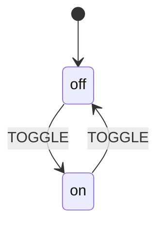

<div align="center">

# XState-StateMachine for Python

### The Complete State Machine Runtime — XState-Compatible, Production-Ready

[](https://www.python.org/)
[](https://pypi.org/project/xstate-statemachine/)
[](LICENSE)
[](tests/)

**Define** state machines in JSON or pure Python &bull; **Run** them with async or sync interpreters &bull; **Generate** production boilerplate with the CLI

[Installation](#1-installation) &bull; [Quick Start](#2-quick-start--your-first-machine-in-60-seconds) &bull; [Pythonic API](#5-pythonic-api) &bull; [CLI Generator](#19-cli-code-generator) &bull; [API Reference](#24-api-reference)

</div>

---

## Table of Contents

| # | Section | What You'll Learn |
|---|---------|-------------------|
| 1 | [Installation](#-installation) | How to install and verify |
| 2 | [Quick Start](#-quick-start-your-first-machine-in-60-seconds) | Build your first machine in 60 seconds |
| 3 | [Core Concepts](#-core-concepts) | States, events, transitions, guards, actions |
| 4 | [JSON Configuration](#-json-configuration-reference) | Every field in the XState JSON format |
| 5 | [Pythonic API](#-pythonic-api) | Define machines in pure Python (3 styles) |
| 6 | [Interpreters](#-interpreters) | Async vs Sync execution |
| 7 | [Context](#-context--the-machines-memory) | Mutable data attached to machines |
| 8 | [Guards](#-guards) | Conditional transitions |
| 9 | [Actions](#-actions) | Side effects on entry, exit, and transitions |
| 10 | [Services & Invoke](#-services--invoke) | Async operations and external calls |
| 11 | [Delayed Transitions](#-delayed-transitions-after) | Timer-based auto-transitions |
| 12 | [Hierarchical States](#-hierarchical-nested-states) | Nested parent/child states |
| 13 | [Parallel States](#-parallel-states) | Concurrent state regions |
| 14 | [Final States](#-final-states) | Terminal completion states |
| 15 | [Actor Model](#-actor-model) | Spawning child machines |
| 16 | [Plugins & Observability](#-plugins--observability) | Logging, inspection, custom hooks |
| 17 | [Snapshots](#-snapshots--state-restoration) | Save and restore machine state |
| 18 | [Diagram Export](#-diagram-export) | PlantUML and Mermaid generation |
| 19 | [CLI Code Generator](#-cli-code-generator) | Generate Python from XState JSON |
| 20 | [CLI Templates](#-cli-templates-deep-dive) | All 5 templates explained with examples |
| 21 | [Hierarchical Generation](#-hierarchical-machine-generation) | Parent/child machine code generation |
| 22 | [Advanced Patterns](#-advanced-patterns) | Real-world architecture patterns |
| 23 | [Troubleshooting](#-troubleshooting) | Common errors and fixes |
| 24 | [API Reference](#-api-reference) | Complete class and function signatures |
| 25 | [FAQ](#-faq) | Frequently asked questions |

---

## 1. Installation

```bash
pip install xstate-statemachine
```

**Verify it works:**

```bash
python -c "import xstate_statemachine; print(xstate_statemachine.__version__)"
# Output: 0.5.0
```

**For development (with test + lint tools):**

```bash
git clone https://github.com/your-repo/xstate-statemachine.git
cd xstate-statemachine
uv pip install -e . --group dev --group lint --group test
```

> **Requirements:** Python 3.9 or higher. No external dependencies beyond the standard library.

---

## 2. Quick Start — Your First Machine in 60 Seconds

### Option A: Pure Python (Recommended for New Projects)

```python
from xstate_statemachine import (
    State, build_machine, SyncInterpreter, action
)

# 1. Define states
off = State("off", initial=True)
on  = State("on")

# 2. Define transitions
off.to(on,  event="TOGGLE")
on.to(off, event="TOGGLE")

# 3. Define actions
@action
def log_toggle(interpreter, context, event, action_def):
    print(f"Light is now: {interpreter.active_state_ids}")

# 4. Build and run
machine = build_machine(
    id="lightSwitch",
    states=[off, on],
    actions=[log_toggle],
)

interpreter = SyncInterpreter(machine).start()
interpreter.send("TOGGLE")  # off -> on
interpreter.send("TOGGLE")  # on -> off
interpreter.stop()
```

### Option B: JSON Configuration (XState Compatible)

**Step 1 — Create `light_switch.json`:**

```json
{
  "id": "lightSwitch",
  "initial": "off",
  "states": {
    "off": {
      "on": { "TOGGLE": "on" }
    },
    "on": {
      "on": { "TOGGLE": "off" }
    }
  }
}
```

**Step 2 — Create `light_switch_logic.py`:**

```python
def toggle_light(interpreter, context, event, action_def):
    print(f"Switched! Now in: {interpreter.active_state_ids}")
```

**Step 3 — Run it:**

```python
import json
from xstate_statemachine import create_machine, SyncInterpreter

config = json.load(open("light_switch.json"))
machine = create_machine(config)

interpreter = SyncInterpreter(machine).start()
interpreter.send("TOGGLE")  # off -> on
interpreter.send("TOGGLE")  # on -> off
interpreter.stop()
```

### Option C: Generate Boilerplate with the CLI

```bash
# Generate production-ready Python from any XState JSON
xsm generate-template light_switch.json --template pythonic-class --force
```

This creates `light_switch_logic.py` and `light_switch_runner.py` with full type hints, docstrings, error handling, and logging.

---

## 3. Core Concepts

Before diving deeper, let's nail down the vocabulary. Every state machine has exactly these building blocks:

```
                    ┌─────────────────────────────────────────┐
                    │            STATE MACHINE                │
                    │                                         │
                    │   ┌─────────┐   TOGGLE   ┌─────────┐   │
                    │   │         │ ─────────► │         │   │
                    │   │   off   │             │   on    │   │
                    │   │ (init)  │ ◄───────── │         │   │
                    │   └─────────┘   TOGGLE   └─────────┘   │
                    │                                         │
                    │   context: { flips: 0 }                 │
                    └─────────────────────────────────────────┘
```

| Concept | What It Is | Example |
|---------|-----------|---------|
| **State** | A distinct mode the system can be in | `"off"`, `"loading"`, `"error"` |
| **Event** | Something that happens from outside | `"TOGGLE"`, `"SUBMIT"`, `"TIMEOUT"` |
| **Transition** | A rule: _"when event X happens in state A, go to state B"_ | `off --TOGGLE--> on` |
| **Guard** | A boolean condition on a transition | `"isAuthenticated"` — only transition if true |
| **Action** | A side effect that runs during a transition | `"logToggle"` — runs code when transitioning |
| **Context** | Mutable data the machine carries with it | `{ "retries": 0, "user": null }` |
| **Service** | An async operation invoked by a state | `"fetchUserData"` — API call, DB query, etc. |
| **Final State** | A terminal state — the machine is done | `"success"`, `"completed"` |

### The Golden Rule

> **A state machine can only be in ONE state at a time** (unless using parallel states).
> It can ONLY transition to another state when it receives an event that matches a transition rule.

This eliminates the "impossible states" problem. No more `isLoading && hasError && isAuthenticated` contradictions.

---

## 4. JSON Configuration Reference

XState JSON is the universal format. You can design machines visually at [stately.ai](https://stately.ai), export JSON, and run them directly with this library.

### Complete JSON Structure

```json
{
  "id": "myMachine",
  "initial": "idle",
  "context": {
    "retries": 0,
    "data": null
  },
  "states": {
    "idle": {
      "on": {
        "FETCH": {
          "target": "loading",
          "actions": "startLoading",
          "guard": "canFetch"
        }
      },
      "entry": "resetForm",
      "exit": "clearErrors"
    },
    "loading": {
      "invoke": {
        "src": "fetchData",
        "onDone": {
          "target": "success",
          "actions": "storeData"
        },
        "onError": {
          "target": "error",
          "actions": "storeError"
        }
      },
      "after": {
        "5000": "error"
      }
    },
    "success": {
      "type": "final"
    },
    "error": {
      "on": {
        "RETRY": {
          "target": "loading",
          "guard": "hasRetriesLeft",
          "actions": "incrementRetry"
        }
      }
    }
  }
}
```

### Field-by-Field Reference

| Field | Type | Required | Description |
|-------|------|----------|-------------|
| `id` | `string` | **Yes** | Unique machine identifier |
| `initial` | `string` | **Yes** | Name of the starting state |
| `context` | `object` | No | Initial mutable data |
| `states` | `object` | **Yes** | Map of state name to state config |

#### State Fields

| Field | Type | Description |
|-------|------|-------------|
| `on` | `object` | Map of event name to transition(s) |
| `entry` | `string \| array` | Action(s) to run when entering this state |
| `exit` | `string \| array` | Action(s) to run when leaving this state |
| `invoke` | `object \| array` | Service(s) to start when entering this state |
| `after` | `object` | Delayed transitions: `{ milliseconds: target }` |
| `type` | `string` | `"atomic"`, `"compound"`, `"parallel"`, or `"final"` |
| `initial` | `string` | Initial child state (for compound states) |
| `states` | `object` | Nested child states (makes this a compound state) |
| `onDone` | `object` | Transition when all child regions complete |
| `always` | `object \| array` | Eventless (transient) transitions, evaluated immediately |

#### Transition Formats

```json
// Simple: just a target state name
"CLICK": "active"

// With options
"CLICK": {
  "target": "active",
  "guard": "isEnabled",
  "actions": "logClick"
}

// Multiple transitions (first matching guard wins)
"SUBMIT": [
  { "target": "success", "guard": "isValid" },
  { "target": "error" }
]

// Multiple actions
"SAVE": {
  "target": "saved",
  "actions": ["validate", "persist", "notify"]
}
```

#### Eventless Transitions (`always`)

Eventless transitions fire immediately when a state is entered (no event needed). They're evaluated in order — the first matching guard wins:

```json
{
  "id": "router",
  "initial": "checking",
  "context": {"role": "admin"},
  "states": {
    "checking": {
      "always": [
        {"target": "adminPanel",  "guard": "isAdmin"},
        {"target": "userDashboard", "guard": "isUser"},
        {"target": "login"}
      ]
    },
    "adminPanel":    {},
    "userDashboard": {},
    "login":         {}
  }
}
```

When the machine enters `checking`, it immediately evaluates the `always` transitions and moves to the first matching target — no event required.

---

## 5. Pythonic API

> **New in v0.5.0** — Define state machines in pure Python. No JSON needed.

Three styles, same result. Pick the one that matches your team's preference:

| Style | Best For | Entry Point |
|-------|----------|-------------|
| **Class-Based** | OOP teams, large machines | `class MyMachine(StateMachine)` |
| **Builder** | Fluent/chained construction | `MachineBuilder("id").state(...).build()` |
| **Functional** | Simple, explicit assembly | `build_machine(id=..., states=[...])` |

All three compile to the same internal `MachineNode` and work with both `Interpreter` and `SyncInterpreter`.

### Style 1: Class-Based (`StateMachine`)

```python
from xstate_statemachine import (
    State, StateMachine, SyncInterpreter,
    action, guard, service
)

class TrafficLight(StateMachine):
    machine_id = "trafficLight"

    # States
    green  = State("green",  initial=True)
    yellow = State("yellow")
    red    = State("red")

    # Transitions
    slow_down  = green.to(yellow, event="TIMER")
    stop       = yellow.to(red,   event="TIMER")
    go         = red.to(green,    event="TIMER")

    # Actions
    @action
    def log_change(self, interpreter, context, event, action_def):
        print(f"Light changed to: {interpreter.active_state_ids}")

    # Guards
    @guard
    def is_rush_hour(self, context, event):
        return context.get("hour", 12) in range(7, 10)

# Run it
machine = TrafficLight.create_machine()
interp = SyncInterpreter(machine).start()
interp.send("TIMER")  # green -> yellow
interp.send("TIMER")  # yellow -> red
interp.send("TIMER")  # red -> green
interp.stop()
```

### Style 2: Builder (`MachineBuilder`)

```python
from xstate_statemachine import MachineBuilder, SyncInterpreter, action

@action
def log_change(interpreter, context, event, action_def):
    print(f"Now: {interpreter.active_state_ids}")

machine = (
    MachineBuilder("trafficLight")
    .state("green",  initial=True)
    .state("yellow")
    .state("red")
    .transition("green",  "TIMER", "yellow")
    .transition("yellow", "TIMER", "red")
    .transition("red",    "TIMER", "green")
    .action("logChange", log_change)
    .build()
)

interp = SyncInterpreter(machine).start()
interp.send("TIMER")
interp.send("TIMER")
interp.stop()
```

### Style 3: Functional (`build_machine`)

```python
from xstate_statemachine import State, build_machine, SyncInterpreter, action

# Define states
green  = State("green",  initial=True)
yellow = State("yellow")
red    = State("red")

# Define transitions
green.to(yellow, event="TIMER")
yellow.to(red,   event="TIMER")
red.to(green,    event="TIMER")

# Define logic
@action
def log_change(interpreter, context, event, action_def):
    print(f"Now: {interpreter.active_state_ids}")

# Build and run
machine = build_machine(
    id="trafficLight",
    states=[green, yellow, red],
    actions=[log_change],
)

interp = SyncInterpreter(machine).start()
interp.send("TIMER")
interp.send("TIMER")
interp.stop()
```

### Decorator Details

All three decorators support custom naming:

```python
# Auto-naming: snake_case -> camelCase
@action
def increment_counter(interpreter, context, event, action_def):
    context["count"] += 1
# Registered as "incrementCounter"

# Explicit naming
@action("myCustomName")
def some_function(interpreter, context, event, action_def):
    pass
# Registered as "myCustomName"

# Guard signature (no interpreter, returns bool)
@guard
def is_valid(context, event):
    return context.get("value", 0) > 0

# Service signature (returns dict)
@service
def fetch_data(interpreter, context, event):
    return {"result": "some_data"}
```

---

## 6. Interpreters

Interpreters **execute** a machine. They process events, evaluate guards, run actions, and manage state transitions.

### Async Interpreter (Default)

For `asyncio`-based applications, web servers, or any async codebase:

```python
import asyncio
from xstate_statemachine import create_machine, Interpreter

async def main():
    config = {
        "id": "fetchMachine",
        "initial": "idle",
        "states": {
            "idle":    {"on": {"FETCH": "loading"}},
            "loading": {"on": {"SUCCESS": "done", "ERROR": "error"}},
            "done":    {"type": "final"},
            "error":   {"on": {"RETRY": "loading"}}
        }
    }

    machine = create_machine(config)
    interpreter = Interpreter(machine)

    await interpreter.start()
    await interpreter.send("FETCH")     # idle -> loading
    await interpreter.send("SUCCESS")   # loading -> done
    await interpreter.stop()

    print(interpreter.active_state_ids)
    # {'fetchMachine.done'}

asyncio.run(main())
```

### Sync Interpreter

For scripts, CLI tools, Django views, or anywhere without an event loop:

```python
from xstate_statemachine import create_machine, SyncInterpreter

config = {
    "id": "toggleMachine",
    "initial": "inactive",
    "states": {
        "inactive": {"on": {"ACTIVATE": "active"}},
        "active":   {"on": {"DEACTIVATE": "inactive"}}
    }
}

machine = create_machine(config)
interpreter = SyncInterpreter(machine).start()

interpreter.send("ACTIVATE")     # inactive -> active
interpreter.send("DEACTIVATE")   # active -> inactive
interpreter.stop()
```

### Key Interpreter Properties

| Property / Method | Type | Description |
|-------------------|------|-------------|
| `.start()` | method | Initialize and enter the initial state |
| `.stop()` | method | Exit all states and shut down |
| `.send(event)` | method | Send an event (string, dict, or `Event` object) |
| `.send_events([...])` | method | Send multiple events in sequence |
| `.active_state_ids` | `set[str]` | Currently active state IDs |
| `.context` | `dict` | Current machine context (mutable) |
| `.is_running` | `bool` | Whether the interpreter is active |

### Sending Events

```python
# String shorthand
interpreter.send("CLICK")

# With payload data
interpreter.send("LOGIN", username="alice", password="secret")

# Event object
from xstate_statemachine import Event
interpreter.send(Event(type="LOGIN", payload={"username": "alice"}))

# Dict form
interpreter.send({"type": "LOGIN", "username": "alice"})

# Multiple events at once
interpreter.send_events(["STEP_1", "STEP_2", "STEP_3"])
```

---

## 7. Context — The Machine's Memory

Context is a **mutable dictionary** that travels with the machine. Use it to track data across transitions.

### JSON Definition

```json
{
  "id": "counterMachine",
  "initial": "active",
  "context": {
    "count": 0,
    "lastUpdated": null,
    "history": []
  },
  "states": {
    "active": {
      "on": {
        "INCREMENT": {
          "actions": "addOne"
        },
        "RESET": {
          "actions": "resetCount"
        }
      }
    }
  }
}
```

### Modifying Context in Actions

```python
from xstate_statemachine import create_machine, SyncInterpreter, MachineLogic

config = {
    "id": "counter",
    "initial": "counting",
    "context": {"count": 0, "history": []},
    "states": {
        "counting": {
            "on": {
                "INCREMENT": {"actions": "addOne"},
                "DECREMENT": {"actions": "subtractOne"}
            }
        }
    }
}

class CounterLogic(MachineLogic):
    def addOne(self, interpreter, context, event, action_def):
        context["count"] += 1
        context["history"].append(f"+1 -> {context['count']}")

    def subtractOne(self, interpreter, context, event, action_def):
        context["count"] -= 1
        context["history"].append(f"-1 -> {context['count']}")

machine = create_machine(config, logic=CounterLogic())
interp = SyncInterpreter(machine).start()

interp.send("INCREMENT")
interp.send("INCREMENT")
interp.send("DECREMENT")

print(interp.context)
# {"count": 1, "history": ["+1 -> 1", "+1 -> 2", "-1 -> 1"]}

interp.stop()
```

### Pythonic API Context

```python
from xstate_statemachine import State, StateMachine, action

class Counter(StateMachine):
    machine_id = "counter"
    initial_context = {"count": 0}

    counting = State("counting", initial=True)

    increment = counting.to(counting, event="INCREMENT", actions="addOne")

    @action
    def add_one(self, interpreter, context, event, action_def):
        context["count"] += 1
```

---

## 8. Guards

Guards are **boolean functions** that control whether a transition is allowed. If a guard returns `False`, the transition is blocked and the machine stays in its current state.

### JSON Guards

```json
{
  "id": "ageGate",
  "initial": "checking",
  "context": {"age": 16},
  "states": {
    "checking": {
      "on": {
        "VERIFY": [
          {"target": "allowed",  "guard": "isAdult"},
          {"target": "rejected"}
        ]
      }
    },
    "allowed":  {},
    "rejected": {}
  }
}
```

The first transition whose guard passes wins. The last transition (no guard) is the fallback.

### Guard Implementation

```python
class AgeLogic(MachineLogic):
    def isAdult(self, context, event):
        return context.get("age", 0) >= 18
```

### Pythonic Guards

```python
from xstate_statemachine import State, StateMachine, guard

class AgeGate(StateMachine):
    machine_id = "ageGate"
    initial_context = {"age": 16}

    checking = State("checking", initial=True)
    allowed  = State("allowed")
    rejected = State("rejected")

    # Multiple guarded transitions combined with |
    verify = (
        checking.to(allowed,  event="VERIFY", guard="isAdult")
        | checking.to(rejected, event="VERIFY")
    )

    @guard
    def is_adult(self, context, event):
        return context.get("age", 0) >= 18
```

> **Note:** Guard functions receive `(context, event)` — NOT `(interpreter, context, event, action_def)`. They must return a `bool`. Guards must be **synchronous** — async guards will raise `NotSupportedError`.

---

## 9. Actions

Actions are **side effects** that execute at specific moments. They don't control flow — they _do_ things (log, update context, send notifications).

### When Actions Run

| Trigger | When It Fires |
|---------|---------------|
| **Entry actions** | When a state is entered |
| **Exit actions** | When a state is exited |
| **Transition actions** | During a transition (between exit and entry) |

### JSON Actions

```json
{
  "id": "formMachine",
  "initial": "editing",
  "states": {
    "editing": {
      "entry": "loadDraft",
      "exit":  "saveDraft",
      "on": {
        "SUBMIT": {
          "target": "submitting",
          "actions": ["validate", "clearErrors"]
        }
      }
    },
    "submitting": {
      "entry": "showSpinner"
    }
  }
}
```

**Execution order for `SUBMIT`:**
1. `saveDraft` (exit action on `editing`)
2. `validate`, `clearErrors` (transition actions)
3. `showSpinner` (entry action on `submitting`)

### Action Implementation

```python
class FormLogic(MachineLogic):
    def loadDraft(self, interpreter, context, event, action_def):
        print("Loading saved draft...")

    def saveDraft(self, interpreter, context, event, action_def):
        print("Auto-saving draft...")

    def validate(self, interpreter, context, event, action_def):
        print("Validating form data...")

    def clearErrors(self, interpreter, context, event, action_def):
        context["errors"] = []

    def showSpinner(self, interpreter, context, event, action_def):
        print("Showing loading spinner...")
```

### Pythonic Entry/Exit Actions

```python
from xstate_statemachine import State, StateMachine

class FormMachine(StateMachine):
    machine_id = "form"

    editing    = State("editing", initial=True)
    submitting = State("submitting")

    submit = editing.to(submitting, event="SUBMIT")

    # Decorator-style entry/exit
    @editing.enter
    def on_enter_editing(self, interpreter, context, event, action_def):
        print("Entered editing mode")

    @editing.exit
    def on_exit_editing(self, interpreter, context, event, action_def):
        print("Left editing mode")
```

---

## 10. Services & Invoke

Services represent **async operations** — API calls, database queries, file reads, timers. A state can `invoke` a service when it's entered, and transition based on the result.

### JSON Invoke

```json
{
  "id": "userLoader",
  "initial": "idle",
  "states": {
    "idle": {
      "on": {"LOAD": "loading"}
    },
    "loading": {
      "invoke": {
        "src": "fetchUser",
        "onDone": {
          "target": "loaded",
          "actions": "storeUser"
        },
        "onError": {
          "target": "error",
          "actions": "storeError"
        }
      }
    },
    "loaded": {"type": "final"},
    "error":  {"on": {"RETRY": "loading"}}
  }
}
```

### Service Implementation

```python
# Async service
class UserLogic(MachineLogic):
    async def fetchUser(self, interpreter, context, event):
        import aiohttp
        async with aiohttp.ClientSession() as session:
            resp = await session.get("https://api.example.com/user/1")
            return await resp.json()

    def storeUser(self, interpreter, context, event, action_def):
        context["user"] = event.data  # onDone event carries the return value

    def storeError(self, interpreter, context, event, action_def):
        context["error"] = str(event.data)
```

### Sync Services

With `SyncInterpreter`, services run synchronously:

```python
class UserLogicSync(MachineLogic):
    def fetchUser(self, interpreter, context, event):
        import requests
        resp = requests.get("https://api.example.com/user/1")
        return resp.json()
```

---

## 11. Delayed Transitions (`after`)

States can automatically transition after a time delay, perfect for timeouts, polling, and auto-progression.

### JSON After

```json
{
  "id": "sessionTimeout",
  "initial": "active",
  "states": {
    "active": {
      "after": {
        "300000": "warning"
      },
      "on": {"ACTIVITY": "active"}
    },
    "warning": {
      "after": {
        "30000": "expired"
      },
      "on": {"EXTEND": "active"}
    },
    "expired": {
      "type": "final"
    }
  }
}
```

This machine:
1. Starts in `active`
2. After 5 minutes of inactivity, moves to `warning`
3. User gets 30 seconds to click "EXTEND" or it moves to `expired`
4. Any `ACTIVITY` event resets the active timer

### Multiple Timers

A state can have multiple `after` timers simultaneously:

```json
"monitoring": {
  "after": {
    "5000":  {"target": "monitoring", "actions": "heartbeat"},
    "60000": {"target": "stale",     "guard": "noRecentData"},
    "300000": "timeout"
  }
}
```

### Pythonic After

```python
active  = State("active",  initial=True, after={300000: "warning"})
warning = State("warning", after={30000: "expired"})
expired = State("expired", final=True)
```

---

## 12. Hierarchical (Nested) States

Compound states contain child states, creating a tree structure. This models complex flows without a spaghetti mess of flat states.

### Example: Authentication Flow

```json
{
  "id": "auth",
  "initial": "loggedOut",
  "states": {
    "loggedOut": {
      "on": {"LOGIN": "loggedIn"}
    },
    "loggedIn": {
      "initial": "dashboard",
      "states": {
        "dashboard": {
          "on": {"VIEW_PROFILE": "profile", "VIEW_SETTINGS": "settings"}
        },
        "profile": {
          "on": {"BACK": "dashboard"}
        },
        "settings": {
          "on": {"BACK": "dashboard"}
        }
      },
      "on": {
        "LOGOUT": "loggedOut"
      }
    }
  }
}
```

```
              ┌──────────────── loggedIn ────────────────┐
              │                                          │
              │   ┌───────────┐    VIEW     ┌────────┐   │
LOGIN         │   │ dashboard │ ─────────► │ profile│   │
  ────────►   │   │  (init)   │ ◄───────── │        │   │
              │   └───────────┘    BACK    └────────┘   │
              │        │                                 │
              │   VIEW_SETTINGS                          │
              │        ▼                                 │
              │   ┌──────────┐                           │
              │   │ settings │                           │
              │   └──────────┘                           │
              │                                          │
              └──────── LOGOUT ──────────────────────────┘
                        │
                        ▼
              ┌──────────────┐
              │  loggedOut   │
              └──────────────┘
```

**Key behavior:** The `LOGOUT` event on the parent `loggedIn` state catches the event no matter which child state is active. This is the power of hierarchy — parent transitions apply to all children.

### Pythonic Hierarchical States

```python
from xstate_statemachine import State, StateMachine

class AuthMachine(StateMachine):
    machine_id = "auth"

    logged_out = State("loggedOut", initial=True)
    logged_in  = State("loggedIn", states=[
        State("dashboard", initial=True),
        State("profile"),
        State("settings"),
    ])

    login  = logged_out.to(logged_in,  event="LOGIN")
    logout = logged_in.to(logged_out, event="LOGOUT")
```

---

## 13. Parallel States

Parallel states represent **concurrent** activity — multiple regions operating independently at the same time.

### Example: Media Player

```json
{
  "id": "mediaPlayer",
  "initial": "playing",
  "states": {
    "playing": {
      "type": "parallel",
      "states": {
        "video": {
          "initial": "loading",
          "states": {
            "loading":  {"on": {"VIDEO_LOADED": "showing"}},
            "showing":  {},
            "buffering": {}
          }
        },
        "audio": {
          "initial": "muted",
          "states": {
            "muted":   {"on": {"UNMUTE": "playing"}},
            "playing": {"on": {"MUTE": "muted"}}
          }
        },
        "controls": {
          "initial": "visible",
          "states": {
            "visible": {"after": {"3000": "hidden"}},
            "hidden":  {"on": {"MOUSE_MOVE": "visible"}}
          }
        }
      }
    }
  }
}
```

All three regions (`video`, `audio`, `controls`) are active simultaneously. Events can target any region independently.

### Pythonic Parallel States

```python
video    = State("video",  initial=True, parallel=False)
audio    = State("audio")
controls = State("controls")

player = State("playing", parallel=True, states=[video, audio, controls])
```

---

## 14. Final States

A final state signals that a machine (or a compound state region) has **completed**. No outgoing transitions are allowed.

```json
{
  "id": "checkout",
  "initial": "cart",
  "states": {
    "cart":      {"on": {"CHECKOUT": "payment"}},
    "payment":  {"on": {"PAY": "confirmation"}},
    "confirmation": {"type": "final"}
  }
}
```

When a final state is entered inside a compound state, it triggers a `done.state.*` event on the parent.

### Pythonic Final

```python
confirmed = State("confirmation", final=True)
```

---

## 15. Actor Model

Actors let you **spawn child machines** from a parent machine. Each actor has its own state, context, and lifecycle — completely isolated.

### Spawning Actors

In actions, use the `spawn_` prefix naming convention:

```python
class ParentLogic(MachineLogic):
    def spawn_child(self, interpreter, context, event, action_def):
        """Spawn a child actor. The suffix after 'spawn_' is the actor key."""
        child_config = {
            "id": "childMachine",
            "initial": "idle",
            "states": {
                "idle": {"on": {"DO_WORK": "working"}},
                "working": {"on": {"DONE": "idle"}}
            }
        }
        return create_machine(child_config)
```

The `SyncInterpreter` also supports **blocking actors** with the `spawn_blocking_` prefix, which wait for the child machine to reach a final state before continuing.

---

## 16. Plugins & Observability

Plugins observe machine execution without modifying behavior. Use them for logging, metrics, debugging, and testing.

### Built-in: LoggingInspector

```python
from xstate_statemachine import (
    create_machine, SyncInterpreter, LoggingInspector
)

config = {
    "id": "demo",
    "initial": "a",
    "states": {
        "a": {"on": {"GO": "b"}},
        "b": {"type": "final"}
    }
}

machine = create_machine(config)
interp = SyncInterpreter(machine)
interp.plugins = [LoggingInspector()]  # Attach plugin

interp.start()
interp.send("GO")
interp.stop()
```

**Output:**
```
🕵️ [INSPECT] Transition: ['demo.a'] -> ['demo.b'] on Event 'GO'
🕵️ [INSPECT] New Context: {}
```

> **Note:** `LoggingInspector` uses Python's `logging` module at `INFO` level. All messages are prefixed with `🕵️ [INSPECT]`. Configure `logging.basicConfig(level=logging.INFO)` to see output.

### Custom Plugin

```python
from xstate_statemachine import PluginBase

class MetricsPlugin(PluginBase):
    def __init__(self):
        self.transition_count = 0

    def on_transition(self, interpreter, from_states, to_states, transition):
        """Called on every transition.

        Args:
            interpreter: The interpreter instance.
            from_states: Set of StateNode objects active before the transition.
            to_states: Set of StateNode objects active after the transition.
            transition: The TransitionDefinition that was taken.
        """
        self.transition_count += 1
        from_ids = {s.id for s in from_states}
        to_ids = {s.id for s in to_states}
        print(f"Transition #{self.transition_count}: {from_ids} -> {to_ids}")

    def on_event_received(self, interpreter, event):
        print(f"Event: {event.type}")

    def on_action_execute(self, interpreter, action):
        """Called before each action runs.

        Args:
            interpreter: The interpreter instance.
            action: The ActionDefinition of the action to be executed.
        """
        print(f"Executing action: {action.type}")

    def on_guard_evaluated(self, interpreter, guard_name, event, result):
        """Called after a guard is evaluated.

        Args:
            interpreter: The interpreter instance.
            guard_name: Name of the guard function.
            event: The event that triggered evaluation.
            result: Boolean result of the guard.
        """
        print(f"Guard '{guard_name}' -> {result}")
```

### Plugin Hooks

| Hook | Signature | When It Fires |
|------|-----------|--------------|
| `on_interpreter_start` | `(interpreter)` | Machine starts |
| `on_interpreter_stop` | `(interpreter)` | Machine stops |
| `on_event_received` | `(interpreter, event)` | Event is received |
| `on_transition` | `(interpreter, from_states, to_states, transition)` | State transition occurs |
| `on_action_execute` | `(interpreter, action)` | Action is about to execute |
| `on_guard_evaluated` | `(interpreter, guard_name, event, result)` | Guard is checked |
| `on_service_start` | `(interpreter, invocation)` | Service begins |
| `on_service_done` | `(interpreter, invocation, result)` | Service completes successfully |
| `on_service_error` | `(interpreter, invocation, error)` | Service throws an error |

---

## 17. Snapshots & State Restoration

Save and restore machine state — perfect for long-running workflows, persistence, crash recovery, or testing.

### `get_snapshot()` — Capture Current State

The `get_snapshot()` method captures a JSON string of the interpreter's current state using the Memento pattern:

```python
from xstate_statemachine import create_machine, SyncInterpreter

config = {
    "id": "workflow",
    "initial": "step1",
    "context": {"progress": 0},
    "states": {
        "step1": {"on": {"NEXT": "step2"}},
        "step2": {"on": {"NEXT": "step3"}},
        "step3": {"type": "final"}
    }
}

machine = create_machine(config)
interp = SyncInterpreter(machine).start()

interp.send("NEXT")  # step1 -> step2
interp.context["progress"] = 50

# Save a snapshot (returns a JSON string)
snapshot_json = interp.get_snapshot()
print(snapshot_json)
# {
#   "status": "started",
#   "context": {"progress": 50},
#   "state_ids": ["workflow.step2"]
# }

interp.stop()
```

The snapshot captures three things:
- **`status`** — the interpreter's current status (`"started"`, `"stopped"`)
- **`context`** — the full context dictionary
- **`state_ids`** — list of all currently active state IDs

### `from_snapshot()` — Restore from Saved State

The `from_snapshot()` class method creates a new interpreter restored to a previous state:

```python
# Later (or in a different process)...
import json

machine = create_machine(config)  # Same machine definition

# Restore from snapshot
restored = SyncInterpreter.from_snapshot(snapshot_json, machine)

print(restored.active_state_ids)  # {'workflow.step2'}
print(restored.context)           # {'progress': 50}

# Continue from where we left off
restored.send("NEXT")             # step2 -> step3
restored.stop()
```

> **Important:** `from_snapshot()` performs a **static restoration**. It does NOT re-run entry actions, restart invoked services, or resume `after` timers that were active when the snapshot was taken. It restores the state configuration and context only.

### Persistence Example

```python
import json
from pathlib import Path

# Save to file
snapshot = interp.get_snapshot()
Path("machine_state.json").write_text(snapshot)

# Load from file
saved = Path("machine_state.json").read_text()
restored = SyncInterpreter.from_snapshot(saved, machine)
```

### Async Snapshots

Works identically with `Interpreter` (async):

```python
snapshot = interp.get_snapshot()                       # sync call
restored = Interpreter.from_snapshot(snapshot, machine) # creates async interpreter
await restored.start()  # Note: must start after restore if needed
```

---

## 18. Diagram Export

Generate visual diagrams from any machine:

```python
machine = create_machine(config)

# PlantUML format
plantuml = machine.to_plantuml()
print(plantuml)

# Mermaid format (works in GitHub README)
mermaid = machine.to_mermaid()
print(mermaid)
```

**Example Mermaid output:**


---

## 19. CLI Code Generator

The `xsm` CLI generates production-ready Python code from XState JSON configs. It creates complete, runnable logic and runner files with type hints, docstrings, error handling, and logging.

### Basic Usage

```bash
# Generate 2 files: logic + runner (default)
xsm generate-template my_machine.json

# Short alias
xsm gt my_machine.json

# Outputs:
#   my_machine_logic.py    <- Action/guard/service stubs
#   my_machine_runner.py   <- Interpreter bootstrap code
```

### All CLI Options

```
xsm generate-template [JSON_FILES...] [OPTIONS]

Positional Arguments:
  json_files                One or more XState JSON config files

Input Options:
  -j,  --json FILE          Additional JSON input (repeatable)
  -jp, --json-parent FILE   Designate parent machine for hierarchy
  -jc, --json-child FILE    Designate child machine(s) (repeatable)

Template Options:
  -t,  --template TEMPLATE  Code generation template (see below)
  -s,  --style STYLE        DEPRECATED: use --template instead

Output Options:
  -o,  --output DIR         Output directory (default: same as JSON)
  -fc, --file-count {1,2}   1 = merged single file, 2 = separate (default)
  -f,  --force              Overwrite existing files without asking

Behavior Options:
  -am, --async-mode BOOL    Async (yes) or sync (no) interpreter
  -l,  --loader BOOL        Use LogicLoader auto-discovery (default: yes)
  --log BOOL                Include logging statements (default: yes)
  --sleep BOOL              Add sleep between events (default: yes)
  --sleep-time SECONDS      Sleep duration between events (default: 2)
```

### Template Selection

| Template | Style | Machine Config Source | Best For |
|----------|-------|----------------------|----------|
| `pythonic-class` | Class-based OOP | Compiled into Python class | New Python-native projects |
| `pythonic-builder` | Fluent builder | Built via `MachineBuilder` | Dynamic/programmatic assembly |
| `pythonic-functional` | Functional | Built via `build_machine()` | Simple, explicit construction |
| `class-json` | Class-based OOP | Loaded from JSON at runtime | Existing JSON-based projects |
| `function-json` | Module functions | Loaded from JSON at runtime | Lightweight JSON-based projects |

```bash
# Examples of each template
xsm gt machine.json --template pythonic-class
xsm gt machine.json --template pythonic-builder
xsm gt machine.json --template pythonic-functional
xsm gt machine.json --template class-json
xsm gt machine.json --template function-json
```

### Common Recipes

```bash
# Sync mode (for scripts/CLI tools)
xsm gt machine.json --template pythonic-class --async-mode no

# Single merged file
xsm gt machine.json --template pythonic-functional --file-count 1

# No logging, no sleep (clean output)
xsm gt machine.json --template pythonic-class --log no --sleep no

# Force overwrite + custom output dir
xsm gt machine.json -o ./generated/ --force

# Multiple JSON files
xsm gt auth.json profile.json settings.json
```

---

## 20. CLI Templates Deep Dive

Given this input JSON:

```json
{
  "id": "checkout",
  "initial": "cart",
  "context": {"total": 0},
  "states": {
    "cart": {
      "on": {
        "CHECKOUT": {
          "target": "payment",
          "guard": "hasItems",
          "actions": "calculateTotal"
        }
      }
    },
    "payment": {
      "invoke": {
        "src": "processPayment",
        "onDone": {"target": "confirmed", "actions": "sendReceipt"},
        "onError": {"target": "cart", "actions": "showError"}
      }
    },
    "confirmed": {"type": "final"}
  }
}
```

Here's what each template generates:

### Template: `pythonic-class`

```bash
xsm gt checkout.json --template pythonic-class --async-mode no
```

**Generated `checkout_logic.py`:**

```python
"""Checkout state machine -- generated by xsm CLI."""
import logging
from typing import Any, Dict, Optional, Union

from xstate_statemachine import (
    Interpreter,
    State,
    StateMachine,
    SyncInterpreter,
    action,
    guard,
    service,
)

logger = logging.getLogger(__name__)


class CheckoutMachine(StateMachine):
    """Checkout state machine."""

    machine_id = "checkout"
    initial_context = {"total": 0}

    # States
    cart      = State("cart", initial=True)
    payment   = State("payment", invoke={"src": "processPayment", ...})
    confirmed = State("confirmed")

    # Transitions
    checkout_event = cart.to(
        payment,
        event="CHECKOUT",
        guard="hasItems",
        actions="calculateTotal"
    )

    # Actions
    @action
    def calculate_total(
        self,
        interpreter: Union[Interpreter, SyncInterpreter],
        context: Dict[str, Any],
        event: Any,
        action_def: Any,
    ) -> None:
        """Execute the ``calculateTotal`` action."""
        try:
            logger.info("Executing action: calculateTotal")
            # TODO: implement action logic
            pass
        except Exception:
            logger.exception("Action 'calculateTotal' failed")
            raise

    # Guards
    @guard
    def has_items(self, context: Dict[str, Any], event: Any) -> bool:
        """Evaluate the ``hasItems`` guard."""
        logger.info("Evaluating guard: hasItems")
        # TODO: implement guard logic
        return True

    # Services
    @service
    def process_payment(
        self,
        interpreter: Union[Interpreter, SyncInterpreter],
        context: Dict[str, Any],
        event: Any,
    ) -> Dict[str, Any]:
        """Run the ``processPayment`` service."""
        try:
            logger.info("Running service: processPayment")
            # TODO: implement service logic
            return {"result": "done"}
        except Exception:
            logger.exception("Service 'processPayment' failed")
            raise
```

### Template: `pythonic-builder`

```bash
xsm gt checkout.json --template pythonic-builder --async-mode no
```

**Generated structure:**

```python
@action
def calculate_total(interpreter, context, event, action_def):
    """Execute the ``calculateTotal`` action."""
    ...

@guard
def has_items(context, event):
    """Evaluate the ``hasItems`` guard."""
    return True

@service
def process_payment(interpreter, context, event):
    """Run the ``processPayment`` service."""
    return {"result": "done"}

def build():
    """Build the checkout machine using MachineBuilder."""
    return (
        MachineBuilder("checkout")
        .context({"total": 0})
        .state("cart", initial=True)
        .state("payment", invoke={...})
        .state("confirmed")
        .transition("cart", "CHECKOUT", "payment",
                     guard="hasItems", actions="calculateTotal")
        .action("calculateTotal", calculate_total)
        .guard("hasItems", has_items)
        .service("processPayment", process_payment)
        .build()
    )
```

### Template: `pythonic-functional`

```bash
xsm gt checkout.json --template pythonic-functional --async-mode no
```

**Generated structure:**

```python
@action
def calculate_total(interpreter, context, event, action_def):
    ...

@guard
def has_items(context, event):
    return True

@service
def process_payment(interpreter, context, event):
    return {"result": "done"}

def build():
    """Build the checkout machine using build_machine()."""
    cart      = State("cart", initial=True)
    payment   = State("payment", invoke={...})
    confirmed = State("confirmed")

    cart.to(payment, event="CHECKOUT",
            guard="hasItems", actions="calculateTotal")

    return build_machine(
        id="checkout",
        states=[cart, payment, confirmed],
        actions=[calculate_total],
        guards=[has_items],
        services=[process_payment],
    )
```

### Template: `class-json`

```bash
xsm gt checkout.json --template class-json
```

**Generated structure:**

```python
class CheckoutLogic:
    """Logic provider for checkout machine."""

    def calculateTotal(self, interpreter, context, event, action_def):
        """Execute the ``calculateTotal`` action."""
        ...

    def hasItems(self, context, event):
        """Evaluate the ``hasItems`` guard."""
        return True

    def processPayment(self, interpreter, context, event):
        """Run the ``processPayment`` service."""
        return {"result": "done"}
```

The runner loads `checkout.json` at runtime and binds the logic class.

### Template: `function-json`

```bash
xsm gt checkout.json --template function-json
```

**Generated structure:**

```python
def calculateTotal(interpreter, context, event, action_def):
    """Execute the ``calculateTotal`` action."""
    ...

def hasItems(context, event):
    """Evaluate the ``hasItems`` guard."""
    return True

def processPayment(interpreter, context, event):
    """Run the ``processPayment`` service."""
    return {"result": "done"}
```

The runner loads JSON and binds logic via `logic_modules=[module]`.

### Template Comparison

| Feature | `pythonic-class` | `pythonic-builder` | `pythonic-functional` | `class-json` | `function-json` |
|---------|:---:|:---:|:---:|:---:|:---:|
| JSON needed at runtime | No | No | No | Yes | Yes |
| Logic in class | Yes | No | No | Yes | No |
| Type hints | Yes | Yes | Yes | Yes | Yes |
| Decorators | `@action` etc. | `@action` etc. | `@action` etc. | No | No |
| OOP pattern | Yes | No | No | Yes | No |
| Best for large machines | Yes | Moderate | Moderate | Yes | No |

---

## 21. Hierarchical Machine Generation

When you have a **parent machine that spawns child machines** (actor model), the CLI generates code that wires them together.

### Setup

```bash
# Parent machine invokes child machines
xsm gt --json-parent parent.json --json-child child_a.json --json-child child_b.json
```

Or let the CLI **auto-detect** the hierarchy:

```bash
# CLI guesses which JSON is the parent (based on invoke count)
xsm gt parent.json child_a.json child_b.json
```

The generated runner will:
1. Load both parent and child JSON configs
2. Create the parent machine with logic provider
3. Create child machines as actors
4. Wire up actor spawning and event forwarding

### Generated Hierarchy Runner Structure

```python
# Parent machine setup
parent_cfg = json.loads(Path("parent.json").read_text())
parent_logic = ParentLogic()
parent_machine = create_machine(parent_cfg, logic_providers=[parent_logic])
parent_interp = SyncInterpreter(parent_machine).start()

# Child actor configs
actor_cfgs = {
    "child_a": json.loads(Path("child_a.json").read_text()),
    "child_b": json.loads(Path("child_b.json").read_text()),
}

# Send events to parent
parent_interp.send("START")

# Send events to children
for name, cfg in actor_cfgs.items():
    child = create_machine(cfg)
    child_interp = SyncInterpreter(child).start()
    # ... simulate child events
```

---

## 22. Advanced Patterns

### Pattern 1: Retry with Exponential Backoff

```json
{
  "id": "retryMachine",
  "initial": "idle",
  "context": {"retries": 0, "maxRetries": 3},
  "states": {
    "idle": {
      "on": {"START": "attempting"}
    },
    "attempting": {
      "invoke": {
        "src": "apiCall",
        "onDone": "success",
        "onError": [
          {"target": "waiting", "guard": "canRetry", "actions": "incrementRetry"},
          {"target": "failed"}
        ]
      }
    },
    "waiting": {
      "after": {
        "1000": "attempting"
      }
    },
    "success": {"type": "final"},
    "failed":  {"type": "final"}
  }
}
```

```python
class RetryLogic(MachineLogic):
    def canRetry(self, context, event):
        return context["retries"] < context["maxRetries"]

    def incrementRetry(self, interpreter, context, event, action_def):
        context["retries"] += 1

    def apiCall(self, interpreter, context, event):
        import requests
        resp = requests.get("https://api.example.com/data")
        resp.raise_for_status()
        return resp.json()
```

### Pattern 2: Form Wizard with Validation

```python
from xstate_statemachine import State, StateMachine, guard, action

class FormWizard(StateMachine):
    machine_id = "wizard"
    initial_context = {
        "step1_data": {},
        "step2_data": {},
        "errors": [],
    }

    step1 = State("step1", initial=True)
    step2 = State("step2")
    step3 = State("step3")
    review = State("review")
    submitted = State("submitted", final=True)

    # Forward transitions (guarded)
    next_1 = step1.to(step2, event="NEXT", guard="isStep1Valid")
    next_2 = step2.to(step3, event="NEXT", guard="isStep2Valid")
    next_3 = step3.to(review, event="NEXT")
    submit = review.to(submitted, event="SUBMIT")

    # Back transitions (always allowed)
    back_2 = step2.to(step1, event="BACK")
    back_3 = step3.to(step2, event="BACK")
    back_r = review.to(step3, event="BACK")

    @guard
    def is_step1_valid(self, context, event):
        return bool(context["step1_data"].get("name"))

    @guard
    def is_step2_valid(self, context, event):
        return bool(context["step2_data"].get("email"))

    @action
    def save_step_data(self, interpreter, context, event, action_def):
        step = event.payload.get("step", "step1")
        context[f"{step}_data"] = event.payload.get("data", {})
```

### Pattern 3: E-Commerce Checkout (Nested + Services + Guards)

```json
{
  "id": "ecommerce",
  "initial": "browsing",
  "context": {"cart": [], "total": 0, "payment": null},
  "states": {
    "browsing": {
      "on": {
        "ADD_TO_CART": {"actions": "addItem"},
        "CHECKOUT": {"target": "checkout", "guard": "cartNotEmpty"}
      }
    },
    "checkout": {
      "initial": "shipping",
      "states": {
        "shipping": {
          "on": {"SUBMIT_ADDRESS": {"target": "payment", "actions": "saveAddress"}}
        },
        "payment": {
          "on": {"SUBMIT_PAYMENT": "processing"}
        },
        "processing": {
          "invoke": {
            "src": "chargeCard",
            "onDone": {"target": "confirmation", "actions": "saveReceipt"},
            "onError": {"target": "payment", "actions": "showPaymentError"}
          }
        },
        "confirmation": {"type": "final"}
      },
      "on": {
        "CANCEL": "browsing"
      },
      "onDone": "orderComplete"
    },
    "orderComplete": {"type": "final"}
  }
}
```

---

## 23. Troubleshooting

### Common Errors

| Error | Cause | Fix |
|-------|-------|-----|
| `InvalidConfigError: Missing 'id'` | JSON config has no `"id"` field | Add `"id": "myMachine"` to your JSON |
| `InvalidConfigError: Missing 'states'` | JSON config has no `"states"` field | Add at least one state |
| `StateNotFoundError` | Target state doesn't exist | Check state name spelling |
| `ImplementationMissingError` | Action/guard/service referenced but not implemented | Implement the function or add it to `MachineLogic` |
| `NotSupportedError: async guard` | Guard function is `async def` | Guards must be synchronous |
| `ActorSpawningError` | Invalid actor source | Ensure `spawn_*` returns a `MachineNode` |

### CLI Troubleshooting

| Issue | Fix |
|-------|-----|
| `xsm: command not found` | Run `pip install xstate-statemachine` or use `python -m xstate_statemachine.cli` |
| Files not generated | Check `--output` path exists; use `--force` to overwrite |
| Wrong template | Use `--template pythonic-class` (not `--style class`) |
| Encoding errors on Windows | The CLI handles this automatically with safe print |

### Debugging Tips

1. **Attach LoggingInspector** to see every event, transition, and action:
   ```python
   interp.plugins = [LoggingInspector()]
   ```

2. **Check active states** after each event:
   ```python
   print(interp.active_state_ids)
   ```

3. **Inspect context** to verify data flow:
   ```python
   print(interp.context)
   ```

4. **Export diagrams** to visualize the machine:
   ```python
   print(machine.to_mermaid())
   ```

---

## 24. API Reference

### Factory Functions

#### `create_machine(config, *, logic=None, logic_modules=None, logic_providers=None)`

Create a machine from an XState JSON config dictionary.

| Parameter | Type | Description |
|-----------|------|-------------|
| `config` | `Dict[str, Any]` | XState JSON config |
| `logic` | `MachineLogic` | Explicit logic provider instance |
| `logic_modules` | `List[Union[str, ModuleType]]` | Python modules or import path strings containing logic functions |
| `logic_providers` | `List[object]` | Objects with action/guard/service methods |

**Returns:** `MachineNode`

```python
# Minimal
machine = create_machine(config)

# With explicit logic
machine = create_machine(config, logic=MyLogic())

# With module-based logic discovery
import my_logic
machine = create_machine(config, logic_modules=[my_logic])

# With logic provider objects
machine = create_machine(config, logic_providers=[MyLogicClass()])
```

#### `build_machine(*, id, states, transitions=None, actions=None, guards=None, services=None, context=None)`

Build a machine from Pythonic API objects (functional style).

| Parameter | Type | Description |
|-----------|------|-------------|
| `id` | `str` | Machine identifier |
| `states` | `List[State]` | List of `State` objects |
| `transitions` | `List[Transition]` | Optional explicit transitions |
| `actions` | `List[Callable]` | Decorated action functions |
| `guards` | `List[Callable]` | Decorated guard functions |
| `services` | `List[Callable]` | Decorated service functions |
| `context` | `Dict` | Initial context |

**Returns:** `MachineNode`

---

### Core Classes

#### `State(name, *, initial=False, final=False, parallel=False, ...)`

| Parameter | Type | Default | Description |
|-----------|------|---------|-------------|
| `name` | `str` | `""` | State name |
| `initial` | `bool` | `False` | Is this the initial state? |
| `final` | `bool` | `False` | Is this a final/terminal state? |
| `parallel` | `bool` | `False` | Is this a parallel state? |
| `on` | `Dict` | `None` | Event-to-transition mapping |
| `entry` | `List[str]` | `None` | Entry action names |
| `exit` | `List[str]` | `None` | Exit action names |
| `after` | `Dict[int, Any]` | `None` | Delayed transitions |
| `invoke` | `Dict/List` | `None` | Service invocations |
| `on_done` | `str/Dict` | `None` | Transition on completion |
| `always` | `Any` | `None` | Eventless transitions |
| `states` | `List[State]` | `None` | Child states (hierarchy) |
| `context` | `Dict` | `None` | State-level context |

**Key Methods:**
- `state.to(target, *, event, guard=None, actions=None, reenter=False)` -> `Transition`
- `state.internal(event, *, guard=None, actions=None)` -> `Transition`
- `@state.enter` — decorator for entry actions
- `@state.exit` — decorator for exit actions

#### `StateMachine` (base class)

| Class Attribute | Type | Description |
|----------------|------|-------------|
| `machine_id` | `str` | Machine identifier (defaults to class name) |
| `initial_context` | `Dict` | Initial context data |

**Class Method:**
- `StateMachine.create_machine(context=None)` -> `MachineNode`

#### `MachineBuilder(machine_id)`

| Method | Returns | Description |
|--------|---------|-------------|
| `.context(ctx)` | `self` | Set initial context |
| `.state(name, **kwargs)` | `self` | Add a state |
| `.transition(src, event, tgt, **kwargs)` | `self` | Add a transition |
| `.child_states(parent, *, initial, states, parallel)` | `self` | Add nested states |
| `.action(name, fn)` | `self` | Register an action |
| `.guard(name, fn)` | `self` | Register a guard |
| `.service(name, fn)` | `self` | Register a service |
| `.build(context=None)` | `MachineNode` | Build the machine |

#### `Transition`

Created by `State.to()`. Combinable with `|` operator:

```python
# Single transition
t = idle.to(active, event="START")

# Combined transitions (first matching guard wins)
t = (
    idle.to(premium, event="SIGNUP", guard="isPremium")
    | idle.to(basic, event="SIGNUP")
)
```

#### `TransitionGroup`

Created automatically by combining transitions with `|`. Never instantiate directly:

```python
# The | operator creates a TransitionGroup
group = (
    idle.to(premium, event="SIGNUP", guard="isPremium")
    | idle.to(basic, event="SIGNUP")
)
# group is a TransitionGroup with 2 transitions

# TransitionGroups can also be combined
more = group | idle.to(trial, event="SIGNUP", guard="isTrialEligible")
# more is a TransitionGroup with 3 transitions
```

#### `transition()` — Standalone Function

An alternative to `state.to()` for the functional API:

```python
from xstate_statemachine import State, transition

idle = State("idle", initial=True)
active = State("active")

# These are equivalent:
t1 = idle.to(active, event="START")
t2 = transition(idle, "START", active)

# With all options:
t3 = transition(
    idle, "START", active,
    guard="isReady",
    actions=["logStart"],
    reenter=False,
    internal=False,
)
```

| Parameter | Type | Default | Description |
|-----------|------|---------|-------------|
| `source` | `State` | — | The source state |
| `event` | `str` | — | The event name |
| `target` | `State` | — | The target state |
| `guard` | `str` | `None` | Optional guard function name |
| `actions` | `List[str]` | `None` | Optional list of action names |
| `reenter` | `bool` | `False` | Force exit/re-entry even for self-transitions |
| `internal` | `bool` | `False` | Internal transition (no state change) |

#### `State.internal()` — Internal Transitions

Internal transitions execute actions without leaving the current state (no exit/entry actions fire):

```python
from xstate_statemachine import State, StateMachine, action

class Counter(StateMachine):
    machine_id = "counter"
    initial_context = {"count": 0}

    counting = State("counting", initial=True)
    done = State("done", final=True)

    # Internal transition: stays in "counting", runs action, no exit/entry
    increment = counting.internal("INCREMENT", actions=["addOne"])

    # External transition: leaves "counting"
    finish = counting.to(done, event="FINISH")

    @action
    def add_one(self, interpreter, context, event, action_def):
        context["count"] += 1
```

| Parameter | Type | Default | Description |
|-----------|------|---------|-------------|
| `event` | `str` | — | The event name |
| `guard` | `str` | `None` | Optional guard function name |
| `actions` | `List[str]` | `None` | Optional list of action names |

**Returns:** `Transition` with `internal=True`

#### `reenter` — Forced Re-Entry

By default, a self-transition (same source and target) is **internal** — no exit/entry actions fire. Use `reenter=True` to force exit and re-entry:

```python
# Default: self-transition is internal (no exit/entry actions)
refresh = active.to(active, event="REFRESH")

# With reenter: forces exit → transition → entry
refresh = active.to(active, event="REFRESH", reenter=True)
```

---

### Interpreters

#### `Interpreter(machine)` — Async

| Method | Description |
|--------|-------------|
| `await .start()` | Start the machine |
| `await .stop()` | Stop and clean up |
| `await .send(event, **payload)` | Send an event |
| `await .send_events(events)` | Send multiple events |

#### `SyncInterpreter(machine)` — Synchronous

| Method | Description |
|--------|-------------|
| `.start()` | Start the machine |
| `.stop()` | Stop and clean up |
| `.send(event, **payload)` | Send an event |
| `.send_events(events)` | Send multiple events |

**Shared Properties:**
- `.active_state_ids` — `Set[str]` of current states
- `.context` — `Dict[str, Any]` mutable machine context
- `.is_running` — `bool` run status
- `.plugins` — `List[PluginBase]` attached observers

**Snapshot Methods (both interpreters):**
- `.get_snapshot()` → `str` — Returns JSON string of current state (status, context, active state IDs)
- `Interpreter.from_snapshot(json_str, machine)` → `Interpreter` — Class method to restore from snapshot
- `SyncInterpreter.from_snapshot(json_str, machine)` → `SyncInterpreter` — Class method to restore from snapshot

---

### Data Classes

#### `Event(type, payload={})`

Immutable event object (`frozen=True` dataclass).

| Field | Type | Description |
|-------|------|-------------|
| `type` | `str` | Event type identifier |
| `payload` | `Dict[str, Any]` | Event data |
| `.data` | property | Alias for `payload` |

#### `ActionDefinition(config)`

Normalizes action configuration.

| Field | Type | Description |
|-------|------|-------------|
| `.type` | `str` | Action type name |
| `.params` | `Dict` | Action parameters |

---

### Decorators

| Decorator | Signature Target | Description |
|-----------|-----------------|-------------|
| `@action` | `(interpreter, context, event, action_def) -> None` | Side effect on transition/entry/exit |
| `@guard` | `(context, event) -> bool` | Conditional gate for transitions |
| `@service` | `(interpreter, context, event) -> Any` | Async/sync service invocation |

All support `@decorator` or `@decorator("customName")` syntax.

---

### Logic Binding

#### `MachineLogic(actions=None, guards=None, services=None)`

A container/registry for action, guard, and service implementations. Used with `create_machine()` for explicit binding:

```python
from xstate_statemachine import MachineLogic, create_machine

def my_action(interpreter, context, event, action_def):
    context["count"] += 1

def my_guard(context, event):
    return context.get("count", 0) < 10

logic = MachineLogic(
    actions={"incrementCount": my_action},
    guards={"belowLimit": my_guard},
    services={},
)

machine = create_machine(config, logic=logic)
```

| Parameter | Type | Default | Description |
|-----------|------|---------|-------------|
| `actions` | `Dict[str, Callable]` | `None` → `{}` | Map of action name to function |
| `guards` | `Dict[str, Callable]` | `None` → `{}` | Map of guard name to function |
| `services` | `Dict[str, Union[Callable, MachineNode]]` | `None` → `{}` | Map of service name to function or `MachineNode` (for actors) |

You can also subclass `MachineLogic` to use methods as named implementations:

```python
class MyLogic(MachineLogic):
    def incrementCount(self, interpreter, context, event, action_def):
        context["count"] += 1

    def belowLimit(self, context, event):
        return context.get("count", 0) < 10

machine = create_machine(config, logic=MyLogic())
```

#### `LogicLoader` — Auto-Discovery

`LogicLoader` is a singleton that discovers action/guard/service implementations from modules and provider objects. It's used internally by `create_machine()` when you pass `logic_modules` or `logic_providers`.

```python
from xstate_statemachine import create_machine
import my_logic_module

# Module-based: all public functions in the module are scanned
machine = create_machine(config, logic_modules=[my_logic_module])

# String-based import paths also work
machine = create_machine(config, logic_modules=["my_app.logic"])

# Provider instances: methods on the object are scanned
class MyProvider:
    def fetchData(self, interpreter, context, event):
        return {"result": "data"}

machine = create_machine(config, logic_providers=[MyProvider()])
```

**Global module registration:**

```python
from xstate_statemachine.logic_loader import LogicLoader

# Register once at app startup — available to all subsequent create_machine calls
loader = LogicLoader.get_instance()
loader.register_logic_module(my_logic_module)
```

**Discovery rules:**
- Functions/methods starting with `_` are ignored
- Both `snake_case` and `camelCase` names are registered (auto-converted)
- Provider methods override module functions when names collide

---

### Event Types

#### `DoneEvent(type, data, src)` — Completion Events

Internal event generated when an invoked service completes or a compound state reaches its final state:

```python
from xstate_statemachine.events import DoneEvent

# Service completion event (generated internally)
# type: "done.invoke.<service_id>"
# data: return value of the service function
# src:  service ID

# Final state completion event (generated internally)
# type: "done.state.<state_id>"
# data: data from the final state
# src:  state ID
```

| Field | Type | Description |
|-------|------|-------------|
| `type` | `str` | `"done.invoke.<id>"` or `"done.state.<id>"` |
| `data` | `Any` | Return value of the completed service/state |
| `src` | `str` | ID of the service or state that completed |

Access service results in `onDone` action handlers via `event.data`:

```python
def storeResult(self, interpreter, context, event, action_def):
    context["result"] = event.data  # data from the completed service
```

#### `AfterEvent(type)` — Delayed Transition Events

Internal event generated when a delayed (`after`) transition timer fires:

| Field | Type | Description |
|-------|------|-------------|
| `type` | `str` | `"after.<delay>.<machineId>.<stateId>"` |

> These events are generated and processed internally. You never create them manually.

---

### Machine Inspection

#### `MachineNode.get_state_by_id(state_id)`

Find a state node by its fully qualified ID (e.g., `"myMachine.parent.child"`):

```python
machine = create_machine(config)

# Find a specific state
state = machine.get_state_by_id("myMachine.loading")
if state:
    print(state.id)          # "myMachine.loading"
    print(state.is_atomic)   # True (no child states)
```

**Returns:** `StateNode` or `None` if not found.

#### `MachineNode.get_next_state(from_state_id, event)`

Preview transition targets without side effects — useful for testing:

```python
from xstate_statemachine import Event

machine = create_machine(config)

# What state would we go to?
targets = machine.get_next_state("myMachine.idle", Event(type="START"))
print(targets)  # {'myMachine.active'}
```

> **Note:** This does NOT evaluate guards — it shows potential targets assuming all guards pass.

**Returns:** `Set[str]` of target state IDs, or `None` if no transition matches.

#### `State.__init_subclass__` — Class Inheritance

States can be defined via class inheritance with keyword arguments:

```python
from xstate_statemachine import State

class MyParallelState(State, parallel=True):
    """A parallel state defined via inheritance."""
    pass

class MyFinalState(State, final=True):
    """A final state defined via inheritance."""
    pass
```

| Keyword | Type | Default | Description |
|---------|------|---------|-------------|
| `initial` | `bool` | `False` | Mark as initial state |
| `final` | `bool` | `False` | Mark as final state |
| `parallel` | `bool` | `False` | Mark as parallel state |

---

### Exceptions

| Exception | When It's Raised |
|-----------|-----------------|
| `XStateMachineError` | Base for all library exceptions |
| `InvalidConfigError` | Invalid JSON config or API usage |
| `StateNotFoundError` | Target state doesn't exist |
| `ImplementationMissingError` | Action/guard/service not implemented |
| `ActorSpawningError` | Invalid actor source |
| `NotSupportedError` | Unsupported operation (e.g., async guard) |

---

### Plugins

| Class | Description |
|-------|-------------|
| `PluginBase` | Abstract base — override hooks as needed |
| `LoggingInspector` | Built-in logger using `🕵️ [INSPECT]` prefixed messages |

#### `PluginBase` Hooks Reference

All hooks are optional — override only what you need:

```python
class PluginBase:
    def on_interpreter_start(self, interpreter): ...
    def on_interpreter_stop(self, interpreter): ...
    def on_event_received(self, interpreter, event): ...
    def on_transition(self, interpreter, from_states, to_states, transition): ...
    def on_action_execute(self, interpreter, action): ...
    def on_guard_evaluated(self, interpreter, guard_name, event, result): ...
    def on_service_start(self, interpreter, invocation): ...
    def on_service_done(self, interpreter, invocation, result): ...
    def on_service_error(self, interpreter, invocation, error): ...
```

#### `LoggingInspector` Output Format

```
🕵️ [INSPECT] Transition: ['machine.stateA'] -> ['machine.stateB'] on Event 'GO'
🕵️ [INSPECT] New Context: {'count': 1}
🕵️ [INSPECT] Executing Action: incrementCount
🕵️ [INSPECT] Guard 'isReady' evaluated for event 'START' -> ✅ Passed
🚀 [INSPECT] Service 'fetchData' (ID: fetchData) starting...
✅ [INSPECT] Service 'fetchData' (ID: fetchData) completed. Result: {...}
❌ [INSPECT] Service 'fetchData' (ID: fetchData) failed. Error: ...
```

---

## 25. FAQ

**Q: Is this compatible with XState v5?**
A: This library is compatible with XState JSON format. It supports most XState v4/v5 features including hierarchical states, parallel states, invoke, guards, actions, `after`, and `always`.

**Q: Can I use this without JSON?**
A: Yes! The Pythonic API (v0.5.0+) lets you define machines entirely in Python using `StateMachine`, `MachineBuilder`, or `build_machine()`.

**Q: Which interpreter should I use?**
A: Use `Interpreter` (async) for web servers, async frameworks, or when you need `invoke` with async services. Use `SyncInterpreter` for scripts, CLI tools, Django views, or testing.

**Q: Can I use the CLI with machines from Stately.ai?**
A: Yes! Export your machine as JSON from [stately.ai](https://stately.ai), then run `xsm gt your_machine.json --template pythonic-class`. The CLI has been stress-tested against 104 real-world Stately machines.

**Q: How do I handle nested state transitions?**
A: Nested states are fully supported. Target a child state with `"#machineId.parent.child"` syntax, or just use the state name if it's unique. Parent transitions automatically catch events from all children.

**Q: What happens if a guard raises an exception?**
A: The transition is blocked (treated as `False`). The exception is logged if `LoggingInspector` is attached.

**Q: Can I have multiple machines?**
A: Yes! Create separate `MachineNode` instances and run them with separate interpreters. For parent-child relationships, use the Actor Model with `spawn_*` actions.

**Q: How do I test state machines?**
A: Use `SyncInterpreter` in tests for synchronous, deterministic execution:

```python
def test_toggle():
    machine = create_machine(config)
    interp = SyncInterpreter(machine).start()

    assert "myMachine.off" in interp.active_state_ids
    interp.send("TOGGLE")
    assert "myMachine.on" in interp.active_state_ids
    interp.stop()
```

**Q: What Python versions are supported?**
A: Python 3.9 through 3.14, with full test coverage across all versions.

---

<div align="center">

### Built with precision. Tested with 2,403 unit tests, 401 integration scenarios, and 104 real-world Stately machines.

**[MIT License](LICENSE)** &bull; **[Changelog](CHANGELOG.md)** &bull; **[PyPI](https://pypi.org/project/xstate-statemachine/)**

</div>
