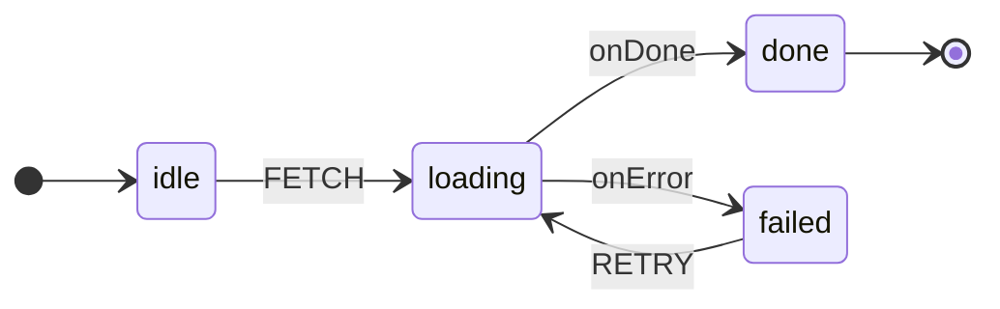

<div align="center">

# ⚙️ XState-StateMachine

### Statecharts for Python. Run your XState JSON — unmodified.

<br>

[](https://pypi.org/project/xstate-statemachine/)
[](https://pypi.org/project/xstate-statemachine/)
[](https://github.com/basiltt/xstate-statemachine/actions/workflows/ci.yml)
[](tests/)
[](.github/workflows/ci.yml)
[](pyproject.toml)
[](LICENSE)

<br>

**The only Python library that runs [XState](https://stately.ai/) / Stately.ai machine definitions as-is.**

Design a flow once in the visual editor — ship the *same JSON* to your React frontend
and your Python backend. Async **and** sync interpreters. Zero dependencies.

<br>

[**Install**](#-install) · [**60-Second Start**](#-the-60-second-start) · [**Why**](#-why-a-statechart) · [**Cookbook**](#-cookbook) · [**API**](#-api-reference) · [**Docs**](https://basiltt.github.io/xstate-statemachine/)

</div>

---

<div align="center">

### 🗺️ Find your way

</div>

|   | Section | What you get |
|:--|:--|:--|
| 🚀 | [**Install**](#-install) · [**60-Second Start**](#-the-60-second-start) | Running in under a minute |
| 🧠 | [**Why a Statechart**](#-why-a-statechart) · [**Mental Model**](#-the-mental-model) | The three bugs this deletes |
| 🔗 | [**XState Interop**](#-the-part-no-other-python-library-does) | One JSON, React *and* Python |
| 🧩 | [**Context**](#-context--the-machines-memory) · [**Guards**](#️-guards--conditional-transitions) · [**Actions**](#-actions--side-effects) | The building blocks |
| 🔌 | [**Services**](#-services--invoke) · [**Timers**](#️-timers--delayed-transitions) | Async work and time |
| 🌳 | [**Nested**](#-nested--parallel-states) · [**Parallel**](#parallel-states--concurrent-regions) · [**History**](#-history--final-states) | Real-world hierarchy |
| 🤖 | [**Actors**](#-the-actor-model) · [**Persistence**](#-persistence--snapshots) | Systems of machines |
| 🔍 | [**Introspection**](#-introspection--plugins) · [**Pure API**](#-the-pure-api--no-interpreter) | Observe and test |
| 🐍 | [**Pythonic API**](#-prefer-pure-python-three-more-ways-to-define-a-machine) | No JSON required |
| 🛠️ | [**CLI Generator**](#️-cli-code-generator) | JSON → typed Python, verified |
| 📚 | [**Cookbook**](#-cookbook) · [**FAQ**](#-faq) | Copy-paste recipes |

---

<div align="center">

### ✨ What you get

</div>

<table>
<tr>
<td width="33%" valign="top">

**🔗 Real XState interop**

Run Stately.ai JSON **unmodified**. Not "inspired by" — the same file your
frontend uses.

</td>
<td width="33%" valign="top">

**⚡ Async *and* sync**

`Interpreter` for asyncio, `SyncInterpreter` for scripts, Django, and CLIs.
Same machine, same semantics.

</td>
<td width="33%" valign="top">

**📦 Zero dependencies**

Pure standard library. Nothing to audit, nothing to conflict, Python 3.9 → 3.14.

</td>
</tr>
<tr>
<td valign="top">

**🌳 Full statechart spec**

Nested, parallel, history, guards, timers, invoke, actors — not just a flat
enum with `if` statements.

</td>
<td valign="top">

**🧪 Testable by design**

A pure, interpreter-free API returns the next state as a value. No mocks, no
event loop, no sleeping.

</td>
<td valign="top">

**🛠️ Verified codegen**

`xsm` turns JSON into typed Python and **proves** the result rebuilds your
machine before writing it.

</td>
</tr>
</table>

---

## 🚀 Install

```bash
pip install xstate-statemachine
```

That's the whole story. **Zero runtime dependencies** — pure standard library, Python 3.9 → 3.14.

```bash
xsm info          # verify the install
```

Using the code generator and want its output line-wrapped to match your linter?
That needs `black` and `isort`, which stay optional so the core install keeps its
zero-dependency promise:

```bash
pip install "xstate-statemachine[format]"
```

Without them, generated code is still valid and still faithful to your machine —
just not reformatted.

<details>
<summary><b>uv · poetry · pipx</b></summary>

<br>

```bash
uv add xstate-statemachine
poetry add xstate-statemachine
pipx install xstate-statemachine     # if you only want the `xsm` CLI
```

</details>

---

## ⚡ The 60-Second Start

Copy, paste, run. No async, no setup, no config files.

```python
from xstate_statemachine import create_machine, SyncInterpreter

machine = create_machine({
    "id": "toggle",
    "initial": "inactive",
    "states": {
        "inactive": {"on": {"TOGGLE": "active"}},
        "active":   {"on": {"TOGGLE": "inactive"}},
    },
})

light = SyncInterpreter(machine).start()

print(light.current_state_ids)      # {'toggle.inactive'}
light.send("TOGGLE")
print(light.current_state_ids)      # {'toggle.active'}
light.send("BANANA")                # not a legal event here
print(light.current_state_ids)      # {'toggle.active'}  ← ignored, not crashed
```

You just declared the **complete** set of legal states and the **only** legal moves between
them. `TOGGLE` advances the machine. `BANANA` is ignored — not raised, not silently
mishandled. Ignored, because the current state does not accept it.

That single property is what kills a whole category of bug.

---

## 🧠 Why a Statechart?

Every non-trivial flow starts as a few booleans. Then it grows.

<table>
<tr>
<td width="50%" valign="top">

**😖 Boolean soup**

```python
if is_loading and not is_error:
    ...
elif is_error and retry_count < 3:
    ...
elif is_authenticated and not is_loading:
    ...
```

Four booleans = **16 combinations**. You handled maybe six.
The other ten are *reachable* — and one of them is
`is_loading=True, is_error=True, is_success=True`.

Nothing stops it. Nothing warns you. It just happens in
production at 3am.

</td>
<td width="50%" valign="top">

**😌 A statechart**

```jsonc
"states": {
    "idle":    {"on": {"FETCH": "loading"}},
    "loading": {"on": {"OK": "done",
                       "ERR": "failed"}},
    "failed":  {"on": {"RETRY": "loading"}},
    "done":    {"type": "final"},
}
```

Four states = **exactly four possibilities**. The impossible
ones cannot be constructed, because you never wrote a path
to them.

Illegal events in the current state are simply ignored.

</td>
</tr>
</table>

### The three bugs this eliminates

| Bug | How booleans cause it | How a statechart prevents it |
|:--|:--|:--|
| 🕳️ **Impossible states** | `is_loading` *and* `is_error` both true | The machine is in exactly one state per region |
| 👻 **Zombie callbacks** | A late API response fires after the user cancelled | The event isn't handled in `cancelled`, so it's discarded |
| 🔁 **Double submission** | A second click before the first finishes | `submitting` has no `SUBMIT` handler — the click does nothing |

> **The rule** — a machine is in **exactly one state per region**. Parallel states have
> multiple regions, so multiple states are active at once, which is why
> `current_state_ids` returns a *set*.

---

## 🔗 The Part No Other Python Library Does

Your frontend team models a checkout flow in [Stately.ai](https://stately.ai/). They export
`checkout.json` and wire it into React with XState.

You take **that exact file** — unedited — and run it in Python:

```python
import json
from xstate_statemachine import create_machine, MachineLogic, SyncInterpreter

with open("checkout.json") as f:          # ← straight from the frontend repo
    config = json.load(f)

machine = create_machine(config, logic=MachineLogic(
    actions={"chargeCard": charge_card},   # you supply the Python side
    guards={"hasStock": has_stock},
))

checkout = SyncInterpreter(machine).start()
```

One definition. Two runtimes. **The UI cannot render a step your backend considers illegal**,
because there is only one source of truth for what the steps *are*.

<details>
<summary><b>How compatible is "compatible"? (real numbers)</b></summary>

<br>

The test suite includes **104 real-world machines exported from Stately.ai**. 103 of them parse
structurally unmodified. The single exception has no top-level `states` key at all — it isn't a
well-formed machine.

Both XState **v4** (`cond`) and **v5** (`guard`) transition spellings are accepted, so machines
from either generation work.

What is *not* supported: JS/TS action implementations embedded in the JSON. Those are code, not
data — you supply the Python equivalents via `MachineLogic`, which is the whole point of the
separation.

</details>

> **Note** — this library implements the **SCXML** transition-selection algorithm (the W3C
> standard XState itself follows). That is what makes nested and parallel-region behaviour
> match XState rather than merely resemble it. It does *not* import or export `.scxml` files.

---

## 🧩 The Mental Model

Six concepts. That's the entire library.

| Concept | What it is | In JSON |
|:--|:--|:--|
| **State** | A named mode the machine can be in | `"states": {"idle": {}}` |
| **Event** | A message you send in | `interp.send("FETCH")` |
| **Transition** | "In state X, event E moves to Y" | `"on": {"FETCH": "loading"}` |
| **Context** | Everything that isn't a state — the data | `"context": {"retries": 0}` |
| **Guard** | A condition that must hold for a transition | `{"target": "x", "guard": "isReady"}` |
| **Action** | A side effect that fires during a transition | `{"target": "x", "actions": ["save"]}` |

The split that matters: **state** is *where you are*, **context** is *what you know*.
`retries` is context. `retrying` is a state. Getting that boundary right is 90% of good
statechart design.


```mermaid
stateDiagram-v2
    direction LR
    [*] --> idle
    idle --> loading: FETCH
    loading --> done: onDone
    loading --> failed: onError
    failed --> loading: RETRY
    done --> [*]
```

---

## 💾 Context — The Machine's Memory

Context is a plain dict. Update it declaratively with `assign`:

```python
from xstate_statemachine import create_machine, SyncInterpreter, assign

cart = SyncInterpreter(create_machine({
    "id": "cart",
    "initial": "shopping",
    "context": {"items": 0, "total": 0.0},
    "states": {
        "shopping": {
            "on": {
                "ADD_ITEM": {"actions": assign({
                    "items": lambda a: a["context"]["items"] + 1,
                    "total": lambda a: a["context"]["total"] + a["event"].payload["price"],
                })},
                "CLEAR": {"actions": assign(lambda a: {"items": 0, "total": 0.0})},
            }
        }
    },
})).start()

cart.send("ADD_ITEM", price=9.99)
cart.send("ADD_ITEM", price=5.01)
print(cart.context)          # {'items': 2, 'total': 15.0}
```

`assign` takes either a **dict of per-key updaters** or a **single callable** returning a
partial dict. Each updater receives one mapping with `"context"` and `"event"` keys.

> **Tip** — keyword arguments to `send()` land in `event.payload`.
> `send("ADD_ITEM", price=9.99)` → `a["event"].payload["price"]`.

---

## 🛡️ Guards — Conditional Transitions

A guard is a pure function returning `bool`. List transitions in priority order; the **first**
whose guard passes wins.

```python
from xstate_statemachine import create_machine, SyncInterpreter, MachineLogic

config = {
    "id": "atm",
    "initial": "idle",
    "context": {"balance": 100, "frozen": False},
    "states": {
        "idle": {
            "on": {
                "WITHDRAW": [
                    {"target": "approved", "guard": {
                        "type": "and",
                        "params": {"guards": [
                            "hasFunds",
                            {"type": "not", "params": {"guards": ["isFrozen"]}},
                        ]},
                    }},
                    {"target": "denied"},          # fallback — no guard
                ]
            }
        },
        "approved": {}, "denied": {},
    },
}

logic = MachineLogic(guards={
    "hasFunds": lambda ctx, e: ctx["balance"] >= e.payload.get("amount", 0),
    "isFrozen": lambda ctx, e: ctx["frozen"],
})

atm = SyncInterpreter(create_machine(config, logic=logic)).start()
atm.send("WITHDRAW", amount=50)
print(atm.current_state_ids)      # {'atm.approved'}
```

**Composite guards** — `and`, `or`, `not` nest arbitrarily via `params.guards`. There's also
`stateIn` for "only if some other region is in state X":

```python
{"guard": {"type": "stateIn", "params": {"state": "auth.loggedIn"}}}
```

> **Note** — guards must be **pure**. They can be evaluated more than once, and a guard with
> side effects will surprise you. Put side effects in actions.

<details>
<summary><b>XState v4 compatibility</b></summary>

<br>

`cond` (v4) and `guard` (v5) are both accepted, so machines from either XState generation work
without editing.

</details>

---

## 🎬 Actions — Side Effects

Actions fire **during** a transition, or on entering/leaving a state.

```jsonc
"states": {
    "loading": {
        "entry": ["showSpinner"],          # on the way in
        "exit":  ["hideSpinner"],          # on the way out
        "on": {"CANCEL": {"target": "idle", "actions": ["logCancel"]}},
    }
}
```

Order is guaranteed: **exit actions → transition actions → entry actions**.

### Built-in action creators

You rarely need to hand-write these — import them and go:

| Creator | Does |
|:--|:--|
| `assign` | Update context |
| `log` | Structured log line |
| `raise_` | Send an event to *this* machine |
| `send_to` | Send to another actor by id or `systemId` |
| `send_parent` | Send to the machine that spawned you |
| `choose` | Run the first action list whose guard passes |
| `pure` | Compute actions from context at runtime |
| `enqueue_actions` | Imperatively queue actions in a callback |
| `spawn_child` / `stop_child` | Start / stop a child actor |
| `cancel` | Cancel a delayed `send_to` |
| `emit` | Emit an event to external subscribers |
| `escalate` | Raise an error to the parent |
| `forward_to` | Forward the current event to another actor |

> **Note** — if an action raises, the error is **logged and contained**. The transition still
> completes and the interpreter keeps running; one buggy side effect can't take down a
> long-lived machine. To react to a failure, use the `on_action_error` plugin hook or
> record it on context and guard on it.

<details>
<summary><b>Worked examples — the ones that aren't obvious from the name</b></summary>

<br>

**`choose` — first passing guard wins.** The declarative form of `if/elif/else`:

```jsonc
"on": {"GO": {"target": "b", "actions": [choose([
    {"guard": "isBig",   "actions": [assign({"label": lambda a: "big"})]},
    {"guard": "isSmall", "actions": [assign({"label": lambda a: "small"})]},
    {"actions": [assign({"label": lambda a: "other"})]},   # no guard = default
])]}}
```

With `context = {"n": 7}` and guards `isBig = n > 10`, `isSmall = n < 5`, this
falls through to `label = "other"`.

**`pure` — decide the action list at runtime.** Return actions, or nothing:

```jsonc
"actions": [pure(lambda a:
    [assign({"n": lambda b: b["context"]["n"] * 2})]
    if a["context"]["n"] < 10 else []
)]
```

Starting from `n = 2`, four sends give `2 → 4 → 8 → 16`, then it stops doubling
because the guard inside `pure` returns an empty list.

**`raise_` — feed an event back to *this* machine.** Useful for expressing
"and then immediately…" without a fake external trigger:

```jsonc
"actions": [raise_("VALIDATE")]
```

**`send_to` / `send_parent` — talk to other actors.** Delayed sends are cancellable:

```jsonc
"actions": [send_to("timer", "TICK", delay=1000, send_id="tick")]
# elsewhere
"actions": [cancel("tick")]
```

**`emit` — publish outward without coupling.** The machine says *what happened*;
subscribers decide what to do:

```jsonc
"actions": [emit("saved")]                        # or emit({"type": "saved", "id": 7})
interpreter.on("saved", lambda ev: analytics.track(ev.type))
```

</details>

---

## 🔌 Services & Invoke

`invoke` runs an async or sync callable when a state is entered, and routes its result back
into the machine as `onDone` / `onError`. This is how you do I/O.

```python
import asyncio
from xstate_statemachine import (
    create_machine, Interpreter, MachineLogic, assign, wait_for,
)

config = {
    "id": "fetch",
    "initial": "idle",
    "context": {"user": None, "error": None},
    "states": {
        "idle": {"on": {"FETCH": "loading"}},
        "loading": {
            "invoke": {
                "src": "fetchUser",
                "onDone": {"target": "success",
                           "actions": assign({"user": lambda a: a["event"].data})},
                "onError": {"target": "failure",
                            "actions": assign({"error": lambda a: str(a["event"].data)})},
            }
        },
        "success": {"type": "final"},
        "failure": {"on": {"RETRY": "loading"}},
    },
}

async def fetch_user(interpreter, ctx, event):
    await asyncio.sleep(0.01)
    return {"id": 1, "name": "Ada"}

async def main():
    machine = create_machine(config, logic=MachineLogic(services={"fetchUser": fetch_user}))
    svc = await Interpreter(machine).start()

    await svc.send("FETCH")
    await wait_for(svc, lambda s: s.matches("fetch.success"), timeout=2)

    print(svc.context["user"])        # {'id': 1, 'name': 'Ada'}
    await svc.stop()

asyncio.run(main())
```

- **Success** → `onDone`, with the return value on `event.data`
- **Failure** → `onError`, with the *exception object* on `event.data`
- Leaving the state **cancels** the service automatically — no zombie tasks

> **Tip** — use `wait_for` (async) or `wait_for_sync` rather than `asyncio.sleep()` guesses.
> It polls a predicate with a real timeout, so tests stay fast and never flake.

---

## ⏱️ Timers & Delayed Transitions

`after` fires a transition if the machine is *still* in that state when the timer elapses.
Leave early and the timer is cancelled for you.

```jsonc
"connecting": {
    "after": {5000: "timedOut"},          # 5000 ms
    "on": {"OPEN": "online"},             # ...unless we connect first
}
```

Name your delays to keep magic numbers out of the config — and to compute them at runtime,
which is exactly how you express **exponential backoff**:

```python
logic = MachineLogic(delays={
    "TIMEOUT": 60_000,
    "BACKOFF": lambda ctx, e: 2 ** ctx["attempt"] * 1000,   # 1s, 2s, 4s, 8s…
})
```

```jsonc
"retrying": {"after": {"BACKOFF": "loading"}}
```

---

## 🌳 Nested & Parallel States

### Nested (compound) states

Group related substates so shared transitions live in one place:

```jsonc
"states": {
    "authenticated": {
        "initial": "browsing",
        "on": {"LOGOUT": "loggedOut"},     # ← applies to EVERY substate
        "states": {
            "browsing":  {"on": {"CHECKOUT": "paying"}},
            "paying":    {"on": {"DONE": "confirmed"}},
            "confirmed": {},
        },
    },
    "loggedOut": {},
}
```

`LOGOUT` works from `browsing`, `paying`, *and* `confirmed`. Write it once.

### Parallel states — concurrent regions

Regions run independently. `onDone` fires **exactly once**, when *all* of them reach a final
state — fan-out and fan-in with no bookkeeping:

```python
from xstate_statemachine import create_machine, SyncInterpreter

ci = SyncInterpreter(create_machine({
    "id": "ci",
    "initial": "running",
    "states": {
        "running": {
            "type": "parallel",
            "onDone": "deployed",
            "states": {
                "build": {"initial": "b", "states": {
                    "b": {"on": {"BUILD_OK": "done"}}, "done": {"type": "final"}}},
                "lint":  {"initial": "l", "states": {
                    "l": {"on": {"LINT_OK": "done"}},  "done": {"type": "final"}}},
            },
        },
        "deployed": {},
    },
})).start()

print(sorted(ci.current_state_ids))   # ['ci.running.build.b', 'ci.running.lint.l']
ci.send("BUILD_OK")
print(sorted(ci.current_state_ids))   # ['ci.running.build.done', 'ci.running.lint.l']
ci.send("LINT_OK")
print(sorted(ci.current_state_ids))   # ['ci.deployed']   ← fan-in fired
```

This is where `current_state_ids` returning a **set** finally makes sense.

---

## 🕰️ History & Final States

**History** remembers where you were, so an interruption doesn't lose progress — the classic
"resume the wizard where the user left off":

```jsonc
"states": {
    "wizard": {
        "initial": "step1",
        "states": {
            "step1": {}, "step2": {}, "step3": {},
            "hist": {"type": "history", "history": "shallow"},   # or "deep"
        },
    },
    "helpModal": {"on": {"CLOSE": "wizard.hist"}},    # ← back to the exact step
}
```

**Final states** mark completion. A final state in a compound state fires its parent's
`onDone`; a top-level final state stops the machine and can produce `output`.

---

## 🤖 The Actor Model

Machines can spawn other machines. Each child gets its own state, context and lifecycle —
a supervision tree, not a callback pile. Register a child under a `systemId` and any machine
in the system can address it by name.

```python
from xstate_statemachine import create_machine, SyncInterpreter, MachineLogic

# The child machine — an independent actor with its own context.
worker = {
    "id": "worker",
    "initial": "idle",
    "context": {"jobs": 0},
    "states": {"idle": {"on": {"JOB": {"target": "idle", "actions": ["count"]}}}},
}
worker_logic = MachineLogic(actions={
    "count": lambda i, ctx, e, a: ctx.__setitem__("jobs", ctx["jobs"] + 1),
})

parent = {
    "id": "super",
    "initial": "up",
    "context": {},
    "states": {
        "up": {
            "entry": [{"type": "spawnChild",
                       "params": {"src": "worker", "id": "w1", "systemId": "pool"}}],
            "on": {"DISPATCH": {"actions": [
                {"type": "sendTo", "params": {"to": "pool", "event": {"type": "JOB"}}}
            ]}},
        }
    },
}

logic = MachineLogic(services={
    "worker": lambda i, ctx, e: create_machine(worker, logic=worker_logic),
})

sup = SyncInterpreter(create_machine(parent, logic=logic)).start()
print(list(sup.system.get_all()))          # ['pool']

sup.send("DISPATCH")
sup.send("DISPATCH")
print(sup.system.get("pool").context["jobs"])   # 2
```

Children talk back with `send_parent`, escalate failures with `escalate`, and are torn down
with `stop_child` — or automatically when the parent stops.

**Good fit for:** LLM agent orchestration (each tool call a supervised child), connection
pools, per-user session machines, job workers.

---

## 💾 Persistence — Snapshots

Serialize a running machine to JSON, store it anywhere, rebuild it later. Long-running flows
survive deploys and restarts.

```python
from xstate_statemachine import create_machine, SyncInterpreter

job = SyncInterpreter(create_machine(config)).start()
job.send("NEXT")

snapshot = job.get_snapshot()      # a JSON string → Redis, Postgres, a file…
job.stop()

# …new process, hours later…
resumed = SyncInterpreter.from_snapshot(snapshot, create_machine(config))
print(resumed.current_state_ids)   # {'job.step2'}   ← exactly where it left off
resumed.send("NEXT")
```

State, context and `systemId` registrations all round-trip.
`get_persisted_snapshot()` gives you the dict form if you'd rather store structured data.

> **Note** — pending `after` timers are **not** resumed by a restore. A machine saved while
> waiting on a 30-minute timeout will wait indefinitely after restore. If a deadline must
> survive a restart, store it in context and re-arm it yourself on resume.

---

## 🧪 The Pure API — No Interpreter

Sometimes you want to ask *"what would happen if…"* without running anything. The pure API is
a set of side-effect-free functions over immutable snapshots — ideal for tests, planning, and
"preview the next step" UI.

```python
from xstate_statemachine import (
    MachineLogic, create_machine, initial_transition, pure_transition,
)

machine = create_machine({
    "id": "fetch",
    "initial": "idle",
    "states": {
        "idle":    {"on": {"FETCH": {"target": "loading", "actions": "logStart"}}},
        "loading": {"on": {"OK": "done"}},
        "done":    {"type": "final"},
    },
}, logic=MachineLogic())      # 📝 no implementations needed — nothing runs

snapshot, entry_actions = initial_transition(machine)
next_snapshot, actions = pure_transition(machine, snapshot, "FETCH")

print(snapshot.state_ids)         # {'fetch.idle'}
print(next_snapshot.state_ids)    # {'fetch.loading'}
print([a.type for a in actions])  # ['logStart'] — what WOULD have run
```

Both functions return `(snapshot, actions)`. If you only want the next state,
`get_next_snapshot(machine, snapshot, "FETCH")` returns the snapshot alone.

A `PureSnapshot` exposes `state_ids`, `context`, `status`, `output`, `configuration`
and `matches()`. No timers start. No services fire. Nothing mutates.

---

## 🔍 Introspection & Plugins

A running machine can answer questions about itself — which is what lets you drive a UI
from it without duplicating its logic in your view layer.

```python
from xstate_statemachine import (
    create_machine, MachineLogic, SyncInterpreter, assign, emit,
)

editor = create_machine({
    "id": "editor",
    "initial": "clean",
    "context": {"saves": 0},
    "states": {
        "clean":  {"tags": ["idle"],
                   "meta": {"hint": "Nothing to save"},
                   "on": {"EDIT": "dirty"}},
        "dirty":  {"tags": ["unsaved"], "on": {"SAVE": "saving"}},
        "saving": {"tags": ["unsaved", "busy"],
                   "on": {"OK": {"target": "clean", "actions": [
                       assign({"saves": lambda a: a["context"]["saves"] + 1}),
                       emit("saved"),
                   ]}}},
    },
}, logic=MachineLogic())

ed = SyncInterpreter(editor).start()

ed.matches("editor.clean")   # True  — nested paths work: "a.b.c"
ed.can("EDIT")               # True  — would this event do anything *right now*?
ed.can("SAVE")               # False — not handled in `clean`
ed.has_tag("idle")           # True
ed.tags                      # {'idle'}
ed.get_meta()                # {'editor.clean': {'hint': 'Nothing to save'}}
ed.context                   # {'saves': 0}
ed.is_running                # True
```

### `can()` — disable buttons without duplicating logic

The machine already knows which events are legal. Ask it, instead of re-deriving
the rule in your template:

```python
save_button.disabled = not ed.can("SAVE")
```

### Tags — style many states with one check

`saving` and `dirty` are different states but share the `unsaved` tag, so a spinner
needs one condition rather than a growing `or` chain:

```python
if ed.has_tag("busy"):
    show_spinner()
```

### `subscribe()` — react to every settled transition

The listener receives the **interpreter**, so read whatever you need from it:

```python
unsubscribe = ed.subscribe(
    lambda i: print(sorted(i.current_state_ids), i.context)
)
# … later
unsubscribe()
```

### `on()` — listen for emitted events

`emit` publishes a domain event without coupling the machine to your transport:

```python
ed.on("saved", lambda event: analytics.track(event.type))
ed.on("*", lambda event: audit_log.append(event))   # every emitted event
```

```python
ed.send("EDIT"); ed.send("SAVE"); ed.send("OK")
ed.context     # {'saves': 1}   ← assign ran
ed.tags        # {'idle'}       ← back in `clean`
```

### Plugins — the whole lifecycle, one line

```python
from xstate_statemachine import LoggingInspector

ed.use(LoggingInspector())    # complete transition audit trail
```

Subclass `PluginBase` for metrics, tracing, or persistence-on-every-transition. Every
hook is optional:

| Hook | Fires when |
|:--|:--|
| `on_interpreter_start` / `on_interpreter_stop` | Lifecycle boundaries |
| `on_event_received` | An event arrives, before any transition is chosen |
| `on_transition` | A transition settles |
| `on_guard_evaluated` | A guard returns — useful for "why didn't it fire?" |
| `on_action_execute` | Before each action runs |
| `on_action_error` | An action raised. **Failures are contained**, so without this hook they are invisible |
| `on_service_start` / `on_service_done` / `on_service_error` | `invoke` lifecycle |

```python
from xstate_statemachine import PluginBase

class Metrics(PluginBase):
    def on_transition(self, interpreter, from_states, to_states, transition):
        statsd.increment(f"fsm.{transition.event}")

    def on_action_error(self, interpreter, action, error):
        sentry.capture_exception(error)   # otherwise silently contained

ed.use(Metrics())
```

---

## ⚖️ How It Compares

Python has good state machine libraries. Here's an honest read on when to pick which.

| | **xstate-statemachine** | **transitions** | **python-statemachine** |
|:--|:--:|:--:|:--:|
| XState / Stately JSON | ✅ **runs unmodified** | ❌ | ❌ |
| Compound (nested) states | ✅ | ✅ | ✅ |
| Parallel regions | ✅ | ✅ | ✅ |
| History states | ✅ | ✅ | ✅ |
| `invoke` services + `onDone`/`onError` | ✅ built-in | ⚙️ DIY | ⚙️ DIY |
| Delayed transitions (`after`) | ✅ built-in | ⚙️ DIY | ⚙️ DIY |
| Actor model / spawning | ✅ | ❌ | ❌ |
| Snapshot persistence | ✅ | ⚙️ DIY | ⚙️ DIY |
| Sync **and** async runtimes | ✅ two engines | ✅ | ✅ |
| Diagram export | ✅ no binaries | ⚙️ needs graphviz | ✅ |
| CLI code generator | ✅ | ❌ | ❌ |
| Runtime dependencies | **0** | 0 (core) | few |

**Pick `transitions`** if you want the most battle-tested option and a simple FSM bolted onto
an existing class. It's mature, widely deployed, and excellent at that job.

**Pick `python-statemachine`** if you want a beautiful, pythonic declarative API and don't
need JS interop. It genuinely supports compound, parallel and history states too — this is a
real alternative, not a strawman.

**Pick this library** when you want XState/Stately JSON to run in Python unchanged, or you
want `invoke`, `after`, actors and snapshots as first-class primitives instead of patterns
you assemble yourself.

### When *not* to use this

For a three-state toggle with no I/O, a plain `enum` and an `if` is less machinery and easier
to read. Statecharts start paying for themselves when you have **concurrency, timeouts,
cancellation, or more than ~5 states** — and they pay enormously at 20.

---

## 📚 Cookbook

Real problems, small solutions.

Every recipe below is a fragment for readability. Here is one **complete, runnable**
program first — a checkout that guards an empty cart, retries a declining card, and
records the failure reason, in 40 lines:

<details open>
<summary><b>🧾 A whole machine, end to end</b></summary>

<br>

```python
from xstate_statemachine import (
    MachineLogic, SyncInterpreter, assign, create_machine,
)

ORDER = {
    "id": "order",
    "initial": "cart",
    "context": {"items": 0, "attempts": 0, "error": None},
    "states": {
        "cart": {
            "on": {
                "ADD": {"actions": assign(
                    {"items": lambda a: a["context"]["items"] + 1})},
                "CHECKOUT": {"target": "charging", "guard": "hasItems"},
            },
        },
        "charging": {
            "entry": assign({"attempts": lambda a: a["context"]["attempts"] + 1}),
            "invoke": {
                "src": "chargeCard",
                "onDone": "shipped",
                "onError": {
                    "target": "failed",
                    "actions": assign({"error": lambda a: str(a["event"].data)}),
                },
            },
        },
        "failed": {"on": {"RETRY": {"target": "charging", "guard": "canRetry"}}},
        "shipped": {"type": "final"},
    },
}


def charge_card(interpreter, context, event):
    """Fails the first time, succeeds on the retry."""
    if context["attempts"] < 2:
        raise RuntimeError("card declined")
    return {"receipt": "r-123"}


logic = MachineLogic(
    guards={
        "hasItems": lambda ctx, e: ctx["items"] > 0,
        "canRetry": lambda ctx, e: ctx["attempts"] < 3,
    },
    services={"chargeCard": charge_card},
)

order = SyncInterpreter(create_machine(ORDER, logic=logic)).start()

order.send("CHECKOUT")                    # guard blocks — the cart is empty
print(sorted(order.current_state_ids))    # ['order.cart']

order.send("ADD")
order.send("CHECKOUT")                    # charges; the service raises
print(sorted(order.current_state_ids))    # ['order.failed']
print(order.context["error"])             # card declined

order.send("RETRY")                       # second attempt succeeds
print(sorted(order.current_state_ids))    # ['order.shipped']
print(order.context["attempts"])          # 2
```

Note what is **absent**: no `try/except` around the charge, no `is_charging` flag, no
"did we already ship?" check. A declined card is a `onError` edge, "cart is empty" is a
guard, and double-charging is impossible because `shipped` is `final` and `charging`
has no `CHECKOUT` handler.

</details>

<details open>
<summary><b>🔁 Retry with exponential backoff and a give-up limit</b></summary>

<br>

The pattern that turns into unreadable nested loops when hand-written:

```python
config = {
    "id": "api",
    "initial": "idle",
    "context": {"attempt": 0},
    "states": {
        "idle": {"on": {"CALL": "loading"}},
        "loading": {
            "invoke": {
                "src": "callApi",
                "onDone": "success",
                "onError": [
                    {"target": "waiting", "guard": "canRetry"},
                    {"target": "failed"},               # out of retries
                ],
            }
        },
        "waiting": {
            "entry": assign({"attempt": lambda a: a["context"]["attempt"] + 1}),
            "after": {"BACKOFF": "loading"},
        },
        "success": {"type": "final"},
        "failed":  {"type": "final"},
    },
}

logic = MachineLogic(
    services={"callApi": call_api},
    guards={"canRetry": lambda ctx, e: ctx["attempt"] < 5},
    delays={"BACKOFF": lambda ctx, e: 2 ** ctx["attempt"] * 1000},
)
```

Attempt counting, backoff math, and the give-up condition are each in exactly one place.

</details>

<details>
<summary><b>🛒 Checkout that can't double-charge</b></summary>

<br>

```jsonc
"states": {
    "reviewing":  {"on": {"SUBMIT": "charging"}},
    "charging":   {                                  # ← no SUBMIT handler here
        "invoke": {"src": "chargeCard",
                   "onDone": "confirmed", "onError": "declined"},
    },
    "confirmed":  {"type": "final"},
    "declined":   {"on": {"SUBMIT": "charging"}},
}
```

The second click while `charging` does nothing. Not because you remembered to disable the
button — because the state has no handler for it. The bug is *unrepresentable*.

</details>

<details>
<summary><b>🔌 Connection lifecycle with heartbeat</b></summary>

<br>

```jsonc
"states": {
    "disconnected": {"on": {"CONNECT": "connecting"}},
    "connecting": {
        "invoke": {"src": "openSocket", "onDone": "connected", "onError": "backoff"},
        "after": {"CONNECT_TIMEOUT": "backoff"},
    },
    "connected": {
        "on": {"PONG": "connected", "CLOSE": "disconnected"},   # self-transition resets timer
        "after": {"HEARTBEAT": "reconnecting"},
    },
    "backoff": {"after": {"RETRY_DELAY": "connecting"}},
    "reconnecting": {"on": {"CONNECT": "connecting"}},
}
```

A late `onDone` from a cancelled connection attempt is discarded — `disconnected` doesn't
handle it. That's the zombie-callback class of bug, gone structurally.

</details>

<details>
<summary><b>🤖 LLM agent loop with supervised tool calls</b></summary>

<br>

```jsonc
"states": {
    "planning": {"invoke": {"src": "askModel",
                            "onDone": [{"target": "callingTool", "guard": "wantsTool"},
                                       {"target": "answering"}]}},
    "callingTool": {
        "entry": [{"type": "spawnChild",
                   "params": {"src": "toolRunner", "id": "tool", "systemId": "tool"}}],
        "on": {"TOOL_RESULT": "reflecting", "TOOL_FAILED": "recovering"},
        "after": {"TOOL_TIMEOUT": "recovering"},
    },
    "reflecting": {"always": [{"target": "planning", "guard": "needsMoreWork"},
                              {"target": "answering"}]},
    "recovering": {"always": [{"target": "planning", "guard": "canRetry"},
                              {"target": "givingUp"}]},
    "answering": {"type": "final"},
    "givingUp":  {"type": "final"},
}
```

The agent's control flow is **data you can inspect, diagram and test** — not a `while` loop
with flags. Add `LoggingInspector` and you get a full audit trail of every decision.

</details>

<details>
<summary><b>🧪 Testing a machine without mocks</b></summary>

<br>

`SyncInterpreter` needs no event loop, so tests stay plain:

```python
def test_declined_card_allows_retry():
    checkout = SyncInterpreter(create_machine(config, logic=test_logic)).start()

    checkout.send("SUBMIT")
    assert checkout.matches("checkout.charging")

    checkout.send("SUBMIT")                       # double click
    assert checkout.matches("checkout.charging")  # …ignored
```

Or skip the interpreter entirely with the [pure API](#the-pure-api-no-interpreter).

</details>

---

## 🐍 Prefer Pure Python? Three More Ways to Define a Machine

JSON is the interop format, not an obligation. If you're not sharing definitions with a
frontend, define machines in Python instead.

### Class-based — declarative and readable

```python
from xstate_statemachine import State, StateMachine, SyncInterpreter, action

class Checkout(StateMachine):
    machine_id = "checkout"
    initial_context = {"attempts": 0}

    reviewing = State(initial=True)
    charging  = State()
    confirmed = State()

    submit = reviewing.to(charging, event="SUBMIT", actions=["recordAttempt"])
    ok     = charging.to(confirmed, event="PAID")

    @action
    def record_attempt(self, interpreter, ctx, evt, action_def):
        ctx["attempts"] += 1

c = SyncInterpreter(Checkout.create_machine()).start()
c.send("SUBMIT")
print(c.current_state_ids, c.context)   # {'checkout.charging'} {'attempts': 1}
c.send("SUBMIT")                        # double click → ignored
print(c.context)                        # {'attempts': 1}
```

> **Watch out** — `@action`, `@guard` and `@service` convert `snake_case` method names to
> `camelCase` keys. The method `record_attempt` is referenced as `"recordAttempt"`.

Compose multiple transitions for one event with `|`:

```python
flip = off.to(on, event="TOGGLE") | on.to(off, event="TOGGLE")
```

### Builder — fluent

```python
from xstate_statemachine import MachineBuilder

machine = (MachineBuilder("toggle")
           .state("off", initial=True)
           .state("on")
           .transition("off", "TOGGLE", "on")
           .transition("on", "TOGGLE", "off")
           .build())
```

`transition()` takes `(source, event, target)`, so states and transitions can be declared
in any order — handy when you're generating a machine from data.

### Functional — `build_machine()`

Plain objects and explicit wiring. The style to reach for when the machine is
data you are assembling, not a shape you are declaring:

```python
from xstate_statemachine import (
    State, SyncInterpreter, action, build_machine,
)

@action
def record_attempt(interpreter, ctx, evt, action_def):
    ctx["attempts"] += 1

reviewing = State("reviewing", initial=True,
                  on={"SUBMIT": {"target": "charging",
                                 "actions": ["recordAttempt"]}})
charging  = State("charging", on={"PAID": "confirmed"})
confirmed = State("confirmed", final=True, tags=["done"])

machine = build_machine(
    id="checkout",
    states=[reviewing, charging, confirmed],
    context={"attempts": 0},
    actions=[record_attempt],
)

c = SyncInterpreter(machine).start()
c.send("SUBMIT")
print(sorted(c.current_state_ids), c.context)   # ['checkout.charging'] {'attempts': 1}
c.send("PAID")
print(sorted(c.current_state_ids), sorted(c.tags))  # ['checkout.confirmed'] ['done']
```

### Everything the JSON format supports

All three styles compile to the same `MachineNode`, so none of them is a reduced
subset. Nesting, parallel regions, history, timers, tags and metadata are all
expressible:

```jsonc
State("online", initial=True, states=[configuring, running, resume],
      on={"DISCONNECT": "offline"}, tags=["connected"])

State("resume", history="deep")           // remembers the last active child
State("failed", meta={"alert": True})     // arbitrary data for your UI
State("regions", parallel=True, states=[...])
```

Machine-level properties — a global escape transition, root `entry`/`exit`, or a
parallel root — go on `root=`:

```python
from xstate_statemachine import State, SyncInterpreter, build_machine

root = State("", on={"EMERGENCY": "halted"}, tags=["v2"])
machine = build_machine(
    id="press",
    states=[State("idle", initial=True), State("running"), State("halted")],
    root=root,
)

p = SyncInterpreter(machine).start()
p.send("EMERGENCY")                       # works from ANY state
print(sorted(p.current_state_ids))        # ['press.halted']
```

`MachineBuilder.root(...)` and a `machine_root` class attribute do the same for
the other two styles.

> **Runnable examples** for all three styles — building the *same* machine, with
> `invoke`, timers, guards, tags and meta — live in
> [`examples/sync/easy/pythonic_approach/`](examples/sync/easy/pythonic_approach/).

---

## 🛠️ CLI Code Generator

Point `xsm` at an XState JSON file and get runnable, typed Python scaffolding — every action,
guard and service stubbed with the right signature.

```bash
xsm generate-template checkout.json --template pythonic-class -o ./app
```

| Command | Alias | Does |
|:--|:--|:--|
| `generate-template` | `gt` | Generate Python from a machine JSON |
| `list-templates` | `lt` | Show the 5 available templates |
| `validate` | `val` | Check a JSON machine for structural errors |
| `info` | | Version and feature summary |

Templates: `class-json`, `function-json`, `pythonic-class`, `pythonic-builder`,
`pythonic-functional`.

**The generator proves its output before writing it.** For templates that build the machine in
Python, `xsm` compiles the generated code, runs it, and compares the resulting machine against
`create_machine(your.json)`. If anything diverges it prints what and exits non-zero — nothing is
written. Nesting, parallel regions, history, timers (numeric *and* named delays), composite
guards, `invoke`, tags and meta all round-trip exactly.

Add `--check` in CI to catch generated code that has drifted from its source JSON:

```bash
xsm generate-template checkout.json --template pythonic-class -o ./app --check
```

<details>
<summary><b>Why generate instead of hand-write?</b></summary>

<br>

Because the machine already declares every logic name it needs. The generator reads them and
emits a stub for each — so a typo in a guard name becomes a missing-function error at
generation time rather than an `ImplementationMissingError` in production.

</details>

---

## 🏭 Running It in Production

Everything above is the happy path. Here is what matters once real traffic arrives.

### Failure semantics — know what is contained

| What fails | What happens | How to observe it |
|:--|:--|:--|
| An **action** raises | Logged and **contained**. The transition still completes; the machine keeps running | `on_action_error` plugin hook |
| A **guard** raises | Treated as `False`; that candidate transition is skipped | `on_guard_evaluated` hook |
| An invoked **service** raises | Routed to `onError` — a normal transition, not a crash | `onError` target, `on_service_error` hook |
| An **unknown event** arrives | Ignored. `send("NONSENSE")` is a no-op, never an exception | `interpreter.can(...)` before sending |
| A **transition action** raises mid-flight | Rolled back — the machine does not end up half-exited | Machine state stays consistent |

Containment is deliberate: a long-lived machine should not die because one side effect
had a bad day. The cost is that failures are **invisible unless you look**, so wire up
`on_action_error` early:

```python
from xstate_statemachine import PluginBase

class ErrorReporter(PluginBase):
    def on_action_error(self, interpreter, action, error):
        sentry.capture_exception(error)

interp.use(ErrorReporter())
```

### Waiting for a machine to settle

Do not poll by hand or `sleep()` and hope:

```python
from xstate_statemachine import wait_for, wait_for_sync, to_promise

# async
await wait_for(interp, lambda i: i.matches("job.done"), timeout=30)
result = await to_promise(interp)          # resolves when the machine reaches a final state

# sync
wait_for_sync(interp, lambda i: i.matches("job.done"), timeout=30)
```

### Choosing an interpreter

| Use | When |
|:--|:--|
| `Interpreter` | asyncio apps — FastAPI, aiohttp, bots, anything already async |
| `SyncInterpreter` | Django views, Celery tasks, CLI tools, scripts, tests |

Same machine JSON, same semantics, same guarantees. Timers, services and actors all work
on both; the sync engine runs them on threads.

### Long-running machines

- **Persist on transition,** not on a timer — `get_persisted_snapshot()` in a
  `subscribe()` callback gives you crash-safe resume points.
- **`after` timers do not survive a snapshot.** Restoring a machine that was mid-timeout
  will not re-arm it; re-send the triggering event, or model the deadline as data in
  context and compare against wall-clock on resume.
- **Always `stop()`** — it cancels timers and stops spawned actors. In a web app, tie it
  to request teardown; in a worker, to the task's `finally`.

### Testing

The [pure API](#-the-pure-api--no-interpreter) is the fastest way to test machine
*logic* — no event loop, no mocks, no sleeping:

```python
from xstate_statemachine import get_initial_snapshot, get_next_snapshot

snap = get_initial_snapshot(machine)
snap = get_next_snapshot(machine, snap, "SUBMIT")
assert snap.matches("checkout.paying")
```

Use a real interpreter for integration tests, where you want the actions to actually run.

---

## 📘 API Reference

<details open>
<summary><b>Core — building and running</b></summary>

<br>

| Name | Purpose |
|:--|:--|
| `create_machine(config, logic=..., logic_modules=[...])` | Build a machine from a dict/JSON config |
| `MachineLogic(actions=, guards=, services=, delays=)` | Bind names in the config to Python callables |
| `Interpreter(machine)` | **Async** engine — `await .start()`, `.send()`, `.stop()` |
| `SyncInterpreter(machine)` | **Sync** engine — no event loop anywhere |
| `LogicLoader` | Auto-discover logic by name from modules |
| `MachineNode` | The parsed machine; has `.to_mermaid()` / `.to_plantuml()` |

You can also subclass `MachineLogic` and define actions, guards and services as methods —
they're registered automatically by arity: `(ctx, event)` is a guard,
`(interpreter, ctx, event)` a service, `(interpreter, ctx, event, action)` an action.

</details>

<details>
<summary><b>Interpreter surface</b></summary>

<br>

| Member | Purpose |
|:--|:--|
| `.start()` / `.stop()` | Lifecycle (await both on `Interpreter`) |
| `.send(event, **payload)` | Send an event; kwargs become `event.payload` |
| `.current_state_ids` / `.active_state_ids` | Set of active leaf state ids |
| `.context` | The live context dict |
| `.status` / `.is_running` | `"running"` / `"stopped"`, and a liveness check |
| `.matches(id)` | Is this state active? Supports nested paths |
| `.can(event)` | Would this event cause anything? |
| `.has_tag(tag)` / `.get_meta()` | Tags and merged `meta` of active states |
| `.subscribe(fn)` | Observe every transition |
| `.use(plugin)` / `.plugins` | Register plugins |
| `.system` | Actor registry — `.get(system_id)`, `.get_all()` |
| `.get_snapshot()` / `.get_persisted_snapshot()` | Serialize (JSON string / dict) |
| `.from_snapshot(snap, machine)` | Restore (classmethod) |

</details>

<details>
<summary><b>Action creators</b></summary>

<br>

`assign` · `log` · `raise_` · `send_to` · `send_parent` · `choose` · `pure` ·
`enqueue_actions` · `ActionEnqueuer` · `spawn_child` · `stop_child` · `cancel` · `emit` ·
`escalate` · `forward_to`

</details>

<details>
<summary><b>Pure API & helpers</b></summary>

<br>

| Name | Purpose |
|:--|:--|
| `initial_transition(machine)` | → `(PureSnapshot, actions)` for the initial state |
| `pure_transition(machine, snap, event)` | → `(PureSnapshot, actions)` — no side effects |
| `get_next_snapshot(machine, snap, event)` | → next `PureSnapshot` only |
| `get_initial_snapshot(machine)` | → initial `PureSnapshot` |
| `PureSnapshot` | `.state_ids` `.context` `.status` `.output` `.matches()` |
| `wait_for(interp, pred, timeout=)` | Await a predicate (async) |
| `wait_for_sync(interp, pred, timeout=)` | Block on a predicate (sync) |
| `to_promise(interp)` | Await a machine reaching a final state |

</details>

<details>
<summary><b>Plugins & exceptions</b></summary>

<br>

**Plugins:** `PluginBase`, `LoggingInspector`

**Exceptions:** `XStateMachineError` (base) · `InvalidConfigError` ·
`StateNotFoundError` · `ImplementationMissingError` · `ActorSpawningError` ·
`NotSupportedError`

</details>

---

## 🚨 Troubleshooting

The five errors you are most likely to meet, and what each actually means.

<details>
<summary><b><code>ImplementationMissingError</code> — "no implementation was found"</b></summary>

<br>

Your machine names an action, guard or service that nothing provides. This is a
**feature**: a typo in a guard name becomes an error at load time instead of a
transition that mysteriously never fires.

```python
create_machine({"id": "a", "initial": "s",
                "states": {"s": {"entry": "logStart"}}})
# ImplementationMissingError: Action 'logStart' is defined in the machine
# but no implementation was found …
```

**Fix** — supply it, or opt out explicitly:

```python
create_machine(config, logic=MachineLogic(actions={"logStart": my_fn}))
create_machine(config, logic=MachineLogic())   # accept the stubs; nothing runs
```

`MachineLogic()` with no arguments is the right choice for tests, diagram export,
and the [pure API](#-the-pure-api--no-interpreter), where actions never execute.

</details>

<details>
<summary><b><code>StateNotFoundError</code> — a transition points nowhere</b></summary>

<br>

```jsonc
{"s": {"on": {"GO": "ghost"}}}     # 'ghost' is not a sibling of 's'
```

Targets are **scope-relative**, resolved from the source state outward. Common causes:

| Symptom | Cause |
|:--|:--|
| Target is a *child* of another state | Use `"parent.child"` or `"#machineId.parent.child"` |
| Target is in a different branch | Use an absolute `"#machineId.path"` reference |
| `.child` did not resolve | A leading dot resolves from the source's **parent**, not the source |

Run `xsm validate machine.json` to catch these before runtime.

</details>

<details>
<summary><b><code>InvalidConfigError</code> — the machine itself is malformed</b></summary>

<br>

Missing `states`, a bad `initial`, two states claiming `initial=True` in the same
region, or a corrupt snapshot string passed to `from_snapshot`.

```python
create_machine({"id": "c"})        # InvalidConfigError: 'states' key is missing
```

</details>

<details>
<summary><b>My action ran but nothing happened</b></summary>

<br>

Action failures are **contained** — the transition completes and the machine keeps
running. That is deliberate for long-lived machines, but it means a raising action
is invisible unless you look:

```python
class ErrorReporter(PluginBase):
    def on_action_error(self, interpreter, action, error):
        raise error          # or log it, or ship it to Sentry

interp.use(ErrorReporter())
```

</details>

<details>
<summary><b>My event did nothing</b></summary>

<br>

An event that the current state does not handle is **ignored**, by design —
`send("BANANA")` is a no-op, never an exception. Three ways to find out why:

```python
interp.can("SUBMIT")          # False → not handled here at all
interp.current_state_ids      # are you in the state you think you are?
interp.use(LoggingInspector())  # shows guards evaluating and rejecting
```

If `can()` is `True` but nothing moves, a **guard** is returning `False`. The
`on_guard_evaluated` plugin hook tells you which one.

</details>

<details>
<summary><b>My <code>after</code> timer never fired after restoring a snapshot</b></summary>

<br>

Correct, and intentional. Timers are runtime state, not persisted state — restoring
a machine that was mid-timeout does **not** re-arm it.

If a deadline must survive a restart, model it as data:

```jsonc
"entry": assign({"deadline": lambda a: time.time() + 30}),
```

…then compare against wall-clock on resume, rather than relying on `after`.

</details>

---

## ❓ FAQ

<details>
<summary><b>Do I have to use JSON?</b></summary>

<br>

No. JSON is what makes frontend interop possible, but the class-based, builder and functional
APIs are all first-class. Use JSON when you're sharing a definition; use Python when you're not.

</details>

<details>
<summary><b>Async or sync — which interpreter?</b></summary>

<br>

`SyncInterpreter` if your code isn't already async: Django/WSGI views, Celery tasks, CLI
tools, scripts, tests. It is genuinely synchronous — there is no hidden event loop, and it
raises `NotSupportedError` rather than silently starting one if you hand it async logic.

`Interpreter` for asyncio applications, and whenever you need concurrent services or timers
that don't block.

Both share one correctness core, so a machine behaves identically on either.

</details>

<details>
<summary><b>Can I really run an unmodified Stately.ai export?</b></summary>

<br>

Structurally, yes — 103 of the 104 real-world exports in the test suite parse unchanged, and
both v4 `cond` and v5 `guard` spellings are accepted.

What doesn't transfer is JS/TS action *implementations*, because those are code rather than
data. You supply Python equivalents through `MachineLogic`. That separation is the point:
the shape of the flow is shared, the side effects are native to each platform.

</details>

<details>
<summary><b>What happens if an action raises?</b></summary>

<br>

It's logged and contained. The transition completes and the interpreter keeps running, so one
bad side effect can't kill a long-lived machine. To react to a failure, catch it in the action
and record it on context, then guard a transition on that flag.

Invoked **services** are different — their failures *are* routed back into the machine as
`onError`, which is the idiomatic way to model expected errors.

</details>

<details>
<summary><b>Is this production ready?</b></summary>

<br>

2,797 tests, 88% coverage, CI across Python 3.9–3.14 on Linux, macOS and Windows. The engine
implements the SCXML transition-selection algorithm and there's a dedicated test suite pinning
that behaviour, plus one pinning XState v5 parity.

Zero runtime dependencies means nothing to audit, no version conflicts, and it works in slim
containers and locked-down environments.

</details>

<details>
<summary><b>Does it support SCXML files?</b></summary>

<br>

No. The engine *implements the SCXML algorithm* — which is why nested and parallel behaviour
matches XState rather than approximating it — but it does not read or write `.scxml` documents.

</details>

---

## 🗺️ Diagrams

Every machine can draw itself, with no graphviz install:

```python
print(machine.to_mermaid())      # paste into GitHub, Notion, Obsidian…
print(machine.to_plantuml())
```

---

<div align="center">

## 📖 Full Documentation

**[basiltt.github.io/xstate-statemachine](https://basiltt.github.io/xstate-statemachine/)**

Guides · API reference · Migration notes · More examples

<br>

### Contributing

Issues and PRs welcome — see [CONTRIBUTING.md](CONTRIBUTING.md).
Every PR runs the full matrix: lint, 2,797 tests, coverage gate, and a packaging check.

<br>

**[MIT Licensed](LICENSE)** · Built with precision. Tested with rigour.

<br>

If this saved you from a 3am impossible-state bug, consider starring the repo ⭐

</div>
