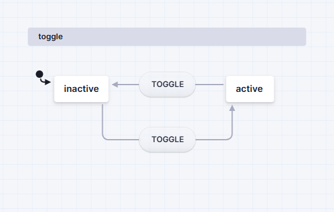
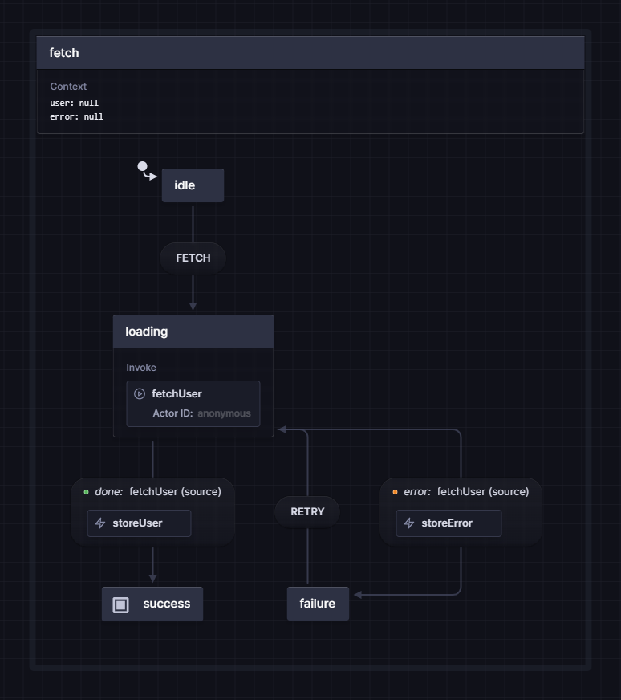
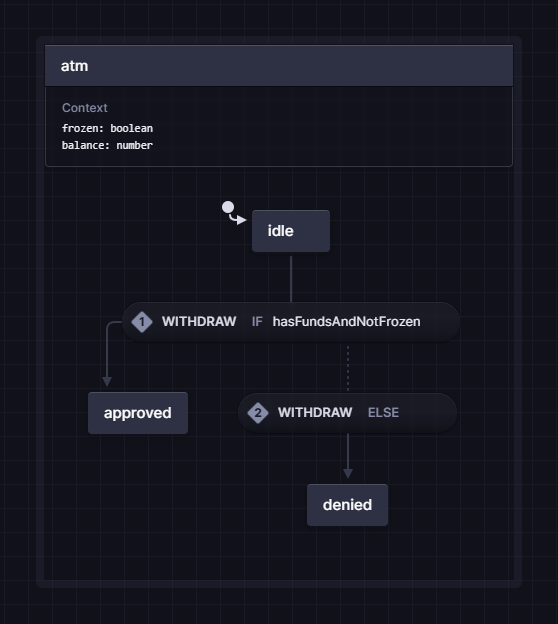
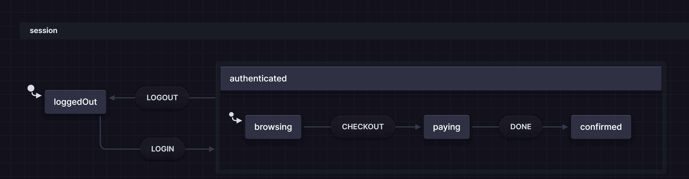
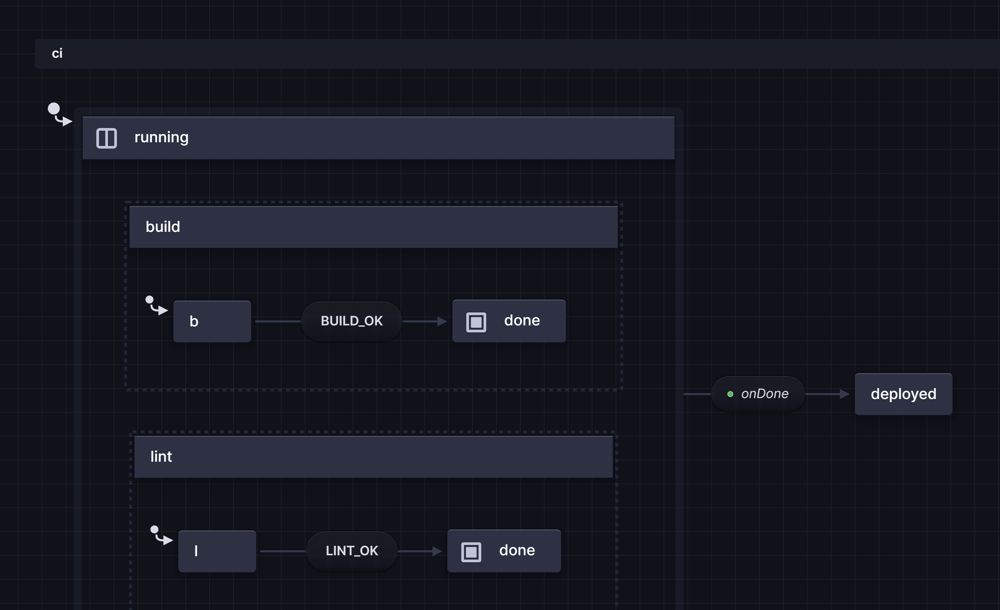
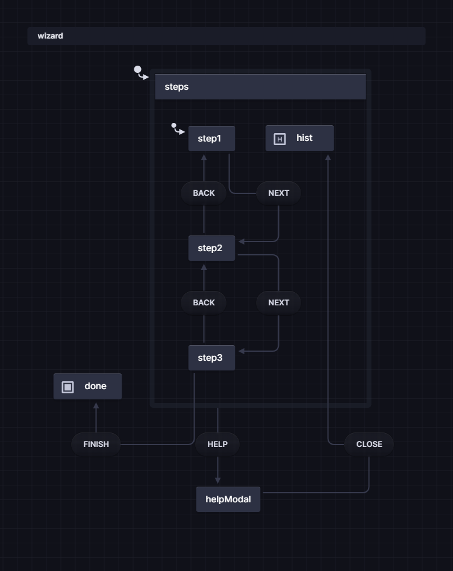
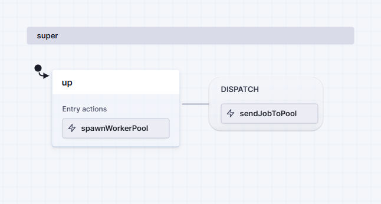
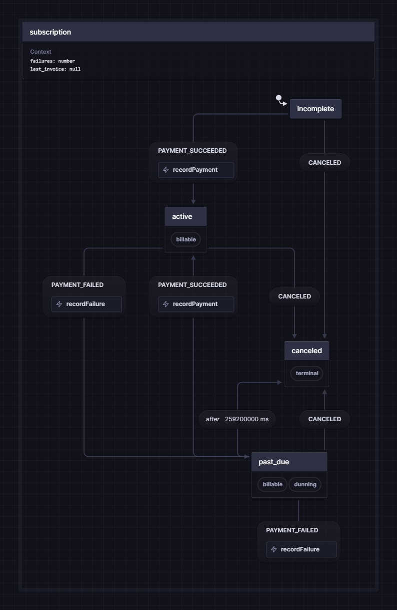
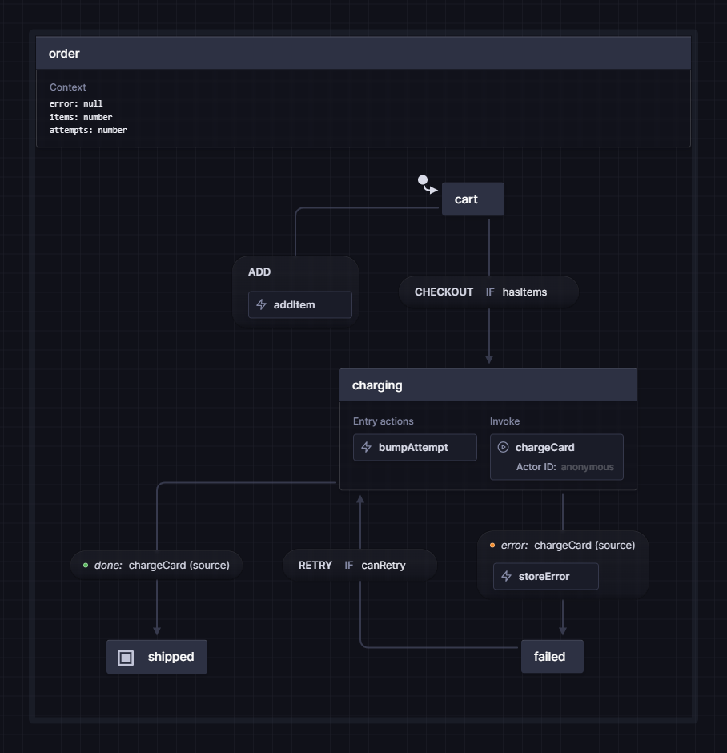
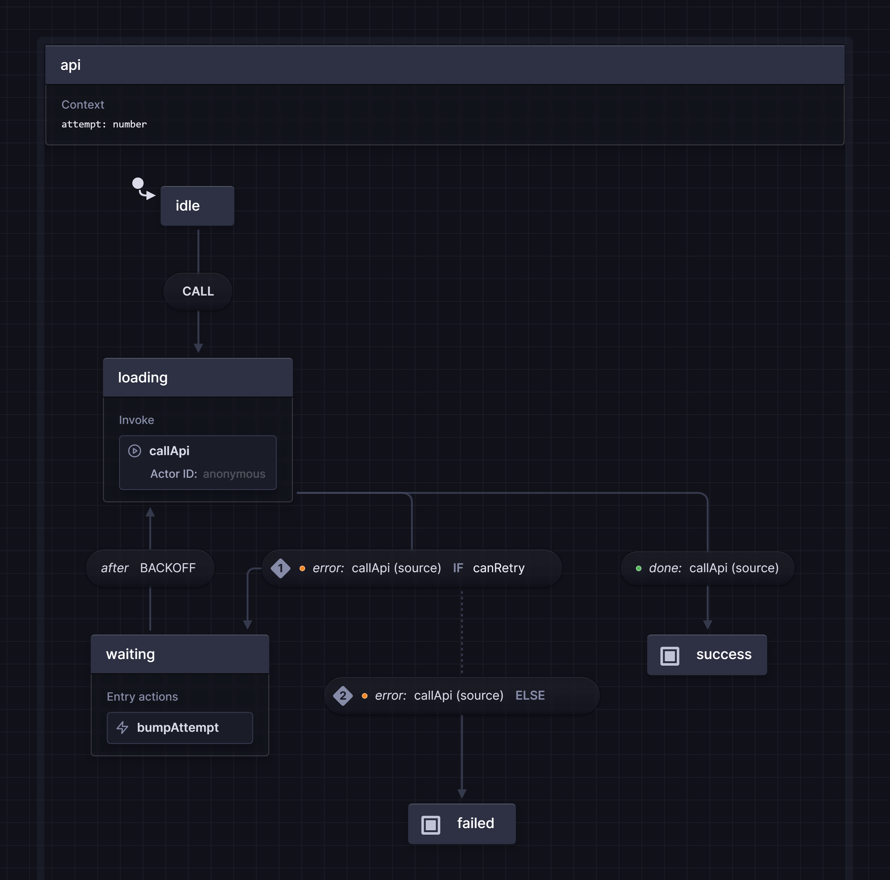

<div align="center">



# ⚙️ xstate-statemachine

### Statecharts for Python. Run your XState JSON — unmodified.

[](https://pypi.org/project/xstate-statemachine/)
[](https://pypi.org/project/xstate-statemachine/)
[](https://github.com/basiltt/xstate-statemachine/actions/workflows/ci.yml)
[](https://github.com/basiltt/xstate-statemachine/tree/main/tests/)
[](.github/workflows/ci.yml)
[](pyproject.toml)
[](src/xstate_statemachine/py.typed)
[](https://github.com/basiltt/xstate-statemachine/blob/main/LICENSE)

<br>

**The Python runtime for [XState](https://stately.ai/) / Stately.ai machine definitions — and a
production statechart engine in its own right.**

Design a flow once in the visual editor, ship the *same JSON* to your React frontend and your
Python backend. Async **and** sync interpreters. Durable persistence, idempotency and timers.
Framework adapters for FastAPI, Django, Flask, Celery and five message brokers. LLM-agent
orchestration where the model proposes and the chart decides. Zero runtime dependencies.

<br>

[**Install**](#-install) · [**60-Second Start**](#-the-60-second-start) · [**Why**](#-why-a-statechart) · [**Persistence**](#-persistence--snapshots-stores-and-durable-timers) · [**Integrations**](#-integrations--optional-extras) · [**Agents**](#-for-llm-agents) · [**CLI**](#️-cli-tool) · [**Docs**](https://basiltt.github.io/xstate-statemachine/)

</div>

---

<div align="center">

### 🗺️ Find your way

</div>

|   | Section | What you get |
|:--|:--|:--|
| 🚀 | [**Install**](#-install) · [**60-Second Start**](#-the-60-second-start) | Running in under a minute |
| 🧠 | [**Why a Statechart**](#-why-a-statechart) · [**Mental Model**](#-the-mental-model) | The three bugs this deletes |
| 🔗 | [**Stately ⇄ Python**](#-the-part-no-other-python-library-does) | One JSON, React *and* Python — every diagram here is the real editor rendering the real config |
| 🧩 | [**Context**](#-context--the-machines-memory) · [**Guards**](#️-guards--conditional-transitions) · [**Actions**](#-actions--side-effects) | The building blocks |
| 🔌 | [**Services**](#-services--invoke) · [**Timers**](#️-timers--delayed-transitions) | Async work and time |
| 🌳 | [**Nested**](#-nested--parallel-states) · [**Parallel**](#parallel-states--concurrent-regions) · [**History**](#-history--final-states) | Real-world hierarchy |
| 🎭 | [**Actors**](#-the-actor-model) | Systems of machines, supervision trees |
| 💾 | [**Persistence**](#-persistence--snapshots-stores-and-durable-timers) | Stores, locks, idempotency, durable `after`, audit log, migrations |
| 🔌 | [**Integrations**](#-integrations--optional-extras) · [**Event-driven**](#-event-driven-architecture) | FastAPI · Django · Flask · Litestar · SQLAlchemy · Redis · Celery · Kafka · RabbitMQ · NATS · SQS |
| 🤖 | [**For LLM agents**](#-for-llm-agents) | The model proposes, the machine decides: tool allow-lists, budgets, durable human approval |
| 🔭 | [**Observability**](#-observability--inspection) · [**Introspection & Plugins**](#-introspection--plugins) · [**Pure API**](#-the-pure-api--no-interpreter) | OTel, Prometheus, live Stately Inspector; observe and test |
| 🐍 | [**Pythonic API**](#-prefer-pure-python-three-more-ways-to-define-a-machine) | No JSON required |
| 🛠️ | [**CLI Tool**](#️-cli-tool) | Generate, validate, inspect, simulate, diagram, docs, DLQ, AsyncAPI — zero deps |
| 📚 | [**Cookbook**](#-cookbook) · [**Recipes**](https://basiltt.github.io/xstate-statemachine/guide/recipes/) · [**FAQ**](#-faq) | Copy-paste solutions, eight CI-tested recipes |
| ⚖️ | [**How It Compares**](#️-how-it-compares) | vs [transitions](https://basiltt.github.io/xstate-statemachine/guide/vs-transitions/), [python-statemachine](https://basiltt.github.io/xstate-statemachine/guide/vs-python-statemachine/), [django-fsm](https://basiltt.github.io/xstate-statemachine/guide/vs-django-fsm/), [LangGraph](https://basiltt.github.io/xstate-statemachine/guide/vs-langgraph/), [Burr](https://basiltt.github.io/xstate-statemachine/guide/vs-burr/), [@statelyai/agent](https://basiltt.github.io/xstate-statemachine/guide/vs-statelyai-agent/), [AWS Step Functions](https://basiltt.github.io/xstate-statemachine/guide/vs-step-functions/) |
| 🏭 | [**Production**](#-running-it-in-production) · [**Security**](#-security--trust-model) · [**API Reference**](#-api-reference) · [**Troubleshooting**](#-troubleshooting) | Failure semantics, threat model, every kwarg, every error |

---

<div align="center">

### ✨ What you get

</div>

<table>
<tr>
<td width="33%" valign="top">

**🔗 Real XState interop**

Run Stately.ai JSON **unmodified**. Not "inspired by" — the same file your frontend uses.
103 of 104 real-world exports in the test suite parse unchanged.

</td>
<td width="33%" valign="top">

**⚡ Async *and* sync**

`Interpreter` for asyncio, `SyncInterpreter` for scripts, Django and CLIs. One correctness
core; only *delivery* differs.

</td>
<td width="33%" valign="top">

**📦 Zero dependencies**

Pure standard library — `sqlite3`, `json`, `asyncio`, `threading`. Nothing to audit,
nothing to conflict, Python 3.9 → 3.14.

</td>
</tr>
<tr>
<td valign="top">

**🌳 Full statechart spec**

Nested, parallel, history, guards, `after` timers, `invoke`, actors, `always`, `raise`,
`sendTo`, `spawnChild`, `emit`, `escalate` — XState v5 semantics via the SCXML algorithm.

</td>
<td valign="top">

**💾 Durable by design**

`persisted()` loop with Memory / File / SQLite / Redis / SQLAlchemy / Django stores,
optimistic and fenced locks, `IdempotencyPlugin`, wall-clock `after` deadlines that wake
through `DueTimerScanner`, audit log with `replay()`, snapshot migrations.

</td>
<td valign="top">

**🧪 Testable by design**

A pure, interpreter-free API returns the next state as a value. `SimulatedClock` fires
timers on your schedule. `send(wait=True)` returns a `Receipt`. A pytest plugin walks
every engine-verified path and reports state/transition coverage.

</td>
</tr>
<tr>
<td valign="top">

**🛡️ Production hardening**

Per-machine `actionErrorPolicy`, `guardErrorPolicy`, `onUnhandled`, `strict` events,
`strict_config`, bounded inbox with `overflow_policy`, runaway-chain cut with a sticky
`chain_trips` latch. Silent acceptance is treated as a bug.

</td>
<td valign="top">

**🌐 Frameworks and brokers**

FastAPI · Starlette · Litestar · Flask · Django (+ DRF, Channels, admin, django-fsm
migration) · SQLAlchemy · Celery · Redis Streams · Kafka · RabbitMQ · NATS · SQS ·
CloudEvents. Every web adapter is **closed by default**.

</td>
<td valign="top">

**🛠️ A terminal toolkit**

`xsm` generates typed Python and **proves** it rebuilds your machine before writing;
validates, inspects, simulates, diagrams, documents, streams to the Stately Inspector,
replays a dead-letter queue and emits AsyncAPI. Interactive launcher on a bare `xsm`.

</td>
</tr>
</table>

---

### 🤖 For LLM agents

An agent loop is a statechart the model does not get to rewrite. With
`pip install "xstate-statemachine[agents]"` the model becomes one invoked service that
*proposes* text or tool calls, and the chart *decides*. Per-state tool allow-lists are
re-checked inside `run_tool` even if a guard is edited out of the chart. Budgets are guards,
timeouts are `after` deadlines, and human approval is a durable, persisted state with an
escalation deadline. Multi-agent supervision (`spawn_agent`, `BudgetPlugin`, `handoff_guard`)
ships with `supervisor`, `pipeline` and `debate` reference charts. All of it runs offline
with `FakeModel`, and it interoperates with
[LangGraph and pydantic-ai](https://basiltt.github.io/xstate-statemachine/guide/integration-agents/).
Honest [comparisons](https://basiltt.github.io/xstate-statemachine/guide/vs-langgraph/) are
checked nightly against the installed competitor.

<!-- doc-requires: pydantic -->
```python
# pip install "xstate-statemachine[agents]"   # … the extra's only hard dependency is pydantic
import asyncio
from xstate_statemachine.contrib.agents import FakeModel, run_agent, tool_registry

def get_weather(city: str) -> str:
    """Current weather for a city."""
    return f"sunny in {city}"

model = FakeModel([{"tool": "get_weather", "args": {"city": "Kochi"}}, {"text": "Sunny."}])
res = asyncio.run(run_agent(model, tools=tool_registry(get_weather), prompt="Weather?", max_turns=5))
assert res.final_state == "toolLoop.done" and res.usage["turns"] == 2
```

A complete, offline, two-minute walkthrough lives in
[`examples/integrations/agents_support_bot`](https://github.com/basiltt/xstate-statemachine/tree/main/examples/integrations/agents_support_bot)
(`python run.py --fake --prompt "refund order 42"`).

---

## 🚀 Install

```bash
pip install xstate-statemachine
```

That's the whole story. **Zero runtime dependencies** — pure standard library, Python 3.9 → 3.14.

```bash
xsm info          # verify the install
xsm update        # later: upgrade to the latest release
```

Everything else is an **extra** you opt into — `pip install "xstate-statemachine[fastapi]"`,
`[django]`, `[redis]`, `[agents]`, `[observability]`, `[testing]`, … or `[all]` for every one of
them. The full table with install sizes and status is in
[Integrations](#-integrations--optional-extras).

[](https://basiltt.github.io/xstate-statemachine/guide/cli/#in-ci-and-pre-commit) [](https://basiltt.github.io/xstate-statemachine/guide/cli/#in-ci-and-pre-commit) — validate machine JSON and keep generated code current in CI. New here? Start with the [integrations journey](https://basiltt.github.io/xstate-statemachine/guide/integrations/) or scaffold a service with `xsm new my_service`.

<details>
<summary><b>Supply chain: Trusted Publishing and PEP 740 attestations</b></summary>

<br>

Releases are published from GitHub Actions through PyPI **Trusted Publishing** (no long-lived
token) and carry **PEP 740 build provenance attestations** binding each wheel and sdist to the
exact run, commit and workflow that built it. To verify an artefact instead of trusting a
diff you ran yourself:

```bash
pip install pypi-attestations
pypi-attestations verify pypi --repository https://github.com/basiltt/xstate-statemachine \
  pypi:xstate_statemachine-0.11.0-py3-none-any.whl   # prints "OK: <file>" on success
```

</details>

<details>
<summary><b>uv · poetry · pipx · Windows</b></summary>

<br>

```bash
uv add xstate-statemachine
poetry add xstate-statemachine
pipx install xstate-statemachine     # if you only want the `xsm` CLI
```

**Windows, `xsm.exe` blocked by an Application Control policy?** That is pip's unsigned
launcher stub being refused by WDAC / AppLocker, not the package. Run
`python -m xstate_statemachine setup` once: it parks the blocked launcher and installs a batch
shim, after which `xsm` works normally (re-run after `pip install --upgrade`; `--undo` reverts).
`python -m xstate_statemachine …` always works too.
Details: [CLI → Windows](https://basiltt.github.io/xstate-statemachine/guide/cli/#windows-an-application-control-policy-has-blocked-this-file).

Want the code generator's output line-wrapped to match your linter? `pip install "xstate-statemachine[format]"`
adds `black` and `isort`; without them generated code is still valid, just not reformatted.

</details>

---

## ⚡ The 60-Second Start

Copy, paste, run. No async, no setup, no config files.

```python
from xstate_statemachine import create_machine, SyncInterpreter

machine = create_machine({
    "id": "toggle",
    "initial": "inactive",
    "states": {
        "inactive": {"on": {"TOGGLE": "active"}},
        "active":   {"on": {"TOGGLE": "inactive"}},
    },
})

light = SyncInterpreter(machine).start()

print(light.current_state_ids)      # {'toggle.inactive'}
light.send("TOGGLE")
print(light.current_state_ids)      # {'toggle.active'}
light.send("BANANA")                # not a legal event here
print(light.current_state_ids)      # {'toggle.active'}  ← ignored, not crashed
```

You just declared the **complete** set of legal states and the **only** legal moves between
them. `TOGGLE` advances the machine. `BANANA` is ignored — not raised, not silently
mishandled. Ignored, because the current state does not accept it. (Want it to raise instead?
`SyncInterpreter(machine, strict=True)` → `UnknownEventError` at the call site.)

That single property is what kills a whole category of bug.

---

## 🧠 Why a Statechart?

Every non-trivial flow starts as a few booleans. Then it grows.

<table>
<tr>
<td width="50%" valign="top">

**😖 Boolean soup**

```python
if is_loading and not is_error:
    ...
elif is_error and retry_count < 3:
    ...
elif is_authenticated and not is_loading:
    ...
```

Four booleans = **16 combinations**. You handled maybe six.
The other ten are *reachable* — and one of them is
`is_loading=True, is_error=True, is_success=True`.

Nothing stops it. Nothing warns you. It just happens in
production at 3am.

</td>
<td width="50%" valign="top">

**😌 A statechart**

```jsonc
"states": {
    "idle":    {"on": {"FETCH": "loading"}},
    "loading": {"on": {"OK": "done",
                       "ERR": "failed"}},
    "failed":  {"on": {"RETRY": "loading"}},
    "done":    {"type": "final"},
}
```

Four states = **exactly four possibilities**. The impossible
ones cannot be constructed, because you never wrote a path
to them.

Illegal events in the current state are simply ignored.

</td>
</tr>
</table>

### The three bugs this eliminates

| Bug | How booleans cause it | How a statechart prevents it |
|:--|:--|:--|
| 🕳️ **Impossible states** | `is_loading` *and* `is_error` both true | The machine is in exactly one state per region |
| 👻 **Zombie callbacks** | A late API response fires after the user cancelled | The event isn't handled in `cancelled`, so it's discarded |
| 🔁 **Double submission** | A second click before the first finishes | `submitting` has no `SUBMIT` handler — the click does nothing |

> **The rule** — a machine is in **exactly one state per region**. Parallel states have
> multiple regions, so multiple states are active at once, which is why
> `current_state_ids` returns a *set*.

---

## 🔗 The Part No Other Python Library Does

Your frontend team models a checkout flow in [Stately.ai](https://stately.ai/). They export
`checkout.json` and wire it into React with XState.

You take **that exact file** — unedited — and run it in Python:

<!-- doc-fragment -->
```python
import json
from xstate_statemachine import create_machine, MachineLogic, SyncInterpreter

with open("checkout.json") as f:          # ← straight from the frontend repo
    config = json.load(f)

machine = create_machine(config, logic=MachineLogic(
    actions={"charge_card": charge_card},   # you supply the Python side
    guards={"has_stock": has_stock},
))

checkout = SyncInterpreter(machine).start()
```

One definition. Two runtimes. **The UI cannot render a step your backend considers illegal**,
because there is only one source of truth for what the steps *are*.

It works in the other direction too. **Every diagram in this README is the Stately editor
rendering the exact JSON the adjacent Python runs** — the configs live in
[`docs/assets/images/machines/machines.json`](docs/assets/images/machines/machines.json),
and `xsm diagram` or `machine.to_mermaid()` produce the same picture without leaving the
terminal. The guide to the round trip, the `version` key, meta conventions and the editor
JSON Schema is [Stately editor → Python](https://basiltt.github.io/xstate-statemachine/guide/stately-export/).

<details>
<summary><b>How compatible is "compatible"? (real numbers)</b></summary>

<br>

The test suite includes **104 real-world machines exported from Stately.ai**. 103 of them parse
structurally unmodified. The single exception has no top-level `states` key at all — it isn't a
well-formed machine.

Both XState **v4** (`cond`) and **v5** (`guard`) transition spellings are accepted, so machines
from either generation work.

What is *not* supported: JS/TS action implementations embedded in the JSON. Those are code, not
data — you supply the Python equivalents via `MachineLogic`, which is the whole point of the
separation.

</details>

> **Note** — this library implements the **SCXML** transition-selection algorithm (the W3C
> standard XState itself follows). That is what makes nested and parallel-region behaviour
> match XState rather than merely resemble it. It does *not* import or export `.scxml` files.

---

## 🧩 The Mental Model

Six concepts. That's the entire library.

| Concept | What it is | In JSON |
|:--|:--|:--|
| **State** | A named mode the machine can be in | `"states": {"idle": {}}` |
| **Event** | A message you send in | `interp.send("FETCH")` |
| **Transition** | "In state X, event E moves to Y" | `"on": {"FETCH": "loading"}` |
| **Context** | Everything that isn't a state — the data | `"context": {"retries": 0}` |
| **Guard** | A condition that must hold for a transition | `{"target": "x", "guard": "isReady"}` |
| **Action** | A side effect that fires during a transition | `{"target": "x", "actions": ["save"]}` |

The split that matters: **state** is *where you are*, **context** is *what you know*.
`retries` is context. `retrying` is a state. Getting that boundary right is 90% of good
statechart design.

<div align="center">

</div>

---

## 💾 Context — The Machine's Memory

Context is a plain dict. Update it declaratively with `assign`:

```python
from xstate_statemachine import create_machine, SyncInterpreter, assign

cart = SyncInterpreter(create_machine({
    "id": "cart",
    "initial": "shopping",
    "context": {"items": 0, "total": 0.0},
    "states": {
        "shopping": {
            "on": {
                "ADD_ITEM": {"actions": assign({
                    "items": lambda a: a["context"]["items"] + 1,
                    "total": lambda a: a["context"]["total"] + a["event"].payload["price"],
                })},
                "CLEAR": {"actions": assign(lambda a: {"items": 0, "total": 0.0})},
            }
        }
    },
})).start()

cart.send("ADD_ITEM", price=9.99)
cart.send("ADD_ITEM", price=5.01)
print(cart.context)          # {'items': 2, 'total': 15.0}
```

`assign` takes either a **dict of per-key updaters** or a **single callable** returning a
partial dict. Each updater receives one mapping with `"context"` and `"event"` keys.

> **Tip** — keyword arguments to `send()` land in `event.payload`.
> `send("ADD_ITEM", price=9.99)` → `a["event"].payload["price"]`.

Keys that start with `_xsm_` (`PRIVATE_CONTEXT_PREFIX`) are **private context**: they
round-trip through snapshots but are stripped by `public_context()` and never leave the
process through the web adapters. Want typed context? `[pydantic]` validates it on every
`assign` — see [Integrations](#-integrations--optional-extras).

---

## 🛡️ Guards — Conditional Transitions

A guard is a pure function returning `bool`. List transitions in priority order; the **first**
whose guard passes wins.

<div align="center">

</div>

```python
from xstate_statemachine import create_machine, SyncInterpreter, MachineLogic

config = {
    "id": "atm",
    "initial": "idle",
    "context": {"balance": 100, "frozen": False},
    "states": {
        "idle": {
            "on": {
                "WITHDRAW": [
                    {"target": "approved", "guard": {
                        "type": "and",
                        "params": {"guards": [
                            "hasFunds",
                            {"type": "not", "params": {"guards": ["isFrozen"]}},
                        ]},
                    }},
                    {"target": "denied"},          # fallback — no guard
                ]
            }
        },
        "approved": {}, "denied": {},
    },
}

logic = MachineLogic(guards={
    "hasFunds": lambda ctx, e: ctx["balance"] >= e.payload.get("amount", 0),
    "isFrozen": lambda ctx, e: ctx["frozen"],
})

atm = SyncInterpreter(create_machine(config, logic=logic)).start()
atm.send("WITHDRAW", amount=50)
print(atm.current_state_ids)      # {'atm.approved'}
```

**Composite guards** — `and`, `or`, `not` nest arbitrarily via `params.guards`. There's also
`stateIn` for "only if some other region is in state X":

```python
{"guard": {"type": "stateIn", "params": {"state": "auth.loggedIn"}}}
```

> **Note** — guards must be **pure**. They can be evaluated more than once, and a guard with
> side effects will surprise you. Put side effects in actions. A guard that *raises* is
> treated as `False` by default (`guardErrorPolicy` lets you change that), and a guard that is
> declared but never implemented fails loudly at `create_machine()`.

---

## 🎬 Actions — Side Effects

Actions fire **during** a transition, or on entering/leaving a state.

```jsonc
"states": {
    "loading": {
        "entry": ["showSpinner"],          # on the way in
        "exit":  ["hideSpinner"],          # on the way out
        "on": {"CANCEL": {"target": "idle", "actions": ["logCancel"]}},
    }
}
```

Order is guaranteed: **exit actions → transition actions → entry actions**.

### Built-in action creators

You rarely need to hand-write these — import them and go:

| Creator | Does |
|:--|:--|
| `assign` | Update context |
| `log` | Structured log line |
| `raise_` | Send an event to *this* machine |
| `send_to` | Send to another actor by id or `systemId` |
| `send_parent` | Send to the machine that spawned you |
| `choose` | Run the first action list whose guard passes |
| `pure` | Compute actions from context at runtime |
| `enqueue_actions` | Imperatively queue actions in a callback |
| `spawn_child` / `stop_child` | Start / stop a child actor |
| `cancel` | Cancel a delayed `send_to` |
| `emit` | Emit an event to external subscribers |
| `escalate` | Raise an error to the parent |
| `forward_to` | Forward the current event to another actor |

> **Note** — if an action raises, the error is **logged and contained** by default. The
> transition still completes and the interpreter keeps running; one buggy side effect can't
> take down a long-lived machine. `actionErrorPolicy: "rollback"` or `"fail"` changes that
> per machine — see [Failure semantics](#failure-semantics--know-what-is-contained).

<details>
<summary><b>Worked examples — the ones that aren't obvious from the name</b></summary>

<br>

**`choose` — first passing guard wins.** The declarative form of `if/elif/else`:

```jsonc
"on": {"GO": {"target": "b", "actions": [choose([
    {"guard": "isBig",   "actions": [assign({"label": lambda a: "big"})]},
    {"guard": "isSmall", "actions": [assign({"label": lambda a: "small"})]},
    {"actions": [assign({"label": lambda a: "other"})]},   # no guard = default
])]}}
```

**`pure` — decide the action list at runtime.** Return actions, or nothing:

```jsonc
"actions": [pure(lambda a:
    [assign({"n": lambda b: b["context"]["n"] * 2})]
    if a["context"]["n"] < 10 else []
)]
```

**`raise_` — feed an event back to *this* machine.** "And then immediately…" without a fake
external trigger:

```jsonc
"actions": [raise_("VALIDATE")]
```

**`send_to` / `send_parent` — talk to other actors.** Delayed sends are cancellable:

```jsonc
"actions": [send_to("timer", "TICK", delay=1000, send_id="tick")]
# elsewhere
"actions": [cancel("tick")]
```

**`emit` — publish outward without coupling.** The machine says *what happened*;
subscribers decide what to do:

```jsonc
"actions": [emit("saved")]                        # or emit({"type": "saved", "id": 7})
interpreter.on("saved", lambda ev: analytics.track(ev.type))
```

</details>

---

## 🔌 Services & Invoke

`invoke` runs an async or sync callable when a state is entered, and routes its result back
into the machine as `onDone` / `onError`. This is how you do I/O.

```python
import asyncio
from xstate_statemachine import (
    create_machine, Interpreter, MachineLogic, assign, wait_for,
)

config = {
    "id": "fetch",
    "initial": "idle",
    "context": {"user": None, "error": None},
    "states": {
        "idle": {"on": {"FETCH": "loading"}},
        "loading": {
            "invoke": {
                "src": "fetchUser",
                "onDone": {"target": "success",
                           "actions": assign({"user": lambda a: a["event"].data})},
                "onError": {"target": "failure",
                            "actions": assign({"error": lambda a: str(a["event"].data)})},
            }
        },
        "success": {"type": "final"},
        "failure": {"on": {"RETRY": "loading"}},
    },
}

async def fetch_user(interpreter, ctx, event):
    await asyncio.sleep(0.01)
    return {"id": 1, "name": "Ada"}

async def main():
    machine = create_machine(config, logic=MachineLogic(services={"fetch_user": fetch_user}))
    svc = await Interpreter(machine).start()

    await svc.send("FETCH")
    await wait_for(svc, lambda s: s.matches("fetch.success"), timeout=2)

    print(svc.context["user"])        # {'id': 1, 'name': 'Ada'}
    await svc.stop()

asyncio.run(main())
```

- **Success** → `onDone`, with the return value on `event.data`
- **Failure** → `onError`, with the *exception object* on `event.data`
- Leaving the state **cancels** the service automatically — no zombie tasks
- A plain-`def` service under the async engine runs on a private thread pool
  (`service_pool_size`, or your `service_executor`) so a blocking call cannot stall the loop

Beyond callables, `src` can be **actor logic**: `from_callback` (push events in from a socket
or a thread), `from_iterator` / `from_async_iterator` (each item becomes a `StreamEvent`),
`from_coroutine`, `from_interpreter` (a whole child machine), or a Celery task via
`celery_service`.

> **Tip** — use `wait_for` (async) or `wait_for_sync` rather than `asyncio.sleep()` guesses.
> It polls a predicate with a real timeout, so tests stay fast and never flake.

---

## ⏱️ Timers & Delayed Transitions

`after` fires a transition if the machine is *still* in that state when the timer elapses.
Leave early and the timer is cancelled for you.

```jsonc
"connecting": {
    "after": {5000: "timedOut"},          # 5000 ms
    "on": {"OPEN": "online"},             # ...unless we connect first
}
```

Name your delays to keep magic numbers out of the config — and to compute them at runtime,
which is exactly how you express **exponential backoff**:

```python
logic = MachineLogic(delays={
    "TIMEOUT": 60_000,
    "BACKOFF": lambda ctx, e: 2 ** ctx["attempt"] * 1000,   # 1s, 2s, 4s, 8s…
})
```

```jsonc
"retrying": {"after": {"BACKOFF": "loading"}}
```

Three things make timers production-grade here rather than a `threading.Timer` per state:

- **No OS thread per timer.** The async engine fires `after` through a priority lane the run
  loop checks ahead of its inbox; the sync engine fires a due timer on the caller's thread
  inside `send()` or `tick()`.
- **Virtual time in tests.** `SimulatedClock().increment(30_000)` fires a 30-second `after`
  instantly.
- **Durable across restarts.** Deadlines persist as wall-clock instants; `persisted()`
  resumes the *remaining* time and `DueTimerScanner` wakes a machine whose deadline passed
  while nothing was running — a 7-day dunning timer survives every worker dying. See
  [Persistence](#-persistence--snapshots-stores-and-durable-timers).

---

## 🌳 Nested & Parallel States

### Nested (compound) states

Group related substates so shared transitions live in one place:

<div align="center">

</div>

```jsonc
"states": {
    "loggedOut": {"on": {"LOGIN": "authenticated"}},
    "authenticated": {
        "initial": "browsing",
        "on": {"LOGOUT": "loggedOut"},     # ← applies to EVERY substate
        "states": {
            "browsing":  {"on": {"CHECKOUT": "paying"}},
            "paying":    {"on": {"DONE": "confirmed"}},
            "confirmed": {},
        },
    },
}
```

`LOGOUT` works from `browsing`, `paying`, *and* `confirmed`. Write it once.

### Parallel states — concurrent regions

Regions run independently. `onDone` fires **exactly once**, when *all* of them reach a final
state — fan-out and fan-in with no bookkeeping:

<div align="center">

</div>

```python
from xstate_statemachine import create_machine, SyncInterpreter

ci = SyncInterpreter(create_machine({
    "id": "ci",
    "initial": "running",
    "states": {
        "running": {
            "type": "parallel",
            "onDone": "deployed",
            "states": {
                "build": {"initial": "b", "states": {
                    "b": {"on": {"BUILD_OK": "done"}}, "done": {"type": "final"}}},
                "lint":  {"initial": "l", "states": {
                    "l": {"on": {"LINT_OK": "done"}},  "done": {"type": "final"}}},
            },
        },
        "deployed": {},
    },
})).start()

print(sorted(ci.current_state_ids))   # ['ci.running.build.b', 'ci.running.lint.l']
ci.send("BUILD_OK")
print(sorted(ci.current_state_ids))   # ['ci.running.build.done', 'ci.running.lint.l']
ci.send("LINT_OK")
print(sorted(ci.current_state_ids))   # ['ci.deployed']   ← fan-in fired
```

This is where `current_state_ids` returning a **set** finally makes sense.

---

## 🕰️ History & Final States

**History** remembers where you were, so an interruption doesn't lose progress — the classic
"resume the wizard where the user left off":

<div align="center">

</div>

```jsonc
"states": {
    "steps": {
        "initial": "step1",
        "on": {"HELP": "helpModal"},
        "states": {
            "step1": {"on": {"NEXT": "step2"}},
            "step2": {"on": {"NEXT": "step3", "BACK": "step1"}},
            "step3": {"on": {"FINISH": "#wizard.done", "BACK": "step2"}},
            "hist":  {"type": "history", "history": "shallow"},   # or "deep"
        },
    },
    "helpModal": {"on": {"CLOSE": "steps.hist"}},    # ← back to the exact step
    "done": {"type": "final"},
}
```

**Final states** mark completion. A final state in a compound state fires its parent's
`onDone`; a top-level final state stops the machine and can produce `output`. Await it with
`to_promise(interp)` or `interp.wait_done()`.

---

## 🎭 The Actor Model

Machines can spawn other machines. Each child gets its own state, context and lifecycle —
a supervision tree, not a callback pile. Register a child under a `systemId` and any machine
in the system can address it by name.

<div align="center">

</div>

```python
from xstate_statemachine import create_machine, SyncInterpreter, MachineLogic

# The child machine — an independent actor with its own context.
worker = {
    "id": "worker",
    "initial": "idle",
    "context": {"jobs": 0},
    "states": {"idle": {"on": {"JOB": {"target": "idle", "actions": ["count"]}}}},
}
worker_logic = MachineLogic(actions={
    "count": lambda i, ctx, e, a: ctx.__setitem__("jobs", ctx["jobs"] + 1),
})

parent = {
    "id": "super",
    "initial": "up",
    "context": {},
    "states": {
        "up": {
            "entry": [{"type": "spawnChild",
                       "params": {"src": "worker", "id": "pool", "systemId": "pool"}}],
            "on": {"DISPATCH": {"actions": [
                {"type": "sendTo", "params": {"to": "pool", "event": {"type": "JOB"}}}
            ]}},
        }
    },
}

logic = MachineLogic(services={
    "worker": lambda i, ctx, e: create_machine(worker, logic=worker_logic),
})

sup = SyncInterpreter(create_machine(parent, logic=logic)).start()
print(list(sup.system.get_all()))          # ['pool']

sup.send("DISPATCH")
sup.send("DISPATCH")
print(sup.system.get("pool").context["jobs"])   # 2
```

Children talk back with `send_parent`, escalate failures with `escalate`, and are torn down
with `stop_child` — or automatically when the parent stops. Spawned actors inherit the
parent's plugins and are captured in its snapshot.

**Good fit for:** LLM agent orchestration (each tool call a supervised child — see
[`spawn_agent`](#-for-llm-agents)), connection pools, per-user session machines, job workers.

---

## 💾 Persistence — Snapshots, Stores and Durable Timers

Serialize a running machine to JSON, store it anywhere, rebuild it later. Long-running flows
survive deploys and restarts.

<!-- doc-fragment -->
```python
from xstate_statemachine import create_machine, SyncInterpreter

job = SyncInterpreter(create_machine(config)).start()
job.send("NEXT")

snapshot = job.get_snapshot()      # a JSON string → Redis, Postgres, a file…
job.stop()

# …new process, hours later…
resumed = SyncInterpreter.from_snapshot(snapshot, create_machine(config))
print(resumed.current_state_ids)   # {'job.step2'}   ← exactly where it left off
resumed.send("NEXT")
```

State, context, pending events (with their lane), deferred events, armed delayed sends,
history, child actors, `after` deadlines and `systemId` registrations all round-trip.
Every snapshot carries an envelope (`version` — layout **4** — `machine_id`, `machine_hash`,
`machine_version`), so `from_snapshot()` refuses a structurally different machine with
`SnapshotDriftError` instead of silently resuming into it; a newer layout than this release
understands is `SnapshotVersionError`, never a guess.

### The safe loop: load → act → persist → discard

Most apps never call `from_snapshot` by hand. `xstate_statemachine.persistence` ships the
whole loop with built-in stores — `MemoryStore`, `FileStore` (atomic writes, `0600`),
`SQLiteStore` (WAL, stdlib `sqlite3`) — and `RedisStore`, `SQLAlchemyStore` /
`AsyncSQLAlchemyStore` and `DjangoStore` in their extras:

```python
from xstate_statemachine import MachineLogic, create_machine
from xstate_statemachine.persistence import MemoryStore, persisted

cfg = {"id": "order", "initial": "cart", "context": {"items": 0},
       "states": {"cart": {"on": {"ADD": {"actions": "add"}, "PAY": "paid"}},
                  "paid": {"type": "final"}}}
machine = create_machine(cfg, logic=MachineLogic(
    actions={"add": lambda i, ctx, e, a: ctx.__setitem__("items", ctx["items"] + 1)}))
store = MemoryStore()                      # or SQLiteStore("orders.db"), RedisStore(...)

with persisted(store, "order:42", machine) as order:   # loaded (or created), started
    order.send("ADD")
    order.send("ADD")
# saved with expected_version on clean exit; a concurrent writer gets ConflictError

with persisted(store, "order:42", machine) as order:
    assert order.context["items"] == 2
    assert order.send("PAY", wait=True).changed
assert store.load("order:42").version == 2
```

`apersisted()` is the async twin; `persisted_retry()` reloads and re-applies on
`ConflictError`. What the loop gives you, all documented on the
[Guarantees](https://basiltt.github.io/xstate-statemachine/guide/guarantees/) page:

| Concern | What you get |
|:--|:--|
| Two workers, one instance | `OptimisticLock` (version check + jittered retry) or a fenced `PessimisticLock` — **never a silent lost update** |
| Duplicate webhooks | `IdempotencyPlugin(inbox, principal=…)` answers a replay with the **original receipt** before the machine sees it; scope is per tenant. `MemoryInbox`, `SQLiteInbox`, `RedisInbox`, `DjangoInbox` |
| Timers across restarts | `after` deadlines are persisted as wall-clock instants; `persisted()` resumes the **remaining** time, and `DueTimerScanner` wakes machines whose deadline passed while nothing was running (drive it from cron, APScheduler or Celery Beat) |
| Audit / replay | `AuditPlugin` + `TransitionLogPlugin` (who, what, when) into `MemoryLog`, `JSONLinesLog`, `SQLiteLog` or `RedisLog`; `replay()` a log into a fresh machine and `assert_replay_consistent()` in tests |
| Schema drift | `@migrator.register("1.0", "1.1")` steps upgrade in-flight instances across a deploy; `xsm snapshots --stale` finds the ones written by another machine version; unknown or newer layouts are refused, never guessed at |
| Adopting an existing table | `from_state_ids(machine, ids, context)` mints a valid snapshot from the state column you already have (how `xsm_migrate_fsm` moves a django-fsm model over) |
| Secrets | One `redact()` denylist applied by every built-in sink; a `SnapshotCodec` seam for encryption at rest; `SnapshotTooLargeError` caps blob size |
| The store is down | `StoreUnavailableError` → **503** in every web adapter, never a half-applied event |

The honest boundary: transitions are **exactly-once** for an idempotency-keyed event; the
side effects your actions perform are **at-least-once**. Put them behind `invoke` or the
[transactional outbox](#-event-driven-architecture) and make them idempotent. Full guide →
[Persistence & Durability](https://basiltt.github.io/xstate-statemachine/guide/persistence/).

---

## 🔌 Integrations — Optional Extras

The core stays zero-dependency; every integration is an extra under `xstate_statemachine.contrib`
that you install explicitly (`pip install "xstate-statemachine[fastapi]"`). Each has a guide
page with a **Guarantees** box and a **Threat model** box — CI refuses a page without them —
and every framework version it claims is proven by a CI cell on the
[Compatibility](https://basiltt.github.io/xstate-statemachine/guide/compatibility/) page.

| Extra | What you get | Guide |
|:--|:--|:--|
| `[pydantic]` | Typed context validated on every `assign`, `EventModel` discriminated unions → `event_schemas=`, `validate_machine_json()`, JSON Schema | [Pydantic](https://basiltt.github.io/xstate-statemachine/guide/integration-pydantic/) |
| `[redis]` | `RedisStore` / `RedisInbox` / `RedisLog` with fenced locks (Lua, fencing tokens) for multi-host deployments; `RedisStreamsBroker` | [Redis](https://basiltt.github.io/xstate-statemachine/guide/integration-redis/) |
| `[sqlalchemy]` | `StatechartType` + `StatechartMixin` (state on your row, `version_id_col` locking, `in_state()`), `SQLAlchemyStore` / `AsyncSQLAlchemyStore`, transactional outbox (`SQLAlchemyOutboxStore`) | [SQLAlchemy](https://basiltt.github.io/xstate-statemachine/guide/integration-sqlalchemy/) |
| `[starlette]` | `StatechartRegistry` — the store-backed create → act → persist loop as ASGI middleware; receipt → HTTP status; principal-scoped `Idempotency-Key`; RFC 9457 problems; SSE and WebSocket transition streams | [Starlette](https://basiltt.github.io/xstate-statemachine/guide/integration-starlette/) |
| `[fastapi]` | `StatechartRouter` generates `GET /{id}`, `POST /{id}/send` (discriminated-union body), one route per event, `/events`, `/diagram.mmd`, `/stream`, `/ws` — with OpenAPI that reflects your chart; `Depends(get_interpreter(...))`; `xsm new --template fastapi` | [FastAPI](https://basiltt.github.io/xstate-statemachine/guide/integration-fastapi/) |
| `[litestar]` | `XStatePlugin` + a generated `Controller` on the same registry | [Litestar](https://basiltt.github.io/xstate-statemachine/guide/integration-litestar/) |
| `[flask]` | `init_app` extension, statechart blueprint, `SessionStore` wizards, `flask xsm` CLI, Quart shim; `xsm new --template flask` | [Flask](https://basiltt.github.io/xstate-statemachine/guide/integration-flask/) |
| `[django]` | `StatechartField` on your model (`in_state()`, `__state` lookups), `send()` in `atomic()` with `lock="optimistic"` or a row lock, `pre_transition` / `post_transition` / `statechart_error` signals, `TransitionLog` audit in the same transaction, `PermissionGuard` / `RoleGuard` / `AnyOf` / `AllOf`, `DjangoStore`, `DjangoOutboxStore`, admin transition buttons (CSRF-protected), `manage.py xsm_inspect / xsm_diagram / xsm_docs / xsm_simulate / xsm_snapshots --stale / xsm_deadlines`, `xsm_migrate_fsm` + `FSMDualWriteMixin` to leave django-fsm | [Django](https://basiltt.github.io/xstate-statemachine/guide/integration-django/) |
| `[drf]` / `[channels]` | `StatechartViewSetMixin` (an `@action` per event, closed by default, receipt → status, drf-spectacular schema, `DjangoInbox` for `Idempotency-Key`); `StatechartConsumer` (live transitions over WebSocket, requires `AuthMiddlewareStack`) | [DRF & Channels](https://basiltt.github.io/xstate-statemachine/guide/integration-drf/) |
| `[celery]` | A Celery task as an `invoke` service (`celery_service`), `@statechart_task` worker act-loop, Celery Beat as the durable `after` scheduler (`DurableTimerScheduler`), `outbox_relay_task`; refuses pickle / YAML serializers | [Celery](https://basiltt.github.io/xstate-statemachine/guide/integration-celery/) |
| `[kafka]` `[rabbitmq]` `[nats]` `[sqs]` + `[redis]` | Broker adapters (`KafkaBroker`, `RabbitMQBroker`, `NatsBroker`, `SqsBroker` / `SyncSqsBroker`, `RedisStreamsBroker` / `SyncRedisStreamsBroker`): at-least-once, per-subject order, redelivery counts as attempts, poison → DLQ. All pass one `AsyncBrokerContract`; `xsm plugins` lists them | [Brokers](https://basiltt.github.io/xstate-statemachine/guide/integration-brokers/) |
| *(core)* + `[cloudevents]` | The [event-driven core](#-event-driven-architecture) below; the extra adds CloudEvents SDK / HTTP binding interop | [Event-driven](https://basiltt.github.io/xstate-statemachine/guide/integration-eda/) |
| `[agents]` | [LLM agents](#-for-llm-agents): `TOOL_LOOP`, per-state tool allow-lists, budgets (`BudgetPlugin`, `budget_guards`, `Usage`), durable human approval, `spawn_agent`; `agent_logic`, `run_agent_sync`, `structured_output`, `handoff_guard`, `AgentTracePlugin`, `ToolDeniedError`; OpenAI / Anthropic providers are soft imports | [LLM agents](https://basiltt.github.io/xstate-statemachine/guide/integration-agents/) |
| `[observability]` | `OpenTelemetryPlugin` spans, `PrometheusPlugin` metrics, structlog / loguru context, Sentry breadcrumbs — `instrument_all()` in one line; label allow-list by default | [Observability](https://basiltt.github.io/xstate-statemachine/guide/integration-observability/) |
| `[testing]` | A pytest plugin: `xsm_*` fixtures (machine, interpreter, simulated clock, recorded scenarios), `xsm_path` walks every engine-verified path, state / transition coverage with `--xsm-fail-under-*`, Hypothesis strategies (`model_test`, `events_strategy`), `replay()` / `assert_replay_consistent()`, fake brokers | [Testing](https://basiltt.github.io/xstate-statemachine/guide/integration-testing/) |
| `[format]` | `black` + `isort` so `xsm generate-template` output matches your linter | [CLI](https://basiltt.github.io/xstate-statemachine/guide/cli/) |
| `[web]` · `[eda]` · `[all]` | Umbrellas: every web adapter · the whole event-driven stack · everything | [Integration extras](https://basiltt.github.io/xstate-statemachine/guide/integrations-extras/) |

<!-- doc-fragment -->
```python
from fastapi import FastAPI
from xstate_statemachine.contrib.fastapi import StatechartRouter, instrument_app
from xstate_statemachine.contrib.starlette import StatechartRegistry
from xstate_statemachine.persistence import SQLiteStore

# … order_machine, AddItem/Pay/Cancel event models and my_authorizer defined elsewhere
registry = StatechartRegistry(SQLiteStore(DB_PATH), run_timers=True)   # or RedisStore for many hosts
registry.register("orders", order_machine, authorize=my_authorizer)   # closed by default

app = FastAPI()
instrument_app(app, registry)                                           # lifespan, /_xsm/health, /_xsm/ready
app.include_router(StatechartRouter(registry, "orders", event_models=[AddItem, Pay, Cancel]))
# POST /orders/42/events/PAY  →  200 {state, state_ids, changed, available_events, …}
#                            →  409 when a business rule (guard) refuses, 422 on a bad body
#                            →  503 when the store is unavailable — never a half-applied event
```

Every web integration is **closed by default** — `authorize=` is required, `GET` returns
state only unless you opt into a `context_serializer`, and error bodies never carry exception
text. The multi-worker model (why an interpreter cannot live in a uvicorn worker, where timers
run, how 4 workers × 200 concurrent `PAY` yields exactly one success) is the
[FastAPI guide's](https://basiltt.github.io/xstate-statemachine/guide/integration-fastapi/) first section.

Six runnable, README-driven apps live under
[`examples/integrations/`](https://github.com/basiltt/xstate-statemachine/tree/main/examples/integrations)
— `fastapi_orders` (N uvicorn workers, a 200-payment stress test, gateway-outage and
rolling-upgrade scenarios), `django_approvals` (parallel Legal/Finance review, roles, admin,
DRF, Channels), `flask_wizard`, `sqlalchemy_orders`, `eda_fulfilment` and
`agents_support_bot`. CI installs each one into a fresh venv from its own `pip install` line.

---

## 📨 Event-Driven Architecture

The core (no extra needed) ships the pieces that make statecharts safe participants in a
message-driven system — `xstate_statemachine.eda`:

| Piece | What it does |
|:--|:--|
| `Envelope` | A CloudEvents 1.0 envelope with size and depth caps; `redact_record()` before anything is logged |
| `InboundDispatcher` | Consumes from any `BrokerAdapter`: dedup by event id, per-subject ordering, bounded in-flight, poison → dead letter after `max_attempts` |
| `OutboxPlugin` + `OutboxRelay` | Transactional outbox: `meta.publish` on a state declares what to emit; the record is written **in the same store transaction** as the snapshot and relayed afterwards — no dual-write race. `SQLiteOutboxStore`, `SQLAlchemyOutboxStore`, `DjangoOutboxStore` |
| `DeadLetter` · `SQLiteDeadLetterStore` · `BrokerDeadLetterSink` | Every refused or exhausted event is a record you can inspect; `xsm dlq list / show / replay / purge` — replay is a **dry run by default** |
| `SagaBuilder` · `ChoreographyRouter` | Orchestrated sagas with compensation steps, and choreography by subject (`xstate_statemachine.patterns`) |
| `RetryPolicy` · `CircuitBreaker` · `DeadLetterPlugin` | Resilience primitives as guards, delays and plugins — the retry/backoff pattern above, formalised |
| `asyncapi_document()` · `xsm asyncapi` | An AsyncAPI 3.0 document generated from the machines' publish/consume declarations |
| `FakeBrokerAdapter` | The whole pipeline in-process for tests — the same contract the real adapters pass |

[`examples/integrations/eda_fulfilment`](https://github.com/basiltt/xstate-statemachine/tree/main/examples/integrations/eda_fulfilment)
runs two charts that talk only through broker events — outbox, dedup, DLQ, metrics, traces and
the inspector — with no external service. Guide →
[Event-driven architecture](https://basiltt.github.io/xstate-statemachine/guide/integration-eda/).

---

## 🔭 Observability & Inspection

Three ways to see inside a running machine, from zero-dependency to full APM.

**Built in** — `LoggingInspector` prints every event, transition and action;
`InspectorPlugin` speaks the `@statelyai/inspect` protocol so `xsm inspect --live` (or an
`SseSink` in your app) streams any machine into the **Stately Inspector** in your browser;
`JsonLinesSink` records a session and `xsm replay` plays it back, live or as a transcript.

**`[observability]`** — one line:

<!-- doc-fragment -->
```python
from xstate_statemachine.contrib.observability import instrument_all
# OpenTelemetry spans per transition/service, Prometheus counters and histograms,
# structlog / loguru context vars, Sentry breadcrumbs — whichever SDKs are installed
instrument_all(interpreter)        # … any running Interpreter / SyncInterpreter
```

Metric labels are an **allow-list** by default (state and event names, never payloads), and
every sink runs the same `redact()` denylist as the stores. For agents, `AgentTracePlugin`
writes JSONL traces with `gen_ai.*` attributes and secret scrubbing.

**Programmatic** — `subscribe()`, `on()`, `send(wait=True) → Receipt`, plugin hooks for every
lifecycle moment, and the pure API below. Guide →
[Observability](https://basiltt.github.io/xstate-statemachine/guide/integration-observability/) ·
[Live inspector](https://basiltt.github.io/xstate-statemachine/guide/integration-inspector/).

---

## 🧪 The Pure API — No Interpreter

Sometimes you want to ask *"what would happen if…"* without running anything. The pure API is
a set of side-effect-free functions over immutable snapshots — ideal for tests, planning, and
"preview the next step" UI.

```python
from xstate_statemachine import (
    MachineLogic, create_machine, initial_transition, pure_transition,
)

machine = create_machine({
    "id": "fetch",
    "initial": "idle",
    "states": {
        "idle":    {"on": {"FETCH": {"target": "loading", "actions": "logStart"}}},
        "loading": {"on": {"OK": "done"}},
        "done":    {"type": "final"},
    },
}, logic=MachineLogic())      # 📝 no implementations needed — nothing runs

snapshot, entry_actions = initial_transition(machine)
next_snapshot, actions = pure_transition(machine, snapshot, "FETCH")

print(snapshot.state_ids)         # {'fetch.idle'}
print(next_snapshot.state_ids)    # {'fetch.loading'}
print([a.type for a in actions])  # ['logStart'] — what WOULD have run
```

Both functions return `(snapshot, actions)`. If you only want the next state,
`get_next_snapshot(machine, snapshot, "FETCH")` returns the snapshot alone.

A `PureSnapshot` exposes `state_ids`, `context`, `status`, `output`, `configuration`
and `matches()`. No timers start. No services fire. Nothing mutates.

The graph module goes further: `reachable_states()`, `shortest_paths()`, `simple_paths()`
and `transition_coverage_targets()` enumerate a machine — which is what `xsm paths` prints
and what the `[testing]` plugin's `xsm_path` fixture walks, one engine-verified path per test.

---

## 🔍 Introspection & Plugins

A running machine can answer questions about itself — which is what lets you drive a UI
from it without duplicating its logic in your view layer.

```python
from xstate_statemachine import (
    create_machine, MachineLogic, SyncInterpreter, assign, emit,
)

editor = create_machine({
    "id": "editor",
    "initial": "clean",
    "context": {"saves": 0},
    "states": {
        "clean":  {"tags": ["idle"],
                   "meta": {"hint": "Nothing to save"},
                   "on": {"EDIT": "dirty"}},
        "dirty":  {"tags": ["unsaved"], "on": {"SAVE": "saving"}},
        "saving": {"tags": ["unsaved", "busy"],
                   "on": {"OK": {"target": "clean", "actions": [
                       assign({"saves": lambda a: a["context"]["saves"] + 1}),
                       emit("saved"),
                   ]}}},
    },
}, logic=MachineLogic())

ed = SyncInterpreter(editor).start()

ed.matches("editor.clean")   # True  — nested paths work: "a.b.c"
ed.can("EDIT")               # True  — would this event do anything *right now*?
ed.can("SAVE")               # False — not handled in `clean`
ed.has_tag("idle")           # True
ed.tags                      # {'idle'}
ed.get_meta()                # {'editor.clean': {'hint': 'Nothing to save'}}
ed.context                   # {'saves': 0}
ed.is_running                # True
```

### `can()` — disable buttons without duplicating logic

The machine already knows which events are legal. Ask it, instead of re-deriving
the rule in your template:

```python
save_button.disabled = not ed.can("SAVE")
```

### Tags — style many states with one check

`saving` and `dirty` are different states but share the `unsaved` tag, so a spinner
needs one condition rather than a growing `or` chain:

```python
if ed.has_tag("busy"):
    show_spinner()
```

### `subscribe()` — react to every settled transition

The listener receives the **interpreter**, so read whatever you need from it:

```python
unsubscribe = ed.subscribe(
    lambda i: print(sorted(i.current_state_ids), i.context)
)
# … later
unsubscribe()
```

### `on()` — listen for emitted events

`emit` publishes a named event outward. Subscribe to it by name:

```python
ed.on("saved", lambda ev: print("saved!", ev.type))
```

### Plugins — the whole lifecycle, one line

<!-- doc-fragment -->
```python
from xstate_statemachine import LoggingInspector

ed.use(LoggingInspector())    # complete transition audit trail
```

Subclass `PluginBase` for metrics, tracing, or persistence-on-every-transition. Every
hook is optional:

| Hook | Fires when |
|:--|:--|
| `on_interpreter_start` / `on_interpreter_stop` | Lifecycle boundaries (`restored_from_snapshot` tells a resume from a bring-up) |
| `on_before_send` / `on_event_received` / `on_event_processed` | An event is offered (and may be refused), arrives, and has run its macrostep |
| `on_transition` | A transition settles |
| `on_guard_evaluated` / `on_guard_error` | A guard returns — "why didn't it fire?" — or raised |
| `on_action_execute` / `on_action_error` | Before each action runs; an action raised. **Failures are contained**, so without this hook they are invisible |
| `on_service_start` / `on_service_done` / `on_service_error` | `invoke` lifecycle |
| `on_unhandled_event` / `on_invalid_event` / `on_event_dropped` | An event nobody handled, one `strict` or a schema refused, one a bounded inbox dropped |
| `on_transition_failed` / `on_chain_budget_exceeded` / `on_invocation_stranded` | A policy stopped a step, a runaway chain was cut, a cut parked a state whose service will never finish |
| `on_snapshot_error` / `on_plugin_error` / `on_receipt_dropped` | Serialization failed; another plugin raised (never stops the machine); a `wait=True` receipt was dropped unawaited |
| `on_done` / `on_error` | The machine reached a final state, or stopped with an error |

<!-- doc-fragment -->
```python
from xstate_statemachine import PluginBase

class Metrics(PluginBase):
    def on_transition(self, interpreter, from_states, to_states, transition):
        statsd.increment(f"fsm.{transition.event}")

    def on_action_error(self, interpreter, action, error):
        sentry.capture_exception(error)   # otherwise silently contained

ed.use(Metrics())
```

`register_global(plugin)` attaches a plugin to every interpreter constructed afterwards —
including spawned children and `from_snapshot()` restores. Third-party packages can publish
plugins, stores and brokers under the `xstate_statemachine.plugins` / `.brokers` entry-point
groups; `xsm plugins` lists what is installed and `attach_discovered(interp, allow=[...])`
loads **only** the distributions you name (it never runs an unmarked callable — see
[Security](#-security--trust-model)).

---

## ⚖️ How It Compares

Seven pages, each re-checked against the **installed** competitor so a claimed gap that
closes shows up as a failing nightly test rather than a stale table:
[transitions](https://basiltt.github.io/xstate-statemachine/guide/vs-transitions/) ·
[python-statemachine](https://basiltt.github.io/xstate-statemachine/guide/vs-python-statemachine/) ·
[django-fsm](https://basiltt.github.io/xstate-statemachine/guide/vs-django-fsm/) ·
[LangGraph](https://basiltt.github.io/xstate-statemachine/guide/vs-langgraph/) ·
[Burr](https://basiltt.github.io/xstate-statemachine/guide/vs-burr/) ·
[@statelyai/agent](https://basiltt.github.io/xstate-statemachine/guide/vs-statelyai-agent/) ·
[AWS Step Functions](https://basiltt.github.io/xstate-statemachine/guide/vs-step-functions/).

| | **xstate-statemachine** | **transitions** | **python-statemachine** |
|:--|:--:|:--:|:--:|
| XState / Stately JSON | ✅ **runs unmodified** | ❌ | ❌ |
| Compound (nested) states | ✅ | ✅ | ✅ |
| Parallel regions | ✅ | ✅ | ✅ |
| History states | ✅ | ❌ | ✅ |
| `invoke` services + `onDone`/`onError` | ✅ built-in | ⚙️ DIY | ⚙️ `invoke` (callables) |
| Delayed transitions (`after`) | ✅ built-in, durable | ⚙️ `Timeout` extension (one OS thread per entry) | ✅ `delay=` |
| Actor model / spawning | ✅ | ❌ | ❌ |
| Snapshot persistence, stores, locks, idempotency | ✅ | ⚙️ DIY | ⚙️ DIY |
| Sync **and** async runtimes | ✅ two engines | ✅ | ✅ |
| Framework adapters (FastAPI, Django, Flask, Celery, brokers) | ✅ | ❌ | ❌ |
| Diagram export | ✅ no binaries | ✅ Graphviz or Mermaid | ✅ Graphviz or Mermaid |
| CLI: generate, inspect, simulate, diagram, docs | ✅ | ❌ | ❌ |
| Live inspector (Stately Inspector protocol) | ✅ `xsm inspect --live` | ❌ | ❌ |
| Virtual clock for tests | ✅ `SimulatedClock` | ❌ | ❌ |
| Bounded inbox / backpressure | ✅ `max_queue_size` | — | — |
| Runtime dependencies | **0** | 1 (`six`) | 0 |

**Pick `transitions`** if you want the most battle-tested option and a simple FSM bolted onto
an existing class. It's mature, widely deployed, and excellent at that job.

**Pick `python-statemachine`** if you want a beautiful, pythonic declarative API and don't
need JS interop. It genuinely supports compound, parallel and history states too — this is a
real alternative, not a strawman.

**Pick this library** when you want XState/Stately JSON to run in Python unchanged, or you
want `invoke`, `after`, actors, persistence and framework adapters as first-class primitives
instead of patterns you assemble yourself.

### Speed

Same machine shape, each library through its own idiomatic API, all measured in one session
on 0.11.0 (2026-10-02, Python 3.14, median of 7 runs, GC disabled, setup excluded). Events per second;
**bold** is fastest in the row.

| Scenario | **xstate-statemachine** (sync) | transitions 0.9.3 | python-statemachine 3.2.1 | sismic 1.6.11 |
|:--|--:|--:|--:|--:|
| Flat toggle | 77,354 | **165,649** | 11,413 | 15,630 |
| 3-level nested | **31,762** | 10,107 | 4,554 | 6,048 |
| Parallel regions | **26,960** | 7,166 | 4,602 | 5,692 |
| Delayed transitions (timers/s) | **9,151** | 71 | 4,735 | 6,654 |
| Construction (machines/s) | **9,600** | **9,850** | 1,802 | 349 |
| 1,000 instances (inst/s) | **43,836** | **44,658** | 4,730 | 9,096 |

`transitions` is a transition table, not a statechart engine, and wins the *flat* scenario
by ~2.1×. The moment states nest or run in parallel it has to emulate the SCXML algorithm and
this library is 3.1–3.8× faster than the next library. Construction and fanning out to
1,000 instances are a **tie** with `transitions` (within ±3 % across six interleaved runs) —
while still running the full build-time validator on every `create_machine()`. Full table, method and caveats:
[`benchmarks/competitors/`](https://github.com/basiltt/xstate-statemachine/blob/main/benchmarks/competitors/README.md). The production numbers (throughput budget, `after` lateness under load) come from [`benchmarks/production_characteristics.py`](https://github.com/basiltt/xstate-statemachine/blob/main/benchmarks/production_characteristics.py); run it with `--json` on your own hardware to gate CI on your figures.

### When *not* to use this

For a three-state toggle with no I/O, a plain `enum` and an `if` is less machinery and easier
to read. Statecharts start paying for themselves when you have **concurrency, timeouts,
cancellation, or more than ~5 states** — and they pay enormously at 20.

---

## 📚 Cookbook

Real problems, small solutions.

> 🍳 **Full recipes**, each a runnable folder under
> [`examples/recipes/`](https://github.com/basiltt/xstate-statemachine/tree/main/examples/recipes)
> and tested in CI — hostile inputs included: **Stripe webhooks** (HMAC verification,
> `event.id` as the idempotency key, 1,000 deliveries with forged / stale / tampered ones
> among them), **APScheduler durable timers**, **RQ / arq / Dramatiq workers** with
> `ConflictError` retry, a **Streamlit / Gradio wizard**, chatbot **slot filling**,
> **feature-flag rollout** on a `SimulatedClock`, **WebSocket reconnect** with `RetryPolicy`
> backoff, and **circuit breaker + retry** for an HTTP client:
> **[Recipes →](https://basiltt.github.io/xstate-statemachine/guide/recipes/)**

<div align="center">

<br><sub>The Stripe recipe's chart, with a 3-day dunning <code>after</code> that survives restarts through the store.</sub>
</div>

<br>

Every recipe below is a fragment for readability. Here is one **complete, runnable**
program first — a checkout that guards an empty cart, retries a declining card, and
records the failure reason, in 40 lines:

<details open>
<summary><b>🧾 A whole machine, end to end</b></summary>

<br>

<div align="center">

</div>

```python
from xstate_statemachine import (
    MachineLogic, SyncInterpreter, assign, create_machine,
)

ORDER = {
    "id": "order",
    "initial": "cart",
    "context": {"items": 0, "attempts": 0, "error": None},
    "states": {
        "cart": {
            "on": {
                "ADD": {"actions": assign(
                    {"items": lambda a: a["context"]["items"] + 1})},
                "CHECKOUT": {"target": "charging", "guard": "hasItems"},
            },
        },
        "charging": {
            "entry": assign({"attempts": lambda a: a["context"]["attempts"] + 1}),
            "invoke": {
                "src": "chargeCard",
                "onDone": "shipped",
                "onError": {
                    "target": "failed",
                    "actions": assign({"error": lambda a: str(a["event"].data)}),
                },
            },
        },
        "failed": {"on": {"RETRY": {"target": "charging", "guard": "canRetry"}}},
        "shipped": {"type": "final"},
    },
}

def charge_card(interpreter, context, event):
    """Fails the first time, succeeds on the retry."""
    if context["attempts"] < 2:
        raise RuntimeError("card declined")
    return {"receipt": "r-123"}

logic = MachineLogic(
    guards={
        "hasItems": lambda ctx, e: ctx["items"] > 0,
        "canRetry": lambda ctx, e: ctx["attempts"] < 3,
    },
    services={"charge_card": charge_card},
)

order = SyncInterpreter(create_machine(ORDER, logic=logic)).start()

order.send("CHECKOUT")                    # guard blocks — the cart is empty
print(sorted(order.current_state_ids))    # ['order.cart']

order.send("ADD")
order.send("CHECKOUT")                    # charges; the service raises
print(sorted(order.current_state_ids))    # ['order.failed']
print(order.context["error"])             # card declined

order.send("RETRY")                       # second attempt succeeds
print(sorted(order.current_state_ids))    # ['order.shipped']
print(order.context["attempts"])          # 2
```

Note what is **absent**: no `try/except` around the charge, no `is_charging` flag, no
"did we already ship?" check. A declined card is a `onError` edge, "cart is empty" is a
guard, and double-charging is impossible because `shipped` is `final` and `charging`
has no `CHECKOUT` handler.

</details>

<details open>
<summary><b>🔁 Retry with exponential backoff and a give-up limit</b></summary>

<br>

<div align="center">

</div>

The pattern that turns into unreadable nested loops when hand-written:

```python
config = {
    "id": "api",
    "initial": "idle",
    "context": {"attempt": 0},
    "states": {
        "idle": {"on": {"CALL": "loading"}},
        "loading": {
            "invoke": {
                "src": "callApi",
                "onDone": "success",
                "onError": [
                    {"target": "waiting", "guard": "canRetry"},
                    {"target": "failed"},               # out of retries
                ],
            }
        },
        "waiting": {
            "entry": assign({"attempt": lambda a: a["context"]["attempt"] + 1}),
            "after": {"BACKOFF": "loading"},
        },
        "success": {"type": "final"},
        "failed":  {"type": "final"},
    },
}

logic = MachineLogic(
    services={"call_api": call_api},
    guards={"canRetry": lambda ctx, e: ctx["attempt"] < 5},
    delays={"BACKOFF": lambda ctx, e: 2 ** ctx["attempt"] * 1000},
)
```

Attempt counting, backoff math, and the give-up condition are each in exactly one place.
`xstate_statemachine.patterns.RetryPolicy` packages this (with full / equal jitter and a
`max_ms` cap) as ready-made guards and delays.

</details>

<details>
<summary><b>🛒 Checkout that can't double-charge</b></summary>

<br>

```jsonc
"states": {
    "reviewing":  {"on": {"SUBMIT": "charging"}},
    "charging":   {                                  # ← no SUBMIT handler here
        "invoke": {"src": "chargeCard",
                   "onDone": "confirmed", "onError": "declined"},
    },
    "confirmed":  {"type": "final"},
    "declined":   {"on": {"SUBMIT": "charging"}},
}
```

The second click while `charging` does nothing. Not because you remembered to disable the
button — because the state has no handler for it. The bug is *unrepresentable*. For the
network-level twin (the same webhook delivered twice) use `IdempotencyPlugin`.

</details>

<details>
<summary><b>🔌 Connection lifecycle with heartbeat</b></summary>

<br>

```jsonc
"states": {
    "disconnected": {"on": {"CONNECT": "connecting"}},
    "connecting": {
        "invoke": {"src": "openSocket", "onDone": "connected", "onError": "backoff"},
        "after": {"CONNECT_TIMEOUT": "backoff"},
    },
    "connected": {
        "on": {"PONG": "connected", "CLOSE": "disconnected"},   # self-transition resets timer
        "after": {"HEARTBEAT": "reconnecting"},
    },
    "backoff": {"after": {"RETRY_DELAY": "connecting"}},
    "reconnecting": {"on": {"CONNECT": "connecting"}},
}
```

A late `onDone` from a cancelled connection attempt is discarded — `disconnected` doesn't
handle it. That's the zombie-callback class of bug, gone structurally. The full version,
with a `from_callback` actor wrapping the socket, is the
[WebSocket reconnect recipe](https://basiltt.github.io/xstate-statemachine/guide/websocket-reconnect/).

</details>

<details>
<summary><b>🤖 LLM agent loop with supervised tool calls</b></summary>

<br>

```jsonc
"states": {
    "planning": {"invoke": {"src": "askModel",
                            "onDone": [{"target": "callingTool", "guard": "wantsTool"},
                                       {"target": "answering"}]}},
    "callingTool": {
        "entry": [{"type": "spawnChild",
                   "params": {"src": "toolRunner", "id": "tool", "systemId": "tool"}}],
        "on": {"TOOL_RESULT": "reflecting", "TOOL_FAILED": "recovering"},
        "after": {"TOOL_TIMEOUT": "recovering"},
    },
    "reflecting": {"always": [{"target": "planning", "guard": "needsMoreWork"},
                              {"target": "answering"}]},
    "recovering": {"always": [{"target": "planning", "guard": "canRetry"},
                              {"target": "givingUp"}]},
    "answering": {"type": "final"},
    "givingUp":  {"type": "final"},
}
```

The agent's control flow is **data you can inspect, diagram and test** — not a `while` loop
with flags. The `[agents]` extra ships this as the `TOOL_LOOP` reference chart with
allow-lists, budgets and a persisted `awaiting_human` state — see
[For LLM agents](#-for-llm-agents).

</details>

<details>
<summary><b>🧪 Testing a machine without mocks</b></summary>

<br>

`SyncInterpreter` needs no event loop, so tests stay plain:

```python
def test_declined_card_allows_retry():
    checkout = SyncInterpreter(create_machine(config, logic=test_logic)).start()

    checkout.send("SUBMIT")
    assert checkout.matches("checkout.charging")

    checkout.send("SUBMIT")                       # double click
    assert checkout.matches("checkout.charging")  # …ignored
```

Or skip the interpreter entirely with the [pure API](#-the-pure-api--no-interpreter), or
install `[testing]` and let `xsm_path` generate one test per reachable path with
`pytest --xsm-coverage` reporting which states and transitions your suite never reached.

</details>

---

## 🐍 Prefer Pure Python? Three More Ways to Define a Machine

JSON is the interop format, not an obligation. If you're not sharing definitions with a
frontend, define machines in Python instead.

### Class-based — declarative and readable

```python
from xstate_statemachine import State, StateMachine, SyncInterpreter, action

class Checkout(StateMachine):
    machine_id = "checkout"
    initial_context = {"attempts": 0}

    reviewing = State(initial=True)
    charging  = State()
    confirmed = State()

    submit = reviewing.to(charging, event="SUBMIT", actions=["recordAttempt"])
    ok     = charging.to(confirmed, event="PAID")

    @action
    def record_attempt(self, interpreter, ctx, evt, action_def):
        ctx["attempts"] += 1

c = SyncInterpreter(Checkout.create_machine()).start()
c.send("SUBMIT")
print(c.current_state_ids, c.context)   # {'checkout.charging'} {'attempts': 1}
c.send("SUBMIT")                        # double click → ignored
print(c.context)                        # {'attempts': 1}
```

> **Watch out** — `@action`, `@guard` and `@service` convert `snake_case` method names to
> `camelCase` keys. The method `record_attempt` is referenced as `"recordAttempt"`.

Compose multiple transitions for one event with `|`:

```python
flip = off.to(on, event="TOGGLE") | on.to(off, event="TOGGLE")
```

### Builder — fluent

```python
from xstate_statemachine import MachineBuilder

machine = (MachineBuilder("toggle")
           .state("off", initial=True)
           .state("on")
           .transition("off", "TOGGLE", "on")
           .transition("on", "TOGGLE", "off")
           .build())
```

`transition()` takes `(source, event, target)`, so states and transitions can be declared
in any order — handy when you're generating a machine from data.

### Functional — `build_machine()`

Plain objects and explicit wiring. The style to reach for when the machine is
data you are assembling, not a shape you are declaring:

```python
from xstate_statemachine import (
    State, SyncInterpreter, action, build_machine,
)

@action
def record_attempt(interpreter, ctx, evt, action_def):
    ctx["attempts"] += 1

reviewing = State("reviewing", initial=True,
                  on={"SUBMIT": {"target": "charging",
                                 "actions": ["recordAttempt"]}})
charging  = State("charging", on={"PAID": "confirmed"})
confirmed = State("confirmed", final=True, tags=["done"])

machine = build_machine(
    id="checkout",
    states=[reviewing, charging, confirmed],
    context={"attempts": 0},
    actions=[record_attempt],
)

c = SyncInterpreter(machine).start()
c.send("SUBMIT")
print(sorted(c.current_state_ids), c.context)   # ['checkout.charging'] {'attempts': 1}
c.send("PAID")
print(sorted(c.current_state_ids), sorted(c.tags))  # ['checkout.confirmed'] ['done']
```

### Everything the JSON format supports

All three styles compile to the same `MachineNode`, so none of them is a reduced
subset. Nesting, parallel regions, history, timers, tags and metadata are all
expressible:

```jsonc
State("online", initial=True, states=[configuring, running, resume],
      on={"DISCONNECT": "offline"}, tags=["connected"])

State("resume", history="deep")           // remembers the last active child
State("failed", meta={"alert": True})     // arbitrary data for your UI
State("regions", parallel=True, states=[...])
```

Machine-level properties — a global escape transition, root `entry`/`exit`, or a
parallel root — go on `root=`:

```python
from xstate_statemachine import State, SyncInterpreter, build_machine

root = State("", on={"EMERGENCY": "halted"}, tags=["v2"])
machine = build_machine(
    id="press",
    states=[State("idle", initial=True), State("running"), State("halted")],
    root=root,
)

p = SyncInterpreter(machine).start()
p.send("EMERGENCY")                       # works from ANY state
print(sorted(p.current_state_ids))        # ['press.halted']
```

`MachineBuilder.root(...)` and a `machine_root` class attribute do the same for
the other two styles.

> **Runnable examples** for all three styles — building the *same* machine, with
> `invoke`, timers, guards, tags and meta — live in
> [`examples/sync/easy/pythonic_approach/`](https://github.com/basiltt/xstate-statemachine/tree/main/examples/sync/easy/pythonic_approach/).

---

## 🛠️ CLI Tool

`xsm` is the terminal companion to the library — a code generator, a validator, an inspector,
a live simulator, a diagram/docs exporter and an operations console in one zero-dependency
command. Run it bare on a terminal for an interactive launcher with a menu, recent files and
a generate wizard that previews before it writes; pipe it and every command degrades to clean
plain text (`--plain`, `--json`, `NO_COLOR`).

```bash
xsm                                                           # interactive launcher
xsm new my_service --template fastapi                         # scaffold a project from an example app
xsm gt checkout.json -t pythonic-class --with-tests --with-types -o ./app
xsm validate machines/*.json                                  # build each file with the real library
xsm inspect checkout.json                                     # tree, transitions, logic, policies
xsm simulate checkout.json                                    # live: pick events, +clock, undo
xsm sim checkout.json --events SUBMIT,+2001 --json            # scripted, for CI
xsm inspect checkout.json --live                              # stream to the Stately Inspector
xsm diagram checkout.json -f mermaid -o docs/
xsm docs machines/*.json -o docs/
xsm snapshots sqlite:///orders.db --stale --fail-if-stale     # written by another machine version?
xsm dlq --dlq sqlite:///dlq.db list                           # dead letters; `replay` is a dry run by default
xsm asyncapi checkout.json -o asyncapi.json
```

| Command | Alias | Does |
|:--|:--|:--|
| `generate-template` | `gt` | Generate Python from a machine JSON — plus `--with-tests`, `--with-types`, `--with-plugin` companions; `--check` for CI drift |
| `list-templates` | `lt` | The 8 templates, grouped |
| `validate` | `val` | Build each file with the real library; list every finding (`--lenient`, `--json`) |
| `inspect` | `ins` | State tree, transitions table, logic to implement, failure policies; `--live` streams to the Stately Inspector |
| `simulate` | `sim` | Run a machine on a simulated clock — interactively or from `--events` / `--script`; `--record` writes a JSONL session |
| `replay` | | Print or `--live`-stream a recorded inspector session |
| `diagram` | `dia` | Mermaid, PlantUML or ASCII to stdout or a file |
| `docs` | | A Markdown reference page per machine |
| `paths` | | One path to every reachable configuration — the `[testing]` plugin walks the same list |
| `coverage` | | Render a statechart coverage report from `pytest --xsm-coverage`, with a fail-under gate |
| `new` | | Scaffold a project from an example app (`--list`; `fastapi`, `flask`) |
| `snapshots` | | List persisted snapshots in a store (`sqlite:///`, `file:///`); `--stale` / `--fail-if-stale` for deploy gates |
| `dlq` | | Dead-letter store operations: `list`, `show`, `replay` (dry run unless `--no-dry-run --yes`), `purge` |
| `asyncapi` | | An AsyncAPI 3.0 document from your machines' publish / consume declarations |
| `plugins` | | Third-party plugins, stores and brokers found via entry points; `--strict` exits 1 on a broken one |
| `info` | | Library and Python version, feature summary |
| `update` | | Check PyPI and upgrade with the installer that installed you (pip / pipx / uv tool) |
| `setup` | | Windows: make `xsm` work where pip's `xsm.exe` launcher is blocked |

Primary templates: `class-json`, `function-json`, `pythonic-class`, `pythonic-builder`,
`pythonic-functional`. Companion templates: `pytest` (a test module **recorded from the
engine** — one test per reachable step, green on day one), `typed` (`TypedDict` context,
`Literal` events, typed stubs), `plugin` (a `PluginBase` wired for exactly the hooks the
chart can fire).

**The generator proves its output before writing it.** For templates that build the machine in
Python, `xsm` compiles the generated code, runs it, and compares the resulting machine against
`create_machine(your.json)`. If anything diverges it prints what and exits non-zero — nothing is
written. Nesting, parallel regions, history, timers (numeric *and* named delays), composite
guards, `invoke`, tags and meta all round-trip exactly.

Add `--check` in CI to catch generated code that has drifted from its source JSON:

```bash
xsm generate-template checkout.json --template pythonic-class -o ./app --check
```

Full reference: **[CLI Tool](https://basiltt.github.io/xstate-statemachine/guide/cli/)** ·
[Templates deep dive](https://basiltt.github.io/xstate-statemachine/guide/cli-templates/) ·
[Hierarchical generation](https://basiltt.github.io/xstate-statemachine/guide/cli-hierarchy/).
Django projects get the same commands as `manage.py xsm_*`.

<details>
<summary><b>Why generate instead of hand-write?</b></summary>

<br>

Because the machine already declares every logic name it needs. The generator reads them and
emits a stub for each — so a typo in a guard name becomes a missing-function error at
generation time rather than an `ImplementationMissingError` in production.

</details>

---

## 🏭 Running It in Production

Everything above is the happy path. Here is what matters once real traffic arrives.

### Throughput, timers and threads — read this before sizing

All async interpreters in a process share **one** event loop on **one** thread: throughput is a per-process budget (~30k trivial ev/s on a laptop), divided among your machines. `after` timers now fire through a **priority lane** the run loop checks ahead of its inbox — ~45 ms late at 500 busy machines, down from ~180 ms before 0.8.0 — and a `SyncInterpreter` timer only fires when someone calls `send()` or `tick()`, on the caller's thread. In fact, neither engine spawns an OS thread per timer anymore; the only thread work either one does is running a non-blocking `spawn_*` child. Pass `Interpreter(clock=SimulatedClock())` in tests to fire an `after` timer without sleeping — see **Testing** below. The measured tables and a sizing rule are in **[Production Characteristics](https://basiltt.github.io/xstate-statemachine/guide/production-characteristics/)** — the one page to read before deploying.

### Failure semantics — know what is contained

Each is a **per-machine policy**. The default preserves the historical behaviour; production machines should opt in explicitly.

| What fails | Default | Opt-in policy (machine config key) | How to observe it |
|:--|:--|:--|:--|
| An **action** raises (entry, exit, or transition) | Contained; the transition still commits | `actionErrorPolicy`: `"rollback"` restores configuration *and* context · `"fail"` also **stops** the machine (`status == "stopped"`, configuration cleared) with `TransitionFailedError` on `.error` | `on_action_error`, `on_transition_failed`, `interpreter.last_transition_ok` |
| A **guard** raises | Treated as `False` | `guardErrorPolicy`: `"true"` · `"raise"` (takes the next candidate transition first, then surfaces the exception) | `on_guard_error` (distinct from a guard that *returned* `False`) |
| An invoked **service** raises | Routed to `onError` — a normal transition, not a crash | — | `onError` target, `on_service_error` |
| An **unknown event** arrives | Ignored (XState semantics) | `onUnhandled`: `"defer"` replays it after the next state change · `"error"` stops with `UnhandledEventError` | `on_unhandled_event` fires under *every* policy |
| A **transition target** does not resolve | Rejected at `create_machine()` | `strict_targets=False` downgrades to a `DeprecationWarning` (removed in 1.0) | `InvalidConfigError` lists every bad target at once |
| A **config key is misspelled** — at the root *or* inside any state, transition or invoke | Logged at WARNING with a "did you mean" hint and the path (`m.a: 'entyr' (did you mean 'entry'?)`) | `create_machine(..., strict_config=True)` or config `"strictConfig": true` refuses with `InvalidConfigError` | The build log; `x-…` keys and `meta`/`description`/`tags` are always accepted |
| A **self-generated chain runs away** — a zero-delay `raise`/self-`send` cycle or an `always` loop | Cut at `maxIterations` (default 1000); the machine stays `running` | Tune `maxIterations`; a *delayed* self-send is a timer and is never counted | Sticky: `interpreter.chain_trips`, `interpreter.last_chain_error` (cleared only by `clear_chain_error()`, survives a snapshot), `on_chain_budget_exceeded` once per trip; `on_invocation_stranded` if the cut parked a state whose service will never complete |
| An action **awaits its own `send(wait=True)`** | — | — | `ReentrantWaitError` at the call site instead of a silent deadlock (both engines); a plain-`def` action that drops the result gets a `RuntimeWarning` |
| The **inbox is full** | Unbounded (no limit) | `max_queue_size=`, `overflow_policy=OverflowPolicy.RAISE` (default once bounded) · `BLOCK` · `DROP_NEWEST` | `RAISE` raises `QueueOverflowError`; `DROP_NEWEST` calls `on_event_dropped`; `interpreter.queue_depth` |
| An **undeclared event** is sent under `strict` | N/A — `strict` is opt-in | Machine config `strict: true` or `Interpreter(strict=True)` | `UnknownEventError` at the `send()` call site, before queueing; `event_schemas=` on `create_machine()` raises `InvalidEventPayloadError` for a bad payload regardless of `strict`. Both checks also apply to events restored from a snapshot — a refusal fires `on_invalid_event` (pass `from_snapshot(..., plugins=[...])` to see it) and lands on `last_error` |

Containment by default is deliberate: a long-lived machine should not die because one
side effect had a bad day. The cost is that failures are **invisible unless you look**, so
wire up the hooks early — every one of them fires whatever policy you choose:

<!-- doc-fragment -->
```python
from xstate_statemachine import PluginBase

class ErrorReporter(PluginBase):
    def on_action_error(self, interpreter, action, error):
        sentry.capture_exception(error)

interp.use(ErrorReporter())
```

> **Note** — `actionErrorPolicy` defaults to `"continue"` today (with a one-shot
> `DeprecationWarning`); it flips to `"rollback"` in 1.0. Pin it explicitly if you need
> today's behaviour to survive the upgrade.

### Asking the machine a question

`send()` normally fires and forgets. Pass `wait=True` to get a `Receipt` once that exact
event's macrostep has run — no polling, no `wait_for()`:

```python
receipt = await interp.send("SUBMIT", wait=True)
# Receipt(state_ids=frozenset({'checkout.paying'}), changed=True, error=None,
#         deferred=False, denied=False)

await interp.send_priority("CANCEL")   # ahead of the inbox, exempt from its bound
```

`priority=True` on `send()` does the same as `send_priority()`. A `Receipt` has five
fields — read them by attribute; `deferred` says the event was parked under
`onUnhandled: "defer"`, `denied` that a handler existed but every guard said no.

Two rules for `wait=True` **inside an action**: don't `await` your own receipt on the
action's own task (the run loop can't advance until the action returns, so it raises
`ReentrantWaitError` rather than deadlocking), and don't drop it from a plain `def`
action (it warns). Hand it out — `asyncio.ensure_future(i.send("GO", wait=True))` — or
send without `wait`; a helper task the action spawns may await freely.

### Waiting for a machine to settle

Do not poll by hand or `sleep()` and hope:

<!-- doc-fragment -->
```python
from xstate_statemachine import wait_for, wait_for_sync, to_promise

# async
await wait_for(interp, lambda i: i.matches("job.done"), timeout=30)
result = await to_promise(interp)          # resolves when the machine reaches a final state

# sync
wait_for_sync(interp, lambda i: i.matches("job.done"), timeout=30)
```

### Choosing an interpreter

| Use | When |
|:--|:--|
| `Interpreter` | asyncio apps — FastAPI, aiohttp, bots, anything already async |
| `SyncInterpreter` | Django views, Celery tasks, CLI tools, scripts, tests |

Same machine JSON, same semantics, same guarantees. Timers, services and actors all work
on both engines; neither spawns an OS thread per timer — the sync engine delivers a due
`after` timer on the caller's own thread inside `send()` or `tick()`, and the async engine
delivers it through the priority lane described above. A `spawn_*` (non-blocking) child is
the one thing either engine runs off-thread.

### Long-running machines

- **Persist on transition,** not on a timer — `get_persisted_snapshot()` in a
  `subscribe()` callback gives you crash-safe resume points.
- **`after` timers across a restore.** A snapshot carries each pending timer's wall-clock
  deadline. The `persisted()` loop and the web registries resume the **remaining** time
  (`restart_timers="resume"`), and `DueTimerScanner` fires a deadline that matured while
  nothing was running. A bare `from_snapshot()` is a static rebuild: `has_dormant_timers`
  is `True` until you pass `restart_timers="resume"` (or `True` to re-arm from zero). A timer that had already *fired* is in the
  snapshot and replays. A **delayed self-send** (`raise`/`send` with `delay`) *is*
  persisted with its remaining time and resumes where it would have been.
- **Invokes do not restart on restore either** — `from_snapshot()` is a static rebuild
  that starts nothing by default. Call `pending_invocations()` on the restored
  interpreter to see every `PendingInvocation(state_id, invoke_id, src)` with no live
  service (`has_dormant_invocations` is the boolean), and
  `from_snapshot(..., restart_services=True)` to re-invoke each of them from scratch.
- **Snapshots carry an envelope** (`version` — layout 4 — `machine_id`, `machine_hash`, `machine_version`)
  so a restore against a machine that no longer matches the one that produced the
  snapshot fails loud with `SnapshotDriftError` instead of resuming into undefined
  behaviour. Pass `verify_machine_hash=False` after a deliberate migration. The hash is
  a drift check, not an authentication tag: if a blob crosses a trust boundary, sign it
  outside and pin `from_snapshot(..., minimum_version=4, expected_machine_hash=...)` so
  the payload cannot pick its own level of checking.
- **What else round-trips:** pending events with their lane (priority events restore
  ahead of the inbox on both engines), deferred events, armed delayed sends, history,
  child actors, the `error`, and the chain-trip latch (`chain_trips` /
  `last_chain_error`) — a restart is not an acknowledgement. `strict` and
  `event_schemas` are applied to every restored event; a refusal is reported, not
  silently admitted.
- **Always `stop()`** — it cancels timers and stops spawned actors. In a web app, tie it
  to request teardown; in a worker, to the task's `finally`.

### Testing

The [pure API](#-the-pure-api--no-interpreter) is the simplest way to test machine
*logic* — no event loop, no mocks, no sleeping:

<!-- doc-fragment -->
```python
from xstate_statemachine import get_initial_snapshot, get_next_snapshot

snap = get_initial_snapshot(machine)
snap = get_next_snapshot(machine, snap, "SUBMIT")
assert snap.matches("checkout.paying")
```

Use a real interpreter for integration tests, where you want the actions to actually run.
For an `after` timer, don't sleep — inject a `SimulatedClock` and jump virtual time:

<!-- doc-fragment -->
```python
from xstate_statemachine import SyncInterpreter, SimulatedClock

clock = SimulatedClock()
interp = SyncInterpreter(machine, clock=clock).start()
clock.increment(30_000)             # fires a 30 s `after` with no real delay
assert interp.matches("job.timedout")
```

---

## 🔐 Security & Trust Model

The short version, from [`SECURITY.md`](https://github.com/basiltt/xstate-statemachine/blob/main/SECURITY.md):
**installed packages are trusted, your machine definition is trusted, events and snapshots
are not.** Everything that crosses that line is validated.

| Boundary | What the library does |
|:--|:--|
| Snapshots | JSON only — never `pickle`; size-capped **before** `json.loads` (`SnapshotTooLargeError`), shape-validated, drift-checked (`machine_hash`), every state id must exist; a hostile blob is `SnapshotCorruptError`, never a bare `RecursionError`. `expected_machine_hash=` and `minimum_version=` are compared, never trusted from the payload |
| Events | `strict` refuses undeclared event types at the `send()` call site; `event_schemas=` validates payloads; a bounded inbox (`max_queue_size`, `overflow_policy`) caps memory under a hostile producer; `maxIterations` cuts a runaway self-send chain |
| Web adapters | **Closed by default**: `authorize=` is required, context is not served unless you opt in, error bodies never carry exception text, `Idempotency-Key` is scoped per principal, RFC 9457 problem responses |
| Stores and logs | One `redact()` denylist across every sink; `FileStore` writes `0600` atomically; `SnapshotCodec` seam for encryption at rest; Celery integration refuses pickle / YAML serializers |
| Plugins | Nothing under `contrib` loads implicitly; entry-point discovery is explicit (`discover()` / `attach_discovered(allow=[...])`), runs only `PluginBase` subclasses or `@plugin_factory`-marked callables, and `XSM_DISABLE_PLUGIN_DISCOVERY=1` turns it off. Discovered plugins run with **full privileges** — pin `allow=` to distribution names |
| Supply chain | Zero runtime dependencies; every extra has a lower bound; `pip-audit --strict` over `[all]` in CI; GitHub Actions pinned to commit SHAs; PyPI Trusted Publishing with PEP 740 attestations |

The numbered baseline every integration is built against, each item mapped to the test that
proves it: [Security](https://basiltt.github.io/xstate-statemachine/guide/security/).

---

## 📘 API Reference

<details open>
<summary><b>Core — building and running</b></summary>

<br>

| Name | Purpose |
|:--|:--|
| `create_machine(config, *, context_type=None, logic=None, logic_modules=None, logic_providers=None, strict_targets=True, event_schemas=None, strict_config=None)` | Build a machine from a dict/JSON config. `strict_targets=False` downgrades unresolvable transition targets to a `DeprecationWarning` (removed in 1.0). `event_schemas={'FILL': Fill}` adds opt-in payload validation — a callable that raises to reject, a dataclass, or anything with a `model_validate`-style constructor — raising `InvalidEventPayloadError` at the `send()` call site regardless of `strict`. `strict_config=True` (or config `"strictConfig": true`) refuses an unknown key anywhere in the config with `InvalidConfigError`; the default logs a WARNING with a "did you mean" hint and the path |
| `MachineLogic(actions=, guards=, services=, delays=, *, strict=False)` | Bind names in the config to Python callables. `snake_case` and `camelCase` names match each other; two *different* callables whose names differ only by case/separators are rejected. `strict=True` refuses undecorated registrations |
| `Interpreter(machine, input=None, clock=None, max_queue_size=None, overflow_policy=OverflowPolicy.RAISE, strict=None, service_executor=None, service_pool_size=4)` | **Async** engine — `await .start(children_timeout=2.0)`, `.send()`, `.stop()`. Plain-`def` services run on a private thread pool of `service_pool_size` workers (or your `service_executor`) so a blocking service cannot stall the loop |
| `SyncInterpreter(machine, input=None, clock=None, strict=None, max_queue_size=None, overflow_policy=None)` | **Sync** engine — no event loop anywhere. No inbox bound by design (`send()` runs each event to completion before returning); the two bound kwargs exist for parity and a non-`None` bound raises `ValueError` |
| `LogicLoader` | Auto-discover logic by name from modules |
| `MachineNode` | The parsed machine; has `.to_mermaid()` / `.to_plantuml()` |

`strict` (constructor arg, wins over the machine's `strict` config key) makes `send()` raise
`UnknownEventError` synchronously — before the event is queued — for any event type the machine
has never declared, with a difflib suggestion (`'Did you mean FILL?'`).
`max_queue_size` bounds the inbox; once set, `overflow_policy` decides what happens when it's
full — see `OverflowPolicy` below.

You can also subclass `MachineLogic` and define actions, guards and services as methods —
they're registered automatically by arity: `(ctx, event)` is a guard,
`(interpreter, ctx, event)` a service, `(interpreter, ctx, event, action)` an action.

</details>

<details>
<summary><b>Interpreter surface</b></summary>

<br>

| Member | Purpose |
|:--|:--|
| `.start()` / `.stop(drain=False, timeout=None)` | Lifecycle (await both on `Interpreter`). `stop(drain=True)` processes the inbox to empty first (async also takes `timeout=`) |
| `.send(event, *, wait=False, priority=False, **payload)` | Send an event; kwargs become `event.payload`. `wait=True` returns (async: awaits) a `Receipt`; `priority=True` delivers ahead of the inbox, exempt from its bound |
| `.send_priority(event, **payload)` | **Async only** — shorthand for `send(event, priority=True, wait=True, **payload)` |
| `.send_threadsafe(event, internal=None, **payload)` | **Async only** — send from a foreign OS thread; returns a `concurrent.futures.Future`. `send()` from a foreign thread — including via `asyncio.run_coroutine_threadsafe` — raises `WrongThreadError` instead. `internal=True` charges the send to `maxIterations` as a self-send (an action that hands its own re-trigger to a plain thread) |
| `.tick()` | **Sync only** — deliver any timer that has come due since the last call, outside of `send()` |
| `.current_state_ids` / `.active_state_ids` | Set of active leaf state ids |
| `.value` | Active configuration in XState's hierarchical form — a leaf key, `{parent: child}`, or one key per parallel region; `{}` before `start()` |
| `.context` | The live context dict |
| `.status` / `.is_running` | `"running"` / `"stopped"`, and a liveness check |
| `.matches(id_or_value)` | Is this state active? Accepts a string path or a partial `.value`-shaped dict |
| `.can(event)` | Would this event cause anything? |
| `.has_tag(tag)` / `.get_meta()` | Tags and merged `meta` of active states |
| `.subscribe(fn)` | Observe every transition |
| `.use(plugin)` / `.plugins` | Register plugins |
| `.system` | Actor registry — `.get(system_id)`, `.get_all()` |
| `.queue_depth` | Current inbox depth (0 for an unbounded queue with nothing pending) |
| `.pending_events` | Accepted-but-unprocessed events, FIFO |
| `.deferred_count` | Events buffered by `onUnhandled: "defer"`, awaiting replay |
| `.last_transition_ok` / `.last_error` | Per-step: `False` / the exception when the most recent step failed (a raising action under `actionErrorPolicy`, an unresolvable target, a chain cut). **Reset by the next clean event** — not a latch |
| `.chain_trips` / `.last_chain_error` / `.clear_chain_error()` | Sticky record that `maxIterations` cut work: a monotonic count and the latched `RunawayChainError`. Survive later events *and* a snapshot; only `clear_chain_error()` clears the latch |
| `.last_plugin_error` | `(plugin_class, hook, error)` for the most recent plugin hook that raised; plugin failures never stop the machine |
| `.has_dormant_invocations` / `.has_dormant_timers` | `True` after a static restore left an active `invoke` with no live service / an `after` timer not armed |
| `.pending_invocations()` | `List[PendingInvocation]` — every active state with no live service/child actor (e.g. after a static restore) |
| `.drain_pending()` | Remove and return every pending event without processing it — both lanes on the async engine, priority first (fired timers, completions, `send_priority()`); the receipt on a drained `wait=True` event is failed |
| `.dropped_receipts` | **Async only** — count of `send(wait=True)` receipts a `def` action dropped unawaited; the gateable form of the `RuntimeWarning` (see also `on_receipt_dropped`) |
| `.restored_from_snapshot` | `True` on an instance built by `from_snapshot()`; `on_interpreter_start` fires on resume too, so read this to tell it from bring-up |
| `.wait_done()` | **Async only** — a future that resolves the instant the machine reaches `done`/`error` |
| `.get_snapshot()` / `.get_persisted_snapshot()` | Serialize (JSON string / dict) — layout **v4**: `version`, `machine_id`, `machine_hash`, `machine_version`, `taken_at`, `value`, `configuration`, `context`, `pending_events` (with `lane` and engine provenance), `deferred`, `scheduled_sends`, `history`, `actors`, `deadlines`, `error`, `chain_trips`, `last_chain_error`. Raises `SnapshotMidStepError` mid-transition and `SnapshotSerializationError` for non-JSON data |
| `.from_snapshot(snap, machine, *, verify_machine_hash=True, restart_services=False, restart_timers=None, clock=None, minimum_version=0, expected_machine_hash=None, plugins=None)` | Restore (classmethod). Older layouts upcast transparently; `SnapshotVersionError` for a newer one or one below `minimum_version`; `SnapshotDriftError` on an id/hash mismatch; `SnapshotCorruptError` for a malformed blob. `restart_services` / `restart_timers` re-drive dormant work; `plugins=` registers plugins *before* restored events are admitted so a `strict`/schema refusal reaches `on_invalid_event` |

</details>

<details>
<summary><b>Config keys — every key the parser reads</b></summary>

<br>

The complete per-level key sets. Anything else is reported as unknown (WARNING by default, `InvalidConfigError` under `strict_config=True`); `meta` / `description` / `tags` and any `x-…` key are accepted at every level.

| Level | Keys |
|:--|:--|
| **Root** (everything a state accepts, plus) | `context` · `version` · `strict` · `strictTargets` · `strictConfig` · `maxIterations` · `spawnBlockingTimeout` · `actionErrorPolicy` (`continue` \| `rollback` \| `fail`) · `guardErrorPolicy` (`false` \| `true` \| `raise`) · `onUnhandled` (`ignore` \| `defer` \| `error`) |
| **State** | `id` · `type` (`atomic` \| `compound` \| `parallel` \| `final` \| `history`) · `initial` · `states` · `entry` · `exit` · `on` · `always` · `after` · `invoke` · `onDone` · `history` (`shallow` \| `deep`) · `target` (a history state's default) · `output` (final state's done-data) · `meta` · `description` · `tags` |
| **Transition** | `target` · `actions` · `guard` (alias `cond`) · `reenter` (alias `internal`, inverted) · `meta` · `description` · `tags` |
| **Invoke** | `src` (a service *name*) · `id` · `input` · `systemId` · `onDone` · `onError` · `meta` · `description` · `tags` |

Constants: `DEFAULT_CHILDREN_TIMEOUT` (2.0 s, `Interpreter.start(children_timeout=)`), `DEFAULT_SERVICE_POOL_SIZE` (4, `Interpreter(service_pool_size=)`), `ENGINE_EVENT_SHAPES` / `SYSTEM_EVENT_PREFIXES` (the name shapes the engine mints — for documentation and build-time checks only; provenance is decided by `is_system_event`, not by name). `BaseInterpreter` is the shared base of both engines, for type annotations that accept either. Full semantics of every key: **[JSON Configuration](https://basiltt.github.io/xstate-statemachine/guide/json-config/)**.

</details>

<details>
<summary><b>Action creators</b></summary>

<br>

`assign` · `log` · `raise_` · `send_to` · `send_parent` · `choose` · `pure` ·
`enqueue_actions` · `ActionEnqueuer` · `spawn_child` · `stop_child` · `cancel` · `emit` ·
`escalate` · `forward_to`

</details>

<details>
<summary><b>Clock</b></summary>

<br>

| Name | Purpose |
|:--|:--|
| `Clock` | Protocol every clock implements: `.now()`, `.set_timeout(fn, delay_sec, owner=)`, `.clear_timeout(handle)`, `.pending` |
| `RealClock()` | Wall-clock time (default). Delivers a fired `after` timer through a priority lane the async run loop checks ahead of the inbox, so a due timer can't be starved behind a burst of external events |
| `SimulatedClock()` | Virtual time — nothing advances until you do. `.now()`, `await .set(ms)`, `await .increment(ms)`, `.pump()` (fire everything due, returns the count fired), `.pending` (count of armed timers) |

Pass `Interpreter(clock=)` / `SyncInterpreter(clock=)`; spawned and invoked children inherit the
parent's clock (and its `strict` setting). `SyncInterpreter` never spawns an OS thread for an
`after` timer or delayed send — a due deadline is delivered on the caller's thread at the top of
`send()`, in the macrostep loop, or by `.tick()`.

</details>

<details>
<summary><b>Pure API & helpers</b></summary>

<br>

| Name | Purpose |
|:--|:--|
| `initial_transition(machine)` | → `(PureSnapshot, actions)` for the initial state |
| `pure_transition(machine, snap, event)` | → `(PureSnapshot, actions)` — no side effects |
| `get_next_snapshot(machine, snap, event)` | → next `PureSnapshot` only |
| `get_initial_snapshot(machine)` | → initial `PureSnapshot` |
| `PureSnapshot` | `.state_ids` `.context` `.status` `.output` `.matches()` |
| `wait_for(interp, pred, timeout=)` | Await a predicate (async) |
| `wait_for_sync(interp, pred, timeout=)` | Block on a predicate (sync) |
| `to_promise(interp)` | Await a machine reaching a final state |

</details>

<details>
<summary><b>Plugins, data classes & exceptions</b></summary>

<br>

**Plugins — `PluginBase` hooks** (22; `LoggingInspector(redact_keys=, log_context=)` implements the
transition/action/guard/service/lifecycle ones):
`on_interpreter_start` · `on_interpreter_stop` · `on_transition` · `on_event_received` ·
`on_action_execute` · `on_action_error` · `on_guard_evaluated` · `on_guard_error` ·
`on_service_start` · `on_service_done` · `on_service_error` · `on_transition_failed` ·
`on_unhandled_event` · `on_event_dropped` · `on_error` · `on_done` ·
`on_resolve_error` · `on_plugin_error` · `on_invalid_event` · `on_snapshot_error` ·
`on_invocation_stranded` · `on_chain_budget_exceeded` · `on_receipt_dropped`

Hooks are synchronous callbacks; an `async def` hook is never awaited and is reported through
`on_plugin_error` / `last_plugin_error`.

**Data classes:**

| Name | Purpose |
|:--|:--|
| `Receipt(state_ids, changed, error, deferred, denied)` | Returned by `send(wait=True)` once the macrostep for that event has run. Five fields — read by attribute; a positional destructure written for fewer raises `ValueError` |
| `Event` / `DoneEvent` / `ErrorEvent` / `AfterEvent` | The event types an action or hook receives. Service and child failures arrive as `ErrorEvent(type, error, src)`. `is_system_event(ev)` is `True` only for events the engine minted — a hand-built `DoneEvent("done.invoke.x", ...)` is user traffic and is refused under `strict`. `ev._replace(...)` on an engine event is a one-way demotion to user traffic; `re_mint(ev, **fields)` is the sanctioned way to patch a field and keep provenance (it accepts only an engine-minted input) |
| `OverflowPolicy` | `RAISE` (default once `max_queue_size` is set) · `BLOCK` · `DROP_NEWEST` |
| `PendingInvocation(state_id, invoke_id, src)` | An active state with no live service/child actor |
| `ActionDefinition(config)` | The 4th positional arg every action callable receives — `.type` (action name) and `.params` (static params from the config, if any) |

**Exceptions:** `XStateMachineError` (base) · `InvalidConfigError` (and its subclass
`RootTargetError`) · `StateNotFoundError` · `ImplementationMissingError` ·
`ActorSpawningError` · `NotSupportedError` · `UnhandledEventError` ·
`TransitionFailedError` · `WrongThreadError` · `QueueOverflowError` ·
`InterpreterStoppedError` · `UnknownEventError` · `InvalidEventError` (also a `TypeError`) ·
`InvalidEventPayloadError` · `RunawayChainError` · `ReentrantWaitError` · `RestoredError` ·
`RestoredChainError` (both a `RestoredError` and a `RunawayChainError`) ·
`SnapshotDriftError` · `SnapshotVersionError` · `SnapshotCorruptError` ·
`SnapshotMidStepError` · `SnapshotSerializationError`

**Version:** `from xstate_statemachine import __version__` gives the installed
version string — the same value `xsm -v` / `xsm info` report.

</details>

---

## 🚨 Troubleshooting

The errors you are most likely to meet, and what each actually means.

<details>
<summary><b><code>ImplementationMissingError</code> — "no implementation was found"</b></summary>

<br>

Your machine names an action, guard or service that nothing provides. This is a
**feature**: a typo in a guard name becomes an error at load time instead of a
transition that mysteriously never fires.

```python
create_machine({"id": "a", "initial": "s",
                "states": {"s": {"entry": "logStart"}}})
# ImplementationMissingError: Action 'logStart' is defined in the machine
# but no implementation was found …
```

**Fix** — supply it, or opt out explicitly:

```python
create_machine(config, logic=MachineLogic(actions={"logStart": my_fn}))
create_machine(config, logic=MachineLogic())   # accept the stubs; nothing runs
```

`MachineLogic()` with no arguments is the right choice for tests, diagram export,
and the [pure API](#-the-pure-api--no-interpreter), where actions never execute.

</details>

<details>
<summary><b><code>StateNotFoundError</code> — a transition points nowhere</b></summary>

<br>

```jsonc
{"s": {"on": {"GO": "ghost"}}}     # 'ghost' is not a sibling of 's'
```

Targets are **scope-relative**, resolved from the source state outward. Common causes:

| Symptom | Cause |
|:--|:--|
| Target is a *child* of another state | Use `"parent.child"` or `"#machineId.parent.child"` |
| Target is in a different branch | Use an absolute `"#machineId.path"` reference |
| `.child` did not resolve | A leading dot resolves from the source's **parent**, not the source |

Run `xsm validate machine.json` to catch these before runtime.

</details>

<details>
<summary><b><code>InvalidConfigError</code> — the machine itself is malformed</b></summary>

<br>

Missing `states`, a bad `initial`, an `invoke.src` that is not a service *name*
(an inline machine dict, say), or — under `strict_config=True` — a misspelled key anywhere
in the config. Without `strict_config` a misspelled key is a **WARNING** naming the path
and the likely intent, and the machine builds with that key ignored, which is why the
warning exists: `"entyr"` means an entry action that never runs, `"onn"` a transition that
does not exist.

```python
create_machine({"id": "c"})        # InvalidConfigError: 'states' key is missing
create_machine({"id": "c", "initial": "a", "states": {"a": {"entyr": ["x"]}}},
               strict_config=True)
# InvalidConfigError: Machine 'c' has unknown config key(s) -- c.a: 'entyr'
#   (did you mean 'entry'?) ...
```

A corrupt snapshot string is `SnapshotCorruptError`, not this.

</details>

<details>
<summary><b><code>RunawayChainError</code> — "exceeded N chained self-generated events"</b></summary>

<br>

An action `raise`s (or `send`s to its own machine) the event that triggers it again with
no delay, or two `always` transitions target each other. The machine cuts the tail at
`maxIterations` (default 1000), discards it, and **keeps running** — so the only signals
are the ones you read:

```python
interp.chain_trips          # monotonic, survives a snapshot
interp.last_chain_error     # the RunawayChainError, latched until clear_chain_error()
receipt.error               # on the send(wait=True) that tripped it
```

`last_error` also carries it, but only until the next clean event. A **delayed**
self-send (`raise` with `delay`, or `after`) is a timer and never counts: a heartbeat of
any period runs indefinitely.

</details>

<details>
<summary><b><code>ReentrantWaitError</code> — "awaited send(..., wait=True) on its own interpreter"</b></summary>

<br>

An action did `await i.send("GO", wait=True)`. The receipt resolves when the run loop
processes `GO`, and the loop cannot advance until the action returns — a deadlock, so it
raises immediately instead. Send without `wait` (the event runs right after the current
step), or hand the receipt to another task:

```python
async def act(i, ctx, event, action):
    i.send("GO")                                         # fine
    fut = asyncio.ensure_future(i.send("GO", wait=True))  # fine: awaited elsewhere
    await i.send("GO", wait=True)                        # ReentrantWaitError
```

A helper task the action spawns may await the machine freely — the rule is about the
action's *own* task. A plain `def` action that calls `send(wait=True)` and drops the result
gets a `RuntimeWarning` instead: it received an awaitable it cannot await.

</details>

<details>
<summary><b>My action ran but nothing happened</b></summary>

<br>

Action failures are **contained** — the transition completes and the machine keeps
running. That is deliberate for long-lived machines, but it means a raising action
is invisible unless you look:

```python
class ErrorReporter(PluginBase):
    def on_action_error(self, interpreter, action, error):
        raise error          # or log it, or ship it to Sentry

interp.use(ErrorReporter())
```

</details>

<details>
<summary><b>My event did nothing</b></summary>

<br>

An event that the current state does not handle is **ignored**, by design —
`send("BANANA")` is a no-op, never an exception. Three ways to find out why:

```python
interp.can("SUBMIT")          # False → not handled here at all
interp.current_state_ids      # are you in the state you think you are?
interp.use(LoggingInspector())  # shows guards evaluating and rejecting
```

If `can()` is `True` but nothing moves, a **guard** is returning `False`. The
`on_guard_evaluated` plugin hook tells you which one.

</details>

<details>
<summary><b>My <code>after</code> timer never fired after restoring a snapshot</b></summary>

<br>

Correct by default. A snapshot records that a timer was *pending*, not how far along it
was, so a static restore leaves it dormant (`interp.has_dormant_timers` is `True`). Pass
`from_snapshot(..., restart_timers=True)` to re-arm every dormant timer from zero on
`start()`. A timer that had already fired, and a delayed self-`raise`, *are* persisted and
resume.

If the exact remaining time must survive a restart, model it as data:

```jsonc
"entry": assign({"deadline": lambda a: time.time() + 30}),
```

…then compare against wall-clock on resume, rather than relying on `after`.

</details>

---

## ❓ FAQ

<details>
<summary><b>Do I have to use JSON?</b></summary>

<br>

No. JSON is what makes frontend interop possible, but the class-based, builder and functional
APIs are all first-class. Use JSON when you're sharing a definition; use Python when you're not.

</details>

<details>
<summary><b>Async or sync — which interpreter?</b></summary>

<br>

`SyncInterpreter` if your code isn't already async: Django/WSGI views, Celery tasks, CLI
tools, scripts, tests. It is genuinely synchronous — there is no hidden event loop, and it
raises `NotSupportedError` rather than silently starting one if you hand it async logic.
Cross-thread access is `send_threadsafe()` only; `send()` is single-threaded by contract.

`Interpreter` for asyncio applications, and whenever you need concurrent services or timers
that don't block.

Both share one correctness core, so a machine behaves identically on either.

</details>

<details>
<summary><b>Can I really run an unmodified Stately.ai export?</b></summary>

<br>

Structurally, yes — 103 of the 104 real-world exports in the test suite parse unchanged, and
both v4 `cond` and v5 `guard` spellings are accepted. Every diagram on this page is the editor
rendering the exact JSON the Python next to it runs.

What doesn't transfer is JS/TS action *implementations*, because those are code rather than
data. You supply Python equivalents through `MachineLogic`. That separation is the point:
the shape of the flow is shared, the side effects are native to each platform.

</details>

<details>
<summary><b>How does this survive a deploy, a crash, or two workers at once?</b></summary>

<br>

Through the persistence layer, not luck. `persisted()` loads (or creates) an instance from a
store, runs your events, and saves with an `expected_version` — a concurrent writer gets
`ConflictError`, never a silent lost update. `IdempotencyPlugin` makes a redelivered webhook
return its original receipt. `after` deadlines are stored as wall-clock instants and
`DueTimerScanner` fires the ones that matured while nothing was running. The ordering of
side effect, save, inbox mark and timer fire — and what happens if the process dies between
any two of them — is written down on the
[Guarantees](https://basiltt.github.io/xstate-statemachine/guide/guarantees/) page.

</details>

<details>
<summary><b>What happens if an action raises?</b></summary>

<br>

By default it's logged and contained: the transition completes and the interpreter keeps
running, so one bad side effect can't kill a long-lived machine. Per machine you can choose
`actionErrorPolicy: "rollback"` (configuration *and* context restored) or `"fail"` (the
machine stops with `TransitionFailedError`). Either way `on_action_error` fires.

Invoked **services** are different — their failures *are* routed back into the machine as
`onError`, which is the idiomatic way to model expected errors.

</details>

<details>
<summary><b>Is this production ready?</b></summary>

<br>

8,596 tests (93% coverage, 90% is the CI gate), run on Python 3.9–3.14 across Linux, macOS and
Windows on every PR, plus an `[all]`-extras wheel smoke on all three OSes and a compatibility
matrix that installs each framework version the docs claim. Every integration and recipe has
been through an adversarial "battle" pass — a scenario test written from the user's point of
view, two independent reviewers attacking correctness and docs, and a regression file for
every defect found; the issues are labelled `battle-tested` on GitHub. The engine implements
the SCXML transition-selection algorithm with a dedicated suite pinning that behaviour, and
another pinning XState v5 parity.

Zero runtime dependencies means nothing to audit, no version conflicts, and it works in slim
containers and locked-down environments.

</details>

<details>
<summary><b>Does it support SCXML files?</b></summary>

<br>

No. The engine *implements the SCXML algorithm* — which is why nested and parallel behaviour
matches XState rather than approximating it — but it does not read or write `.scxml` documents.

</details>

<details>
<summary><b>I'm on django-fsm / transitions today. How do I move?</b></summary>

<br>

For django-fsm: `manage.py xsm_migrate_fsm` converts the model, `FSMDualWriteMixin` keeps
both columns in sync during the transition, and `persistence.from_state_ids()` mints a valid
snapshot from your existing state column. The
[django-fsm comparison](https://basiltt.github.io/xstate-statemachine/guide/vs-django-fsm/)
and [Django guide](https://basiltt.github.io/xstate-statemachine/guide/integration-django/)
walk through it. For `transitions` and `python-statemachine`, the comparison pages map each
concept to its equivalent here.

</details>

---

## 🗺️ Diagrams

Every machine can draw itself, with no graphviz install — the diagrams in this README were
made by importing the same JSON into the Stately editor; `to_mermaid()` gives you the version
GitHub renders inline:

```python
print(machine.to_mermaid())      # paste into GitHub, Notion, Obsidian…
print(machine.to_plantuml())
```

```bash
xsm diagram checkout.json -f mermaid      # or plantuml / ascii
```

---

<div align="center">

## 📖 Full Documentation

**[basiltt.github.io/xstate-statemachine](https://basiltt.github.io/xstate-statemachine/)**

Guides · API reference · [What's new and the upgrade notes](https://basiltt.github.io/xstate-statemachine/guide/getting-started/#-upgrading-from-older-versions) · [Changelog](https://basiltt.github.io/xstate-statemachine/guide/changelog/) · [Recipes](https://basiltt.github.io/xstate-statemachine/guide/recipes/) · [Comparisons](https://basiltt.github.io/xstate-statemachine/guide/vs-transitions/)

<br>

### Versioning & support

**Semantic Versioning.** The core API, the JSON machine format, the `xsm` CLI and the persistence layer (including the snapshot layout) follow [Semantic Versioning](https://semver.org/spec/v2.0.0.html): breaking changes happen only in a new major. `contrib` extras are **provisional**. A deprecated API warns for at least one minor release and is removed no earlier than the next major. See the [Deprecation Policy](https://basiltt.github.io/xstate-statemachine/guide/deprecation-policy/) and the tested framework versions in [Compatibility](https://basiltt.github.io/xstate-statemachine/guide/compatibility/).

**Install everything:** `pip install "xstate-statemachine[all]"` pulls every shipped extra (each is also installable alone; see [Integrations & extras](https://basiltt.github.io/xstate-statemachine/guide/integrations-extras/)).

**Supported Python: 3.9 – 3.14** (CPython), tested on Linux, plus Windows and macOS spot-checks, on every PR.

<br>

### Contributing

Issues and PRs welcome — see [CONTRIBUTING.md](https://github.com/basiltt/xstate-statemachine/blob/main/CONTRIBUTING.md) and [AGENTS.md](https://github.com/basiltt/xstate-statemachine/blob/main/AGENTS.md) for the engine conventions.
Every PR runs the full matrix: lint, the full test suite, a coverage gate, a packaging check, a dependency audit and the compatibility cells.

<br>

**[MIT Licensed](https://github.com/basiltt/xstate-statemachine/blob/main/LICENSE)** · Built with precision. Tested with rigour.

<br>

If this saved you from a 3am impossible-state bug, consider starring the repo ⭐

</div>
