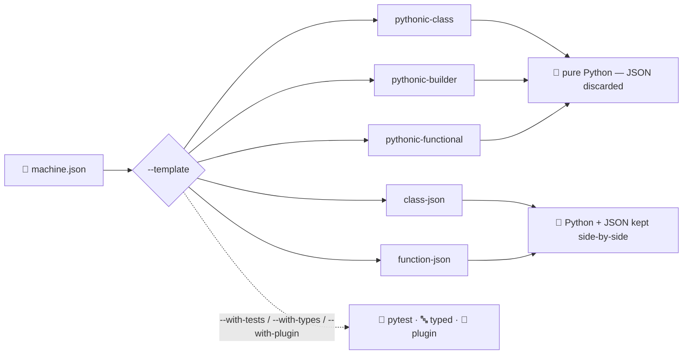

# CLI Templates Deep Dive

The `xsm` CLI offers five **primary** code generation templates, each producing a different code structure and API style, plus three **companion** templates (`pytest`, `typed`, `plugin`) that add a test module, a typed-context module or a plugin skeleton alongside any of them. This guide shows the **complete generated output** for each template using the same input JSON, so you can compare them side-by-side and choose the best fit for your project.

## 🧩 Template Overview



| Template | API Style | JSON at Runtime? | Logic Pattern | Default Mode |
|----------|-----------|:-----------------:|---------------|:------------:|
| `pythonic-class` | `StateMachine` subclass | No | Class methods with decorators | sync |
| `pythonic-builder` | `MachineBuilder` chain | No | Module-level functions with decorators | sync |
| `pythonic-functional` | `build_machine()` call | No | Module-level functions with decorators | sync |
| `class-json` | Class-based provider | Yes | Class methods (camelCase) | async |
| `function-json` | Module functions | Yes | Module-level functions | async |

Every example below assumes the default `-fc/--file-count 2` (separate `checkout_logic.py` and `checkout_runner.py` files). Pass `--file-count 1` (or `-fc 1`) to combine both into a single generated file instead.

Generated files also always start with a `"""Generated state machine logic — DO NOT EDIT BY HAND."""` docstring banner that embeds the source JSON filename, the template name, and the generator version, plus a `Regenerate with::` snippet showing the exact command to reproduce the file. That banner is omitted from the code blocks on this page purely for brevity — the actual output on disk always includes it.

## 📄 Input JSON Example

All examples below use this `checkout.json` as input:

```json
{
  "id": "checkout",
  "initial": "cart",
  "context": { "items": [], "total": 0 },
  "states": {
    "cart": {
      "on": {
        "SUBMIT": {
          "target": "payment",
          "guard": "cartNotEmpty",
          "actions": "calculateTotal"
        }
      }
    },
    "payment": {
      "invoke": {
        "src": "processPayment",
        "onDone": { "target": "confirmed", "actions": "clearCart" },
        "onError": { "target": "cart", "actions": "showError" }
      }
    },
    "confirmed": {
      "type": "final"
    }
  }
}
```

This machine has:
- **3 states**: `cart`, `payment`, `confirmed` (final)
- **1 guard**: `cartNotEmpty`
- **3 actions**: `calculateTotal`, `clearCart`, `showError`
- **1 service**: `processPayment` (via `invoke`)
- **1 event**: `SUBMIT`

---

## 🚩 Additional `generate-template` flags

The examples on this page focus on `--template`/`-t` and `--async-mode`/`-am`, but `generate-template` (alias `gt`) accepts several other flags worth knowing about:

- `--with-tests`, `--with-types`, `--with-plugin` — Also emit the `pytest`, `typed` and `plugin` companion modules described in [Companion templates](#companion-templates) below. Any combination; they never replace the primary output.
- `-fc`, `--file-count {1,2}` — Number of output files: `1` (combined) or `2` (logic/runner). Default: `2`. This page's "Generated Logic File" / "Generated Runner File" pairs all assume the default of `2`; pass `--file-count 1` to get a single combined file instead.
- `--no-verify` — Skip the structural check that generated code rebuilds the source machine. Syntax is still validated. Use only to inspect output the generator would otherwise refuse to write.
- `--check` — Do not write anything. Exit with status 1 if the files on disk differ from what would be generated. Intended for CI, so generated code can be committed and kept honest.
- `--diff` — Like `--check`, but also print a unified diff of the differences. Implies `--check`.
- `--log LOG` — Include logging statements in the generated code: `yes` or `no`. Default: `yes`.
- `--sleep SLEEP` — Add a sleep call between events in the generated runner's simulation: `yes` or `no`. Default: `yes`.
- `--sleep-time SLEEP_TIME` — Sleep duration in seconds for the simulation. Default: `2`.

## 🏛️ Template 1: `pythonic-class`

The `pythonic-class` template generates a `StateMachine` subclass whose `State()` attributes carry their own transitions via `on=`, plus `@action` / `@guard` / `@service` decorated methods. **No JSON is needed at runtime** — the machine definition is compiled directly into Python.

### Command

```bash
xsm gt checkout.json --template pythonic-class --async-mode no
```

### Generated Logic File: `checkout_logic.py`

```python
from typing import Any, Dict, Union
from xstate_statemachine import (
    StateMachine,
    State,
    Interpreter,
    SyncInterpreter,
    action,
    guard,
    service,
)
import logging

logger = logging.getLogger(__name__)


class CheckoutMachine(StateMachine):
    """Checkout state machine using the declarative class-based API."""

    machine_id = "checkout"
    initial_context = {'items': [], 'total': 0}

    cart = State(
        "cart",
        initial=True,
        on={
            "SUBMIT": {
                "target": "payment",
                "guard": "cartNotEmpty",
                "actions": ["calculateTotal"],
            }
        },
    )
    payment = State(
        "payment",
        invoke={
            "src": "processPayment",
            "onDone": {"target": "confirmed", "actions": ["clearCart"]},
            "onError": {"target": "cart", "actions": ["showError"]},
        },
    )
    confirmed = State("confirmed", final=True)

    # Actions
    @action
    def calculate_total(
        self,
        interpreter: Union[Interpreter, SyncInterpreter],
        context: Dict[str, Any],
        event: Any,
        action_def: Any,
    ) -> None:
        """
        Action handler for ``calculateTotal``.

        Called when the SUBMIT transition fires.
        """
        try:
            logger.info("Executing action: calculateTotal")
            # TODO: implement action logic
            pass
        except Exception:
            logger.exception("Error in action calculateTotal")
            raise

    @action
    def clear_cart(
        self,
        interpreter: Union[Interpreter, SyncInterpreter],
        context: Dict[str, Any],
        event: Any,
        action_def: Any,
    ) -> None:
        """
        Action handler for ``clearCart``.

        Called when processPayment completes successfully.
        """
        try:
            logger.info("Executing action: clearCart")
            # TODO: implement action logic
            pass
        except Exception:
            logger.exception("Error in action clearCart")
            raise

    @action
    def show_error(
        self,
        interpreter: Union[Interpreter, SyncInterpreter],
        context: Dict[str, Any],
        event: Any,
        action_def: Any,
    ) -> None:
        """
        Action handler for ``showError``.

        Called when processPayment encounters an error.
        """
        try:
            logger.info("Executing action: showError")
            # TODO: implement action logic
            pass
        except Exception:
            logger.exception("Error in action showError")
            raise

    # Guards
    @guard
    def cart_not_empty(
        self,
        context: Dict[str, Any],
        event: Any,
    ) -> bool:
        """
        Guard for ``cartNotEmpty``.

        Returns True to allow the transition, False to block it.
        """
        logger.info("Evaluating guard: cartNotEmpty")
        # TODO: implement guard logic
        return True

    # Services
    @service
    def process_payment(
        self,
        interpreter: Union[Interpreter, SyncInterpreter],
        context: Dict[str, Any],
        event: Any,
    ) -> Dict[str, Any]:
        """
        Service handler for ``processPayment``.

        Returns a dict that becomes the onDone event data.
        """
        try:
            logger.info("Running service: processPayment")
            # TODO: implement service logic
            return {"result": "done"}
        except Exception:
            logger.exception("Error in service processPayment")
            raise
```

### Generated Runner File: `checkout_runner.py`

<!-- doc-fragment -->
```python
import logging
from xstate_statemachine import SyncInterpreter

from checkout_logic import CheckoutMachine

logging.basicConfig(level=logging.INFO, format='%(asctime)s [%(levelname)s] %(message)s')
logger = logging.getLogger(__name__)

def main() -> None:
    """Executes the simulation for the checkout machine."""

    machine = CheckoutMachine.create_machine()

    # Interpreter Setup
    interpreter = SyncInterpreter(machine)
    interpreter.start()
    logger.info(f'Initial state: {interpreter.current_state_ids}')

    # Event Simulation
    logger.info('Sending event: %s', 'SUBMIT')
    interpreter.send("SUBMIT")

    interpreter.stop()

if __name__ == "__main__":
    main()
```

> **Key Feature:** The runner calls `CheckoutMachine.create_machine()` — no JSON loading needed. The machine definition is compiled from the class attributes at runtime.

---

## 🔗 Template 2: `pythonic-builder`

The `pythonic-builder` template generates module-level `@action`, `@guard`, `@service` decorated functions (no `self` parameter) and a `build()` function that uses the `MachineBuilder` fluent API to construct the machine.

### Command

```bash
xsm gt checkout.json --template pythonic-builder --async-mode no
```

### Generated Logic File: `checkout_logic.py`

```python
from typing import Any, Dict
from xstate_statemachine import (
    MachineBuilder,
    SyncInterpreter,
    action,
    guard,
    service,
)
import logging

logger = logging.getLogger(__name__)

# -----------------------------------------------------------------------
# Actions
# -----------------------------------------------------------------------

@action
def calculate_total(
    interpreter: SyncInterpreter,
    context: Dict[str, Any],
    event: Any,
    action_def: Any,
) -> None:
    """Action handler for ``calculateTotal``."""
    logger.info("Executing action: calculateTotal")
    try:
        # TODO: implement action logic
        pass
    except Exception:
        logger.exception("Error in action calculateTotal")
        raise

@action
def clear_cart(
    interpreter: SyncInterpreter,
    context: Dict[str, Any],
    event: Any,
    action_def: Any,
) -> None:
    """Action handler for ``clearCart``."""
    logger.info("Executing action: clearCart")
    try:
        # TODO: implement action logic
        pass
    except Exception:
        logger.exception("Error in action clearCart")
        raise

@action
def show_error(
    interpreter: SyncInterpreter,
    context: Dict[str, Any],
    event: Any,
    action_def: Any,
) -> None:
    """Action handler for ``showError``."""
    logger.info("Executing action: showError")
    try:
        # TODO: implement action logic
        pass
    except Exception:
        logger.exception("Error in action showError")
        raise

# -----------------------------------------------------------------------
# Guards
# -----------------------------------------------------------------------

@guard
def cart_not_empty(
    context: Dict[str, Any],
    event: Any,
) -> bool:
    """Guard for ``cartNotEmpty``."""
    logger.info("Evaluating guard: cartNotEmpty")
    # TODO: implement guard logic
    return True

# -----------------------------------------------------------------------
# Services
# -----------------------------------------------------------------------

@service
def process_payment(
    interpreter: SyncInterpreter,
    context: Dict[str, Any],
    event: Any,
) -> Dict[str, Any]:
    """Service handler for ``processPayment``."""
    logger.info("Running service: processPayment")
    try:
        # TODO: implement service logic
        return {"result": "done"}
    except Exception:
        logger.exception("Error in service processPayment")
        raise


def build() -> Any:
    """Build the checkout machine using MachineBuilder."""
    machine = (
        MachineBuilder("checkout")
        .context({'items': [], 'total': 0})
        .state("cart", initial=True)
        .state("payment", invoke={'src': 'processPayment', 'onDone': {'target': 'confirmed', 'actions': 'clearCart'}, 'onError': {'target': 'cart', 'actions': 'showError'}})
        .state("confirmed")
        .transition("cart", "SUBMIT", "payment", actions=["calculateTotal"], guard="cartNotEmpty")
        .action("calculateTotal", calculate_total)
        .action("clearCart", clear_cart)
        .action("showError", show_error)
        .guard("cartNotEmpty", cart_not_empty)
        .service("processPayment", process_payment)
        .build()
    )
    return machine
```

### Generated Runner File: `checkout_runner.py`

<!-- doc-fragment -->
```python
import logging
from xstate_statemachine import SyncInterpreter

import checkout_logic

logging.basicConfig(level=logging.INFO, format='%(asctime)s [%(levelname)s] %(message)s')
logger = logging.getLogger(__name__)

def main() -> None:
    """Executes the simulation for the checkout machine."""

    machine = checkout_logic.build()

    # Interpreter Setup
    interpreter = SyncInterpreter(machine)
    interpreter.start()
    logger.info(f'Initial state: {interpreter.current_state_ids}')

    # Event Simulation
    logger.info('Sending event: %s', 'SUBMIT')
    interpreter.send("SUBMIT")

    interpreter.stop()

if __name__ == "__main__":
    main()
```

> **Key Feature:** The runner calls `checkout_logic.build()`, which uses the `MachineBuilder` fluent chain internally. Functions are registered by name via `.action("calculateTotal", calculate_total)`.

---

## 🐍 Template 3: `pythonic-functional`

The `pythonic-functional` template generates module-level decorated functions and a `build()` function that creates `State` objects — each carrying its own transitions via `on=` — and assembles the machine with `build_machine()`.

### Command

```bash
xsm gt checkout.json --template pythonic-functional --async-mode no
```

### Generated Logic File: `checkout_logic.py`

```python
from typing import Any, Dict
from xstate_statemachine import (
    State,
    build_machine,
    SyncInterpreter,
    action,
    guard,
    service,
)
import logging

logger = logging.getLogger(__name__)

# -----------------------------------------------------------------------
# Actions
# -----------------------------------------------------------------------

@action
def calculate_total(
    interpreter: SyncInterpreter,
    context: Dict[str, Any],
    event: Any,
    action_def: Any,
) -> None:
    """Action handler for ``calculateTotal``."""
    logger.info("Executing action: calculateTotal")
    try:
        # TODO: implement action logic
        pass
    except Exception:
        logger.exception("Error in action calculateTotal")
        raise

@action
def clear_cart(
    interpreter: SyncInterpreter,
    context: Dict[str, Any],
    event: Any,
    action_def: Any,
) -> None:
    """Action handler for ``clearCart``."""
    logger.info("Executing action: clearCart")
    try:
        # TODO: implement action logic
        pass
    except Exception:
        logger.exception("Error in action clearCart")
        raise

@action
def show_error(
    interpreter: SyncInterpreter,
    context: Dict[str, Any],
    event: Any,
    action_def: Any,
) -> None:
    """Action handler for ``showError``."""
    logger.info("Executing action: showError")
    try:
        # TODO: implement action logic
        pass
    except Exception:
        logger.exception("Error in action showError")
        raise

# -----------------------------------------------------------------------
# Guards
# -----------------------------------------------------------------------

@guard
def cart_not_empty(
    context: Dict[str, Any],
    event: Any,
) -> bool:
    """Guard for ``cartNotEmpty``."""
    logger.info("Evaluating guard: cartNotEmpty")
    # TODO: implement guard logic
    return True

# -----------------------------------------------------------------------
# Services
# -----------------------------------------------------------------------

@service
def process_payment(
    interpreter: SyncInterpreter,
    context: Dict[str, Any],
    event: Any,
) -> Dict[str, Any]:
    """Service handler for ``processPayment``."""
    logger.info("Running service: processPayment")
    try:
        # TODO: implement service logic
        return {"result": "done"}
    except Exception:
        logger.exception("Error in service processPayment")
        raise


def build() -> Any:
    """Build the checkout machine (functional style)."""
    cart = State(
        "cart",
        initial=True,
        on={
            "SUBMIT": {
                "target": "payment",
                "guard": "cartNotEmpty",
                "actions": ["calculateTotal"],
            }
        },
    )
    payment = State(
        "payment",
        invoke={
            "src": "processPayment",
            "onDone": {"target": "confirmed", "actions": ["clearCart"]},
            "onError": {"target": "cart", "actions": ["showError"]},
        },
    )
    confirmed = State("confirmed", final=True)

    return build_machine(
        id="checkout",
        states=[cart, payment, confirmed],
        context={"items": [], "total": 0},
        actions=[calculate_total, clear_cart, show_error],
        guards=[cart_not_empty],
        services=[process_payment],
    )
```

### Generated Runner File: `checkout_runner.py`

<!-- doc-fragment -->
```python
import logging
from xstate_statemachine import SyncInterpreter

import checkout_logic

logging.basicConfig(level=logging.INFO, format='%(asctime)s [%(levelname)s] %(message)s')
logger = logging.getLogger(__name__)

def main() -> None:
    """Executes the simulation for the checkout machine."""

    machine = checkout_logic.build()

    # Interpreter Setup
    interpreter = SyncInterpreter(machine)
    interpreter.start()
    logger.info(f'Initial state: {interpreter.current_state_ids}')

    # Event Simulation
    logger.info('Sending event: %s', 'SUBMIT')
    interpreter.send("SUBMIT")

    interpreter.stop()

if __name__ == "__main__":
    main()
```

> **Key Feature:** The `build()` function creates individual `State` objects and calls `build_machine()` — the most explicit functional approach, with function references passed directly.
>
> Transitions are declared on the `State` itself via `on=`. `State.to()` *returns* a `Transition` rather than registering one, so it must be passed to `build_machine(transitions=[...])`; the generator uses `on=` to avoid that trap entirely.

---

## 📎 Template 4: `class-json`

The `class-json` template generates a class-based logic provider with method stubs. **The JSON config is loaded at runtime** — the machine definition stays in JSON. The `LogicLoader` auto-discovers methods by matching `snake_case` function names to `camelCase` JSON names.

### Command

```bash
xsm gt checkout.json --template class-json --async-mode no
```

### Generated Logic File: `checkout_logic.py`

```python
import logging
import time
from typing import Any, Dict, Union

from xstate_statemachine import (
    ActionDefinition,
    Event,
    Interpreter,
    SyncInterpreter,
)

logger = logging.getLogger(__name__)

# -----------------------------------------------------------------------
# Class-based Logic
# -----------------------------------------------------------------------


class CheckoutLogic:

    # Actions
    def calculate_total(
        self,
        interpreter: Union[Interpreter[Any], SyncInterpreter[Any]],
        context: Dict[str, Any],
        event: Event,
        action_def: ActionDefinition,
    ) -> None:
        """
        Execute the ``calculateTotal`` action.

        Args:
            interpreter: The running interpreter instance.
            context: Mutable machine context dictionary.
            event: The event that triggered this action.
            action_def: Metadata about the action being executed.
        """
        try:
            logger.info("Executing action calculateTotal")
            # TODO: implement
        except Exception:
            logger.exception("Action 'calculateTotal' failed")
            raise

    def clear_cart(
        self,
        interpreter: Union[Interpreter[Any], SyncInterpreter[Any]],
        context: Dict[str, Any],
        event: Event,
        action_def: ActionDefinition,
    ) -> None:
        """
        Execute the ``clearCart`` action.

        Args:
            interpreter: The running interpreter instance.
            context: Mutable machine context dictionary.
            event: The event that triggered this action.
            action_def: Metadata about the action being executed.
        """
        try:
            logger.info("Executing action clearCart")
            # TODO: implement
        except Exception:
            logger.exception("Action 'clearCart' failed")
            raise

    def show_error(
        self,
        interpreter: Union[Interpreter[Any], SyncInterpreter[Any]],
        context: Dict[str, Any],
        event: Event,
        action_def: ActionDefinition,
    ) -> None:
        """
        Execute the ``showError`` action.

        Args:
            interpreter: The running interpreter instance.
            context: Mutable machine context dictionary.
            event: The event that triggered this action.
            action_def: Metadata about the action being executed.
        """
        try:
            logger.info("Executing action showError")
            # TODO: implement
        except Exception:
            logger.exception("Action 'showError' failed")
            raise

    # Guards
    def cart_not_empty(
        self,
        context: Dict[str, Any],
        event: Event,
    ) -> bool:
        """
        Evaluate the ``cartNotEmpty`` guard.

        Args:
            context: Current machine context dictionary.
            event: The event being evaluated.
        """
        logger.info("Evaluating guard cartNotEmpty")
        # TODO: implement guard logic
        return True

    # Services
    def process_payment(
        self,
        interpreter: Union[Interpreter[Any], SyncInterpreter[Any]],
        context: Dict[str, Any],
        event: Event,
    ) -> Dict[str, Any]:
        """
        Run the ``processPayment`` service.

        Args:
            interpreter: The running interpreter instance.
            context: Mutable machine context dictionary.
            event: The event that triggered this service.
        """
        try:
            logger.info("Running service processPayment")
            time.sleep(1)
            # TODO: implement service
            return {"result": "done"}
        except Exception:
            logger.exception("Service 'processPayment' failed")
            raise

    processPayment = process_payment  # alias for JSON name
```

> **Note:** The trailing `processPayment = process_payment` line is a real alias, not a typo — `LogicLoader` looks up service/action names by their exact JSON key (`processPayment`), so the generator adds a class attribute alias from the `snake_case` method name to the `camelCase` JSON name. The `time.sleep(1)` call is a generated placeholder service body; replace it with real work. When `--async-mode yes` (the default for this template) is used instead, methods are `async def` and the placeholder becomes `await asyncio.sleep(1)`.

### Generated Runner File: `checkout_runner.py`

<!-- doc-fragment -->
```python
from pathlib import Path
import json
from xstate_statemachine import create_machine, SyncInterpreter
from xstate_statemachine import LoggingInspector
import logging

from checkout_logic import CheckoutLogic as LogicProvider

logging.basicConfig(level=logging.INFO, format='%(asctime)s [%(levelname)s] %(message)s')
logger = logging.getLogger(__name__)

def main() -> None:
    """Executes the simulation for the checkout machine."""

    config_path = Path(r"checkout.json")
    if not config_path.is_absolute() and config_path.parent == Path('.'):
        here = Path(__file__).resolve().parent
        candidate = here / config_path.name
        config_path = candidate if candidate.exists() else here.parent / config_path.name
    with open(config_path, 'r', encoding='utf-8') as f:
        config = json.load(f)

    # Logic Binding
    logic_provider = LogicProvider()
    machine = create_machine(config, logic_providers=[logic_provider])

    # Interpreter Setup
    interpreter = SyncInterpreter(machine)
    interpreter.use(LoggingInspector())
    interpreter.start()
    logger.info(f'Initial state: {interpreter.current_state_ids}')

    # Event Simulation
    logger.info('Sending event: %s', 'SUBMIT')
    interpreter.send('SUBMIT')

    interpreter.stop()

if __name__ == '__main__':
    main()
```

> **Key Feature:** The runner loads `checkout.json` at runtime and binds logic via `logic_providers=[LogicProvider()]`. The `LogicLoader` auto-discovers methods matching `snake_case` to `camelCase`.

---

## 📎 Template 5: `function-json`

The `function-json` template generates module-level function stubs (no class wrapper). **The JSON config is loaded at runtime**, and logic is bound via `logic_modules=[module]`.

### Command

```bash
xsm gt checkout.json --template function-json --async-mode no
```

### Generated Logic File: `checkout_logic.py`

```python
import logging
import time
from typing import Any, Dict, Union

from xstate_statemachine import (
    ActionDefinition,
    Event,
    Interpreter,
    SyncInterpreter,
)

logger = logging.getLogger(__name__)

# -----------------------------------------------------------------------
# Actions
# -----------------------------------------------------------------------


def calculate_total(
    interpreter: Union[Interpreter[Any], SyncInterpreter[Any]],
    context: Dict[str, Any],
    event: Event,
    action_def: ActionDefinition,
) -> None:
    """
    Execute the ``calculateTotal`` action.

    Args:
        interpreter: The running interpreter instance.
        context: Mutable machine context dictionary.
        event: The event that triggered this action.
        action_def: Metadata about the action being executed.
    """
    try:
        logger.info("Executing action calculateTotal")
        # TODO: implement
    except Exception:
        logger.exception("Action 'calculateTotal' failed")
        raise


def clear_cart(
    interpreter: Union[Interpreter[Any], SyncInterpreter[Any]],
    context: Dict[str, Any],
    event: Event,
    action_def: ActionDefinition,
) -> None:
    """
    Execute the ``clearCart`` action.

    Args:
        interpreter: The running interpreter instance.
        context: Mutable machine context dictionary.
        event: The event that triggered this action.
        action_def: Metadata about the action being executed.
    """
    try:
        logger.info("Executing action clearCart")
        # TODO: implement
    except Exception:
        logger.exception("Action 'clearCart' failed")
        raise


def show_error(
    interpreter: Union[Interpreter[Any], SyncInterpreter[Any]],
    context: Dict[str, Any],
    event: Event,
    action_def: ActionDefinition,
) -> None:
    """
    Execute the ``showError`` action.

    Args:
        interpreter: The running interpreter instance.
        context: Mutable machine context dictionary.
        event: The event that triggered this action.
        action_def: Metadata about the action being executed.
    """
    try:
        logger.info("Executing action showError")
        # TODO: implement
    except Exception:
        logger.exception("Action 'showError' failed")
        raise


# -----------------------------------------------------------------------
# Guards
# -----------------------------------------------------------------------


def cart_not_empty(
    context: Dict[str, Any],
    event: Event,
) -> bool:
    """
    Evaluate the ``cartNotEmpty`` guard.

    Args:
        context: Current machine context dictionary.
        event: The event being evaluated.
    """
    logger.info("Evaluating guard cartNotEmpty")
    # TODO: implement guard logic
    return True


# -----------------------------------------------------------------------
# Services
# -----------------------------------------------------------------------


def process_payment(
    interpreter: Union[Interpreter[Any], SyncInterpreter[Any]],
    context: Dict[str, Any],
    event: Event,
) -> Dict[str, Any]:
    """
    Run the ``processPayment`` service.

    Args:
        interpreter: The running interpreter instance.
        context: Mutable machine context dictionary.
        event: The event that triggered this service.
    """
    try:
        logger.info("Running service processPayment")
        time.sleep(1)
        # TODO: implement service
        return {"result": "done"}
    except Exception:
        logger.exception("Service 'processPayment' failed")
        raise


processPayment = process_payment  # alias for JSON name
```

> **Note:** The trailing `processPayment = process_payment` line is a real alias, not a typo — `LogicLoader` looks up service/action names by their exact JSON key (`processPayment`), so the generator adds a module-level alias from the `snake_case` function name to the `camelCase` JSON name. The `time.sleep(1)` call is a generated placeholder service body; replace it with real work. When `--async-mode yes` (the default for this template) is used instead, functions are `async def` and the placeholder becomes `await asyncio.sleep(1)`.

### Generated Runner File: `checkout_runner.py`

<!-- doc-fragment -->
```python
from pathlib import Path
import json
from xstate_statemachine import create_machine, SyncInterpreter
from xstate_statemachine import LoggingInspector
import logging

import checkout_logic

logging.basicConfig(level=logging.INFO, format='%(asctime)s [%(levelname)s] %(message)s')
logger = logging.getLogger(__name__)

def main() -> None:
    """Executes the simulation for the checkout machine."""

    config_path = Path(r"checkout.json")
    if not config_path.is_absolute() and config_path.parent == Path('.'):
        here = Path(__file__).resolve().parent
        candidate = here / config_path.name
        config_path = candidate if candidate.exists() else here.parent / config_path.name
    with open(config_path, 'r', encoding='utf-8') as f:
        config = json.load(f)

    # Logic Binding
    machine = create_machine(config, logic_modules=[checkout_logic])

    # Interpreter Setup
    interpreter = SyncInterpreter(machine)
    interpreter.use(LoggingInspector())
    interpreter.start()
    logger.info(f'Initial state: {interpreter.current_state_ids}')

    # Event Simulation
    logger.info('Sending event: %s', 'SUBMIT')
    interpreter.send('SUBMIT')

    interpreter.stop()

if __name__ == '__main__':
    main()
```

> **Key Feature:** Logic binding uses `logic_modules=[checkout_logic]` — the `LogicLoader` scans the module for functions whose `snake_case` names match the `camelCase` names in JSON.

---

## 🧪 Companion templates

The three companion templates each produce **one extra module** next to the primary output. Request them together with any primary template:

```bash
xsm gt checkout.json -t pythonic-class --with-tests --with-types --with-plugin
```

```
OK Generated logic file:  checkout_logic.py
OK Generated runner file: checkout_runner.py
OK Generated pytest file: test_checkout.py
OK Generated typed file:  checkout_types.py
OK Generated plugin file: checkout_observer.py
```

…or on their own (`xsm gt checkout.json -t pytest`). Like every other output they are compiled before writing, carry the provenance banner, and are covered by `--check` / `--diff` in CI.

### `pytest` — a test module recorded from the engine

Nothing in this file is guessed. At generation time the chart is built with stub logic (actions record their name, guards return `True`, services no-op), driven along its reachable event sequence on a `SimulatedClock`, and the configuration after every step is written down as an assertion. The suite runs green the moment it is written and goes red the moment the JSON — or the library — behaves differently.

```python
ACTIONS: List[str] = ["calculateTotal", "clearCart", "showError"]
GUARDS: List[str] = ["cartNotEmpty"]
SERVICES: List[str] = ["processPayment"]


def stub_logic(ran: List[str], guards_pass: bool = True) -> MachineLogic:
    """Stub every implementation: actions record, guards decide, services no-op."""
    ...


def test_initial_state(interp) -> None:
    assert sorted(interp.current_state_ids) == ["checkout.cart"]


# Each step replays every step before it, so a test is self-contained and
# can be run alone. The recorded sequence is the machine's reachable walk.

STEPS = [
    (
        "event",
        "SUBMIT",
        None,
        ["checkout.confirmed"],
        ["calculateTotal", "clearCart"],
    ),
]


def test_step_01_SUBMIT(interp, clock: SimulatedClock, ran: List[str]) -> None:
    _replay(interp, clock, 0)
    ran.clear()
    interp.send("SUBMIT")
    assert sorted(interp.current_state_ids) == ["checkout.confirmed"]
    assert ran == ["calculateTotal", "clearCart"]


def test_reaches_final_state(interp, clock: SimulatedClock) -> None:
    _replay(interp, clock, len(STEPS))
    assert interp.status == "done"


def test_guarded_transitions_are_denied_when_guards_fail(
    denied_interp, clock: SimulatedClock
) -> None:
    ...


def test_every_declared_event_is_known(machine) -> None:
    ...


def test_snapshot_round_trip(interp, clock: SimulatedClock, machine) -> None:
    ...


# Events declared by the chart that the recorded walk never fired -- worth
# a hand-written test each, if they matter to you:
#   - done.invoke.checkout.payment
#   - error.platform.checkout.payment
```

Note the `SUBMIT` step lands in `confirmed` and ran `clearCart`: with a no-op stub service the `invoke` completes synchronously and `onDone` fires within the same `send()`. The recorded walk is exactly what the library does — including the `after` timers it fires by advancing the simulated clock (`("clock", None, 2000, [...], [...])` steps).

### `typed` — `TypedDict` context, `Literal` events, typed stubs

```python
EventType = Literal["SUBMIT"]
StateId = Literal["checkout.cart", "checkout.confirmed", "checkout.payment"]
AnyEvent = Union[Event, DoneEvent, ErrorEvent, AfterEvent]


class CheckoutContext(TypedDict):
    """Shape of `context`, inferred from the chart's initial value."""

    items: List[Any]
    total: int


def calculate_total(
    interpreter: BaseInterpreter[CheckoutContext],
    context: CheckoutContext,
    event: AnyEvent,
    action: ActionDefinition,
) -> None:
    """Action `calculateTotal`."""
    raise NotImplementedError


def cart_not_empty(context: CheckoutContext, event: AnyEvent) -> bool:
    """Guard `cartNotEmpty`."""
    raise NotImplementedError


def process_payment(
    interpreter: BaseInterpreter[CheckoutContext],
    context: CheckoutContext,
    event: AnyEvent,
) -> Any:
    """Service `processPayment`."""
    raise NotImplementedError


def logic() -> MachineLogic:
    """A MachineLogic bound to the stubs above."""
    return MachineLogic(
        actions={
            "calculateTotal": calculate_total,
            "clearCart": clear_cart,
            "showError": show_error,
        },
        guards={"cartNotEmpty": cart_not_empty},
        services={"processPayment": process_payment},
    )
```

The context type is inferred from the JSON `context` value (`[]` → `List[Any]`, `0` → `int`, `""` → `str`, a nested object → `Dict[str, Any]`, `null` → `Optional[Any]`); a chart that declares no object context gets `Context = Dict[str, Any]`. The stubs are a typed contract for the logic you go on to implement, and `logic()` binds them so the module is usable as-is once the `NotImplementedError`s are replaced.

### `plugin` — a `PluginBase` wired for this chart

```python
class CheckoutObserver(PluginBase):
    """Observes the checkout; see the hook docstrings."""

    def on_transition(
        self, interpreter, from_states, to_states, transition
    ) -> None:
        """every settled transition."""
        _record("transition", interpreter, from_states=from_states, ...)
        # TODO: your metrics / alerting here

    def on_action_error(self, interpreter, action, error) -> None:
        """a user action raised (contained)."""
        ...

    def on_service_error(self, interpreter, invocation, error) -> None:
        """an invoke failed."""
        ...

    def on_chain_budget_exceeded(self, interpreter, error, event) -> None:
        """maxIterations cut a self-fed chain -- sticky, page on this."""
        ...


# Hooks NOT emitted because the chart does not use the feature:
#   - on_unhandled_event (an event selected no transition)
#   - on_transition_failed (actionErrorPolicy rolled back / stopped)
```

Only hooks the chart can actually fire are generated: `on_service_*` and `on_invocation_stranded` because it invokes something, `on_guard_error` because it has guards, `on_done` because it has a final state, `on_transition_failed` only under a rollback/fail `actionErrorPolicy`, `on_unhandled_event` only when `onUnhandled` is not the default. The always-relevant lifecycle and sticky-signal hooks (`on_transition`, `on_action_error`, `on_chain_budget_exceeded`, `on_invalid_event`, `on_event_dropped`, `on_error`) are always present. Every hook writes one JSON line through `logging` so the skeleton is useful before you touch it; the trailing comment lists what was left out and why.

---

## Template Comparison Table

| Feature | `pythonic-class` | `pythonic-builder` | `pythonic-functional` | `class-json` | `function-json` |
|---------|:---:|:---:|:---:|:---:|:---:|
| JSON needed at runtime | No | No | No | Yes | Yes |
| Logic in a class | Yes (`StateMachine`) | No | No | Yes (provider) | No |
| Uses decorators | `@action`, `@guard`, `@service` | `@action`, `@guard`, `@service` | `@action`, `@guard`, `@service` | No | No |
| Type hints | Full | Full | Full | Full | Full |
| OOP pattern | Subclass | Builder | Functional | Provider | Module |
| `self` parameter | Yes | No | No | Yes | No |
| Machine creation | `MyMachine.create_machine()` | `build()` via `MachineBuilder` | `build()` via `build_machine()` | `create_machine(cfg, logic_providers=...)` | `create_machine(cfg, logic_modules=...)` |
| Best for large machines | Excellent | Excellent | Good | Excellent | Good |
| Name auto-mapping | snake_case → camelCase | snake_case → camelCase | snake_case → camelCase | snake_case via `LogicLoader` | snake_case via `LogicLoader` |
| Error handling in stubs | try/except | try/except | try/except | try/except | try/except |
| Default async mode | sync | sync | sync | async | async |

## When to Use Each Template

### Use `pythonic-class` when:
- You prefer a single, self-contained class that defines your entire machine
- You want the most Pythonic, declarative API
- You don't need to keep JSON files around after generation
- Your team is comfortable with OOP and decorators

### Use `pythonic-builder` when:
- You want module-level functions without class overhead
- You need to dynamically assemble machines (e.g., add states conditionally)
- You prefer the fluent builder pattern
- You want to keep logic functions decoupled from the machine structure

### Use `pythonic-functional` when:
- You want the simplest, most explicit machine construction
- You prefer functional programming style
- You want full control over `State` objects and `build_machine()` arguments
- Your machine is relatively straightforward

### Use `class-json` when:
- You have existing JSON configs from Stately.ai that you want to keep as source of truth
- You want to update the JSON without regenerating Python code
- You prefer organizing logic as methods on a class
- Your workflow involves frequent JSON config changes

### Use `function-json` when:
- You have existing JSON configs and want minimal code overhead
- You prefer flat module-level functions over classes
- You want the lightest-weight generated code
- You're prototyping or building quick scripts
