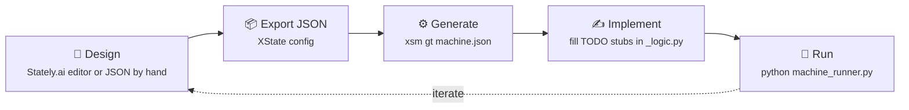

# CLI Tool

`xsm` is the command-line companion to the library. It reads XState-compatible JSON machine definitions — exported from [Stately.ai](https://stately.ai) or written by hand — and does five things with them:

| You want to… | Command |
|:--|:--|
| Turn a machine into runnable, typed Python (plus tests, typed context, a plugin skeleton) | `xsm generate-template` (`gt`) |
| See its state tree, transitions, logic and policies at a glance | `xsm inspect` (`ins`) |
| Run it live — pick events, advance the clock, undo — or replay a script in CI | `xsm simulate` (`sim`) |
| Export a Mermaid, PlantUML or ASCII diagram | `xsm diagram` (`dia`) |
| Produce a Markdown reference page per machine | `xsm docs` |
| Prove a file builds with the real library and list every finding | `xsm validate` (`val`) |

Run `xsm` with no arguments on a terminal and you get an **interactive launcher**: a menu, recent files, and a generate wizard with a live preview. Everything the launcher can do, a flag can do too — it is a thin layer of prompts over the same functions.

Like the library, the CLI has **zero runtime dependencies**. Colour, box-drawing, spinners and single-key input are implemented on the standard library; when output is piped (or `--plain` is given) every command degrades to deterministic plain text, so `xsm … | grep` and CI logs stay clean.

## 🎨 Presentation flags

These work before *or* after the subcommand:

| Flag | Effect |
|:--|:--|
| `--plain` | Plain text: no colour, no box glyphs, no animation. Implied whenever stdout is not a terminal |
| `--no-color` | Keep layout and animation but emit no colour escapes. Also honours the [`NO_COLOR`](https://no-color.org) convention and `TERM=dumb` |
| `--no-anim` | Disable spinners and in-place redraws (`XSM_NO_ANIM=1` does the same) |
| `--verbose` | Show the library's INFO log on stderr while a command runs (default: warnings only) |

Truecolor is used when `COLORTERM=truecolor`/`24bit`, otherwise the 256/16-colour tiers; Windows consoles get virtual-terminal processing enabled automatically. Unicode glyphs are only emitted when the stream can encode them; on an ASCII console the separators and arrows are transliterated (`->`, `-`, `...`) rather than replaced with `?`.

## 🚀 Basic Usage

```bash
# Generate 2 files: logic + runner (default)
xsm generate-template my_machine.json

# Short alias — identical behavior
xsm gt my_machine.json

# …plus a pytest module and a typed-context module
xsm gt my_machine.json -t pythonic-class --with-tests --with-types
```

This produces two files alongside `my_machine.json`:

```
my_machine_logic.py    # Action, guard, and service stubs
my_machine_runner.py   # Interpreter bootstrap + event simulation
```

> **Tip:** If the `xsm` command is not found after installing the package, use `python -m xstate_statemachine` instead. On a Windows machine where `xsm.exe` is *blocked* by an Application Control policy, see [the Windows note](#windows-an-application-control-policy-has-blocked-this-file) below.

## 📂 What Gets Generated

### Logic File (`*_logic.py`)

The logic file contains stub implementations for every action, guard, and service referenced in your JSON config. Depending on the template you choose, these are either:

- **Methods on a class** (templates: `pythonic-class`, `class-json`)
- **Module-level functions** (templates: `pythonic-builder`, `pythonic-functional`, `function-json`)

Each stub includes:

- Correct function signature with type hints
- Rich docstring explaining the component
- Logging statement (if `--log yes`)
- Error handling with try/except (for actions and services)
- A `# TODO: implement` marker for you to fill in

### Runner File (`*_runner.py`)

The runner file contains everything needed to instantiate and run your state machine:

- JSON config loading (or Pythonic API construction, depending on template)
- Logic binding (class instance or module reference)
- Interpreter creation and startup
- Event simulation loop with all events found in your config
- Graceful shutdown

You can run it immediately:

```bash
python my_machine_runner.py
```

## ⚙️ All CLI Options

```
xsm generate-template [JSON_FILES...] [OPTIONS]
```

### Complete Options Reference

| Flag | Long Form | Type | Default | Description |
|------|-----------|------|---------|-------------|
| *(positional)* | `json_files` | `FILE...` | — | One or more JSON config files to process |
| `-j` | `--json` | `FILE` | — | Additional JSON input file (repeatable) |
| `-jp` | `--json-parent` | `FILE` | — | Designate the parent machine for hierarchy |
| `-jc` | `--json-child` | `FILE` | — | Designate child machine(s) for hierarchy (repeatable) |
| `-t` | `--template` | `CHOICE` | `class-json` | Code generation template (see below) |
| — | `--with-tests` | flag | `false` | Also emit `test_<machine>.py` — a pytest module recorded from the real engine |
| — | `--with-types` | flag | `false` | Also emit `<machine>_types.py` — `TypedDict` context, `Literal` events, typed stubs |
| — | `--with-plugin` | flag | `false` | Also emit `<machine>_observer.py` — a `PluginBase` wired for this chart's hooks |
| `-s` | `--style` | `CHOICE` | — | **DEPRECATED** — use `--template` instead |
| `-o` | `--output` | `DIR` | *(same as JSON)* | Output directory for generated files |
| `-fc` | `--file-count` | `{1, 2}` | `2` | Number of output files: 1 = merged, 2 = separate |
| `-f` | `--force` | flag | `false` | Overwrite existing files without prompting |
| `-am` | `--async-mode` | `yes/no` | *(template-dependent)* | Generate async or sync code |
| `-l` | `--loader` | `yes/no` | `yes` | Use LogicLoader auto-discovery in runner |
| — | `--log` | `yes/no` | `yes` | Include logging statements in generated code |
| — | `--sleep` | `yes/no` | `yes` | Add sleep calls between events in simulation |
| — | `--sleep-time` | `INT` | `2` | Sleep duration in seconds between events |
| — | `--check` | flag | `false` | Write nothing; exit 1 if files on disk are out of date |
| — | `--diff` | flag | `false` | Like `--check`, plus a unified diff. Implies `--check` |
| — | `--no-verify` | flag | `false` | Skip the structural fidelity check (syntax is still checked) |
| `-v` | `--version` | flag | — | Show version number and exit |

### Option Details

#### Template (`-t` / `--template`)

Five primary templates produce a logic module and a runner:

| Template | Description |
|----------|-------------|
| `pythonic-class` | `StateMachine` subclass with `@action` / `@guard` / `@service` decorators |
| `pythonic-builder` | `MachineBuilder` fluent chain with decorated module-level functions |
| `pythonic-functional` | `State` objects + `build_machine()` call with decorated functions |
| `class-json` | Class with camelCase methods, JSON loaded at runtime *(default)* |
| `function-json` | Module-level functions, JSON loaded at runtime |

Three **companion** templates produce a single extra module and can be requested either on their own (`--template pytest`) or alongside any primary template with `--with-tests` / `--with-types` / `--with-plugin`:

| Template | File | What it contains |
|----------|------|------------------|
| `pytest` | `test_<machine>.py` | A test module **recorded from the real engine**: the initial state, one test per reachable event step (state before, event, state after, actions run) on a `SimulatedClock`, and a guard-denial test where a guard exists. Uses stub logic so it runs green immediately and stays green until the JSON changes |
| `typed` | `<machine>_types.py` | `Context` as a `TypedDict` (from the JSON `context`), `Event = Literal[...]` over every declared event, `StateId = Literal[...]`, and a typed `MachineLogic[Context]` stub with one correctly-annotated function per action, guard and service |
| `plugin` | `<machine>_observer.py` | A `PluginBase` subclass that overrides exactly the hooks this chart can fire — `on_action_error` only if it has actions, `on_service_error` only if it invokes something, `on_chain_budget_exceeded` only if it can raise/self-send, and so on — each with a docstring naming the states involved |

Companions are compiled and import-checked before writing, participate in `--check` / `--diff`, and are listed by `xsm list-templates` under "Companion outputs".

> **Note:** The `--style` flag (`class` / `function`) is deprecated and maps to `class-json` / `function-json`. It is still present in 0.10.0 and will be removed in a future release. Use `--template` instead.

#### Async Mode (`-am` / `--async-mode`)

Controls whether the generated code uses `async def` / `await` or plain `def`:

- **Default for JSON templates** (`class-json`, `function-json`): `yes` (async)
- **Default for Pythonic templates** (`pythonic-class`, `pythonic-builder`, `pythonic-functional`): `no` (sync)

```bash
# Force sync mode on a JSON template
xsm gt machine.json --template class-json --async-mode no

# Force async mode on a Pythonic template
xsm gt machine.json --template pythonic-class --async-mode yes
```

#### File Count (`-fc` / `--file-count`)

- `2` (default): Generates separate `*_logic.py` and `*_runner.py` files
- `1`: Merges everything into a single `*.py` file with de-duplicated imports

```bash
# Single merged file
xsm gt machine.json --file-count 1
```

## 🧭 Template Selection Guide

Choosing the right template depends on your project needs:

| Criterion | `pythonic-class` | `pythonic-builder` | `pythonic-functional` | `class-json` | `function-json` |
|-----------|:---:|:---:|:---:|:---:|:---:|
| JSON needed at runtime | No | No | No | Yes | Yes |
| Logic in a class | Yes | No | No | Yes | No |
| Type hints | Full | Full | Full | Full | Full |
| Decorators (`@action`, etc.) | Yes | Yes | Yes | No | No |
| OOP pattern | Subclass | Builder | Functional | Provider | Module |
| Best for large machines | Yes | Yes | Moderate | Yes | Moderate |
| Default async mode | sync | sync | sync | async | async |

**Recommendations:**

- **New projects** → `pythonic-class` (most Pythonic, no JSON at runtime)
- **Dynamic assembly** → `pythonic-builder` (fluent API, easy to extend)
- **Simple scripts** → `pythonic-functional` (minimal boilerplate)
- **Existing JSON workflows** → `class-json` (keeps JSON as source of truth)
- **Lightweight / prototyping** → `function-json` (no class overhead)

## 🍳 Common Recipes

### Sync Mode for Scripts

```bash
xsm gt machine.json --template pythonic-class --async-mode no
```

Generates `SyncInterpreter` usage instead of `Interpreter` + `asyncio.run()`.

### Single Merged File

```bash
xsm gt machine.json --template pythonic-functional --file-count 1
```

Produces a single `machine.py` with logic and runner combined. Imports are de-duplicated automatically.

### No Logging, No Sleep

```bash
xsm gt machine.json --template pythonic-class --log no --sleep no
```

Generates clean, minimal code without `logger.info()` calls or `time.sleep()` between events. Useful for production code where you want to add your own logging.

### Force Overwrite + Custom Output Directory

```bash
xsm gt machine.json -o ./generated/ --force
```

Writes to `./generated/` and overwrites any existing files without prompting.

### Multiple JSON Files

```bash
xsm gt auth.json profile.json settings.json
```

Generates combined logic and runner files that wire up all three machines. The CLI will interactively ask you to confirm which machine is the parent if it detects `invoke` configurations.

### Using with `python -m` If `xsm` Not Found

```bash
python -m xstate_statemachine generate-template my_machine.json
python -m xstate_statemachine gt my_machine.json --template pythonic-class
python -m xstate_statemachine            # the interactive launcher
```

This is functionally identical to `xsm` and works even if the entry point script is not on your PATH. The longer spelling `python -m xstate_statemachine.cli` still works too.

### Windows: "An Application Control policy has blocked this file"

```
PS> xsm
Program 'xsm.exe' failed to run: An Application Control policy has blocked this file
```

**The one-line fix** — run it once, through the interpreter (which the policy already trusts):

```powershell
python -m xstate_statemachine setup
```

```
  Scripts dir:  C:\Python\Python314\Scripts
  xsm.exe:      parked as xsm.exe.blocked
  xsm.cmd:      current

✓ `xsm` now runs through cmd.exe -> python; try `xsm info`
```

From then on `xsm …` works in PowerShell and `cmd` exactly as on any other machine. `pip install --upgrade xstate-statemachine` recreates `xsm.exe`, so re-run the same command after upgrading; `python -m xstate_statemachine setup --check` reports the current state (exit 1 if `xsm` still resolves to the blocked launcher — handy in a login script), and `--undo` restores pip's launcher. On macOS and Linux `setup` is a no-op that says so.

**What is happening.** `pip` does not install a Python file called `xsm`; on Windows it materialises a small, generic, *unsigned* launcher — `Scripts\xsm.exe` — that locates `python.exe` and calls into the package. Machines governed by Windows Defender Application Control (WDAC), AppLocker or Smart App Control allow known signed binaries and block executables that appeared on disk unsigned, so the launcher is refused while Python itself runs fine. Every pip-installed console script (`black.exe`, `pytest.exe`, …) is affected in the same way; `pipx` and `uv tool` generate the same kind of stub. The launcher is produced by pip on your machine at install time, so nothing in the package can sign or replace it automatically — and a signed standalone `xsm.exe` would not help either, because a corporate allow-list trusts specific publishers, not "signed by someone".

**What `setup` does.** Two things, both reversible: it renames the blocked `xsm.exe` to `xsm.exe.blocked` (Windows resolves `.exe` before `.cmd` in the same folder, so the stub has to move aside rather than merely be shadowed), and it writes `xsm.cmd` beside it — a batch file that runs `python -m xstate_statemachine` with the interpreter `setup` was run from, falling back to `python` on `PATH`. Batch files execute through the trusted `cmd.exe`, which these policies allow. Verified on a WDAC-managed machine from both PowerShell and `cmd`.

**If even that is refused** (a policy that also enforces script rules) you are in a fully managed environment: use `python -m xstate_statemachine …` directly — it is functionally identical to `xsm` and `xsm info` prints the exact spelling on its `Also run as:` line — or add a PowerShell function to your `$PROFILE`:

```powershell
Add-Content $PROFILE 'function xsm { python -m xstate_statemachine @args }'
```

## 🛠️ Workflow: From Design to Running Code

The recommended workflow integrates the CLI into a design-first approach:



## 🚶 Complete Walkthrough: From JSON to Running Machine

Let's walk through the entire process end-to-end.

### Step 1: Create or Export Your JSON Config

Save this as `checkout.json`:

```json
{
  "id": "checkout",
  "initial": "cart",
  "context": { "items": [], "total": 0 },
  "states": {
    "cart": {
      "on": {
        "SUBMIT": {
          "target": "payment",
          "guard": "cartNotEmpty",
          "actions": "calculateTotal"
        }
      }
    },
    "payment": {
      "invoke": {
        "src": "processPayment",
        "onDone": { "target": "confirmed", "actions": "clearCart" },
        "onError": { "target": "cart", "actions": "showError" }
      }
    },
    "confirmed": {
      "type": "final"
    }
  }
}
```

### Step 2: Generate Python Code

```bash
xsm gt checkout.json --template pythonic-class --async-mode no
```

Output:

```
Generated logic file:  checkout_logic.py
Generated runner file: checkout_runner.py
```

### Step 3: Review the Generated Logic File

Open `checkout_logic.py` and you'll find a `StateMachine` subclass with:

- `State()` declarations for `cart`, `payment`, and `confirmed`
- Transition definitions with guard and action references
- `@action` decorated methods for `calculateTotal`, `clearCart`, and `showError`
- `@guard` decorated method for `cartNotEmpty`
- `@service` decorated method for `processPayment`

> **Stately exports and other non-identifier names.** Stately names anonymous
> actions like `inline:checkout.payment#entry[0]`; hand-written configs
> sometimes use dots or dashes (`audit.log-v2`). Such a name cannot become a
> Python method name and still be matched back by convention, so the
> generator emits the explicit form for it:
>
> <!-- doc-fragment -->
> ```python
> @action("inline:checkout.payment#entry[0]")
> def inline_checkout_payment_entry_0(self, interpreter, context, event, action_def) -> None:
>     ...
> ```
>
> The `LogicLoader` honours that declared name, so `create_machine(config,
> logic_providers=[...])` and `logic_modules=[...]` bind it correctly. Rename
> the method freely; keep the string in the decorator. Ordinary camelCase
> names keep the bare `@action` -- the method name round-trips on its own.

### Step 4: Implement Your Business Logic

Fill in the `# TODO` stubs with your actual business logic:

```python
@guard
def cart_not_empty(self, context, event) -> bool:
    """Guard: cartNotEmpty — check if the cart has items."""
    return len(context.get("items", [])) > 0

@action
def calculate_total(self, interpreter, context, event, action_def) -> None:
    """Action: calculateTotal — sum up item prices."""
    context["total"] = sum(item["price"] for item in context["items"])

@service
def process_payment(self, interpreter, context, event) -> dict:
    """Service: processPayment — charge the customer."""
    # Call your payment gateway here
    return {"result": "payment_success", "transaction_id": "txn_123"}
```

### Step 5: Run the Machine

```bash
python checkout_runner.py
```

The runner will start the interpreter, send the `SUBMIT` event, invoke the payment service, and transition through the machine states with full logging output.

> **Tip:** After initial generation, you only edit the logic file. The runner file rarely needs changes unless you want custom event sequences.

## 📋 All Commands Overview

```
xsm [-h] [-v] [--plain] [--no-color] [--no-anim] [--verbose]
    {generate-template,gt,list-templates,lt,validate,val,info,update,setup,
     inspect,ins,diagram,dia,simulate,sim,docs} ...
```

| Command | Alias | Description |
|---------|-------|-------------|
| *(none)* | — | Interactive launcher — menu, recent files, generate wizard (terminal only) |
| `generate-template` | `gt` | Generate Python code from an XState JSON file |
| `list-templates` | `lt` | List all available code generation templates |
| `validate` | `val` | Build each file with the real library and list findings |
| `inspect` | `ins` | State tree, transitions table, logic to implement, policies |
| `simulate` | `sim` | Run a machine live, or replay a scripted event sequence |
| `diagram` | `dia` | Mermaid / PlantUML / ASCII diagram to stdout or a file |
| `docs` | — | A Markdown reference page per machine |
| `info` | — | Version, environment, feature cards, links |
| `update` | — | Check PyPI and upgrade to the latest release with the installer that installed you (`--check`, `--yes`) |
| `setup` | — | Windows: swap pip's blocked `xsm.exe` launcher for a batch shim (`--check`, `--undo`) |

Every command that reports facts also has a `--json` switch (`validate`, `inspect`, `simulate`, `list-templates`, `info`) so the same information can be consumed by scripts.

## 🧭 Interactive Launcher

```bash
xsm
```

On a terminal, a bare `xsm` draws the banner and a menu:

```
  What would you like to do?
❯ Generate code        Pick JSON files and a template; preview before writing
  Inspect a machine    State tree, events, logic and policies at a glance
  Simulate             Run a machine live: pick events, advance the clock
  Validate             Build files with the real library and list findings
  Diagram              Mermaid / PlantUML / ASCII to stdout or a file
  Docs                 A Markdown reference page per machine
  Templates            Browse the code generation catalogue
  About                Version, environment, links
  Update               Check PyPI and upgrade to the latest release
  Quit
  ↑↓ move · enter select · esc cancel
```

Arrow keys or the digits `1`–`9` move, `enter` selects, `esc` backs out. File pickers list recently used machines first (remembered in `~/.xsm/recent.json`, or `$XSM_HOME/recent.json`); the last entry lets you type a path or a glob such as `machines/*.json`.

The **generate wizard** asks for files, a template, companions and options, then shows the head of the logic module it is about to write in a preview panel before asking for confirmation. It builds exactly the same argument set the `gt` command uses, so nothing the wizard produces differs from the flag-driven output.

When stdout is not a terminal a bare `xsm` prints the usual argparse error asking for a subcommand — the launcher never engages inside a pipe.

## 🔍 Inspect

```bash
xsm inspect checkout.json
xsm ins checkout.json --no-events    # skip the transitions table
xsm ins checkout.json --json         # machine-readable facts
```

Builds the machine with the real library and lays out what it found:

```
╭ inspect ─────────────────────────────────────────────────────╮
│ checkout.json                                                │
├──────────────────────────────────────────────────────────────┤
│ Machine   checkout                                           │
│ States    5  atomic 5                                        │
│ Events    7    Timers 1    Invokes 1                         │
│ Logic     5 actions · 2 guards · 1 services · 0 named delays │
╰──────────────────────────────────────────────────────────────╯

─────────────────────────── state tree ───────────────────────────
◆ checkout  initial=editing
├── ○ authenticating3DS  invoke authenticatePayment
├── ○ challenge  after 2000
├── ○ editing
├── ○ failure
╰── ◉ success

──────────────────────── transitions (11) ────────────────────────
┌─────────────┬───────────────────┬───────────────────┬─────────────┬───────────┐
│ Event       │ From              │ To                │ Guard       │ Actions   │
├─────────────┼───────────────────┼───────────────────┼─────────────┼───────────┤
│ SUBMIT      │ editing           │ authenticating3DS │ isFormValid │           │
│ after 2000  │ challenge         │ success           │             │           │
│ RESET       │ challenge         │ editing           │             │ resetForm │
│ …           │                   │                   │             │           │
└─────────────┴───────────────────┴───────────────────┴─────────────┴───────────┘

──────────────────────── logic to implement ──────────────────────
Kind     │ Names
actions  │ resetForm, …
guards   │ isFormValid, …
services │ authenticatePayment

──────────────────────────── policies ────────────────────────────
actionErrorPolicy │ continue
guardErrorPolicy  │ false
onUnhandled       │ ignore
maxIterations     │ 1000
strict            │ false
strictTargets     │ false
event schemas     │ none
```

The tree marks state kinds (`○` atomic, `◆` compound, `⫴` parallel, `◉` final, `↺` history) and annotates timers and invokes; the `Guard` column shows composite guards as the library resolved them. Unreachable states — no transition, `initial` or history target leads to them — are reported as a warning, as is anything the library itself logged while building.

## 🎮 Simulate

One engine drives two modes: a `SyncInterpreter` on a `SimulatedClock` with stub logic (actions are recorded, guards return `True` unless you say otherwise, services are no-ops), an undo stack of snapshots, and a step history.

### Live

```bash
xsm simulate checkout.json
```

On a terminal you get the status panel and state tree, then a picker of the events that would do something *right now* (denied events are never offered):

```
  ↑↓ pick event · enter send · t +timer · c +clock · g guards · u undo · r reset · h history · s snapshot · q quit

  Send
❯ SUBMIT
  UPDATE_FORM
  enter send · esc for commands
```

`enter` sends the highlighted event; a step line shows what happened (`→ SUBMIT  authenticating3DS  actions: validate`), the new active states pulse briefly, and the panel redraws. `esc` drops into command mode:

| Key | Does |
|:--|:--|
| `t` | Fire the longest armed `after` timer in the active configuration (advances the clock past it) |
| `c` | Advance the clock by a number of milliseconds you type |
| `g` | Toggle which guards return `True` — a multiselect over every guard name |
| `u` | Undo the last step (restores the snapshot; `after` timers are re-armed from zero) |
| `r` | Reset to the initial state with a fresh clock; clears the undo stack |
| `h` | Print the step history as a table (step, result, actions, clock) |
| `s` | Print the current snapshot JSON |
| `q` / `esc` | Quit |

### Scripted (CI)

```bash
# events in order; '+500' advances the clock 500 ms
xsm sim checkout.json --events SUBMIT,+2001

# force a guard to False, then export the run
xsm sim checkout.json -e SUBMIT --guards-false isFormValid --json

# replay a script file
xsm sim checkout.json --script steps.json --json
```

`--events` / `--clock` / `--script` / `--json` — or simply not having a terminal — put the command in scripted mode. It replays the commands, prints each step and the final state, and exits 0 (or 1 if the file does not build). The script file is a JSON list of `{"send": "GO"}`, `{"send": "GO", "payload": {...}}`, `{"clock": 500}`, `{"guard": "g", "value": false}`, `{"undo": true}`, `{"reset": true}`.

```
  → SUBMIT  challenge
  ⏱ +2001 ms  success

╭ simulate ───────────────────────────────────────────╮
│ checkout                                            │
├─────────────────────────────────────────────────────┤
│ status  running    clock  2001 ms    steps  2       │
│ context {"amount": 149900, "cardHolder": ""}        │
╰─────────────────────────────────────────────────────╯
```

The `--json` document carries `active`, `value`, `context`, `clock_ms`, `enabled_events`, `chain_trips` and `history` (one record per step with `before`, `after`, `changed`, `actions`, `denied`, `deferred`, `error`), so a CI job can assert on a run without parsing text.

## 🖼️ Diagram

```bash
xsm diagram checkout.json                    # Mermaid to stdout
xsm dia checkout.json -f plantuml
xsm dia checkout.json -f ascii
xsm dia checkout.json -f mermaid -o docs/    # writes docs/checkout.mmd
```

`mermaid` and `plantuml` reuse the library's own exporters (`to_mermaid`, `to_plantuml`), so what the CLI draws is exactly what `machine.to_mermaid()` would give you. `ascii` prints the state tree followed by one `from --EVENT [guard] / actions-> to` line per transition. With `-o` pointing at a directory the file is named after the machine id with the format's extension (`.mmd`, `.puml`, `.txt`).

## 📝 Docs

```bash
xsm docs checkout.json                 # Markdown to stdout
xsm docs machines/*.json -o docs/      # one <machine-id>.md per file
```

Each page has the summary line, an embedded Mermaid diagram, the state tree, the transitions table, the logic to implement, the policies and a "Getting started" snippet that loads the JSON and binds a `MachineLogic` — a reference page you can drop into a docs site or a PR.

## 📃 List Templates

Shows all available code generation templates with descriptions:

```bash
xsm list-templates
# or
xsm lt
xsm lt --json
```

Output (plain mode):

```
Available code generation templates

--------------------------- Logic modules that load the JSON at runtime ----------------------------
Template ID          | Style            | Description
class-json           | Class + JSON     | OOP logic class with MachineLogic, bound to a JSON config…
function-json        | Functions + JSON | Module-level functions with LogicLoader auto-discovery, J…

---------------- Pure-Python re-expressions of the machine (structurally verified) -----------------
Template ID          | Style           | Description
pythonic-class       | Class-Based     | StateMachine subclass with @action, @guard, @service decor…
pythonic-builder     | Builder Pattern | Fluent MachineBuilder API for dynamic, programmatic machin…
pythonic-functional  | Functional      | Simple build_machine() call with explicit state and transi…

------------------------- Companion outputs -- add alongside any template --------------------------
Template ID          | Style                  | Description
pytest               | Test scaffold          | A pytest module per machine: initial state, every r…
typed                | Typed context + events | TypedDict for context, Literal alias for event name…
plugin               | Plugin skeleton        | A PluginBase subclass wired for exactly the hooks t…

Feature support

+----------------------+---------------+------------+--------------------------+
| Template ID          | Machine built | Verified   | Config needed at runtime |
+----------------------+---------------+------------+--------------------------+
| class-json           | from JSON     | syntax     | yes -- ship the .json    |
| function-json        | from JSON     | syntax     | yes -- ship the .json    |
| pythonic-class       | in Python     | structural | no                       |
| pythonic-builder     | in Python     | structural | no                       |
| pythonic-functional  | in Python     | structural | no                       |
| pytest               | n/a           | compiles   | no                       |
| typed                | n/a           | compiles   | no                       |
| plugin               | n/a           | compiles   | no                       |
+----------------------+---------------+------------+--------------------------+

  All templates support nesting, parallel regions, history, guards,
  timers (numeric and named delays), invoke, tags and meta.
  'Verified' is what the generator proves before writing: templates that
  build the machine in Python are executed and compared against the source.

  Usage: xsm generate-template <file.json> --template <template-id>
         xsm gt <file.json> -t pythonic-class --with-types --with-tests
```

## ✅ Validate

Builds each file with the real library and reports what it found:

```bash
xsm validate my_machine.json
# or
xsm val my_machine.json

# Validate multiple files at once
xsm val auth.json profile.json settings.json

# Unknown config keys as warnings instead of errors
xsm val legacy.json --lenient

# Findings as JSON (exit code is still 1 when any file fails)
xsm val machines/*.json --json
```

Validation is not a schema check — the file is passed through `create_machine(strict_config=True)` with stub logic, so it catches exactly what the library would refuse at runtime: bad JSON, missing `initial`, unresolvable targets, misspelled keys (with the library's "did you mean" hints), and so on. The report also lists states no transition can reach, and every warning the library logged while building.

Example output for a valid file:

```
  ok checkout.json
      Machine: checkout
      States:  3
      Events:  4
      Actions: calculateTotal, clearCart, showError
      Guards:  cartNotEmpty
      Services: processPayment

✓ All 1 file(s) are valid.
```

A failing file prints its findings under the file name and the command exits 1.

## ℹ️ Info

Displays library version, Python version, platform, and a feature summary:

```bash
xsm info
xsm info --json
```

The page opens with the banner and an environment panel:

```
  Version:      0.10.0
  Python:       3.12.0
  Platform:     Windows-11
  Install path: C:\...\xstate_statemachine
```

followed by feature cards (interpreters, XState compatibility, Pythonic API, hierarchy and parallel regions, actors, plugins, snapshots, diagrams, the CLI itself) and the documentation, PyPI and GitHub links.


## ⬆️ Update

```bash
xsm update            # check PyPI, ask, upgrade
xsm update --check    # report only; exit 1 if a newer release exists
xsm update --yes      # no confirmation (scripts, CI images)
xsm update --json
```

```
  Installed:  0.10.0
  Latest:     0.10.1  (update available)
  Install:    pip  C:\Python\Python314\Lib\site-packages

  Upgrade to 0.10.1 with `python.exe -m pip install --upgrade xstate-statemachine`? [y/N] y
  …pip output…
✓ updated xstate-statemachine 0.10.0 -> 0.10.1
```

`update` asks PyPI's JSON API for the latest non-prerelease version (stdlib `urllib`, 10 s timeout — offline it says so and exits 1) and then upgrades **with the tool that installed this copy**, because using the wrong one corrupts an environment:

| How you installed | What `update` runs |
|:--|:--|
| `pip install` (incl. `uv pip` in a venv) | `<this python> -m pip install --upgrade xstate-statemachine` |
| `pipx install` | `pipx upgrade xstate-statemachine` |
| `uv tool install` | `uv tool upgrade xstate-statemachine` |
| editable checkout (`pip install -e .`) | refuses — a development checkout is updated with `git` |
| conda environment | refuses — prints `conda update xstate-statemachine` |
| anything else | refuses — prints the manual `pip` command |

The installer runs with your terminal attached so you see its own output. Afterwards `update` asks a *fresh* interpreter for `--version` to confirm the result (the running process still has the old module loaded). On Windows, if the [`setup` shim](#windows-an-application-control-policy-has-blocked-this-file) was in place, `update` re-applies it automatically — pip's upgrade recreates the blocked `xsm.exe`, and without this the machine that needed `setup` would break right after updating.

Off a terminal without `--yes`, `update` prints the command it would run and exits 1 rather than changing anything.

## ❓ Version and Help

```bash
# Show version
xsm --version

# Show help
xsm --help
xsm generate-template --help
```

---

## Verification: The Generator Refuses to Lie

Since v0.7.0, `xsm` proves its output before writing it. For templates that
build the machine in Python (`pythonic-class`, `pythonic-builder`,
`pythonic-functional`) it:

1. compiles the generated module,
2. executes it and builds the machine,
3. compares that machine structurally against `create_machine(your.json)`.

If anything diverges, **nothing is written** and the command exits 1:

```
❌ Refusing to generate 'pythonic-builder' code for machine 'orders'.

The generated code would not faithfully reproduce the source machine:
  • state 'processing.payment' is missing from the generated code

Nothing was written. This is deliberate: emitting a machine that silently
differs from its source is worse than emitting nothing.
```

The `*-json` templates load your JSON at runtime, so their fidelity is exact by
construction — they get syntax validation only.

Use `--no-verify` to inspect output the generator refuses to write. It does not
disable syntax checking.

> [!WARNING]
> **Verification executes the generated code in-process.** That is what makes
> the guarantee meaningful — proving the code builds the right machine means
> building it — but it means `xsm` runs code derived from your JSON with your
> privileges.
>
> Untrusted JSON cannot inject code: every value is emitted through `repr()`,
> and text reaching a docstring is stripped of quotes, backslashes and
> newlines. The scratch module is never registered in `sys.modules`, and
> `sys.modules` is restored afterwards.
>
> Even so, if you are generating from a machine definition you do not trust,
> `--no-verify` skips the execution step. You lose the fidelity guarantee and
> keep the syntax check.

> **Why this exists:** before v0.7.0 nothing checked. Three templates shipped
> code that produced a *different machine* than the source described, and two of
> them did it silently with exit code 0. See the
> [changelog](../changelog/) for the details.

---

## Keeping Generated Code Honest in CI

Generated code is often committed so reviewers can see it and consumers don't
need the CLI. The risk is drift: someone edits the machine, forgets to
regenerate, and the repository now describes a machine that no longer exists.

`--check` catches that. It regenerates in memory and compares:

```bash
xsm generate-template order.json --template pythonic-builder --check
```

```
✓ Generated code is up to date.
```

Exit code is 1 when anything differs or is missing. Use `--diff` to see exactly
what changed:

```bash
xsm generate-template order.json --template pythonic-builder --diff
```

Both flags are strictly read-only — they never write, and never prompt for
overwrite confirmation, so they are safe in a non-interactive pipeline.

### GitHub Actions example

```yaml
- name: Verify generated machine code is current
  run: |
    xsm generate-template machines/order.json \
        --template pythonic-builder \
        --output src/machines \
        --check
```

---

## Reading Generated Files

Every generated file starts with a provenance header:

```python
"""Generated state machine logic — DO NOT EDIT BY HAND.

Source:    order.json
Template:  pythonic-builder
Generator: xstate-statemachine 0.10.0

Regenerate with::

    xsm generate-template order.json --template pythonic-builder

Implement your logic in the stubs below; the machine structure
above is derived from the source JSON and will be overwritten.
"""
```

The machine structure is derived from your JSON and **will be overwritten** on
regeneration. Your action, guard and service bodies are the parts you own — keep
them in the logic file and treat the runner as disposable.

Generated code passes `black --check` and `pyflakes` cleanly, so it will not
add lint noise to your project — provided the formatters are installed:

```bash
pip install "xstate-statemachine[format]"
```

The core library has **zero runtime dependencies**, so `black` and `isort` are
not pulled in by default. Without them the generated code is still valid and
still faithful to your machine — it simply is not line-wrapped, and `xsm` says
so once per run.
