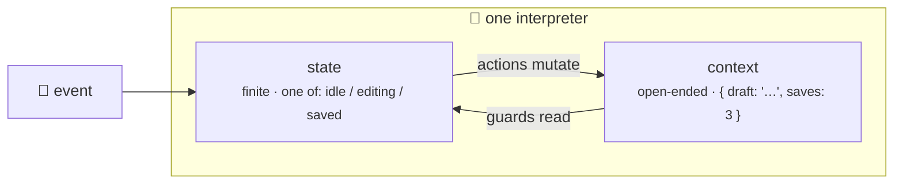

Context is a **mutable dictionary** that travels with the machine across every transition. Think of it as the machine's memory — it stores data that actions can read, guards can inspect, and services can populate.

## 🧠 What is Context?



Every state machine can carry an arbitrary Python dictionary alongside its current state. This dictionary is called the **context**. Unlike the machine's state (which is one of a finite set of named values), context is open-ended — it can hold counters, user profiles, error messages, timestamps, or anything else your application needs.

Key characteristics:

- **Mutable** — actions modify it in-place during transitions.
- **Shared** — all states in the machine see the same context object.
- **Deep-copied** — each interpreter instance gets its own copy of the initial context, so multiple interpreters from the same machine definition never interfere.
- **Serializable** — the context is included in snapshots (`get_snapshot()`), so keep it JSON-friendly.

## 📄 JSON Definition

Define context at the top level of your machine config:

```json
{
  "id": "counterMachine",
  "initial": "active",
  "context": {
    "count": 0,
    "lastUpdated": null,
    "history": []
  },
  "states": {
    "active": {
      "on": {
        "INCREMENT": { "target": "active", "actions": "addOne" },
        "DECREMENT": { "target": "active", "actions": "subtractOne" },
        "RESET":     { "actions": "resetCount" }
      }
    }
  }
}
```

> **Tip:** Keep context values JSON-serializable (strings, numbers, booleans, `null`, lists, dicts). This ensures snapshots and persistence work smoothly.

## 📝 Modifying Context in Actions (JSON Style)

Actions receive the context as a mutable dictionary and can modify it freely. Here is a complete, runnable example using a `MachineLogic` subclass:

```python
from xstate_statemachine import create_machine, SyncInterpreter, MachineLogic

config = {
    "id": "counter",
    "initial": "counting",
    "context": {"count": 0, "history": []},
    "states": {
        "counting": {
            "on": {
                "INCREMENT": {"actions": "addOne"},
                "DECREMENT": {"actions": "subtractOne"}
            }
        }
    }
}

class CounterLogic(MachineLogic):
    def add_one(self, interpreter, context, event, action_def):
        context["count"] += 1
        context["history"].append(f"+1 -> {context['count']}")

    def subtract_one(self, interpreter, context, event, action_def):
        context["count"] -= 1
        context["history"].append(f"-1 -> {context['count']}")

machine = create_machine(config, logic=CounterLogic())
interp = SyncInterpreter(machine).start()

interp.send("INCREMENT")
interp.send("INCREMENT")
interp.send("DECREMENT")

print(interp.context)
# {"count": 1, "history": ["+1 -> 1", "+1 -> 2", "-1 -> 1"]}

interp.stop()
```

> **Note:** Actions mutate context directly — there is no immutable update pattern. The interpreter passes the same dictionary reference to every action.

## 🐍 Pythonic API Context

All three Pythonic API styles support setting initial context.

### Class-Based: `initial_context`

```python
from xstate_statemachine import State, StateMachine, SyncInterpreter, action

class Counter(StateMachine):
    machine_id = "counter"
    initial_context = {"count": 0, "lastUpdated": None}

    counting = State("counting", initial=True)

    increment = counting.to(counting, event="INCREMENT", actions=["addOne"])

    @action
    def add_one(self, interpreter, context, event, action_def):
        context["count"] += 1

machine = Counter.create_machine()
interp = SyncInterpreter(machine).start()
interp.send("INCREMENT")
print(interp.context["count"])  # 1
interp.stop()
```

### Class-Based: Override at creation

```python
# Override the class-level context at machine creation time
machine = Counter.create_machine(context={"count": 100, "lastUpdated": None})
interp = SyncInterpreter(machine).start()
print(interp.context["count"])  # 100
interp.stop()
```

### Functional: `context` parameter in `build_machine()`

```python
from xstate_statemachine import State, build_machine, SyncInterpreter, action

counting = State("counting", initial=True)

@action
def add_one(interpreter, context, event, action_def):
    context["count"] += 1

machine = build_machine(
    id="counter",
    states=[counting],
    actions=[add_one],
    context={"count": 0, "lastUpdated": None},
)

interp = SyncInterpreter(machine).start()
print(interp.context)  # {"count": 0, "lastUpdated": None}
interp.stop()
```

### Builder: `.context()` method

```python
from xstate_statemachine import MachineBuilder, SyncInterpreter

machine = (
    MachineBuilder("counter")
    .context({"count": 0, "lastUpdated": None})
    .state("counting", initial=True)
    .build()
)

interp = SyncInterpreter(machine).start()
print(interp.context)  # {"count": 0, "lastUpdated": None}
interp.stop()
```

## 🛡️ Context in Guards

Guards receive `(context, event)` and can read context values to make routing decisions:

```python
from xstate_statemachine import create_machine, SyncInterpreter, MachineLogic, guard

config = {
    "id": "purchaseGate",
    "initial": "checking",
    "context": {"balance": 50.00, "itemPrice": 29.99},
    "states": {
        "checking": {
            "on": {
                "BUY": [
                    {"target": "approved", "guard": "hasEnoughBalance"},
                    {"target": "declined"}
                ]
            }
        },
        "approved":  {},
        "declined":  {}
    }
}

class PurchaseLogic(MachineLogic):
    @guard
    def has_enough_balance(self, context, event):
        return context["balance"] >= context["itemPrice"]

machine = create_machine(config, logic=PurchaseLogic())
interp = SyncInterpreter(machine).start()
interp.send("BUY")
print(interp.current_state_ids)  # {"purchaseGate.approved"}
interp.stop()
```

## 🪆 Context with Nested Objects

Context can hold deeply nested structures. Actions access them with standard Python dictionary operations:

```python
config = {
    "id": "userMachine",
    "initial": "idle",
    "context": {
        "user": {
            "name": "",
            "role": "guest",
            "preferences": {"theme": "light", "language": "en"}
        }
    },
    "states": {
        "idle": {
            "on": {
                "LOGIN": {"actions": "setUser", "target": "authenticated"}
            }
        },
        "authenticated": {}
    }
}

class UserLogic(MachineLogic):
    def set_user(self, interpreter, context, event, action_def):
        context["user"]["name"] = event.payload.get("name", "Unknown")
        context["user"]["role"] = event.payload.get("role", "member")

machine = create_machine(config, logic=UserLogic())
interp = SyncInterpreter(machine).start()
interp.send("LOGIN", name="Alice", role="admin")
print(interp.context["user"])
# {"name": "Alice", "role": "admin", "preferences": {"theme": "light", "language": "en"}}
interp.stop()
```

## 📚 Context with Arrays

Lists in context are useful for tracking history, queued items, or collected data:

```python
config = {
    "id": "collector",
    "initial": "collecting",
    "context": {"items": [], "history": []},
    "states": {
        "collecting": {
            "on": {
                "ADD_ITEM":    {"actions": "addItem"},
                "REMOVE_ITEM": {"actions": "removeItem"}
            }
        }
    }
}

class CollectorLogic(MachineLogic):
    def add_item(self, interpreter, context, event, action_def):
        item = event.payload.get("item")
        if item:
            context["items"].append(item)
            context["history"].append(f"Added: {item}")

    def remove_item(self, interpreter, context, event, action_def):
        item = event.payload.get("item")
        if item and item in context["items"]:
            context["items"].remove(item)
            context["history"].append(f"Removed: {item}")

machine = create_machine(config, logic=CollectorLogic())
interp = SyncInterpreter(machine).start()

interp.send("ADD_ITEM", item="apple")
interp.send("ADD_ITEM", item="banana")
interp.send("REMOVE_ITEM", item="apple")

print(interp.context["items"])    # ["banana"]
print(interp.context["history"])  # ["Added: apple", "Added: banana", "Removed: apple"]
interp.stop()
```

## 🎨 Context with Mixed Types

Context supports all JSON-compatible Python types:

```python
context = {
    "name": "Alice",          # str
    "age": 30,                # int
    "balance": 99.95,         # float
    "isActive": True,         # bool
    "deletedAt": None,        # null
    "tags": ["vip", "beta"],  # list
    "address": {              # dict
        "city": "Portland",
        "zip": "97201"
    }
}
```

> **Warning:** Avoid storing non-serializable objects (class instances, file handles, database connections) in context. They will break snapshot serialization and make debugging harder.

## 🔭 Context Scope

Context is **shared across ALL states** in the machine. There is no per-state context — any action in any state can read and modify any key:

```python
class SharedContextLogic(MachineLogic):
    def action_in_state_a(self, interpreter, context, event, action_def):
        context["sharedCounter"] += 1  # Incremented in state A

    def action_in_state_b(self, interpreter, context, event, action_def):
        # Can read the value set by state A's action
        print(f"Counter from state A: {context['sharedCounter']}")
```

> **Tip:** This shared scope is by design — it enables communication between states without events. Use naming conventions (e.g., `form_errors`, `auth_token`) to avoid accidental key collisions in large machines.

## ⚖️ Context vs Event Data

| | Context | Event Data |
|--|---------|------------|
| **Lifetime** | Persists for the machine's entire lifetime | Exists only during one transition |
| **Scope** | Shared across all states | Available only to the current transition's actions and guards |
| **Mutability** | Mutable by actions | Read-only (frozen dataclass) |
| **Access** | `context["key"]` | `event.payload["key"]` or `event.data["key"]` |
| **Use case** | Accumulated state: counters, user profiles, caches | Transient input: form data, click coordinates, API payloads |

**Rule of thumb:** If you need the data in a *future* transition, store it in context. If it is only relevant to the *current* transition, use event data.

## ✅ Best Practices for Context

1. **Initialize every key** — always declare all keys in the initial context, even if their values are `None` or `[]`. This prevents `KeyError` in actions and makes the context shape self-documenting.

2. **Keep it flat when possible** — deeply nested context is harder to debug. Prefer `{"userName": "Alice"}` over `{"user": {"name": "Alice"}}` unless nesting is natural.

3. **Use `.get()` with defaults** — guard against missing keys with `context.get("key", default)` rather than direct indexing.

4. **Don't store derived data** — if a value can be computed from other context values, compute it in the action instead of storing it.

5. **Name keys consistently** — use `camelCase` to match JSON convention, or `snake_case` to match Python convention. Pick one and stick with it.

## 🛒 Complete Example: Shopping Cart

A full shopping cart machine demonstrating context usage across multiple states and transitions:

```python
from xstate_statemachine import create_machine, SyncInterpreter, MachineLogic, guard

config = {
    "id": "shoppingCart",
    "initial": "browsing",
    "context": {
        "items": [],
        "total": 0.0,
        "discount": 0.0,
        "appliedCoupon": None
    },
    "states": {
        "browsing": {
            "on": {
                "ADD_ITEM":       {"actions": "addItem"},
                "REMOVE_ITEM":    {"actions": "removeItem"},
                "APPLY_COUPON":   {"actions": "applyCoupon"},
                "CHECKOUT": [
                    {"target": "checkout", "guard": "hasItems"},
                    {"target": "browsing"}
                ]
            }
        },
        "checkout": {
            "entry": "calculateTotal",
            "on": {
                "BACK":    {"target": "browsing"},
                "CONFIRM": {"target": "confirmed", "actions": "placeOrder"}
            }
        },
        "confirmed": {
            "type": "final"
        }
    }
}

class CartLogic(MachineLogic):
    # ---- Actions ----
    def add_item(self, interpreter, context, event, action_def):
        item = {
            "name": event.payload.get("name", "Unknown"),
            "price": event.payload.get("price", 0.0),
            "qty": event.payload.get("qty", 1),
        }
        context["items"].append(item)

    def remove_item(self, interpreter, context, event, action_def):
        name = event.payload.get("name")
        context["items"] = [i for i in context["items"] if i["name"] != name]

    def apply_coupon(self, interpreter, context, event, action_def):
        code = event.payload.get("code", "")
        coupons = {"SAVE10": 0.10, "SAVE20": 0.20}
        if code in coupons:
            context["discount"] = coupons[code]
            context["appliedCoupon"] = code

    def calculate_total(self, interpreter, context, event, action_def):
        subtotal = sum(
            i["price"] * i["qty"] for i in context["items"]
        )
        context["total"] = round(subtotal * (1 - context["discount"]), 2)

    def place_order(self, interpreter, context, event, action_def):
        print(f"Order placed! {len(context['items'])} items, total: ${context['total']:.2f}")

    # ---- Guards ----
    @guard
    def has_items(self, context, event):
        return len(context["items"]) > 0


machine = create_machine(config, logic=CartLogic())
interp = SyncInterpreter(machine).start()

# Add some items
interp.send("ADD_ITEM", name="Widget", price=9.99, qty=2)
interp.send("ADD_ITEM", name="Gadget", price=24.99, qty=1)

# Apply a coupon
interp.send("APPLY_COUPON", code="SAVE10")

# Checkout and confirm
interp.send("CHECKOUT")
interp.send("CONFIRM")
# Output: Order placed! 2 items, total: $40.47

print(interp.context["total"])         # 40.47
print(interp.context["appliedCoupon"]) # SAVE10
interp.stop()
```

## 📝 Updating Context Declaratively with `assign`

Every example above mutates context imperatively inside a `MachineLogic` action method. XState v5's idiomatic alternative is `assign`, a built-in action creator that declares context updates without a hand-written action method — each value can be a plain value or a callable of `{context, event}`:

```python
from xstate_statemachine import create_machine, SyncInterpreter, MachineLogic, assign

config = {
    "id": "counter",
    "initial": "counting",
    "context": {"count": 0},
    "states": {
        "counting": {
            "on": {
                "INCREMENT": {
                    "actions": assign({"count": lambda args: args["context"]["count"] + 1})
                }
            }
        }
    }
}

machine = create_machine(config, logic=MachineLogic())
interp = SyncInterpreter(machine).start()

interp.send("INCREMENT")
interp.send("INCREMENT")

print(interp.context["count"])  # 2
interp.stop()
```

See [Actions](../actions/) for the full list of built-in action creators, including `assign`.

## Typed Context — Letting the Checker Catch Your Typos

The library ships `py.typed`, and `interp.context` can be **your** type. Declare
the context shape as a `TypedDict` (or any `Mapping` subtype) and pass it to
`create_machine(context_type=...)`. It has no runtime effect — the machine's
context is still the `"context"` in your config — it exists purely so the
type flows through to every interpreter built from that machine:

```python
from typing import Optional, TypedDict

from xstate_statemachine import MachineLogic, SyncInterpreter, create_machine


class Cart(TypedDict):
    items: list
    total: float
    coupon: Optional[str]


def add_item(interp: "SyncInterpreter[Cart]", ctx: Cart, event, action_def) -> None:
    ctx["items"].append(event.payload["sku"])
    ctx["total"] += event.payload["price"]


machine = create_machine(
    {
        "id": "shop",
        "initial": "browsing",
        "context": {"items": [], "total": 0.0, "coupon": None},
        "states": {"browsing": {"on": {"ADD": {"actions": ["addItem"]}}}},
    },
    logic=MachineLogic(actions={"add_item": add_item}),
    context_type=Cart,
)

interp = SyncInterpreter(machine).start()          # SyncInterpreter[Cart]
interp.send("ADD", sku="A1", price=9.5)

total: float = interp.context["total"]             # ✅ typed as float
assert total == 9.5
```

With `context_type` set, mypy and pyright both report:

<!-- doc-fragment -->
```python
interp.context["totl"]              # error: TypedDict "Cart" has no key "totl"
label: str = interp.context["total"]  # error: "float" is not "str"
```

Without `context_type`, the context is `Dict[str, Any]` — everything is
permitted, exactly as in 0.7.x. The other things the checker now verifies
for you: `send(..., wait=True)` returns a `Receipt` (not `None`), `wait=` and
`priority=` must be `bool`, every `MachineLogic` callable has the right
**arity** (a two-argument action or a guard returning `str` is an error), and
plugin hook overrides must keep the base signature. See
[Testing & The Pure API](../testing-and-pure-api/) for running a type
checker as part of your test suite.

## Interpreter `input` and Context

When you construct an interpreter with `input=`, that value is exposed to the running machine under `context["input"]` — but only if the initial context doesn't already declare an `"input"` key (an explicit `context` key always wins, so `input` can never overwrite declared context):

```python
from xstate_statemachine import create_machine, SyncInterpreter, MachineLogic

config = {
    "id": "m",
    "initial": "idle",
    "context": {"count": 0},
    "states": {"idle": {}},
}

machine = create_machine(config, logic=MachineLogic())
interp = SyncInterpreter(machine, input={"userId": 42}).start()

print(interp.context)  # {"count": 0, "input": {"userId": 42}}
interp.stop()
```

## See Also

- **[Actions](../actions/)** — how to mutate context in entry, exit, and transition actions
- **[Guards](../guards/)** — how to use context values in conditional transitions
- **[Services & Invoke](../services/)** — how service results flow into context via `onDone`
- **[Snapshots](../snapshots/)** — how to save and restore context state for persistence
- **[Pythonic API](../pythonic-api/)** — the `initial_context` class attribute and context in builder/functional APIs
