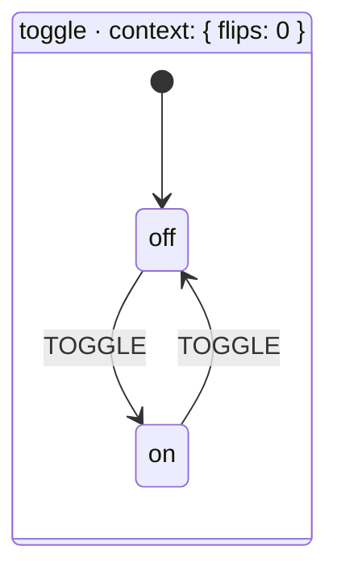
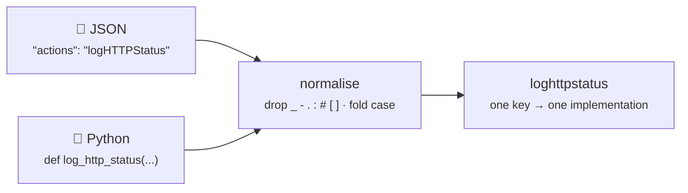
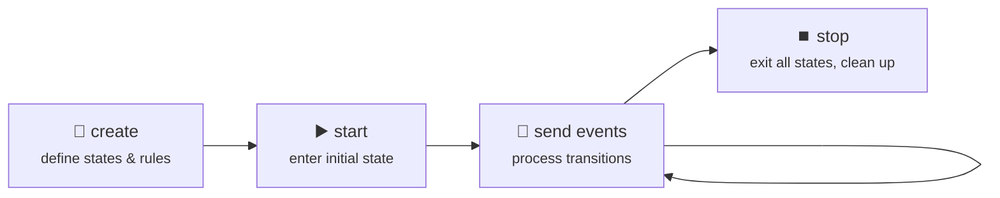

Every state machine is built from a small set of fundamental concepts. This page covers all of them.

## 🗺️ The Big Picture



This toggle switch has **2 states** (`off`, `on`), **1 event type** (`TOGGLE`), **2 transitions** (one in each direction), and a **context** tracking flip count.

## 📖 Core Vocabulary

| Concept | What It Is | Example |
|---------|-----------|---------|
| **State** | A distinct mode the system can be in | `"off"`, `"loading"`, `"error"` |
| **Event** | Something that happens from the outside | `"TOGGLE"`, `"SUBMIT"`, `"TIMEOUT"` |
| **Transition** | A rule: _"when event X in state A, go to state B"_ | `off --TOGGLE--> on` |
| **Guard** | A boolean condition that must be true for the transition | `"isAdult"` — only transition if age >= 18 |
| **Action** | A side effect that runs during a transition | `"logToggle"` — print a message when toggling |
| **Context** | Mutable data the machine carries with it | `{ "retries": 0, "user": null }` |
| **Service** | An async operation invoked when entering a state | `"fetchUserData"` — API call, DB query |
| **Final State** | A terminal state with no outgoing transitions | `"success"`, `"completed"` |

## ⭐ The Golden Rule

> **A state machine can only be in ONE state at a time** (unless using parallel states).
> It can ONLY move to another state when it receives an event that matches a defined transition.

This eliminates the "impossible states" problem. No more `isLoading && hasError && isAuthenticated` contradictions. If you're in the `loading` state, you are _only_ loading — not errored, not authenticated, not idle.

```python
# Traditional approach — impossible states are possible
is_loading = True
has_error = True       # Loading AND errored? Bug waiting to happen.
is_authenticated = True

# State machine approach — exactly ONE state at a time
# State is "loading" OR "error" OR "authenticated" — never multiple.
```

> [!NOTE]
> **Error & unhandled-event policies.** By default (`strict: False`, `onUnhandled: "ignore"`) an event with no matching transition is dropped silently — no crash. You can tighten this: set `strict: True` to raise `UnknownEventError` for event types the machine never declares, or set `onUnhandled` to `"error"`/`"defer"` to change how known-but-unhandled events are treated. Similar knobs exist for action/guard failures via `actionErrorPolicy` and `guardErrorPolicy`. See the [JSON Configuration Reference](../json-config/) and [Troubleshooting](../troubleshooting/).

---

## 📨 How Events Work

Events are the **only** way to trigger state changes. They come from the outside world — user clicks, API responses, timers, or your own code calling `send()`.

<!-- doc-fragment -->
```python
# String shorthand — most common
interpreter.send("TOGGLE")

# With payload data
interpreter.send("LOGIN", username="alice", password="secret")

# Event object for full control
from xstate_statemachine import Event
interpreter.send(Event(type="LOGIN", payload={"username": "alice"}))

# Dict form
interpreter.send({"type": "LOGIN", "username": "alice"})

# Multiple events in sequence
interpreter.send_events(["STEP_1", "STEP_2", "STEP_3"])
```

> **Tip:** Event names are conventionally UPPER_CASE (`"TOGGLE"`, `"SUBMIT"`, `"FETCH"`). State names are lowercase (`"idle"`, `"loading"`, `"done"`). This makes it easy to tell them apart at a glance.

---

## 🚨 Error & Unhandled-Event Policies

By default, an event that doesn't match any transition from the current state is dropped silently, and an action or guard that raises an exception propagates as-is. For most apps that's the right default, but a few config keys let you change this per machine:

- **`strict`** (bool, default `False`) — when `True`, sending an event *type* the machine never declares anywhere in its config raises `UnknownEventError` instead of being ignored. Useful for catching typos in event names during development.
- **`onUnhandled`** (`"ignore"` | `"defer"` | `"error"`, default `"ignore"`) — controls what happens when a *known* event has no transition from the current state. `"ignore"` drops it (the default), `"error"` raises `UnhandledEventError`, and `"defer"` queues it for later instead of discarding it.
- **`actionErrorPolicy`** / **`guardErrorPolicy`** — control whether an exception raised inside an action or guard callback is swallowed, logged, or re-raised, instead of always propagating.

```python
from xstate_statemachine import create_machine, SyncInterpreter

config = {
    "id": "strictDemo",
    "strict": True,
    "onUnhandled": "error",
    "initial": "idle",
    "states": {
        "idle": {"on": {"START": "running"}},
        "running": {},
    },
}

machine = create_machine(config)
interp = SyncInterpreter(machine).start()
interp.send("START")   # idle -> running

interp.send("START")   # known event, no transition from "running"
print(interp.status)    # "error" -- onUnhandled: "error" fails the machine
print(type(interp.error).__name__)  # UnhandledEventError

try:
    machine2 = create_machine({**config, "onUnhandled": "ignore"})
    interp2 = SyncInterpreter(machine2).start()
    interp2.send("NOT_A_REAL_EVENT")  # never declared anywhere in config
except Exception as exc:
    print(type(exc).__name__)  # UnknownEventError -- raised by `strict`
```

See the [JSON Configuration Reference](../json-config/) for the full list of config keys, and [Troubleshooting](../troubleshooting/) for how these errors surface in practice.

---

## ➡️ How Transitions Work

A transition answers one question: _"When event X happens while in state A, what should happen?"_

> [!IMPORTANT]
> The snippets below show the *shape* of a transition. `State.to()` **returns** a
> `Transition` — it does not register one. Assign it inside a `StateMachine` class
> body (`submit = editing.to(...)`), or pass it to
> `build_machine(transitions=[...])`. A bare `off.to(on, ...)` statement is
> discarded, and the machine will start but never move.

### Simple String Target

The most basic form — just specify where to go:

```python
# Pythonic
off.to(on, event="TOGGLE")

# JSON equivalent
{"on": {"TOGGLE": "on"}}
```

### Transition with Actions

Run side effects when the transition fires:

```python
# Pythonic
off.to(on, event="TOGGLE", actions="logToggle")

# JSON equivalent
{"on": {"TOGGLE": {"target": "on", "actions": "logToggle"}}}

# Multiple actions
off.to(on, event="TOGGLE", actions=["validate", "logToggle"])
```

### Guarded Transitions

Only transition if a condition is met:

```python
# Pythonic
checking.to(allowed, event="VERIFY", guard="isAdult")

# JSON equivalent
{"on": {"VERIFY": {"target": "allowed", "guard": "isAdult"}}}
```

### Multiple Guarded Transitions

When the same event can lead to different states depending on conditions, the **first matching guard wins**:

```python
# Pythonic — use the | operator
verify = (
    checking.to(allowed,  event="VERIFY", guard="isAdult")
    | checking.to(rejected, event="VERIFY")  # fallback (no guard)
)

# JSON equivalent — array of transition candidates
{"on": {"VERIFY": [
    {"target": "allowed",  "guard": "isAdult"},
    {"target": "rejected"}
]}}
```

### Self-Transitions

A state can transition to itself — useful for incrementing counters or re-running entry actions:

```python
# Pythonic
counting.to(counting, event="INCREMENT", actions="addOne")

# JSON equivalent
{"on": {"INCREMENT": {"target": "counting", "actions": "addOne"}}}
```

---

## 🏷️ State Types

### Atomic States

Simple leaf states with no children. This is the most common type:

```python
from xstate_statemachine import State, build_machine, SyncInterpreter

idle    = State("idle", initial=True)
loading = State("loading")
done    = State("done")

t1 = idle.to(loading, event="FETCH")
t2 = loading.to(done, event="SUCCESS")

machine = build_machine(
    id="fetcher", states=[idle, loading, done], transitions=[t1, t2]
)
interp = SyncInterpreter(machine).start()
interp.send("FETCH")     # idle -> loading
interp.send("SUCCESS")   # loading -> done
interp.stop()
```

### Compound States (Hierarchical)

States that contain nested child states. The parent is active whenever any of its children are active:

```python
# A "form" state that has sub-states
editing    = State("editing", initial=True)
submitting = State("submitting")
form = State("form", initial=True, states=[editing, submitting])
success = State("success")

t1 = editing.to(submitting, event="SUBMIT")
t2 = form.to(success, event="DONE")

machine = build_machine(
    id="wizard", states=[form, success], transitions=[t1, t2]
)
interp = SyncInterpreter(machine).start()
# active_state_ids: {'wizard.form.editing'}
interp.send("SUBMIT")
# active_state_ids: {'wizard.form.submitting'}
interp.stop()
```

### Parallel States

All child regions are active simultaneously. Each region has its own independent state:

```python
bold   = State("bold",   initial=True)
normal = State("normal")
bold_region = State("fontWeight", parallel=False, states=[bold, normal])

red   = State("red", initial=True)
blue  = State("blue")
color_region = State("fontColor", parallel=False, states=[red, blue])

editor = State("editor", parallel=True, initial=True, states=[bold_region, color_region])

t1 = bold.to(normal, event="TOGGLE_BOLD")
t2 = normal.to(bold,  event="TOGGLE_BOLD")
t3 = red.to(blue, event="TOGGLE_COLOR")
t4 = blue.to(red, event="TOGGLE_COLOR")

machine = build_machine(
    id="textEditor", states=[editor], transitions=[t1, t2, t3, t4]
)
interp = SyncInterpreter(machine).start()
# Active: editor.fontWeight.bold AND editor.fontColor.red
interp.send("TOGGLE_BOLD")
# Active: editor.fontWeight.normal AND editor.fontColor.red
interp.send("TOGGLE_COLOR")
# Active: editor.fontWeight.normal AND editor.fontColor.blue
interp.stop()
```

### Final States

Terminal states. Once a machine enters a final state, it's done — no more transitions:

```python
idle     = State("idle", initial=True)
loading  = State("loading")
success  = State("success", final=True)
failure  = State("failure")

t1 = idle.to(loading, event="FETCH")
t2 = loading.to(success, event="RESOLVE")
t3 = loading.to(failure, event="REJECT")
t4 = failure.to(loading, event="RETRY")

machine = build_machine(
    id="dataLoader",
    states=[idle, loading, success, failure],
    transitions=[t1, t2, t3, t4],
)
interp = SyncInterpreter(machine).start()
interp.send("FETCH")
interp.send("RESOLVE")
# Machine is now in final state "success" — no further transitions possible
interp.stop()
```

---

## 🐍 Naming: snake_case Python, camelCase JSON

Your machine config follows XState (`"actions": "storeUser"`); your Python follows PEP 8 (`def store_user(...)`). You never write the bridge — the library matches names ignoring case and separators, so `storeUser`, `store_user`, and even `store-user` are the same name. Acronyms (`logHTTPStatus` ↔ `log_http_status`) and Stately's inline names (`inline:m.a#entry[0]` ↔ `inline_m_a_entry_0`) work too.



Exact names still take precedence, and two *different* functions that collide (`fetch_data` and `fetchData`) are rejected when the machine is built. The CLI's `xsm gt` emits snake_case stubs for exactly this reason.

## 🔢 Action Execution Order

When a transition fires, actions execute in a **strict, predictable order**:

1. **Exit actions** on the source state (bottom-up for nested states)
2. **Transition actions** (defined on the transition itself)
3. **Entry actions** on the target state (top-down for nested states)

```python
from xstate_statemachine import State, StateMachine, SyncInterpreter, action

class OrderDemo(StateMachine):
    machine_id = "orderDemo"

    editing    = State("editing", initial=True)
    submitting = State("submitting")

    submit = editing.to(submitting, event="SUBMIT", actions="validate")

    @editing.exit
    def on_exit_editing(self, interpreter, context, event, action_def):
        print("1. EXIT editing (saveDraft)")

    @action
    def validate(self, interpreter, context, event, action_def):
        print("2. TRANSITION action (validate)")

    @submitting.enter
    def on_enter_submitting(self, interpreter, context, event, action_def):
        print("3. ENTRY submitting (showSpinner)")

machine = OrderDemo.create_machine()
interp = SyncInterpreter(machine).start()
interp.send("SUBMIT")
interp.stop()
```

**Output:**

```
1. EXIT editing (saveDraft)
2. TRANSITION action (validate)
3. ENTRY submitting (showSpinner)
```

---

## Guard Evaluation Order

When multiple transitions share the same event, guards are evaluated **top to bottom**. The **first matching guard wins**:

```python
from xstate_statemachine import State, build_machine, SyncInterpreter, guard

checking = State("checking", initial=True)
premium  = State("premium")
standard = State("standard")
rejected = State("rejected")

# Order matters! First match wins.
verify = (
    checking.to(premium,  event="VERIFY", guard="isPremium")
    | checking.to(standard, event="VERIFY", guard="isAdult")
    | checking.to(rejected, event="VERIFY")  # fallback — no guard
)

@guard
def is_premium(context, event):
    return context.get("age", 0) >= 18 and context.get("plan") == "premium"

@guard
def is_adult(context, event):
    return context.get("age", 0) >= 18

machine = build_machine(
    id="accessControl",
    states=[checking, premium, standard, rejected],
    guards=[is_premium, is_adult],
    context={"age": 25, "plan": "premium"},
)

interp = SyncInterpreter(machine).start()
interp.send("VERIFY")
print(interp.active_state_ids)
# {'accessControl.premium'} — isPremium matched first
interp.stop()
```

> **Tip:** Always put your most specific guards first and leave a fallback transition (no guard) last to handle the default case.

---

## Context: Your Machine's Data

Context is a **mutable dictionary** that travels with the machine across all transitions. Actions read and write it freely.

```python
from xstate_statemachine import State, build_machine, SyncInterpreter, action

counting = State("counting", initial=True)
done     = State("done")

counting.to(counting, event="INCREMENT", actions="addOne")
counting.to(done,     event="FINISH")

@action
def add_one(interpreter, context, event, action_def):
    context["count"] += 1
    context["history"].append(f"+1 -> {context['count']}")

machine = build_machine(
    id="counter",
    states=[counting, done],
    actions=[add_one],
    context={"count": 0, "history": []},
)

interp = SyncInterpreter(machine).start()
interp.send("INCREMENT")
interp.send("INCREMENT")
interp.send("INCREMENT")

print(interp.context["count"])      # 3
print(interp.context["history"])    # ['+1 -> 1', '+1 -> 2', '+1 -> 3']

interp.send("FINISH")
interp.stop()
```

> **Tip:** Context is just a Python dictionary. You can store any serializable data — numbers, strings, lists, nested dicts. Keep your context flat when possible for easier debugging and serialization.

---

## 🔁 The State Machine Lifecycle

Every machine follows the same lifecycle:



In code:

```python
from xstate_statemachine import State, build_machine, SyncInterpreter

idle   = State("idle", initial=True)
active = State("active")
t1 = idle.to(active, event="ACTIVATE")
t2 = active.to(idle,  event="DEACTIVATE")

# 1. CREATE — define the machine
machine = build_machine(
    id="lifecycle", states=[idle, active], transitions=[t1, t2]
)

# 2. START — enter the initial state
interp = SyncInterpreter(machine).start()
print(interp.active_state_ids)   # {'lifecycle.idle'}
print(interp.is_running)         # True

# 3. SEND EVENTS — drive state changes
interp.send("ACTIVATE")
print(interp.active_state_ids)   # {'lifecycle.active'}

interp.send("DEACTIVATE")
print(interp.active_state_ids)   # {'lifecycle.idle'}

# 4. STOP — clean up
interp.stop()
print(interp.is_running)         # False
```

---

## Why State Machines?

Consider a simple door that can be opened, closed, and locked. Here's the traditional approach vs. the state machine approach:

### Without State Machines (if/else)

```python
class Door:
    def __init__(self):
        self.is_open = False
        self.is_locked = False

    def open(self):
        if self.is_locked:
            print("Can't open — locked!")
        elif self.is_open:
            print("Already open!")
        else:
            self.is_open = True

    def close(self):
        if not self.is_open:
            print("Already closed!")
        else:
            self.is_open = False

    def lock(self):
        if self.is_open:
            print("Can't lock — door is open!")
        elif self.is_locked:
            print("Already locked!")
        else:
            self.is_locked = True

    def unlock(self):
        if not self.is_locked:
            print("Not locked!")
        else:
            self.is_locked = False

# Problems:
# - What if someone sets is_open=True AND is_locked=True? Invalid state!
# - Every new feature adds more if/else branches
# - Hard to visualize the full set of valid transitions
# - No protection against impossible states
```

### With a State Machine

```python
from xstate_statemachine import State, build_machine, SyncInterpreter

closed   = State("closed", initial=True)
opened   = State("opened")
locked   = State("locked")

t1 = closed.to(opened, event="OPEN")
t2 = closed.to(locked, event="LOCK")
t3 = opened.to(closed, event="CLOSE")
t4 = locked.to(closed, event="UNLOCK")

machine = build_machine(
    id="door",
    states=[closed, opened, locked],
    transitions=[t1, t2, t3, t4],
)
interp = SyncInterpreter(machine).start()

interp.send("OPEN")     # closed -> opened
interp.send("LOCK")     # ignored! No LOCK transition from "opened"
interp.send("CLOSE")    # opened -> closed
interp.send("LOCK")     # closed -> locked
interp.send("OPEN")     # ignored! No OPEN transition from "locked"
interp.send("UNLOCK")   # locked -> closed
interp.stop()

# Benefits:
# - Impossible states are impossible (can't be open AND locked)
# - Invalid events are silently ignored (no crashes)
# - The full behavior is visible in the transition definitions
# - Easy to add new states or events without breaking existing logic
```

---

## One Algorithm, Two Engines

`Interpreter` (async) and `SyncInterpreter` (sync) used to carry two
independent copies of the transition logic -- each engine reimplementing
action execution, guard evaluation, event selection, and error handling with
its own subtle differences. As of `#60`, there is exactly **one**
implementation of the core algorithm, living in `BaseInterpreter`. Each
engine supplies only a small set of engine-specific **leaves**:

- how to invoke a single user action (`await` on the async engine, a plain
  call on the sync engine);
- how to invoke a single service;
- how to spawn or stop a child actor.

Everything else -- resolving built-in actions, running the action list in
order, containing an action's exception, applying `actionErrorPolicy`,
firing `on_action_execute` / `on_action_error` / `on_transition` plugin
hooks, deciding whether an event is unhandled -- is written once and shared.

What this guarantees you as a user:

- **Identical semantics on both engines.** A machine that behaves a
  particular way under `SyncInterpreter` behaves the *same* way under
  `Interpreter` (modulo the unavoidable sync/async boundary -- an
  `async def` action or service still requires the async engine and raises
  `NotSupportedError` on the sync one). Guard order, action order, error
  policies, and unhandled-event handling are not "close enough" between
  engines; they are the same code path.
- **A bug fixed once is fixed everywhere.** There is no second copy of the
  transition logic to have drifted, and no risk of a fix landing on one
  engine but not the other.
- **Choosing an engine is purely an I/O concern** -- do you need
  non-blocking async services and timers, or immediate, thread-free
  execution? -- never a behavioral one.

## The Microstep / Macrostep Model

Processing a single external event is a **macrostep**, made of one or more
**microsteps**, mirroring the SCXML processing model (`#36`):

1. An external event (from `send()`, a fired `after` timer, or a completed
   `invoke`) is taken off the inbox. This starts a macrostep.
2. The machine evaluates transitions and runs their actions. An action can
   itself `raise()` a new event **to this same machine** -- that event does
   **not** go back onto the external inbox. It goes onto an internal queue.
3. Before the interpreter looks at the next *external* event, it drains the
   internal queue completely, one microstep at a time, in the order events
   were raised. Each internal event may itself raise further internal
   events, which are appended and processed in turn.
4. Only once the internal queue is empty does the macrostep end and the
   interpreter return to the external inbox for the next event.

```python
from xstate_statemachine import State, build_machine, SyncInterpreter, raise_

step_one = State("stepOne", initial=True)
step_two = State("stepTwo", entry=[raise_({"type": "NEXT"})])
step_three = State("stepThree")

# Entering "stepTwo" immediately raises NEXT to itself -- processed as part
# of the SAME macrostep, before any externally queued event is looked at.
machine = build_machine(
    id="microsteps",
    states=[step_one, step_two, step_three],
    transitions=[
        step_one.to(step_two, event="START"),
        step_two.to(step_three, event="NEXT"),
    ],
)

interp = SyncInterpreter(machine).start()
interp.send("START")
# By the time send() returns, only the macrostep for "START" has been
# processed -- but internally, entering stepTwo could `raise_({"type": "NEXT"})`
# and the machine would already be sitting in stepThree.
interp.stop()
```

This is why an event you `send()` is never interleaved with the internal
consequences of a *previous* event: the internal queue always drains first,
so external events observe a machine that has already settled from its own
self-raised events.

---


Now that you understand the building blocks:

- [Quick Start](../quick-start/) — Hands-on examples for every API style
- [Pythonic API](../pythonic-api/) — Full reference for class, builder, and functional styles
- [Actions](../actions/) — Deep dive into entry, exit, and transition actions
- [Guards](../guards/) — Conditional transitions in detail
- [Context](../context/) — Working with mutable machine data
- [Hierarchical States](../hierarchical/) — Nested (compound) states
- [Parallel States](../parallel/) — Concurrent state regions
- [Services](../services/) — Async operations invoked by states
- [Final States](../final-states/) — Terminal states and completion
