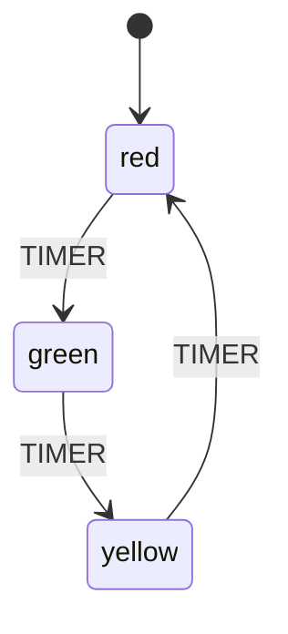

# Diagram Export

Every `MachineNode` can export its structure as a **PlantUML** or **Mermaid** diagram. This lets you visualize your state machines, generate documentation, and keep diagrams in sync with your code automatically.

## Overview

The library provides two export methods on every `MachineNode`:

| Method | Format | Use Case |
|--------|--------|----------|
| `machine.to_plantuml()` | PlantUML | Rich diagrams, IDE plugins, PDF generation |
| `machine.to_mermaid()` | Mermaid | GitHub README, Markdown docs, online editors |

Both methods return a string that you can print, save to a file, or embed in documentation.

## PlantUML Export

### Basic Example

```python
from xstate_statemachine import create_machine

config = {
    "id": "trafficLight",
    "initial": "red",
    "states": {
        "red": {"on": {"TIMER": "green"}},
        "green": {"on": {"TIMER": "yellow"}},
        "yellow": {"on": {"TIMER": "red"}}
    }
}

machine = create_machine(config)
plantuml = machine.to_plantuml()
print(plantuml)
```

### Sample Output

```
@startuml
hide empty description
state "trafficLight" as trafficLight {
  [*] --> trafficLight_red
  state "red" as trafficLight_red
  state "green" as trafficLight_green
  state "yellow" as trafficLight_yellow
}
[*] --> trafficLight_red
trafficLight_red --> trafficLight_green : TIMER
trafficLight_green --> trafficLight_yellow : TIMER
trafficLight_yellow --> trafficLight_red : TIMER
@enduml
```

### How to Render PlantUML

There are several ways to render PlantUML diagrams:

**1. Save to file and use the PlantUML CLI:**

```bash
pip install plantuml
```

```python
# Save the diagram
with open("traffic_light.puml", "w") as f:
    f.write(machine.to_plantuml())
```

```bash
# Render to PNG
plantuml traffic_light.puml
```

**2. Use the PlantUML online server:**

Paste the output at [https://www.plantuml.com/plantuml/uml/](https://www.plantuml.com/plantuml/uml/)

**3. VS Code extension:**

Install the "PlantUML" extension and preview `.puml` files directly in the editor.

## Mermaid Export

### Basic Example

```python
from xstate_statemachine import create_machine

config = {
    "id": "trafficLight",
    "initial": "red",
    "states": {
        "red": {"on": {"TIMER": "green"}},
        "green": {"on": {"TIMER": "yellow"}},
        "yellow": {"on": {"TIMER": "red"}}
    }
}

machine = create_machine(config)
mermaid = machine.to_mermaid()
print(mermaid)
```

### Sample Output

```
stateDiagram-v2
[*] --> red
red --> green : TIMER
green --> yellow : TIMER
yellow --> red : TIMER
```

### Embedding in GitHub README

Mermaid diagrams render natively in GitHub Markdown. Wrap the output in a fenced code block:

````markdown

````

> **Tip:** You can automate this by writing a script that regenerates your README's diagram section from your machine definition. This ensures your documentation always matches your code.

## Export from JSON Machines

Both export methods work with any machine created via `create_machine()`:

```python
import json
from xstate_statemachine import create_machine

# Load config from a JSON file
with open("my_machine.json") as f:
    config = json.load(f)

machine = create_machine(config)

# Export both formats
with open("docs/machine.puml", "w") as f:
    f.write(machine.to_plantuml())

with open("docs/machine.mmd", "w") as f:
    f.write(machine.to_mermaid())

print("Diagrams exported!")
```

## Export from Pythonic API Machines

Machines built with the Pythonic API export diagrams the same way — `StateMachine.create_machine()`, `build_machine()`, and `MachineBuilder.build()` all return a `MachineNode`:

```python
from xstate_statemachine import State, StateMachine

class DoorLock(StateMachine):
    machine_id = "doorLock"

    locked = State("locked", initial=True)
    unlocked = State("unlocked")

    unlock = locked.to(unlocked, event="UNLOCK")
    lock = unlocked.to(locked, event="LOCK")

machine = DoorLock.create_machine()

# PlantUML
print(machine.to_plantuml())

# Mermaid
print(machine.to_mermaid())
```

**Mermaid output:**

```
stateDiagram-v2
[*] --> locked
locked --> unlocked : UNLOCK
unlocked --> locked : LOCK
```

## Nested State Diagrams

Both exporters handle hierarchical (compound) states with proper nesting:

```python
from xstate_statemachine import create_machine

config = {
    "id": "editor",
    "initial": "idle",
    "states": {
        "idle": {"on": {"OPEN": "editing"}},
        "editing": {
            "initial": "drafting",
            "states": {
                "drafting": {
                    "on": {
                        "PREVIEW": "previewing",
                        "SAVE": "saving"
                    }
                },
                "previewing": {"on": {"EDIT": "drafting"}},
                "saving": {
                    "on": {"SAVE_DONE": "drafting"}
                }
            },
            "on": {"CLOSE": "idle"}
        }
    }
}

machine = create_machine(config)
print(machine.to_plantuml())
```

**PlantUML output (nested):**

```
@startuml
hide empty description
state "editor" as editor {
  [*] --> editor_idle
  state "idle" as editor_idle
  state "editing" as editor_editing {
    [*] --> editor_editing_drafting
    state "drafting" as editor_editing_drafting
    state "previewing" as editor_editing_previewing
    state "saving" as editor_editing_saving
  }
}
[*] --> editor_idle
editor_idle --> editor_editing : OPEN
editor_editing_drafting --> editor_editing_previewing : PREVIEW
editor_editing_drafting --> editor_editing_saving : SAVE
editor_editing_previewing --> editor_editing_drafting : EDIT
editor_editing_saving --> editor_editing_drafting : SAVE_DONE
editor_editing --> editor_idle : CLOSE
@enduml
```

## Parallel State Diagrams

Parallel states are also exported with their concurrent regions visible:

```python
from xstate_statemachine import create_machine

config = {
    "id": "player",
    "initial": "playing",
    "states": {
        "playing": {
            "type": "parallel",
            "states": {
                "video": {
                    "initial": "loading",
                    "states": {
                        "loading": {"on": {"VIDEO_READY": "streaming"}},
                        "streaming": {"on": {"BUFFER": "loading"}}
                    }
                },
                "audio": {
                    "initial": "muted",
                    "states": {
                        "muted": {"on": {"UNMUTE": "audible"}},
                        "audible": {"on": {"MUTE": "muted"}}
                    }
                }
            },
            "on": {"STOP": "stopped"}
        },
        "stopped": {"type": "final"}
    }
}

machine = create_machine(config)
print(machine.to_mermaid())
```

## Using Diagrams for Documentation

### Auto-Generate Documentation Script

Create a script that generates diagrams for all your machines:

```python
"""generate_docs.py — Export diagrams for all state machines."""
import json
from pathlib import Path
from xstate_statemachine import create_machine

MACHINES_DIR = Path("configs")
DOCS_DIR = Path("docs/diagrams")
DOCS_DIR.mkdir(parents=True, exist_ok=True)

for config_file in MACHINES_DIR.glob("*.json"):
    with open(config_file) as f:
        config = json.load(f)

    machine = create_machine(config)
    machine_id = config["id"]

    # Export PlantUML
    puml_path = DOCS_DIR / f"{machine_id}.puml"
    puml_path.write_text(machine.to_plantuml())

    # Export Mermaid
    mmd_path = DOCS_DIR / f"{machine_id}.mmd"
    mmd_path.write_text(machine.to_mermaid())

    print(f"Exported: {machine_id} -> {puml_path}, {mmd_path}")

print(f"\nAll diagrams written to {DOCS_DIR}/")
```

```bash
python generate_docs.py
```

## Complete Example: Complex Machine with All Features

```python
from xstate_statemachine import create_machine

config = {
    "id": "orderSystem",
    "initial": "browsing",
    "context": {"cart": [], "total": 0},
    "states": {
        "browsing": {
            "on": {
                "ADD_ITEM": {"actions": "addToCart"},
                "CHECKOUT": {"target": "checkout", "guard": "cartNotEmpty"}
            }
        },
        "checkout": {
            "initial": "shipping",
            "states": {
                "shipping": {
                    "on": {"SUBMIT_ADDRESS": "payment"}
                },
                "payment": {
                    "on": {"SUBMIT_PAYMENT": "processing"}
                },
                "processing": {
                    "invoke": {
                        "src": "processPayment",
                        "onDone": "confirmation",
                        "onError": "payment"
                    }
                },
                "confirmation": {"type": "final"}
            },
            "on": {"CANCEL": "browsing"},
            "onDone": "complete"
        },
        "complete": {"type": "final"}
    }
}

machine = create_machine(config)

# Save both diagram formats
Path("order_system.puml").write_text(machine.to_plantuml())
Path("order_system.mmd").write_text(machine.to_mermaid())

# Print Mermaid for quick preview
print(machine.to_mermaid())
```

> **Note:** The `onDone` transition from compound states is included in the exported diagrams, showing the flow from the compound state to the next top-level state.
