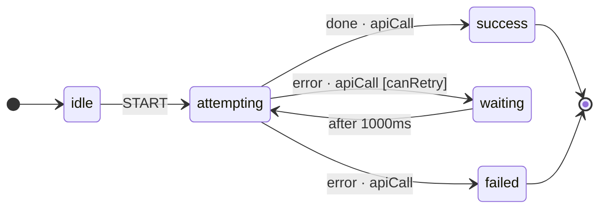
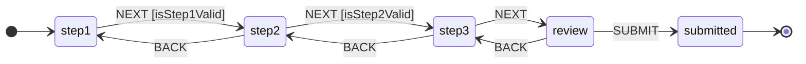
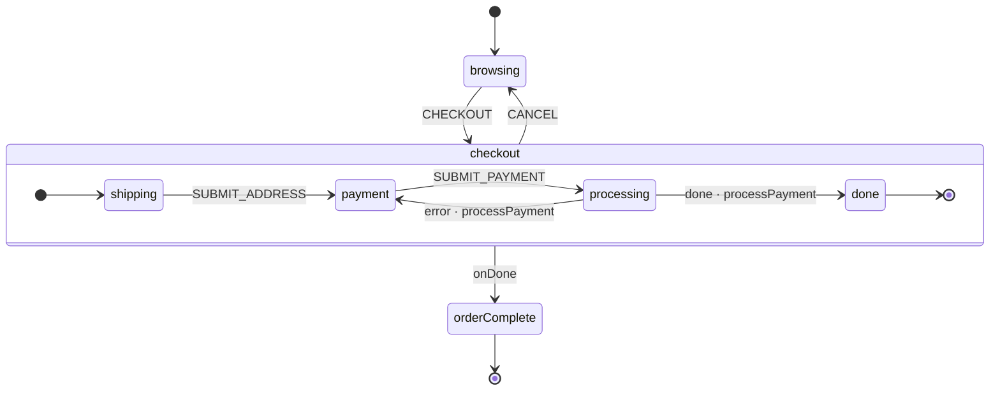
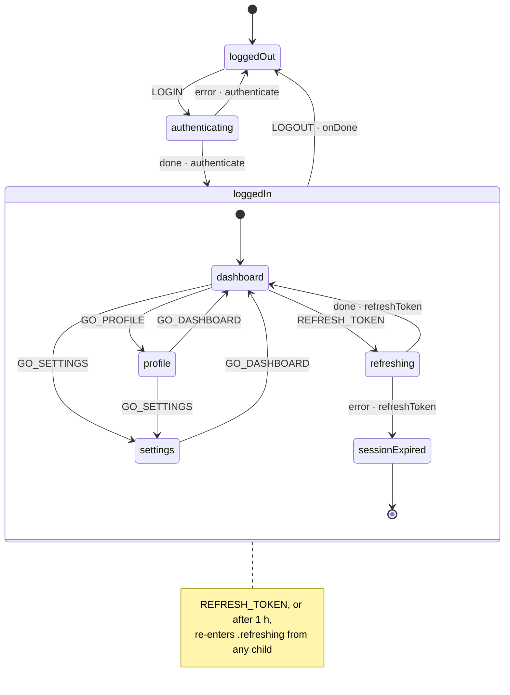
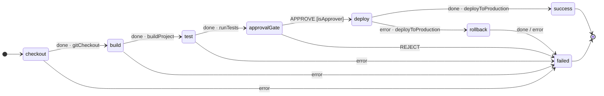
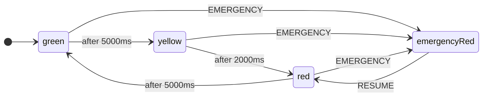

# Advanced Patterns

This guide presents production-ready state machine patterns that solve common architectural challenges. Each pattern includes complete, runnable code.

---

## Pattern 1: Retry with Exponential Backoff

A service call that retries on failure with increasing delays. After exhausting retries, it transitions to a permanent failure state.



### JSON Configuration

```json
{
  "id": "retryMachine",
  "initial": "idle",
  "context": {
    "retries": 0,
    "maxRetries": 3,
    "lastError": null,
    "result": null
  },
  "states": {
    "idle": {
      "on": { "START": "attempting" }
    },
    "attempting": {
      "invoke": {
        "src": "apiCall",
        "onDone": {
          "target": "success",
          "actions": "storeResult"
        },
        "onError": [
          {
            "target": "waiting",
            "guard": "canRetry",
            "actions": "incrementRetry"
          },
          {
            "target": "failed",
            "actions": "storeError"
          }
        ]
      }
    },
    "waiting": {
      "after": { "1000": "attempting" }
    },
    "success": { "type": "final" },
    "failed":  { "type": "final" }
  }
}
```

### Logic Implementation

```python
from xstate_statemachine import create_machine, MachineLogic, SyncInterpreter

def can_retry(context, event):
    """Guard: allow retry if under the max retry count."""
    return context["retries"] < context["maxRetries"]

def increment_retry(interpreter, context, event, action_def):
    """Action: increment the retry counter and record the error."""
    context["retries"] += 1
    context["lastError"] = str(event.data) if hasattr(event, "data") else None
    print(f"Retry {context['retries']}/{context['maxRetries']}")

def store_result(interpreter, context, event, action_def):
    """Action: store the successful result."""
    context["result"] = event.data if hasattr(event, "data") else None
    print(f"Success: {context['result']}")

def store_error(interpreter, context, event, action_def):
    """Action: store the final error after all retries exhausted."""
    context["lastError"] = str(event.data) if hasattr(event, "data") else None
    print(f"Failed permanently: {context['lastError']}")

def api_call(interpreter, context, event):
    """Service: simulates an API call that may fail."""
    import random
    if random.random() < 0.7:  # 70% chance of failure
        raise ConnectionError("Server unavailable")
    return {"status": "ok", "data": [1, 2, 3]}

logic = MachineLogic(
    actions={
        "increment_retry": increment_retry,
        "store_result": store_result,
        "store_error": store_error,
    },
    guards={"can_retry": can_retry},
    services={"api_call": api_call},
)
```

**How it works:** When `apiCall` fails, the `onError` transition checks `canRetry`. If retries remain, it moves to `waiting`, which uses an `after` timer to re-enter `attempting` after 1 second. If retries are exhausted, the second `onError` transition (without a guard) catches it and moves to `failed`.

> **Tip:** For true exponential backoff, use multiple `after` entries with computed delays, or dynamically modify the delay in your action based on `context["retries"]`.

---

## Pattern 2: Form Wizard with Validation

A multi-step form where forward navigation requires validation, but backward navigation is always permitted.



### Pythonic API Implementation

```python
from xstate_statemachine import State, StateMachine, guard, action

class FormWizard(StateMachine):
    machine_id = "wizard"
    initial_context = {
        "step1_data": {},
        "step2_data": {},
        "step3_data": {},
        "errors": [],
    }

    # --- States ---
    step1 = State("step1", initial=True)
    step2 = State("step2")
    step3 = State("step3")
    review = State("review")
    submitted = State("submitted", final=True)

    # --- Forward transitions (guarded) ---
    next_1_2 = step1.to(step2, event="NEXT", guard="isStep1Valid", actions=["saveStepData"])
    next_2_3 = step2.to(step3, event="NEXT", guard="isStep2Valid", actions=["saveStepData"])
    next_3_r = step3.to(review, event="NEXT", actions=["saveStepData"])
    do_submit = review.to(submitted, event="SUBMIT")

    # --- Back transitions (always allowed) ---
    back_2_1 = step2.to(step1, event="BACK")
    back_3_2 = step3.to(step2, event="BACK")
    back_r_3 = review.to(step3, event="BACK")

    # --- Guards ---
    @guard("isStep1Valid")
    def check_step1(self, context, event):
        """Step 1 requires a non-empty name."""
        return bool(context["step1_data"].get("name"))

    @guard("isStep2Valid")
    def check_step2(self, context, event):
        """Step 2 requires a valid email."""
        email = context["step2_data"].get("email", "")
        return "@" in email and "." in email

    # --- Actions ---
    @action("saveStepData")
    def save_step_data(self, interpreter, context, event, action_def):
        """Save the current step's form data from the event payload."""
        if hasattr(event, "payload") and event.payload:
            current_states = interpreter.current_state_ids
            for state_id in current_states:
                step_name = state_id.split(".")[-1]
                key = f"{step_name}_data"
                if key in context:
                    context[key].update(event.payload)
```

### Running the Wizard

<!-- doc-fragment -->
```python
from xstate_statemachine import SyncInterpreter

machine = FormWizard.create_machine()
interp = SyncInterpreter(machine).start()

# Step 1: Fill in name
interp.context["step1_data"]["name"] = "Alice"
interp.send("NEXT")  # step1 -> step2 (guard passes)
print(interp.current_state_ids)  # {'wizard.step2'}

# Step 2: Fill in email
interp.context["step2_data"]["email"] = "alice@example.com"
interp.send("NEXT")  # step2 -> step3 (guard passes)

# Go back
interp.send("BACK")  # step3 -> step2 (always allowed)
print(interp.current_state_ids)  # {'wizard.step2'}

# Go forward again
interp.send("NEXT")  # step2 -> step3
interp.send("NEXT")  # step3 -> review
interp.send("SUBMIT")  # review -> submitted (final)

interp.stop()
```

---

## Pattern 3: E-Commerce Checkout (Nested + Services + Guards)

A realistic checkout flow with nested states for the checkout process, a payment service, and guard conditions.



### JSON Configuration

```json
{
  "id": "ecommerce",
  "initial": "browsing",
  "context": {
    "cart": [],
    "total": 0,
    "shippingAddress": null,
    "paymentMethod": null,
    "receipt": null,
    "error": null
  },
  "states": {
    "browsing": {
      "on": {
        "ADD_TO_CART": { "actions": "addItem" },
        "REMOVE_FROM_CART": { "actions": "removeItem" },
        "CHECKOUT": { "target": "checkout", "guard": "cartNotEmpty" }
      }
    },
    "checkout": {
      "initial": "shipping",
      "states": {
        "shipping": {
          "on": {
            "SUBMIT_ADDRESS": {
              "target": "payment",
              "actions": "saveAddress"
            }
          }
        },
        "payment": {
          "on": {
            "SUBMIT_PAYMENT": {
              "target": "processing",
              "actions": "savePaymentMethod"
            }
          }
        },
        "processing": {
          "invoke": {
            "src": "chargeCard",
            "onDone": {
              "target": "confirmation",
              "actions": "saveReceipt"
            },
            "onError": {
              "target": "payment",
              "actions": "showPaymentError"
            }
          }
        },
        "confirmation": { "type": "final" }
      },
      "on": { "CANCEL": "browsing" },
      "onDone": "orderComplete"
    },
    "orderComplete": { "type": "final" }
  }
}
```

### Logic Implementation

<!-- doc-fragment -->
```python
from xstate_statemachine import create_machine, MachineLogic, SyncInterpreter

def add_item(interpreter, context, event, action_def):
    item = event.payload.get("item", {})
    context["cart"].append(item)
    context["total"] += item.get("price", 0)

def remove_item(interpreter, context, event, action_def):
    item_id = event.payload.get("id")
    context["cart"] = [i for i in context["cart"] if i.get("id") != item_id]
    context["total"] = sum(i.get("price", 0) for i in context["cart"])

def save_address(interpreter, context, event, action_def):
    context["shippingAddress"] = event.payload.get("address")

def save_payment_method(interpreter, context, event, action_def):
    context["paymentMethod"] = event.payload.get("method")

def save_receipt(interpreter, context, event, action_def):
    context["receipt"] = event.data if hasattr(event, "data") else "OK"

def show_payment_error(interpreter, context, event, action_def):
    context["error"] = str(event.data) if hasattr(event, "data") else "Unknown"

def cart_not_empty(context, event):
    return len(context["cart"]) > 0

def charge_card(interpreter, context, event):
    """Simulate payment processing."""
    if not context.get("paymentMethod"):
        raise ValueError("No payment method provided")
    return {
        "transaction_id": "txn_abc123",
        "amount": context["total"],
        "status": "charged"
    }

logic = MachineLogic(
    actions={
        "add_item": add_item,
        "remove_item": remove_item,
        "save_address": save_address,
        "save_payment_method": save_payment_method,
        "save_receipt": save_receipt,
        "show_payment_error": show_payment_error,
    },
    guards={"cart_not_empty": cart_not_empty},
    services={"charge_card": charge_card},
)

# Run the checkout flow
import json
with open("ecommerce.json") as f:
    config = json.load(f)

# Or define config inline (as shown above)
machine = create_machine(config, logic=logic)
interp = SyncInterpreter(machine).start()

# Add items
interp.send("ADD_TO_CART", item={"id": "w1", "name": "Widget", "price": 29.99})
interp.send("ADD_TO_CART", item={"id": "g1", "name": "Gadget", "price": 49.99})

# Start checkout
interp.send("CHECKOUT")
print(interp.current_state_ids)  # {'ecommerce.checkout.shipping'}

# Fill shipping
interp.send("SUBMIT_ADDRESS", address="123 Main St")

# Fill payment and process
interp.send("SUBMIT_PAYMENT", method="visa_4242")
# chargeCard service runs synchronously -> confirmation (final) -> onDone -> orderComplete

print(interp.current_state_ids)  # {'ecommerce.orderComplete'}
print(f"Receipt: {interp.context['receipt']}")
interp.stop()
```

---

## Pattern 4: Authentication Flow

A hierarchical authentication system with session timeouts, token refresh, and protected sub-states.



```json
{
  "id": "auth",
  "initial": "loggedOut",
  "context": {
    "user": null,
    "token": null,
    "sessionStart": null,
    "error": null
  },
  "states": {
    "loggedOut": {
      "on": {
        "LOGIN": "authenticating"
      }
    },
    "authenticating": {
      "invoke": {
        "src": "authenticate",
        "onDone": {
          "target": "loggedIn",
          "actions": "storeCredentials"
        },
        "onError": {
          "target": "loggedOut",
          "actions": "storeAuthError"
        }
      }
    },
    "loggedIn": {
      "initial": "dashboard",
      "entry": "recordSessionStart",
      "states": {
        "dashboard": {
          "on": {
            "GO_PROFILE": "profile",
            "GO_SETTINGS": "settings"
          }
        },
        "profile": {
          "on": {
            "GO_DASHBOARD": "dashboard",
            "GO_SETTINGS": "settings"
          }
        },
        "settings": {
          "on": {
            "GO_DASHBOARD": "dashboard",
            "GO_PROFILE": "profile"
          }
        },
        "refreshing": {
          "invoke": {
            "src": "refreshToken",
            "onDone": {
              "target": "dashboard",
              "actions": "updateToken"
            },
            "onError": {
              "target": "sessionExpired"
            }
          }
        },
        "sessionExpired": { "type": "final" }
      },
      "on": {
        "LOGOUT": "loggedOut",
        "REFRESH_TOKEN": ".refreshing"
      },
      "after": {
        "3600000": ".refreshing"
      },
      "onDone": "loggedOut"
    }
  }
}
```

```python
from xstate_statemachine import create_machine, MachineLogic
import time

logic = MachineLogic(
    actions={
        "storeCredentials": lambda i, ctx, e, a: ctx.update({
            "user": e.data.get("user") if hasattr(e, "data") and isinstance(e.data, dict) else None,
            "token": e.data.get("token") if hasattr(e, "data") and isinstance(e.data, dict) else None,
        }),
        "storeAuthError": lambda i, ctx, e, a: ctx.update({
            "error": str(e.data) if hasattr(e, "data") else "Auth failed"
        }),
        "recordSessionStart": lambda i, ctx, e, a: ctx.update({
            "sessionStart": time.time()
        }),
        "updateToken": lambda i, ctx, e, a: ctx.update({
            "token": e.data.get("token") if hasattr(e, "data") and isinstance(e.data, dict) else ctx["token"]
        }),
    },
    services={
        "authenticate": lambda i, ctx, e: {
            "user": "alice",
            "token": "jwt_token_abc"
        },
        "refreshToken": lambda i, ctx, e: {
            "token": f"jwt_refreshed_{int(time.time())}"
        },
    },
)
```

**Key concepts in this pattern:**

- **Hierarchical states**: `loggedIn` has nested sub-states (`dashboard`, `profile`, `settings`)
- **Session timeout**: The `after` on `loggedIn` triggers token refresh after 1 hour
- **`onDone` escalation**: When `sessionExpired` (final) is reached, the `loggedIn` state's `onDone` transitions back to `loggedOut`

---

## Pattern 5: CI/CD Pipeline

A linear pipeline with error recovery and service invocations at each stage.



```python
from xstate_statemachine import create_machine, MachineLogic, SyncInterpreter

config = {
    "id": "cicd",
    "initial": "checkout",
    "context": {
        "commit_sha": "abc123",
        "build_artifact": None,
        "test_results": None,
        "deploy_url": None,
        "errors": []
    },
    "states": {
        "checkout": {
            "invoke": {
                "src": "gitCheckout",
                "onDone": {"target": "build", "actions": "logStage"},
                "onError": {"target": "failed", "actions": "recordError"}
            }
        },
        "build": {
            "invoke": {
                "src": "buildProject",
                "onDone": {"target": "test", "actions": ["saveBuildArtifact", "logStage"]},
                "onError": {"target": "failed", "actions": "recordError"}
            }
        },
        "test": {
            "invoke": {
                "src": "runTests",
                "onDone": {"target": "approvalGate", "actions": ["saveTestResults", "logStage"]},
                "onError": {"target": "failed", "actions": "recordError"}
            }
        },
        "approvalGate": {
            "on": {
                "APPROVE": {"target": "deploy", "guard": "isApprover"},
                "REJECT": "failed"
            }
        },
        "deploy": {
            "invoke": {
                "src": "deployToProduction",
                "onDone": {"target": "success", "actions": ["saveDeployUrl", "logStage"]},
                "onError": {"target": "rollback", "actions": "recordError"}
            }
        },
        "rollback": {
            "invoke": {
                "src": "rollbackDeploy",
                "onDone": "failed",
                "onError": "failed"
            }
        },
        "success": {"type": "final"},
        "failed": {"type": "final"}
    }
}

logic = MachineLogic(
    actions={
        "logStage": lambda i, ctx, e, a: print(
            f"Stage complete: {list(i.current_state_ids)}"
        ),
        "saveBuildArtifact": lambda i, ctx, e, a: ctx.update(
            {"build_artifact": e.data if hasattr(e, "data") else None}
        ),
        "saveTestResults": lambda i, ctx, e, a: ctx.update(
            {"test_results": e.data if hasattr(e, "data") else None}
        ),
        "saveDeployUrl": lambda i, ctx, e, a: ctx.update(
            {"deploy_url": e.data if hasattr(e, "data") else None}
        ),
        "recordError": lambda i, ctx, e, a: ctx["errors"].append(
            str(e.data) if hasattr(e, "data") else "unknown"
        ),
    },
    guards={
        "isApprover": lambda ctx, e: e.payload.get("approver") in [
            "alice", "bob", "charlie"
        ],
    },
    services={
        "gitCheckout": lambda i, ctx, e: {"ref": ctx["commit_sha"]},
        "buildProject": lambda i, ctx, e: {"artifact": "build-abc123.tar.gz"},
        "runTests": lambda i, ctx, e: {"passed": 142, "failed": 0, "skipped": 3},
        "deployToProduction": lambda i, ctx, e: {"url": "https://app.example.com"},
        "rollbackDeploy": lambda i, ctx, e: {"status": "rolled_back"},
    },
)

machine = create_machine(config, logic=logic)
interp = SyncInterpreter(machine).start()

# Pipeline runs automatically through checkout -> build -> test -> approvalGate
print(f"Waiting at: {interp.current_state_ids}")
# {'cicd.approvalGate'}

# Approve deployment
interp.send("APPROVE", approver="alice")
# deploy service runs -> success

print(f"Final state: {interp.current_state_ids}")
# {'cicd.success'}
print(f"Deploy URL: {interp.context['deploy_url']}")
# {'url': 'https://app.example.com'}

interp.stop()
```

---

## Pattern 6: Traffic Light Controller

A timer-based state machine that cycles through light phases with an emergency override.



```python
from xstate_statemachine import create_machine, MachineLogic, SyncInterpreter

config = {
    "id": "trafficLight",
    "initial": "green",
    "context": {
        "mode": "normal",
        "cycle_count": 0
    },
    "states": {
        "green": {
            "entry": "logState",
            "after": { "5000": "yellow" },
            "on": { "EMERGENCY": "emergencyRed" }
        },
        "yellow": {
            "entry": "logState",
            "after": { "2000": "red" },
            "on": { "EMERGENCY": "emergencyRed" }
        },
        "red": {
            "entry": ["logState", "incrementCycle"],
            "after": { "5000": "green" },
            "on": { "EMERGENCY": "emergencyRed" }
        },
        "emergencyRed": {
            "entry": "activateEmergency",
            "on": {
                "RESUME": {
                    "target": "red",
                    "actions": "deactivateEmergency"
                }
            }
        }
    }
}

logic = MachineLogic(
    actions={
        "logState": lambda i, ctx, e, a: print(
            f"Light: {list(i.current_state_ids)[0].split('.')[-1].upper()}"
        ),
        "incrementCycle": lambda i, ctx, e, a: ctx.update(
            {"cycle_count": ctx["cycle_count"] + 1}
        ),
        "activateEmergency": lambda i, ctx, e, a: (
            ctx.update({"mode": "emergency"}),
            print("EMERGENCY MODE ACTIVATED")
        ),
        "deactivateEmergency": lambda i, ctx, e, a: (
            ctx.update({"mode": "normal"}),
            print("Returning to normal operation")
        ),
    },
)

machine = create_machine(config, logic=logic)
interp = SyncInterpreter(machine).start()
# Light: GREEN

# Simulate emergency during green
interp.send("EMERGENCY")
# EMERGENCY MODE ACTIVATED

print(interp.current_state_ids)  # {'trafficLight.emergencyRed'}

# Resume normal operation
interp.send("RESUME")
# Returning to normal operation
# Light: RED

interp.stop()
```

---

## Testing State Machines

State machines are highly testable because their behavior is fully deterministic. Here are patterns for testing with `pytest`.

### Testing with SyncInterpreter

```python
import pytest
from xstate_statemachine import create_machine, SyncInterpreter, MachineLogic

@pytest.fixture
def toggle_machine():
    """Create a simple toggle machine for testing."""
    config = {
        "id": "toggle",
        "initial": "inactive",
        "context": {"toggleCount": 0},
        "states": {
            "inactive": {
                "on": {
                    "TOGGLE": {
                        "target": "active",
                        "actions": "incrementCount"
                    }
                }
            },
            "active": {
                "on": {
                    "TOGGLE": {
                        "target": "inactive",
                        "actions": "incrementCount"
                    }
                }
            }
        }
    }

    logic = MachineLogic(
        actions={
            "incrementCount": lambda i, ctx, e, a: ctx.update(
                {"toggleCount": ctx["toggleCount"] + 1}
            )
        }
    )
    return create_machine(config, logic=logic)


class TestToggleMachine:
    """Test suite for the toggle state machine."""

    def test_initial_state(self, toggle_machine):
        """Machine should start in the 'inactive' state."""
        interp = SyncInterpreter(toggle_machine).start()
        assert interp.current_state_ids == {"toggle.inactive"}
        assert interp.context["toggleCount"] == 0
        interp.stop()

    def test_single_toggle(self, toggle_machine):
        """TOGGLE event should move from inactive to active."""
        interp = SyncInterpreter(toggle_machine).start()
        interp.send("TOGGLE")
        assert interp.current_state_ids == {"toggle.active"}
        assert interp.context["toggleCount"] == 1
        interp.stop()

    def test_double_toggle(self, toggle_machine):
        """Two TOGGLE events should return to inactive."""
        interp = SyncInterpreter(toggle_machine).start()
        interp.send("TOGGLE")
        interp.send("TOGGLE")
        assert interp.current_state_ids == {"toggle.inactive"}
        assert interp.context["toggleCount"] == 2
        interp.stop()

    def test_unhandled_event(self, toggle_machine):
        """Unknown events should not change state."""
        interp = SyncInterpreter(toggle_machine).start()
        interp.send("UNKNOWN_EVENT")
        assert interp.current_state_ids == {"toggle.inactive"}
        interp.stop()

    def test_send_multiple_events(self, toggle_machine):
        """send_events should process a batch of events."""
        interp = SyncInterpreter(toggle_machine).start()
        interp.send_events(["TOGGLE", "TOGGLE", "TOGGLE"])
        assert interp.current_state_ids == {"toggle.active"}
        assert interp.context["toggleCount"] == 3
        interp.stop()
```

### Testing Guards

```python
import pytest
from xstate_statemachine import create_machine, SyncInterpreter, MachineLogic

@pytest.fixture
def guarded_machine():
    config = {
        "id": "guarded",
        "initial": "locked",
        "context": {"pin": "1234", "attempts": 0},
        "states": {
            "locked": {
                "on": {
                    "ENTER_PIN": [
                        {
                            "target": "unlocked",
                            "guard": "pinCorrect"
                        },
                        {
                            "target": "locked",
                            "actions": "incrementAttempts"
                        }
                    ]
                }
            },
            "unlocked": {
                "on": {"LOCK": "locked"}
            }
        }
    }

    logic = MachineLogic(
        guards={
            "pinCorrect": lambda ctx, e: e.payload.get("pin") == ctx["pin"]
        },
        actions={
            "incrementAttempts": lambda i, ctx, e, a: ctx.update(
                {"attempts": ctx["attempts"] + 1}
            )
        },
    )
    return create_machine(config, logic=logic)


class TestGuards:
    def test_correct_pin_unlocks(self, guarded_machine):
        interp = SyncInterpreter(guarded_machine).start()
        interp.send("ENTER_PIN", pin="1234")
        assert interp.current_state_ids == {"guarded.unlocked"}
        interp.stop()

    def test_wrong_pin_stays_locked(self, guarded_machine):
        interp = SyncInterpreter(guarded_machine).start()
        interp.send("ENTER_PIN", pin="0000")
        assert interp.current_state_ids == {"guarded.locked"}
        assert interp.context["attempts"] == 1
        interp.stop()

    def test_multiple_wrong_attempts(self, guarded_machine):
        interp = SyncInterpreter(guarded_machine).start()
        interp.send("ENTER_PIN", pin="0000")
        interp.send("ENTER_PIN", pin="1111")
        interp.send("ENTER_PIN", pin="9999")
        assert interp.current_state_ids == {"guarded.locked"}
        assert interp.context["attempts"] == 3
        interp.stop()
```

### Testing Actions

```python
import pytest
from xstate_statemachine import create_machine, SyncInterpreter, MachineLogic

def test_action_modifies_context():
    """Verify that actions correctly modify the context."""
    config = {
        "id": "cart",
        "initial": "empty",
        "context": {"items": [], "total": 0},
        "states": {
            "empty": {
                "on": {
                    "ADD_ITEM": {
                        "target": "hasItems",
                        "actions": "addItem"
                    }
                }
            },
            "hasItems": {
                "on": {
                    "ADD_ITEM": {"actions": "addItem"},
                    "CLEAR": {
                        "target": "empty",
                        "actions": "clearCart"
                    }
                }
            }
        }
    }

    def add_item(interpreter, context, event, action_def):
        item = event.payload.get("item", {})
        context["items"].append(item)
        context["total"] += item.get("price", 0)

    def clear_cart(interpreter, context, event, action_def):
        context["items"] = []
        context["total"] = 0

    logic = MachineLogic(
        actions={"add_item": add_item, "clear_cart": clear_cart}
    )
    machine = create_machine(config, logic=logic)
    interp = SyncInterpreter(machine).start()

    # Add items
    interp.send("ADD_ITEM", item={"name": "Widget", "price": 10.0})
    assert len(interp.context["items"]) == 1
    assert interp.context["total"] == 10.0

    interp.send("ADD_ITEM", item={"name": "Gadget", "price": 20.0})
    assert len(interp.context["items"]) == 2
    assert interp.context["total"] == 30.0

    # Clear cart
    interp.send("CLEAR")
    assert interp.current_state_ids == {"cart.empty"}
    assert interp.context["items"] == []
    assert interp.context["total"] == 0

    interp.stop()
```

### Testing Transitions with `get_next_state`

The `MachineNode` provides a `get_next_state()` utility for pure transition testing without running an interpreter:

```python
from xstate_statemachine import create_machine, Event

config = {
    "id": "nav",
    "initial": "home",
    "states": {
        "home": {"on": {"GO_ABOUT": "about", "GO_CONTACT": "contact"}},
        "about": {"on": {"GO_HOME": "home"}},
        "contact": {"on": {"GO_HOME": "home"}}
    }
}

machine = create_machine(config)

# Test transition targets without running an interpreter
assert machine.get_next_state("nav.home", Event("GO_ABOUT")) == {"nav.about"}
assert machine.get_next_state("nav.home", Event("GO_CONTACT")) == {"nav.contact"}
assert machine.get_next_state("nav.about", Event("GO_HOME")) == {"nav.home"}
assert machine.get_next_state("nav.home", Event("UNKNOWN")) is None
```

> **Note:** `get_next_state()` does **not** evaluate guards. It shows the potential transition target assuming all guards pass.

### Testing with Snapshots

Use snapshots to jump to a specific state for targeted testing:

```python
import json
from xstate_statemachine import create_machine, SyncInterpreter

def test_checkout_from_payment():
    """Test the payment -> processing transition directly."""
    config = {
        "id": "shop",
        "initial": "browsing",
        "context": {"cart": ["item1"], "paid": False},
        "states": {
            "browsing": {"on": {"CHECKOUT": "payment"}},
            "payment": {
                "on": {"PAY": {"target": "complete", "actions": "markPaid"}}
            },
            "complete": {"type": "final"}
        }
    }

    from xstate_statemachine import MachineLogic
    logic = MachineLogic(
        actions={
            "markPaid": lambda i, ctx, e, a: ctx.update({"paid": True})
        }
    )

    # Jump directly to payment state
    snapshot = json.dumps({
        "status": "running",
        "context": {"cart": ["item1", "item2"], "paid": False},
        "state_ids": ["shop.payment"]
    })

    machine = create_machine(config, logic=logic)
    interp = SyncInterpreter.from_snapshot(snapshot, machine)

    assert interp.current_state_ids == {"shop.payment"}
    assert len(interp.context["cart"]) == 2

    interp.send("PAY")
    assert interp.current_state_ids == {"shop.complete"}
    assert interp.context["paid"] is True

    interp.stop()
```

### Testing Timers with `SimulatedClock`

Machines with `after` (delayed) transitions are otherwise hard to test deterministically — you'd have to actually sleep. Pass a `SimulatedClock` to the interpreter instead: virtual time never moves on its own, so timers only fire when you call `increment()` or `set()`.

```python
from xstate_statemachine import create_machine, SyncInterpreter, SimulatedClock

config = {
    "id": "trafficTimer",
    "initial": "red",
    "states": {
        "red": {"after": {"5000": "green"}},
        "green": {"after": {"3000": "red"}},
    },
}

machine = create_machine(config)
clock = SimulatedClock()
interp = SyncInterpreter(machine, clock=clock).start()

assert interp.current_state_ids == {"trafficTimer.red"}

# No real time passes; nothing fires until we advance the clock ourselves.
clock.increment(4000)
assert interp.current_state_ids == {"trafficTimer.red"}

clock.increment(1000)  # crosses the 5s deadline
assert interp.current_state_ids == {"trafficTimer.green"}

interp.stop()
```

`increment(ms)` advances by a relative amount and fires every timer that becomes due, in order; `set(ms)` jumps to an absolute virtual time and raises if that would move backwards. Inside a running asyncio loop both return an awaitable, so `await clock.increment(...)` is required there — in sync code (as above) they run to completion immediately.

### Asserting Delivery with `send(wait=True)`

A plain `send()` enqueues an event and returns immediately, so a test can't tell whether the event was actually processed, silently dropped, or caused a transition. Pass `wait=True` to get back a `Receipt` once the event's macrostep has finished:

```python
from xstate_statemachine import create_machine, SyncInterpreter

config = {
    "id": "toggle",
    "initial": "off",
    "states": {
        "off": {"on": {"FLIP": "on"}},
        "on": {"on": {"FLIP": "off"}},
    },
}
machine = create_machine(config)
interp = SyncInterpreter(machine).start()

receipt = interp.send("FLIP", wait=True)
assert receipt.changed is True
assert receipt.state_ids == {"toggle.on"}
assert receipt.error is None

# An event with no matching transition still returns a receipt; changed=False.
receipt = interp.send("NOPE", wait=True)
assert receipt.changed is False

interp.stop()
```

`Receipt` is a `NamedTuple` with `state_ids` (the active leaf ids once processing finished), `changed` (whether this event actually caused a transition), and `error` (the exception raised while processing this event, or `None`). This is the async `Interpreter`'s `send(..., wait=True)` API too — see [Testing & the Pure API](../testing-and-pure-api/) for the fully synchronous, no-interpreter-needed alternative (`pure_transition`, `get_next_snapshot`, etc.).

## Feature examples (0.8.0)

Each of these is a small, self-contained, runnable script under `examples/`
demonstrating one 0.8.0 capability end to end (`python <file>_runner.py`
from its own directory, exits `0`):

- [`examples/async/features/escalate/escalate_runner.py`](https://github.com/basiltt/xstate-statemachine/blob/main/examples/async/features/escalate/escalate_runner.py) — `escalate()`: a child actor propagates an error to its parent.
- [`examples/async/features/send_parent/send_parent_runner.py`](https://github.com/basiltt/xstate-statemachine/blob/main/examples/async/features/send_parent/send_parent_runner.py) — `send_parent()`: a child notifies its parent of completion.
- [`examples/async/features/spawn_child/spawn_child_runner.py`](https://github.com/basiltt/xstate-statemachine/blob/main/examples/async/features/spawn_child/spawn_child_runner.py) — `spawn_child()`: dynamically spawning an actor from an action.
- [`examples/async/features/send_priority/send_priority_runner.py`](https://github.com/basiltt/xstate-statemachine/blob/main/examples/async/features/send_priority/send_priority_runner.py) — `send(priority=True)` / `send_priority()`: jumping the event queue.
- [`examples/async/features/drain_on_stop/drain_on_stop_runner.py`](https://github.com/basiltt/xstate-statemachine/blob/main/examples/async/features/drain_on_stop/drain_on_stop_runner.py) — `drain_pending()` and `stop(drain=True)`: inbox durability on shutdown.
- [`examples/async/features/send_threadsafe/send_threadsafe_runner.py`](https://github.com/basiltt/xstate-statemachine/blob/main/examples/async/features/send_threadsafe/send_threadsafe_runner.py) — `send_threadsafe()`: delivering an event from a plain background thread.
- [`examples/sync/features/pure_api/pure_api_runner.py`](https://github.com/basiltt/xstate-statemachine/blob/main/examples/sync/features/pure_api/pure_api_runner.py) — `initial_transition`, `pure_transition`, `get_initial_snapshot`, `get_next_snapshot`.
- [`examples/async/features/to_promise/to_promise_runner.py`](https://github.com/basiltt/xstate-statemachine/blob/main/examples/async/features/to_promise/to_promise_runner.py) — `to_promise()` and `wait_for_sync()`: awaiting completion.
- [`examples/sync/features/spawn_blocking_timeout/spawn_blocking_timeout_runner.py`](https://github.com/basiltt/xstate-statemachine/blob/main/examples/sync/features/spawn_blocking_timeout/spawn_blocking_timeout_runner.py) — `spawnBlockingTimeout`: bounding a blocking spawn.
- [`examples/sync/features/snapshot_drift/snapshot_drift_runner.py`](https://github.com/basiltt/xstate-statemachine/blob/main/examples/sync/features/snapshot_drift/snapshot_drift_runner.py) — `SnapshotDriftError` and `verify_machine_hash=False`.
- [`examples/sync/features/guard_error_policy/guard_error_policy_runner.py`](https://github.com/basiltt/xstate-statemachine/blob/main/examples/sync/features/guard_error_policy/guard_error_policy_runner.py) — `guardErrorPolicy` and the `on_guard_error` plugin hook.
- [`examples/sync/features/enqueue_actions/enqueue_actions_runner.py`](https://github.com/basiltt/xstate-statemachine/blob/main/examples/sync/features/enqueue_actions/enqueue_actions_runner.py) — `enqueue_actions()`: imperatively building an action list.
- [`examples/sync/features/choose/choose_runner.py`](https://github.com/basiltt/xstate-statemachine/blob/main/examples/sync/features/choose/choose_runner.py) — `choose()`: the first matching branch runs.
- [`examples/async/features/forward_to/forward_to_runner.py`](https://github.com/basiltt/xstate-statemachine/blob/main/examples/async/features/forward_to/forward_to_runner.py) — `forward_to()`: relaying the triggering event to another actor.
- [`examples/async/features/stop_child/stop_child_runner.py`](https://github.com/basiltt/xstate-statemachine/blob/main/examples/async/features/stop_child/stop_child_runner.py) — `stop_child()`: retiring a spawned actor by id.
- [`examples/sync/features/pure_action/pure_action_runner.py`](https://github.com/basiltt/xstate-statemachine/blob/main/examples/sync/features/pure_action/pure_action_runner.py) — `pure()`: computing an action list dynamically from context.
- [`examples/sync/features/raise_internal_queue/raise_internal_queue_runner.py`](https://github.com/basiltt/xstate-statemachine/blob/main/examples/sync/features/raise_internal_queue/raise_internal_queue_runner.py) — `raise_()`: a raised event is processed as a microstep before the next event (#36).
- [`examples/async/features/wait_done/wait_done_runner.py`](https://github.com/basiltt/xstate-statemachine/blob/main/examples/async/features/wait_done/wait_done_runner.py) — `wait_done()`: awaiting a machine's terminal status.
- [`examples/sync/features/subscribe/subscribe_runner.py`](https://github.com/basiltt/xstate-statemachine/blob/main/examples/sync/features/subscribe/subscribe_runner.py) — `subscribe()`: a listener fired after every settled transition, with unsubscribe.
- [`examples/sync/features/persisted_snapshot/persisted_snapshot_runner.py`](https://github.com/basiltt/xstate-statemachine/blob/main/examples/sync/features/persisted_snapshot/persisted_snapshot_runner.py) — `get_persisted_snapshot()` vs. `get_snapshot()`, and `from_snapshot()`.
- [`examples/sync/features/strict_targets/strict_targets_runner.py`](https://github.com/basiltt/xstate-statemachine/blob/main/examples/sync/features/strict_targets/strict_targets_runner.py) — `strict_targets`: unresolvable transition targets rejected at build time, or downgraded to a warning.
- [`examples/sync/features/history_shallow_deep/history_shallow_deep_runner.py`](https://github.com/basiltt/xstate-statemachine/blob/main/examples/sync/features/history_shallow_deep/history_shallow_deep_runner.py) — `history: "shallow"` vs. `"deep"` pseudostates.
- [`examples/sync/features/tags_and_meta/tags_and_meta_runner.py`](https://github.com/basiltt/xstate-statemachine/blob/main/examples/sync/features/tags_and_meta/tags_and_meta_runner.py) — `tags`, `meta`, `has_tag()`, and `get_meta()`.
- [`examples/sync/features/active_state_ids_and_value/active_state_ids_and_value_runner.py`](https://github.com/basiltt/xstate-statemachine/blob/main/examples/sync/features/active_state_ids_and_value/active_state_ids_and_value_runner.py) — `current_state_ids`, `active_state_ids`, `value`, and `matches()`.
- [`examples/sync/features/restored_error/restored_error_runner.py`](https://github.com/basiltt/xstate-statemachine/blob/main/examples/sync/features/restored_error/restored_error_runner.py) — `actionErrorPolicy: "fail"` and `RestoredError` after a snapshot restore.
- [`examples/sync/features/logic_loader/logic_loader_runner.py`](https://github.com/basiltt/xstate-statemachine/blob/main/examples/sync/features/logic_loader/logic_loader_runner.py) — `logic_modules` and `logic_providers`: auto-discovering actions and guards by name.
- [`examples/sync/features/send_events_batch/send_events_batch_runner.py`](https://github.com/basiltt/xstate-statemachine/blob/main/examples/sync/features/send_events_batch/send_events_batch_runner.py) — `send_events()`: a single call processing a mixed batch of strings, dicts, and `Event` objects.
- [`examples/async/features/can_and_pending_events/can_and_pending_events_runner.py`](https://github.com/basiltt/xstate-statemachine/blob/main/examples/async/features/can_and_pending_events/can_and_pending_events_runner.py) — `can()` as a dry-run predicate vs. `queue_depth`/`pending_events`/`drain_pending()`.

### Running Tests

```bash
# Run all tests
pytest tests/ -v

# Run a specific test file
pytest tests/test_patterns.py -v

# Run with coverage
pytest tests/ --cov=xstate_statemachine --cov-report=term-missing
```
