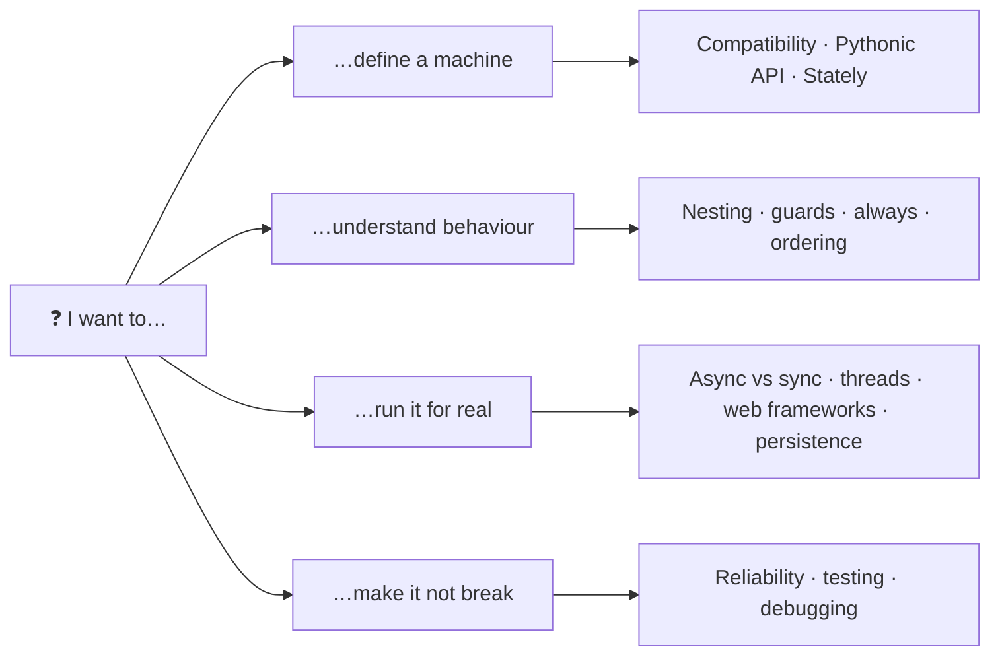

# Frequently Asked Questions

Short answers with links to the deep dive. If your question isn't here, [open a discussion](https://github.com/basiltt/xstate-statemachine/discussions) — the good ones end up on this page.



## 🧭 General

### Is this compatible with XState v5?

Yes. This library is compatible with XState JSON format and supports most XState v4/v5 features, including:

- Hierarchical (nested) states
- Parallel states
- `invoke` (services / actors)
- Guards (`guard` and legacy `cond` keys)
- Actions (entry, exit, and transition actions)
- `after` (delayed transitions)
- `always` (eventless transitions)
- Final states
- Context (extended state)

The JSON format exported from [Stately.ai](https://stately.ai) works directly with this library.

---

### Can I use this without JSON?

Yes! The Pythonic API (introduced in v0.5.0) lets you define machines entirely in Python without any JSON. There are three styles:

**Class-based:**

```python
from xstate_statemachine import StateMachine, State, action, guard

class TrafficLight(StateMachine):
    green = State(initial=True)
    yellow = State()
    red = State()

    next_event = (
        green.to(yellow, event="NEXT")
        | yellow.to(red, event="NEXT")
        | red.to(green, event="NEXT")
    )

    @action
    def log_transition(self, interpreter, context, event, action_def):
        print(f"Transitioned on {event}")

machine = TrafficLight.create_machine()
```

**Builder:**

```python
from xstate_statemachine import MachineBuilder

machine = (
    MachineBuilder("trafficLight")
    .state("green", initial=True)
    .state("yellow")
    .state("red")
    .transition("green", "NEXT", "yellow")
    .transition("yellow", "NEXT", "red")
    .transition("red", "NEXT", "green")
    .build()
)
```

**Functional:**

```python
from xstate_statemachine import State, build_machine

green = State("green", initial=True)
yellow = State("yellow")
red = State("red")

green.to(yellow, event="NEXT")
yellow.to(red, event="NEXT")
red.to(green, event="NEXT")

machine = build_machine(id="trafficLight", states=[green, yellow, red])
```

---

### Which interpreter should I use?

| Use case | Interpreter | Why |
|----------|-------------|-----|
| Web servers (FastAPI, aiohttp) | `Interpreter` (async) | Works with async event loops |
| `invoke` with async services | `Interpreter` (async) | Services need `await` |
| `after` (delayed transitions) | Either | Async runs timers on the event loop; `SyncInterpreter` fires due timers on `send()`/`tick()` |
| CLI tools and scripts | `SyncInterpreter` | No event loop needed |
| Django/Flask views | `SyncInterpreter` | Synchronous web frameworks |
| Unit testing | `SyncInterpreter` | Deterministic, no timing issues |
| Simple prototyping | `SyncInterpreter` | Easier to reason about |

**Async example:**

<!-- doc-fragment -->
```python
import asyncio
from xstate_statemachine import create_machine, Interpreter

async def main():
    machine = create_machine(config)
    interp = Interpreter(machine)
    await interp.start()
    await interp.send("EVENT")
    await interp.stop()

asyncio.run(main())
```

> **Note:** By default `send()` enqueues the event and returns immediately once it's queued — it does not wait for the event's macrostep to finish processing. Pass `await interp.send("EVENT", wait=True)` if you need to block until that event has been fully processed before reading `interp.current_state_ids`.

**Sync example:**

<!-- doc-fragment -->
```python
from xstate_statemachine import create_machine, SyncInterpreter

machine = create_machine(config)
interp = SyncInterpreter(machine)
interp.start()
interp.send("EVENT")
interp.stop()
```

---

### Can I use the CLI with machines from Stately.ai?

Yes! Export your machine as JSON from [stately.ai](https://stately.ai), then generate Python code:

```bash
xsm gt your_machine.json --template pythonic-class --async-mode no
```

The CLI reads the XState JSON format that Stately.ai exports and generates complete, runnable Python code.

---

## 🔄 State Machine Behavior

### How do I handle nested state transitions?

Nested (hierarchical) states are fully supported. A transition defined on a parent state automatically catches events from all its children:

```json
{
  "id": "app",
  "initial": "auth",
  "states": {
    "auth": {
      "initial": "login",
      "states": {
        "login": {
          "on": { "SUBMIT": "verifying" }
        },
        "verifying": {
          "on": { "SUCCESS": "#app.dashboard" }
        }
      },
      "on": {
        "CANCEL": "auth.login"
      }
    },
    "dashboard": {}
  }
}
```

Use `#machineId.stateName` syntax for absolute state references, or relative names for sibling states.

---

### What happens if a guard raises an exception?

By default, if a guard function raises an exception, the transition is **blocked** (treated as if the guard returned `False`). This is controlled by the `guardErrorPolicy` config key, which accepts three values:

- `"false"` (default) — block the transition, same as a guard returning `False`
- `"true"` — allow the transition, as if the guard returned `True`
- `"raise"` — propagate the guard's exception to the caller. Only the raising guard's own candidate is dropped: a lower-priority, unguarded fallback in the same transition array still fires first, then the exception surfaces (0.9.0, #152). See [Reliability](../reliability/).

```python
def risky_guard(context, event):
    # If this raises, behavior depends on guardErrorPolicy
    return context["user"]["role"] == "admin"  # KeyError if "user" not in context

config = {
    "guardErrorPolicy": "raise",  # or "false" (default) / "true"
    # ...
}
```

Regardless of the chosen policy, any plugin's `on_guard_error` hook (e.g. `LoggingInspector`) fires so you can observe and log the failure. See [JSON Configuration](../json-config/) for the full list of config keys.

> **Tip:** Write guards defensively using `.get()` or try/except to avoid unexpected blocked transitions.

---

### Can I have multiple machines?

Yes! Create separate `MachineNode` instances and run them with separate interpreters:

<!-- doc-fragment -->
```python
from xstate_statemachine import create_machine, SyncInterpreter

machine_a = create_machine(config_a)
machine_b = create_machine(config_b)

interp_a = SyncInterpreter(machine_a)
interp_b = SyncInterpreter(machine_b)

interp_a.start()
interp_b.start()

interp_a.send("EVENT_FOR_A")
interp_b.send("EVENT_FOR_B")

interp_a.stop()
interp_b.stop()
```

For parent-child relationships (actor model), use `invoke` in the parent machine's config to spawn child machines.

---

### What's the difference between actions and guards?

| | Actions | Guards |
|---|---------|--------|
| **Purpose** | Execute side effects (mutate context, call APIs, log) | Decide whether a transition should happen |
| **Return value** | None (actions don't return) | `bool` — `True` to allow, `False` to block |
| **Parameters** | `(interpreter, context, event, action_def)` | `(context, event)` |
| **Async allowed?** | Yes (with `Interpreter`) | No — always synchronous |
| **When called** | After the transition is decided | Before the transition is decided |

---

### How do I check which state the machine is in?

Three ways, from loosest to strictest:

<!-- doc-fragment -->
```python
interp.value                           # "idle"  or  {"loggedIn": "dashboard"} for nested
interp.matches("loggedIn.dashboard")   # True/False — dotted path, works for nested states
interp.active_state_ids                # {"app.loggedIn", "app.loggedIn.dashboard"} — every active node
```

Prefer `matches()` in tests: it survives you renaming a parent state.

---

### How do I know if an event will do anything before I send it?

Use `interp.can("SUBMIT")`. It evaluates guards against the *current* context and returns `True` only if some transition would fire. This is what you want for enabling/disabling a button — no need to send and check what happened.

---

### What is an `always` (eventless) transition, and when does it fire?

An `always` transition has no event. It is evaluated the moment its state is entered and re-evaluated after every transition while that state is active. Use it for *decision* states:

<!-- doc-fragment -->
```python
"checking": {
    "always": [
        {"target": "approved", "guard": "isValid"},
        {"target": "rejected"},
    ]
}
```

Since 0.8.0 both interpreters settle `always` transitions *before* `send()` returns, so you never observe the intermediate state.

---

### In what order do actions run when a transition fires?

Exit actions of the source, then transition actions, then entry actions of the target — always, in every interpreter. For nested states the exits run innermost-first and the entries outermost-first. See [Actions → Execution Order](../actions/#execution-order).

---

### Two transitions match the same event — which one wins?

The **first one listed** whose guard passes. Order your transitions from most specific to least specific and put the unguarded fallback last. If a child and a parent both handle the event, the **child** wins (it is the more specific listener).

---

### What happens to an event nobody handles?

By default it is dropped silently (`onUnhandled: "ignore"`, the 0.7 behaviour). Set `"onUnhandled": "error"` to raise `UnhandledEventError`, or `"defer"` to buffer it and replay it once the machine reaches a state that can handle it. Whatever you pick, the `on_unhandled_event` plugin hook fires. See [Reliability](../reliability/).

---

### Can I send an event from inside an action?

Yes, but the event is **queued**, not processed immediately — the current transition finishes first. Use `interp.send(...)` from the action, or the declarative `send` / `raise_` action helpers in JSON. Never call `interp.stop()` from inside an action; return and let the caller do it.

Two things a self-send cannot do: **await its own receipt** — `await interp.send("GO", wait=True)` on the action's own task raises `ReentrantWaitError` (0.9.0) because the run loop cannot advance until the action returns; hand the receipt to another task (`asyncio.ensure_future(...)`) or send without `wait` — and **loop without a delay** forever. A zero-delay `raise` cycle is cut at `maxIterations` (`RunawayChainError`, recorded on `chain_trips` / `last_chain_error`); a `raise` with a `delay` is a timer and runs indefinitely, like `after`.

### Why did `last_error` go back to `None` after my machine tripped `maxIterations`?

Because `last_error` is a **per-step read**, not a latch: it describes the most recently processed event, and the next clean event resets it. For "has this machine ever discarded work" read `interp.chain_trips` (monotonic) or `interp.last_chain_error` (latched until `clear_chain_error()`), or implement `on_chain_budget_exceeded`. Both fields survive a snapshot round-trip.

---

## 🧪 Testing

### How do I test state machines?

Use `SyncInterpreter` in tests for synchronous, deterministic execution:

```python
import pytest
from xstate_statemachine import create_machine, SyncInterpreter, MachineLogic

def test_light_switch_toggle():
    """Test that toggling switches between on and off."""
    config = {
        "id": "lightSwitch",
        "initial": "off",
        "context": {"flips": 0},
        "states": {
            "off": {"on": {"TOGGLE": {"target": "on", "actions": "increment"}}},
            "on": {"on": {"TOGGLE": {"target": "off", "actions": "increment"}}}
        }
    }

    def increment(interpreter, context, event, action_def):
        context["flips"] += 1

    logic = MachineLogic(actions={"increment": increment})
    machine = create_machine(config, logic=logic)
    interp = SyncInterpreter(machine)
    interp.start()

    # Initially off
    assert "lightSwitch.off" in interp.current_state_ids

    # Toggle to on
    interp.send("TOGGLE")
    assert "lightSwitch.on" in interp.current_state_ids
    assert interp.context["flips"] == 1

    # Toggle back to off
    interp.send("TOGGLE")
    assert "lightSwitch.off" in interp.current_state_ids
    assert interp.context["flips"] == 2

    interp.stop()


def test_guard_blocks_transition():
    """Test that a guard can prevent a transition."""
    config = {
        "id": "door",
        "initial": "locked",
        "context": {"hasKey": False},
        "states": {
            "locked": {
                "on": {"UNLOCK": {"target": "unlocked", "guard": "hasKey"}}
            },
            "unlocked": {}
        }
    }

    def has_key(context, event):
        return context.get("hasKey", False)

    logic = MachineLogic(guards={"has_key": has_key})
    machine = create_machine(config, logic=logic)
    interp = SyncInterpreter(machine)
    interp.start()

    # Guard blocks: no key
    interp.send("UNLOCK")
    assert "door.locked" in interp.current_state_ids

    # Give the key and try again
    interp.context["hasKey"] = True
    interp.send("UNLOCK")
    assert "door.unlocked" in interp.current_state_ids

    interp.stop()
```

---

## 🛠️ Environment & Setup

### What Python versions are supported?

Python **3.9** through **3.14**, with full test coverage across all versions. The library uses no features beyond Python 3.9, ensuring broad compatibility.

---

### Are there any dependencies?

**No.** Zero external dependencies. The library is pure standard-library Python. You can install it in any environment without dependency conflicts.

---

### How do I persist machine state?

Use the snapshot system to serialize and restore interpreter state:

<!-- doc-fragment -->
```python
from xstate_statemachine import create_machine, SyncInterpreter
import json

# Save state
machine = create_machine(config)
interp = SyncInterpreter(machine)
interp.start()
interp.send("SOME_EVENT")

snapshot = interp.get_snapshot()
serialized = json.dumps(snapshot)

# ... store `serialized` in a database, file, or cache ...

# Restore state later — from_snapshot() is the only restore path
machine2 = create_machine(config)
interp2 = SyncInterpreter.from_snapshot(serialized, machine2)

print(interp2.current_state_ids)  # Restored to the saved state
```

---

### Can I use this with Django/Flask/FastAPI?

Yes!

**Django / Flask** (synchronous): Use `SyncInterpreter`:

```python
# Django view example
from xstate_statemachine import create_machine, SyncInterpreter

def checkout_view(request):
    machine = create_machine(checkout_config, logic=checkout_logic)
    interp = SyncInterpreter(machine)
    interp.start()
    interp.send("SUBMIT")
    return JsonResponse({"state": list(interp.current_state_ids)})
```

**FastAPI** (async): Use `Interpreter`:

<!-- doc-fragment -->
```python
# FastAPI endpoint example
from xstate_statemachine import create_machine, Interpreter

@app.post("/checkout")
async def checkout():
    machine = create_machine(checkout_config, logic=checkout_logic)
    interp = Interpreter(machine)
    await interp.start()
    await interp.send("SUBMIT")
    state = list(interp.current_state_ids)
    await interp.stop()
    return {"state": state}
```

---

### Is the interpreter thread-safe?

The async `Interpreter` is bound to its event loop: calling `send()` from another thread raises `WrongThreadError`. From a plain thread, use `interp.send_threadsafe("EVENT")`, which schedules delivery onto the loop. `SyncInterpreter.send()` has **no** internal lock — it runs the whole macrostep on the calling thread, and two threads calling `send()` on one interpreter concurrently will interleave macrosteps and race on `context`. Drive a sync machine from one thread (its `after` timers fire on that same thread, inside `send()`/`tick()`). The full contract is in [Production Characteristics — The `SyncInterpreter` threading contract](../production-characteristics/#3-the-syncinterpreter-threading-contract).

---

### Can I run thousands of machines at once?

Yes — the async `Interpreter` uses no threads, so 10,000 idle machines cost only memory. The constraint is **throughput**: every machine shares one asyncio loop, so total events/second is a fixed budget divided among active machines. Never block inside an action. See [Production Characteristics](../production-characteristics/) for measured numbers.

---

### What happens if a producer sends events faster than the machine can process them?

By default the inbox is unbounded. Set `max_queue_size` and an `OverflowPolicy` — `RAISE` (fail loudly), `BLOCK` (apply backpressure to the producer), or `DROP_NEWEST` (shed load and fire `on_event_dropped`). `interp.queue_depth` is observable either way.

---

### How do I use this with Pydantic or dataclasses for context?

Context is a plain `dict` because snapshots serialise it as JSON. The idiom is to validate at the boundary: build your Pydantic model, call `.model_dump()` into the initial context, and in actions mutate the dict. If you want typed access inside actions, wrap `ctx` in your model at the top of the action and write back the fields you changed.

---

## 🚀 Advanced

### How do I handle timeouts?

Use `after` (delayed transitions) with the async `Interpreter`:

```python
import asyncio
from xstate_statemachine import create_machine, Interpreter

config = {
    "id": "session",
    "initial": "active",
    "states": {
        "active": {
            "after": {
                "30000": "timed_out"
            },
            "on": { "ACTIVITY": "active" }
        },
        "timed_out": { "type": "final" }
    }
}

async def main():
    machine = create_machine(config)
    interp = Interpreter(machine)
    await interp.start()
    # Machine will transition to "timed_out" after 30 seconds of inactivity
    # Sending "ACTIVITY" resets the timer by re-entering "active"
```

> **Note:** `after` transitions work with both interpreters. With the async `Interpreter`, timers run on the event loop. With `SyncInterpreter` (since 0.8.0), timers are thread-free deadlines that fire when you call `send()` or `tick()` — call `tick()` periodically (or after each `send()`) so due timers fire even when no new event arrives. See [Delayed Transitions](../delayed-transitions/).

---

### Can I use this for UI state management?

Yes. State machines are excellent for managing UI state — form wizards, modals, navigation flows, loading states, etc. While this is a Python library (not JavaScript), it works well for:

- Server-side rendered UI state (Django templates, Jinja2)
- API-driven UI state (send state to frontend via JSON)
- Desktop apps (Tkinter, PyQt, etc.)

---

### How do I debug my state machine?

See the [Troubleshooting page](../troubleshooting/#debugging-tips) for detailed debugging strategies. Quick summary:

1. Attach `LoggingInspector` to see all transitions
2. Print `interp.current_state_ids` after each event
3. Print `interp.context` to verify data flow
4. Use `machine.to_mermaid()` to visualize the machine
5. Use `SyncInterpreter` for deterministic, step-by-step debugging

---

### Is there a visual editor?

Yes — [Stately.ai](https://stately.ai) is the visual editor for XState machines. Design your machine visually, export as JSON, and use the `xsm` CLI to generate Python code:

```bash
xsm gt exported_machine.json --template pythonic-class --with-tests --with-types
xsm inspect exported_machine.json     # tree, transitions, logic to implement
xsm simulate exported_machine.json    # run it live before writing any code
```

Or run `xsm` with no arguments on a terminal for the interactive launcher. See the [CLI Tool](../cli/) guide.

---

### What's the performance overhead?

The library is lightweight with minimal overhead:

- Machine creation: microseconds for typical configs
- Event processing: tens of microseconds per transition **on an unloaded loop**. Aggregate throughput across all async interpreters in a process is a fixed budget (~20k trivial events/s on a laptop, i.e. ~18 ev/s each at 1,000 machines) — see [Production Characteristics](../production-characteristics/).
- Memory: proportional to the number of states and transitions
- Background threads: the async `Interpreter` uses **none** — everything runs on your asyncio loop. The `SyncInterpreter` spawns none for `after` timers or delayed sends either (since 0.8.0 they fire on the caller's thread inside `send()`/`tick()`); only a non-blocking `spawn_<key>` child gets its own runner thread.

For most applications, the state machine overhead is negligible compared to your business logic (database queries, API calls, etc.). Blocking work inside an action, however, stalls **every** machine sharing the loop.

---

### Can I extend the library?

Yes. The plugin system allows you to hook into the interpreter lifecycle:

<!-- doc-fragment -->
```python
from xstate_statemachine import PluginBase

class MetricsPlugin(PluginBase):
    def on_transition(self, event, source, target):
        metrics.increment(f"transition.{source}.{target}")

    def on_event(self, event):
        metrics.increment(f"event.{event.type}")

interp.use(MetricsPlugin())
```

You can also subclass `MachineLogic` for custom logic loading, or create your own `LogicLoader` subclass for alternative discovery strategies.

---

### How do I test timers without waiting?

Inject a `SimulatedClock`. `after` delays and delayed sends run against it, so `clock.increment(30_000)` fires a 30-second timeout instantly and deterministically:

<!-- doc-fragment -->
```python
from xstate_statemachine import SimulatedClock, SyncInterpreter

clock = SimulatedClock()
interp = SyncInterpreter(machine, clock=clock).start()
clock.increment(30_000)                 # 30 s pass in zero wall-clock time
assert interp.matches("expired")
```

---

### What if an action raises halfway through a transition?

Controlled by `actionErrorPolicy` on the machine: `"continue"` (0.7 default — the transition is committed with whatever mutations already happened), `"rollback"` (state *and* context restored, error reported on the `Receipt`), or `"fail"` (interpreter enters `error` status). `"rollback"` becomes the default in 1.0. See [Reliability](../reliability/).

---

### How do I get a diagram of my machine?

Every machine can export itself: `machine.to_mermaid()` or `machine.to_plantuml()`. Paste Mermaid output straight into GitHub Markdown or a docs page — this site renders them live. See [Diagram Export](../diagrams/).

---

### Can I catch a typo in an event name at the call site?

Yes: `Interpreter(machine, strict=True)` raises `UnknownEventError` for any event type the machine never declares, with a did-you-mean suggestion. Combine it with `event_schemas` to validate payload shape too.

---

### How do I wait for a machine to reach a state in a test?

Use the helpers instead of sleeping:

<!-- doc-fragment -->
```python
from xstate_statemachine import wait_for, wait_for_sync

await wait_for(interp, "loaded", timeout=2.0)      # async Interpreter
wait_for_sync(interp, "loaded", timeout=2.0)        # SyncInterpreter
```

Or send with `wait=True` and assert on the returned `Receipt`, which tells you the resulting state and any error in one object.

---

### Is this production-ready?

0.8.0 ("Fortify") is the release aimed squarely at that question: 34 silent-failure defects closed, every failure path now has a policy and a plugin hook, snapshots are versioned and drift-checked, and 31 audit reproduction scripts run in CI. The remaining 1.0 work is defaults flipping (`actionErrorPolicy → rollback`, `strict_targets` mandatory), not new surface. See [Reliability](../reliability/) and the [Changelog](../changelog/).
