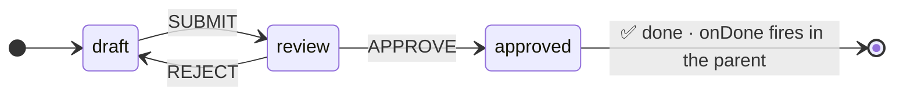
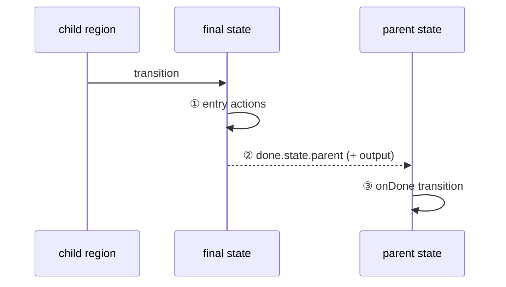

A final state is a **terminal** state — the machine (or a compound state region) has completed its work. No outgoing transitions are allowed. When a final state is entered, it signals **done** to its parent, enabling powerful composition patterns.

## 🏁 What Are Final States?



Final states represent the **end** of a workflow. Once a machine (or a nested region) enters a final state, it stops processing events for that branch. There are no outgoing transitions — the machine is finished.

Final states are the statechart equivalent of a function's `return` statement. They tell the parent "I'm done" and optionally pass data back.

## 📄 JSON: `"type": "final"`

```json
{
  "confirmation": {
    "type": "final"
  }
}
```

## 🐍 Pythonic: `State("done", final=True)`

```python
from xstate_statemachine import State

done = State("done", final=True)
```

> **Warning:** A final state cannot have outgoing transitions (`on`), child states (`states`), or be marked as `parallel`. Attempting any of these will raise an `InvalidConfigError`.

## 🛒 Basic Example: Checkout Flow

A simple checkout that progresses through three stages:

```json
{
  "id": "checkout",
  "initial": "cart",
  "states": {
    "cart":         {"on": {"CHECKOUT": "payment"}},
    "payment":      {"on": {"PAY": "confirmation"}},
    "confirmation": {"type": "final"}
  }
}
```

```python
from xstate_statemachine import create_machine, SyncInterpreter

config = {
    "id": "checkout",
    "initial": "cart",
    "states": {
        "cart":         {"on": {"CHECKOUT": "payment"}},
        "payment":      {"on": {"PAY": "confirmation"}},
        "confirmation": {"type": "final"}
    }
}

machine = create_machine(config)
interp = SyncInterpreter(machine).start()

print(interp.active_state_ids)
# {'checkout.cart'}

interp.send("CHECKOUT")
interp.send("PAY")
print(interp.active_state_ids)
# {'checkout.confirmation'}

# Sending further events has no effect — the machine is done
interp.send("CHECKOUT")
print(interp.active_state_ids)
# {'checkout.confirmation'}  — still in final state

interp.stop()
```

Once the machine reaches `confirmation`, it stays there. No event can move it out — that's the guarantee of a final state.

## 🎬 What Happens When a Final State Is Entered



When a final state is entered, several things happen:

1. **Entry actions** on the final state execute (if any are defined)
2. **The machine signals completion** — no further event processing occurs for this branch
3. **`done.state.*` event fires on the parent** — if the final state is inside a compound state, the parent receives a `DoneEvent`
4. **All `after` timers are cancelled** — any pending delayed transitions in the machine/region are cleaned up

```python
# Note: `DoneEvent` is not re-exported from the top-level package — import it
# from the `xstate_statemachine.events` submodule, as shown below.
from xstate_statemachine.events import DoneEvent

# When "confirmation" (a final state inside "checkout") is entered:
# Event type: "done.state.checkout.confirmation"
# This fires on the parent compound state
```

## 🪆 Final States in Compound States

The most powerful use of final states is inside **compound (hierarchical) states**. When a child reaches a final state, the parent receives a `done.state.*` event and can react via `onDone`:

```json
{
  "id": "workflow",
  "initial": "processing",
  "states": {
    "processing": {
      "initial": "step1",
      "states": {
        "step1": {
          "on": {"NEXT": "step2"}
        },
        "step2": {
          "on": {"NEXT": "step3"}
        },
        "step3": {
          "on": {"FINISH": "complete"}
        },
        "complete": {
          "type": "final"
        }
      },
      "onDone": "finished"
    },
    "finished": {
      "type": "final"
    }
  }
}
```

```python
from xstate_statemachine import create_machine, SyncInterpreter

config = {
    "id": "workflow",
    "initial": "processing",
    "states": {
        "processing": {
            "initial": "step1",
            "states": {
                "step1": {"on": {"NEXT": "step2"}},
                "step2": {"on": {"NEXT": "step3"}},
                "step3": {"on": {"FINISH": "complete"}},
                "complete": {"type": "final"}
            },
            "onDone": "finished"
        },
        "finished": {"type": "final"}
    }
}

machine = create_machine(config)
interp = SyncInterpreter(machine).start()

print(interp.active_state_ids)
# {'workflow.processing.step1'}

interp.send("NEXT")   # step1 → step2
interp.send("NEXT")   # step2 → step3
interp.send("FINISH") # step3 → complete (final)
                       # → triggers onDone → processing exits → finished

print(interp.active_state_ids)
# {'workflow.finished'}

interp.stop()
```

The flow:

1. `step3` receives `FINISH` → transitions to `complete`
2. `complete` is final → `done.state.workflow.processing.complete` fires
3. `processing` has `onDone: "finished"` → transitions to `finished`
4. `finished` is also final → the entire machine is done

> **Tip:** `onDone` is the key mechanism for composing sub-workflows. Each compound state can encapsulate a multi-step process, and the parent only needs to know "when it's done."

## 🎬 onDone with Actions

The `onDone` transition can include actions, just like any other transition:

```json
{
  "processing": {
    "initial": "validating",
    "states": {
      "validating": {
        "on": {"VALID": "complete"}
      },
      "complete": {"type": "final"}
    },
    "onDone": {
      "target": "finished",
      "actions": "logCompletion"
    }
  }
}
```

```python
from xstate_statemachine import create_machine, SyncInterpreter, MachineLogic

config = {
    "id": "withActions",
    "initial": "processing",
    "states": {
        "processing": {
            "initial": "validating",
            "states": {
                "validating": {"on": {"VALID": "complete"}},
                "complete": {"type": "final"}
            },
            "onDone": {
                "target": "finished",
                "actions": "logCompletion"
            }
        },
        "finished": {"type": "final"}
    }
}

class CompletionLogic(MachineLogic):
    def log_completion(self, interpreter, context, event, action_def):
        print("Processing complete! Moving to finished state.")

machine = create_machine(config, logic=CompletionLogic())
interp = SyncInterpreter(machine).start()

interp.send("VALID")
# Output: Processing complete! Moving to finished state.
print(interp.active_state_ids)
# {'withActions.finished'}

interp.stop()
```

## 🎛️ Final States in Parallel Regions

In a parallel state, each region can have its own final state. Important rules:

- A region reaching its final state **does not** stop other regions
- **All** regions must reach a final state for the parent's `onDone` to fire
- Other regions continue processing events normally until they also finish

```json
{
  "id": "parallelFinal",
  "initial": "processing",
  "states": {
    "processing": {
      "type": "parallel",
      "states": {
        "upload": {
          "initial": "uploading",
          "states": {
            "uploading": {"on": {"UPLOAD_DONE": "complete"}},
            "complete": {"type": "final"}
          }
        },
        "validate": {
          "initial": "checking",
          "states": {
            "checking": {"on": {"VALID": "complete"}},
            "complete": {"type": "final"}
          }
        }
      },
      "onDone": "finished"
    },
    "finished": {
      "type": "final"
    }
  }
}
```

```python
from xstate_statemachine import create_machine, SyncInterpreter

config = {
    "id": "parallelFinal",
    "initial": "processing",
    "states": {
        "processing": {
            "type": "parallel",
            "states": {
                "upload": {
                    "initial": "uploading",
                    "states": {
                        "uploading": {"on": {"UPLOAD_DONE": "complete"}},
                        "complete": {"type": "final"}
                    }
                },
                "validate": {
                    "initial": "checking",
                    "states": {
                        "checking": {"on": {"VALID": "complete"}},
                        "complete": {"type": "final"}
                    }
                }
            },
            "onDone": "finished"
        },
        "finished": {"type": "final"}
    }
}

machine = create_machine(config)
interp = SyncInterpreter(machine).start()

print(interp.active_state_ids)
# {'parallelFinal.processing.upload.uploading',
#  'parallelFinal.processing.validate.checking'}

# Upload finishes first — validate is still running
interp.send("UPLOAD_DONE")
print(interp.active_state_ids)
# {'parallelFinal.processing.upload.complete',
#  'parallelFinal.processing.validate.checking'}

# Now validate finishes — BOTH regions are final → onDone fires
interp.send("VALID")
print(interp.active_state_ids)
# {'parallelFinal.finished'}

interp.stop()
```

> **Note:** The `onDone` on `processing` only fires when **both** `upload` and `validate` have reached their final states. This is how parallel states enable "wait for all" patterns.

## 🔀 Multiple Final States: Success/Failure Patterns

A machine can have **multiple** final states to represent different outcomes:

```json
{
  "id": "payment",
  "initial": "processing",
  "states": {
    "processing": {
      "invoke": {
        "src": "chargeCard",
        "onDone": "success",
        "onError": "failed"
      }
    },
    "success": {"type": "final"},
    "failed":  {"type": "final"}
  }
}
```

```python
from xstate_statemachine import create_machine, SyncInterpreter, MachineLogic

config = {
    "id": "payment",
    "initial": "processing",
    "states": {
        "processing": {
            "invoke": {
                "src": "chargeCard",
                "onDone": "success",
                "onError": "failed"
            }
        },
        "success": {"type": "final"},
        "failed":  {"type": "final"}
    }
}

class PaymentLogic(MachineLogic):
    def charge_card(self, interpreter, context, event):
        # Simulate successful payment
        return {"transactionId": "TXN-9876"}

machine = create_machine(config, logic=PaymentLogic())
interp = SyncInterpreter(machine).start()

print(interp.active_state_ids)
# {'payment.success'}

# Determine which final state we ended in
if "payment.success" in interp.active_state_ids:
    print("Payment succeeded!")
elif "payment.failed" in interp.active_state_ids:
    print("Payment failed!")

interp.stop()
```

This pattern is useful when a parent needs to distinguish between different completion outcomes:

```json
{
  "checkout": {
    "initial": "paying",
    "states": {
      "paying": {
        "initial": "processing",
        "states": {
          "processing": {
            "invoke": {
              "src": "chargeCard",
              "onDone": "success",
              "onError": "failed"
            }
          },
          "success": {"type": "final"},
          "failed":  {"type": "final"}
        },
        "onDone": "confirmation"
      }
    },
    "confirmation": {}
  }
}
```

## 🐍 Pythonic Final States

### In StateMachine Class

```python
from xstate_statemachine import State, StateMachine, SyncInterpreter

class OrderMachine(StateMachine):
    machine_id = "order"

    pending    = State("pending", initial=True)
    processing = State("processing")
    completed  = State("completed", final=True)
    cancelled  = State("cancelled", final=True)

    start  = pending.to(processing, event="START")
    finish = processing.to(completed, event="COMPLETE")
    cancel = pending.to(cancelled, event="CANCEL")

machine = OrderMachine.create_machine()
interp = SyncInterpreter(machine).start()

interp.send("START")
interp.send("COMPLETE")
print(interp.active_state_ids)
# {'order.completed'}

interp.stop()
```

### In MachineBuilder

```python
from xstate_statemachine import MachineBuilder, SyncInterpreter

machine = (
    MachineBuilder("order")
    .state("pending",    initial=True)
    .state("processing")
    .state("completed",  final=True)
    .state("cancelled",  final=True)
    .transition("pending",    "START",    "processing")
    .transition("processing", "COMPLETE", "completed")
    .transition("pending",    "CANCEL",   "cancelled")
    .build()
)

interp = SyncInterpreter(machine).start()
interp.send("CANCEL")
print(interp.active_state_ids)
# {'order.cancelled'}

interp.stop()
```

### In Functional API

```python
from xstate_statemachine import State, build_machine, SyncInterpreter

pending    = State("pending", initial=True)
processing = State("processing")
completed  = State("completed", final=True)
cancelled  = State("cancelled", final=True)

t1 = pending.to(processing, event="START")
t2 = processing.to(completed, event="COMPLETE")
t3 = pending.to(cancelled, event="CANCEL")

machine = build_machine(
    id="order",
    states=[pending, processing, completed, cancelled],
    transitions=[t1, t2, t3],
)

interp = SyncInterpreter(machine).start()
interp.send("START")
interp.send("COMPLETE")
print(interp.active_state_ids)
# {'order.completed'}

interp.stop()
```

## 📦 Complete Example: Order Processing with Multiple Final Outcomes

An order processing system with three possible terminal states:

```python
from xstate_statemachine import create_machine, SyncInterpreter, MachineLogic

config = {
    "id": "orderProcess",
    "initial": "received",
    "context": {
        "orderId": None,
        "reason": None,
        "refundAmount": 0
    },
    "states": {
        "received": {
            "entry": "assignOrderId",
            "on": {
                "APPROVE": "fulfilling",
                "REJECT": {
                    "target": "cancelled",
                    "actions": "setRejectionReason"
                }
            }
        },
        "fulfilling": {
            "initial": "picking",
            "states": {
                "picking": {
                    "on": {
                        "PICKED": "packing",
                        "OUT_OF_STOCK": {
                            "target": "stockFailed",
                            "actions": "setStockFailure"
                        }
                    }
                },
                "packing": {
                    "on": {"PACKED": "shipping"}
                },
                "shipping": {
                    "invoke": {
                        "src": "shipOrder",
                        "onDone": "shipped",
                        "onError": {
                            "target": "shipFailed",
                            "actions": "setShipFailure"
                        }
                    }
                },
                "shipped": {
                    "type": "final"
                },
                "stockFailed": {
                    "type": "final"
                },
                "shipFailed": {
                    "type": "final"
                }
            },
            "onDone": "evaluating"
        },
        "evaluating": {
            "on": {
                "": [
                    {"target": "completed",
                     "guard": "wasShipped"},
                    {"target": "refunded",
                     "actions": "calculateRefund"}
                ]
            }
        },
        "completed": {
            "type": "final",
            "entry": "sendConfirmationEmail"
        },
        "cancelled": {
            "type": "final",
            "entry": "sendCancellationEmail"
        },
        "refunded": {
            "type": "final",
            "entry": "processRefund"
        }
    }
}

class OrderLogic(MachineLogic):
    def assign_order_id(self, interpreter, context, event, action_def):
        import random
        context["orderId"] = f"ORD-{random.randint(10000, 99999)}"
        print(f"Order created: {context['orderId']}")

    def set_rejection_reason(self, interpreter, context, event, action_def):
        context["reason"] = event.data.get("reason", "Unknown")

    def set_stock_failure(self, interpreter, context, event, action_def):
        context["reason"] = "Out of stock"

    def set_ship_failure(self, interpreter, context, event, action_def):
        context["reason"] = "Shipping failed"

    def ship_order(self, interpreter, context, event):
        print(f"Shipping order {context['orderId']}...")
        return {"trackingNumber": "TRACK-12345"}

    def was_shipped(self, context, event):
        return context.get("reason") is None

    def calculate_refund(self, interpreter, context, event, action_def):
        context["refundAmount"] = 49.99
        print(f"Refund calculated: ${context['refundAmount']}")

    def send_confirmation_email(self, interpreter, context, event, action_def):
        print(f"Order {context['orderId']} completed!")

    def send_cancellation_email(self, interpreter, context, event, action_def):
        print(f"Order {context['orderId']} cancelled: {context['reason']}")

    def process_refund(self, interpreter, context, event, action_def):
        print(f"Refund of ${context['refundAmount']} processed for {context['orderId']}")

machine = create_machine(config, logic=OrderLogic())

# Happy path: order ships successfully
interp = SyncInterpreter(machine).start()
interp.send("APPROVE")
interp.send("PICKED")
interp.send("PACKED")
# ship_order service runs → shipped (final) → onDone → evaluating → completed

print(interp.active_state_ids)
# {'orderProcess.completed'}

interp.stop()
```

## ✅ Complete Example: Multi-Step Approval Workflow

A document approval process that requires multiple sign-offs:

```python
from xstate_statemachine import State, StateMachine, SyncInterpreter, action, guard

class ApprovalWorkflow(StateMachine):
    machine_id = "approval"
    # `input` (passed to the interpreter) seeds the document; the rest
    # is fixed initial context.
    initial_context = {
        "document": None,
        "managerApproved": False,
        "directorApproved": False,
        "rejectedBy": None
    }

    # States
    draft = State("draft", initial=True, on={
        "SUBMIT": {"target": "review", "guard": "hasDocument"}
    })

    review = State("review", states=[
        State("managerReview", initial=True, on={
            "MANAGER_APPROVE": {
                "target": "directorReview",
                "actions": "recordManagerApproval"
            },
            "MANAGER_REJECT": {
                "target": "rejected",
                "actions": "recordRejection"
            }
        }),
        State("directorReview", on={
            "DIRECTOR_APPROVE": {
                "target": "approved",
                "actions": "recordDirectorApproval"
            },
            "DIRECTOR_REJECT": {
                "target": "rejected",
                "actions": "recordRejection"
            }
        }),
        State("approved", final=True),
        State("rejected", final=True),
    ], on_done="evaluating")

    evaluating = State("evaluating", on={
        "": [
            {"target": "published", "guard": "wasApproved"},
            {"target": "returned"}
        ]
    })

    published = State("published", final=True)
    returned  = State("returned", on={
        "REVISE": "draft"
    })

    # Guards
    @guard
    def has_document(self, context, event):
        return context.get("document") is not None or (
            context.get("input") or {}
        ).get("document") is not None

    @guard
    def was_approved(self, context, event):
        return (context.get("managerApproved")
                and context.get("directorApproved"))

    # Actions
    @action
    def record_manager_approval(self, interpreter, context, event, action_def):
        context["managerApproved"] = True
        print("Manager approved")

    @action
    def record_director_approval(self, interpreter, context, event, action_def):
        context["directorApproved"] = True
        print("Director approved")

    @action
    def record_rejection(self, interpreter, context, event, action_def):
        context["rejectedBy"] = event.data.get("by", "unknown")
        print(f"Rejected by: {context['rejectedBy']}")

machine = ApprovalWorkflow.create_machine()

# Test the approval flow. Initial context comes from the class; per-run
# data goes in through `input`, readable as `context["input"]`.
interp = SyncInterpreter(machine, input={"document": "Q4 Report"}).start()

print(interp.active_state_ids)
# {'approval.draft'}

interp.send("SUBMIT")
print(interp.active_state_ids)
# {'approval.review.managerReview'}

interp.send("MANAGER_APPROVE")
print(interp.active_state_ids)
# {'approval.review.directorReview'}

interp.send("DIRECTOR_APPROVE")
# directorReview → approved (final) → onDone → evaluating → published
print(interp.active_state_ids)
# {'approval.published'}

interp.stop()
```

This workflow demonstrates how final states compose with compound states:

- The `review` compound state contains two final states: `approved` and `rejected`
- When either is reached, `onDone` fires on `review`, transitioning to `evaluating`
- The `evaluating` state uses an eventless transition (always) with guards to route to the correct outcome
- `published` is the top-level final state for successful approvals
- `returned` allows the document to be revised and resubmitted

## 📤 Carrying Data Out with `output`

A final state can declare an `output` value — the data it hands back to whatever consumes the completion. `output` may be a literal (dict, string, number) or a callable of `({context, event})`, matching XState's dynamic-output form. Whichever final state is entered, its resolved `output` becomes the machine's `interp.output`.

This is the natural way to carry an outcome (a transaction ID, an error reason, a computed total) out of a machine, instead of inferring the outcome only by checking which state ID is active:

```python
from xstate_statemachine import create_machine, SyncInterpreter

config = {
    "id": "payment",
    "initial": "processing",
    "states": {
        "processing": {
            "on": {
                "SUCCEED": "success",
                "FAIL": "failed",
            }
        },
        "success": {
            "type": "final",
            # Callable output: resolved from context/event when entered.
            "output": lambda ev: {"transactionId": "TXN-001"},
        },
        "failed": {
            "type": "final",
            # Literal output also works.
            "output": {"reason": "declined"},
        },
    },
}

machine = create_machine(config)
interp = SyncInterpreter(machine).start()
interp.send("SUCCEED")

print(interp.status)
# 'done'
print(interp.output)
# {'transactionId': 'TXN-001'}
```

See also: [Context](/guide/context/).

## Detecting Completion Programmatically

Besides checking `active_state_ids` for a known final-state ID, the interpreter exposes completion as first-class, checkable state:

- **`interp.status`** — becomes `"done"` once the machine reaches its top-level final state (it starts as `"running"`).
- **`interp.output`** — the resolved `output` (see above) from the final state that was entered, or `None` if none was declared.
- **`await interp.wait_done()`** (async `Interpreter` only) — an `asyncio.Future` that resolves once the machine finishes.
- **`to_promise(interp)`** — a standalone helper that awaits completion and returns `interp.output`, mirroring XState's `toPromise(actor)`.

```python
import asyncio
from xstate_statemachine import create_machine, Interpreter, to_promise

config = {
    "id": "payment",
    "initial": "processing",
    "states": {
        "processing": {"on": {"SUCCEED": "success"}},
        "success": {"type": "final", "output": {"transactionId": "TXN-001"}},
    },
}

async def main():
    machine = create_machine(config)
    interp = await Interpreter(machine).start()
    interp.send("SUCCEED")

    output = await to_promise(interp)
    print(interp.status, output)
    # done {'transactionId': 'TXN-001'}

asyncio.run(main())
```

See also: [Interpreters](/guide/interpreters/), [Services & Invoke](/guide/services/).
