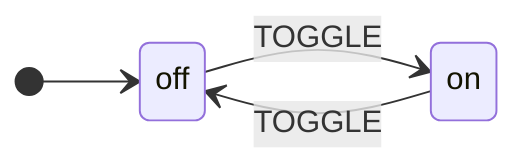

## 📦 Installation

Install from PyPI with pip:

```bash
pip install xstate-statemachine
```

Or with [uv](https://docs.astral.sh/uv/) for faster installs:

```bash
uv pip install xstate-statemachine
```

Or with [Poetry](https://python-poetry.org/):

```bash
poetry add xstate-statemachine
```

## Verify Your Installation

```bash
xsm --version
# Output: xsm 0.10.0
```

You can also verify the CLI tool is available:

```bash
xsm --help
```

Expected output:

```
usage: xsm [-h] [-v]
           {generate-template,gt,list-templates,lt,validate,val,info} ...

XState-StateMachine CLI — Generate Python code from XState JSON.

positional arguments:
  {generate-template,gt,list-templates,lt,validate,val,info}
                        Available commands
    generate-template (gt)
                        Generate Python code from an XState JSON file.
    list-templates (lt)
                        List all available code generation templates.
    validate (val)      Validate an XState JSON config file.
    info                Show library version, Python version, and feature
                        summary.

options:
  -h, --help            show this help message and exit
  -v, --version         Show program's version number and exit.
```

## 📋 Requirements

| Requirement | Details |
|-------------|---------|
| **Python** | 3.9 – 3.14 (CI runs every version on Linux, macOS and Windows) |
| **Dependencies** | None — zero external dependencies beyond the standard library |
| **OS** | Windows, macOS, Linux |

> **Tip:** The library uses only the Python standard library, so it works anywhere Python runs — containers, serverless, embedded systems, CI pipelines.

## ⚡ Your First State Machine (60 seconds)

Let's build a simple toggle switch. It has two states (`off` and `on`) and toggles between them:



### Using JSON (XState-compatible):

```python
from xstate_statemachine import create_machine, SyncInterpreter

config = {
    "id": "toggle",
    "initial": "off",
    "states": {
        "off": {"on": {"TOGGLE": "on"}},
        "on":  {"on": {"TOGGLE": "off"}}
    }
}

machine = create_machine(config)
interp = SyncInterpreter(machine).start()

print(interp.active_state_ids)
# {'toggle.off'}

interp.send("TOGGLE")
print(interp.active_state_ids)
# {'toggle.on'}

interp.send("TOGGLE")
print(interp.active_state_ids)
# {'toggle.off'}

interp.stop()
```

### Using Pure Python (Pythonic API):

```python
from xstate_statemachine import State, build_machine, SyncInterpreter

off = State("off", initial=True, on={"TOGGLE": "on"})
on  = State("on",  on={"TOGGLE": "off"})

machine = build_machine(id="toggle", states=[off, on])
interp = SyncInterpreter(machine).start()

interp.send("TOGGLE")
print(interp.active_state_ids)
# {'toggle.on'}

interp.stop()
```

### Using Class-Based Style:

```python
from xstate_statemachine import State, StateMachine, SyncInterpreter

class ToggleMachine(StateMachine):
    machine_id = "toggle"

    off = State("off", initial=True, on={"TOGGLE": "on"})
    on  = State("on",  on={"TOGGLE": "off"})

machine = ToggleMachine.create_machine()
interp = SyncInterpreter(machine).start()

interp.send("TOGGLE")
print(interp.active_state_ids)
# {'toggle.on'}

interp.stop()
```

### Using Builder Style:

```python
from xstate_statemachine import MachineBuilder, SyncInterpreter

machine = (
    MachineBuilder("toggle")
    .state("off", initial=True, on={"TOGGLE": "on"})
    .state("on", on={"TOGGLE": "off"})
    .build()
)

interp = SyncInterpreter(machine).start()
interp.send("TOGGLE")
print(interp.active_state_ids)
# {'toggle.on'}

interp.stop()
```

> **All four approaches produce identical runtime behavior.** Choose the style that fits your project.

## 2️⃣ Your Second Machine: With Actions and Context

Let's add logic — a counter that tracks how many times the switch is toggled:

```python
from xstate_statemachine import create_machine, SyncInterpreter, MachineLogic

config = {
    "id": "counter",
    "initial": "active",
    "context": {"count": 0},
    "states": {
        "active": {
            "on": {
                "INCREMENT": {"actions": "increment"},
                "DECREMENT": {"actions": "decrement"},
                "RESET": {"actions": "reset"}
            }
        }
    }
}

class CounterLogic(MachineLogic):
    def increment(self, interpreter, context, event, action_def):
        context["count"] += 1

    def decrement(self, interpreter, context, event, action_def):
        context["count"] = max(0, context["count"] - 1)

    def reset(self, interpreter, context, event, action_def):
        context["count"] = 0

machine = create_machine(config, logic=CounterLogic())
interp = SyncInterpreter(machine).start()

interp.send("INCREMENT")
interp.send("INCREMENT")
interp.send("INCREMENT")
print(interp.context["count"])
# 3

interp.send("DECREMENT")
print(interp.context["count"])
# 2

interp.send("RESET")
print(interp.context["count"])
# 0

interp.stop()
```

## 📦 What's Included

| Component | Description |
|-----------|-------------|
| **Runtime Library** | Async (`Interpreter`) + Sync (`SyncInterpreter`) engines for executing state machines |
| **Pythonic API** | Define machines in pure Python — class-based, builder, or functional style |
| **JSON Support** | Full XState JSON format compatibility for cross-platform machine definitions |
| **CLI Tool (`xsm`)** | Generate production-ready Python from XState JSON with type hints and docstrings |
| **Plugin System** | Observable hooks for logging, metrics, debugging, and custom extensions |
| **Snapshot System** | Save and restore machine state for persistence, testing, and time-travel debugging |
| **Diagram Export** | Generate Mermaid or PlantUML diagrams from machine definitions |

## 🗺️ Feature Overview

Here's what XState-StateMachine supports — every feature you'd expect from a production statechart library:

### States & Transitions
- **Simple states** — flat state machines with event-driven transitions
- **Hierarchical (nested) states** — compound parent states with child substates
- **Parallel states** — orthogonal regions running concurrently
- **Final states** — terminal states that emit `done` events
- **Self-transitions** — re-enter the same state (with timer reset)

### Logic & Data
- **Context** — mutable data attached to the machine instance
- **Guards** — conditional transitions (`guard` or `cond` key)
- **Actions** — side effects on transitions (`entry`, `exit`, `on` transition)
- **Services / Invoke** — async or sync service calls with `onDone`/`onError`
- **Delayed transitions** — timer-based auto-transitions (`after`)
- **Eventless transitions** — auto-transitions based on conditions (`always`)

### Architecture
- **Actor Model** — spawn independent child machines with `spawn_` prefix
- **Plugins** — observable hooks for logging, metrics, custom extensions
- **Snapshots** — serialize/restore machine state with `take_snapshot()` / `restore_snapshot()`
- **Dual interpreters** — `Interpreter` (async) and `SyncInterpreter` (sync)

### Developer Tools
- **CLI tool** — generate (8 templates), inspect, simulate, diagram and document machines from XState JSON; interactive launcher on a terminal
- **Diagram export** — Mermaid, PlantUML
- **LoggingInspector** plugin — built-in state transition logging
- **Zero dependencies** — pure Python standard library

### Production & Safety
- **Bounded inbox** — `max_queue_size` with `OverflowPolicy.RAISE` / `BLOCK` / `DROP_NEWEST` caps how many events an interpreter will buffer. See [Interpreters](../interpreters/).
- **Strict mode** — `strict=True` (and `strictTargets`) rejects unknown events or transition targets instead of silently ignoring them. See [Interpreters](../interpreters/).
- **Unhandled-event policy** — `onUnhandled: "defer" | "error"` controls what happens to events the machine never declared a handler for. See [Core Concepts](../core-concepts/).
- **Action/guard error policy** — `actionErrorPolicy` and `guardErrorPolicy` (e.g. `"rollback"`) control how a raising action or guard affects the in-flight transition. See [Actions](../actions/#error-handling-in-actions).
- **Injectable Clock** — `Clock`, `RealClock`, and `SimulatedClock` let `after` timers and delayed sends run deterministically in tests. See [Delayed Transitions](../delayed-transitions/).

## 🧑‍💻 Development Installation

To contribute or work from source:

```bash
git clone https://github.com/basiltt/xstate-statemachine.git
cd xstate-statemachine
uv pip install -e . --group dev --group lint --group test
```

This installs the library in editable mode with all development, linting, and testing dependencies.

### Running the Tests

```bash
# Run all tests
python -m pytest tests/ -v

# Run specific test module
python -m pytest tests/tests_pythonic/ -v

# Run with coverage
python -m pytest tests/ --cov=xstate_statemachine --cov-report=html
```

### 🗂️ Project Structure

```
xstate-statemachine/
├── src/xstate_statemachine/
│   ├── __init__.py          # Public API exports
│   ├── machine.py           # MachineNode, state tree, config parser
│   ├── interpreter.py       # Interpreter (async) + SyncInterpreter
│   ├── pythonic.py           # State, StateMachine, MachineBuilder, decorators
│   ├── snapshot.py           # Snapshot save/restore
│   ├── plugin.py             # Plugin base + LoggingInspector
│   ├── diagram_exporter.py   # Mermaid, PlantUML export
│   └── cli/                  # xsm: generate / inspect / simulate / diagram / docs
│       ├── __main__.py       # Entry point (xsm command)
│       ├── extractor.py      # JSON feature extraction
│       └── strategies/       # 5 code generation templates
├── tests/                    # 3,702 tests, 93% coverage
├── docs/                     # GitHub Pages documentation
└── pyproject.toml
```

## ⬆️ Upgrading from Older Versions

```bash
pip install --upgrade xstate-statemachine
```

**From v0.8.0 to v0.9.0:**

A hardening release: every defect reported across eleven re-verification
rounds, each reproduced before it was fixed and pinned by a regression test.
It is a *minor* bump because a handful of changes are visible to code that
was correct on 0.8.0:

- **`Receipt` has five fields.** `send(wait=True)` now resolves a
  `Receipt(state_ids, changed, error, deferred, denied)`. A positional
  destructure written for 0.8.0 — `state_ids, changed, error = receipt` —
  raises `ValueError`; read fields by attribute.
- **`actionErrorPolicy: "fail"` leaves `status == "stopped"`**, not
  `"error"`, with the configuration cleared (#145). Check `"stopped"` or
  `interp.error is not None`; `"error"` remains the status for a service
  that died.
- **`guardErrorPolicy: "raise"` takes the fallback candidate** before
  surfacing the exception (#152), instead of aborting the whole array.
- **Awaiting your own receipt inside an action raises `ReentrantWaitError`**
  (#219) instead of deadlocking; the sync engine refuses the same shape.
  Send without `wait`, or await the receipt from outside the step.
- **Unknown config keys are reported at every level** (#216, #220) — a
  WARNING by default, `InvalidConfigError` under `strict_config=True`. A
  config carrying ad-hoc keys will start logging; move them under `meta`
  or an `x-` prefix.
- **`asyncio.run_coroutine_threadsafe(interp.send(...), loop)` is rejected**
  with `WrongThreadError` (the thread check runs before the coroutine is
  scheduled). Use `interp.send_threadsafe(...)` from other threads — this was
  already the documented path in 0.8.0.
- **Snapshot layout is v3.** Older blobs upcast transparently on load; a
  v3 blob does not load on 0.8.0.

Everything else is additive or a bug fix: new typed exceptions
(`RunawayChainError`, `ErrorEvent`, `SnapshotMidStepError`,
`SnapshotCorruptError`, `SnapshotSerializationError`, `InvalidEventError` —
also a `TypeError` — and `RootTargetError`), new plugin hooks
(`on_resolve_error`, `on_plugin_error`, `on_invocation_stranded`,
`on_chain_budget_exceeded`, `on_invalid_event`, `on_snapshot_error`),
`from_snapshot(clock=, restart_timers=, minimum_version=)`, sticky
`chain_trips` / `last_chain_error`, `Interpreter(service_pool_size=)`,
`MachineLogic(strict=True)` and redaction in `LoggingInspector`. See
[What's New in 0.10.0](#whats-new-in-0100), [0.9.0](#whats-new-in-090) and [0.9.1](#whats-new-in-091) below.

**From v0.5.x to v0.6.0:**

v0.6.0 closes the remaining XState v5 feature gaps and repairs a family of
correctness defects. Existing JSON configs and `MachineLogic` patterns keep
working — but three **behavioural** changes are worth knowing:

- **Action errors are contained.** If an action raises, the error is logged, the
  transition still completes, and the interpreter keeps running. `.send()` no
  longer re-raises.

  > ⚠️ **If you wrapped `send()` in `try/except`, that handler will no longer
  > fire.** The machine advances as though the action succeeded — so a checkout
  > machine can report `paid` when the charge actually raised. Two supported
  > replacements: catch the error *inside* the action and record it on
  > `context` (then guard on it), or register a plugin implementing
  > `on_action_error` to route failures to Sentry or a metric.
  >
  > In 0.5.0 the exception did propagate, but it also left the machine with an
  > **empty state configuration** — permanently dead while still reporting
  > `running`. The old handler was catching an already-corrupted machine.

  See [Actions](../actions/#error-handling-in-actions).
- **A stopped interpreter cannot be restarted.** `start()` after `stop()` now
  raises instead of silently returning a dead instance. Build a new interpreter,
  or restore one with `from_snapshot()`.
- **Ambiguous state keys are rejected.** A key containing `.` whose first
  segment is also a sibling state (e.g. `"x.y"` next to `"x"`) now raises at
  parse time, because both resolved to the same id. Unambiguous dotted keys such
  as `"v1.0"` still work.

New in this release: built-in [action creators](../actions/#built-in-action-creators-v060)
(`assign`, `choose`, `enqueue_actions`, `sendTo`, …), the
[actor system](../actors/#built-in-actor-actions-v060) with `systemId`, and the
[pure API and waiting helpers](../testing-and-pure-api/).

**From v0.4.x to v0.5.0:**

- The Pythonic API (`State`, `build_machine`, `StateMachine`, `MachineBuilder`) is new in v0.5.0. Existing JSON-based code continues to work unchanged.
- The `--style` CLI flag is deprecated in favor of `--template`. Both still work, but `--style` will be removed in a future release.
- All existing `create_machine()` and `MachineLogic` patterns remain fully supported.

**From v0.3.x to v0.4.x:**

- CLI tool introduced (`xsm generate-template`)
- `after` transition support added to `SyncInterpreter`
- No breaking changes

## ⚡ Async Support

If your project uses `asyncio`, you can use the async `Interpreter` instead:

```python
import asyncio
from xstate_statemachine import create_machine, Interpreter

config = {
    "id": "asyncToggle",
    "initial": "off",
    "states": {
        "off": {"on": {"TOGGLE": "on"}},
        "on":  {"on": {"TOGGLE": "off"}}
    }
}

async def main():
    machine = create_machine(config)
    interp = await Interpreter(machine).start()

    await interp.send("TOGGLE", wait=True)
    print(interp.active_state_ids)
    # {'asyncToggle.on'}

    await interp.stop()

asyncio.run(main())
```

> **Note:** Plain `await interp.send(...)` only awaits the event being
> *enqueued* — it does not wait for the macrostep to run. Pass
> `wait=True` to get back a `Receipt` that resolves once the transition
> has actually been processed (see [Receipts and priority sends](../interpreters/#receipts-and-priority-sends-39)).

> **Tip:** Use `SyncInterpreter` for scripts, CLI tools, and testing. Use `Interpreter` for web servers, event loops, and real-time applications.

## 🆕 What's New in 0.10.0

A CLI release. The library is unchanged (one additive `create_machine(...,
strict_config=)` overload), and `xsm` grows from a code generator into a
terminal toolkit — still with zero runtime dependencies:

- **Interactive launcher** — a bare `xsm` on a terminal opens a menu with
  recent files and a generate wizard that previews the module before writing.
- **`xsm inspect`** — state tree, transitions table, logic to implement and
  failure policies for a machine, built with the real library.
- **`xsm simulate`** — run a machine live on a `SimulatedClock`: pick enabled
  events, fire timers, flip guards, undo, print history and snapshots. The same
  engine replays `--events A,+500,B`, `--script file.json` and emits `--json`
  for CI.
- **`xsm diagram`** and **`xsm docs`** — Mermaid / PlantUML / ASCII diagrams and
  a Markdown reference page per machine, to stdout or files.
- **Companion templates** — `--with-tests` (a pytest module *recorded* from the
  engine), `--with-types` (`TypedDict` context, `Literal` events, typed stubs)
  and `--with-plugin` (a `PluginBase` wired for the hooks the chart can fire),
  alongside any primary template or on their own via `--template`.
- **`xsm validate`** now builds with `create_machine(strict_config=True)`,
  reports unreachable states and the library's own warnings, and has `--json`
  and `--lenient`.
- **Windows: `xsm` where pip's launcher is blocked** — machines governed by
  Application Control / AppLocker / Smart App Control refuse the unsigned
  `xsm.exe` pip generates. Run `python -m xstate_statemachine setup` once and
  `xsm` works normally (`--check`, `--undo`); `python -m xstate_statemachine …`
  always works.
- **Presentation** — truecolor/256/16-colour tiers, box-drawing, spinners and
  step lists on a terminal; deterministic plain text when piped or with
  `--plain`; `--no-color` / `NO_COLOR`, `--no-anim`, `--verbose`; `--json` on
  `validate`, `inspect`, `simulate`, `list-templates` and `info`.

See the **[CLI Tool](../cli/)** guide.

## 🆕 What's New in 0.9.1

A patch release from the thirteenth re-verification round. Nothing changes for
code that was correct on 0.9.0; two additions are worth knowing about:

- **`drain_pending()` now returns *every* pending event** on the async engine —
  the priority lane (fired timers, completions, `send_priority()`) as well as
  the inbox. Before, the documented drain → persist → `stop()` recipe silently
  lost the lane.
- **`on_interpreter_start` fires on a restored interpreter** too; read
  `interpreter.restored_from_snapshot` to tell resume from bring-up.
- **Restored `last_chain_error` is a `RestoredChainError`** — a
  `RunawayChainError` *and* a `RestoredError` — so an `isinstance` guard survives
  a restart. Malformed `chain_trips` / `last_chain_error` in a blob are
  `SnapshotCorruptError`.
- **`interpreter.dropped_receipts`** and the `on_receipt_dropped` hook are the
  gateable form of the dropped-receipt `RuntimeWarning`.
- **`SyncInterpreter(max_queue_size=, overflow_policy=)`** are accepted for
  parity and refused with a `ValueError` — the sync engine has no inbox to bound.
- **`re_mint(event, **fields)`** patches a field of an engine-minted event and
  keeps its provenance; `_replace` remains a one-way demotion.
- **`benchmarks/production_characteristics.py --json`** for CI gates; releases
  carry PEP 740 attestations (`pypi-attestations verify pypi …`).

## 🆕 What's New in 0.9.0

The 0.9.0 release is the follow-through on 0.8.0: every finding from eleven
independent re-verification rounds fixed, with the engines brought
into lock-step. Highlights:

- **[Engine parity](../interpreters/)** &mdash; the async `Interpreter` and
  `SyncInterpreter` now agree on when a plain-sync `invoke` completes, what an
  unhandled child failure does to the parent, which hooks fire on `stop()`
  and on a send to a stopped machine, and the init `on_transition` record.
- **[Snapshots you can trust](../snapshots/)** &mdash; a mid-macrostep snapshot
  is refused (`SnapshotMidStepError`) instead of persisting an inert machine;
  fired timers are persisted; malformed blobs raise `SnapshotCorruptError`;
  `from_snapshot(clock=, restart_timers=)` and `has_dormant_timers`.
- **[Provenance, not names](../core-concepts/#engine-events-and-provenance)**
  &mdash; wildcards, `onUnhandled` and `strict` decide "engine event" by who
  minted it (`is_system_event`), and the marker survives `deepcopy`, `pickle`
  and `wait=True`.
- **[Observability](../plugins/)** &mdash; `on_event_dropped` fires on both
  engines for every loss site with a typed `reason`; new `on_resolve_error`
  and `on_plugin_error`; `LoggingInspector` redacts secrets by default.
- **[Build-time safety](../troubleshooting/)** &mdash; a transition to the
  machine root, a self-referential config, an ambiguous bare `stateIn` and a
  non-`str` event are all typed errors now.
- **`maxIterations` is a chain budget** &mdash; an external producer sending
  during a slow step is never charged to it, and engine completions are never
  cut by it.

See the [full changelog](../changelog/) for every change in this release.

## 🆕 What's New in 0.8.0

The 0.8.0 release closes a production-adoption audit spanning 34 defects
across three waves. Highlights:

- **[Production Hardened](../production-characteristics/)** &mdash;
  `actionErrorPolicy: "rollback"` restores configuration and context after a
  raising action instead of committing a half-built transition.
- **[Unhandled events, on purpose](../core-concepts/)** &mdash; `onUnhandled:
  "defer" | "error"` replaces silently dropping events the machine never
  declared a handler for.
- **[Strict mode](../interpreters/)** &mdash; `strict=True` rejects an
  unknown event at the `send()` call site, with a difflib suggestion, before
  it's ever queued.
- **[Bounded inbox](../interpreters/)** &mdash; `max_queue_size=` with
  `OverflowPolicy.RAISE` / `BLOCK` / `DROP_NEWEST` caps how many events an
  interpreter will buffer.
- **[Receipts and priority sends](../interpreters/#receipts-and-priority-sends-39)**
  &mdash; `send(wait=True)` resolves a `Receipt` once the macrostep runs, and
  `send(priority=True)` jumps the inbox &mdash; no more polling `active_state_ids`.
- **[Injectable Clock](../delayed-transitions/)** &mdash; `SimulatedClock`
  drives `after` timers and delayed sends deterministically in tests; no more
  sleeping in your test suite.
- **[Snapshot envelope v1](../snapshots/)** &mdash; persisted snapshots carry
  a version, machine id, and structural hash, and `from_snapshot()` can
  detect drift or restart services on restore.

See the [full changelog](../changelog/) for every change in this release.

## ➡️ Next Steps

Now that you're set up, explore the features:

- **[Quick Start](../quick-start/)** — Build 5 different machine styles in detail
- **[Core Concepts](../core-concepts/)** — States, events, transitions, guards, actions
- **[Pythonic API](../pythonic-api/)** — Define machines in pure Python (3 styles)
- **[JSON Configuration](../json-config/)** — XState JSON format reference
- **[Context](../context/)** — Working with machine data
- **[Guards](../guards/)** — Conditional transitions
- **[Actions](../actions/)** — Side effects and state mutations
- **[CLI Tool](../cli/)** — Generate, inspect, simulate and document machines from XState JSON
- **[Examples](../examples/)** — Real-world patterns and advanced usage
