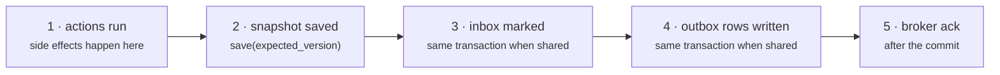

# Guarantees

This page is the **crash-consistency specification** for everything under `xstate_statemachine.persistence` and `patterns`. It is item 3 of the programme-wide security and operability baseline ([#303](https://github.com/basiltt/xstate-statemachine/issues/303), "X0.3"); every integration inherits it, and the tests named here enforce it. If a behaviour is not on this page, it is not promised.

## The order of operations

For one event handled inside `persisted()` (or by an integration built on it):

1. **Actions run.** Every side effect an action performs happens *before* anything is persisted.
2. **The snapshot is saved** with `expected_version`, so a concurrent writer produces `ConflictError` and nothing is written (`tests/persistence/test_store_contract.py::TestContract::test_expected_version_conflict`).
3. **The inbox is marked** with the real `Receipt`. When the inbox shares the store's backend (`SQLiteInbox(store)` on the same `SQLiteStore`, or `RedisInbox`/`RedisStore` on one prefix), the mark is written **inside the same transaction** as the save under `PessimisticLock`, so they commit or roll back together (`test_idempotency.py::TestWithPersisted::test_shared_backend_commits_mark_in_lock_transaction`). Otherwise: save, then mark.
4. **Outbox rows are written** (shipped, [#293](../integration-eda/#outbox)). `OutboxPlugin` with an `OutboxStore` that shares the store (`SQLiteOutboxStore(store)`, `SQLAlchemyOutboxStore(store)`) writes its rows right after the save, **inside the same transaction** under `PessimisticLock`, so a rollback drops them with the snapshot (`tests/eda/test_outbox.py::TestSQLiteTransactional::test_forced_failure_after_the_write_leaves_no_row`, `tests/contrib/sqlalchemy/test_sqlalchemy_outbox.py::TestSQLAlchemyOutbox::test_forced_rollback_leaves_no_row`). `OutboxRelay` publishes committed rows afterwards: at-least-once, never exactly-once.
5. **The broker delivery is acked** (shipped, [#293](../integration-eda/#inbound-dispatcher)). `InboundDispatcher` acks only after steps 1–4 committed; a failure requeues, and after `max_attempts` the envelope is dead-lettered and acked, so a poison message cannot loop (`tests/eda/test_dispatcher.py::TestPoison`).

## What is exactly-once and what is not

| | Guarantee | Why |
|:--|:--|:--|
| **The state transition** for an idempotency-keyed event | **Exactly once** | A duplicate is answered from the inbox before the machine sees it; a crash between save and mark is caught by the `processed_ids` ring inside the snapshot (below) |
| **Actions' external side effects** | **At least once** | An action that calls an API has run before the save; if the save fails or the process dies, the retry runs it again |
| **`after` timers** | **At least once, never early** | A timer fires no earlier than its deadline and no later than the next scanner tick; a crash between fire and save re-fires |
| **Optimistic retry** (`persisted_retry`, `lock.run`) | Actions may run up to **`retries + 1` times** per logical send | Each attempt reloads and re-applies the callable |

The honest consequence: **put side effects in services or behind an outbox, and make them idempotent.** The library cannot make an HTTP call un-happen.

## Crash windows, one by one

| Crash… | What happens on the next delivery | Test |
|:--|:--|:--|
| **before the save** | Nothing was persisted; the inbox claim is released; the retry is a first delivery and the actions run again | `test_idempotency.py::TestWithPersisted::test_crash_before_save_leaves_no_mark` |
| **between save and mark** (separate backends) | The inbox says *in flight*, the snapshot's `processed_ids` ring says *processed* — that contradiction *is* the crash window; the redelivery is answered as a duplicate and the inbox repaired | `…::test_crash_between_save_and_mark_caught_by_ring` |
| **after the mark** | A plain duplicate: the original receipt is returned | `…::test_crash_after_mark_is_plain_duplicate` |
| **after the save, with an inbox that did not survive** (`MemoryInbox`, a flushed cache) | The inbox is empty, but the snapshot's ring holds the key with its processing time and fingerprint: same payload → duplicate, different payload → 422; the inbox is repaired. Evidence older than `ttl_s` is a genuine expiry and is re-admitted | `test_battle_261_inbox_exactly_once.py::TestRealKill::test_memory_kill_after_save_caught_by_ring_evidence` |
| **after the claim, before the save** (inbox committed on its own: `SQLiteInbox(store)` under the default `OptimisticLock`, Redis, any separate inbox) | Nothing was saved, but a killed process cannot release its claim: the key answers **409 in flight until `ttl_s`**. Conservative — never a double run. Under `PessimisticLock` on a shared `SQLiteStore` the claim is inside the rolled-back transaction, so the retry is a first delivery | `…::TestRealKill::test_sqlite_kill_before_save`, `::test_pessimistic_kill_before_save_rolls_back` |
| **mid-write of a `FileStore` record** | The previous record is intact (temp file + fsync + atomic `os.replace`); no temp litter | `test_file_store.py::TestAtomicWrite::test_crash_before_replace_leaves_previous_intact` |
| **between a timer firing and the save** | The deadline is still in the store; the next scanner tick fires it again (at-least-once) | `test_durable_timers.py::TestScanner::test_end_to_end_wakes_only_due_and_is_idempotent` |
| **a pessimistic lock expires under a slow holder** (Redis) | The late saver gets `ConflictError`; the first writer's data wins — never a lost update | `tests/contrib/redis/test_redis_specific.py::TestFencing::test_expired_lock_yields_conflict_not_lost_update` |

The **primary** proof of every concurrency claim is a deterministic fault-injection interleaving (`FaultyStore` forcing a conflict on attempt *k*; `_before_replace_hook` simulating a crash mid-write); the 16-thread stress tests are smoke tests run small in PRs and at full size on demand (`XSM_STRESS_SAVES=200`).

## The `processed_ids` ring

`IdempotencyPlugin` keeps the last **64** processed `scope|key` pairs inside `context["__xsm_processed_ids__"]`, so they travel *with* the snapshot, plus `context["__xsm_processed_at__"]` — for the same ids, the wall-clock time they were processed and their fingerprint. A key that is in flight per the inbox but present in the ring was processed by a save that committed before the mark did; a key the inbox has *lost* but the ring saw within `ttl_s` was processed too. The ring is a crash-window net, not a second inbox: it does not override a key whose TTL simply expired (`test_idempotency.py::TestPluginSync::test_ttl_expiry_readmits`, `TestWithPersisted::test_ring_is_bounded`, `test_battle_261_inbox_exactly_once.py::TestRingVsInbox`). A key evicted from the ring *and* lost from a non-durable inbox is a first delivery again — use a durable inbox.

The plugin's interception hook is **fail-closed**: a payload that cannot be fingerprinted, an inbox that raises, or a lock it cannot take refuses the event with `receipt.error` set (HTTP 500 / the error's own status) instead of admitting it unprotected; a cached receipt that no longer decodes is answered as a conservative duplicate. (Every other plugin hook stays fail-open.)

## Timers

A persisted `Deadline` is an **absolute wall-clock instant** (`due_at_wall`, from `interpreter.wall_now()`) tagged with the **state-entry generation** (`entry_seq`). The scanner takes the lock strategy first, re-reads the record, and wakes the machine only if a matured deadline with that generation is still there — a machine another worker already advanced is skipped, never double-fired (`test_durable_timers.py::TestScanner::test_stale_under_lock_is_skipped`). A deadline whose state no longer exists after a migration fails loudly rather than being dropped (`TestRestartModes::test_orphan_deadline_after_migration_fails_loudly`).

## Restore

A snapshot is refused, never half-applied, when: its layout version is newer (`SnapshotVersionError`); its machine id, structural hash or version label does not match and no migration path is registered (`SnapshotDriftError` / `MachineVersionMismatchError`); its shape is wrong or a state id does not exist in the machine (`SnapshotCorruptError` / `StateNotFoundError`); it exceeds `max_snapshot_bytes`. Migration steps are your code; the library validates their output against the new machine but cannot know your domain.

## What this page does not cover

Anything outside your process's control: Redis durability (AOF/RDB), filesystem semantics on network shares (`FileStore` and `SQLiteStore` document themselves as unsafe there), and clock skew between hosts (`DueTimerScanner(skew_tolerance_s=…)`).
