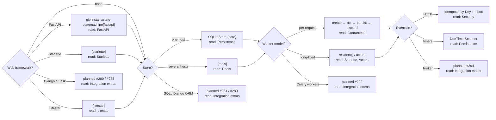

# Integrations

The core library has **zero runtime dependencies**, and that never changes. Everything that talks to a framework lives in optional packages under `xstate_statemachine.contrib`, installed one **pip extra** at a time (the full list, with status, is on [Integration extras](../integrations-extras/)). Importing an integration without its extra raises `MissingExtraError` (an `ImportError`) naming the exact `pip install` command.

This page is the entry point: pick your path, then do the fifteen-minute tutorial.

## Pick your path

Answer four questions — web framework, store, worker model, how events arrive — and read the pages at the leaf, in order.



| Leaf | Install | Read, in order |
|:--|:--|:--|
| FastAPI | `[fastapi]` | [FastAPI](../integration-fastapi/) → [Starlette](../integration-starlette/) (the registry it re-exports) → [Pydantic](../integration-pydantic/) |
| Starlette | `[starlette]` | [Starlette](../integration-starlette/) |
| Litestar | `[litestar]` | [Litestar](../integration-litestar/) |
| Django / Flask | — | planned, [#280](https://github.com/basiltt/xstate-statemachine/issues/280) / [#285](https://github.com/basiltt/xstate-statemachine/issues/285) — see [Integration extras](../integrations-extras/) |
| One host | core | [Persistence](../persistence/) → [Snapshots](../snapshots/) |
| Several hosts | `[redis]` | [Redis](../integration-redis/) → [Persistence](../persistence/) |
| SQLAlchemy / Django ORM | — | planned, [#284](https://github.com/basiltt/xstate-statemachine/issues/284) / [#280](https://github.com/basiltt/xstate-statemachine/issues/280) — see [Integration extras](../integrations-extras/) |
| Per request | — | [Guarantees](../guarantees/) → [Production characteristics](../production-characteristics/) |
| Long-lived | — | [Starlette](../integration-starlette/) (`resident()`) → [Actors](../actors/) |
| Celery workers | — | planned, [#292](https://github.com/basiltt/xstate-statemachine/issues/292) — see [Integration extras](../integrations-extras/) |
| HTTP | — | [Security](../security/) (principal, `Idempotency-Key`) |
| Timers | core | [Persistence](../persistence/) (`DueTimerScanner`) → [Delayed transitions](../delayed-transitions/) |
| Broker | — | planned, [#294](https://github.com/basiltt/xstate-statemachine/issues/294) — see [Integration extras](../integrations-extras/) |
| Observability, testing, LLM agents | — | planned, [#273](https://github.com/basiltt/xstate-statemachine/issues/273), [#268](https://github.com/basiltt/xstate-statemachine/issues/268), [#287](https://github.com/basiltt/xstate-statemachine/issues/287) — see [Integration extras](../integrations-extras/) |

## 15-minute tutorial

From a chart drawn in the Stately editor to a FastAPI service that runs on SQLite, deduplicates retries, and moves to Redis with one line. Every code block below runs in CI (the FastAPI and Redis blocks in the cells that install those extras).

```bash
pip install "xstate-statemachine[fastapi,redis]" httpx
```

Want the finished result instead? `xsm new --template fastapi my_service` scaffolds the complete [`fastapi_orders` example](https://github.com/basiltt/xstate-statemachine/tree/main/examples/integrations/fastapi_orders) with its tests (see [CLI](../cli/#new-project)).

### 1. Export the chart

Draw the chart in the [Stately editor](https://stately.ai/editor) and export it as JSON ([how, and what the export must contain](../stately-export/)). The tutorial writes the exported chart out directly at the top of step 2.

### 2. Inspect, validate and generate

```python
import json, os, sys, tempfile
from pathlib import Path

from xstate_statemachine.cli.__main__ import main as xsm

os.chdir(tempfile.mkdtemp())
chart = {
    "id": "order", "version": "1", "initial": "cart",
    "states": {
        "cart": {"on": {"CHECKOUT": "awaitingPayment"}},
        "awaitingPayment": {"on": {"PAY": "paid"},
                            "after": {"900000": "expired"}},
        "paid": {"type": "final"},
        "expired": {"type": "final"},
    },
}
Path("order.machine.json").write_text(json.dumps(chart, indent=2))

def run(*argv):                    # the same as typing `xsm ...` in a shell
    sys.argv = ["xsm", "--plain", *argv]
    try:
        xsm()
    except SystemExit as exc:
        assert not exc.code, (argv, exc.code)

run("validate", "order.machine.json")           # builds it with the real library
run("inspect", "order.machine.json")            # state tree, events, timers
run("gt", "order.machine.json", "-t", "pythonic-class", "--with-tests",
    "-o", "generated", "-f")
assert Path("generated/test_order.py").is_file()
run("gt", "--check", "order.machine.json", "-t", "pythonic-class",
    "--with-tests", "-o", "generated")          # CI: fails when stale
```

> `--with-api` (a `StatechartRouter` module) and `--with-models` (Pydantic event models) for `xsm gt` arrive with [#279](https://github.com/basiltt/xstate-statemachine/issues/279). Until then, write the models by hand as in step 3 — they are a few lines per event.

### 3. Run it as a FastAPI app on SQLite

Each request loads the order's snapshot, runs one interpreter, saves it with the version it loaded and discards the interpreter — so there is nothing to lose when a worker dies.

<!-- doc-requires: fastapi, httpx -->
```python
import tempfile
from pathlib import Path
from typing import Literal

from fastapi import FastAPI
from fastapi.testclient import TestClient

from xstate_statemachine import create_machine
from xstate_statemachine.contrib.fastapi import (
    StatechartRegistry, StatechartRouter, instrument_app,
)
from xstate_statemachine.contrib.pydantic import EventModel, events_union
from xstate_statemachine.persistence import SQLiteStore

class Checkout(EventModel):
    type: Literal["CHECKOUT"] = "CHECKOUT"

class Pay(EventModel):
    type: Literal["PAY"] = "PAY"
    card_token: str

order = create_machine(
    {"id": "order", "version": "1", "initial": "cart",
     "states": {"cart": {"on": {"CHECKOUT": "awaitingPayment"}},
                "awaitingPayment": {"on": {"PAY": "paid"}},
                "paid": {"type": "final"}}},
    event_schemas=events_union(Checkout, Pay),
)

def authorize(conn, *, name, key, event):
    return conn.headers.get("x-customer") is not None    # your auth here

store = SQLiteStore(str(Path(tempfile.mkdtemp()) / "orders.db"))
registry = StatechartRegistry(store)
registry.register("order", order, authorize=authorize)
app = FastAPI()
app.include_router(StatechartRouter(registry, "order", prefix="/orders"))
instrument_app(app, registry)

with TestClient(app) as client:
    ann = {"x-customer": "ann"}
    client.post("/orders/o1/send", json={"type": "CHECKOUT"}, headers=ann)
    r = client.post("/orders/o1/send", json={"type": "PAY", "card_token": "t"},
                    headers=ann)
    assert r.status_code == 200 and r.json()["state"] == "paid"
    assert client.get("/orders/o1", headers=ann).json()["state"] == "paid"
assert store.load("order.o1").version == 2      # two committed changes
```

### 4. Deduplicate retries with an inbox

A client that times out retries. Give the registry an **inbox** and a **principal**: every request then runs with an `IdempotencyPlugin` scoped to the caller, and a repeated `Idempotency-Key` returns the original receipt instead of acting twice. `SQLiteInbox(store)` shares the store's connection, so the mark commits with the snapshot.

<!-- doc-requires: fastapi, httpx -->
```python
import tempfile
from pathlib import Path

from fastapi import FastAPI
from fastapi.testclient import TestClient

from xstate_statemachine import MachineLogic, create_machine
from xstate_statemachine.contrib.fastapi import (
    StatechartRegistry, StatechartRouter, instrument_app,
)
from xstate_statemachine.persistence import SQLiteInbox, SQLiteStore

order = create_machine(
    {"id": "order", "initial": "open", "context": {"n": 0},
     "states": {"open": {"on": {"ADD": {"actions": "add"}}}}},
    logic=MachineLogic(actions={"add": lambda i, ctx, e, a: ctx.update(n=ctx["n"] + 1)}),
)
store = SQLiteStore(str(Path(tempfile.mkdtemp()) / "orders.db"))
registry = StatechartRegistry(
    store,
    inbox=SQLiteInbox(store),                           # ← the idempotency inbox
    principal=lambda conn: conn.headers["x-customer"],  # its scope (X0.2)
)
registry.register("order", order,
                  authorize=lambda conn, **kw: "x-customer" in conn.headers)
app = FastAPI()
app.include_router(StatechartRouter(registry, "order", prefix="/orders"))
instrument_app(app, registry)

with TestClient(app) as client:
    h = {"x-customer": "ann", "Idempotency-Key": "add-1"}
    first = client.post("/orders/o1/send", json={"type": "ADD"}, headers=h)
    again = client.post("/orders/o1/send", json={"type": "ADD"}, headers=h)
    assert first.json()["changed"] and again.json()["duplicate"] is True
assert store.load("order.o1").version == 1            # acted once
```

### 5. Switch the store to Redis

For several hosts, replace the two store lines. In production pass a URL — `RedisStore("redis://redis:6379/0", prefix="orders")` and `RedisInbox(...)` with the same arguments; here `fakeredis` stands in so the block runs anywhere. Nothing else changes.

<!-- doc-requires: fastapi, httpx, redis, fakeredis -->
```python
import fakeredis
from fastapi import FastAPI
from fastapi.testclient import TestClient

from xstate_statemachine import MachineLogic, create_machine
from xstate_statemachine.contrib.fastapi import (
    StatechartRegistry, StatechartRouter, instrument_app,
)
from xstate_statemachine.contrib.redis import RedisInbox, RedisStore

order = create_machine(
    {"id": "order", "initial": "open", "context": {"n": 0},
     "states": {"open": {"on": {"ADD": {"actions": "add"}}}}},
    logic=MachineLogic(actions={"add": lambda i, ctx, e, a: ctx.update(n=ctx["n"] + 1)}),
)
r = fakeredis.FakeRedis()                       # redis.Redis.from_url(...) in production
store = RedisStore(r, prefix="orders")
registry = StatechartRegistry(store, inbox=RedisInbox(r, prefix="orders"),
                              principal=lambda conn: conn.headers["x-customer"])
registry.register("order", order,
                  authorize=lambda conn, **kw: "x-customer" in conn.headers)
app = FastAPI()
app.include_router(StatechartRouter(registry, "order", prefix="/orders"))
instrument_app(app, registry)

with TestClient(app) as client:
    h = {"x-customer": "ann", "Idempotency-Key": "add-1"}
    for _ in range(3):
        client.post("/orders/o1/send", json={"type": "ADD"}, headers=h)
record = store.load("order.o1")
assert record.version == 1                      # three deliveries, one change
```

### 6. Run four workers

Because no worker holds an order in memory, the same app runs under `uvicorn app:app --workers 4` unchanged, on SQLite (one host) or Redis (many). Racing writers get one winner and a `409`, never a lost update. Start exactly one `python app.py --role scheduler` to wake persisted `after` timers. The example's `loadtest.py --workers 4 --requests 200` fires 200 concurrent payments at one order and checks that exactly one charge happened; the numbers are in the [FastAPI guide](../integration-fastapi/#multi-worker-deployments).

### 7. Coverage gate and live inspector — not shipped yet

- **State/transition coverage gate** (`pytest --xsm-coverage --xsm-fail-under-state-coverage=90`) arrives with [#270](https://github.com/basiltt/xstate-statemachine/issues/270).
- **Live inspector** (`xsm inspect --live`, the Stately Inspector protocol) arrives with [#274](https://github.com/basiltt/xstate-statemachine/issues/274). Today, `mount_inspector(app, registry, debug=True)` serves a development-only JSON view of live keys ([Starlette](../integration-starlette/)).

## What you get / what you don't

| You get | You do not get |
|:--|:--|
| Every committed transition is saved with an expected version; racing writers produce one winner and a `409`. | Exactly-once side effects. Delivery is **at-least-once**; pair it with the inbox and make actions idempotent. |
| `Idempotency-Key` replays return the stored receipt, scoped to the caller's principal. | A key shared across principals — one caller can never replay another's receipt. |
| `after` timers survive restarts as persisted deadlines, woken by one scanner. | Timers that fire *at* a deadline; they fire **not before** it, when the scanner next runs. |
| Validated event bodies and RFC 9457 problems; context is never exposed unless you serialise it. | Authentication. `authorize=` is required on every route and it is yours to write. |
| Zero runtime dependencies in the core, extras one at a time. | A framework integration before its issue ships — planned extras resolve but contain no code. |

The full crash-consistency specification is [Guarantees](../guarantees/); the trust model and each baseline item's enforcing test are in [Security](../security/).

## Where next

- **Recipes** — worked patterns (sagas, approvals, retries) arrive with [#308](https://github.com/basiltt/xstate-statemachine/issues/308); until then see [Patterns](../patterns/).
- **Every extra, with status** — [Integration extras](../integrations-extras/).
- **Design in the editor** — [Stately editor → Python](../stately-export/).
- **Comparisons and LLM agents** — planned with [#291](https://github.com/basiltt/xstate-statemachine/issues/291) and [#287](https://github.com/basiltt/xstate-statemachine/issues/287).
