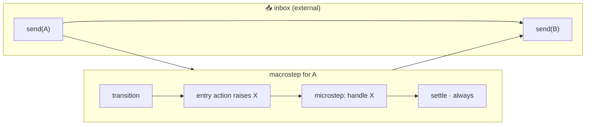
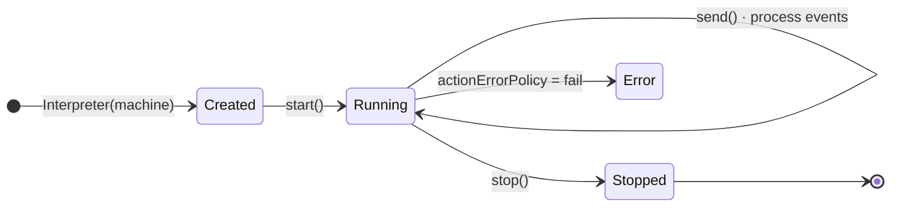

An **interpreter** is the runtime engine that executes a state machine. It processes events, evaluates guards, runs actions, invokes services, and manages state transitions. Without an interpreter, a machine definition is just data.

Think of it this way:

- A **machine** (`MachineNode`) is the _blueprint_ — it defines states, transitions, and rules.
- An **interpreter** is the _engine_ — it brings the blueprint to life and tracks the current state.

---

## 🎛️ What Is an Interpreter?

The interpreter manages the full lifecycle of a running state machine:

1. **Start** — enters the initial state (runs entry actions).
2. **Receive events** — matches events against transition rules.
3. **Evaluate guards** — checks boolean conditions on transitions.
4. **Execute actions** — runs side effects (entry, exit, and transition actions).
5. **Invoke services** — starts async/sync operations and handles their results.
6. **Track state** — maintains the current state(s) and context.
7. **Stop** — exits all active states (runs exit actions) and shuts down.

This library provides two interpreter implementations:

| Interpreter | Import | Event Loop | Use Case |
|-------------|--------|:----------:|----------|
| `Interpreter` | `from xstate_statemachine import Interpreter` | `asyncio` | Web servers, async frameworks, async services |
| `SyncInterpreter` | `from xstate_statemachine import SyncInterpreter` | None | Scripts, CLI tools, Django views, testing |

Both interpreters share the same API surface — the only difference is `async`/`await` vs. synchronous calls.

---

## ⚡ Async Interpreter

Use `Interpreter` for `asyncio`-based applications — web servers (FastAPI, aiohttp), async background workers, or any codebase built on `async`/`await`.

### Full Example

```python
import asyncio
from xstate_statemachine import create_machine, Interpreter, MachineLogic

config = {
    "id": "fetchMachine",
    "initial": "idle",
    "context": {"data": None, "error": None},
    "states": {
        "idle": {
            "on": {"FETCH": "loading"}
        },
        "loading": {
            "invoke": {
                "src": "fetchData",
                "onDone":  {"target": "success", "actions": "storeData"},
                "onError": {"target": "error",   "actions": "storeError"}
            }
        },
        "success": {
            "on": {"REFRESH": "loading", "RESET": "idle"}
        },
        "error": {
            "on": {"RETRY": "loading", "RESET": "idle"}
        }
    }
}

class FetchLogic(MachineLogic):
    async def fetch_data(self, interpreter, context, event):
        import aiohttp
        async with aiohttp.ClientSession() as session:
            resp = await session.get("https://api.example.com/data")
            return await resp.json()

    def store_data(self, interpreter, context, event, action_def):
        context["data"] = event.data

    def store_error(self, interpreter, context, event, action_def):
        context["error"] = str(event.data)


async def main():
    machine = create_machine(config, logic=FetchLogic())
    interpreter = Interpreter(machine)

    await interpreter.start()
    print(interpreter.active_state_ids)
    # {'fetchMachine.idle'}

    await interpreter.send("FETCH")
    # idle → loading → (service runs) → success or error

    print(interpreter.active_state_ids)
    print(interpreter.context)

    await interpreter.stop()

asyncio.run(main())
```

### Key Points

- `await interpreter.start()` — enters the initial state and returns the interpreter (for chaining).
- `await interpreter.send("EVENT")` — sends an event and processes the resulting transition(s).
- `await interpreter.stop()` — exits all active states and shuts down.
- Services defined with `async def` are awaited automatically.

### Use Cases

- **FastAPI / Starlette** route handlers
- **aiohttp** web servers
- **Celery** async tasks
- **WebSocket** connection state management
- Any `asyncio.run()` or `async def` context

---

## 🧵 Sync Interpreter

Use `SyncInterpreter` for synchronous code — scripts, CLI tools, Django views, Flask handlers, or test suites.

### Full Example

```python
from xstate_statemachine import create_machine, SyncInterpreter, MachineLogic

config = {
    "id": "toggleMachine",
    "initial": "inactive",
    "context": {"toggles": 0},
    "states": {
        "inactive": {
            "on": {"ACTIVATE": {"target": "active", "actions": "logToggle"}}
        },
        "active": {
            "on": {"DEACTIVATE": {"target": "inactive", "actions": "logToggle"}}
        }
    }
}

class ToggleLogic(MachineLogic):
    def log_toggle(self, interpreter, context, event, action_def):
        context["toggles"] += 1
        print(f"Toggle #{context['toggles']} fired")


machine = create_machine(config, logic=ToggleLogic())

# .start() is chainable — returns the interpreter
interp = SyncInterpreter(machine).start()

print(interp.active_state_ids)
# {'toggleMachine.inactive'}

interp.send("ACTIVATE")
print(interp.active_state_ids)
# Toggle #1 fired
# {'toggleMachine.active'}

interp.send("DEACTIVATE")
print(interp.active_state_ids)
# Toggle #2 fired
# {'toggleMachine.inactive'}

print(interp.context)
# {'toggles': 2}

interp.stop()
```

> 📝 **Note:** `active_state_ids` reflects the *settled* configuration. Reading
> it from inside an action (e.g. `logToggle` above) will not yet show the
> target state — the active-state set only updates once the transition's
> actions phase finishes. Read it after `.send()` returns if you need the
> post-transition value.

### Key Points

- `.start()` returns `self`, so you can chain: `SyncInterpreter(machine).start()`.
- `.send("EVENT")` processes the event synchronously and blocks until all actions complete.
- `.stop()` exits all active states and runs their exit actions.
- Services defined with `def` (not `async def`) are called directly.

### Use Cases

- **Scripts** and CLI tools
- **Django** views and middleware
- **Flask** route handlers
- **pytest** test suites
- Quick prototyping and REPL exploration

---

## 🔑 Key Properties and Methods

| Property / Method | Type | Description |
|-------------------|------|-------------|
| `.start()` | method | Initialize the interpreter and enter the initial state. Runs entry actions. Returns the interpreter (chainable). |
| `.stop()` | method | Exit all active states (runs exit actions) and shut down. |
| `.send(event, **kwargs)` | method | Send an event to the machine. Accepts string, dict, or `Event` object. Extra kwargs become event payload. |
| `.send_events(events)` | method | Send multiple events in sequence. Each event is processed before the next. |
| `.active_state_ids` | `set[str]` | The set of currently active state IDs (e.g., `{'machine.idle'}`). |
| `.context` | `dict` | The current machine context. Mutable — actions can modify this directly. |
| `.is_running` | `bool` | `True` after `.start()`, `False` after `.stop()`. |
| `.plugins` | `list` | List of attached plugin instances. Set before `.start()`. |
| `.value` | `str \| dict` | The active configuration in hierarchical form — see [Hierarchical State Value](#hierarchical-state-value). |
| `.pending_events` | `tuple`/`list` | Events accepted by `send()` but not yet processed, in FIFO order. |
| `.drain_pending()` | method | Remove and return every pending event without processing it. |
| `.wait_done()` | method | *(async `Interpreter` only)* A future resolved with `"done"`/`"error"` the instant the machine reaches a terminal status. |
| `.stop(drain=False, timeout=None)` | method | Stop the interpreter; `drain=True` processes the inbox to empty first (`timeout` bounds this on the async engine). |
| `.can(event)` | method | Dry-run check — reports whether sending `event` right now would trigger a transition (guards included), without any side effects. |
| `.on(event_type, listener)` | method | Registers a listener for events published via the `emit` action. Pass `"*"` to listen to every emitted event. Returns an unsubscribe callable. |
| `.subscribe(listener)` | method | Registers a listener invoked after every settled transition (mirrors XState's `actor.subscribe()`). Returns an unsubscribe callable. |
| `.system` | `ActorSystem` | The actor-system registry used to look up other actors by `system_id`, e.g. for `send_to`/`forward_to` targets. |
| `.tags` | `set[str]` | The union of tags declared by every currently active state. |
| `.has_tag(tag)` | method | `True` if any active state carries `tag`. |
| `.get_meta()` | method | Returns a `{state_id: meta_dict}` mapping merged from every active state's `meta`. |
| `.pending_invocations()` | method | Lists in-flight `invoke`s from the active configuration that have no live service backing them — most relevant right after `from_snapshot()`. |
| `.MAX_ACTION_DEPTH` | `int` | The recursion guard rail for self-triggered actions (default `50`) — raised when actions keep re-sending events into the same transition. |

### Checking Transitions, Tags, and Metadata

Beyond `.send()`, the interpreter exposes read-only helpers for querying the
active configuration without mutating it — handy for disabling a UI button
before an event is actually sent, or for driving UI purely off `tags`/`meta`
instead of hardcoding state IDs.

```python
from xstate_statemachine import create_machine, SyncInterpreter, MachineLogic

config = {
    "id": "door",
    "initial": "closed",
    "states": {
        "closed": {
            "tags": ["safe"],
            "meta": {"description": "Door is closed"},
            "on": {"OPEN": "open"},
        },
        "open": {
            "tags": ["unsafe"],
            "meta": {"description": "Door is open"},
            "on": {"CLOSE": "closed"},
        },
    },
}

machine = create_machine(config, logic=MachineLogic())
interp = SyncInterpreter(machine)

unsubscribe = interp.subscribe(
    lambda i: print(f"[subscriber] now in {i.active_state_ids}")
)

interp.start()

print("can OPEN?", interp.can("OPEN"))
# True
print("can CLOSE?", interp.can("CLOSE"))
# False
print("tags:", interp.tags)
# {'safe'}
print("has_tag safe?", interp.has_tag("safe"))
# True
print("meta:", interp.get_meta())
# {'door.closed': {'description': 'Door is closed'}}
print("pending_invocations:", interp.pending_invocations())
# []
print("MAX_ACTION_DEPTH:", interp.MAX_ACTION_DEPTH)
# 50

interp.send("OPEN")
# [subscriber] now in {'door.open'}

unsubscribe()
interp.stop()
```

See also [Plugins](../plugins/) for heavier-weight introspection (logging,
persistence hooks) and [Snapshots](../snapshots/) for `pending_invocations()`
in the context of `from_snapshot()`.

---

## 📨 Sending Events — All Formats

The `.send()` method accepts events in multiple formats. Use whichever is most convenient:

### String Shorthand

The simplest form — just the event name:

```python
interp.send("CLICK")
interp.send("SUBMIT")
interp.send("TIMER")
```

### With Payload (Keyword Arguments)

Pass extra data as keyword arguments. These become accessible in actions and guards via `event.payload`:

```python
interp.send("LOGIN", username="alice", password="secret")
interp.send("UPDATE_PROFILE", name="Alice", email="alice@example.com")
interp.send("ADD_ITEM", product_id=42, quantity=3)
```

### Event Object

Create an `Event` instance directly:

<!-- doc-fragment -->
```python
from xstate_statemachine import Event

event = Event(type="LOGIN", payload={"username": "alice", "password": "secret"})
interp.send(event)
```

### Dict Form

Pass a dict with a `type` key:

```python
interp.send({"type": "LOGIN", "username": "alice", "password": "secret"})
interp.send({"type": "ADD_ITEM", "product_id": 42, "quantity": 3})
```

### Multiple Events at Once

Send a list of events with `send_events()`. Each event is fully processed (including all resulting transitions, actions, and services) before the next one starts:

```python
interp.send_events(["STEP_1", "STEP_2", "STEP_3"])

# Equivalent to:
# interp.send("STEP_1")
# interp.send("STEP_2")
# interp.send("STEP_3")
```

You can mix formats in the list:

```python
interp.send_events([
    "START",
    {"type": "CONFIG", "mode": "advanced"},
    Event(type="READY", payload={}),
])
```

---

## 🪜 Event Ordering — Microsteps vs. Macrosteps (#36)



Each call to `send()` (or a delivered `after`/invocation event) starts a **macrostep**: the machine runs transitions, actions, and any events those actions `raise` on themselves, until it settles into a stable configuration with nothing left to do. SCXML calls a single one of those internal, self-raised events a **microstep** — and microsteps always finish before the next *external* event (the next `send()`) is looked at.

Concretely: if an entry action raises an event with the `raise` action creator, that event is **not** appended to the end of the inbox behind other callers' events. It goes to an internal queue that is drained to completion, in order, before the interpreter's run loop looks at the next externally sent event:

```python
config = {
    "id": "order",
    "initial": "a",
    "states": {
        "a": {
            "entry": [{"type": "raise", "params": {"event": "GO"}}],
            "on": {"GO": "b"},
        },
        "b": {},
    },
}

machine = create_machine(config)
interp = await Interpreter(machine).start()
# start() resolves as soon as the synthetic init transition into "a" is
# entered; the "GO" raised by a's entry action is enqueued for the
# background run loop and is not yet processed here.
print(interp.current_state_ids)  # {'order.a'}

await asyncio.sleep(0.05)  # let the run loop drain the raised "GO"
print(interp.current_state_ids)  # {'order.b'}
```

The same guarantee applies mid-run: `await interp.send("START", wait=True)` does not resolve until every event `START` transitively raised on itself has also been processed, so the `Receipt` (see below) reflects the machine's *final* settled state for that macrostep, not an intermediate one.

**What changed vs. 0.7**: prior releases queued a self-raised event onto the same inbox as external `send()` calls, so a `raise`d event could be interleaved with (or delayed behind) events sent concurrently from elsewhere. As of #36 the interpreter keeps a dedicated internal queue for self-raised events (`_internal_queue` on both engines), which is drained FIFO — internal events among themselves, in the order raised — ahead of the next external event. This makes ordering match the SCXML processing model and removes a class of races where an external event could be processed *between* two microsteps of the same macrostep.

A runaway chain of self-raised events (a machine that keeps raising to itself forever) is still bounded: exceeding the configured event limit for a single macrostep raises rather than hanging the run loop forever.

---

## 📦 Bounded Inbox and Overflow Policy (#38)

By default an interpreter's inbox (the queue `send()` appends to) is unbounded — nothing on a hot path is ever refused, but nothing stops it from growing without limit if producers outrun the consumer. Pass `max_queue_size` to `Interpreter` (or `SyncInterpreter`) to put a ceiling on it, and `overflow_policy` to choose what happens once that ceiling is hit:

<!-- doc-fragment -->
```python
from xstate_statemachine import create_machine, Interpreter, OverflowPolicy

interp = await Interpreter(
    machine,
    max_queue_size=100,
    overflow_policy=OverflowPolicy.RAISE,  # the default once a bound is set
).start()
```

- `max_queue_size` — `None` (default) keeps the historical unbounded inbox. Once set it must be `>= 1`; `0` or a negative value raises `InvalidConfigError` at construction time.
- `overflow_policy` — an `OverflowPolicy` member; ignored when `max_queue_size` is `None`.

### `OverflowPolicy` members

| Member | Behavior |
|--------|----------|
| `OverflowPolicy.RAISE` (default) | `send()` raises `QueueOverflowError` immediately when the inbox is full. The event is refused at the call site — the producer decides what to do next (retry, shed, alarm). |
| `OverflowPolicy.BLOCK` | `await send(...)` suspends the caller until the consumer frees a slot. Intended for trusted, in-process producers that can tolerate being slowed down rather than refused. |
| `OverflowPolicy.DROP_NEWEST` | The incoming event is discarded with a WARNING log line and a call to `PluginBase.on_event_dropped`. This is the only policy that silently loses an event, so it is never the default — opt in only where staleness is preferable to backlog (e.g. high-frequency telemetry). |

The priority lane (see `send(priority=True)` below) is **never** bounded — an urgent decision must always get through, even into a full inbox.

### `QueueOverflowError`

Raised by `send()` only when the inbox is bounded, full, and the policy is `RAISE`:

<!-- doc-fragment -->
```python
from xstate_statemachine import QueueOverflowError

try:
    interp.send("T")
except QueueOverflowError as exc:
    print(exc.interpreter_id, exc.depth, exc.maxsize)
```

- `interpreter_id` — which machine refused the event.
- `depth` — events queued at the moment of refusal.
- `maxsize` — the configured `max_queue_size`.

### Observing drops with `on_event_dropped`

Any plugin can implement `on_event_dropped(interpreter, event, reason)` to observe an event that never made it onto the inbox — whether because `DROP_NEWEST` shed it under backpressure, or because it was sent to a machine that is no longer running:

<!-- doc-fragment -->
```python
from xstate_statemachine import PluginBase

class DropWatcher(PluginBase):
    def on_event_dropped(self, interpreter, event, reason):
        print(f"dropped {event.type!r}: {reason}")

interp = Interpreter(
    machine,
    max_queue_size=1,
    overflow_policy=OverflowPolicy.DROP_NEWEST,
)
interp.use(DropWatcher())
await interp.start()
```

### Observing inbox depth

The `.queue_depth` property (and the underlying `.pending_events`) reports how many events are accepted but not yet processed, so a caller can watch backlog build up before it hits the bound:

```python
interp.send("T")
print(interp.queue_depth)     # 1
print(interp.pending_events)  # (Event(type='T', payload={}),)
```

---

## 🧾 Receipts and Priority Sends (#39)

### `send(wait=True)` and `Receipt`

By default `send()` returns as soon as the event is accepted onto the inbox — it does not wait for the event to actually be processed. Pass `wait=True` to get back a `Receipt` once the event's full macrostep (including any events it raised on itself, per #36 above) has run to completion:

```python
receipt = await interp.send("GO", wait=True)
print(receipt.state_ids)  # the leaf state IDs active when the macrostep settled
print(receipt.changed)    # True if this event caused a transition or context change
print(receipt.error)      # the exception raised while processing THIS event, or None
```

`Receipt` is a `NamedTuple` with three fields:

- `state_ids: FrozenSet[str]` — the active leaf state IDs when the instant processing this event finished.
- `changed: bool` — `True` if a transition was taken (configuration or context changed) *for this event*.
- `error: Optional[BaseException]` — set when an action raised or a target was unresolvable while processing this event; otherwise `None`. The machine can still be `running` when `error` is set (depending on `actionErrorPolicy`) — the receipt only reports whether *this caller's* event was processed cleanly.

`error` is also set (to `InterpreterStoppedError`) if the interpreter is stopped, refuses the event, or tears down before a pending receipt resolves, so a caller awaiting `wait=True` never hangs on shutdown.

### `send(priority=True)`

Pass `priority=True` to jump an event to the head of processing, ahead of every already-queued external event (priority events are FIFO among themselves), and exempt from `max_queue_size`:

```python
receipt = await interp.send("CHECK_RISK", priority=True, wait=True, order_id=oid)
if "risk.halted" in receipt.state_ids:
    ...
```

`priority=True` **reorders** events relative to ordinary sends — use it for decisions that must not wait behind routine traffic, not as a default.

### `send_priority()`

`send_priority()` is the discoverable spelling of `send(priority=True, wait=True)` — a priority send is almost always a question that needs an answer:

```python
receipt = await interp.send_priority("CHECK_RISK", order_id=oid)
```

`wait` defaults to `True` here (unlike plain `send()`); pass `wait=False` for a fire-and-forget event that only needs to jump the queue.

### Both engines

`SyncInterpreter.send(wait=True)` is supported for API symmetry with the async engine. The sync engine already processes an event's full macrostep inline before `send()` returns at all, so `wait=True` simply hands back the `Receipt` for the macrostep that already ran instead of `None`:

<!-- doc-fragment -->
```python
from xstate_statemachine import create_machine, SyncInterpreter

interp = SyncInterpreter(machine).start()
receipt = interp.send("GO", wait=True)
print(receipt.state_ids, receipt.changed, receipt.error)
```

`priority=True` is accepted by `SyncInterpreter.send()` for signature compatibility but has no effect: there is no backlog to jump, since the inbox is fully drained before every `send()` call returns.

---

## 📦 Event Payloads — Accessing Event Data

When you send an event with payload data, actions and guards can access it through the `event` parameter:

```python
from xstate_statemachine import (
    create_machine, SyncInterpreter, MachineLogic
)

config = {
    "id": "userMachine",
    "initial": "idle",
    "context": {"user": None},
    "states": {
        "idle": {
            "on": {"LOGIN": {"target": "loggedIn", "actions": "storeUser"}}
        },
        "loggedIn": {
            "on": {"LOGOUT": {"target": "idle", "actions": "clearUser"}}
        }
    }
}

class UserLogic(MachineLogic):
    def store_user(self, interpreter, context, event, action_def):
        # Access payload data from keyword arguments
        context["user"] = {
            "username": event.payload.get("username"),
            "role": event.payload.get("role", "user"),
        }
        print(f"Logged in as {context['user']['username']}")

    def clear_user(self, interpreter, context, event, action_def):
        context["user"] = None

machine = create_machine(config, logic=UserLogic())
interp = SyncInterpreter(machine).start()

interp.send("LOGIN", username="alice", role="admin")
# Output: Logged in as alice

print(interp.context["user"])
# {'username': 'alice', 'role': 'admin'}

interp.stop()
```

> **Note:** For service `onDone` events, the service's return value is available as `event.data`. For `onError` events, the raised exception is in `event.data`.

---

## 🔁 Interpreter Lifecycle

The interpreter follows a strict lifecycle:



### Step-by-Step

```python
from xstate_statemachine import MachineLogic, SyncInterpreter, create_machine

config = {
    "id": "lifecycle",
    "initial": "idle",
    "context": {},
    "states": {
        "idle":    {"on": {"GO": "running"}, "entry": "onEnterIdle"},
        "running": {"on": {"STOP": "done"},  "entry": "onEnterRunning"},
        "done":    {"type": "final",         "entry": "onEnterDone"}
    }
}

def log_entry(interpreter, context, event, action_def):
    print(f"entered via {action_def.type}")

machine = create_machine(
    config,
    logic=MachineLogic(
        actions={n: log_entry for n in ("onEnterIdle", "onEnterRunning", "onEnterDone")}
    ),
)

# 1. CREATE — machine is defined but not running
interp = SyncInterpreter(machine)
print(interp.is_running)        # False
print(interp.active_state_ids)  # set()

# 2. START — enters initial state, runs entry actions
interp.start()
print(interp.is_running)        # True
print(interp.active_state_ids)  # {'lifecycle.idle'}

# 3. SEND EVENTS — transitions occur
interp.send("GO")
print(interp.active_state_ids)  # {'lifecycle.running'}

interp.send("STOP")
print(interp.active_state_ids)  # {'lifecycle.done'}

# 4. STOP — exits all states, runs exit actions
interp.stop()
print(interp.is_running)        # False
```

### Idempotency and Safety

Both `start()` and `stop()` are safe to call multiple times:

- **`start()`** on an already-running interpreter is a no-op
- **`stop()`** on an already-stopped interpreter is a no-op
- **`send()`** on a stopped interpreter is silently ignored

```python
interp = SyncInterpreter(machine).start()
interp.start()  # No effect — already running

interp.stop()
interp.stop()  # No effect — already stopped

interp.send("EVENT")  # Silently ignored — interpreter is stopped
```

### Event Processing: Queue Semantics

The **async `Interpreter`** uses an internal event queue. When you call `await interp.send("EVENT")`, the event is placed on the queue and processed by a background event loop. This means:

- One `send()` call may trigger **multiple transitions** if the target state has `always` (eventless) transitions
- After processing an event, the interpreter automatically checks for and processes any matching `always` transitions until no more apply
- Timer-based `after` transitions are scheduled as background tasks

The **`SyncInterpreter`** processes events immediately and synchronously within the `send()` call — there is no background queue.

### Automatic (Eventless) Transitions

When a state has `always` transitions, the interpreter evaluates them immediately after entering the state — no event needed:

```python
config = {
    "id": "autoRouter",
    "initial": "checking",
    "context": {"role": "admin"},
    "states": {
        "checking": {
            "always": [
                {"target": "adminPanel", "guard": "isAdmin"},
                {"target": "userDashboard"}
            ]
        },
        "adminPanel": {},
        "userDashboard": {}
    }
}

class Logic(MachineLogic):
    def is_admin(self, context, event):
        return context.get("role") == "admin"

machine = create_machine(config, logic=Logic())
interp = SyncInterpreter(machine).start()

# No send() needed — the machine automatically transitions
# through 'checking' into 'adminPanel' via the always transition
print(interp.active_state_ids)
# {'autoRouter.adminPanel'}

interp.stop()
```

> **Note:** A single `send()` call can trigger a chain of transitions if states along the path have `always` transitions. The interpreter keeps processing until it reaches a stable state with no pending eventless transitions.

---

## 🪆 Hierarchical State Value

`interpreter.value` reports the active configuration in XState's hierarchical `value` form — a tree instead of the flat `current_state_ids` set:

- **Atomic** (or final) state → a plain string, e.g. `"red"`.
- **Compound** state → a single-key dict, e.g. `{"loggedIn": "idle"}`. The innermost level collapses to a string rather than nesting one more dict.
- **Parallel** state → one dict key per active region, each recursively resolved the same way.
- **Not yet started** → `{}`.

```python
import asyncio
from xstate_statemachine import create_machine, Interpreter

config = {
    "id": "auth",
    "initial": "loggedOut",
    "states": {
        "loggedOut": {"on": {"LOGIN": "loggedIn"}},
        "loggedIn": {
            "initial": "idle",
            "states": {
                "idle": {"on": {"FETCH": "pending"}},
                "pending": {},
            },
        },
    },
}

async def main():
    interp = await Interpreter(create_machine(config)).start()
    print(interp.value)          # 'loggedOut'

    await interp.send("LOGIN")
    await asyncio.sleep(0.05)
    print(interp.value)          # {'loggedIn': 'idle'}

asyncio.run(main())
```

Because `value` is tree-walked rather than built from dotted ids, a state key that itself contains a `.` (e.g. `"v2.0"`) is safe — it is never confused with a path separator.

`matches()` accepts either the string form it always has (a fully-qualified id, optionally with a leading `#`, or a trailing partial path like `"loggedIn.idle"`) **or** a partial `value` dict:

```python
print(interp.matches("loggedIn.idle"))          # True — string form
print(interp.matches({"loggedIn": "idle"}))      # True — dict form
```

## 🏁 Lifecycle: completion and teardown

As of 0.8.0, reaching a top-level final state tears the machine down immediately — the moment `status` becomes `"done"` or `"error"`, not later when `stop()` happens to be called. That teardown:

- **Releases:** child actors (they are stopped), `after` timers and invoked services (cancelled), and the machine's actor-system registration (removed).
- **Retains:** `status`, `output`, `error`, and `context` — all still readable after completion.

Calling `stop()` on a machine that is already `"done"` (or `"error"`) is now a quiet no-op; `status` stays `"done"`. Machines that relied on children outliving a completed parent were relying on a leak and must restructure.

`Interpreter.wait_done()` (async only) returns a future that resolves to the terminal status (`"done"` or `"error"`) the instant the machine reaches it, replacing a 5&nbsp;ms poll loop that used to sit between a parent and an invoked child:

```python
status = await interp.wait_done()
print(status)  # 'done' or 'error'
```

If the machine is already terminal when `wait_done()` is called, it returns an already-resolved future.

---

## 🔌 Plugin Attachment

Plugins observe machine execution without modifying behavior. Attach them before calling `.start()`:

```python
from xstate_statemachine import (
    create_machine, SyncInterpreter, LoggingInspector
)

config = {
    "id": "demo",
    "initial": "a",
    "states": {
        "a": {"on": {"GO": "b"}},
        "b": {"on": {"GO": "c"}},
        "c": {"type": "final"}
    }
}

machine = create_machine(config)
interp = SyncInterpreter(machine)

# Attach plugins BEFORE starting
interp.plugins = [LoggingInspector()]

interp.start()
interp.send("GO")    # a → b — logged by plugin
interp.send("GO")    # b → c — logged by plugin
interp.stop()
```

**Output:**

```
🕵️ [INSPECT] Transition: ['demo.a'] -> ['demo.b'] on Event 'GO'
🕵️ [INSPECT] New Context: {}
🕵️ [INSPECT] Transition: ['demo.b'] -> ['demo.c'] on Event 'GO'
🕵️ [INSPECT] New Context: {}
```

### Custom Plugin Example

<!-- doc-fragment -->
```python
from xstate_statemachine import PluginBase

class MetricsPlugin(PluginBase):
    def __init__(self):
        self.transition_count = 0
        self.events_received = []

    def on_transition(self, interpreter, from_states, to_states, transition):
        self.transition_count += 1

    def on_event_received(self, interpreter, event):
        self.events_received.append(event.type)


metrics = MetricsPlugin()
interp.plugins = [metrics, LoggingInspector()]  # Multiple plugins
interp.start()
# ... use the machine ...
print(f"Total transitions: {metrics.transition_count}")
```

---

## Using with the Pythonic API

The interpreters work identically with machines built using the Pythonic API:

```python
from xstate_statemachine import (
    State, StateMachine, SyncInterpreter,
    action, guard, LoggingInspector
)

class OrderMachine(StateMachine):
    machine_id = "order"
    initial_context = {"items": [], "total": 0}

    cart      = State("cart", initial=True)
    checkout  = State("checkout")
    confirmed = State("confirmed", final=True)

    begin_checkout = cart.to(checkout, event="CHECKOUT", guard="hasItems")
    confirm        = checkout.to(confirmed, event="CONFIRM")
    back_to_cart   = checkout.to(cart, event="BACK")

    @guard
    def has_items(self, context, event):
        return len(context.get("items", [])) > 0

    @action
    def add_item(self, interpreter, context, event, action_def):
        item = event.payload.get("item", "unknown")
        context["items"].append(item)

    add = cart.internal("ADD_ITEM", actions=["addItem"])


# Build and run
machine = OrderMachine.create_machine()

interp = SyncInterpreter(machine)
interp.plugins = [LoggingInspector()]
interp.start()

interp.send("ADD_ITEM", item="Widget")
interp.send("ADD_ITEM", item="Gadget")
interp.send("CHECKOUT")

print(interp.active_state_ids)
# {'order.checkout'}

interp.send("CONFIRM")
print(interp.context["items"])
# ['Widget', 'Gadget']

interp.stop()
```

---

## Error Handling During Event Processing

If an action raises an exception, the interpreter **contains** it: the error is
logged, the transition completes, and the machine keeps running. A single buggy
side effect cannot take down a long-lived interpreter or its run loop.

This means `.send()` does **not** re-raise the action's exception. To react to a
failed action, model the failure in the machine itself — set an error flag on
`context` and branch on it:

```python
from xstate_statemachine import create_machine, SyncInterpreter, MachineLogic

config = {
    "id": "risky",
    "initial": "idle",
    "states": {
        "idle": {"on": {"GO": {"target": "processing", "actions": "riskyAction"}}},
        "processing": {},
        "error": {}
    }
}

class RiskyLogic(MachineLogic):
    def risky_action(self, interpreter, context, event, action_def):
        raise ValueError("Something went wrong!")


machine = create_machine(config, logic=RiskyLogic())
interp = SyncInterpreter(machine).start()

interp.send("GO")

# The exception was logged and swallowed; the transition still completed.
print(interp.current_state_ids)  # {"risky.processing"}
print(interp.status)             # "running"

interp.stop()
```

To surface the failure to the rest of the machine, catch it inside the action
and record it on `context`, then guard a transition on that flag:

```python
class SafeLogic(MachineLogic):
    def risky_action(self, interpreter, context, event, action_def):
        try:
            do_the_risky_thing()
        except ValueError as exc:
            context["error"] = str(exc)

    def has_error(self, context, event):
        return context.get("error") is not None
```

> **Tip:** For expected errors (like network failures), use `invoke`/`onError`. The `onError` transition is the idiomatic way to handle service errors in state machines — unlike an action, an invoked service's failure *is* routed back into the machine as a transition.

> **Note:** The behavior above is the default `actionErrorPolicy: "continue"`. `"rollback"` and `"fail"` are also available — see [Actions — When an Action Raises](../actions/#when-an-action-raises).

---

## Unhandled Events

Per XState, an event that selects no transition in any active state is silently ignored — that remains the default. The machine-config key **`onUnhandled`** controls what happens instead:

| Value | Behavior |
|-------|----------|
| `"ignore"` (default) | The event is dropped; matches 0.7.x behavior. |
| `"defer"` | The event is buffered and replayed at the head of the queue, in original order, the next time the machine processes events — for example, after a transition that adds a handler for it. |
| `"error"` | Raises `UnhandledEventError`. |

```json
{
  "id": "m",
  "onUnhandled": "defer",
  "initial": "a",
  "states": { "a": {} }
}
```

`"defer"` is library-owned: a still-unhandled event is re-deferred, the buffer survives `get_snapshot()` / `from_snapshot()`, and it is bounded by `Interpreter.DEFER_MAX` — once full, the oldest entry is evicted. `interpreter.deferred_count` reports how many events are currently buffered.

Whatever the policy, every unhandled event fires the `on_unhandled_event(interpreter, event, active_state_ids, disposition)` plugin hook, with `disposition` one of `"ignored"`, `"deferred"`, `"errored"`, or `"dropped"` (buffer was full). See [Plugins](../plugins/#plugin-hooks-reference).

---

## Throughput and Scaling

All async `Interpreter`s in a process share **one** event loop on **one** thread, so throughput is a per-process budget (~20k trivial ev/s on a laptop) divided among your machines — not a per-machine capacity. Adding interpreters does not add capacity; scale by process. Measured tables, the sizing rule, and the timer-lateness curve are in [Production Characteristics](../production-characteristics/).

---

## Sending from Another Thread

`Interpreter.send()` is bound to the event loop that started it; calling it from a different thread cannot be awaited there and would silently lose the event. As of 0.8.0, `send()` raises `WrongThreadError` at the call site when called from a foreign thread instead.

To deliver an event from another thread, use `send_threadsafe()`:

```python
interp.send_threadsafe("TICK")
```

It routes the enqueue through the interpreter's owning event loop via `run_coroutine_threadsafe` and returns a `concurrent.futures.Future` you may `.result()` on to block until the event is queued (not processed).

> **Note:** `SyncInterpreter` has no owning event loop and is unaffected by this restriction.

> **Note:** If a foreign thread just sent events you don't want lost on shutdown, prefer `stop(drain=True)` over a plain `stop()` — see [Snapshots — The Inbox: pending events](snapshots/#the-inbox-pending-events).

---

## Testing with SyncInterpreter

`SyncInterpreter` is ideal for testing — no async boilerplate, no event loops:

```python
import pytest
from xstate_statemachine import (
    State, StateMachine, SyncInterpreter, guard, action
)


class LoginMachine(StateMachine):
    machine_id = "login"
    initial_context = {"username": "", "authenticated": False}

    idle         = State("idle", initial=True)
    authenticating = State("authenticating")
    logged_in    = State("loggedIn")
    error        = State("error")

    attempt = idle.to(authenticating, event="LOGIN")
    success = authenticating.to(logged_in, event="SUCCESS", actions=["setAuthenticated"])
    failure = authenticating.to(error, event="FAILURE")
    retry   = error.to(idle, event="RETRY")
    logout  = logged_in.to(idle, event="LOGOUT", actions=["clearAuth"])

    @action
    def set_authenticated(self, interpreter, context, event, action_def):
        context["authenticated"] = True
        context["username"] = event.payload.get("username", "")

    @action
    def clear_auth(self, interpreter, context, event, action_def):
        context["authenticated"] = False
        context["username"] = ""


class TestLoginMachine:
    def setup_method(self):
        """Create a fresh interpreter for each test."""
        machine = LoginMachine.create_machine()
        self.interp = SyncInterpreter(machine).start()

    def teardown_method(self):
        """Clean up the interpreter."""
        self.interp.stop()

    def test_starts_in_idle(self):
        assert "login.idle" in self.interp.active_state_ids

    def test_login_flow(self):
        self.interp.send("LOGIN")
        assert "login.authenticating" in self.interp.active_state_ids

        self.interp.send("SUCCESS", username="alice")
        assert "login.loggedIn" in self.interp.active_state_ids
        assert self.interp.context["authenticated"] is True
        assert self.interp.context["username"] == "alice"

    def test_login_failure_and_retry(self):
        self.interp.send("LOGIN")
        self.interp.send("FAILURE")
        assert "login.error" in self.interp.active_state_ids

        self.interp.send("RETRY")
        assert "login.idle" in self.interp.active_state_ids

    def test_logout_clears_auth(self):
        self.interp.send("LOGIN")
        self.interp.send("SUCCESS", username="bob")
        assert self.interp.context["authenticated"] is True

        self.interp.send("LOGOUT")
        assert "login.idle" in self.interp.active_state_ids
        assert self.interp.context["authenticated"] is False
        assert self.interp.context["username"] == ""

    def test_ignores_invalid_events(self):
        """Events that don't match any transition are silently ignored."""
        self.interp.send("NONEXISTENT_EVENT")
        assert "login.idle" in self.interp.active_state_ids

    def test_send_events_batch(self):
        """send_events processes events in sequence."""
        self.interp.send_events(["LOGIN", "FAILURE", "RETRY"])
        assert "login.idle" in self.interp.active_state_ids
```

Run tests with:

```bash
pytest test_login.py -v
```

---

## Async vs. Sync Comparison

| Feature | `Interpreter` (async) | `SyncInterpreter` (sync) |
|---------|:---------------------:|:------------------------:|
| Start | `await interp.start()` | `interp.start()` |
| Send | `await interp.send("E")` | `interp.send("E")` |
| Stop | `await interp.stop()` | `interp.stop()` |
| Chainable start | `await Interpreter(m).start()` | `SyncInterpreter(m).start()` |
| Services | `async def` (awaited) | `def` (called directly) |
| Actions | Sync (same for both) | Sync (same for both) |
| Guards | Sync (same for both) | Sync (same for both) |
| Event loop | Requires `asyncio` | No event loop needed |
| Plugins | Same API | Same API |
| Context access | `interp.context` | `interp.context` |
| Active states | `interp.active_state_ids` | `interp.active_state_ids` |
| Thread safety | Single-threaded (asyncio); use `send_threadsafe()` from other threads | Single-threaded; `after` timers and delayed sends fire on the caller's thread inside `send()`/`tick()`. Only non-blocking `spawn_<key>` children run on a background thread — see [Production Characteristics](../production-characteristics/#3-the-syncinterpreter-threading-contract) |

> **Tip:** Use `SyncInterpreter` for **testing** even if your production code uses `Interpreter`. It eliminates async boilerplate in tests and makes assertions straightforward.

> **Tip:** If you're unsure which to use, start with `SyncInterpreter`. You can always switch to `Interpreter` later — the machine definition doesn't change, only the interpreter and service implementations.
