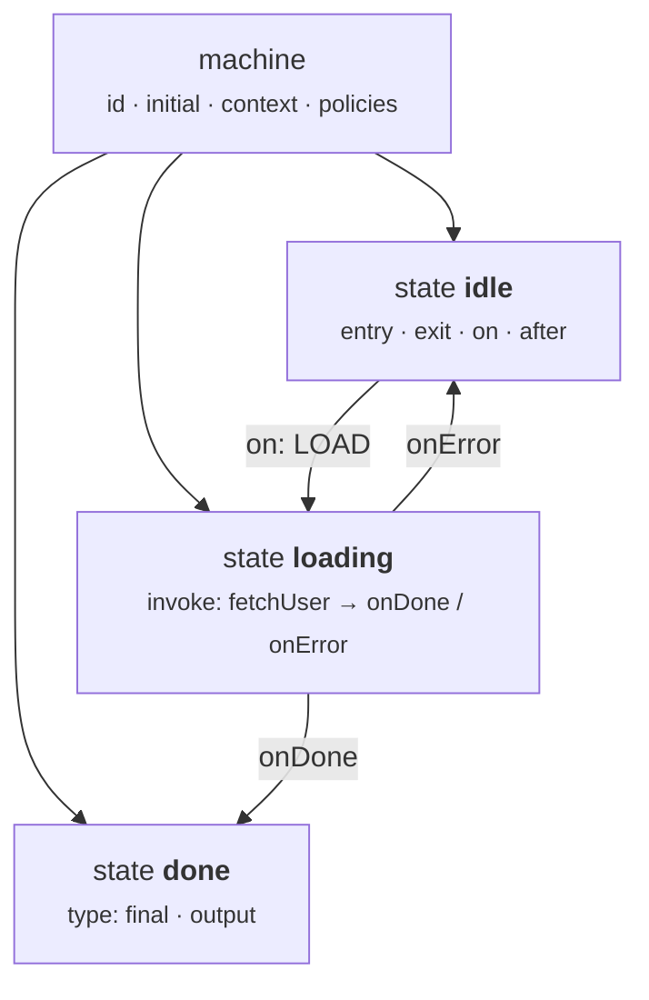

XState JSON is the universal format for defining state machines. You can design machines visually at [stately.ai](https://stately.ai), export JSON, and run them directly with this library — or write the JSON by hand.

This page documents **every field** in the configuration format, with complete, runnable examples.

---

## 🧱 Complete JSON Structure



Here is a fully annotated machine configuration showing all top-level and state-level fields:

```json
{
  "id": "orderMachine",
  "initial": "idle",
  "context": {
    "retries": 0,
    "orderId": null,
    "items": [],
    "error": null
  },
  "states": {
    "idle": {
      "on": {
        "PLACE_ORDER": {
          "target": "validating",
          "actions": "captureOrder",
          "guard": "hasItems"
        }
      },
      "entry": "resetForm",
      "exit": "clearErrors"
    },
    "validating": {
      "always": [
        { "target": "processing", "guard": "isValid" },
        { "target": "idle", "actions": "showValidationError" }
      ]
    },
    "processing": {
      "invoke": {
        "src": "submitOrder",
        "onDone": {
          "target": "confirmed",
          "actions": "storeOrderId"
        },
        "onError": {
          "target": "error",
          "actions": "storeError"
        }
      },
      "after": {
        "10000": "error"
      }
    },
    "confirmed": {
      "type": "final"
    },
    "error": {
      "on": {
        "RETRY": {
          "target": "processing",
          "guard": "hasRetriesLeft",
          "actions": "incrementRetry"
        },
        "CANCEL": "idle"
      }
    }
  }
}
```

This machine has:

- **`id`** — a unique identifier for the machine
- **`initial`** — the state the machine starts in
- **`context`** — mutable data that travels with the machine
- **`states`** — a map of every state and its configuration
- Entry/exit actions, guards, services, delayed transitions, eventless transitions, and a final state

---

## 📚 Field-by-Field Reference

### Top-Level Fields

| Field | Type | Required | Description |
|-------|------|:--------:|-------------|
| `id` | `string` | **Yes** | Unique machine identifier. Used as a prefix in state IDs (e.g., `"orderMachine.idle"`). |
| `initial` | `string` | **Yes** | The name of the starting state. Must match a key in `states`. |
| `context` | `object` | No | Initial mutable data. Accessible in actions, guards, and services. Deep-copied on each interpreter start. |
| `states` | `object` | **Yes** | A map of state name → state configuration. At least one state is required. |
| `strict` | `bool` | No | Default `false`. When `true`, sending an event type the machine has never declared anywhere raises `UnknownEventError`. See [Strict Mode](#strict-mode-unknown-events-and-payload-schemas). |
| `strictTargets` | `bool` | No | Default `false`. When `true`, a plain (non-dotted) transition target must name a sibling or ancestor-scope state — it will no longer fall back to matching an unrelated state elsewhere in the tree that happens to share the same trailing id segment. |
| `maxIterations` | `int` | No | Default `1000`. Runaway guard for work the machine generates *for itself* **within a step**: eventless (`always`) microsteps while settling, and unbroken chains of zero-delay self-`raise` / self-`send()` / `done.invoke` events. A **delayed** self-send (`raise` with `delay`) is a *timer* like `after` (#212): arming it ends the step's chain, its firing is a clock event, and a self-paced heartbeat or poller of any period runs indefinitely. Counted per **chain** — it resets whenever a step generates nothing — so a batch of any size of independent user events is always processed in full on both engines; only a genuinely self-feeding loop trips it, and only the generated tail is dropped. A trip is **observable** (0.8.1): the triggering `send(wait=True)` receipt carries a `RunawayChainError`, `interp.last_transition_ok` is `False` / `interp.last_error` is set, and `on_event_dropped` fires with `reason="chain_budget"` for each discarded event. Engine completions (`done.invoke`, `error.platform`) are never discarded. |
| `spawnBlockingTimeout` | `number` | No | Milliseconds a `spawn_blocking_<key>` action waits for the child to reach a final state before giving up, on both engines. Default `30000` (30 s) — never unbounded, so a child that never finishes cannot wedge the parent mid-transition. |
| `actionErrorPolicy` | `"continue" \| "rollback" \| "fail"` | No | Default `"continue"`. What happens when an `entry`/`exit`/transition action raises: `"continue"` logs and proceeds (the 0.7.x behavior, and the current default — planned to change to `"rollback"` in 1.0), `"rollback"` undoes the transition, `"fail"` puts the interpreter into the terminal `"error"` status. |
| `guardErrorPolicy` | `"false" \| "true" \| "raise"` | No | Default `"false"`. What happens when a guard function raises: `"false"` treats the guard as not passing, `"true"` as passing, `"raise"` propagates the exception. Every outcome fires the `on_guard_error` plugin hook first. |
| `onUnhandled` | `"ignore" \| "defer" \| "error"` | No | Default `"ignore"`. Policy applied when a **known** event (declared somewhere in the machine) matches no transition in the currently active state(s). See [`onUnhandled`: what happens to a known-but-unmatched event](#onunhandled-what-happens-to-a-known-but-unmatched-event) below. |
| `output` | `any` | No | Machine-level output value, resolved when a top-level `final` state is reached. Surfaced on the generated `done.state.*` event. |

**Example — minimal machine:**

```json
{
  "id": "toggle",
  "initial": "off",
  "states": {
    "off": { "on": { "FLIP": "on" } },
    "on":  { "on": { "FLIP": "off" } }
  }
}
```

**Example — with context:**

```json
{
  "id": "counter",
  "initial": "counting",
  "context": {
    "count": 0,
    "maxCount": 100,
    "history": []
  },
  "states": {
    "counting": {
      "on": {
        "INCREMENT": { "actions": "addOne" },
        "DECREMENT": { "actions": "subtractOne" },
        "RESET":     { "actions": "resetCount" }
      }
    }
  }
}
```

---

### State Fields

Every value in the `states` object is a **state configuration** with the following optional fields:

| Field | Type | Description |
|-------|------|-------------|
| `on` | `object` | Map of event name → transition(s). The core of state machine behavior. |
| `entry` | `string \| string[]` | Action(s) to run when entering this state. |
| `exit` | `string \| string[]` | Action(s) to run when leaving this state. |
| `invoke` | `object \| object[]` | Service(s) to start when entering this state. |
| `after` | `object` | Delayed transitions: `{ "milliseconds": target_or_transition }`. |
| `type` | `string` | One of `"atomic"`, `"compound"`, `"parallel"`, `"final"`, or `"history"`. Default: `"atomic"`. |
| `initial` | `string` | Initial child state name (required for compound states). |
| `states` | `object` | Nested child state configurations (makes this a compound state). |
| `onDone` | `string \| object` | Transition when a compound state's child reaches a final state. |
| `always` | `object \| object[]` | Eventless (transient) transitions — evaluated immediately on entry. |
| `tags` | `string \| string[]` | Arbitrary labels for this state, queryable at runtime via `interpreter.has_tag(tag)` and `interpreter.tags`. Useful for UI concerns like "is a spinner showing" without hardcoding state names. |
| `meta` | `object` | Arbitrary metadata attached to the state, retrievable via `interpreter.get_meta()` (returns a `{state_id: meta}` map for every currently active state that declares one). |
| `description` | `string` | Free-text documentation for the state. Not used by the runtime — purely informational, e.g. for tooling or generated docs. |
| `history` | `"shallow" \| "deep"` | Only meaningful on a state with `"type": "history"` (see below). Default `"shallow"`. |
| `output` | `any` | Only meaningful on a `"type": "final"` state. The value surfaced on the `done.state.*` / `done.invoke.*` event when this final state is reached. |

**Example — state with all fields:**

```json
"loading": {
  "entry": ["showSpinner", "logStart"],
  "exit": "hideSpinner",
  "invoke": {
    "src": "fetchData",
    "onDone":  { "target": "success", "actions": "storeResult" },
    "onError": { "target": "failure", "actions": "storeError" }
  },
  "on": {
    "CANCEL": "idle"
  },
  "after": {
    "15000": { "target": "failure", "actions": "logTimeout" }
  }
}
```

**Example — `tags`, `meta`, and `description`:**

`tags` and `meta` are queryable at runtime through the interpreter; `description` is documentation only.

```python
from xstate_statemachine import create_machine, SyncInterpreter

config = {
    "id": "order",
    "initial": "pending",
    "states": {
        "pending": {
            "tags": ["active", "billable"],
            "meta": {"ui": {"color": "blue"}},
            "description": "Waiting for payment confirmation.",
            "on": {"FILL": "filled"},
        },
        "filled": {"type": "final"},
    },
}

machine = create_machine(config)
interp = SyncInterpreter(machine).start()
print(interp.has_tag("billable"))  # True
print(interp.tags)                 # {'active', 'billable'}
print(interp.get_meta())           # {'order.pending': {'ui': {'color': 'blue'}}}
```


---

## ➡️ Transition Formats

Transitions are defined inside a state's `on` field. The library supports **four formats**, from simplest to most expressive.

### Format 1: Simple String Shorthand

The most concise form — just the target state name:

```json
"on": {
  "CLICK": "active",
  "HOVER": "highlighted",
  "RESET": "idle"
}
```

No guard, no actions — just move to the target state.

### Format 2: Object with Options

Add a `target`, `guard`, and/or `actions`:

```json
"on": {
  "SUBMIT": {
    "target": "submitting",
    "guard": "isFormValid",
    "actions": "logSubmission"
  }
}
```

| Property | Type | Description |
|----------|------|-------------|
| `target` | `string` | Destination state name. |
| `guard` | `string` | Guard function name — transition only fires if this returns `true`. |
| `actions` | `string \| string[]` | Action(s) to execute during the transition. |

### Format 3: Array Form (Multiple Transitions)

When an event has multiple possible outcomes, use an array. **The first transition whose guard passes wins:**

```json
"on": {
  "SUBMIT": [
    { "target": "premium",  "guard": "isPremiumUser" },
    { "target": "standard", "guard": "isVerified" },
    { "target": "rejected" }
  ]
}
```

> **Tip:** Always put the most specific guard first. The **last entry without a guard** acts as the fallback (default) transition.

### Format 4: Multiple Actions

A single transition can run multiple actions:

```json
"on": {
  "CHECKOUT": {
    "target": "processing",
    "actions": ["validateCart", "captureAddress", "startPayment"]
  }
}
```

Actions execute **in order** — `validateCart` first, then `captureAddress`, then `startPayment`.

**Combining all formats:**

```json
"on": {
  "LOGIN": [
    {
      "target": "admin",
      "guard": "isAdmin",
      "actions": ["logLogin", "loadAdminDashboard"]
    },
    {
      "target": "dashboard",
      "actions": ["logLogin", "loadUserDashboard"]
    }
  ]
}
```

---

## ♾️ Eventless Transitions (`always`)

Eventless transitions fire **immediately** when a state is entered — no event needed. They are evaluated in order, and the **first matching guard wins**.

### Router Example

```json
{
  "id": "router",
  "initial": "checking",
  "context": { "role": "admin", "authenticated": true },
  "states": {
    "checking": {
      "always": [
        { "target": "adminPanel",    "guard": "isAdmin" },
        { "target": "userDashboard", "guard": "isUser" },
        { "target": "login" }
      ]
    },
    "adminPanel":    {},
    "userDashboard": {},
    "login":         {}
  }
}
```

When the machine enters `"checking"`:

1. It evaluates `isAdmin` — if `true`, immediately transitions to `"adminPanel"`.
2. Otherwise, evaluates `isUser` — if `true`, transitions to `"userDashboard"`.
3. Otherwise, falls through to `"login"` (no guard = always matches).

> **Note:** Eventless transitions happen **synchronously** during state entry. The machine never "rests" in the `"checking"` state — it passes through instantly.

### Eventless with Actions

```json
"checking": {
  "always": [
    {
      "target": "premium",
      "guard": "hasPremiumPlan",
      "actions": "loadPremiumFeatures"
    },
    {
      "target": "free",
      "actions": "loadBasicFeatures"
    }
  ]
}
```

---

## 📞 Invoke / Service Fields

The `invoke` field starts an async operation (service) when a state is entered. When the service resolves or rejects, the machine transitions via `onDone` or `onError`.

### Invoke Field Reference

| Field | Type | Required | Description |
|-------|------|:--------:|-------------|
| `src` | `string` | **Yes** | The name of the service function to call. |
| `onDone` | `string \| object` | No | Transition when the service resolves successfully. |
| `onError` | `string \| object` | No | Transition when the service throws an error. |
| `id` | `string` | No | Optional identifier for the invoked service. Defaults to the hosting state's id if omitted (so give anonymous invokes in the same state distinct ids if you need to address them uniquely). |
| `input` | `any` | No | Static data — or a callable resolved per-spawn — passed to the invoked child as its `input`. |
| `systemId` | `string` | No | Registers the spawned child in the actor system under this name, so `sendTo`/`forward_to` can address it from anywhere in the tree. |

### Basic Invoke

```json
"loading": {
  "invoke": {
    "src": "fetchUserProfile",
    "onDone": {
      "target": "loaded",
      "actions": "storeProfile"
    },
    "onError": {
      "target": "error",
      "actions": "storeError"
    }
  }
}
```

### Invoke with ID

```json
"polling": {
  "invoke": {
    "id": "pollService",
    "src": "pollForUpdates",
    "onDone": {
      "target": "updated",
      "actions": ["storeUpdate", "logRefresh"]
    },
    "onError": "error"
  }
}
```

### Multiple Invocations

A state can invoke multiple services simultaneously using an array:

```json
"initializing": {
  "invoke": [
    {
      "src": "loadConfig",
      "onDone": { "actions": "storeConfig" }
    },
    {
      "src": "loadUser",
      "onDone": { "actions": "storeUser" }
    }
  ]
}
```

> **Note:** The `onDone` event carries the return value of the service. Access it in your action via `event.data`.

---

## ⏱️ After (Delayed Transitions)

The `after` field defines timer-based automatic transitions. Keys are **milliseconds** (as strings), values are target states or full transition objects.

### Simple Timeout

```json
"notification": {
  "entry": "showToast",
  "after": {
    "5000": "hidden"
  }
}
```

After 5 seconds, the machine automatically transitions from `"notification"` to `"hidden"`.

### Timeout with Guard

```json
"warning": {
  "after": {
    "30000": {
      "target": "expired",
      "guard": "noUserActivity"
    }
  },
  "on": {
    "EXTEND": "active"
  }
}
```

### Multiple Timers

A state can have multiple `after` timers running simultaneously:

```json
"monitoring": {
  "after": {
    "5000":   { "target": "monitoring", "actions": "heartbeat" },
    "60000":  { "target": "stale",      "guard": "noRecentData" },
    "300000": "timeout"
  }
}
```

This state:
1. Sends a heartbeat every 5 seconds (self-transition re-enters the state, restarting all timers).
2. Transitions to `"stale"` after 60 seconds if no recent data.
3. Hard-timeouts at 5 minutes regardless.

### Session Timeout Example

```json
{
  "id": "sessionTimeout",
  "initial": "active",
  "states": {
    "active": {
      "after": { "300000": "warning" },
      "on": { "ACTIVITY": "active" }
    },
    "warning": {
      "after": { "30000": "expired" },
      "on": { "EXTEND": "active" }
    },
    "expired": {
      "type": "final"
    }
  }
}
```

> **Tip:** The `ACTIVITY` event on `"active"` triggers a self-transition, which **restarts the 5-minute timer**. This is how you implement "idle timeout with reset on activity".

---

## 🏷️ State Types

Every state has a `type` that determines its behavior:

| Type | Description | Has Children? | Outgoing Transitions? |
|------|-------------|:---:|:---:|
| `"atomic"` | Simple leaf state (default). | No | Yes |
| `"compound"` | Parent state with nested children. Automatically inferred when `states` is present. | Yes | Yes |
| `"parallel"` | All child regions active simultaneously. | Yes | Yes |
| `"final"` | Terminal state — the machine (or region) is done. | No | No |
| `"history"` | Pseudo-state that, when targeted, restores a previously-active child configuration of its parent instead of being entered itself. | No | No |

### Atomic (default)

```json
"idle": {
  "on": { "START": "running" }
}
```

No `type` field needed — atomic is the default.

### Final

```json
"completed": {
  "type": "final"
}
```

When a final state is entered inside a compound state, it triggers a `done.state.*` event on the parent.

### Parallel

```json
"playing": {
  "type": "parallel",
  "states": {
    "video": {
      "initial": "loading",
      "states": {
        "loading": { "on": { "LOADED": "showing" } },
        "showing": {}
      }
    },
    "audio": {
      "initial": "muted",
      "states": {
        "muted":   { "on": { "UNMUTE": "playing" } },
        "playing": { "on": { "MUTE": "muted" } }
      }
    }
  }
}
```

### History

A `history` state is never entered itself — targeting it restores whichever child of its parent was active when the parent was last exited. `history` (the config key, default `"shallow"`) controls the depth: `"shallow"` restores only the immediate child, `"deep"` restores the full nested configuration. If the parent has never been exited before, the parent's own `initial` state is entered instead.

```python
from xstate_statemachine import create_machine, SyncInterpreter

config = {
    "id": "player",
    "initial": "off",
    "states": {
        "off": {"on": {"POWER": "on.hist"}},
        "on": {
            "type": "compound",
            "initial": "playing",
            "on": {"POWER": "off"},
            "states": {
                "playing": {"on": {"PAUSE": "paused"}},
                "paused": {"on": {"PLAY": "playing"}},
                "hist": {"type": "history", "history": "shallow"},
            },
        },
    },
}

machine = create_machine(config)
interp = SyncInterpreter(machine).start()
interp.send("POWER")  # off -> on.playing
interp.send("PAUSE")  # on.playing -> on.paused
interp.send("POWER")  # on.paused -> off
interp.send("POWER")  # off -> on.hist -> restores on.paused
print(interp.current_state_ids)  # {'player.on.paused'}
```

---

## 🪆 Nested (Compound) States

When a state has a `states` field, it becomes a **compound state**. It must also have an `initial` field to specify which child state is entered first.

### Example: Authentication Flow

```json
{
  "id": "auth",
  "initial": "loggedOut",
  "states": {
    "loggedOut": {
      "on": { "LOGIN": "loggedIn" }
    },
    "loggedIn": {
      "initial": "dashboard",
      "states": {
        "dashboard": {
          "on": {
            "VIEW_PROFILE": "profile",
            "VIEW_SETTINGS": "settings"
          }
        },
        "profile": {
          "on": { "BACK": "dashboard" }
        },
        "settings": {
          "on": { "BACK": "dashboard" }
        }
      },
      "on": {
        "LOGOUT": "loggedOut"
      }
    }
  }
}
```

**Key behavior:** The `LOGOUT` event on the parent `"loggedIn"` state catches the event **no matter which child state is active**. This is the power of hierarchy — parent transitions apply to all children.

### Multi-Level Nesting

States can be nested multiple levels deep:

```json
"app": {
  "initial": "main",
  "states": {
    "main": {
      "initial": "home",
      "states": {
        "home":     { "on": { "NAV_PROFILE": "profile" } },
        "profile":  { "on": { "NAV_HOME": "home" } }
      }
    }
  }
}
```

---

## `onDone` for Compound States

When a compound state's child enters a `final` state, the parent can react via `onDone`:

```json
{
  "id": "wizard",
  "initial": "step1",
  "states": {
    "step1": {
      "initial": "editing",
      "states": {
        "editing": {
          "on": { "NEXT": "complete" }
        },
        "complete": { "type": "final" }
      },
      "onDone": "step2"
    },
    "step2": {
      "initial": "editing",
      "states": {
        "editing": {
          "on": { "NEXT": "complete" }
        },
        "complete": { "type": "final" }
      },
      "onDone": "finished"
    },
    "finished": { "type": "final" }
  }
}
```

When `step1.complete` is entered (a final state), it fires a `done.state.step1` event, which triggers `onDone` and moves the machine to `step2`.

> **Note:** `onDone` supports the same formats as transitions — a string target, or an object with `target`, `guard`, and `actions`.

---

## Complete Real-World Example: Fetch Machine

This machine models a complete data-fetching flow with retries, timeout, and context tracking:

```json
{
  "id": "fetchMachine",
  "initial": "idle",
  "context": {
    "data": null,
    "error": null,
    "retries": 0,
    "maxRetries": 3,
    "lastFetchedAt": null
  },
  "states": {
    "idle": {
      "entry": "resetError",
      "on": {
        "FETCH": {
          "target": "loading",
          "actions": "logFetchStart"
        }
      }
    },
    "loading": {
      "entry": "showSpinner",
      "exit": "hideSpinner",
      "invoke": {
        "src": "fetchData",
        "onDone": {
          "target": "success",
          "actions": ["storeData", "recordTimestamp"]
        },
        "onError": {
          "target": "error",
          "actions": "storeError"
        }
      },
      "after": {
        "15000": {
          "target": "error",
          "actions": "logTimeout"
        }
      },
      "on": {
        "CANCEL": {
          "target": "idle",
          "actions": "logCancellation"
        }
      }
    },
    "success": {
      "entry": "notifySuccess",
      "on": {
        "REFRESH": "loading",
        "RESET": {
          "target": "idle",
          "actions": "clearData"
        }
      }
    },
    "error": {
      "entry": "notifyError",
      "on": {
        "RETRY": [
          {
            "target": "loading",
            "guard": "hasRetriesLeft",
            "actions": "incrementRetry"
          },
          {
            "target": "failed",
            "actions": "logMaxRetries"
          }
        ],
        "RESET": {
          "target": "idle",
          "actions": ["clearData", "resetRetries"]
        }
      }
    },
    "failed": {
      "type": "final"
    }
  }
}
```

### Running It

<!-- doc-fragment -->
```python
from xstate_statemachine import create_machine, SyncInterpreter, MachineLogic

class FetchLogic(MachineLogic):
    # Actions
    def reset_error(self, interpreter, context, event, action_def):
        context["error"] = None

    def show_spinner(self, interpreter, context, event, action_def):
        print("⏳ Loading...")

    def hide_spinner(self, interpreter, context, event, action_def):
        print("   Spinner hidden")

    def store_data(self, interpreter, context, event, action_def):
        context["data"] = event.data

    def record_timestamp(self, interpreter, context, event, action_def):
        from datetime import datetime
        context["lastFetchedAt"] = datetime.now().isoformat()

    def store_error(self, interpreter, context, event, action_def):
        context["error"] = str(event.data)

    def increment_retry(self, interpreter, context, event, action_def):
        context["retries"] += 1
        print(f"🔄 Retry #{context['retries']}")

    def log_fetch_start(self, interpreter, context, event, action_def):
        print("📡 Fetch started")

    def log_timeout(self, interpreter, context, event, action_def):
        context["error"] = "Request timed out"

    def log_cancellation(self, interpreter, context, event, action_def):
        print("❌ Fetch cancelled")

    def log_max_retries(self, interpreter, context, event, action_def):
        print("💀 Max retries reached")

    def notify_success(self, interpreter, context, event, action_def):
        print(f"✅ Data loaded: {context['data']}")

    def notify_error(self, interpreter, context, event, action_def):
        print(f"⚠️ Error: {context['error']}")

    def clear_data(self, interpreter, context, event, action_def):
        context["data"] = None

    def reset_retries(self, interpreter, context, event, action_def):
        context["retries"] = 0

    # Guards
    def has_retries_left(self, context, event):
        return context["retries"] < context["maxRetries"]

    # Services
    def fetch_data(self, interpreter, context, event):
        import requests
        resp = requests.get("https://api.example.com/data")
        return resp.json()

config = { ... }  # The JSON config above

machine = create_machine(config, logic=FetchLogic())
interp = SyncInterpreter(machine).start()

interp.send("FETCH")       # idle -> loading -> (service runs) -> success or error
interp.send("RETRY")       # error -> loading (if retries left)
interp.stop()

print(interp.context)
```

---

## Strict Mode: Unknown Events and Payload Schemas

By default, sending an event type that no state in the machine ever declares is a silent no-op — this is XState's actor semantics, and it stays correct for events a particular state simply doesn't care about (the same default, `onUnhandled: "ignore"`, also governs known-but-unmatched events; see below). But it makes a second, very different case invisible too: an event that NOTHING in the machine has ever heard of, which is almost always a typo or an outdated producer. `strict` mode turns that second case into an exception raised at the `send()` call site.

### Enabling strict mode

Enable it with the `strict` config key, or with the `strict=` keyword argument on either interpreter constructor. The constructor argument wins when both are given:

<!-- doc-fragment -->
```python
from xstate_statemachine import create_machine, SyncInterpreter

config = {
    "id": "order",
    "initial": "pending",
    "strict": True,
    "states": {
        "pending": {"on": {"FILL": "filled", "CANCEL": "cancelled"}},
        "filled": {"type": "final"},
        "cancelled": {"type": "final"},
    },
}

machine = create_machine(config)
interp = SyncInterpreter(machine).start()
interp.send("FILLL")  # typo!
```

```
xstate_statemachine.exceptions.UnknownEventError: Event 'FILLL' is not
declared by machine 'order'. Known events: CANCEL, FILL. Did you mean 'FILL'?
```

`UnknownEventError.event_type`, `.machine_id`, and `.known` (the sorted declared descriptor set) are available on the exception for programmatic handling.

Strict mode can also be turned on per-interpreter, overriding a machine that was not built with `strict: True`:

```python
machine = create_machine(config)  # not strict at the config level
interp = SyncInterpreter(machine, strict=True).start()
```

On the async engine, `Interpreter.send()` raises `UnknownEventError` **synchronously, before the event is queued** — even if the coroutine it returns is never awaited. This matters because a run-loop error surfacing later, inside the fire-and-forget processing loop, could never be caught by the caller:

```python
i = await Interpreter(create_machine(config), strict=True).start()
try:
    i.send("NOPE")  # not awaited -- still raises here
except UnknownEventError:
    ...
assert i.queue_depth == 0  # never reached the inbox
```

### What counts as "known"

A machine's declared descriptor set (`MachineNode.known_events`, a `FrozenSet[str]`) is built once, lazily, from every `on` key anywhere in the tree, including:

- Exact event names (`"FILL"`)
- Partial wildcard descriptors (`"mouse.*"`) — these match by dot-segment: `"mouse.*"` makes `mouse.click` known but not `keyboard.press`
- The bare `"*"` descriptor — makes **every** event known, disabling the unknown-event check entirely for that machine
- Every `after` delay's generated timer event
- Every `invoke`'s generated `done.invoke.<id>` and `error.platform.<id>`

Engine-synthesised events are always known regardless of what the machine declares — see [Engine events are always "known"; yours are checked](#engine-events-are-always-known-yours-are-checked) below.

Use `Machine.is_known_event(event_type)` to run the same check yourself:

```python
machine.is_known_event("FILL")            # True: exact match
machine.is_known_event("mouse.click")     # True: partial match
machine.is_known_event("done.invoke.job") # True: generated by invoke
machine.is_known_event("xstate.init")     # True: engine event, always known
machine.is_known_event("nope")            # False
```

### Declared-but-unhandled events are still ignored (by default)

`strict` only rejects events the machine has **never** declared anywhere. An event that's declared in one state but not handled by the state currently active is a separate case, governed by the `onUnhandled` policy described below — whose default (`"ignore"`) is a normal, silent no-op:

```python
config = {
    "id": "order",
    "initial": "pending",
    "states": {
        "pending": {"on": {"FILL": "filled", "CANCEL": "cancelled"}},
        "filled": {"on": {"SHIP": "shipped"}},
        "shipped": {"type": "final"},
        "cancelled": {"type": "final"},
    },
}

interp = SyncInterpreter(create_machine(config)).start()  # strict via config
interp.send("FILL")     # pending -> filled
interp.send("CANCEL")   # known (declared in `pending`), but `filled` has no handler -> ignored
print(interp.current_state_ids)  # {'order.filled'}
```

> **Note:** `filled` is given an unrelated `on: {"SHIP": ...}` handler here (rather than being a bare `"type": "final"` state) so the example actually demonstrates "declared elsewhere, not handled here." A `final` state has no `on` at all, and `SyncInterpreter` auto-stops once the machine reaches a top-level final state — so sending `CANCEL` to an already-final `filled` would be a no-op because the interpreter had stopped, not because of any unhandled-event policy.

### Internal `raise` events

A `{"type": "raise", "params": {"event": "..."}}` action is checked in two places on a strict machine:

- **At build time (0.8.1).** If the raised event is a *literal* — a string or a `{"type": ...}` dict — `create_machine()` verifies it against `known_events` and raises `InvalidConfigError` (with a *Did you mean …?* suggestion) when nothing handles it. A typo in your config is a configuration error and should never reach runtime.
- **At runtime.** A *dynamic* event (a callable producing the event) is checked by the same `_check_strict` path as `send()` when the action executes. Be aware that under the default `actionErrorPolicy: "continue"` the resulting `UnknownEventError` is contained like any other action failure: it is logged, reported through `on_action_error` / `on_transition_failed`, sets `last_transition_ok = False` — and the transition **still commits**. If you want a runtime strict violation to abort the transition, pair `strict` with `actionErrorPolicy: "rollback"` or `"fail"`.

### Engine events are always "known"; yours are checked

Events the engine synthesises are never "unknown" — `strict` is never tripped by a `done.invoke.<id>`, `error.platform.<id>`, `after.<ms>` or `xstate.*` event the machine produced for itself. Since 0.8.1 that exemption is by **provenance** (the engine flags the events it mints), so a *user*-sent event is checked whatever it is called: `interp.send("done.typo")` on a strict machine raises `UnknownEventError` exactly like `interp.send("TYPO")` (#79). `Machine.is_known_event()` mirrors this for names: only the exact engine **shapes** (`done.invoke.`, `done.state.`, `error.platform.`, `after.`, `xstate.`) are implicitly known; a bare `done.` prefix is not.

### `send_threadsafe()` is covered too

Since 0.8.1 `Interpreter.send_threadsafe()` applies the same `strict` and `event_schemas` checks as `send()`, raising on the **calling** thread before the event is queued. In 0.8.0 it bypassed both.

### `MachineLogic(strict=True)` — a different `strict`

Unrelated to event validation, `MachineLogic(strict=True)` (0.8.1) makes subclass auto-registration refuse any undecorated public method — `InvalidConfigError` at construction instead of an arity-based guess plus a `UserWarning`. Decorate every method with `@action` / `@guard` / `@service`, or prefix helpers with `_`.

### `onUnhandled`: what happens to a known-but-unmatched event

This silent ignore is itself the default of a separate, configurable policy: `onUnhandled`, a top-level config key distinct from `strict`. Where `strict` governs events the machine has **never** declared, `onUnhandled` governs events that **are** declared somewhere but don't match any transition in the state(s) currently active. It accepts three values:

| Value | Behavior |
|-------|----------|
| `"ignore"` (default) | Silent no-op — the 0.7.x behavior shown above. |
| `"defer"` | The event is held in a bounded FIFO buffer (`DEFER_MAX = 1000`) and replayed at the head of the queue after the next state change. If the buffer is full, the oldest deferred event is evicted to make room. |
| `"error"` | Puts the interpreter into the terminal `"error"` status with a `UnhandledEventError` on `interpreter.error`. |

```python
from xstate_statemachine import create_machine, SyncInterpreter

config = {
    "id": "order",
    "initial": "pending",
    "onUnhandled": "defer",
    "states": {
        "pending": {"on": {"START_SHIP": "filled"}},
        "filled": {"on": {"SHIP": "shipped"}},
        "shipped": {"type": "final"},
    },
}

machine = create_machine(config)
interp = SyncInterpreter(machine).start()
interp.send("SHIP")           # unmatched in 'pending' -> deferred, not lost
print(interp.deferred_count)  # 1
interp.send("START_SHIP")     # pending -> filled; deferred SHIP replays here
print(interp.current_state_ids)  # {'order.shipped'}
```

Switching the same config's `onUnhandled` to `"error"` and sending an unmatched event instead sets `interpreter.status == "error"` and `interpreter.error` to a `UnhandledEventError`.

### Opt-in payload schemas

Independent of `strict`, `create_machine(..., event_schemas={...})` lets you validate an event's payload shape before it reaches any guard or action. A schema is any object exposing `validate(payload)`, or a plain callable — either should raise on a bad payload:

```python
class Fill:
    @staticmethod
    def validate(payload):
        if not isinstance(payload.get("qty"), (int, float)):
            raise ValueError("qty: Input should be a valid number")

machine = create_machine(config, event_schemas={"FILL": Fill})
interp = SyncInterpreter(machine).start()

interp.send("FILL", qty="not-a-number")
```

```
xstate_statemachine.exceptions.InvalidEventPayloadError: payload for 'FILL'
failed validation: qty: Input should be a valid number
```

A plain callable works too:

```python
def check_qty(payload):
    if "qty" not in payload:
        raise KeyError("qty")

machine = create_machine(config, event_schemas={"FILL": check_qty})
```

`InvalidEventPayloadError` carries `.event_type` and `.cause` (the original exception the validator raised). Schema validation runs regardless of `strict`, and — like the unknown-event check — happens before the event is queued, so a rejected payload never reaches the machine's context.

## Tips: Common Mistakes and Best Practices

> **Tip:** Always give your machine a descriptive `id`. State IDs are prefixed with it (e.g., `"fetchMachine.loading"`), which makes debugging and logging much clearer.

> **Tip:** Use context for data that changes — like counters, user objects, and error messages. Use states for _modes_ — like "idle", "loading", "error".

> **Warning:** Don't put the same event name in both a parent and a child state unless you intend for the child to "shadow" the parent's handler. The child's `on` handler takes priority.

> **Warning:** Final states cannot have outgoing transitions (`on`), child states (`states`), or delayed transitions (`after`). If you need to leave a final state, redesign your state hierarchy so the final state is inside a compound state with an `onDone` handler.

> **Tip:** When using multiple guarded transitions (array form), always include a fallback transition without a guard as the last entry. Otherwise, the event is silently dropped if no guard matches.

> **Note:** JSON doesn't support comments. If you need to annotate your config, keep it in a Python dict or use a `.jsonc` file and strip comments before parsing.

> **Tip:** Start with the [Stately visual editor](https://stately.ai) to design your machine, then export the JSON. It validates your config and catches structural errors before you write any code.

---

## Quick Reference Cheat Sheet

| Where | Keys |
|---|---|
| 🏠 **Top level** | `id` · `initial` · `context` · `states` · `strict` · `strictTargets` · `strictConfig` · `maxIterations` · `spawnBlockingTimeout` · `actionErrorPolicy` · `guardErrorPolicy` · `onUnhandled` · `output` · `meta` · `description` · `tags` · `version` · any `x-…` key. **Unknown keys** (#216, #220): checked at the root **and in every state, transition and invoke**. Logged at WARNING with a "did you mean" hint and the path (`m.a: 'entyr' (did you mean 'entry'?)`) by default; refused with `InvalidConfigError` under `strictConfig: true` or `create_machine(..., strict_config=True)`. A misspelled key otherwise silently does nothing — `actionErrorPolicyy` → `continue`, a state's `entyr` → an entry action that never runs, `onn` → a transition that does not exist. `x-…` keys and `meta` / `description` / `tags` are accepted at every level. |
| 🔲 **State** | `on` · `entry` · `exit` · `invoke` · `after` · `type` · `initial` · `states` · `onDone` · `always` · `tags` · `meta` · `description` · `history` · `output` |
| 🏷️ **State types** | `"atomic"` *(default)* · `"compound"` · `"parallel"` · `"final"` · `"history"` |
| 📞 **Invoke** | `src` · `onDone` · `onError` · `id` · `input` · `systemId` |

| Transition form | Example | Notes |
|---|---|---|
| String shorthand | `"EVENT": "target"` | just move |
| Object | `"EVENT": { "target", "guard", "actions" }` | guard + actions |
| Array | `"EVENT": [ { … }, { … } ]` | first passing guard wins |
| Eventless | `"always": [ { "target", "guard" }, … ]` | evaluated on entry and after every transition |
| Delayed | `"after": { "5000": "target" }` | or the object form with guard/actions |

| Strictness | How |
|---|---|
| Unknown event types raise | `"strict": true` in JSON, or `Interpreter(machine, strict=True)` |
| Payload validation | `create_machine(config, event_schemas={"EVENT": schema_or_callable})` |
| Unresolvable targets rejected at build | `create_machine(config, strict_targets=True)` *(the only mode in 1.0)* |
