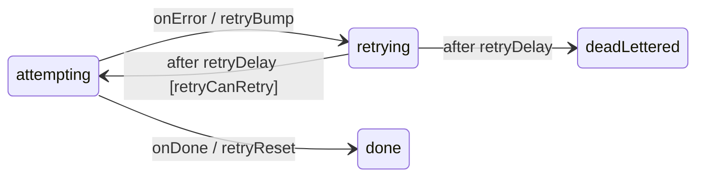
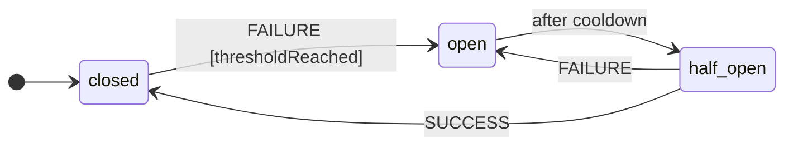

# Resilience Patterns

Three things every service team re-implements by hand, and gets subtly wrong: **retry with backoff** (no jitter → a thundering herd when the dependency comes back), **dead-lettering** (a poison message with no error context), and the **circuit breaker** (a half-open probe race). Each is a small statechart plus a delay function, so they ship as first-class building blocks in `xstate_statemachine.patterns` — zero dependencies, both engines, and `xsm inspect` renders them.



## 🔁 Retry with backoff and jitter

`RetryPolicy` computes the delay after the *n*-th failed attempt and hands you the three pieces of logic a retry loop needs — a named delay, a guard, and two actions — under predictable names so the JSON fragment below works verbatim.

```python
from xstate_statemachine.patterns import RetryPolicy

policy = RetryPolicy(max_attempts=5, base_ms=200, factor=2.0, max_ms=30_000, jitter="none")
print([policy.delay_ms(attempt) for attempt in range(1, 6)])
# [200.0, 400.0, 800.0, 1600.0, 3200.0]
```

| Argument | Default | Meaning |
|:--|:--|:--|
| `max_attempts` | `5` | Total attempts **including** the first. With `3`, the third failure is final. |
| `base_ms` | `200` | Delay before the first retry. |
| `factor` | `2.0` | Growth per attempt. |
| `max_ms` | `30_000` | Cap on any single delay. |
| `jitter` | `"full"` | `"none"` · `"full"` (uniform in `[0, exp]`) · `"equal"` (`exp/2 + uniform[0, exp/2]`) · `"decorrelated"` (`min(cap, uniform[base, prev×3])`). Formulas follow the AWS Architecture Blog. |
| `rng` | `random.random` | Inject a seeded `Random(...).random` for deterministic tests. |

`"decorrelated"` is **non-monotone by design** — each delay depends on the previous one, so its only guarantees are the bounds. The policy remembers the previous delay in `context["attempt_delay_ms"]`.

### The retry loop as a chart

The loop is four states. `policy.logic()` provides `retryDelay`, `retryCanRetry`, `retryBump` and `retryReset`; merge it with your own logic via `MachineLogic.merge()`.

```python
from xstate_statemachine import MachineLogic, SimulatedClock, SyncInterpreter, create_machine
from xstate_statemachine.patterns import RetryPolicy

RETRY_CFG = {
    "id": "job",
    "initial": "attempting",
    "context": {"attempt": 0},
    "states": {
        "attempting": {
            "invoke": {
                "src": "work",
                "onDone": {"target": "done", "actions": "retryReset"},
                "onError": {"target": "retrying", "actions": "retryBump"},
            }
        },
        "retrying": {
            "after": {
                "retryDelay": [
                    {"guard": "retryCanRetry", "target": "attempting"},
                    {"target": "deadLettered"},
                ]
            }
        },
        "done": {"type": "final"},
        "deadLettered": {"type": "final", "tags": ["dead-letter"]},
    },
}

calls = {"n": 0}

def work(interp, ctx, event):
    calls["n"] += 1
    if calls["n"] <= 3:
        raise ConnectionError(f"boom #{calls['n']}")
    return "ok"

policy = RetryPolicy(max_attempts=5, base_ms=100, jitter="none")
machine = create_machine(RETRY_CFG, logic=policy.logic().merge(MachineLogic(services={"work": work})))

clock = SimulatedClock()
interp = SyncInterpreter(machine, clock=clock).start()
for _ in range(5):
    clock.increment(10_000)          # each retry delay is well under 10 s

assert interp.matches("job.done") and calls["n"] == 4
assert interp.context["attempt"] == 0  # retryReset ran on success
```

Three failures, then success on the fourth attempt — driven entirely by the chart and a `SimulatedClock`, with no `sleep` anywhere.

### Custom names

`policy.logic(prefix="upload", attempt_key="tries")` yields `uploadDelay` / `uploadCanRetry` / `uploadBump` / `uploadReset` reading `context["tries"]`, so two independent retry loops can live in one machine.

## 💀 Dead-lettering with error context

When the loop gives up, the chart enters a state tagged `dead-letter`. `DeadLetterPlugin` watches for that and writes **one record** with everything an operator needs to triage or replay: the machine id, the event being handled, the attempt count, the **chain of errors** collected since the last clean step, and a snapshot.

```python
from xstate_statemachine import MachineLogic, SimulatedClock, SyncInterpreter, create_machine
from xstate_statemachine.patterns import DeadLetterPlugin, DeadLetterStore, RetryPolicy

RETRY_CFG = {
    "id": "job", "initial": "attempting",
    "context": {"attempt": 0, "api_key": "sk-live-…"},
    "states": {
        "attempting": {"invoke": {"src": "work",
            "onDone": {"target": "done", "actions": "retryReset"},
            "onError": {"target": "retrying", "actions": "retryBump"}}},
        "retrying": {"after": {"retryDelay": [
            {"guard": "retryCanRetry", "target": "attempting"},
            {"target": "deadLettered"}]}},
        "done": {"type": "final"},
        "deadLettered": {"type": "final", "tags": ["dead-letter"]},
    },
}

def work(interp, ctx, event):
    raise ConnectionError(f"upstream 503 (attempt {ctx['attempt'] + 1})")

policy = RetryPolicy(max_attempts=3, base_ms=100, jitter="none")
machine = create_machine(RETRY_CFG, logic=policy.logic().merge(MachineLogic(services={"work": work})))

store = DeadLetterStore()                     # any callable(DeadLetter) is a sink
clock = SimulatedClock()
interp = SyncInterpreter(machine, clock=clock).use(DeadLetterPlugin(store)).start()
for _ in range(4):
    clock.increment(10_000)

assert interp.matches("job.deadLettered")
record = store.all()[0]
assert record.attempts == 3
assert [e["message"] for e in record.errors] == [
    "upstream 503 (attempt 1)", "upstream 503 (attempt 2)", "upstream 503 (attempt 3)"]
assert record.snapshot["context"]["api_key"] == "***"     # redacted before it reached the sink
print(record.to_json()[:80], "…")
```

What the record guarantees:

- **Redacted.** Dead letters contain snapshots, and snapshots contain `context`. The record passes through the same `redact()` as `LoggingInspector` before it reaches the sink, so a secret never lands in a queue or a log. Override the denylist with `redact_keys=`.
- **Errors are strings.** Each entry is `{"source": "service" | "action", "name", "type", "message"}` — class name and message, never the exception object.
- **Both engines.** The plugin uses engine-agnostic hooks and writes the record from `on_event_processed`, after the step has settled, so the snapshot is legal on either engine.
- **Retention.** `DeadLetterStore.purge_older_than(cutoff_wall)` drops old records; `taken_at` is `interpreter.wall_now()` (epoch seconds).

Options: `state_ids=["job.poison"]` to name the terminal states explicitly instead of tagging; `include_snapshot=False` for smaller records; `attempt_key=` to match a custom counter. Broker sinks and the `xsm dlq` CLI arrive with the EDA phase.

## ⚡ Circuit breaker — as a statechart

The breaker **is** a three-state chart run on a `SyncInterpreter` behind one lock. That is not a gimmick: because the chart owns the state, the half-open race — two callers both believing they are *the* probe — is solved where it belongs, as a guarded transition taken inside the lock. Exactly `half_open_max_calls` probes get through per half-open window, however many threads hammer it.



```python
from xstate_statemachine import SimulatedClock
from xstate_statemachine.patterns import CircuitBreaker, CircuitOpenError

clock = SimulatedClock()
breaker = CircuitBreaker(failure_threshold=2, cooldown_ms=1_000, clock=clock)

def flaky():
    raise RuntimeError("upstream down")

for _ in range(2):
    try:
        breaker.call(flaky)
    except RuntimeError:
        pass
assert breaker.state == "open"

try:
    breaker.call(lambda: "never runs")
except CircuitOpenError as exc:
    print(exc)                    # Circuit 'circuitBreaker' is open; call rejected …

clock.increment(1_001)            # cooldown elapses
assert breaker.state == "half_open"
assert breaker.call(lambda: "recovered") == "recovered"
assert breaker.state == "closed"
```

| Member | Meaning |
|:--|:--|
| `CircuitBreaker(failure_threshold=5, cooldown_ms=30_000, half_open_max_calls=1, clock=None, plugins=(), name=None, exceptions=(Exception,))` | `exceptions` lists what counts as a failure; anything else propagates without touching the breaker. `plugins` attach to the internal interpreter — a `LoggingInspector` shows every trip. |
| `.call(fn, *a, **kw)` / `await .acall(fn, *a, **kw)` | Run `fn` if admitted, record the outcome, re-raise its exception. `CircuitOpenError` means **the target was not invoked**. |
| `.state` | `"closed"` / `"open"` / `"half_open"`. Ticks the clock first, so an elapsed cooldown is reflected. |
| `.failures` / `.opened_count` | Consecutive failures in the current window; total trips. |
| `.reset()` / `.close()` | Operator override to closed; stop the internal interpreter. |
| `@circuit_breaker(**kw)` | One breaker per decorated function (sync or `async def`), exposed as `fn.breaker`. |
| `CIRCUIT_BREAKER_CONFIG` / `circuit_breaker_logic(cooldown_ms)` | The chart and its logic, for `xsm inspect`, diagrams, or embedding in your own machine. |

Dogfooding check — save `CIRCUIT_BREAKER_CONFIG` to a file and run `xsm inspect`:

```text
╭─ inspect ──────────────────────────────── circuit_breaker.json ─╮
│ Machine   circuitBreaker    Version 1                          │
│ States    3  atomic 3                                          │
│ Events    4    Timers 1    Invokes 0                           │
│ Logic     5 actions · 2 guards · 0 services · 1 named delays   │
╰────────────────────────────────────────────────────────────────╯
state tree
◆ circuitBreaker  initial=closed
├── ○ closed
├── ○ open  after cooldown  #rejecting
└── ○ half_open
```

### Async

`acall` awaits a coroutine result; the breaker's own bookkeeping stays synchronous and lock-guarded, so one instance may be shared by asyncio tasks and worker threads at once. With a `SimulatedClock` inside a running loop, `await clock.increment(ms)` as usual — `.state` ticks the internal sync interpreter for you.

```python
import asyncio
from xstate_statemachine import SimulatedClock
from xstate_statemachine.patterns import circuit_breaker, CircuitOpenError

clock = SimulatedClock()

@circuit_breaker(failure_threshold=1, cooldown_ms=500, clock=clock)
async def fetch(ok: bool) -> str:
    if not ok:
        raise TimeoutError("slow")
    return "data"

async def main():
    try:
        await fetch(False)
    except TimeoutError:
        pass
    assert fetch.breaker.state == "open"
    try:
        await fetch(True)
    except CircuitOpenError:
        print("rejected fast")
    await clock.increment(501)
    assert await fetch(True) == "data"
    assert fetch.breaker.state == "closed"

asyncio.run(main())
```

## Putting them together

A worker that retries with jitter, trips a breaker on a sick dependency, and dead-letters what it cannot deliver is the three pieces above composed: the breaker wraps the service call inside `work`, the retry chart decides *when* to try again, and the plugin records *why* it stopped. Each piece is independently testable on a `SimulatedClock`, and `xsm inspect` / `xsm diagram` render the whole thing.
