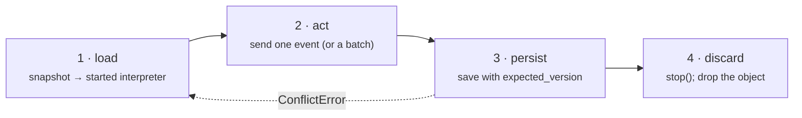

# Persistence Stores

An interpreter is process memory. Under gunicorn or uvicorn workers, in a Celery task, or when two requests arrive for the same order, "keep it in RAM" is wrong. Every durable system converges on the same four-step loop:



`xstate_statemachine.persistence` gives that loop a **store**: a small protocol with three zero-dependency backends, an optimistic-locking token on every record, and a pair of helpers that do steps 1 and 3 for you. Django, SQLAlchemy and Redis backends (later issues) implement the same protocol.

## The loop in six lines

```python
from xstate_statemachine import MachineLogic, create_machine
from xstate_statemachine.persistence import (
    ConflictError, MemoryStore, load_interpreter, save_interpreter,
)

cfg = {"id": "order", "initial": "cart", "context": {"items": 0},
       "states": {"cart": {"on": {"ADD": {"actions": "add"}, "CHECKOUT": "paid"}},
                  "paid": {"type": "final"}}}
def add(i, ctx, e, a):
    ctx["items"] += 1
machine = create_machine(cfg, logic=MachineLogic(actions={"add": add}))
store = MemoryStore()                         # swap for FileStore / SQLiteStore

def handle(key: str, event: str) -> None:
    while True:                               # the optimistic retry loop
        interp, version = load_interpreter(store, key, machine)   # started
        try:
            interp.send(event)
            save_interpreter(store, key, interp, expected_version=version)
            return
        except ConflictError:
            continue                          # someone saved first: reload, redo
        finally:
            interp.stop()                     # discard

handle("order-42", "ADD")
handle("order-42", "ADD")
interp, version = load_interpreter(store, "order-42", machine)
assert interp.context["items"] == 2 and version == 2
interp.stop()
```

`load_interpreter` returns a **started** `SyncInterpreter` and the record's version — `0` when the key did not exist yet, so the first `save_interpreter(expected_version=0)` succeeds only if nobody else created the record in between. For the async engine use `await aload_interpreter(...)`.

## Choosing a backend

| Backend | Good for | Not for | Locking |
|:--|:--|:--|:--|
| `MemoryStore()` | Tests; a single process that may restart without needing durability; CLI tools. | Anything with two processes — the data lives in this process only. | Optimistic (`expected_version`) + per-key `threading.Lock`. |
| `FileStore(directory)` | One host, a few processes, no database wanted (dev server with reload, a cron job beside a web worker). | **Network shares (SMB/NFS)** — advisory locks are unreliable there and `os.replace` is not atomic across them. High write rates. | Optimistic + advisory lock file per key (`fcntl.flock` / `msvcrt.locking`) with stale-lock reclaim. |
| `SQLiteStore(path)` | One host, many processes (gunicorn workers + Celery), thousands of keys, durability, real transactions. | Several hosts (use Redis or a server database); a database file on a network share (warns, falls back to `journal_mode=DELETE`). | Optimistic via `UPDATE … WHERE version = ?` + pessimistic `lock()` via `BEGIN IMMEDIATE`; WAL mode; connection per thread. |

Every backend passes the same contract test suite (`tests/persistence/test_store_contract.py`), so switching is a one-line change.

## What a record holds

```python
from xstate_statemachine import SyncInterpreter, create_machine
from xstate_statemachine.persistence import MemoryStore, StoredSnapshot

machine = create_machine({"id": "m", "version": "3", "initial": "a", "states": {"a": {}}})
interp = SyncInterpreter(machine).start()
store = MemoryStore()

version = store.save("m-1", interp.get_snapshot(), machine_version=machine.version or "")
record = store.load("m-1")
assert isinstance(record, StoredSnapshot)
assert (record.key, record.version, record.machine_version) == ("m-1", 1, "3")
assert record.deadlines == ()          # durable timers land here (#264)
interp.stop()
```

| Field | Meaning |
|:--|:--|
| `snapshot` | The JSON string exactly as `get_snapshot()` produced it. |
| `version` | Per-key record version, `1` on first save, `+1` per save. The optimistic-locking token. |
| `machine_version` | The chart's `"version"` label at save time (`""` if none) — what the snapshot migrator dispatches on. |
| `updated_at` | Epoch seconds of the last save. |
| `deadlines` | Durable `after` timers (`persistence.Deadline`), for timers that must fire hours after a restart. |

## Optimistic vs pessimistic

**Optimistic** (`save(..., expected_version=n)`) is the default and the right choice almost always: no lock is held while your event runs, and a lost race costs one reload. `ConflictError` carries `.expected` and `.actual` so a supervisor can see how contended a key is.

**Pessimistic** (`with store.lock(key, timeout=10):`) is for the rare step that must not be retried — an action with an external side effect that is not idempotent. `LockTimeoutError` is raised if the lock cannot be taken in time; for `SQLiteStore` this also covers SQLite's own `database is locked`, so you never see a bare `sqlite3.OperationalError`. The lock is per key on `MemoryStore` / `FileStore` and database-wide on `SQLiteStore` (SQLite has no row locks — the honest granularity).

```python
from xstate_statemachine.persistence import MemoryStore, LockTimeoutError
import threading

store = MemoryStore()
with store.lock("order-1", timeout=1):
    def contender():
        try:
            with store.lock("order-1", timeout=0.1):
                raise AssertionError("must not get in")
        except LockTimeoutError:
            print("blocked, as expected")
    t = threading.Thread(target=contender); t.start(); t.join()
```

## `persisted()` — the safe pattern as a `with` block

The retry loop above is what every handler ends up writing. `persisted()` writes it for you, with a **lock strategy** deciding how concurrent writers are coordinated:

```python
from xstate_statemachine import MachineLogic, create_machine
from xstate_statemachine.persistence import MemoryStore, persisted

cfg = {"id": "order", "initial": "cart", "context": {"items": 0},
       "states": {"cart": {"on": {"ADD": {"actions": "add"}, "PAY": "paid"}},
                  "paid": {"type": "final"}}}
def add(i, ctx, e, a):
    ctx["items"] += 1
machine = create_machine(cfg, logic=MachineLogic(actions={"add": add}))
store = MemoryStore()

with persisted(store, "order:42", machine) as order:       # load (started)
    order.send("ADD")                                        # act
    order.send("ADD")
# persist on clean exit; the interpreter is stopped (discarded)

with persisted(store, "order:42", machine) as order:
    assert order.context["items"] == 2
    receipt = order.send("PAY", wait=True)
    assert receipt.changed
assert store.load("order:42").version == 2
```

Two rules make the block predictable:

1. **An exception inside the block writes nothing.** The store is exactly as it was; the interpreter is stopped. Your `try`/`except` around the block *is* the transaction boundary.
2. **A block cannot be re-run.** Under the default `OptimisticLock`, if another writer saved between your load and your exit, the exit raises `ConflictError` and *you* retry the whole block. When you want the library to retry for you, hand it a callable instead: `persisted_retry(store, key, machine, lambda i: i.send("ADD"))`.

```python
from xstate_statemachine import MachineLogic, create_machine
from xstate_statemachine.persistence import ConflictError, MemoryStore, persisted, persisted_retry

cfg = {"id": "c", "initial": "s", "context": {"n": 0},
       "states": {"s": {"on": {"T": {"actions": "inc"}}}}}
def inc(i, ctx, e, a):
    ctx["n"] += 1
machine = create_machine(cfg, logic=MachineLogic(actions={"inc": inc}))
store = MemoryStore()

with persisted(store, "k", machine):
    pass                                   # create the record (version 1)

try:
    with persisted(store, "k", machine) as i:
        persisted_retry(store, "k", machine, lambda x: x.send("T"))   # a concurrent writer
        i.send("T")
except ConflictError as exc:
    print(f"conflict: expected v{exc.expected}, found v{exc.actual}")  # block's work discarded

persisted_retry(store, "k", machine, lambda i: i.send("T"))            # retries until it wins
with persisted(store, "k", machine) as i:
    assert i.context["n"] == 2
```

For the async engine use `async with apersisted(store, key, machine) as interp:` — *store* may be a sync store (calls go through the executor) or an `as_async()` adapter.

## Concurrency: choosing a lock

| Strategy | What it does | Choose it when | Cost of a race |
|:--|:--|:--|:--|
| `OptimisticLock(retries=5, backoff=RetryPolicy(...))` **(default)** | load → act → `save(expected_version)`; on `ConflictError` reload and re-apply the callable, with jittered backoff. | Almost always. Short steps; contention is the exception. | One reload + re-run per conflict. **Actions may run up to `retries + 1` times** per logical send — keep side effects in services or an outbox (idempotency arrives with the inbox pattern). |
| `PessimisticLock(timeout=10)` | `with store.lock(key)`: load → act → save. Other writers wait, then `LockTimeoutError`. Saves **with** `expected_version` as a fence, so on a store whose lock can expire (Redis) an expired lock yields `ConflictError`, never a lost update. | A step with a non-idempotent external side effect that must not be re-run; long steps where a retry would be wasteful. | Writers serialise; a slow holder delays everyone on that key (whole database on SQLite). |
| `NoLock()` | load → act → save unconditionally. Last writer wins. | Exactly one writer per key by construction (one consumer per partition, a CLI). | A lost update, silently. Exists so the choice is explicit. |
| Idempotency inbox (coming) | Dedupe by event id *before* the machine sees it. | Retried webhooks / at-least-once brokers. | Complements a lock; does not replace one. |

Each `persisted()` block (and each call of the callable under `persisted_retry`) gets its **own** interpreter; the engine is never shared across threads.

```python
import threading
from xstate_statemachine import MachineLogic, create_machine
from xstate_statemachine.persistence import MemoryStore, OptimisticLock, PessimisticLock, persisted, persisted_retry

cfg = {"id": "c", "initial": "s", "context": {"n": 0},
       "states": {"s": {"on": {"T": {"actions": "inc"}}}}}
def inc(i, ctx, e, a):
    ctx["n"] += 1
machine = create_machine(cfg, logic=MachineLogic(actions={"inc": inc}))

for lock in (OptimisticLock(retries=100), PessimisticLock(timeout=30)):
    store = MemoryStore()
    def worker():
        for _ in range(25):
            persisted_retry(store, "k", machine, lambda i: i.send("T"), lock=lock)
    threads = [threading.Thread(target=worker) for _ in range(8)]
    for t in threads: t.start()
    for t in threads: t.join()
    with persisted(store, "k", machine, lock=lock) as i:
        assert i.context["n"] == 200, type(lock).__name__     # no lost updates
```

## Safety rails every store enforces

- **Size cap.** `max_snapshot_bytes` (default 1 MiB) is checked on save *and* load — `SnapshotTooLargeError`. A record another writer poisoned cannot make a reader allocate unboundedly.
- **Key validation.** Non-empty `str`, ≤ 200 characters, no NUL — `InvalidKeyError`. `FileStore` additionally refuses anything path-like and never puts the raw key in a path: keys are percent-encoded (reversibly, case-preserving, so `Order` and `order` never collide on a case-insensitive filesystem) and Windows device names are prefixed.
- **`forget(key)`** erases the record *and* everything auxiliary (deadlines, lock files) and reports counts — the right-to-erasure hook.
- **Codec seam.** `codec=` takes any `encode(str) -> str` / `decode(str) -> str` pair, so compression or encryption at rest is a constructor argument, not a backend fork.
- **Atomic writes.** `FileStore` writes to a temp file in the same directory, fsyncs, then `os.replace`s — a reader sees the old record or the new one, never a torn one. A fault hook in the tests simulates a crash between fsync and rename and asserts the previous record is intact.
- **Permissions.** `FileStore` directory `0700`, files `0600`; `SQLiteStore` creates the database (and its `-wal` / `-shm` siblings) `0600`.
- **Schema versioning.** `SQLiteStore` keeps an `xsm_schema(version)` table with explicit upgrade steps; a database written by a newer library is refused, never guessed at.
- **`health()`** on every store — a cheap liveness probe for your readiness endpoint.

## asyncio

The stdlib stores are synchronous (file and SQLite I/O block). `as_async(store)` runs each call in the default executor and exposes the same surface with `await`; `lock()` becomes an `async with`, acquired and released on one dedicated worker thread because file and SQLite locks are thread-affine.

```python
import asyncio
from xstate_statemachine import create_machine
from xstate_statemachine.persistence import MemoryStore, aload_interpreter, as_async, save_interpreter

machine = create_machine({"id": "m", "initial": "a", "states": {"a": {"on": {"GO": "b"}}, "b": {}}})
store = MemoryStore()

async def main():
    interp, version = await aload_interpreter(store, "m-1", machine)   # started Interpreter
    await interp.send("GO", wait=True)
    save_interpreter(store, "m-1", interp, expected_version=version)
    await interp.stop()

    astore = as_async(store)
    record = await astore.load("m-1")
    assert record.version == 1
    async with astore.lock("m-1"):
        assert (await astore.list_keys(prefix="m-")) == ["m-1"]

asyncio.run(main())
```

## Writing your own backend

Subclass `BaseStore` and implement the `_load_raw` / `_save_raw` / `_delete_raw` / `_list_keys_raw` / `_lock_raw` primitives on raw strings; the base class applies key validation, the size cap and the codec around them so no backend can forget a rail. Then add your factory to `STORE_FACTORIES` in the contract test suite and run it — that *is* the definition of a conforming store.
