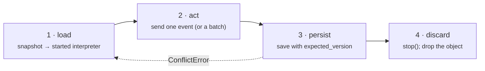

# Persistence Stores

An interpreter is process memory. Under gunicorn or uvicorn workers, in a Celery task, or when two requests arrive for the same order, "keep it in RAM" is wrong. Every durable system converges on the same four-step loop:



`xstate_statemachine.persistence` gives that loop a **store**: a small protocol with three zero-dependency backends, an optimistic-locking token on every record, and a pair of helpers that do steps 1 and 3 for you. Django, SQLAlchemy and Redis backends (later issues) implement the same protocol.

## The loop in six lines

```python
from xstate_statemachine import MachineLogic, create_machine
from xstate_statemachine.persistence import (
    ConflictError, MemoryStore, load_interpreter, save_interpreter,
)

cfg = {"id": "order", "initial": "cart", "context": {"items": 0},
       "states": {"cart": {"on": {"ADD": {"actions": "add"}, "CHECKOUT": "paid"}},
                  "paid": {"type": "final"}}}
def add(i, ctx, e, a):
    ctx["items"] += 1
machine = create_machine(cfg, logic=MachineLogic(actions={"add": add}))
store = MemoryStore()                         # swap for FileStore / SQLiteStore

def handle(key: str, event: str) -> None:
    while True:                               # the optimistic retry loop
        interp, version = load_interpreter(store, key, machine)   # started
        try:
            interp.send(event)
            save_interpreter(store, key, interp, expected_version=version)
            return
        except ConflictError:
            continue                          # someone saved first: reload, redo
        finally:
            interp.stop()                     # discard

handle("order-42", "ADD")
handle("order-42", "ADD")
interp, version = load_interpreter(store, "order-42", machine)
assert interp.context["items"] == 2 and version == 2
interp.stop()
```

`load_interpreter` returns a **started** `SyncInterpreter` and the record's version — `0` when the key did not exist yet, so the first `save_interpreter(expected_version=0)` succeeds only if nobody else created the record in between. For the async engine use `await aload_interpreter(...)`.

## Choosing a backend

| Backend | Good for | Not for | Locking |
|:--|:--|:--|:--|
| `MemoryStore()` | Tests; a single process that may restart without needing durability; CLI tools. | Anything with two processes — the data lives in this process only. | Optimistic (`expected_version`) + per-key `threading.Lock`. |
| `FileStore(directory)` | One host, a few processes, no database wanted (dev server with reload, a cron job beside a web worker). | **Network shares (SMB/NFS)** — advisory locks are unreliable there and `os.replace` is not atomic across them. High write rates. | Optimistic + advisory lock file per key (`fcntl.flock` / `msvcrt.locking`) with stale-lock reclaim. |
| `SQLiteStore(path)` | One host, many processes (gunicorn workers + Celery), thousands of keys, durability, real transactions. | Several hosts (use Redis or a server database); a database file on a network share (warns, falls back to `journal_mode=DELETE`). | Optimistic via `UPDATE … WHERE version = ?` + pessimistic `lock()` via `BEGIN IMMEDIATE`; WAL mode; connection per thread. |

Every backend passes the same contract test suite (`tests/persistence/test_store_contract.py`), so switching is a one-line change.

## What a record holds

```python
from xstate_statemachine import SyncInterpreter, create_machine
from xstate_statemachine.persistence import MemoryStore, StoredSnapshot

machine = create_machine({"id": "m", "version": "3", "initial": "a", "states": {"a": {}}})
interp = SyncInterpreter(machine).start()
store = MemoryStore()

version = store.save("m-1", interp.get_snapshot(), machine_version=machine.version or "")
record = store.load("m-1")
assert isinstance(record, StoredSnapshot)
assert (record.key, record.version, record.machine_version) == ("m-1", 1, "3")
assert record.deadlines == ()          # durable timers land here (#264)
interp.stop()
```

| Field | Meaning |
|:--|:--|
| `snapshot` | The JSON string exactly as `get_snapshot()` produced it. |
| `version` | Per-key record version, `1` on first save, `+1` per save. The optimistic-locking token. |
| `machine_version` | The chart's `"version"` label at save time (`""` if none) — what the snapshot migrator dispatches on. |
| `updated_at` | Epoch seconds of the last save. |
| `deadlines` | Durable `after` timers (`persistence.Deadline`), for timers that must fire hours after a restart. |

## Optimistic vs pessimistic

**Optimistic** (`save(..., expected_version=n)`) is the default and the right choice almost always: no lock is held while your event runs, and a lost race costs one reload. `ConflictError` carries `.expected` and `.actual` so a supervisor can see how contended a key is.

**Pessimistic** (`with store.lock(key, timeout=10):`) is for the rare step that must not be retried — an action with an external side effect that is not idempotent. `LockTimeoutError` is raised if the lock cannot be taken in time; for `SQLiteStore` this also covers SQLite's own `database is locked`, so you never see a bare `sqlite3.OperationalError`. The lock is per key on `MemoryStore` / `FileStore` and database-wide on `SQLiteStore` (SQLite has no row locks — the honest granularity).

```python
from xstate_statemachine.persistence import MemoryStore, LockTimeoutError
import threading

store = MemoryStore()
with store.lock("order-1", timeout=1):
    def contender():
        try:
            with store.lock("order-1", timeout=0.1):
                raise AssertionError("must not get in")
        except LockTimeoutError:
            print("blocked, as expected")
    t = threading.Thread(target=contender); t.start(); t.join()
```

## `persisted()` — the safe pattern as a `with` block

The retry loop above is what every handler ends up writing. `persisted()` writes it for you, with a **lock strategy** deciding how concurrent writers are coordinated:

```python
from xstate_statemachine import MachineLogic, create_machine
from xstate_statemachine.persistence import MemoryStore, persisted

cfg = {"id": "order", "initial": "cart", "context": {"items": 0},
       "states": {"cart": {"on": {"ADD": {"actions": "add"}, "PAY": "paid"}},
                  "paid": {"type": "final"}}}
def add(i, ctx, e, a):
    ctx["items"] += 1
machine = create_machine(cfg, logic=MachineLogic(actions={"add": add}))
store = MemoryStore()

with persisted(store, "order:42", machine) as order:       # load (started)
    order.send("ADD")                                        # act
    order.send("ADD")
# persist on clean exit; the interpreter is stopped (discarded)

with persisted(store, "order:42", machine) as order:
    assert order.context["items"] == 2
    receipt = order.send("PAY", wait=True)
    assert receipt.changed
assert store.load("order:42").version == 2
```

Two rules make the block predictable:

1. **An exception inside the block writes nothing.** The store is exactly as it was; the interpreter is stopped. Your `try`/`except` around the block *is* the transaction boundary.
2. **A block cannot be re-run.** Under the default `OptimisticLock`, if another writer saved between your load and your exit, the exit raises `ConflictError` and *you* retry the whole block. When you want the library to retry for you, hand it a callable instead: `persisted_retry(store, key, machine, lambda i: i.send("ADD"))`.

```python
from xstate_statemachine import MachineLogic, create_machine
from xstate_statemachine.persistence import ConflictError, MemoryStore, persisted, persisted_retry

cfg = {"id": "c", "initial": "s", "context": {"n": 0},
       "states": {"s": {"on": {"T": {"actions": "inc"}}}}}
def inc(i, ctx, e, a):
    ctx["n"] += 1
machine = create_machine(cfg, logic=MachineLogic(actions={"inc": inc}))
store = MemoryStore()

with persisted(store, "k", machine):
    pass                                   # create the record (version 1)

try:
    with persisted(store, "k", machine) as i:
        persisted_retry(store, "k", machine, lambda x: x.send("T"))   # a concurrent writer
        i.send("T")
except ConflictError as exc:
    print(f"conflict: expected v{exc.expected}, found v{exc.actual}")  # block's work discarded

persisted_retry(store, "k", machine, lambda i: i.send("T"))            # retries until it wins
with persisted(store, "k", machine) as i:
    assert i.context["n"] == 2
```

For the async engine use `async with apersisted(store, key, machine) as interp:` — *store* may be a sync store (calls go through the executor) or an `as_async()` adapter.

**The async block settles before it saves (#263 battle).** `await interp.send("PAY", wait=True)` resolves at the end of *that event's* macrostep. When the step entered a state with a plain `def` service, the service's completion is the *next* macrostep — per SCXML — and the run loop starts it at once; if that step enters a second `def` invoke (authorise → capture), the machine is mid-step exactly when your block exits. The sync engine's `send()` drains the whole chain before returning, so `persisted()` never had this problem; `apersisted()` now closes the gap by `await`ing `interp.await_settled(settle_timeout)` before the snapshot (default `DEFAULT_SETTLE_TIMEOUT`, 30 s — it only ever waits while a service is genuinely running). The same settle runs inside the Starlette / FastAPI / Litestar / Quart registries before the receipt body is built, so the `200` a caller reads is what the store holds. `settle_timeout=0` opts out: a mid-step machine is then refused with `SnapshotMidStepError`, as before — loud, never torn. A fired or armed `after` is *not* owed work (a machine sitting on a live SLA timer is settled), so a block on a timer-heavy chart does not wait out the timer.

### What `persisted()` promises

Every row is asserted by `tests/persistence/test_battle_260_locking_semantics.py` on `MemoryStore`, `FileStore` and `SQLiteStore`, sync and async:

| Situation | What happens |
|:--|:--|
| Block exits cleanly | save (version +1) → plugin marks written → lock released → `after_commit` callbacks run in registration order |
| **Block sends nothing** | **still saves, version +1.** A read-only block under `OptimisticLock` can therefore get `ConflictError` if a writer committed meanwhile — use `store.load()` for pure reads |
| Body raises (even after reaching `final`) | nothing written: version and snapshot bytes identical; marks discarded; callbacks dropped; interpreter stopped |
| Machine reaches `final` in the body | saved with status `done`; later blocks hydrate it as done (never recreated); `send()` returns a receipt carrying `InterpreterStoppedError`, `changed=False` |
| Save raises `ConflictError` / `StoreError` | marks discarded; callbacks dropped; the error propagates as-is |
| A plugin's mark fails | the snapshot is **already saved**; the other plugins still mark; the error propagates; callbacks dropped — this is the documented crash window between save and mark (a conservative duplicate, never a loss) |
| An `after_commit` callback raises | the save is already durable; **every** remaining callback still runs; the first error is re-raised. Do not retry the block |
| `async def` callback | awaited inside `apersisted()`; `TypeError` under `persisted()` (it was silently never run) |
| Nested `persisted()` on **another** key | its own commit: saves at its own exit **and runs its own `after_commit` callbacks then**, whatever the outer block does later (a committed save never loses its publish). A nested scope on the **same** key shares the outer commit and defers to it |
| Callbacks across threads / asyncio tasks | isolated per block (a `ContextVar`) — no cross-talk |
| `create_if_missing=False`, key missing | `KeyNotFoundError` before the body runs |
| The interpreter you receive | started; `store_key` set; `wall_now()` from the injected `clock`; `plugins=` attached before `start()` |
| Default `lock=OptimisticLock()` | one shared instance; stateless (8 threads × 125 blocks, exact) |
| `OptimisticLock`, `with` block | `ConflictError` on the **first** conflict (a block cannot be re-run) |
| `OptimisticLock`, `lock.run()` / `persisted_retry()` | `fn` **and its actions** run up to `retries + 1` times; `ConflictError.attempts` set when exhausted; jittered backoff within the `RetryPolicy` bounds; any other exception raised once, no retry |
| `PessimisticLock` | writers serialise; `LockTimeoutError` at the `timeout`; lock released on error and before callbacks; saves still carry `expected_version`, so an expired lock yields `ConflictError`, never a lost update |
| `NoLock` | last writer wins — a real lost update (pinned so it cannot regress silently in either direction) |
| `lock=` that is not a strategy (`"none"`, `5`) | `ValueError` naming `OptimisticLock` / `PessimisticLock` / `NoLock` |

**Cost.** `persisted()` is 1.00–1.09× a hand-rolled `load → from_snapshot → send → save(expected_version)` on `MemoryStore` and `SQLiteStore`; `PessimisticLock` on SQLite is *faster* (0.89×) because `BEGIN IMMEDIATE` makes the load and the save one transaction.

**When something fails inside the block** — each row injected by `tests/persistence/test_battle_260_locking_failures.py` on every store, sync and async:

| Where it fails | You see | On disk | Lock |
|:--|:--|:--|:--|
| `load` (`StoreError`, `SnapshotCorruptError`, `SnapshotTooLargeError`, `OSError`) | that exception, unwrapped; body never runs | unchanged | released |
| snapshot is for a **different machine id** | `SnapshotDriftError`; body never runs; `verify_machine_hash=False` does **not** bypass this (identity, not hash) | unchanged | released |
| snapshot has a **changed structure** | `SnapshotDriftError` unless `verify_machine_hash=False` (now forwarded, with `expected_machine_hash`) | unchanged | released |
| `save` (`ConflictError`, `StoreError`, `OSError`) | that exception; **the body's side effects already happened**; `after_commit` dropped | unchanged, version not bumped | released |
| `lock.__enter__` → `LockTimeoutError` | body never runs | unchanged | never taken |
| `lock.__exit__` raises | that exception, **after** the save (the save happens inside the lock — no lost-update window) | new version committed | released |
| body raises (anything, incl. `KeyboardInterrupt` / `CancelledError` / `SystemExit`) | the exception | nothing written | released |
| `start()` under `actionErrorPolicy: "fail"` | body sees a stopped interpreter | stopped state persisted; the next block raises `InvalidConfigError` | released |
| plugin raises in `on_interpreter_start` | nothing — contained | normal | normal |
| migrator step raises / no step for the version | the step's error / `MachineVersionMismatchError` | unchanged, still the old version | released |
| `ConflictError` raised **by the body** | retried by `lock.run()` / `persisted_retry()`, bounded by `retries`; propagates from a `with` block | — | released |

`load_interpreter(create_if_missing=True)` returns a *started* interpreter at version 0 and does not save until you do. `OptimisticLock(retries=…, backoff=…)` raises `TypeError` for a non-int `retries` (bool included) or a non-`RetryPolicy` `backoff`, and `ValueError` for a negative `retries`. `apersisted()` on a sync store closes the `as_async` adapter it created, on success and on error (1 000 cycles: thread count flat).

## Concurrency: choosing a lock

| Strategy | What it does | Choose it when | Cost of a race |
|:--|:--|:--|:--|
| `OptimisticLock(retries=5, backoff=RetryPolicy(...))` **(default)** | load → act → `save(expected_version)`; on `ConflictError` reload and re-apply the callable, with jittered backoff. | Almost always. Short steps; contention is the exception. | One reload + re-run per conflict. **Actions may run up to `retries + 1` times** per logical send — keep side effects in services or an outbox (or dedupe them with the [inbox](#idempotency-the-inbox)). |
| `PessimisticLock(timeout=10)` | `with store.lock(key)`: load → act → save. Other writers wait, then `LockTimeoutError`. Saves **with** `expected_version` as a fence, so on a store whose lock can expire (Redis) an expired lock yields `ConflictError`, never a lost update. | A step with a non-idempotent external side effect that must not be re-run; long steps where a retry would be wasteful. | Writers serialise; a slow holder delays everyone on that key (whole database on SQLite). |
| `NoLock()` | load → act → save unconditionally. Last writer wins. | Exactly one writer per key by construction (one consumer per partition, a CLI). | A lost update, silently. Exists so the choice is explicit. |
| [`IdempotencyPlugin`](#idempotency-the-inbox) | Dedupe by event id *before* the machine sees it; a redelivery gets the original receipt. | Retried webhooks / at-least-once brokers. | Complements a lock; does not replace one. |

Each `persisted()` block (and each call of the callable under `persisted_retry`) gets its **own** interpreter; the engine is never shared across threads.

> **`OptimisticLock` + `FileStore` under heavy same-key contention.** Each `FileStore.save` takes the OS file lock for its read-compare-write and waits at most **10 s** for it. Sixteen threads hammering one key with fsync'd saves starved a few calls past that on a slow CI runner: they raised `LockTimeoutError` — loud, never a lost update, every call that returned was counted exactly once. If you expect that contention profile on one key, use `PessimisticLock` (one lock around the whole step, writers queue in order) or `SQLiteStore` (24 µs saves, no starvation observed).

```python
import threading
from xstate_statemachine import MachineLogic, create_machine
from xstate_statemachine.persistence import MemoryStore, OptimisticLock, PessimisticLock, persisted, persisted_retry

cfg = {"id": "c", "initial": "s", "context": {"n": 0},
       "states": {"s": {"on": {"T": {"actions": "inc"}}}}}
def inc(i, ctx, e, a):
    ctx["n"] += 1
machine = create_machine(cfg, logic=MachineLogic(actions={"inc": inc}))

for lock in (OptimisticLock(retries=100), PessimisticLock(timeout=30)):
    store = MemoryStore()
    def worker():
        for _ in range(25):
            persisted_retry(store, "k", machine, lambda i: i.send("T"), lock=lock)
    threads = [threading.Thread(target=worker) for _ in range(8)]
    for t in threads: t.start()
    for t in threads: t.join()
    with persisted(store, "k", machine, lock=lock) as i:
        assert i.context["n"] == 200, type(lock).__name__     # no lost updates
```

## Safety rails every store enforces

- **Size cap.** `max_snapshot_bytes` (default 1 MiB) is checked on save *and* load — `SnapshotTooLargeError`. A record another writer poisoned cannot make a reader allocate unboundedly.
- **Key validation.** Non-empty `str`, ≤ 200 characters, no NUL — `InvalidKeyError`. `FileStore` additionally refuses anything path-like and never puts the raw key in a path: keys are percent-encoded (reversibly, case-preserving, so `Order` and `order` never collide on a case-insensitive filesystem) and Windows device names are prefixed.
- **`forget(key)`** erases the record *and* everything auxiliary (deadlines, lock files) and reports counts — the right-to-erasure hook.
- **Codec seam.** `codec=` takes any `encode(str) -> str` / `decode(str) -> str` pair, so compression or encryption at rest is a constructor argument, not a backend fork.
- **Atomic writes.** `FileStore` writes to a temp file in the same directory, fsyncs, then `os.replace`s — a reader sees the old record or the new one, never a torn one. A fault hook in the tests simulates a crash between fsync and rename and asserts the previous record is intact.
- **Permissions.** `FileStore` directory `0700`, files `0600`; `SQLiteStore` creates the database (and its `-wal` / `-shm` siblings) `0600`.
- **Schema versioning.** `SQLiteStore` keeps an `xsm_schema(version)` table with explicit upgrade steps; a database written by a newer library is refused, never guessed at. Current schema is **v2** (adds the `deadlines(key)` index); a v1 file from 0.11.0 is upgraded in place on open.
- **`health()`** on every store — a cheap liveness probe for your readiness endpoint.

### What every backend agrees on

The battle test for the stores (`tests/persistence/test_battle_259_stores_corruption_scaling.py`) drives the same contract matrix through `MemoryStore`, `FileStore`, `SQLiteStore` and the `as_async` view of each, and asserts identical answers. This is the contract you can code against without knowing which backend is configured:

| Call | Every backend |
|:--|:--|
| `load(missing)` | `None` — never raises |
| `delete(missing)` / `forget(missing)` | `False` / zero counts — never raises |
| `save(key, snap, expected_version=0)` on a missing key | creates it; returns `1` |
| `save(..., expected_version=None)` | unconditional write |
| wrong `expected_version` | `ConflictError` with `.expected` and `.actual` (`None` when the key is missing) |
| `version` | starts at 1, +1 per save, restarts at 1 after `delete` |
| `updated_at` | epoch seconds (`time.time()`), non-decreasing |
| `list_keys()` order | sorted by code point (upper-case before lower-case) |
| `list_keys(limit=0 / -1 / 10**9)` | `[]` / `ValueError` / every key |
| `list_keys(prefix=...)` | `%` and `_` are literal (no SQL-LIKE semantics leak); never lists a key `load()` would refuse |
| **pagination** | **none** — `limit` truncates silently; page by narrowing `prefix` |
| a damaged record on `load()` | `SnapshotCorruptError` — never a bare `ValueError` / `TypeError` / `OSError` / `sqlite3.*` (every byte of a record flipped, truncated and inserted; every envelope field given a wrong type) |
| a file that is not a SQLite database | `StoreError` from the `SQLiteStore` constructor |
| a codec that raises or returns non-`str` | `SnapshotCorruptError` on load, `StoreError` on save |
| bad `save()` arguments (non-`str` snapshot, non-int `expected_version`, non-`str` `machine_version`, non-`Deadline` deadlines, a lone surrogate anywhere) | the same `TypeError` / `InvalidKeyError` / `SnapshotCorruptError` on every backend, at the call site |
| unknown envelope keys | ignored on load; **not** preserved on the next save |

Two costs differ and are worth knowing before you pick a backend. **`list_keys` is O(total keys) on `MemoryStore` and `FileStore`** however small `limit` is (Memory sorts every key; File lists and decodes the whole directory — 1 ms at 100 keys, 24 ms at 2 000, 14 s to *fill* 10 000) and flat on `SQLiteStore` (16 µs). And **`FileStore.save` is milliseconds** (2.8 ms, `fsync` off; an atomic temp-write-replace) where SQLite is tens of microseconds (24 µs) and Memory is one. `save` / `load` / `delete` are O(1) in store size on all three *in code*; FileStore.save renames into a directory of *n* entries, which is flat on NTFS and ext4 but read ~8× slower at 2 000 keys than at 100 on APFS (macOS CI) — a filesystem property worth knowing before putting tens of thousands of instances in one FileStore directory. Memory does not grow over 10 000 save→load→delete cycles on any backend (0 B attributed to the library); SQLite keeps one connection per thread and `close()` really closes it; file handles are stable.

### Operations: what the failures look like

Every row below was *injected* by `tests/persistence/test_battle_259_stores_crash_concurrency.py` — real `kill -9` of a writer child at every step of `FileStore.save`, `ENOSPC` at every syscall, Windows sharing violations, two processes on one lock — and the behaviour described is what the test asserts.

| Failure | What you see | What to do |
|:--|:--|:--|
| **Writer killed mid-save** (any step: temp created, written, fsynced, renamed, lock written, unlocked) | On restart `load()` is the old record **or** the new one, never torn; `version` only ever goes up; `list_keys` never lists a temp file; the next writer proceeds in under 2 s (the OS lock dies with the process). SQLite: every committed save survives a kill mid-WAL-checkpoint, and deleting `-wal`/`-shm` between clean runs loses nothing. | Nothing. Temp files a killed writer left are swept by the next `FileStore(...)` once older than `stale_lock_after`. |
| **Disk full** (`ENOSPC` at write / fsync / rename, or at SQLite `COMMIT`) | `FileStore` raises `OSError`; `SQLiteStore` raises `StoreError` (`database or disk is full`). The previous record is intact; no temp file is left; **the same store object keeps working** once space returns. | Free space, retry. |
| **Windows sharing violation** on `os.replace` | The store's own readers never block a writer (they open with `FILE_SHARE_DELETE`; a refused rename falls back to POSIX-semantics rename, and readers keep the old bytes). A *foreign* process holding the file (backup tool, antivirus, an editor) is retried ~0.5 s (20 × 25 ms), then `PermissionError` with the old record intact. | Exclude the store directory from real-time scanning. |
| **Lock held by a crashed process** | Reclaimed immediately — the next writer proceeds in under 1 s. | Nothing. |
| **Lock held by a slow, live process** | Never stolen. Waiters get `LockTimeoutError` at the documented `timeout`, naming the holder's `pid` and timestamp. | Tune `timeout`, or find the slow holder. |
| **Pointed at the wrong file** (not SQLite, a foreign `statecharts` table, a newer `xsm_schema`) | `StoreError` **from the constructor**, naming the file. | Use the store's own file. |
| **Read-only database / `EACCES` directory** | `StoreError` / `OSError` at construction or first save, with the old record intact. | Fix permissions. |
| **Long keys** | Keys up to 200 characters always work; an encoded name over 200 chars (CJK, a 200-char ASCII key) is stored under `~<sha256>.xsm.json` and `list_keys` recovers the key from the record body. 201+ → `InvalidKeyError`. Keys differing only by case are always separate records, on every filesystem. | Nothing. |
| **`as_async` + `PessimisticLock`** | **One lock per adapter at a time** — the single worker thread can be inside one transaction / one held key. Inside `async with adapter.lock(...)`: work you fan out with `gather` / `create_task` / a `TaskGroup` is still "the holder" (the token is a `ContextVar`, inherited by the subtree) and runs at once; calls from *unrelated* tasks on that adapter wait, bounded by `adapter.gate_timeout` (10 s → `LockTimeoutError`); a *nested* `adapter.lock()` is refused immediately with a message naming the fix. Separate adapters are independent. 1 000 concurrent callers queue; `close()` waits for in-flight work; a call after `close()` is `StoreError`. | One `as_async(store)` per concurrently-locked key, or `OptimisticLock` (which never takes the adapter lock). |

## asyncio

The stdlib stores are synchronous (file and SQLite I/O block). `as_async(store)` runs each call in the default executor and exposes the same surface with `await`; `lock()` becomes an `async with`, acquired and released on one dedicated worker thread because file and SQLite locks are thread-affine.

```python
import asyncio
from xstate_statemachine import create_machine
from xstate_statemachine.persistence import MemoryStore, aload_interpreter, as_async, save_interpreter

machine = create_machine({"id": "m", "initial": "a", "states": {"a": {"on": {"GO": "b"}}, "b": {}}})
store = MemoryStore()

async def main():
    interp, version = await aload_interpreter(store, "m-1", machine)   # started Interpreter
    await interp.send("GO", wait=True)
    save_interpreter(store, "m-1", interp, expected_version=version)
    await interp.stop()

    astore = as_async(store)
    record = await astore.load("m-1")
    assert record.version == 1
    async with astore.lock("m-1"):
        assert (await astore.list_keys(prefix="m-")) == ["m-1"]

asyncio.run(main())
```

## Idempotency: the inbox

Every broker, webhook provider (Stripe, GitHub, Twilio) and retrying HTTP client delivers **at least once**. Duplicate deliveries double-credit wallets and double-ship orders. The fix is deduplication at the consumer keyed by a stable event id — the *inbox* pattern — and `IdempotencyPlugin` makes it an attachable plugin: duplicates are answered from the inbox **before the machine sees them**, with the *same* receipt the first delivery got.

```python
from xstate_statemachine import MachineLogic, SyncInterpreter, create_machine, receipt_to_status
from xstate_statemachine.persistence import IdempotencyPlugin, MemoryInbox

# A Stripe-shaped webhook consumer: `event.id` ("evt_…") is the natural key.
cfg = {"id": "wallet", "initial": "open", "context": {"balance": 0},
       "states": {"open": {"on": {"payment_intent.succeeded": {"actions": "credit"}}}}}
def credit(i, ctx, e, a):
    ctx["balance"] += e.payload["amount"]
machine = create_machine(cfg, logic=MachineLogic(actions={"credit": credit}))

inbox = MemoryInbox()                                  # or SQLiteInbox(store)
plugin = IdempotencyPlugin(
    inbox,
    principal=lambda e: e.payload["account"],          # X0.2: scope by tenant, always
    key=lambda e: e.payload.get("id"),                 # Stripe's event id
)
wallet = SyncInterpreter(machine).use(plugin).start()

def webhook(body: dict) -> int:
    receipt = wallet.send(body["type"], wait=True, **body)
    return receipt_to_status(receipt)

first = {"type": "payment_intent.succeeded", "id": "evt_1", "account": "acct_A", "amount": 500}
assert webhook(first) == 200 and wallet.context["balance"] == 500
assert webhook(first) == 200 and wallet.context["balance"] == 500     # redelivery: same answer, credited once
assert webhook({**first, "amount": 999}) == 422                        # same id, different payload: refused
assert webhook({**first, "account": "acct_B"}) == 200                  # another tenant's evt_1 is a new event
assert wallet.context["balance"] == 1000
```

What the plugin does, on both engines:

| Situation | Outcome |
|:--|:--|
| Key unseen | The key is **claimed** (atomically — first delivery wins across workers), the event enters the machine, and after its macrostep the real `Receipt` is **marked** in the inbox. |
| Key seen, same fingerprint, receipt stored | The send is short-circuited with the **original** receipt, `duplicate=True`. `receipt_to_status` → the original status. |
| Key seen, **different** fingerprint | Refused: `receipt.error` is `IdempotencyMismatchError`, status **422**. Keys must not be reused with a different payload. |
| Key seen, first delivery still in flight | Refused: `IdempotencyInFlightError`, status **409** — the client retries shortly. |
| Delivery failed before it took effect | The claim is released so a retry is admitted. |
| No key on the event | Not deduplicated. |

A refusal is a **receipt, not an exception**: plugin hooks are contained (a raising hook would admit the event), so the plugin answers with a receipt whose `error` says why. Use `send(wait=True)` at an ingress and read `receipt.error` / `receipt_to_status`.

**Scope** is `principal / machine id / instance key` — never just the actor id. `principal` is required: two tenants reusing `evt_1` must not collide, and a tenant must not be able to replay another's outcome. The instance key defaults to the store key `persisted()` loaded the machine under.

**Fingerprint** is `sha256(event type + canonical JSON payload minus the key field)`, so a reused key with a different body is detectable. Keys are ≤ 255 printable ASCII characters.

**TTL** defaults to 7 days (Stripe's window); `inbox.purge_expired()` reclaims space; `inbox.forget(scope)` erases a tenant.

### Guarantees — at-least-once + inbox, never exactly-once

> **What you get:** a duplicate delivery is answered without the machine processing it again, and the answer is the one the first delivery produced. **What you do not get:** exactly-once side effects. The inbox covers the *state transition*; an action that calls an external API is still an action that ran once per admitted event. Put side effects in services, or behind an outbox.

Crash consistency (X0.3) — the mark must be visible *iff* the snapshot containing the effect is:

1. **Shared backend.** When the inbox and the state store share a database (`SQLiteInbox(store)` on the same `SQLiteStore`), `persisted()` buffers the mark and writes it right after the snapshot save — inside the same `BEGIN IMMEDIATE` transaction under `PessimisticLock`, so they commit or roll back together.
2. **Separate backends.** Save, then mark. The window between them is covered by a bounded ring of the last 64 processed keys that travels **inside the snapshot** (`context["__xsm_processed_ids__"]`): a redelivery that finds the key *in flight* in the inbox but *processed* in the snapshot is the crash window, and is answered as a duplicate and the inbox repaired.

Three fault-injection tests pin this: crash before save (no mark, retry is a first delivery), crash between save and mark (caught by the ring), crash after mark (plain duplicate).

### When the inbox itself is down — `on_inbox_error`

> **The trade-off, stated plainly.** Plugin hooks are fail-open by design (a raising hook admits the event). Before this battle test, that meant an inbox *backend* failure — `get` or `claim` raising `StoreError` / `OSError` / `sqlite3.Error`, or a SQLite lock timeout — let **the keyed event run with no deduplication**, with a perfectly normal receipt (`changed=True, duplicate=False`) and `on_plugin_error` as the only trace. The #261 battle test drove a dead inbox and watched the action run twice for one key with nothing on either receipt; it also found that `apersisted` + `PessimisticLock` + a shared `SQLiteInbox` hit that path on *every* send.
>
> The default is now **`on_inbox_error="refuse"`**: the receipt carries **`InboxUnavailableError`** (`receipt_to_status` → **503**, "retry later"), the action never runs, nothing is claimed. The whole point of the plugin is to not run twice, so a dead inbox must not quietly switch dedup off. `IdempotencyPlugin(..., on_inbox_error="admit")` opts back into availability for a webhook endpoint whose sender retries anyway and tolerates a duplicate — **alert on `on_plugin_error`** there, it is the only signal. The plugin's own refusals — mismatch (422), in-flight (409), an un-fingerprintable payload — are the same in both modes.

| `on_inbox_error` | inbox `get`/`claim` raises (or the lock times out) → | receipt | action |
|:--|:--|:--|:--|
| `"refuse"` **(default)** | event refused | `error=InboxUnavailableError(key, cause)`, `duplicate=True`, HTTP 503 | never runs |
| `"admit"` | event admitted, `on_plugin_error` fires | normal (`duplicate=False`) | **runs** — possibly a duplicate |

**Crash windows, as measured.** A child process is killed (`os._exit(9)`) at each step of claim → action → save → mark, the parent restarts on the same database and redelivers the same payload, then a different payload on a copy. In every cell the committed effect is exactly one or zero; **the action never runs twice on top of a committed save**, sync and `apersisted` alike:

| Killed … | `SQLiteInbox(store)` + `OptimisticLock` | `SQLiteInbox(store)` + `PessimisticLock` | `MemoryInbox` |
|:--|:--|:--|:--|
| after claim | **409** in flight until `ttl_s` / 422 | admitted / admitted (claim rolled back with the transaction) | admitted / admitted |
| after action, before save | 409 / 422 | admitted / admitted | admitted / admitted |
| after save, before mark | duplicate / 422 (the in-snapshot ring) | admitted / admitted (one transaction, rolled back) | duplicate / 422 — the snapshot now carries *when* each ring key was processed and with which fingerprint, so a non-durable inbox lost after the save is still caught within `ttl_s` |
| after mark | duplicate / 422 | admitted / admitted | duplicate / 422 |

(same payload / different payload). Two things the table makes visible: a kill right after the claim leaves that key **409 for the full `ttl_s`** (7 days by default — there is no shorter lease on in-flight claims; purge or `forget` it, or set a shorter `ttl_s`), and a `PessimisticLock` body on a shared SQLite inbox is one transaction, so every kill before the commit is a clean redelivery.

**TTL semantics** (`ttl_s`, default 24 h): both the in-flight claim and the final mark expire after `ttl_s`; after that the key is *new* — so `ttl_s` bounds the dedup window **and** the "same original receipt" promise. `None` never expires (a crashed worker then blocks that key until you `purge()` or `forget()` it). `0` makes every send fresh. Negative, NaN or non-numeric → `ValueError` at construction (they used to silently disable dedup). A wall clock jumping *backwards* never purges early; forwards past `ttl_s` purges. **Keys** are at most 255 printable ASCII characters, case-sensitive and byte-exact; non-ASCII and control characters are refused with a typed receipt. **Scope** footgun: two in-memory interpreters of one machine that share an id or `instance_key` share an inbox scope — pass `instance_key=` per instance (a `persisted()` block uses its store key automatically).

**Cost** (Windows, 3.14): bare send 14 µs; with the plugin on `MemoryInbox` 64 µs; on `SQLiteInbox` 178 µs. `MemoryInbox` ≈ 377 B per entry and `purge_expired()` reclaims it; a 10 000-row `SQLiteInbox` is 2.8 MB, `purge` of 10 000 expired rows 6.8 ms (indexed), 0 expired rows 0.03 ms.

```python
from xstate_statemachine import MachineLogic, create_machine
from xstate_statemachine.persistence import IdempotencyPlugin, SQLiteInbox, SQLiteStore, persisted
import tempfile, pathlib

cfg = {"id": "wallet", "initial": "open", "context": {"balance": 0},
       "states": {"open": {"on": {"CREDIT": {"actions": "credit"}}}}}
def credit(i, ctx, e, a):
    ctx["balance"] += e.payload["amount"]
machine = create_machine(cfg, logic=MachineLogic(actions={"credit": credit}))

db = pathlib.Path(tempfile.mkdtemp()) / "app.db"
store = SQLiteStore(db)
inbox = SQLiteInbox(store)                       # shares the file AND the transaction
dedupe = IdempotencyPlugin(inbox, principal=lambda e: "acct_A")

for _ in range(3):                               # the same webhook, delivered three times
    with persisted(store, "wallet:acct_A", machine, plugins=[dedupe]) as w:
        w.send("CREDIT", idempotency_key="evt_1", amount=500)

with persisted(store, "wallet:acct_A", machine, plugins=[dedupe]) as w:
    assert w.context["balance"] == 500           # credited exactly once
store.close()
```

## Audit log & replay

"Who approved this and why?" is answered by grepping Slack in most codebases. `AuditPlugin` writes an append-only record for **every processed event** — including the ones that were refused — from the same plugin hook that observed the outcome, so the audit can never disagree with the state. The log doubles as *event sourcing lite*: `replay()` re-runs the recorded events from context₀ and asserts every step lands where it was recorded.

```python
from xstate_statemachine import MachineLogic, SyncInterpreter, create_machine
from xstate_statemachine.persistence import AuditPlugin, MemoryLog, replay

# An approval workflow: every decision carries who made it and why.
cfg = {"id": "expense", "initial": "submitted", "context": {"amount": 1200},
       "states": {
           "submitted": {"on": {"APPROVE": {"target": "approved", "guard": "underLimit"},
                                "ESCALATE": "escalated", "REJECT": "rejected"}},
           "escalated": {"on": {"APPROVE": "approved", "REJECT": "rejected"}},
           "approved": {"type": "final"}, "rejected": {"type": "final"}}}
logic = MachineLogic(guards={"underLimit": lambda ctx, e: ctx["amount"] <= 1000})
machine = create_machine(cfg, logic=logic)

log = MemoryLog()                       # or JSONLinesLog(path) / SQLiteLog(store)
expense = SyncInterpreter(machine).use(AuditPlugin(log)).start()

expense.send("APPROVE", actor="alice", reason="looks fine")          # guard says no: recorded as denied
expense.send("ESCALATE", actor="alice", reason="over my limit")
expense.send("APPROVE", actor="bob", reason="Q3 travel budget", correlation_id="req-7f3a")

for r in log.read("expense"):
    print(r.seq, r.event_type, r.disposition, r.actor, r.reason, "->", r.to_states[-1].split(".")[-1])
# 1 APPROVE denied alice looks fine -> submitted
# 2 ESCALATE transition alice over my limit -> escalated
# 3 APPROVE transition bob Q3 travel budget -> approved

rebuilt = replay(machine, log.read("expense"))   # re-run from context₀ on a SimulatedClock
assert rebuilt.current_state_ids == expense.current_state_ids
```

Each `TransitionRecord` carries: `machine_id` (the store key under `persisted()`, else the interpreter id), a **gap-free `seq`**, `ts` (`interpreter.wall_now()`), `event_type` and a **redacted** `event_payload`, `from_states` / `to_states` (leaves), the `actions` that ran, a `disposition` (`transition` · `denied` · `unhandled` · `deferred` · `error` · `duplicate`), `actor` / `reason` / `correlation_id`, `machine_version`, `engine=True` for timer and service-completion events, and `origin` (`"external"` for a caller's `send()`, `"internal"` for a `raise`, a self-`send()` from an action, or a re-released deferred event — `replay()` re-sends only external records). Records are plain JSON and round-trip through `JSONLinesLog`.

`actor` and `reason` come from the event payload (`actor_key=` / `reason_key=` configurable); `correlation_id` from the payload or, failing that, from the `correlation_id_var` contextvar — set it in your request middleware and every record in that request carries it.

| Store | Good for |
|:--|:--|
| `MemoryLog()` | Tests; in-process inspection. |
| `JSONLinesLog(path)` | An append-only audit file; one JSON object per line; `grep`-able. |
| `SQLiteLog(store)` | Shares the `SQLiteStore` file and per-thread connection, so a record appended inside `persisted(..., lock=PessimisticLock())` lands in the same transaction as the snapshot. |

All three: `read(machine_id, after_seq=, limit=)`, `purge_older_than(cutoff_ts)`, `forget(machine_id)`. `append(rec, connection=None)` is the seam a Django or SQLAlchemy log store uses to join the store's transaction.

### What `replay()` is — and is not

`replay(machine, records, *, upto=None, logic=None, verify=True, key=None, snapshot=None)` returns a started `SyncInterpreter` positioned after the last record. The #262 battle test recorded a chart exercising every outcome kind — denied, deferred, errored under `continue` and `rollback`, a 3-deep `raise` chain, an `always` chain, two `after` rungs, `invoke` with `onDone` and `onError`, nested + parallel + deep history, `final` — on both engines and all three log stores, and asserted the replay lands on the identical configuration:

| | Without `logic=` (default) | With `logic=` |
|:--|:--|:--|
| Active states and `status` | **identical** | **identical** |
| `context` | initial context + built-in `assign` only | identical |
| Action side effects | **none** — stubs | **repeat** (pass real logic only if your actions are idempotent) |
| Services | replayed from the recorded `done` / `error` — never called again | same |
| Re-sent through `send()` | **external** records only | external records only |
| Engine events (`after.*`, `done.invoke.*`, `error.platform.*`) | **never** `send()`'d — timers via the `SimulatedClock`, completions via stub services (a spy on `send()` proves it) | same |
| Divergence check (`verify=True`) | **every record**: event type, `from_states`/`to_states`, `actions`, `disposition`, plus `machine_version` → `ReplayDivergenceError(seq, expected, actual)` with `.field` naming what differed | same |
| A `seq` gap, a purged head, mixed instance keys | **error** — never a silent early stop (a replay over a hole would "succeed" to a wrong state); pass `key=` to filter one instance, `snapshot=` to start from a snapshot and replay the tail | same |
| Logs written before 0.11.0 (no `origin` field) | read as external, so a `raise` chain in them still double-runs — re-record, or replay with `logic=` | same |

This is **event sourcing lite**: the log is a faithful record and a replayable one, but the *snapshot* stays the source of truth for the current state. There is no projection framework, no upcasting of old events, and no guarantee about actions' external effects — those belong to services and an outbox.

### The log and the snapshot after a crash

Records are written **only for committed steps**. Inside a `persisted()` block they are buffered and released at the snapshot save — inside the *same* `BEGIN IMMEDIATE` transaction when `SQLiteLog` shares the `SQLiteStore` under `PessimisticLock`, via `after_commit` otherwise — so a lost optimistic attempt, a block that raised, or a writer killed before the save leaves **no** audit rows. (Before the battle test, records were appended as each event settled, so the log could run ahead of the state.) Child processes killed with `os._exit(9)` after the save and after the append, step 1 committed, step 2 in flight:

| Setup | killed after save | killed after append |
|:--|:--|:--|
| `SQLiteLog(store)` + `PessimisticLock`, sync **and** `apersisted` | snapshot 1 / log 1 | 1 / 1 |
| `JSONLinesLog` + `PessimisticLock` | 1 / 1 | — |
| `OptimisticLock` (either log) | snapshot **2** / log 1 — the snapshot may be one step *ahead*, never behind | 2 / 2 |

`seq` is assigned **atomically by the store** (`append_next`: `MAX(seq)+1` and the insert in one statement on SQLite; under the process lock on Memory/JSONL) — 16 threads × 100 under `OptimisticLock`, `PessimisticLock` and `NoLock`, and 2 processes on one `SQLiteLog` key, are all gap-free. The `NoLock` + audit "unique `seq` constraint" limitation listed in the handover is fixed, not documented. `JSONLinesLog.append_next` is atomic within one process only; use `SQLiteLog` for multi-process writers.

### Backend contract, as measured

| | `MemoryLog` | `JSONLinesLog` | `SQLiteLog` |
|:--|:--|:--|:--|
| Corrupt / foreign record on read | n/a (typed at `append`) | **`LogCorruptError`** naming `path:line` — a torn last line, a non-record line, non-UTF-8, every byte of a 3-record file flipped/truncated/inserted (2 100 mutants); **never skipped** | `LogCorruptError`; a foreign `transitions` table or a non-SQLite file → `StoreError` at construction |
| BOM / CRLF / blank lines | n/a | tolerated (a Windows editor saved the file) | n/a |
| `append` | O(1) | O(1): open-append-close per record, flush, no fsync | O(1), one transaction |
| `next_seq` | O(1) | **O(1)** in steady state — cached per machine while the file size is unchanged; a foreign append, a purge or an external edit forces a rescan (it used to scan the whole file on **every send**: 79 ms at 10 000 records, a quadratic run) | index probe |
| `read(key)` | O(records for that key) | **O(all records in the file)** — use `SQLiteLog` beyond a few thousand records | index probe on `(machine_id, seq)` (`EXPLAIN QUERY PLAN`: SEARCH, no SCAN) |
| Pagination | `after_seq` cursor; `limit` truncates silently (no "more" flag) | same | same |
| `purge_older_than(ts)` | in place | **atomic** temp + fsync + replace; a kill mid-rewrite leaves old or new, never torn, no `.tmp` stranded | one `DELETE` |
| Bad arguments | `read(limit=-1)` / non-int `after_seq` → `ValueError`; `purge_older_than(NaN / -inf / str)` → `ValueError` **and deletes nothing** (NaN used to erase the whole log — every `ts >= NaN` is false); `append` of a non-record / `seq < 1` / non-finite `ts` → `TypeError`/`ValueError` at the call site | same | same |
| Redaction | both plugins redact `event_payload` with `DEFAULT_REDACT_KEYS` by default (nested, list-of-dict, hyphenated keys); the raw file / DB bytes never contain the secret; `redact_keys=()` is the explicit opt-out; `error.message` is free text and **not** redacted; `actor` / `reason` are kept | same | same |

`replay()` loads and sorts the supplied records (O(n) memory, ~9 s and ~8 MB per 100 000 records). Plugin memory is flat over 10 000 sends with a durable store; `MemoryLog` grows by exactly the records and `purge_older_than()` reclaims.

## Versioning in-flight instances

You ship v2 of a machine while 10,000 orders are mid-flight on v1. Temporal needs explicit `patched()` / worker versioning; XState has an open bug restoring child-actor snapshots; no Python FSM library handles it at all. **We do not automatically migrate.** We promise the two things that are honest and valuable:

1. **Every snapshot knows which machine produced it** — `machine_hash` (the structural fingerprint, since 0.8.0) *and* `machine_version` (the chart's `"version"` label, the thing a human reads).
2. **A mismatch fails loudly** — `MachineVersionMismatchError` (a `SnapshotDriftError`) — unless you registered an upcaster for exactly that hop.

```python
from xstate_statemachine import SyncInterpreter, create_machine
from xstate_statemachine.persistence import MachineVersionMismatchError, SnapshotMigrator

v1 = {"id": "order", "version": "1.0", "initial": "paying",
      "states": {"paying": {"on": {"OK": "done"}}, "done": {"type": "final"}}}
v2 = {"id": "order", "version": "2.0", "initial": "payment",
      "states": {"payment": {"initial": "card", "states": {"card": {"on": {"OK": "#order.done"}}}},
                 "done": {"type": "final"}}}

blob = SyncInterpreter(create_machine(v1)).start().get_snapshot()      # written by v1

try:
    SyncInterpreter.from_snapshot(blob, create_machine(v2))            # default: refuse loudly
except MachineVersionMismatchError as exc:
    print(exc.found, "->", exc.expected)                                # 1.0 -> 2.0

migrator = SnapshotMigrator()

@migrator.register("1.0", "2.0")
def rename_paying(blob: dict) -> dict:
    blob["state_ids"] = ["order.payment.card" if s == "order.paying" else s for s in blob["state_ids"]]
    blob["configuration"] = ["order", "order.payment", "order.payment.card"]
    return blob

order = SyncInterpreter.from_snapshot(blob, create_machine(v2), migrator=migrator)
assert order.current_state_ids == {"order.payment.card"}
```

What happens on restore, in order: the **label** is compared (`on_version_mismatch`: `"error"` default · `"warn"` restores as-is · `"migrate"`, the default when a `migrator=` is given); a migration applies the shortest chain of registered steps (`1.0 → 2.0 → 3.0`) to a *copy* of the blob, rewrites `machine_version` and drops `machine_hash` — the structure changed by definition; then the **structural hash** is checked (unless migrated), the layout is upcast, and the blob is validated against *this* machine exactly like any other: every state id must exist (`StateNotFoundError`, never a silent skip), the configuration must be legal, `strict` and event schemas still apply to restored events. A missing hop is `NoMigrationPathError`. Child actors are restored with the same migrator and policy — steps can be scoped with `machine_id="kid"`.

Blobs written before labels existed (0.10.x) restore with a warning — they cannot be checked; a chart that declares no `"version"` never mismatches.

### Rolling out a new version

- **Additive changes first.** A new state, a new event, a new context key with a default: the hash changes but no snapshot needs rewriting — pass `verify_machine_hash=False` for that deploy and bump the label with `on_version_mismatch="warn"`, or register a no-op step so the label is rewritten on the next save.
- **Renames and moves need a step.** Write the upcaster against the *blob* (state ids, `configuration`, `context`), register it for the exact hop, and let `persisted(..., migrator=migrator)` re-save each instance at the new label the first time it is touched.
- **Dual-read window.** Deploy readers that carry the migrator before writers that emit the new label; old readers refuse new blobs loudly rather than half-restoring them (see the [snapshots guide](../snapshots/#rolling-deploys-a-v4-blob-does-not-load-on-010x) for the layout-level version of the same rule).
- **Find what is still stale.** `xsm snapshots --store sqlite:///app.db machine.json --stale` lists the keys whose `machine_version` differs from the chart's (`--json` for scripts) — the drain list for a deploy.

> **Guarantees.** A snapshot is refused, never silently mis-restored, when its label or structure does not match — unless *you* said how to bridge the gap. Migration steps are your code; the library validates their output but cannot know your domain. Child-actor migration is best effort (each child is checked with its own machine; a child with no path fails the whole restore).

## Durable timers

`after` timers are the library's superpower for retries, SLAs, escalations and reminders — and until 0.11.0 they were in-memory tasks that **died with the process**. Under create → act → persist → discard the interpreter is discarded after every request, so a 24-hour `after` never fired. Now the deadline lives **in the snapshot** (`deadlines`, layout v4), indexed by the store, and a scanner wakes the machine when it matures. This deliberately reverses the 0.8.0 "timers are not persisted" decision.

```python
import time
from xstate_statemachine import create_machine
from xstate_statemachine.persistence import DueTimerScanner, MemoryStore, persisted

cfg = {"id": "trial", "initial": "active",
       "states": {"active": {"after": {"3600000": "reminded"}},      # 1 hour
                  "reminded": {"type": "final"}}}
machine = create_machine(cfg)
store = MemoryStore()

with persisted(store, "user:42", machine):          # arms the timer; the deadline is persisted
    pass
now = time.time()
(deadline,) = store.load("user:42").deadlines
assert abs(deadline.due_at_wall - (now + 3600)) < 5

scanner = DueTimerScanner(store, lambda key: machine)   # "another process"
assert scanner.run_once(now=now + 1800) == 0             # not early
assert scanner.run_once(now=now + 3601) == 1             # fires once due
assert scanner.run_once(now=now + 3601) == 0             # idempotent
with persisted(store, "user:42", machine) as trial:
    assert trial.matches("trial.reminded")
```

Each persisted `Deadline` carries `state_id`, `entry_seq` (the state-entry generation, so a deadline armed by an earlier visit to the same state is recognisably stale), `due_at_wall` (epoch seconds from `interpreter.wall_now()`), the **resolved** `delay_ms` (a named or dynamic delay is a number by then) and `event_type`. `interpreter.pending_deadlines()` lists them, soonest first, on both engines.

### Restoring: `restart_timers`

| Value | On `start()` |
|:--|:--|
| `False` | Static restore; timers stay parked (`has_dormant_timers`). |
| `True` / `"restart"` | Re-arm **from zero** — the 0.8.0 behaviour. |
| `"resume"` **(default for `persisted()` / `load_interpreter()`)** | Re-arm with the **remaining** wall time: a 5 s timer snapshotted at 2 s, restored at 2 s, fires 3 s later. |
| `"fire_due"` | `"resume"`, plus every deadline that has already passed fires **during `start()`**, most overdue first, before the call returns — what the scanner uses. |

On the sync engine timers fire from `send()` / `tick()`, so `"fire_due"` pumps once inside `start()`; on the async engine the loop runs the zero-delay callbacks and settles before `start()` returns. A deadline whose state no longer exists after a migration fails **loudly** (`StateNotFoundError`) rather than being dropped.

### The scanner

`DueTimerScanner(store, machine_for_key, *, lock=OptimisticLock(), plugins=(), now=time.time, skew_tolerance_s=0, prefix="", limit=1000)` is the zero-dependency driver: `run_once(now)` reads the store's deadline index, and for every key with a matured deadline opens `persisted(..., restart_timers="fire_due")` under the lock strategy — the transition fires, the snapshot is saved, remaining deadlines are re-indexed. `scan()` returns a `ScanResult` (`scanned`, `due`, `woken`, `skipped_stale`, `errors`, `max_lag_s` — the "how late are we" metric); `run_forever(interval_s)` / `stop()` for a dedicated process. Celery Beat, APScheduler or cron adapters just call `run_once()`.

Under the lock the scanner **re-reads** the record and wakes only if a matured deadline is still there — a machine another worker already advanced is skipped (`skipped_stale`), never double-fired. `skew_tolerance_s` absorbs clock skew between the writing host and the scanning one; one key's failure is recorded in `errors` and does not stop the pass.

> **Guarantees.** A timer fires **no earlier than its deadline and no later than the next scanner tick after it**. A crash between the fire and the snapshot save re-fires on the next tick (**at-least-once**): make the timer's transition idempotent, or pair it with the [idempotency inbox](#idempotency-the-inbox). A guarded `after` whose guard refuses is consumed like any denied event; the state's timer is re-armed from zero on the next hydration, so the guard is asked again one delay later.

`xsm simulate` runs on a `SimulatedClock` and shows `after` timers firing as you advance it; persisted deadlines are a runtime concern and are not part of the simulator.

## Writing your own backend

Subclass `BaseStore` and implement the `_load_raw` / `_save_raw` / `_delete_raw` / `_list_keys_raw` / `_lock_raw` primitives on raw strings; the base class applies key validation, the size cap and the codec around them so no backend can forget a rail. Then add your factory to `STORE_FACTORIES` in the contract test suite and run it — that *is* the definition of a conforming store.
