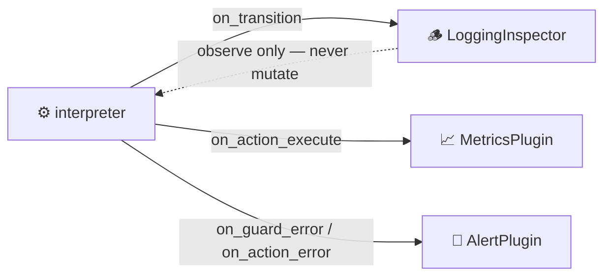

# Plugins & Observability

Plugins are **observers** that watch machine execution without modifying behavior. They hook into the interpreter's lifecycle to add cross-cutting concerns like logging, metrics, debugging, auditing, and performance monitoring.

## 🔌 What are Plugins?



A plugin implements the **Observer pattern**: it subscribes to lifecycle events in the interpreter and reacts to them. Plugins never alter the machine's state or transitions — they only observe. This makes them safe to add or remove without affecting business logic.

Every plugin extends the `PluginBase` class and overrides the hook methods it cares about. You register plugins with the interpreter using the `.use()` method.

<!-- doc-fragment -->
```python
from xstate_statemachine import SyncInterpreter, PluginBase

class MyPlugin(PluginBase):
    def on_transition(self, interpreter, from_states, to_states, transition):
        print("A transition just happened!")

machine = create_machine(config)
interp = SyncInterpreter(machine)
interp.use(MyPlugin())  # Register the plugin
interp.start()
```

## 🪵 Built-in: LoggingInspector

The library ships with `LoggingInspector`, a ready-to-use plugin that emits detailed, emoji-prefixed log messages for every significant machine event. It is invaluable for debugging complex state machines.

> 🔒 **Redaction (0.9.0).** `LoggingInspector` redacts sensitive keys before logging context or event payloads: any key containing `password`, `secret`, `token`, `api_key`, `authorization`, `credential`, `card`, `cvv`, … (see `DEFAULT_REDACT_KEYS`) is written as `"***"`, recursively. Extend the list with `LoggingInspector(redact_keys=(*DEFAULT_REDACT_KEYS, "ssn"))`, or opt out explicitly with `redact_keys=()`. Pass `log_context=False` to skip the per-transition context dump on large machines. The `redact()` helper is exported for your own plugins.

### Setup and Usage

```python
import logging
from xstate_statemachine import (
    create_machine, SyncInterpreter, MachineLogic, LoggingInspector
)

# Configure Python logging to see the output
logging.basicConfig(level=logging.INFO)

config = {
    "id": "demo",
    "initial": "idle",
    "context": {"count": 0},
    "states": {
        "idle": {
            "on": {
                "START": {"target": "running", "actions": "increment"}
            }
        },
        "running": {
            "on": {
                "STOP": "idle",
                "FINISH": "done"
            }
        },
        "done": {"type": "final"}
    }
}

logic = MachineLogic(
    actions={
        "increment": lambda i, ctx, e, a: ctx.update({"count": ctx["count"] + 1})
    }
)

machine = create_machine(config, logic=logic)
interp = SyncInterpreter(machine)
interp.use(LoggingInspector())  # Attach the inspector
interp.start()

interp.send("START")
interp.send("FINISH")
interp.stop()
```

### Output Format

All `LoggingInspector` messages are prefixed with `🕵️ [INSPECT]` for easy filtering:

```
🕵️ [INSPECT] Event Received: START
🕵️ [INSPECT] Executing Action: increment
🕵️ [INSPECT] Transition: ['demo.idle'] -> ['demo.running'] on Event 'START'
🕵️ [INSPECT] New Context: {'count': 1}
🕵️ [INSPECT] Event Received: FINISH
🕵️ [INSPECT] Transition: ['demo.running'] -> ['demo.done'] on Event 'FINISH'
🕵️ [INSPECT] New Context: {'count': 1}
```

Service-related messages use different prefixes:

```
🚀 [INSPECT] Service 'fetchData' (ID: loading) starting...
✅ [INSPECT] Service 'fetchData' (ID: loading) completed. Result: {...}
❌ [INSPECT] Service 'fetchData' (ID: loading) failed. Error: ConnectionError
```

Guard evaluation messages include pass/fail indicators:

```
🕵️ [INSPECT] Guard 'isAuthenticated' evaluated for event 'ACCESS' -> ✅ Passed
🕵️ [INSPECT] Guard 'hasPermission' evaluated for event 'DELETE' -> ❌ Failed
```

> **Tip:** Set `logging.basicConfig(level=logging.INFO)` at the top of your script to see `LoggingInspector` output. Without this, Python's default logging level (`WARNING`) will suppress the messages.

## 🧩 Custom Plugins with PluginBase

Create custom plugins by subclassing `PluginBase` and overriding any hooks you need:

```python
from xstate_statemachine import PluginBase

class MetricsPlugin(PluginBase):
    """Tracks transition counts and event frequencies."""

    def __init__(self):
        self.transition_count = 0
        self.event_counts = {}

    def on_event_received(self, interpreter, event):
        self.event_counts[event.type] = self.event_counts.get(event.type, 0) + 1

    def on_transition(self, interpreter, from_states, to_states, transition):
        self.transition_count += 1
        from_ids = sorted(s.id for s in from_states if s.is_atomic or s.is_final)
        to_ids = sorted(s.id for s in to_states if s.is_atomic or s.is_final)
        if from_ids != to_ids:
            print(f"Transition #{self.transition_count}: {from_ids} -> {to_ids}")

    def report(self):
        print(f"Total transitions: {self.transition_count}")
        print(f"Event frequencies: {self.event_counts}")
```

Usage:

```python
metrics = MetricsPlugin()
interp = SyncInterpreter(machine)
interp.use(metrics)
interp.start()

interp.send("START")
interp.send("PROCESS")
interp.send("FINISH")
interp.stop()

metrics.report()
# Total transitions: 3
# Event frequencies: {'START': 1, 'PROCESS': 1, 'FINISH': 1}
```

## 🪝 Plugin Hooks Reference

Every hook receives the `interpreter` instance as its first argument, giving plugins full read access to the machine's current state, context, and configuration.

| Hook | Signature | When It Fires |
|------|-----------|---------------|
| `on_interpreter_start` | `(interpreter)` | When `start()` is called |
| `on_interpreter_stop` | `(interpreter)` | When `stop()` is called |
| `on_event_received` | `(interpreter, event)` | Immediately after an event is received |
| `on_transition` | `(interpreter, from_states, to_states, transition)` | After a state transition completes |
| `on_action_execute` | `(interpreter, action)` | Right before an action executes |
| `on_action_error` | `(interpreter, action, error)` | A user action raised, before `action_error_policy` is applied |
| `on_guard_evaluated` | `(interpreter, guard_name, event, result)` | After a guard condition is checked |
| `on_service_start` | `(interpreter, invocation)` | When an invoked service begins |
| `on_service_done` | `(interpreter, invocation, result)` | When a service completes successfully |
| `on_service_error` | `(interpreter, invocation, error)` | When a service throws an exception |
| `on_transition_failed` | `(interpreter, transition, failed_actions)` | A transition's action list did not run to completion |
| `on_guard_error` | `(interpreter, guard_name, event, error)` | A guard raised instead of returning |
| `on_unhandled_event` | `(interpreter, event, active_state_ids, disposition)` | An event selected no transition |
| `on_invocation_stranded` | `(interpreter, state_id, invoke_id, error)` | **[0.9.0]** A `maxIterations` cut discarded the completion of an invocation whose state is still active: nothing is running for it and no `onDone`/`onError` will arrive (#207). `error` is the `RunawayChainError`; its `.stranded` tuple names the same ids. `has_dormant_invocations` / `pending_invocations()` answer the question on demand |
| `on_chain_budget_exceeded` | `(interpreter, error, event)` | **[0.9.0]** Once per `maxIterations` trip (#222). The sticky signal that work was discarded; `interpreter.chain_trips` / `.last_chain_error` carry the same fact for polling |
| `on_receipt_dropped` | `(interpreter, event_type)` | **[0.9.1]** A `send(wait=True)` receipt issued from inside an action was dropped without being awaited or handed out (#232, #244). The deterministic sibling of the `RuntimeWarning`; `interpreter.dropped_receipts` counts the same events. Async engine only |
| `on_event_dropped` | `(interpreter, event, reason)` | An event was discarded unprocessed. `reason` is one of `queue_full`, `not_running`, `chain_budget`, `stopped` (abandoned by `stop()`, incl. producers parked on a full `BLOCK` inbox), `unresolved_target` (`sendTo` to no live actor). Fires on **both** engines for every loss site (0.9.0) |
| `on_resolve_error` | `(interpreter, error, event)` | A transition's target could not be resolved at runtime (`strict_targets=False` only) — the third per-transition failure category alongside `on_action_error` / `on_guard_error` (0.9.0) |
| `on_plugin_error` | `(interpreter, plugin, hook, error)` | **Another** plugin's hook raised (or was `async def` and could not be awaited). Never fires for the plugin that failed. The same triple is on `interpreter.last_plugin_error` (0.9.0) |
| `on_invalid_event` | `(interpreter, error, raw_event)` | `send()` refused a malformed event (`InvalidEventError`); fires before the exception propagates to the caller (0.9.0, #159) |
| `on_snapshot_error` | `(interpreter, error)` | A snapshot was refused (`SnapshotMidStepError` / `SnapshotSerializationError`); fires before the exception propagates (0.9.0, #159) |
| `on_error` | `(interpreter, error)` | The interpreter enters the `"error"` status |
| `on_done` | `(interpreter, output)` | The machine reaches a top-level final state |

`LoggingInspector` implements `on_event_received`, `on_transition`, `on_action_execute`, `on_guard_evaluated`, `on_service_start`/`on_service_done`/`on_service_error`, `on_transition_failed`, `on_guard_error`, `on_unhandled_event`, `on_error`, and `on_done`. It does **not** implement `on_interpreter_start`, `on_interpreter_stop`, `on_action_error`, or `on_event_dropped` — action failures and dropped events pass through silently unless you add your own plugin for them.

> ⚠️ **Hooks are synchronous callbacks.** An `async def` override is never awaited — the engine dispatches hooks from inside a transition and cannot suspend there. Since 0.9.0 such a hook is closed explicitly and reported through `on_plugin_error` / `interpreter.last_plugin_error` as a `TypeError`, instead of vanishing with only a Python `RuntimeWarning`. If a hook needs async work, keep it `def` and schedule a task inside it.
>
> Plugin failures of any kind — including a hook raising `asyncio.CancelledError` — are **contained**: the interpreter keeps running, and the failure is visible to other plugins via `on_plugin_error`.

### Hook Details

#### `on_interpreter_start(interpreter)`

Fires once when `start()` is called. Use it for setup tasks like opening database connections, starting timers, or initializing counters.

```python
def on_interpreter_start(self, interpreter):
    self.start_time = time.time()
    print(f"Machine '{interpreter.id}' started")
```

#### `on_interpreter_stop(interpreter)`

Fires once when `stop()` is called. Use it for teardown tasks like flushing buffers, closing connections, or generating reports.

```python
def on_interpreter_stop(self, interpreter):
    elapsed = time.time() - self.start_time
    print(f"Machine '{interpreter.id}' ran for {elapsed:.2f}s")
```

#### `on_event_received(interpreter, event)`

Fires immediately after an event enters the processing queue. The `event` object has a `.type` (string) and `.payload` (dict or None).

```python
def on_event_received(self, interpreter, event):
    print(f"Event received: {event.type}")
    if hasattr(event, "payload") and event.payload:
        print(f"  Payload: {event.payload}")
```

#### `on_transition(interpreter, from_states, to_states, transition)`

Fires after a transition completes. `from_states` and `to_states` are sets of `StateNode` objects. The `transition` object contains `.event`, `.target_str`, `.guard`, and `.actions`.

```python
def on_transition(self, interpreter, from_states, to_states, transition):
    from_ids = {s.id for s in from_states if s.is_atomic or s.is_final}
    to_ids = {s.id for s in to_states if s.is_atomic or s.is_final}
    if from_ids != to_ids:
        print(f"State changed: {from_ids} -> {to_ids}")
```

#### `on_action_execute(interpreter, action)`

Fires right before each action is executed. The `action` is an `ActionDefinition` with a `.type` (name) and optional `.params`.

```python
def on_action_execute(self, interpreter, action):
    print(f"Executing: {action.type}")
```

#### `on_action_error(interpreter, action, error)`

Fires when a user-supplied action raises, **before** the machine's `action_error_policy` (`"continue"` / `"rollback"` / `"fail"`) is applied — so it fires under every policy, regardless of how the machine recovers. Use it to route action failures to Sentry, a metrics counter, or a dead-letter queue. See [Actions — When an Action Raises](../actions/#when-an-action-raises).

```python
def on_action_error(self, interpreter, action, error):
    print(f"Action '{action.type}' raised: {error!r}")
```

#### `on_guard_evaluated(interpreter, guard_name, event, result)`

Fires after a guard function returns. `result` is the boolean return value.

```python
def on_guard_evaluated(self, interpreter, guard_name, event, result):
    status = "PASS" if result else "FAIL"
    print(f"Guard '{guard_name}' for '{event.type}': {status}")
```

#### `on_service_start(interpreter, invocation)`

Fires when an invoked service is about to run. The `invocation` is an `InvokeDefinition` with `.src` (service name) and `.id`.

```python
def on_service_start(self, interpreter, invocation):
    print(f"Service '{invocation.src}' starting...")
```

#### `on_service_done(interpreter, invocation, result)`

Fires when a service completes successfully. `result` is whatever the service returned.

```python
def on_service_done(self, interpreter, invocation, result):
    print(f"Service '{invocation.src}' completed: {result}")
```

#### `on_service_error(interpreter, invocation, error)`

Fires when a service raises an exception. `error` is the `Exception` object.

```python
def on_service_error(self, interpreter, invocation, error):
    print(f"Service '{invocation.src}' failed: {error}")
```

#### `on_transition_failed(interpreter, transition, failed_actions)`

Fires under **every** `actionErrorPolicy` whenever one or more actions raised — in the transition's own action list or in the `entry` / `exit` list of any state the transition crossed. `failed_actions` is a list of `(ActionDefinition, exception)` pairs in execution order. Under `"continue"` it is followed by `on_transition` (the transition committed); under `"rollback"` and `"fail"` it is not. See [Actions — When an Action Raises](../actions/#when-an-action-raises).

```python
def on_transition_failed(self, interpreter, transition, failed_actions):
    for action, error in failed_actions:
        print(f"Action '{action.type}' failed: {error!r}")
```

#### `on_guard_error(interpreter, guard_name, event, error)`

Fires when a guard raises instead of returning, before the raise is substituted with a result per `guardErrorPolicy`. See [Guards — Error Handling in Guards](../guards/#error-handling-in-guards).

```python
def on_guard_error(self, interpreter, guard_name, event, error):
    print(f"Guard '{guard_name}' raised on '{event.type}': {error!r}")
```

#### `on_unhandled_event(interpreter, event, active_state_ids, disposition)`

Fires when an event matches no transition in any active state, regardless of `onUnhandled` policy. `disposition` is `"ignored"` (the state declares no handler for this event), `"guard_denied"` (a handler *is* declared but every candidate's guard returned `False` — 0.9.0, #153), `"deferred"`, `"errored"`, or `"dropped"` (the defer buffer was full and the oldest entry was evicted). The same distinction is on the receipt as `Receipt.denied`. See [Interpreters — Unhandled Events](../interpreters/#unhandled-events).

```python
def on_unhandled_event(self, interpreter, event, active_state_ids, disposition):
    print(f"'{event.type}' unhandled in {active_state_ids}: {disposition}")
```

#### `on_chain_budget_exceeded(interpreter, error, event)`

Fires **once per trip** when `maxIterations` cuts the machine's self-generated work — a zero-delay `raise` cycle, a completion storm, or an `always` loop (0.9.0, #222). `error` is the `RunawayChainError` (`.limit`, `.dropped`, `.stranded`); `event` is the first event cut, or `Event("")` for a settle-budget trip.

Use this — or poll `interpreter.chain_trips` (a monotonic counter) / `interpreter.last_chain_error` (a latch you clear with `clear_chain_error()`) — rather than `last_error`, which is recomputed per processed event and is erased by the next benign event. A machine with a heartbeat guarantees that event arrives, so a supervisor polling `last_error` loses the race every time.

```python
def on_chain_budget_exceeded(self, interpreter, error, event):
    metrics.increment("chain_trips", tags={"machine": interpreter.id})
    alert(f"{interpreter.id} cut {error.dropped} event(s) at {error.limit}; first: {event.type}")
```

#### `on_event_dropped(interpreter, event, reason)`

Fires when an event is discarded unprocessed. `reason` is one of:

| `reason` | Engine | When |
|---|---|---|
| `"queue_full"` | async | Bounded `max_queue_size` with `OverflowPolicy.DROP_NEWEST`, inbox full |
| `"not_running"` | both | Sent to an interpreter that is already stopped/done/errored |
| `"chain_budget"` | both | A self-generated event chain hit `maxIterations` and its tail was cut |
| `"stopped"` | both | `stop()` abandoned an event still in the inbox — including a producer parked on a full `BLOCK` inbox |
| `"unresolved_target"` | both | A `sendTo` named an actor that is not alive |

The drop is also logged at `WARNING`. Since 0.9.0 every loss site on **both** engines fires this hook; before, the `SyncInterpreter` dropped silently in several of these cases. See [Interpreters — Unhandled Events](../interpreters/#unhandled-events).

```python
def on_event_dropped(self, interpreter, event, reason):
    print(f"Dropped '{event.type}': {reason}")
```

#### `on_error(interpreter, error)`

Fires when the interpreter enters the terminal `"error"` status. `interpreter.error` holds the same exception.

```python
def on_error(self, interpreter, error):
    print(f"Machine '{interpreter.id}' stopped with error: {error!r}")
```

#### `on_done(interpreter, output)`

Fires when the machine reaches a top-level final state. `output` is the machine's `output` value (may be `None`).

```python
def on_done(self, interpreter, output):
    print(f"Machine '{interpreter.id}' done. Output: {output!r}")
```

## 🧬 Multiple Plugins

You can attach multiple plugins to a single interpreter. They execute in registration order:

<!-- doc-fragment -->
```python
from xstate_statemachine import SyncInterpreter, LoggingInspector

metrics = MetricsPlugin()
audit = AuditLogPlugin()
inspector = LoggingInspector()

interp = SyncInterpreter(machine)
interp.use(inspector)   # Fires first
interp.use(metrics)     # Fires second
interp.use(audit)       # Fires third
interp.start()
```

> **Note:** The `.use()` method returns the interpreter instance, so you can chain calls:
> ```python
> interp = SyncInterpreter(machine).use(LoggingInspector()).use(MetricsPlugin())
> ```

## 📜 Complete Example: Custom Audit Logger

```python
import json
from datetime import datetime
from xstate_statemachine import (
    create_machine, SyncInterpreter, MachineLogic, PluginBase
)

class AuditLogPlugin(PluginBase):
    """Records a detailed audit trail of all machine activity."""

    def __init__(self):
        self.log = []

    def _record(self, event_type, details):
        entry = {
            "timestamp": datetime.now().isoformat(),
            "event_type": event_type,
            **details
        }
        self.log.append(entry)

    def on_interpreter_start(self, interpreter):
        self._record("MACHINE_START", {"machine_id": interpreter.id})

    def on_interpreter_stop(self, interpreter):
        self._record("MACHINE_STOP", {
            "machine_id": interpreter.id,
            "final_context": dict(interpreter.context)
        })

    def on_event_received(self, interpreter, event):
        self._record("EVENT_RECEIVED", {"event": event.type})

    def on_transition(self, interpreter, from_states, to_states, transition):
        from_ids = sorted(s.id for s in from_states if s.is_atomic or s.is_final)
        to_ids = sorted(s.id for s in to_states if s.is_atomic or s.is_final)
        if from_ids != to_ids:
            self._record("TRANSITION", {
                "from": from_ids,
                "to": to_ids,
                "event": transition.event
            })

    def on_guard_evaluated(self, interpreter, guard_name, event, result):
        self._record("GUARD_EVALUATED", {
            "guard": guard_name,
            "event": event.type,
            "result": result
        })

    def export_json(self):
        return json.dumps(self.log, indent=2)

# Usage
config = {
    "id": "auditDemo",
    "initial": "draft",
    "context": {"author": "alice"},
    "states": {
        "draft": {"on": {"SUBMIT": "review"}},
        "review": {"on": {"APPROVE": "published", "REJECT": "draft"}},
        "published": {"type": "final"}
    }
}

machine = create_machine(config)
audit = AuditLogPlugin()

interp = SyncInterpreter(machine)
interp.use(audit)
interp.start()

interp.send("SUBMIT")
interp.send("APPROVE")
interp.stop()

print(audit.export_json())
# [
#   {"timestamp": "...", "event_type": "MACHINE_START", "machine_id": "auditDemo"},
#   {"timestamp": "...", "event_type": "EVENT_RECEIVED", "event": "SUBMIT"},
#   {"timestamp": "...", "event_type": "TRANSITION", "from": ["auditDemo.draft"], "to": ["auditDemo.review"], "event": "SUBMIT"},
#   {"timestamp": "...", "event_type": "EVENT_RECEIVED", "event": "APPROVE"},
#   {"timestamp": "...", "event_type": "TRANSITION", "from": ["auditDemo.review"], "to": ["auditDemo.published"], "event": "APPROVE"},
#   {"timestamp": "...", "event_type": "MACHINE_STOP", "machine_id": "auditDemo", "final_context": {"author": "alice"}}
# ]
```

## 📈 Complete Example: Performance Monitoring

```python
import time
from xstate_statemachine import PluginBase

class PerformancePlugin(PluginBase):
    """Measures time spent in each state and total execution time."""

    def __init__(self):
        self.start_time = None
        self.state_entry_times = {}
        self.state_durations = {}
        self.action_timings = {}
        self._current_action_start = None

    def on_interpreter_start(self, interpreter):
        self.start_time = time.monotonic()

    def on_interpreter_stop(self, interpreter):
        elapsed = time.monotonic() - self.start_time
        print(f"\n--- Performance Report for '{interpreter.id}' ---")
        print(f"Total runtime: {elapsed:.4f}s")
        print(f"State durations:")
        for state_id, duration in sorted(self.state_durations.items()):
            print(f"  {state_id}: {duration:.4f}s")
        if self.action_timings:
            print(f"Action execution counts:")
            for action_name, count in sorted(self.action_timings.items()):
                print(f"  {action_name}: {count} executions")

    def on_transition(self, interpreter, from_states, to_states, transition):
        now = time.monotonic()
        # Record duration for exited states
        from_ids = {s.id for s in from_states if s.is_atomic or s.is_final}
        to_ids = {s.id for s in to_states if s.is_atomic or s.is_final}
        for state_id in from_ids - to_ids:
            if state_id in self.state_entry_times:
                duration = now - self.state_entry_times.pop(state_id)
                self.state_durations[state_id] = (
                    self.state_durations.get(state_id, 0) + duration
                )
        # Record entry time for newly entered states
        for state_id in to_ids - from_ids:
            self.state_entry_times[state_id] = now

    def on_action_execute(self, interpreter, action):
        self.action_timings[action.type] = (
            self.action_timings.get(action.type, 0) + 1
        )
```

Usage:

```python
perf = PerformancePlugin()
interp = SyncInterpreter(machine)
interp.use(perf)
interp.start()

interp.send("START")
time.sleep(0.1)  # Simulate time in 'running' state
interp.send("FINISH")
interp.stop()

# --- Performance Report for 'demo' ---
# Total runtime: 0.1032s
# State durations:
#   demo.idle: 0.0001s
#   demo.running: 0.1012s
# Action execution counts:
#   increment: 1
```

## 🕰️ Complete Example: State History Tracker

```python
from xstate_statemachine import PluginBase

class StateHistoryPlugin(PluginBase):
    """Maintains a complete history of state transitions."""

    def __init__(self, max_history=1000):
        self.history = []
        self.max_history = max_history

    def on_transition(self, interpreter, from_states, to_states, transition):
        from_ids = sorted(s.id for s in from_states if s.is_atomic or s.is_final)
        to_ids = sorted(s.id for s in to_states if s.is_atomic or s.is_final)
        if from_ids != to_ids:
            entry = {
                "from": from_ids,
                "to": to_ids,
                "event": transition.event,
                "context_snapshot": dict(interpreter.context)
            }
            self.history.append(entry)
            # Prevent unbounded memory growth
            if len(self.history) > self.max_history:
                self.history = self.history[-self.max_history:]

    @property
    def current_state(self):
        """Returns the most recent state IDs."""
        if self.history:
            return self.history[-1]["to"]
        return []

    @property
    def previous_state(self):
        """Returns the state IDs before the last transition."""
        if self.history:
            return self.history[-1]["from"]
        return []

    def get_path(self):
        """Returns the full sequence of states visited."""
        path = []
        for entry in self.history:
            if not path:
                path.append(entry["from"])
            path.append(entry["to"])
        return path

    def was_in_state(self, state_id):
        """Returns True if the machine ever visited the given state."""
        for entry in self.history:
            if state_id in entry["from"] or state_id in entry["to"]:
                return True
        return False
```

Usage:

```python
config = {
    "id": "nav",
    "initial": "home",
    "states": {
        "home": {"on": {"GO_ABOUT": "about", "GO_CONTACT": "contact"}},
        "about": {"on": {"GO_HOME": "home", "GO_CONTACT": "contact"}},
        "contact": {"on": {"GO_HOME": "home", "GO_ABOUT": "about"}}
    }
}

machine = create_machine(config)
tracker = StateHistoryPlugin()
interp = SyncInterpreter(machine)
interp.use(tracker)
interp.start()

interp.send("GO_ABOUT")
interp.send("GO_CONTACT")
interp.send("GO_HOME")
interp.stop()

print(tracker.get_path())
# [['nav.home'], ['nav.about'], ['nav.contact'], ['nav.home']]

print(tracker.was_in_state("nav.about"))  # True
print(tracker.was_in_state("nav.settings"))  # False
print(tracker.current_state)  # ['nav.home']
print(tracker.previous_state)  # ['nav.contact']
```

## ⚡ Plugins with the Async Interpreter

Plugins work identically with both `SyncInterpreter` and `Interpreter`. The hooks themselves are always **synchronous** — they are called by the interpreter before/after async operations, but the hooks do not need to be `async def`.

```python
import asyncio
from xstate_statemachine import create_machine, Interpreter, LoggingInspector

async def main():
    config = {
        "id": "asyncDemo",
        "initial": "idle",
        "states": {
            "idle": {"on": {"GO": "active"}},
            "active": {"type": "final"}
        }
    }

    machine = create_machine(config)
    interp = Interpreter(machine)
    interp.use(LoggingInspector())
    await interp.start()

    await interp.send("GO")
    await asyncio.sleep(0.1)
    await interp.stop()

asyncio.run(main())
```

> **Tip:** Use `PluginBase[Interpreter]` or `PluginBase[SyncInterpreter]` as the generic type when you want IDE autocompletion for a specific interpreter type:
> ```python
> class MyAsyncPlugin(PluginBase[Interpreter]):
>     def on_interpreter_start(self, interpreter: Interpreter):
>         # Full autocompletion for async Interpreter methods
>         pass
> ```
