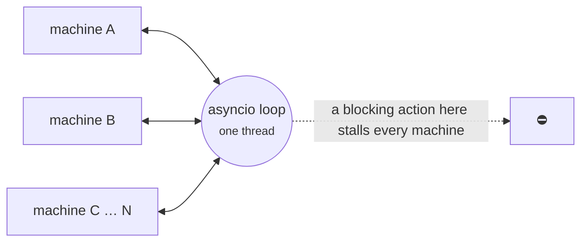

Most of this guide describes what a machine *means*. This page describes how the runtime *behaves* when you run many machines, lean on `after` timers, or mix threads — the properties you cannot infer from the API and will otherwise discover in production.

Three facts, each with the measurement behind it. Every number below was produced by [`benchmarks/production_characteristics.py`](https://github.com/basiltt/xstate-statemachine/blob/main/benchmarks/production_characteristics.py); run it on your own hardware and trust your figures over ours.

> **Measured on:** 0.8.1 (2026-09-19, `main` @ `816600c`), CPython 3.14.6, Windows 11, Intel Core i7-11850H laptop, a trivial single-action macrostep, `tracemalloc` **off**, best-of-3. Treat these as order-of-magnitude, not guarantees. For how the runtime compares with other Python state-machine libraries on identical machine shapes, see the [cross-library benchmark](https://github.com/basiltt/xstate-statemachine/blob/main/benchmarks/competitors/README.md) (summary on the [home page](../../#how-it-compares)).

---

## 🔀 1. Concurrency is interleaving, not parallelism

Every async `Interpreter` you create in a process runs on **one asyncio event loop on one OS thread**. Concurrency between machines is *logical* — events from different machines are interleaved on that thread — never *parallel*. The GIL would prevent parallelism anyway; the single loop makes it structural.

The consequence: **throughput is a per-process budget, not a per-machine capacity.** Adding interpreters does not add events per second; it divides the same budget.

| Interpreters | Aggregate ev/s | Per-interpreter ev/s |
|---:|---:|---:|
| 1 | ~59,000 | ~59,000 |
| 10 | ~58,000 | ~5,800 |
| 100 | ~57,000 | ~570 |
| 1,000 | ~52,000 | ~52 |

The aggregate barely moves across three orders of magnitude (0.8.1 closed the dip at 100–1,000 machines that 0.8.0 showed — the per-child manager task and the settle-hook accumulation are gone — and the run loop now yields to the event loop every 16 inbox events instead of every one, which is most of the ~30% lift over the first 0.8.1 measurement); the per-machine share collapses. This is the correct and unavoidable behaviour of a single-threaded core — it is how XState's actor system behaves too, and it is not something a library change can "fix" without a different architecture.

### Sizing rule

1. Estimate your **mean macrostep cost** — the time your actions, guards and plugins take per event. That, not the library, sets your budget: the ~20k ev/s above is for actions that do almost nothing.
2. Invert it for the **process budget** in ev/s.
3. Divide by your **machine count**.

If the result is below the per-machine event rate you need, **scale by process** — shard machines across a worker pool. Adding interpreters to one process will not help.

An external producer that sends *during* another machine's slow step is never charged to that machine's `maxIterations` (0.8.1, #105); the budget counts only events an interpreter's own actions issue, so a busy loop cannot make a healthy machine trip its chain guard.

### Two things that make it worse

- **Blocking work inside an action stalls every machine in the process.** A `time.sleep(0.1)` or a synchronous HTTP call in one machine's action freezes the loop for all of them. Use `await` and async services; if you must call blocking code, run it with `asyncio.to_thread` inside a service.
- **`tracemalloc` costs roughly 5× throughput.** Benchmark with it disabled, or your numbers will be badly pessimistic.

### Cost of the failure policies

Measured on a 5-state cycle machine, `SyncInterpreter`, 20 000 events, policy *armed but never triggered*:

| Configuration | Relative throughput |
|---|---:|
| defaults | 1.00× |
| `onUnhandled: "defer"` | ≈ 0.98× |
| `actionErrorPolicy: "rollback"`, transitions with **no** actions | ≈ 0.98× *(0.8.1; was 0.78× in 0.8.0)* |
| `actionErrorPolicy: "rollback"`, transitions with `entry` actions | ≈ 0.84× |

`rollback` / `fail` take a `deepcopy` of `context` before any transition that can run an action. The cost is proportional to the size of your context — keep bulky, read-only reference data out of it. `defer` is nearly free when nothing defers. Because the 1.0 default flips to `rollback`, budget for the second-to-last row now.

### Resource budget per invoked child (async engine)

Each `invoke`d child machine costs **one asyncio task** while it is alive — its own run loop — and nothing else. Completion is *pushed*: the child's terminal listener fires the instant its `status` flips and dispatches `onDone` / `onError` to the parent from a short-lived task, so there is no per-child waiter and there are **no periodic wake-ups** (the 5 ms status poll went in 0.8.0; the manager task went in 0.8.1 — #43). An idle child costs memory, not CPU. If you cap concurrent children on a task budget, the number to plan for is `children + 1`. Exiting the owning state stops its children directly.

The `SyncInterpreter` is different in kind, not degree: it processes each `send()` to completion on the *calling* thread. Its throughput is whatever the calling thread can do, but two sync interpreters driven from two threads genuinely run in parallel (subject to the GIL) — see §3 for what that does and does not buy you.

---

## ⏱️ 2. `after` timers are best-effort, and starve under load

An `after` delay guarantees **not before** — never **at**.

On the async engine a timer is scheduled through the interpreter's [`Clock`](../delayed-transitions/#controlling-time) (`loop.call_later` on the default `RealClock`). When the deadline passes, the fired timer is delivered through a **priority lane** that the run loop checks ahead of its inbox, so it does not queue behind that machine's own backlog of external events. It still has to wait for the *current* macrostep of every other machine sharing the loop to yield — Python's event loop is cooperative — so under load it fires late:

| Busy machines in the process | `after: 10` fires late by |
|---:|---:|
| 0 | ~0.1 ms |
| 10 | ~1 ms |
| 100 | ~7 ms |
| 500 | ~36 ms |

(The 0.8.1 run loop yields to the event loop every `Interpreter._INBOX_YIELD_EVERY` = 16 inbox events rather than every one — set the class attribute to `1` to restore the per-event yield if you would rather trade throughput for timer punctuality. The construction/instance work that followed made every macrostep cheaper, which pulled lateness back down: every event the loop processes faster is a timer that fires sooner. Before 0.8.0 the timer's continuation shared the inbox and the same run measured ~35 ms and ~180 ms; the priority lane and the 0.8.0 hot-path work together cut the lateness by roughly 4x. Lateness tracks per-event cost -- every event the loop processes faster is a timer that fires sooner -- so it will keep moving with throughput. `AfterEvent.lateness_ms` reports the actual figure for each firing.)

Two properties of that curve matter for design:

- **The error is roughly constant in absolute terms across delay sizes.** A 10 ms timer and a 10 s timer are each ~36 ms late at 500 busy machines — so *short* deadlines degrade worst *relatively*. A 10 ms timeout at 500 machines is meaningless; a 30 s one is fine.
- **The OS floor.** On Windows the default timer resolution is ~15.6 ms; an `after: 5` cannot fire at 5 ms on an idle loop there. Linux and macOS are ~1 ms.

### What to use `after` for

Session timeouts, retry back-off, debounce, "give up after 30 s" — anything where a few hundred milliseconds of lateness is harmless. **Do not** use it for deadlines that carry money or safety (an order's time-in-force, a watchdog) when the process is also busy; put those on a dedicated scheduler and deliver the result as an ordinary event.

On the `SyncInterpreter`, `after` timers are not on an event loop at all — they fire on the thread that next calls `send()` or `tick()`; see the next section. In tests, drive either engine with a [`SimulatedClock`](../testing-and-pure-api/#virtual-time-with-simulatedclock) and the lateness question disappears.

---

## 🧵 3. The `SyncInterpreter` threading contract

`SyncInterpreter` is single-threaded **for event processing only**.

- `send()` runs the whole macrostep — guards, actions, entry/exit, `always` chains — synchronously on the **calling thread**, and returns when it is done. Two `send()` calls from one thread cannot overlap. That is the guarantee, and it is what makes the sync engine ideal for tests and step-through debugging.
- **`after` timers and delayed sends do not own a thread.** Since 0.8.0 (#50) a delay is a deadline recorded on the interpreter's `Clock`; a due deadline is delivered on the **caller's thread** at the top of the next `send()`, inside the macrostep loop, or when you call `tick()` explicitly. Nothing fires between your own statements. (Before 0.8.0 each timer was a `threading.Thread` that re-entered the machine without a lock.) This holds **regardless of whether an asyncio loop is running on the constructing thread** — since 0.8.1 (#76) the clock lane follows the owning engine, so a sync machine built inside an async test or an async app's hot path still delivers its deadlines through `tick()`.
- **Non-blocking `spawn_<key>` children still run on a background thread.** The child is *started* on the spawning thread (0.8.1 — so its entry actions and grandchildren exist when the spawn action returns), then a daemon runner thread pumps its `tick()`; the child's later actions execute on that thread. The parent is only re-entered through the child's completion event or `sendParent`, both of which go through the parent's inbox and are processed on the parent's next `send()`/`tick()`.

So a machine that uses `after` and delayed sends is single-threaded end-to-end; only `spawn_<key>` (non-blocking) children introduce a second thread, and that thread runs the *child's* code, not the parent's.

### What is and is not safe

| | Safe? |
|---|---|
| Calling `send()` from the thread that created the interpreter | Yes |
| Reading `context` / `current_state_ids` between your own `send()` calls, machine uses `after` / delayed sends but **no** non-blocking spawns | Yes — a due timer only fires inside `send()`/`tick()` |
| Reading a non-blocking **child's** `context` from the parent's thread | **No** — the child's runner thread may be mid-macrostep |
| Calling `send()` on one interpreter from two different threads concurrently | **No** — macrosteps will interleave; `context` mutations race |
| Assuming a `spawn_<key>` child's action runs on the thread that called `start()` | **No** — it runs on the child's runner thread |

A sync machine that must not miss a deadline while idle needs *someone* to call `tick()` (or `send()`) — a due `after` cannot fire on its own. If you need cross-thread delivery, use the async `Interpreter` with `send_threadsafe()`.

---

## Related

- [Interpreters](../interpreters/) — the two engines and when to use each
- [Delayed Transitions](../delayed-transitions/) — `after` syntax and semantics
- [Interpreters → Sending from Another Thread](../interpreters/#sending-from-another-thread) — `send_threadsafe()` for the async engine
- [Interpreters → Unhandled Events](../interpreters/#unhandled-events) — `onUnhandled: "defer"` and `DEFER_MAX`, the practical early warning that a machine is falling behind
