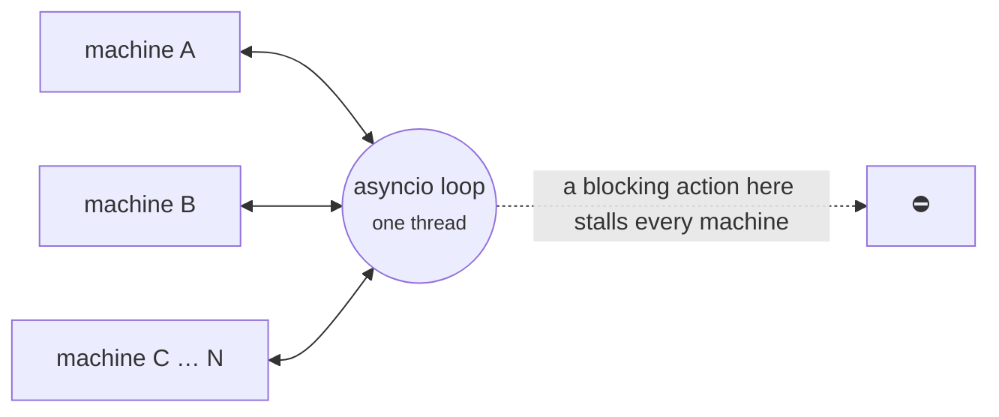

Most of this guide describes what a machine *means*. This page describes how the runtime *behaves* when you run many machines, lean on `after` timers, or mix threads — the properties you cannot infer from the API and will otherwise discover in production.

The first three sections draw their numbers from [`benchmarks/production_characteristics.py`](https://github.com/basiltt/xstate-statemachine/blob/main/benchmarks/production_characteristics.py); the integration budgets in §4 come from [`benchmarks/integrations_characteristics.py`](https://github.com/basiltt/xstate-statemachine/blob/main/benchmarks/integrations_characteristics.py). Run either on your own hardware and trust your figures over ours. Both support `--json` (or `--json-file PATH`) so CI can inspect measurements without scraping a table.

> **Measured on:** 0.9.0 (2026-09-19, `main` @ `816600c`), CPython 3.14.6, `Windows-11-10.0.26200-SP0` / `AMD64`, `Intel64 Family 6 Model 141` (Core i7-11850H, 16 logical CPUs), a trivial single-action macrostep, `tracemalloc` **off**, best-of-3. Treat these as order-of-magnitude, not guarantees. For how the runtime compares with other Python state-machine libraries on identical machine shapes, see the [cross-library benchmark](https://github.com/basiltt/xstate-statemachine/blob/main/benchmarks/competitors/README.md) (summary on the [home page](../../#how-it-compares)).

---

## 🔀 1. Concurrency is interleaving, not parallelism

```mermaid
flowchart LR
    L(("asyncio loop<br/><small>one thread</small>"))
    A["machine A"] <--> L
    B["machine B"] <--> L
    C["machine C … N"] <--> L
    L -. "a blocking action here stalls every machine" .-> X["⛔"]
```

Every async `Interpreter` you create in a process runs on **one asyncio event loop on one OS thread**. Concurrency between machines is *logical* — events from different machines are interleaved on that thread — never *parallel*. The GIL would prevent parallelism anyway; the single loop makes it structural.

The consequence: **throughput is a per-process budget, not a per-machine capacity.** Adding interpreters does not add events per second; it divides the same budget.

| Interpreters | Aggregate ev/s | Per-interpreter ev/s |
|---:|---:|---:|
| 1 | ~59,000 | ~59,000 |
| 10 | ~58,000 | ~5,800 |
| 100 | ~57,000 | ~570 |
| 1,000 | ~52,000 | ~52 |

The aggregate barely moves across three orders of magnitude (0.9.0 closed the dip at 100–1,000 machines that 0.8.0 showed — the per-child manager task and the settle-hook accumulation are gone — and the run loop now yields to the event loop every 16 inbox events instead of every one, which is most of the ~30% lift over the first 0.9.0 measurement); the per-machine share collapses. This is the correct and unavoidable behaviour of a single-threaded core — it is how XState's actor system behaves too, and it is not something a library change can "fix" without a different architecture.

### Sizing rule

1. Estimate your **mean macrostep cost** — the time your actions, guards and plugins take per event. That, not the library, sets your budget: the ~20k ev/s above is for actions that do almost nothing.
2. Invert it for the **process budget** in ev/s.
3. Divide by your **machine count**.

If the result is below the per-machine event rate you need, **scale by process** — shard machines across a worker pool. Adding interpreters to one process will not help.

An external producer that sends *during* another machine's slow step is never charged to that machine's `maxIterations` (0.9.0, #105); the budget counts only events an interpreter's own actions issue, so a busy loop cannot make a healthy machine trip its chain guard.

### Two things that make it worse

- **Blocking work inside an action stalls every machine in the process.** A `time.sleep(0.1)` or a synchronous HTTP call in one machine's action freezes the loop for all of them. Use `await` and async services; if you must call blocking code, run it with `asyncio.to_thread` inside a service.
- **`tracemalloc` costs roughly 5× throughput.** Benchmark with it disabled, or your numbers will be badly pessimistic.

### Cost of the failure policies

Measured on a 5-state cycle machine, `SyncInterpreter`, 20 000 events, policy *armed but never triggered*:

| Configuration | Relative throughput |
|---|---:|
| defaults | 1.00× |
| `onUnhandled: "defer"` | ≈ 0.98× |
| `actionErrorPolicy: "rollback"`, transitions with **no** actions | ≈ 0.98× *(0.9.0; was 0.78× in 0.8.0)* |
| `actionErrorPolicy: "rollback"`, transitions with `entry` actions | ≈ 0.84× |

`rollback` / `fail` take a `deepcopy` of `context` before any transition that can run an action. The cost is proportional to the size of your context — keep bulky, read-only reference data out of it. `defer` is nearly free when nothing defers. Because the 1.0 default flips to `rollback`, budget for the second-to-last row now.

### Resource budget per invoked child (async engine)

Each `invoke`d child machine costs **one asyncio task** while it is alive — its own run loop — and nothing else. Completion is *pushed*: the child's terminal listener fires the instant its `status` flips and dispatches `onDone` / `onError` to the parent from a short-lived task, so there is no per-child waiter and there are **no periodic wake-ups** (the 5 ms status poll went in 0.8.0; the manager task went in 0.9.0 — #43). An idle child costs memory, not CPU. If you cap concurrent children on a task budget, the number to plan for is `children + 1`. Exiting the owning state stops its children directly.

The `SyncInterpreter` is different in kind, not degree: it processes each `send()` to completion on the *calling* thread. Its throughput is whatever the calling thread can do, but two sync interpreters driven from two threads genuinely run in parallel (subject to the GIL) — see §3 for what that does and does not buy you.

---

## ⏱️ 2. `after` timers are best-effort, and starve under load

An `after` delay guarantees **not before** — never **at**.

On the async engine a timer is scheduled through the interpreter's [`Clock`](../delayed-transitions/#controlling-time) (`loop.call_later` on the default `RealClock`). When the deadline passes, the fired timer is delivered through a **priority lane** that the run loop checks ahead of its inbox, so it does not queue behind that machine's own backlog of external events. It still has to wait for the *current* macrostep of every other machine sharing the loop to yield — Python's event loop is cooperative — so under load it fires late:

| Busy machines in the process | `after: 10` fires late by |
|---:|---:|
| 0 | ~0.1 ms |
| 10 | ~1 ms |
| 100 | ~7 ms |
| 500 | ~36 ms |

(The 0.9.0 run loop yields to the event loop every `Interpreter._INBOX_YIELD_EVERY` = 16 inbox events rather than every one — set the class attribute to `1` to restore the per-event yield if you would rather trade throughput for timer punctuality. The construction/instance work that followed made every macrostep cheaper, which pulled lateness back down: every event the loop processes faster is a timer that fires sooner. Before 0.8.0 the timer's continuation shared the inbox and the same run measured ~35 ms and ~180 ms; the priority lane and the 0.8.0 hot-path work together cut the lateness by roughly 4x. Lateness tracks per-event cost -- every event the loop processes faster is a timer that fires sooner -- so it will keep moving with throughput. `AfterEvent.lateness_ms` reports the actual figure for each firing.)

Two properties of that curve matter for design:

- **The error is roughly constant in absolute terms across delay sizes.** A 10 ms timer and a 10 s timer are each ~36 ms late at 500 busy machines — so *short* deadlines degrade worst *relatively*. A 10 ms timeout at 500 machines is meaningless; a 30 s one is fine.
- **The OS floor.** On Windows the default timer resolution is ~15.6 ms; an `after: 5` cannot fire at 5 ms on an idle loop there. Linux and macOS are ~1 ms.
- **A plain-`def` service blocks its own machine's timers for its whole duration** (#174). A non-coroutine `invoke` runs on a worker thread, but the macrostep that entered the invoking state *awaits its result* before it completes (that is what puts `done.invoke` ahead of the inbox, #116/#149). A due `after` on that machine is delivered only when that macrostep ends, so an `after: 100` armed alongside a 500 ms plain service fires at ~500 ms, not 100. Other machines on the loop are unaffected. If a timer has to interrupt a long service, make the service a coroutine (`async def`) — it then runs as a task and the timer fires on time. Since #179 an `async def` service's completion is charged to the chain budget exactly like a `def` service's, so `async def` is the safe choice on **both** axes: timers and runaway protection.

What the `maxIterations` settle budget bounds is the *number of microsteps* a macrostep may take, not its wall-clock duration; a budget is not a deadline. The converse holds too (#212): a **delayed** self-send (`raise` with `delay`) is a timer with exactly the standing of `after` — the delay ends the arming step's chain and the firing is a clock event — so a self-paced `raise(delay=)` heartbeat or poller is a periodic process the budget never counts, whatever its period. `maxIterations` bounds work the machine feeds itself *within* a step: zero-delay `raise`, `send` to self, and completions re-arming invokes.

A trip is **sticky** (0.9.0, #222). `last_error` carries the `RunawayChainError` only until the next cleanly handled event — it is a per-step read, and a heartbeat guarantees the eraser arrives — so a supervisor should read `interpreter.chain_trips` (monotonic), `interpreter.last_chain_error` (latched until `clear_chain_error()`), or subscribe to `on_chain_budget_exceeded`, which fires once per trip on both engines. The latch and the counter are snapshot fields (#226), so a restart-from-snapshot is not an implicit acknowledgement: the restored machine still reports the trip until `clear_chain_error()` is called (see [Snapshots](../snapshots/)).

- **The same rule means a plain-`def` service cannot be cancelled by an event** (#193). On both engines a non-coroutine service is *part of the macrostep that entered its state*: the sync engine runs it inline, the async engine awaits its worker-thread result before the step ends. An event that arrives during that step — `CANCEL`, say — is not processed until the step is over, and by then the service has completed and its `done.invoke` is already at the head of the priority lane. So the machine takes `onDone` first, and `CANCEL` is processed in the *new* state; the service's result is never applied to a state that has been exited (SCXML §6.4.2 holds), but the exit could not pre-empt the service either. That is the documented plain-`def` contract — identical on both engines (#116) — not a defect of one of them. A service that must be interruptible by an event is an `async def`: it runs as its own task, the macrostep ends at once, and exiting the state cancels the task. Where the async engine *does* now match the coroutine lane: a `def` service armed by a transition that is then rolled back (`actionErrorPolicy: "rollback"`) or rolled forward (an `always` out of the state before it stabilises) is never submitted to the pool.

### What to use `after` for

Session timeouts, retry back-off, debounce, "give up after 30 s" — anything where a few hundred milliseconds of lateness is harmless. **Do not** use it for deadlines that carry money or safety (an order's time-in-force, a watchdog) when the process is also busy; put those on a dedicated scheduler and deliver the result as an ordinary event.

On the `SyncInterpreter`, `after` timers are not on an event loop at all — they fire on the thread that next calls `send()` or `tick()`; see the next section. In tests, drive either engine with a [`SimulatedClock`](../testing-and-pure-api/#virtual-time-with-simulatedclock) and the lateness question disappears.

---

## 🧵 3. The `SyncInterpreter` threading contract

`SyncInterpreter` is single-threaded **for event processing only**.

- `send()` runs the whole macrostep — guards, actions, entry/exit, `always` chains — synchronously on the **calling thread**, and returns when it is done. Two `send()` calls from one thread cannot overlap. That is the guarantee, and it is what makes the sync engine ideal for tests and step-through debugging.
- **`after` timers and delayed sends do not own a thread.** Since 0.8.0 (#50) a delay is a deadline recorded on the interpreter's `Clock`; a due deadline is delivered on the **caller's thread** at the top of the next `send()`, inside the macrostep loop, or when you call `tick()` explicitly. Nothing fires between your own statements. (Before 0.8.0 each timer was a `threading.Thread` that re-entered the machine without a lock.) This holds **regardless of whether an asyncio loop is running on the constructing thread** — since 0.9.0 (#76) the clock lane follows the owning engine, so a sync machine built inside an async test or an async app's hot path still delivers its deadlines through `tick()`.
- **Non-blocking `spawn_<key>` children still run on a background thread.** The child is *started* on the spawning thread (0.9.0 — so its entry actions and grandchildren exist when the spawn action returns), then a daemon runner thread pumps its `tick()`; the child's later actions execute on that thread. The parent is only re-entered through the child's completion event or `sendParent`, both of which go through the parent's inbox and are processed on the parent's next `send()`/`tick()`.

So a machine that uses `after` and delayed sends is single-threaded end-to-end; only `spawn_<key>` (non-blocking) children introduce a second thread, and that thread runs the *child's* code, not the parent's.

### What is and is not safe

| | Safe? |
|---|---|
| Calling `send()` from the thread that created the interpreter | Yes |
| Reading `context` / `current_state_ids` between your own `send()` calls, machine uses `after` / delayed sends but **no** non-blocking spawns | Yes — a due timer only fires inside `send()`/`tick()` |
| Reading a non-blocking **child's** `context` from the parent's thread | **No** — the child's runner thread may be mid-macrostep |
| Calling `send()` on one interpreter from two different threads concurrently | **No** — macrosteps will interleave; `context` mutations race |
| Assuming a `spawn_<key>` child's action runs on the thread that called `start()` | **No** — it runs on the child's runner thread |

A sync machine that must not miss a deadline while idle needs *someone* to call `tick()` (or `send()`) — a due `after` cannot fire on its own. For cross-thread delivery use `send_threadsafe()` on either engine: the async engine runs it on its loop; the sync engine queues it in a locked mailbox the owner drains on its next `send()` / `tick()` **[0.11.0]** — see [Interpreters → the mailbox](../interpreters/#syncinterpretersendthreadsafe-the-mailbox-0110).

---

## 🔌 4. Integrations: measured regression budgets

The integration layer adds work to each event. These are **observed p50s**, not
guarantees for your workload. Each figure below is the median of seven
`perf_counter_ns` repetitions with garbage collection disabled during the
measurements. Send rows process 10,000 completed events per repetition; store
rows average 100 load → send → save → stop round-trips after a warm-up; snapshot
rows average 1,000 operations on a 50-state machine. Import rows time the
package import *inside* a fresh subprocess, excluding Python startup.

> **Reference runner:** GitHub-hosted `ubuntu-24.04` (`Linux-6.17.0-1022-azure-x86_64-with-glibc2.39`),
> CPython 3.13.15, `AMD EPYC 9V74 80-Core Processor`, 4 logical CPUs — the nightly
> `perf` job's runner, recorded from its own `last_run.json` (run
> [36429782133](https://github.com/basiltt/xstate-statemachine/actions/runs/36429782133)).
> These absolute numbers are a *report*; what the nightly gates on is described
> under [How the budgets gate](#how-the-budgets-gate) below.

| Measurement | Baseline p50 | Budget (×1.25) | What it includes |
|:--|--:|--:|:--|
| Import core (no site-packages) | 64.881 ms | 81.101 ms | Subprocess import only |
| Import core with `[redis,pydantic]` installed, unused | 66.211 ms | 82.764 ms | No eager contrib imports (+1.3 ms, within noise) |
| `persisted()` + `MemoryStore` (sync) | 87.119 µs | 108.899 µs | 71.246 µs over bare send |
| `apersisted()` + `MemoryStore` (async) | 309.499 µs | 386.874 µs | Thread-backed store adapter |
| `persisted()` + SQLite WAL (sync) | 139.782 µs | 174.728 µs | Local temporary database |
| `apersisted()` + SQLite WAL (async) | 360.305 µs | 450.381 µs | Thread-backed store adapter |
| Idempotency + audit + Prometheus (sync) | 133.670 µs/event | 167.087 µs/event | 538.3% over bare keyed send (20.942 µs); re-recorded for #273 † |
| Idempotency + audit + Prometheus (async) | 142.939 µs/event | 178.674 µs/event | 311.5% over bare keyed send (34.740 µs); re-recorded for #273 † |
| Empty-plugin hook path (sync) | 15.873 µs/event | 19.841 µs/event | `on_before_send` and `on_event_processed` seams |
| Empty-plugin hook path (async) | 26.418 µs/event | 33.023 µs/event | Same seams; no plugin callbacks |
| Pydantic 20-field validator (sync) | 46.031 µs/event | 57.539 µs/event | 22.364 µs above unvalidated send |
| Pydantic 20-field validator (async) | 56.582 µs/event | 70.728 µs/event | 23.078 µs above unvalidated send |
| Snapshot v4 `get_snapshot()` (sync) | 12.105 µs | 15.131 µs | 50-state machine |
| Snapshot v4 `from_snapshot()` (sync) | 23.285 µs | 29.106 µs | 50-state machine |
| Snapshot v4 `get_snapshot()` (async) | 12.450 µs | 15.562 µs | 50-state machine |
| Snapshot v4 `from_snapshot()` (async) | 24.365 µs | 30.456 µs | 50-state machine |
| `shortest_paths` (`savage.json`) | — | `null` | Shipped in #269; measured nightly, budget recorded from its first artifact |
| FastAPI `POST /send` | — | `null` | Router not shipped yet |

Against the aspirational figures in #307: `persisted()` on `MemoryStore` costs
~71 µs over a bare send (target ≤ 150 µs), the SQLite round-trip is ~0.14 ms
(target ≤ 3 ms), the 20-field validator adds ~22 µs per mutating action
(target ≤ 40 µs) and installing the extras does **not** grow the import. The
import itself is ~65 ms against a ≤ 60 ms target on this runner. The plugin
measurements exercise **unique idempotency keys** and write an audit record for
every event; they do not measure an inert plugin, and the 15 % target is **not
met** — nor could it be, since a per-event inbox claim, mark and audit append is
several times the cost of the trivial macrostep it wraps. Since #273 the two
plugin rows also attach a real `PrometheusPlugin`. There is also no historical 0.10.x
runtime or v3 snapshot implementation in the measurement: the no-plugin and v4
rows are forward-looking regression baselines, not claims that the earlier
2 % / 1.2× comparisons passed.

† The plugin rows were re-recorded from `workflow_dispatch` perf run
[36659646069](https://github.com/basiltt/xstate-statemachine/actions/runs/36659646069)
(attempt 2, same runner label and CPU model as the reference). That run
measured **every** other row 25–30 % above its recorded baseline as well, and
a same-day control run of unmodified `main`
([36662085551](https://github.com/basiltt/xstate-statemachine/actions/runs/36662085551))
landed on a different CPU and exceeded every budget, so hosted-runner drift
explains most of the difference — the overhead ratio against the bare keyed
send (538 % / 312 %) is essentially unchanged from the original recording. The
other rows were deliberately **not** re-baselined here.

### How the budgets gate

Hosted `ubuntu-24.04` runners are not pinned to one CPU model. Three consecutive
nightlies on identical code landed on three different ones:

| Nightly | CPU | Bare sync send | `persisted()` + `MemoryStore` | Rows the old gate checked |
|:--|:--|--:|--:|--:|
| 2026-09-29 | AMD EPYC 9V74 | 15.9 µs | 87.1 µs | 17 of 18 |
| 2026-09-30 ([36698492040](https://github.com/basiltt/xstate-statemachine/actions/runs/36698492040)) | AMD EPYC 7763 | 32.4 µs | 158.3 µs | **0** (all skipped) |
| 2026-10-01 ([36848036167](https://github.com/basiltt/xstate-statemachine/actions/runs/36848036167)) | AMD EPYC 9V45 | 13.2 µs | 74.9 µs | **0** (all skipped) |

That is a 2.4× spread from hardware alone. The old gate compared absolute
microseconds and skipped every row on a CPU other than the one the baseline was
recorded on, so it was enforced one night in three.

The gate is now **relative**. Each nightly computes its own *speed factor*: the
median, over the 14 non-import rows, of `measured / reference`. A machine that is
uniformly twice as slow has a speed factor of exactly 2. Each row is then compared
with `reference × speed factor` and fails above **×1.25**. A regression in one row
barely moves the median, so it shows up almost in full in that row. Cold
`import_*` rows (filesystem and unmarshalling more than bytecode) track CPU
speed only as its square root (fitted exponent 0.46–0.48 across the three
models), so they are compared with `reference × speed factor ** 0.5`.

The `gate.reference_us` table in `budgets.json` is fitted from all three nightly
profiles (also stored there as `cpu_baselines`) and expressed in microseconds on
the 9V74. On that data:

- each of the three CPUs is within 1.14× of its prediction on every row;
- a uniform 0.5×–2.4× hardware shift never fails a row;
- a 1.5× regression in any single row fails on every one of the three profiles,
  even on a 2× slower machine.

`tests/test_perf_gate.py` pins all three properties in the default (untimed) job.
A failure names the row, the measured p50, the hardware-adjusted budget and the
CPU. The relative reference applies to the nightly's platform (Linux, CPython
3.13). On another OS or Python minor, the shape of the profile differs (on
Windows a cold import is heavier relative to a send), so those rows skip with a
reason. The absolute ×1.25 table above is still checked, as a secondary report,
when the runner *is* the 9V74.

> **The one blind spot, stated plainly.** A regression that slows *every* row by
> the same factor — something in the shared `send()` path that every integration
> goes through — is indistinguishable from a slower CPU and the relative gate
> absorbs it into the speed factor. That is why the absolute table is kept and
> still enforced whenever the nightly lands on the 9V74 (roughly one night in
> three), and why `last_run.json` is uploaded every night: the speed factor
> itself is in it, and a speed factor that drifts upward across runs on the
> *same* CPU model is the signal a uniform regression leaves. Row-local
> regressions — the common kind, one integration's hot path — are caught every
> night on every CPU.

Two alternatives were rejected:

- A **ratio to one reference row** (every row ÷ bare send) still spread 1.5–1.7×
  across the three CPUs, and one noisy denominator moves every verdict.
- A **per-CPU baseline table** cannot gate a CPU until someone commits its first
  run. The same 9V74 also once measured every row 25–30 % over its own baseline.

A **calibration probe** (a fixed pure-Python loop) was also rejected: it does
not exercise the allocation, asyncio and SQLite mix the rows depend on.

A budget change is a reviewed edit to `budgets.json` with a changelog note.
`tests/test_perf_gate.py` fails if a baseline or reference goes **up** relative
to the previous commit unless that row's `notes` entry names the perf run it was
re-recorded from, and it requires a note for every row without a budget. The
default test job never asserts wall time. Its import-time guard checks only that
core imports no contrib or third-party modules.

The nightly also runs `benchmarks/scaling.py`, a set of report-only big-O sweeps.
They assert only the *shape* of each curve, never microseconds. Both
`last_run.json` and `scaling.json` are uploaded as the `integration-perf`
artifact. On the development laptop (best of 5, µs per operation):

| Sweep | Sizes | Cost | Check |
|:--|:--|:--|:--|
| `send` vs total states | 1 / 50 / 500 | 7.2 / 12.7 / 12.8 | flat (500 ÷ 1 < 3) |
| `send` vs nesting depth | 1 / 5 / 20 | 12.7 / 17.2 / 28.5 | sub-linear in depth |
| `send` vs parallel regions | 1 / 4 / 16 | 14.3 / 24.3 / 53.9 | sub-linear in regions |
| `send` vs context keys | 1 / 100 / 10 000 | 12.4 / 12.4 / 12.8 | flat |
| `get_snapshot` vs context keys | 1 / 100 / 10 000 | 11.9 / 36.7 / 2 869 | linear (10 000 ÷ 100 = 78) |
| `from_snapshot` vs context keys | 1 / 100 / 10 000 | 29.3 / 66.7 / 4 219 | linear (63) |
| `get_snapshot` vs states | 1 / 50 / 500 | 12.4 / 12.5 / 12.5 | flat |
| `from_snapshot` vs states | 1 / 50 / 500 | 33.3 / 33.2 / 47.0 | flat-ish (1.4) |
| `persisted()` vs instances in `MemoryStore` | 1 / 100 / 10 000 | 99.8 / 94.0 / 98.6 | flat |

One super-linear finding: `shortest_paths` replays each path prefix from a fresh
interpreter for every candidate step. Its cost per configuration therefore grows
with path length: on the corpus's `addressFields.json` (8 parallel regions),
2.3 → 3.3 → 4.8 → 6.5 ms per configuration at depth 3 → 6, and ~54 s for the full
3,456-configuration exploration. The `shortest_paths` budget row uses
`savage.json` (largest loadable chart, ~24 ms), and the explosive chart is
tracked in the sweep.

---

## Related

- [Interpreters](../interpreters/) — the two engines and when to use each
- [Delayed Transitions](../delayed-transitions/) — `after` syntax and semantics
- [Interpreters → Sending from Another Thread](../interpreters/#sending-from-another-thread) — `send_threadsafe()` for the async engine
- [Interpreters → Unhandled Events](../interpreters/#unhandled-events) — `onUnhandled: "defer"` and `DEFER_MAX`, the practical early warning that a machine is falling behind
