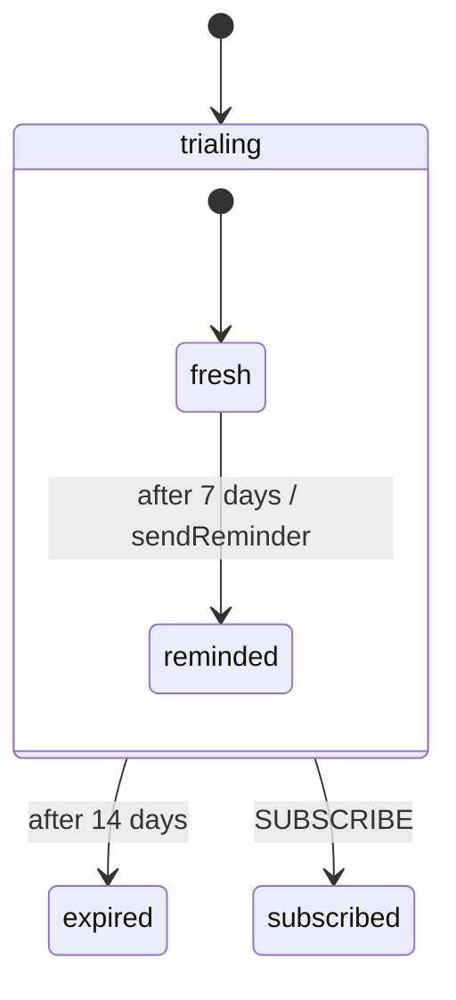

# Recipe: APScheduler durable timers

A trial reminder after 7 days and expiry after 14 is two `after` transitions. The problem is the process: it will be redeployed long before day 7, and an in-memory timer dies with it. The library already persists every armed `after` as a **deadline** next to the snapshot. `DueTimerScanner.run_once()` finds matured deadlines and fires them. APScheduler only provides "call this every minute".

Files: [`examples/recipes/apscheduler_timers/`](https://github.com/basiltt/xstate-statemachine/tree/main/examples/recipes/apscheduler_timers).

## The chart



Delays are written in milliseconds (`"604800000"` is 7 days), so Stately imports the chart as-is. Reproduce the flow on a simulated clock:

```bash
xsm simulate examples/recipes/apscheduler_timers/machine.json --events +604800000,+604800000
# -> trial.expired   (sendReminder on day 7, sendExpiryEmail on day 14)
```

## Web role: arm the timers

The web process creates the instance and saves it. The deadlines are saved in the same record. No scheduler call is made here: the store *is* the schedule.

```python
from xstate_statemachine import MachineLogic, SimulatedClock, create_machine
from xstate_statemachine.persistence import DueTimerScanner, MemoryStore, persisted

DAY = 86_400
chart = {"id": "trial", "initial": "trialing", "context": {"reminders": 0}, "states": {
    "trialing": {"initial": "fresh", "on": {"SUBSCRIBE": "#trial.subscribed"},
                 "after": {"1209600000": "#trial.expired"},
                 "states": {"fresh": {"after": {"604800000": {"target": "reminded", "actions": "remind"}}},
                            "reminded": {}}},
    "subscribed": {"type": "final"}, "expired": {"type": "final", "entry": "expire"}}}
sent = []
def remind(i, ctx, e, a): ctx["reminders"] += 1; sent.append("reminder")
def expire(i, ctx, e, a): sent.append("expired")
machine = create_machine(chart, logic=MachineLogic(actions={"remind": remind, "expire": expire}))

store = MemoryStore()
with persisted(store, "trial.ann", machine, clock=SimulatedClock(wall_start=0)):
    pass                                           # signed up at t=0; two deadlines stored

# Scheduler role: this is the function the APScheduler job calls every minute.
scanner = DueTimerScanner(store, lambda key: machine, prefix="trial.")
assert scanner.run_once(now=6 * DAY) == 0          # nothing due
assert scanner.run_once(now=7 * DAY + 60) == 1     # the reminder, even across restarts
assert scanner.run_once(now=7 * DAY + 120) == 0    # fired once, not every minute
assert scanner.run_once(now=14 * DAY + 60) == 1
assert sent == ["reminder", "expired"]
```

## Scheduler role: the APScheduler job

<!-- doc-requires: apscheduler -->
```python
from apscheduler.schedulers.background import BackgroundScheduler
from xstate_statemachine import create_machine
from xstate_statemachine.persistence import DueTimerScanner, MemoryStore

machine = create_machine({"id": "trial", "initial": "t", "states": {"t": {}}})
scanner = DueTimerScanner(MemoryStore(), lambda key: machine, prefix="trial.")

sched = BackgroundScheduler(timezone="UTC")
sched.add_job(scanner.run_once, "cron", minute="*",   # or "interval", seconds=60
              id="xsm-due-timers", max_instances=1, coalesce=True, replace_existing=True)
sched.start()
# ... serve until SIGTERM ...
sched.shutdown()
```

`max_instances=1` means a slow scan is never overlapped by the next one. `coalesce=True` collapses runs missed during a pause into one run. `run_once` catches and logs a failure per key, and `last_result.errors` lists them, so one broken record cannot stall the job.

The example's `apscheduler_timers.py` runs this as `python apscheduler_timers.py --role scheduler`. That is the same shape as the FastAPI example's `python app.py --role scheduler` ([FastAPI orders](../integration-fastapi/)). Run **exactly one** scheduler role per store.

## Guarantees

> **What this does:** a deadline is written in the **same save** as the snapshot that armed it, so a crash cannot leave one without the other (X0.3). The scanner re-reads the record under the lock strategy and fires only a deadline that is **still** there. A machine another worker moved on in the meantime is skipped, not double-fired (X0.9). Firing is a `persisted()` block: load, fire due timers, save under an optimistic version check.
>
> **What this does not do:** timers fire **late**, by up to one job interval plus the scan time. They never fire early (unless you set `skew_tolerance_s`). APScheduler's own job store is not needed and not used: the schedule lives in *your* state store. Two scheduler roles are safe (the version check fences them) but do double work.
>
> See [Guarantees](../guarantees/) and [Persistence → durable timers](../persistence/).

<!-- test: tests/persistence/test_durable_timers.py::test_sync_arm_persist_forget -->
<!-- test: tests/persistence/test_durable_timers.py::test_stale_under_lock_is_skipped -->
<!-- test: tests/persistence/test_battle_264_scanner_concurrency.py::test_web_request_advances_key_between_scan_and_lock -->
<!-- test: tests/persistence/test_battle_264_scanner_concurrency.py::test_eight_scanners_fire_every_key_exactly_once -->
<!-- test: tests/persistence/test_durable_timers.py::test_skew_tolerance_and_prefix_and_limit -->
<!-- test: tests/persistence/test_durable_timers.py::test_error_in_one_key_does_not_stop_scan -->
<!-- test: tests/recipes/test_apscheduler_timers.py::test_scanner_fires_reminder_then_expiry -->

## Troubleshooting

| You see | Why | Fix |
|:--|:--|:--|
| The reminder fires twice, or `last_result.skipped_stale` keeps growing | Two scheduler roles scan one store (a second replica, or the job registered in every web worker). The version check keeps the *commit* exactly-once, but each role runs the transition in memory first. | Run **one** scheduler role per store. Start the job in a dedicated process, not in the web app's start-up hook. |
| A deadline never fires | No scheduler role is running, or its `prefix=` does not match the keys (`"trial."` vs `"trial:"`). | Check `scanner.due_keys(now)` from a shell. |
| A key is listed in `last_result.errors` on every run | `machine_for_key` raised for it, or its snapshot no longer matches the chart. The other keys still fire. | Fix or migrate that record; the error names the key. |
| `run_once` returns `0` although the deadline has passed by a few seconds | The scanner's clock is behind the web host's. | Run NTP, or pass `skew_tolerance_s=`. |

Related: [Delayed transitions](../delayed-transitions/), [all recipes](../recipes/).
