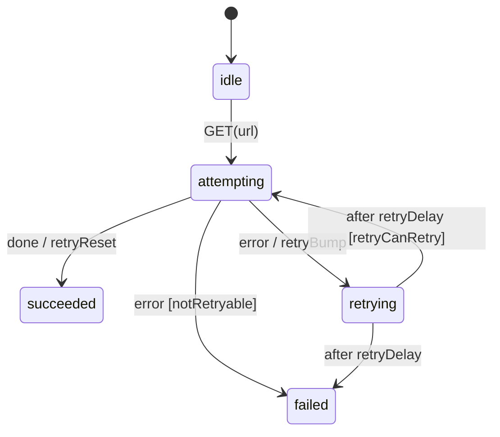

# Recipe: Circuit breaker & retry

The building blocks are documented in [Resilience patterns](../patterns/): [`RetryPolicy`](../patterns/#retry-with-backoff-and-jitter), [dead-lettering](../patterns/#dead-lettering-with-error-context) and [`CircuitBreaker`](../patterns/#circuit-breaker-as-a-statechart). This page puts them together around an HTTP call the way you would in a service, with every choice written down.

Files: [`examples/recipes/circuit_breaker_retry/`](https://github.com/basiltt/xstate-statemachine/tree/main/examples/recipes/circuit_breaker_retry). `http_client.py` is about 60 lines. The transport is stdlib `urllib`, so there is no new dependency.

## The layering

| Layer | Scope | Decides |
|:--|:--|:--|
| `CircuitBreaker` | **shared**: one per upstream, for the whole process | "Is this upstream sick? Then don't call it at all." |
| Retry chart (`RetryPolicy.logic()`) | **per request** | "This call failed. Is it worth trying again, and when?" |
| Transport | per attempt | `send(method, url) -> (status, body)` |

Two rules make the layers compose:

1. **Only retry what can succeed on retry.** 5xx, 429, timeouts and connection errors are retried. Any other 4xx goes straight to `failed`, because the request itself is wrong.
2. **Never retry a breaker rejection.** `CircuitOpenError` means the upstream was *not called*. Retrying would only be rejected again, and it would hide the outage from your metrics. The `notRetryable` guard sends it to `failed` immediately.



```bash
xsm simulate examples/recipes/circuit_breaker_retry/machine.json --events GET
# -> fetchQuote.succeeded  (stub service returns immediately)
```

## The code

```python
import json, random
from xstate_statemachine import MachineLogic, SimulatedClock, SyncInterpreter, create_machine
from xstate_statemachine.patterns import CircuitBreaker, CircuitOpenError, RetryPolicy

class HTTPStatusError(Exception):
    def __init__(self, status): super().__init__(f"HTTP {status}"); self.status = status

def retryable(exc) -> bool:
    if isinstance(exc, CircuitOpenError):
        return False                                   # upstream was not called; do not hammer
    if isinstance(exc, HTTPStatusError):
        return exc.status >= 500 or exc.status == 429
    return isinstance(exc, (TimeoutError, ConnectionError))

responses = [(503, b""), (503, b""), (200, b'{"px": 1.08}')]
def transport(method, url):                            # urllib in production; a script here
    return responses.pop(0)

clock = SimulatedClock()
breaker = CircuitBreaker(failure_threshold=5, cooldown_ms=30_000, clock=clock)   # shared per upstream

def http_get(i, ctx, e):
    def call():
        status, body = transport("GET", ctx["url"])
        if status >= 400:
            raise HTTPStatusError(status)
        return json.loads(body)
    return breaker.call(call)

chart = {"id": "fetch", "initial": "idle", "context": {"attempt": 0}, "states": {
    "idle": {"on": {"GET": {"target": "attempting", "actions": "storeUrl"}}},
    "attempting": {"invoke": {"src": "httpGet",
        "onDone": {"target": "succeeded", "actions": ["retryReset", "storeResult"]},
        "onError": [{"target": "failed", "guard": "notRetryable"},
                    {"target": "retrying", "actions": "retryBump"}]}},
    "retrying": {"after": {"retryDelay": [{"target": "attempting", "guard": "retryCanRetry"},
                                          {"target": "failed"}]}},
    "succeeded": {"type": "final"}, "failed": {"type": "final"}}}

policy = RetryPolicy(max_attempts=4, base_ms=200, jitter="full", rng=random.Random(1).random)
logic = MachineLogic(
    services={"httpGet": http_get},
    actions={"storeUrl": lambda i, ctx, e, a: ctx.update(url=e.payload["url"]),
             "storeResult": lambda i, ctx, e, a: ctx.update(result=e.data)},
    guards={"notRetryable": lambda ctx, e: not retryable(e.error)},
).merge(policy.logic())

req = SyncInterpreter(create_machine(chart, logic=logic), clock=clock).start()
req.send("GET", url="https://quotes.example/v1/eurusd")
for _ in range(5):
    clock.increment(1_000)                             # backoff elapses; no real sleeping
assert req.value == "succeeded" and req.context["result"] == {"px": 1.08}
assert breaker.state == "closed"                       # 2 failures < threshold of 5
```

## What the tests pin down

`tests/recipes/test_circuit_breaker_retry.py` drives the example through a `FakeTransport` that replays scripted responses:

| Scenario | Outcome |
|:--|:--|
| 503, then 200 | `succeeded` after 2 calls |
| `TimeoutError`, then 200 / 429, then 200 | retried, `succeeded` |
| 404 | `failed` after **1** call. A client error is never retried. |
| 500 × ∞ | `failed` after `max_attempts` calls, tagged `dead-letter` |
| 3 requests fail → breaker opens → a 4th request | `failed` with `CircuitOpenError` and **zero** transport calls |
| cooldown elapses → next request | the half-open probe succeeds and the breaker closes |

## Troubleshooting

| `ctx["error"]` says | Why |
|:--|:--|
| `HTTPStatusError: HTTP 404` (any 4xx but 429) | Not retryable: the request is wrong. One call, then `failed`. |
| `HTTPStatusError: HTTP 503` after several calls | Retryable, and `max_attempts` ran out. The state is tagged `dead-letter`. |
| `CircuitOpenError: Circuit 'circuitBreaker' is open; call rejected without invoking the target.` | The breaker is open; the upstream was **not** called. Wait for `cooldown_ms`. |

The breaker is per-process and in memory: N workers have N breakers.

<!-- test: tests/recipes/test_battle_308_b.py::test_circuit_breaker_error_strings -->

Pair the `dead-letter` tag with `DeadLetterPlugin` ([patterns](../patterns/#dead-lettering-with-error-context)) to get a redacted record of every request that gave up.

Related: [WebSocket reconnect](../websocket-reconnect/), [all recipes](../recipes/).
