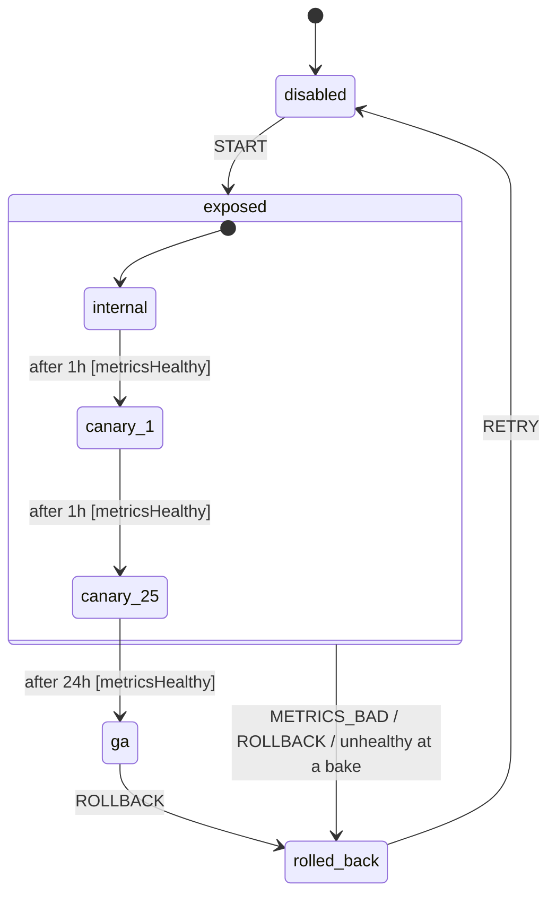

# Recipe: Feature-flag rollout

A progressive rollout is a statechart everyone draws on a whiteboard and then implements as a cron job and a spreadsheet. Here the chart **is** the rollout. It lists the stages, how long each bakes, what "healthy" gates, and what an alert does. Your flag system (LaunchDarkly, Unleash, a database row) receives exposure percentages and nothing else.

Files: [`examples/recipes/feature_flag_rollout/`](https://github.com/basiltt/xstate-statemachine/tree/main/examples/recipes/feature_flag_rollout).



- **Bake times are `after` delays.** Each stage's entry action is `setPercent` with `params`, so the exposure is pushed on entry, **including into `rolled_back`, which pushes 0**.
- **The metrics guard reads a callable** when the bake timer fires, so the promotion decision uses current numbers. Each bake timer has two candidates: promote if `metricsHealthy`, otherwise roll back.
- **`exposed` is a parent state.** `METRICS_BAD` from your alerting and a manual `ROLLBACK` are handled once, for every canary stage. Leaving `exposed` cancels any pending bake timer.

```bash
xsm simulate examples/recipes/feature_flag_rollout/machine.json --events START,+3600000,+3600000,+86400000
# -> rollout.ga
xsm simulate examples/recipes/feature_flag_rollout/machine.json --events START,+3600000 --guards-false metricsHealthy
# -> rollout.rolled_back
```

## The code

```python
import json, pathlib, tempfile
from xstate_statemachine import MachineLogic, SimulatedClock, SyncInterpreter, create_machine

HOUR = 3_600_000
stage = lambda pct, bake, nxt: {"entry": {"type": "setPercent", "params": {"percent": pct}},
                                "after": {str(bake): [{"target": nxt, "guard": "metricsHealthy"},
                                                      {"target": "#rollout.rolled_back"}]}}
chart = {"id": "rollout", "initial": "disabled", "context": {"percent": 0}, "states": {
    "disabled": {"on": {"START": "exposed"}},
    "exposed": {"initial": "internal", "on": {"METRICS_BAD": "#rollout.rolled_back"}, "states": {
        "internal": stage(0.1, HOUR, "canary_1"),
        "canary_1": stage(1, HOUR, "canary_25"),
        "canary_25": stage(25, 24 * HOUR, "#rollout.ga")}},
    "ga": {"entry": {"type": "setPercent", "params": {"percent": 100}}},
    "rolled_back": {"entry": {"type": "setPercent", "params": {"percent": 0}}}}}

live = {"error_rate": 0.001, "p99_ms": 250}                 # your metrics backend
def metrics_healthy(ctx, e): return live["error_rate"] <= 0.01 and live["p99_ms"] <= 800
pushed = []
def set_percent(i, ctx, e, a):
    ctx["percent"] = a.params["percent"]; pushed.append(ctx["percent"])   # -> your flag system

machine = create_machine(chart, logic=MachineLogic(actions={"setPercent": set_percent},
                                                   guards={"metricsHealthy": metrics_healthy}))
clock = SimulatedClock()
r = SyncInterpreter(machine, clock=clock).start()
r.send("START")
clock.increment(HOUR)                                       # internal baked, healthy
clock.increment(HOUR)                                       # canary_1 baked, healthy
live["error_rate"] = 0.04                                   # canary_25 goes bad ...
clock.increment(24 * HOUR)                                  # ... and the bake gate says no
assert r.value == "rolled_back" and pushed == [0.1, 1, 25, 0]
```

A two-day rollout runs in microseconds on a `SimulatedClock`. `tests/recipes/test_feature_flag_rollout.py` covers the healthy path to `ga`, degradation during a canary, an alert at `canary_25` (whose bake timer must *not* fire afterwards), and manual rollback from `ga`, each on both engines.

## Running it for real

Bake times of hours must survive deploys. Persist the rollout, `persisted(store, "rollout:new_checkout", machine)`, and let one scheduler process run `DueTimerScanner`. The [APScheduler recipe](../apscheduler-timers/) shows the job. The guard then runs **in the scheduler process** when the deadline matures, so give that process access to your metrics.

Related: [Delayed transitions](../delayed-transitions/), [Hierarchical states](../hierarchical/), [all recipes](../recipes/).
