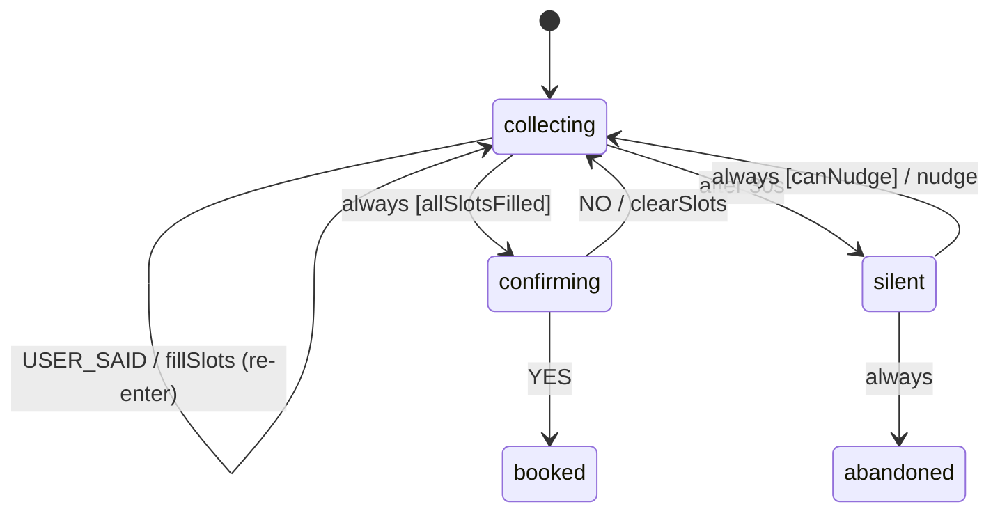

# Recipe: Chatbot slot filling

A booking bot needs a date, a party size and a name, and users give them in any order, several at once, or not at all. The conversation logic is small, and a chart can own all of it. Your NLU, whether an LLM, a regex or Rasa, only **extracts** `{"slot": value}` pairs from a turn and sends them as `USER_SAID`.

Files: [`examples/recipes/slot_filling/`](https://github.com/basiltt/xstate-statemachine/tree/main/examples/recipes/slot_filling).



- **`USER_SAID` is a re-entering self-transition** (`"reenter": true`). It stores whatever slots arrived, and re-entry **restarts the 30 s silence timer**. Every answer buys the user another 30 s.
- **`always` + `allSlotsFilled`**: the moment the last slot lands, in whichever turn, the machine moves to `confirming`. The code never checks "are we done?" by hand.
- **Silence** fires the `after` timer into the transient `silent` state. Its `always` candidates nudge and return to `collecting`, which restarts the timer (`canNudge`: fewer than 2 nudges so far), or abandon the conversation.

```bash
xsm simulate examples/recipes/slot_filling/machine.json --events USER_SAID,YES
# -> booking.booked        (stub guards: allSlotsFilled is True)
xsm simulate examples/recipes/slot_filling/machine.json --events +30000 --guards-false allSlotsFilled,canNudge
# -> booking.abandoned
```

## The code

```python
from xstate_statemachine import MachineLogic, SimulatedClock, SyncInterpreter, create_machine

chart = {"id": "booking", "initial": "collecting",
         "context": {"slots": {"date": None, "party_size": None, "name": None}, "nudges": 0},
         "states": {
    "collecting": {
        "always": {"target": "confirming", "guard": "allSlotsFilled"},
        "on": {"USER_SAID": {"target": "collecting", "reenter": True, "actions": "fillSlots"}},
        "after": {"30000": "silent"}},
    "silent": {"always": [{"target": "collecting", "guard": "canNudge", "actions": "nudge"},
                          {"target": "abandoned"}]},
    "confirming": {"on": {"YES": "booked"}},
    "booked": {"type": "final"}, "abandoned": {"type": "final"}}}

said = []
def missing(ctx): return [k for k, v in ctx["slots"].items() if v is None]
def fill_slots(i, ctx, e, a):
    ctx["slots"].update({k: v for k, v in e.payload.items() if k in ctx["slots"] and v})
    ctx["nudges"] = 0
def nudge(i, ctx, e, a):
    ctx["nudges"] += 1; said.append(f"Still there? I need: {', '.join(missing(ctx))}")

machine = create_machine(chart, logic=MachineLogic(
    actions={"fillSlots": fill_slots, "nudge": nudge},
    guards={"allSlotsFilled": lambda ctx, e: not missing(ctx),
            "canNudge": lambda ctx, e: ctx["nudges"] < 2}))

clock = SimulatedClock()
bot = SyncInterpreter(machine, clock=clock).start()
bot.send("USER_SAID", name="Ann")
clock.increment(30_000)                                   # silence -> nudge
assert said == ["Still there? I need: date, party_size"]
bot.send("USER_SAID", date="Fri", party_size=4)           # two slots in one turn
assert bot.value == "confirming"                          # `always` moved on
bot.send("YES")
assert bot.value == "booked"
```

The example module adds per-slot prompts ("For how many people?"), a confirmation read-back, and `NO` → clear and restart. Its tests run the **same script on `SyncInterpreter` and `Interpreter`** on a `SimulatedClock`, so a conversation lasting minutes is tested in milliseconds.

## Variations

- **Persist the conversation** between turns with `persisted(store, f"chat:{session_id}", machine)`, and the silence timer becomes a durable deadline (see the [APScheduler recipe](../apscheduler-timers/)).
- **Validate a slot** by making `fillSlots` reject bad values and re-prompt. Or add a `slotInvalid` guarded self-transition before the storing one.
- **LLM extraction:** see [LLM agents](../integration-agents/). The model proposes the slot values, and the chart decides what happens next.

Related: [Guards](../guards/), [Delayed transitions](../delayed-transitions/), [all recipes](../recipes/).
