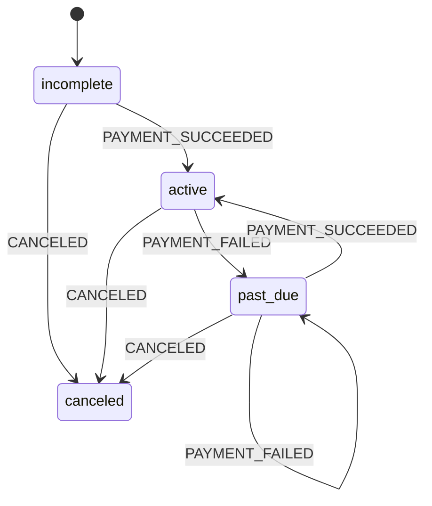

# Recipe: Stripe webhooks

Stripe tells you about a subscription through webhooks. They arrive **at least once**, **out of order under retries**, and from **anyone who knows your URL**. So the endpoint has three jobs before the business logic runs: prove the request came from Stripe, drop duplicates, and make sure a late `invoice.payment_failed` cannot resurrect a canceled subscription. The chart handles the last job. The rest of this page covers the other two.

Files: [`examples/recipes/stripe_webhooks/`](https://github.com/basiltt/xstate-statemachine/tree/main/examples/recipes/stripe_webhooks). The chart is `machine.json`, the logic is `stripe_webhooks.py`, and the two endpoints are `app_fastapi.py` and `app_flask.py`. Recorded payloads are in `fixtures/`.

## The chart



`canceled` handles no events. A late `invoice.paid` for a canceled subscription is answered `200` and changes nothing. Stripe stops retrying, and nothing is double-billed. `machine.json` is plain XState JSON, so it imports into the Stately editor unchanged.

Reproduce the lifecycle without Stripe:

```bash
xsm simulate examples/recipes/stripe_webhooks/machine.json --events PAYMENT_SUCCEEDED,PAYMENT_FAILED,PAYMENT_SUCCEEDED,CANCELED
# -> subscription.canceled
```

## Verify, map, deduplicate, persist

Stripe signs `"<timestamp>.<raw body>"` with HMAC-SHA256 under your endpoint secret, and sends `Stripe-Signature: t=<ts>,v1=<hex>`. Checking it takes about fifteen lines of stdlib code. Compare in **constant time** (`hmac.compare_digest`), and **reject a timestamp outside a tolerance window**. Stripe's own default window is 300 s. Without the window, a request captured once can be replayed forever.

This is the whole flow in miniature, runnable as-is:

```python
import hashlib, hmac, json, time
from xstate_statemachine import MachineLogic, create_machine, receipt_to_status
from xstate_statemachine.persistence import IdempotencyPlugin, MemoryInbox, MemoryStore, persisted

SECRET, TOLERANCE_S = "whsec_demo", 300
EVENT_MAP = {"invoice.paid": "PAYMENT_SUCCEEDED", "invoice.payment_failed": "PAYMENT_FAILED",
             "customer.subscription.deleted": "CANCELED"}

def sign(body: bytes, ts: int) -> str:
    return f"t={ts},v1=" + hmac.new(SECRET.encode(), f"{ts}.".encode() + body, hashlib.sha256).hexdigest()

def verify(body: bytes, header: str, now: float) -> dict:
    parts = dict(p.split("=", 1) for p in header.split(",") if "=" in p)
    ts = int(parts.get("t", "0"))
    if abs(now - ts) > TOLERANCE_S:
        raise ValueError("stale")
    if not hmac.compare_digest(sign(body, ts).split("v1=")[1], parts.get("v1", "")):
        raise ValueError("forged")
    return json.loads(body)

chart = {"id": "subscription", "initial": "incomplete", "context": {"failures": 0}, "states": {
    "incomplete": {"on": {"PAYMENT_SUCCEEDED": "active"}},
    "active": {"on": {"PAYMENT_FAILED": {"target": "past_due", "actions": "fail"}, "CANCELED": "canceled"}},
    "past_due": {"on": {"PAYMENT_SUCCEEDED": "active", "CANCELED": "canceled"}},
    "canceled": {}}}
def fail(i, ctx, e, a): ctx["failures"] += 1
machine = create_machine(chart, logic=MachineLogic(actions={"fail": fail}))
store, inbox = MemoryStore(), MemoryInbox()

def webhook(body: bytes, header: str) -> int:
    try:
        event = verify(body, header, now=time.time())
    except ValueError:
        return 400
    kind = EVENT_MAP.get(event["type"])
    if kind is None:
        return 200                                   # unknown type: ack, ignore
    dedupe = IdempotencyPlugin(inbox, principal=lambda e: "stripe")
    sub_id = event["data"]["object"]["subscription"]
    with persisted(store, f"subscription.{sub_id}", machine, plugins=[dedupe]) as sub:
        return receipt_to_status(sub.send(kind, id=event["id"], wait=True))

paid = json.dumps({"id": "evt_1", "type": "invoice.paid", "data": {"object": {"subscription": "sub_1"}}}).encode()
failed = json.dumps({"id": "evt_2", "type": "invoice.payment_failed", "data": {"object": {"subscription": "sub_1"}}}).encode()
now = int(time.time())
assert webhook(paid, sign(paid, now)) == 200
assert webhook(failed, sign(failed, now)) == 200
assert webhook(failed, sign(failed, now + 1)) == 200          # Stripe retry: answered from the inbox
assert webhook(paid, sign(paid, now - 600)) == 400            # stale timestamp
assert webhook(paid, "t=%d,v1=%s" % (now, "0" * 64)) == 400   # forged
rec = store.load("subscription.sub_1")
assert json.loads(rec.snapshot)["context"]["failures"] == 1   # the retry did NOT count twice
```

The example module splits this into `verify_signature()`, which also accepts several `v1=` entries during secret rotation, and `handle_webhook()`, which returns `(status, json)` and never raises on bad input. The endpoints stay three lines long. If the official SDK is installed, `verify_with_sdk()` calls `stripe.Webhook.construct_event` instead. That import is soft: the recipe itself needs nothing beyond this library.

## The endpoint: FastAPI and Flask

Both endpoints read the **raw body**. The signature covers the exact bytes, so a JSON model must never parse and re-serialize the body first.

<!-- doc-fragment -->
```python
# app_fastapi.py
@app.post("/webhooks/stripe")
async def stripe_webhook(request: Request) -> JSONResponse:
    status, payload = handle_webhook(
        await request.body(), request.headers.get("stripe-signature", ""),
        secret=secret, store=store, inbox=inbox, machine=machine)
    return JSONResponse(payload, status_code=status)

# app_flask.py
@app.post("/webhooks/stripe")
def stripe_webhook():
    status, payload = handle_webhook(
        request.get_data(), request.headers.get("Stripe-Signature", ""),
        secret=secret, store=store, inbox=inbox, machine=machine)
    return jsonify(payload), status
```

(Excerpt; the full files are in the example folder.) Use a `SQLiteInbox(store)` sharing the `SQLiteStore` in production. The inbox mark then commits in the same transaction as the snapshot.

## Guarantees

> **What this does:** a delivery whose signature does not verify under your secret, or whose timestamp is more than 300 s from now, is answered `400` and never reaches the store. The comparison is constant-time (`hmac.compare_digest`). A redelivered `event.id` is answered from the inbox with the **original** receipt (`duplicate=True`), and the machine does not see it again (**X0.2**, idempotency: the inbox scope is `principal / machine / subscription`). Each delivery is **load → send → save** under an optimistic version check (`persisted()`), so two concurrent deliveries for one subscription produce one winner and a `ConflictError`, never a lost update. Error bodies carry a fixed code, not the exception text (**X0.7**, web hardening).
>
> **What this does not do:** Stripe does not guarantee ordering. A `PAYMENT_SUCCEEDED` that overtakes its `PAYMENT_FAILED` is applied in arrival order, and the chart decides what each event means in each state. If you need strict ordering, compare `event.created` in a guard. Nothing retries a `ConflictError` for you: answer `409`/`500` and Stripe will redeliver. Side effects in *actions* (emails) are not covered by the inbox. Put them in an outbox or a service.
>
> See [Guarantees](../guarantees/) and [Security](../security/).

## Test it

`tests/recipes/test_stripe_webhooks.py` replays the recorded fixtures through both endpoints. It checks that a **forged signature**, a **tampered body** and a **stale or future timestamp** are rejected, and that the same `event.id` is applied **exactly once**.

Related: [Idempotency](../persistence/#idempotency-the-inbox), [FastAPI](../integration-fastapi/), [Flask](../integration-flask/), [all recipes](../recipes/).
