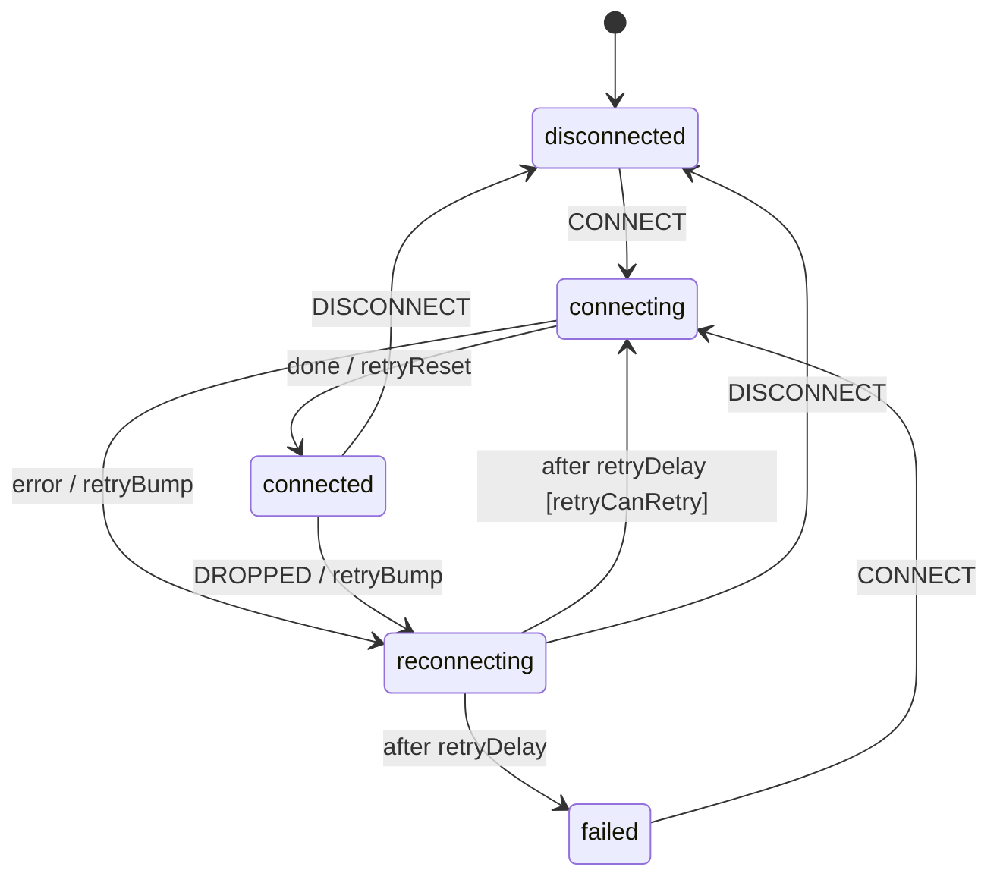

# Recipe: WebSocket reconnect

Reconnect logic is where hand-written socket clients rot. There is the backoff counter, the retry that fires after the user already clicked *Disconnect*, and the socket that is never closed because the state changed while it was opening. As a chart, each of those is a transition, and the library supplies both hard parts:

- **`RetryPolicy(...).logic()`** provides a *named delay* `retryDelay` (exponential backoff with jitter, computed from `ctx["attempt"]`) and `retryCanRetry` / `retryBump` / `retryReset`.
- **`from_callback(listen)`** turns the live connection into an actor that exists **exactly while `connected` is active**. Messages and the close become events. Its cleanup closes the socket whenever the state is left, *for any reason*.

Files: [`examples/recipes/websocket_reconnect/`](https://github.com/basiltt/xstate-statemachine/tree/main/examples/recipes/websocket_reconnect).



```bash
xsm simulate examples/recipes/websocket_reconnect/machine.json --events CONNECT,DROPPED,DISCONNECT
# -> socket.disconnected   (a drop, then the user leaves mid-backoff: no retry fires)
```

`retryDelay` is a *named* delay, which the simulator's stub logic leaves unresolved. Supply the policy's logic, as below, to step through the backoff.

## The code

```python
import random
from xstate_statemachine import MachineLogic, SimulatedClock, SyncInterpreter, create_machine, from_callback
from xstate_statemachine.patterns import RetryPolicy

class FakeClient:                         # your adapter over `websockets`, `aiohttp`, ...
    fail = 0
    def connect(self):
        if FakeClient.fail:
            FakeClient.fail -= 1; raise ConnectionRefusedError
    def close(self): self.closed = True

chart = {"id": "socket", "initial": "disconnected", "context": {"attempt": 0}, "states": {
    "disconnected": {"on": {"CONNECT": "connecting"}},
    "connecting": {"invoke": {"src": "openSocket",
                              "onDone": {"target": "connected", "actions": "retryReset"},
                              "onError": {"target": "reconnecting", "actions": "retryBump"}}},
    "connected": {"invoke": {"src": "listen"},
                  "on": {"DROPPED": {"target": "reconnecting", "actions": "retryBump"},
                         "DISCONNECT": "disconnected"}},
    "reconnecting": {"on": {"DISCONNECT": "disconnected"},
                     "after": {"retryDelay": [{"target": "connecting", "guard": "retryCanRetry"},
                                              {"target": "failed"}]}},
    "failed": {}}}

sockets = []
def open_socket(i, ctx, e):
    c = FakeClient(); c.connect(); sockets.append(c)       # raises -> onError
def listen(send_back, receive, ctx, e):
    c = sockets[-1]
    c.drop = lambda: send_back("DROPPED")                  # wire your client's on_close here
    return c.close                                         # cleanup, exactly once

policy = RetryPolicy(max_attempts=3, base_ms=1000, jitter="full", rng=random.Random(7).random)
logic = MachineLogic(services={"openSocket": open_socket, "listen": from_callback(listen)}).merge(policy.logic())
clock = SimulatedClock()
s = SyncInterpreter(create_machine(chart, logic=logic), clock=clock).start()

s.send("CONNECT")
assert s.value == "connected"
sockets[-1].drop(); clock.increment(0)                     # the server went away
assert s.value == "reconnecting" and sockets[-1].closed    # old socket closed by the cleanup
clock.increment(1000)                                      # full jitter: at most base_ms
assert s.value == "connected" and s.context["attempt"] == 0

FakeClient.fail = 99                                       # server stays down
sockets[-1].drop(); clock.increment(0)
for _ in range(3): clock.increment(4000)
assert s.value == "failed"                                 # gave up after max_attempts
```

## Why jitter

When a server restarts, every client drops at the same instant. With pure exponential backoff they all come back at the same instants too (1 s, 2 s, 4 s) and knock the server over again. `jitter="full"` spreads each retry uniformly over `[0, delay]`. Inject `rng=random.Random(seed).random` in tests and the delays become exact. The recipe's test uses a seeded RNG and asserts that the machine stays `reconnecting` until one millisecond before the computed delay, then reconnects.

## What the tests pin down

`tests/recipes/test_websocket_reconnect.py` runs every case on **`SyncInterpreter` and `Interpreter`**:

- receive a message, then disconnect: the socket is closed by the `from_callback` cleanup;
- a drop reconnects after exactly the jittered delay and resets `attempt`;
- after `max_attempts` failed connects the machine is `failed`, having made 3 connects, not 4;
- `DISCONNECT` during backoff cancels the pending retry, and no connect happens afterwards.

Related: [Resilience patterns → RetryPolicy](../patterns/), [Actors → callback logic](../actors/), [Circuit breaker & retry](../circuit-breaker-retry/), [all recipes](../recipes/).
