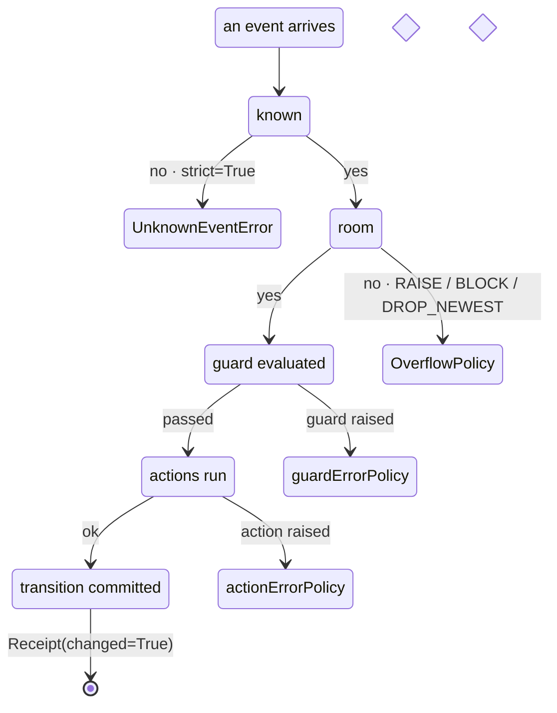

Version 0.8.0 closed 34 defects with a single theme: **the library failed silently by default**. A dropped event, a half-applied transition, a guard that raised and was treated as `False` — each looked like normal operation. This page is the map of every knob that turns those into signals you can see, with a runnable example for each.



Every policy below is **per machine** and its default preserves 0.7.x behaviour. Set them explicitly in anything that handles money or safety.

> **Two 1.0 deprecations start now.** `actionErrorPolicy` still defaults to `"continue"` but emits a one-shot `DeprecationWarning`; it flips to `"rollback"` in 1.0. `create_machine(strict_targets=False)` is removed in 1.0.

---

## 1. Half-applied transitions — `actionErrorPolicy`

When an action raises mid-transition, three things could happen. You choose.

| Policy | Configuration | Context | Machine |
|---|---|---|---|
| `"continue"` *(0.7 default)* | committed | partially mutated | running |
| `"rollback"` *(1.0 default)* | **restored** | **restored** | running |
| `"fail"` | cleared | restored | `status == "stopped"`, `interp.error` is the `TransitionFailedError` (0.8.1, #145 — was `"error"` with the pre-transition leaf still reported) |

```python
from xstate_statemachine import create_machine, SyncInterpreter, MachineLogic

def charge(interp, ctx, event, action_def):
    ctx["charged"] = True
    raise RuntimeError("gateway timeout")

config = {
    "id": "payment",
    "initial": "idle",
    "actionErrorPolicy": "rollback",
    "context": {"charged": False},
    "states": {
        "idle": {"on": {"PAY": {"target": "paid", "actions": "charge"}}},
        "paid": {},
    },
}
machine = create_machine(config, logic=MachineLogic(actions={"charge": charge}))
interp = SyncInterpreter(machine).start()

receipt = interp.send("PAY", wait=True)

assert receipt.changed is False                   # nothing was committed
assert isinstance(receipt.error, RuntimeError)     # but you are told why
assert interp.active_state_ids == {"payment.idle"} # configuration restored
assert interp.context["charged"] is False          # context restored too
interp.stop()
```

Rollback also **stops any actors the failed transition spawned**, so a retried transition does not leak a child from the attempt before it.

---

## 2. Events that vanish — `onUnhandled`, `strict`, `event_schemas`

Three different ways an event can go nowhere, three different signals.

### An event nothing handles in the current state — `onUnhandled`

`"ignore"` (the 0.7 default) drops it. `"defer"` buffers it and replays it at the head of the queue once the machine moves — useful when the handler is one transition away. `"error"` raises `UnhandledEventError`. Whatever the policy, the `on_unhandled_event` plugin hook fires with the disposition.

```python
from xstate_statemachine import create_machine, SyncInterpreter, PluginBase

class Audit(PluginBase):
    def __init__(self):
        self.seen = []
    def on_unhandled_event(self, interp, event, active_state_ids, disposition):
        self.seen.append((event.type, disposition))

config = {
    "id": "door",
    "initial": "closed",
    "onUnhandled": "defer",
    "states": {"closed": {"on": {"OPEN": "open"}}, "open": {"on": {"CLOSE": "closed"}}},
}
audit = Audit()
interp = SyncInterpreter(create_machine(config)).use(audit).start()

interp.send("CLOSE")                       # nothing handles it while closed
assert audit.seen == [("CLOSE", "deferred")]
assert interp.deferred_count == 1

interp.send("OPEN")                        # now CLOSE has a handler: replayed first
assert interp.active_state_ids == {"door.closed"}
assert interp.deferred_count == 0
interp.stop()
```

### An event the machine has never heard of — `strict`

`strict=True` raises `UnknownEventError` **at the call site**, with a did-you-mean suggestion, instead of enqueueing a typo that silently drops.

```python
from xstate_statemachine import create_machine, SyncInterpreter, UnknownEventError

config = {"id": "d", "initial": "closed",
          "states": {"closed": {"on": {"OPEN": "open"}}, "open": {}}}
interp = SyncInterpreter(create_machine(config), strict=True).start()

try:
    interp.send("OPNE")
except UnknownEventError as e:
    assert "OPEN" in str(e)     # did you mean OPEN?
interp.stop()
```

### A well-known event with a malformed payload — `event_schemas`

```python
from xstate_statemachine import create_machine, SyncInterpreter, InvalidEventPayloadError

config = {"id": "cart", "initial": "open",
          "states": {"open": {"on": {"ADD": "open"}}}}
def add_schema(payload):
    if "sku" not in payload or "qty" not in payload:
        raise ValueError("ADD needs sku and qty")

machine = create_machine(config, event_schemas={"ADD": add_schema})
interp = SyncInterpreter(machine).start()

interp.send("ADD", sku="w1", qty=2)          # fine
try:
    interp.send("ADD", sku="w1")             # qty missing
except InvalidEventPayloadError:
    pass
interp.stop()
```

---

## 3. Guards that raise — `guardErrorPolicy`

A guard that throws used to be treated as `False`, which quietly picked the *other* branch. Now you pick: `"false"` (0.7 behaviour), `"true"`, or `"raise"`. With `"raise"` the exception reaches the `send()` caller (sync) or the `wait=True` receipt (async) — but it cancels **only its own candidate** (0.8.1, #152): lower-priority candidates in the same array are still evaluated, so an unguarded fallback is taken, and `last_error` carries the guard's exception. Before 0.8.1 the raise aborted the whole selection pass, which silently dropped engine-driven events such as an `invoke.onDone` whose guarded branch failed.

```python
from xstate_statemachine import create_machine, SyncInterpreter, MachineLogic

def is_verified(ctx, event):
    return ctx["user"]["verified"]      # KeyError if user is None

config = {
    "id": "gate", "initial": "waiting",
    "guardErrorPolicy": "raise",
    "context": {"user": None},
    "states": {
        "waiting": {"on": {"ENTER": [
            {"target": "inside", "guard": "isVerified"},
            {"target": "denied"},
        ]}},
        "inside": {}, "denied": {},
    },
}
interp = SyncInterpreter(
    create_machine(config, logic=MachineLogic(guards={"is_verified": is_verified}))
).start()

try:
    interp.send("ENTER")
except TypeError:
    pass                                             # surfaced, not swallowed
assert interp.active_state_ids == {"gate.denied"}   # the unguarded fallback was taken (#152)
assert isinstance(interp.last_error, TypeError)      # ...and the failure is still on record
interp.stop()
```

Every failure path also fires a `PluginBase` hook — `on_action_error`, `on_guard_error`, `on_resolve_error` (an unresolvable target under `strict_targets=False`), `on_unhandled_event`, `on_event_dropped`, `on_transition_failed`, and `on_plugin_error` for a failure inside *another* plugin — so you can ship metrics without touching machine code.

---

## 4. Bad machines — rejected at build time

Unresolvable targets used to surface at runtime, if at all. `create_machine()` now rejects them with **every finding in one message**, each line naming the state, the event and the missing target.

```python
from xstate_statemachine import create_machine, InvalidConfigError

bad = {"id": "b", "initial": "a",
       "states": {"a": {"on": {"GO": "nowhere"}}}}
try:
    create_machine(bad)
except InvalidConfigError as e:
    assert "b.a: on 'GO' -> target 'nowhere' does not resolve" in str(e)
```

---

## 5. Unbounded inbox — `max_queue_size` + `OverflowPolicy`

A producer that outruns the machine used to grow memory without bound and without a trace.

```python
import asyncio
from xstate_statemachine import (
    create_machine, Interpreter, OverflowPolicy, QueueOverflowError,
)

config = {"id": "q", "initial": "idle", "states": {"idle": {"on": {"TICK": "idle"}}}}

async def main():
    interp = await Interpreter(
        create_machine(config),
        max_queue_size=2,
        overflow_policy=OverflowPolicy.RAISE,
    ).start()
    await interp.send("TICK")
    await interp.send("TICK")
    try:
        await interp.send("TICK")            # third one: RAISE
    except QueueOverflowError:
        pass
    assert interp.queue_depth <= 2
    await interp.stop()

asyncio.run(main())
```

`BLOCK` applies backpressure to the producer; `DROP_NEWEST` discards and fires `on_event_dropped`. `queue_depth` is observable either way.

---

## 6. Fire-and-forget — `send(wait=True)` → `Receipt`

`send()` enqueues and returns. With `wait=True` it resolves once the event's *macrostep* has finished, telling you what actually happened:

```python
from xstate_statemachine import create_machine, SyncInterpreter

config = {"id": "t", "initial": "off",
          "states": {"off": {"on": {"TOGGLE": "on"}}, "on": {"on": {"TOGGLE": "off"}}}}
interp = SyncInterpreter(create_machine(config)).start()

r = interp.send("TOGGLE", wait=True)
assert r.state_ids == frozenset({"t.on"})
assert r.changed is True
assert r.error is None

r = interp.send("NOPE", wait=True)          # unhandled, non-strict
assert r.changed is False                   # nothing moved, and you know it
interp.stop()
```

`send_priority()` puts an event ahead of the backlog for decisions that cannot wait behind routine traffic. `send_threadsafe()` delivers from a plain thread into an asyncio interpreter.

---

## 7. Snapshots that lie — envelope v1 + `SnapshotDriftError`

Snapshots carry a `version`, the `machine_id`, and a `machine_hash`. Restoring into a structurally different machine is refused instead of producing an interpreter in a state that no longer exists.

```python
from xstate_statemachine import create_machine, SyncInterpreter, SnapshotDriftError

v1 = {"id": "wf", "initial": "draft",
      "states": {"draft": {"on": {"SUBMIT": "review"}}, "review": {}}}
v2 = {"id": "wf", "initial": "draft",
      "states": {"draft": {"on": {"SUBMIT": "approved"}}, "approved": {}}}   # 'review' is gone

interp = SyncInterpreter(create_machine(v1)).start()
interp.send("SUBMIT")
snap = interp.get_snapshot()
interp.stop()

try:
    SyncInterpreter.from_snapshot(snap, create_machine(v2))
except SnapshotDriftError:
    pass                                   # refused, loudly
```

Pending inbox and deferred events survive a snapshot; `from_snapshot(restart_services=True)` re-invokes services that were mid-flight, and `pending_invocations()` lists them.

---

## 8. Time you can test — `SimulatedClock`

`after` timers and delayed sends run against an injectable `Clock`. In tests, a thirty-second timeout fires in microseconds and **deterministically**.

```python
from xstate_statemachine import create_machine, SyncInterpreter, SimulatedClock

config = {"id": "sess", "initial": "active",
          "states": {"active": {"after": {"30000": "expired"}}, "expired": {"type": "final"}}}
clock = SimulatedClock()
interp = SyncInterpreter(create_machine(config), clock=clock).start()

assert interp.active_state_ids == {"sess.active"}
clock.increment(29_999)
assert interp.active_state_ids == {"sess.active"}
clock.increment(1)
assert interp.active_state_ids == {"sess.expired"}
interp.stop()
```

In production, `RealClock` gives due timers a **priority lane** so a busy inbox cannot starve them (500 busy machines: ~46 ms late, was ~180 ms).

---

## Recommended production settings

```python
from xstate_statemachine import create_machine, Interpreter, OverflowPolicy

config = {
    "id": "orders",
    "initial": "idle",
    "actionErrorPolicy": "rollback",     # explicit: the 1.0 default
    "guardErrorPolicy": "raise",
    "onUnhandled": "error",
    "states": {"idle": {}},
}

machine = create_machine(
    config,
    strict_targets=True,                  # explicit: the only 1.0 mode
)

interp = Interpreter(
    machine,
    strict=True,
    max_queue_size=10_000,
    overflow_policy=OverflowPolicy.BLOCK,
)
```

Then in every test: inject a `SimulatedClock`, assert on `Receipt`s, and register a `PluginBase` that fails the test on any `on_*_error` hook.

---

## Where each knob is covered in depth

| Knob | Page |
|---|---|
| `actionErrorPolicy`, `guardErrorPolicy`, `onUnhandled` | [Actions](/xstate-statemachine/guide/actions/), [Guards](/xstate-statemachine/guide/guards/), [JSON Reference](/xstate-statemachine/guide/json-config/) |
| `strict`, `event_schemas`, `UnknownEventError` | [Interpreters](/xstate-statemachine/guide/interpreters/), [Troubleshooting](/xstate-statemachine/guide/troubleshooting/) |
| `OverflowPolicy`, `queue_depth`, `send_priority` | [Interpreters](/xstate-statemachine/guide/interpreters/), [Production Characteristics](/xstate-statemachine/guide/production-characteristics/) |
| `Receipt`, `send(wait=True)` | [Testing & Pure API](/xstate-statemachine/guide/testing-and-pure-api/) |
| Snapshot envelope, `SnapshotDriftError`, `RestoredError` | [Snapshots](/xstate-statemachine/guide/snapshots/) |
| `Clock`, `SimulatedClock`, timer priority lane | [Delayed Transitions](/xstate-statemachine/guide/delayed-transitions/), [Production Characteristics](/xstate-statemachine/guide/production-characteristics/) |
| Every `on_*` hook | [Plugins](/xstate-statemachine/guide/plugins/) |
| 31 audit repro scripts, run in CI | [`tests/tests_adoption/`](https://github.com/basiltt/xstate-statemachine/tree/main/tests) |
