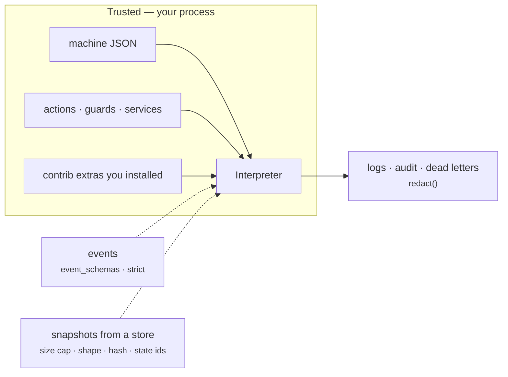

# Security

The short version is in [`SECURITY.md`](https://github.com/basiltt/xstate-statemachine/blob/main/SECURITY.md) at the repository root: how to report, what is supported, and the **trust model** — installed packages are trusted, your machine definition is trusted, **events and snapshots are not**. This page is the longer companion: the numbered baseline every integration is built against, with the evidence for each item. Its twin, [Guarantees](../guarantees/), covers crash consistency.

## Trust boundaries in one picture

Solid arrows are code you wrote or chose. Dotted arrows cross the boundary and are validated at the `send()` and `from_snapshot()` seams; nothing that crosses them is ever executed.

## The baseline, item by item

Item numbers are those of [#303](https://github.com/basiltt/xstate-statemachine/issues/303) — the same numbers every integration page's **Threat model** box cites. "Evidence" is a test that fails if the property regresses, or the CI job that enforces it. Items whose integration has not shipped yet say so; they are enforced by the group PR that ships it.

| # | Item (#303) | What the library does today | Evidence |
|:--|:--|:--|:--|
| X0.1 | Closed-by-default HTTP surface | `StatechartRegistry.register(authorize=)` is **required**; `allow_all` is explicit and warns; `GET` returns state only unless `context_serializer=`; generated routers emit an `authorize` stub that raises | `tests/contrib/starlette/test_starlette.py::TestHTTP` (403 / warn-once); `tests/contrib/fastapi`, `tests/contrib/litestar` |
| X0.2 | Idempotency contract | Inbox scope is `principal / machine.id / instance_key`, each part escaped so the join is **injective**; `principal=` is **required** and must return a non-empty `str` — any other value (`None`, `""`, bytes) is refused, never pooled into a shared scope; HTTP: `Idempotency-Key` reused with a different body → 422, in flight → 409, duplicate → the original receipt | `tests/persistence/test_idempotency.py::TestInboxContract::test_principal_scopes_keys`; `tests/contrib/starlette/test_starlette.py::TestHTTP`; `tests/test_battle_303_x0_core.py::TestX01Principal`, `::TestX02Idempotency` (cross-principal replay, 16-thread same key, hostile keys, TTL, ring eviction) |
| X0.3 | Crash-consistency spec | The [Guarantees](../guarantees/) page | tests named on that page; `tests/test_battle_303_x0_core.py::TestX03Crash` (kill-9 inside `os.replace` in a child process, `ENOSPC` on fsync, crash between inbox claim and mark) |
| X0.4 | Safe deserialisation | JSON only, never pickle; `pickle`, `marshal`, `shelve`, `yaml.load`, `eval`, `exec` do not appear under `src/` (one marked, justified exemption in the CLI verifier); snapshots are size-capped **before** `json.loads` (`max_snapshot_bytes`, 1 MiB; `SnapshotTooLargeError`; `FileStore` bounds the file *read* itself), shape-validated, drift-checked, and every state id must exist; undecodable, non-UTF-8 or pathologically nested payloads raise `SnapshotCorruptError`, never a bare `RecursionError` / `UnicodeDecodeError`; `expected_machine_hash=` is compared, never trusted | `tests/test_security_baseline.py::TestNoUnsafeDeserialisation`; `test_store_contract.py::TestContract::test_size_cap_on_save_and_load`; `tests/test_round4_findings.py::TestSnapshotShapeValidation`; `tests/test_round9_findings.py::test_expected_machine_hash_is_compared_not_trusted`; `tests/test_battle_303_x0_core.py::TestX04Deserialisation` (8 MB of spaces never parsed, 100 000-deep nesting, non-UTF-8, dunder keys) |
| X0.5 | Data protection | One `redact()` denylist applied by `LoggingInspector`, `AuditPlugin`, dead letters and the Redis log stream — it matches mapping **keys** by case-insensitive substring with `-` treated as `_` (`x-api-key`, `Authorization`); secrets inside string *values* are not redacted; `FileStore` `0700`/`0600`, SQLite DB + `-wal`/`-shm` `0600`; `forget(key)` erases every table keyed by the instance (snapshot, deadlines, locks, and a co-located transition log) — inbox rows are scoped by principal and erased with `inbox.forget(scope)`; store keys validated (`validate_key`), percent-encoded on disk, `prefix` mandatory on Redis | `tests/test_round4_findings.py::TestLoggingInspectorRedaction`, `tests/test_round5_findings.py::TestRedactionGaps`; `test_file_store.py::test_permissions`, `test_sqlite_store.py::test_db_file_mode_0600`; `test_store_contract.py::TestContract::test_delete_and_forget`, `::test_invalid_keys`; `test_file_store.py::TestKeyEncoding`, `TestPathSafety`; `tests/test_battle_303_x0_core.py::TestX05Redaction`, `::TestX05Store` (traversal / NUL / 10 kB / NFC-vs-NFD keys, `forget` leaves zero rows in every table) |
| X0.6 | Telemetry hygiene | `[observability]` (#273): event-type label values come from the chart allow-list with an `unknown` fallback (engine events collapse to `after`/`done`/`error`/`xstate`); every label dimension is capped by `max_label_values` → `other`; payloads, context, instance keys and correlation ids are never labels or span attributes by default (`record_context=True` is opt-in and redacted); Sentry tags carry names only. The live inspector (#274) applies the same idea to data: context deny-by-default via `context_allowlist`, payloads off by default | `tests/contrib/observability/test_otel_prometheus.py::TestPrometheus::test_cardinality_guard_with_1000_event_names`, `::TestPrometheus::test_every_metric_after_a_scripted_run`, `::TestOpenTelemetry::test_unknown_event_type_is_not_an_attribute_value`; `tests/inspect/test_protocol_fixtures.py::TestRedaction`; `tests/test_battle_303_x0_integrations.py::TestX06Prometheus`, `::TestX06OpenTelemetry`, `::TestX06Sentry`, `::TestX06Inspector` |
| X0.7 | Web hardening | JSON-only bodies (415), size cap (413), RFC 9457 problem responses carrying the exception **class name only** — never `str(exc)`; SSE and WebSocket refuse a browser `Origin` that is neither on `allowed_origins` nor equal to the request's `Host` — this blocks cross-site pages but not a client that forges both headers, so `authorize=` remains the access gate; a JSON body that names a `send()` option (`wait`, `priority`) is refused with 422 `ReservedKeyError` — client data never sets an engine option; CSRF note for cookie auth on every web page. Live inspector (#274): per-run `secrets.token_urlsafe(32)` compared with `hmac.compare_digest`, token in the URL only on first load (then an `HttpOnly; SameSite=Strict` cookie), loopback bind + `Host` check, non-loopback requires an explicit token, strict CSP, recordings 0600 | `tests/contrib/starlette/test_starlette.py::TestHTTP`, `::TestSSE`, `::TestWebSocket`, `::TestInspectorWebSocket`; `tests/inspect/test_sinks.py::TestSse`; `tests/test_battle_303_x0_integrations.py::TestX07Starlette`, `::TestX07StarletteStreams`, `::TestReservedSendKeys`, `::TestX07Flask`, `::TestX07Quart`, `::TestX07DjangoTemplates` (50 MB body never parsed, `hunter2` never in a 500, forged `Origin`, traversal keys, cross-principal idempotency header) |
| X0.8 | Poison messages & backpressure | Per-envelope attempt counter → DLQ + ack after `max_attempts` (never an infinite redelivery loop); unknown `type` / corrupt envelope dead-lettered, never raised; at the broker adapters an undecodable or oversized message (it has no envelope id, so it cannot be redelivered meaningfully) is recorded in the adapter's `dead_letters=` store (`reason="corrupt"`, size and error only, never the body) and dropped, never looped ([Brokers](../integration-brokers/#reference)); `max_in_flight` bounds concurrent subjects; credential-bearing extensions refused, only `ce-*` headers read; a malformed `traceparent` extension makes the envelope corrupt (dead-lettered, never raised) while a malformed `traceparent` in an event payload is ignored by the OpenTelemetry plugin; `xsm dlq replay` is a dry run unless `--no-dry-run --yes --reason`, refuses a changed machine without `--force`, and is audited ([Event-driven](../integration-eda/#threat-model)) | `tests/eda/test_dispatcher.py::TestPoison`; `tests/eda/test_envelope.py::TestValidation`; `tests/contrib/cloudevents/test_cloudevents.py::TestSDK::test_no_credentials_from_headers`; `tests/tests_cli/test_eda_cli.py::TestDlqReplay`; `tests/test_battle_303_x0_integrations.py::TestX08Poison`, `::TestX08DlqReplayCli` |
| X0.8b | Celery (`[celery]`, #292) | JSON-only task **and** result deserialisation: `assert_json_serializer` refuses pickle / YAML by name or MIME type in `accept_content` and `result_accept_content`, and requires JSON task and result serializers, in every entry point (`celery_service`, `@statechart_task`, `connect_signals`, `poll_results`); task headers are trusted only after the persisted instance confirms the invocation and task id ([Celery](../integration-celery/#threat-model)) | `tests/contrib/celery/test_celery.py::TestJsonOnly`, `::TestDurableDelivery::test_stale_or_forged_completion_is_ignored`; `tests/test_battle_303_x0_integrations.py::TestX08bCelery` (8 unsafe configs × 5 entry points) |
| X0.9 | Timers & clocks | A `Deadline` is an absolute wall-clock instant (`wall_now()`) tagged with the state-entry generation; the scanner re-reads under the lock and skips a machine another worker advanced; an orphan deadline after a migration fails loudly (`StateNotFoundError`; under `DueTimerScanner` it is reported in `last_result.errors` and the deadline is retained, never silently dropped); a backwards wall-clock jump fires nothing and keeps the deadline | `test_durable_timers.py::TestScanner::test_stale_under_lock_is_skipped`, `TestRestartModes::test_orphan_deadline_after_migration_fails_loudly`; `tests/test_battle_303_x0_core.py::TestX09Timers` (two workers, one store, each deadline once) |
| X0.10 | Schema lifecycle | `FileStore` records carry `format`; SQLite has a versioned schema with idempotent upgrades; a **newer** version is refused with an upgrade message, never guessed at; the snapshot layout is versioned (`SNAPSHOT_VERSION`, one `upcast()` per release) | `test_file_store.py::test_record_carries_format_version_and_refuses_newer`, `test_sqlite_store.py::TestSchema::test_newer_schema_refused`, `tests/test_core_prereqs_305.py`; `tests/test_battle_303_x0_core.py::TestX010Schema` |
| X0.11 | Lifecycle | Graceful shutdown with a bounded drain of in-flight `act()` calls; residents capped (`max_residents`) and idle-evicted; WebSocket heartbeat; `max_connections_per_key`; 100 connect/disconnect cycles leave 0 residents and no stray tasks | `tests/contrib/starlette/test_starlette.py::TestWebSocket`, `::TestResidents` (leak test) |
| X0.12 | Operability | `health_route()` / `ready_route()` on the registry (503 before start); `DueTimerScanner.last_result`; the `perf` nightly and `benchmarks/budgets.json` | `tests/contrib/starlette/test_starlette.py` (probes); `tests/test_perf_budgets.py` (nightly) |
| X0.13 | Agent safety | `run_tool` re-checks registration, the active state's `meta.tools` allow-list, strict argument schema and per-call human approval for `side_effect=True` tools before executing anything; mandatory per-tool `timeout_s` (on the sync engine an overrunning tool keeps running to completion on a daemon thread `xsm-tool-<name>` while the machine moves to `timed_out`; its late result is discarded); output truncated to `max_output_chars`; `messages` bounded (`max_messages` / `summarise`); `api_key` / `authorization` / `*token*` redacted from tool output and traces; traces record no content by default; a sub-agent's tools must be a subset of its parent's ([LLM agents](../integration-agents/#threat-model)) | `tests/contrib/agents/test_tool_loop.py::TestSafety` (incl. `test_injected_tool_result_requesting_disallowed_tool`); `tests/contrib/agents/test_multi_agent.py::TestSubsetRule`; `tests/contrib/agents/test_trace.py`; `tests/test_battle_303_x0_integrations.py::TestX13Agents` |
| X0.14 | Supply chain & plugins | Every extra has a lower bound; `pip-audit --strict` over `[all]` (the union of every shipped extra); every GitHub Action pinned to a commit SHA; the core import path touches no third-party module and nothing under `contrib` loads implicitly; entry-point plugin discovery is explicit only (`discover()` / `attach_discovered()` / `xsm plugins`), filterable with `allow=`, and disabled by `XSM_DISABLE_PLUGIN_DISCOVERY=1` | `.github/workflows/ci.yml` job **`audit`**; `tests/test_security_baseline.py::TestActionsArePinned`; `tests/test_zero_dependency.py`; `tests/test_import_surface.py`; `tests/test_plugin_discovery.py::TestNothingOnImport`; CI job `core-zero-dep`; `tests/test_battle_303_x0_integrations.py::TestX14Discovery` |
| X0.15 | Platform | SQLite `busy_timeout`, UNC/network-share detection → warning + `journal_mode=DELETE`; `FileStore` documents itself unsafe on network shares; atomic `os.replace` writes | `test_sqlite_store.py::test_network_path_warns_and_uses_delete_journal`, `::test_locked_database_maps_to_lock_timeout`; `test_file_store.py::TestAtomicWrite` |
| X0.16 | Test hygiene | Every test job runs `pytest --disable-socket --allow-hosts=127.0.0.1,::1`; timing tests are opt-in (`XSM_PERF=1`) and nightly only | `.github/workflows/ci.yml` (`test`, `coverage`, `contrib`, `perf`) |
| X0.17 | `SECURITY.md` + boxes | The trust model in `SECURITY.md` and this page; every integration page carries **Guarantees** and **Threat model** boxes from `docs/_templates/integration-page.md` | `tests/test_docs_site.py::TestSecurityBaseline`, `::TestIntegrationsSection` |

Two properties the table folds in rather than numbering separately, because #303 lists them under other items: **loud failure over silence** (unknown config keys, missing implementations, undeclared events under `strict` all raise — see [Reliability](../reliability/)), and the **caller-pinned machine hash** on restore (under X0.4).

## Configuration you own

The table above is what the library does unprompted. These are the switches you must set deliberately; each is the "What you must do" column of `SECURITY.md` in more detail.

- **`event_schemas=` / `strict=True`.** Without a schema an event payload is an opaque `dict`. With the `[pydantic]` extra, `context_model` and `event_schemas` validate at the boundary and reject before any action runs.
- **`principal=` on `IdempotencyPlugin`.** Derive it from your authenticated identity, never from the payload — an attacker who controls it can replay another tenant's receipt.
- **`codec=` on any store** if `context` holds anything you would not put in a log line. Redaction protects sinks; it does not encrypt the snapshot.
- **`redact_keys=`** to extend the denylist with your own field names (`card_number`, `ssn`, …).
- **Exception messages in receipts.** `receipt_to_json()` copies the exception's class name and `str(error)` verbatim into `error.message` — it does **not** redact. The idempotency inbox caches that JSON and the web adapters' RFC 9457 problem bodies deliberately carry the class name only (X0.7); if you serialise a receipt yourself (your own cache, your own response body), scrub `message` first, or raise exceptions whose `str()` never contains a secret. Pinned by `tests/test_battle_305_snapshots_clock_codec.py::test_secret_in_error_message_is_not_redacted_by_codec`.
- **`prefix=`** per application on Redis, and credentials/TLS on the connection.
- **`purge_older_than` / `ttl_s` / `maxlen`** so an unbounded key space is a decision, not an accident.

## What is out of scope

The library does not authenticate callers, rate-limit `send()`, or encrypt at rest on its own. Those belong to the layer that owns the socket — the web framework, the broker, the host — and the integration pages for those layers say exactly what they add.
