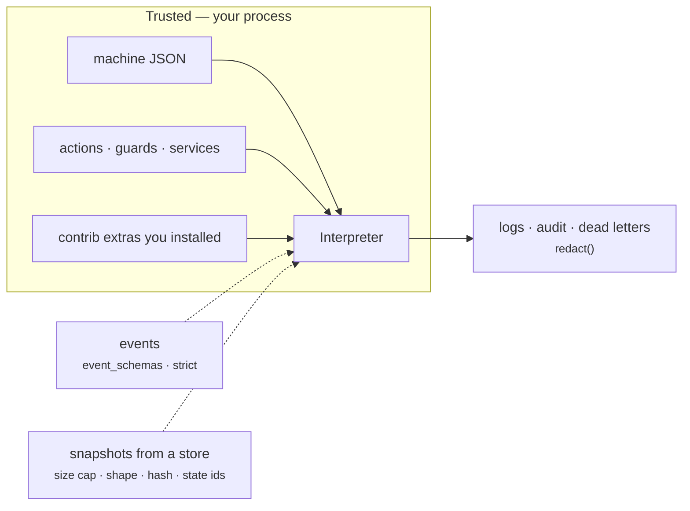

# Security

The short version is in [`SECURITY.md`](https://github.com/basiltt/xstate-statemachine/blob/main/SECURITY.md) at the repository root: how to report, what is supported, and the **trust model** — installed packages are trusted, your machine definition is trusted, **events and snapshots are not**. This page is the longer companion: the numbered baseline every integration is built against, with the evidence for each item. Its twin, [Guarantees](../guarantees/), covers crash consistency.

## Trust boundaries in one picture

Solid arrows are code you wrote or chose. Dotted arrows cross the boundary and are validated at the `send()` and `from_snapshot()` seams; nothing that crosses them is ever executed.

## The baseline, item by item

Item numbers are those of [#303](https://github.com/basiltt/xstate-statemachine/issues/303). "Evidence" is a test that fails if the property regresses, or the CI job that enforces it.

| # | Item | What the library does | Evidence |
|:--|:--|:--|:--|
| X0.1 | Trust model documented | `SECURITY.md` + this page | `tests/test_docs_site.py::TestSecurityBaseline` |
| X0.2 | No code in data | Snapshots and store records are JSON; `pickle`, `yaml.load`, `eval`, `exec` do not appear under `src/` | `tests/test_security_baseline.py::TestNoUnsafeDeserialisation` |
| X0.3 | Crash-consistency spec | The [Guarantees](../guarantees/) page | tests named on that page |
| X0.4 | Snapshot size cap | `max_snapshot_bytes` (1 MiB) is checked on save **and** before `json.loads` on load (`SnapshotTooLargeError`) | `tests/persistence/test_store_contract.py::TestContract::test_size_cap_on_save_and_load` |
| X0.5 | Snapshot shape and drift | `SnapshotCorruptError`, `SnapshotDriftError`, `MachineVersionMismatchError`, unknown state ids refused | `tests/test_round4_findings.py::TestSnapshotShapeValidation`, `tests/persistence/test_versioning.py` |
| X0.6 | Caller-pinned machine hash | `expected_machine_hash=` is compared, never trusted, so an untrusted blob cannot pick its own checking level | `tests/test_round9_findings.py::test_expected_machine_hash_is_compared_not_trusted` |
| X0.7 | Tenant-scoped idempotency | `principal=` is **required**; scope is `principal / machine.id / instance_key` | `tests/persistence/test_idempotency.py::TestInboxContract::test_principal_scopes_keys` |
| X0.8 | Redaction everywhere | One `redact()` denylist, applied by `LoggingInspector`, `AuditPlugin`, dead letters and the Redis log stream | `tests/test_round4_findings.py::TestLoggingInspectorRedaction`, `tests/test_round5_findings.py::TestRedactionGaps` |
| X0.9 | Key validation | `validate_key` (length, NUL); `FileStore` percent-encodes and refuses path escape; Redis needs a `prefix` and escapes `SCAN` | `test_store_contract.py::TestContract::test_invalid_keys`, `test_file_store.py::TestKeyEncoding`, `TestPathSafety` |
| X0.10 | Store record format versioned | `FileStore` records carry `format`; SQLite has a schema version; a newer one is refused with an upgrade message, never guessed at | `test_file_store.py::test_record_carries_format_version_and_refuses_newer`, `test_sqlite_store.py::TestSchema::test_newer_schema_refused` |
| X0.11 | Permissions at rest | `FileStore` `0700`/`0600`; SQLite DB, `-wal`, `-shm` `0600` (POSIX; best effort on Windows) | `test_file_store.py::test_permissions`, `test_sqlite_store.py::test_db_file_mode_0600` |
| X0.12 | Erasure | `forget(key)` removes snapshot, deadlines, inbox and log rows for one instance in one call | `test_store_contract.py::TestContract::test_delete_and_forget`, `tests/contrib/redis/test_redis_specific.py::test_forget_leaves_nothing_behind` |
| X0.13 | No accidental network in tests | `pytest --disable-socket --allow-hosts=127.0.0.1,::1` in every test job | `.github/workflows/ci.yml` (`test`, `coverage`, `contrib`) |
| X0.14 | Supply chain | `pip-audit --strict` over `[all]` (the union of every shipped extra); every GitHub Action pinned to a commit SHA | `.github/workflows/ci.yml` job **`audit`**; `tests/test_security_baseline.py::TestActionsArePinned` |
| X0.15 | Core zero-dependency | The core import path touches no third-party module; contrib is lazy | `tests/test_zero_dependency.py`; CI job `core-zero-dep` |
| X0.16 | Loud failure over silence | Unknown config keys, missing implementations, undeclared events under `strict` all raise | [Reliability](../reliability/) |
| X0.17 | Every integration page has **Guarantees** and **Threat model** boxes | Template in `docs/_templates/integration-page.md` | `tests/test_docs_site.py::TestIntegrationsSection` |

## Configuration you own

The table above is what the library does unprompted. These are the switches you must set deliberately; each is the "What you must do" column of `SECURITY.md` in more detail.

- **`event_schemas=` / `strict=True`.** Without a schema an event payload is an opaque `dict`. With the `[pydantic]` extra, `context_model` and `event_schemas` validate at the boundary and reject before any action runs.
- **`principal=` on `IdempotencyPlugin`.** Derive it from your authenticated identity, never from the payload — an attacker who controls it can replay another tenant's receipt.
- **`codec=` on any store** if `context` holds anything you would not put in a log line. Redaction protects sinks; it does not encrypt the snapshot.
- **`redact_keys=`** to extend the denylist with your own field names (`card_number`, `ssn`, …).
- **`prefix=`** per application on Redis, and credentials/TLS on the connection.
- **`purge_older_than` / `ttl_s` / `maxlen`** so an unbounded key space is a decision, not an accident.

## What is out of scope

The library does not authenticate callers, rate-limit `send()`, or encrypt at rest on its own. Those belong to the layer that owns the socket — the web framework, the broker, the host — and the integration pages for those layers say exactly what they add.
