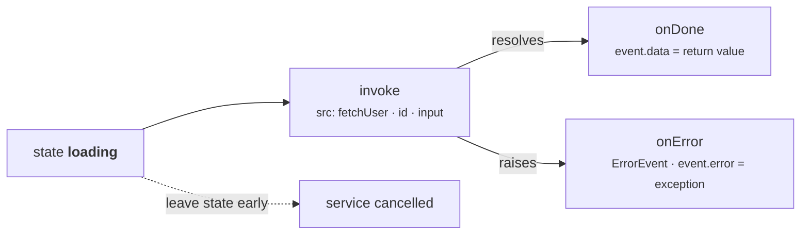
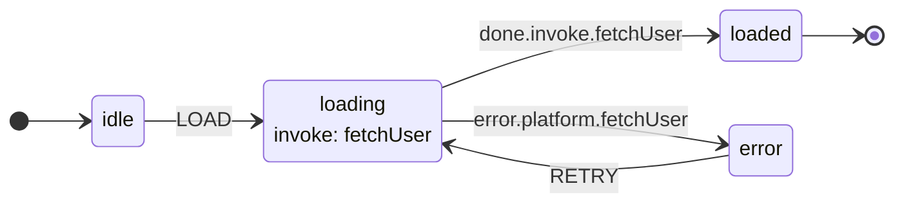

Services represent **external operations** — API calls, database queries, file reads, computations — that a state invokes when it is entered. When the service completes, the machine automatically transitions via `onDone`; if it fails, the machine transitions via `onError`.

## 📞 What are Services?

A service is a callable that runs when a state is entered and produces a result (or an error). Services bridge the gap between your state machine's declarative flow and the imperative world of I/O operations.

Key characteristics:

- **Invoked by states** — services are tied to a state's `invoke` property, not to transitions.
- **Result-driven** — the return value becomes `event.data` in the `onDone` handler.
- **Error-aware** — exceptions are caught and routed to `onError` handlers.
- **Sync or async** — `SyncInterpreter` requires sync services; `Interpreter` supports async.

## 🧱 JSON Invoke Structure



The `invoke` property on a state defines which service to call and how to handle the result:

```json
{
  "invoke": {
    "src": "fetchUser",
    "id": "userFetcher",
    "onDone": {
      "target": "loaded",
      "actions": "storeUser"
    },
    "onError": {
      "target": "error",
      "actions": "storeError"
    }
  }
}
```

| Key | Type | Description |
|-----|------|-------------|
| `src` | `string` | The service name (must match a registered service function) |
| `id` | `string` | Optional unique identifier (defaults to the state's ID) |
| `input` | `any` \| `callable` | Static data (or a `fn(context, event)` / `fn({"context": ..., "event": ...})` callable, resolved fresh on every spawn) forwarded to the invoked service or child. A callable service receives it at `event.payload["input"]`; a spawned child machine receives it at `context["input"]`. |
| `systemId` | `string` | Registers the invocation under a global actor address so it can be addressed from anywhere in the tree with `send_to` — see [Actors](../actors/). |
| `onDone` | `object` | Transition to take on successful completion |
| `onError` | `object` | Transition to take on failure (exception) |

For example, to pass a per-spawn value to a service:

```json
{
  "invoke": {
    "src": "fetchUser",
    "input": {"userId": 42},
    "onDone": {"target": "loaded", "actions": "storeUser"}
  }
}
```

```python
def fetch_user(interpreter, context, event):
    user_id = event.payload["input"]["userId"]
    return {"id": user_id, "name": "Ada"}
```

## 🚀 Basic Invoke Example

A complete example of a user-loading machine:

```python
from xstate_statemachine import create_machine, SyncInterpreter, MachineLogic

config = {
    "id": "userLoader",
    "initial": "idle",
    "context": {"user": None, "error": None},
    "states": {
        "idle": {
            "on": {"LOAD": "loading"}
        },
        "loading": {
            "invoke": {
                "src": "fetchUser",
                "onDone": {
                    "target": "loaded",
                    "actions": "storeUser"
                },
                "onError": {
                    "target": "error",
                    "actions": "storeError"
                }
            }
        },
        "loaded": {"type": "final"},
        "error":  {"on": {"RETRY": "loading"}}
    }
}

class UserLogic(MachineLogic):
    def fetch_user(self, interpreter, context, event):
        # Simulate an API call (sync version)
        return {"id": 1, "name": "Alice", "email": "alice@example.com"}

    def store_user(self, interpreter, context, event, action_def):
        context["user"] = event.data

    def store_error(self, interpreter, context, event, action_def):
        context["error"] = str(event.data)

machine = create_machine(config, logic=UserLogic())
interp = SyncInterpreter(machine).start()

interp.send("LOAD")
print(interp.context["user"])
# {"id": 1, "name": "Alice", "email": "alice@example.com"}
print(interp.current_state_ids)
# {"userLoader.loaded"}
interp.stop()
```

## 🧠 Service Implementation

### Service Signature

```python
def my_service(interpreter, context, event) -> Any:
    ...
```

| Parameter | Type | Description |
|-----------|------|-------------|
| `interpreter` | `SyncInterpreter` or `Interpreter` | The running interpreter instance |
| `context` | `dict` | The machine's context (read-only recommended) |
| `event` | `Event` | A synthetic event with invoke metadata |

> **Note:** The service signature `(interpreter, context, event)` differs from the action signature `(interpreter, context, event, action_def)` — services do **not** receive `action_def`.

### Sync Service (with `requests`)

For use with `SyncInterpreter`:

```python
class UserLogicSync(MachineLogic):
    def fetch_user(self, interpreter, context, event):
        import requests
        user_id = context.get("userId", 1)
        resp = requests.get(f"https://jsonplaceholder.typicode.com/users/{user_id}")
        resp.raise_for_status()
        return resp.json()
```

### Async Service (with `aiohttp`)

For use with the async `Interpreter`:

```python
class UserLogicAsync(MachineLogic):
    async def fetch_user(self, interpreter, context, event):
        import aiohttp
        user_id = context.get("userId", 1)
        async with aiohttp.ClientSession() as session:
            resp = await session.get(
                f"https://jsonplaceholder.typicode.com/users/{user_id}"
            )
            return await resp.json()
```

> **Warning:** The `SyncInterpreter` raises `NotSupportedError` when the state that invokes an `async def` service is entered (e.g. on the `send()` call that triggers the transition) — not when the machine is created or started. Use the async `Interpreter` for async services.

## ✅ onDone Handling

When a service completes successfully, the interpreter:

1. Wraps the return value in a `DoneEvent` with `type="done.invoke.<id>"`
2. Sends that event to the machine
3. The machine matches it against the `onDone` transition

### Target State and Actions

```json
"onDone": {
    "target": "loaded",
    "actions": "storeUser"
}
```

The `onDone` transition can include both a target state and actions — just like any other transition:

```json
"onDone": {
    "target": "loaded",
    "actions": ["storeUser", "logSuccess", "clearLoading"]
}
```

## ❌ onError Handling

When a service raises an exception, the interpreter:

1. Catches the exception
2. Wraps it in an **`ErrorEvent`** with `type="error.platform.<id>"` and the exception on `.error` (0.9.0, #80 — before that it was a `DoneEvent` carrying the exception in `data`)
3. Sends that event to the machine
4. The machine matches it against the `onError` transition

If **no** `onError` (and no matching `on`) handles it, the failure is not swallowed: the *parent* interpreter fails — `status` becomes `"error"`, `last_error` holds the exception and `on_error` fires — on **both** engines (0.9.0, #99; before, only the sync engine did this). An unhandled invoked-child failure behaves the same way. Declare an `onError` on every `invoke` whose failure you want to survive.

### Error State and Error Actions

```json
"onError": {
    "target": "error",
    "actions": "storeError"
}
```

## 📦 Accessing Service Results

In `onDone` actions, the service's return value is available on `event.data`:

```python
class Logic(MachineLogic):
    def fetch_user(self, interpreter, context, event):
        return {"id": 1, "name": "Alice", "role": "admin"}

    def store_user(self, interpreter, context, event, action_def):
        # event.data is the return value from fetch_user
        user = event.data
        context["user"] = user
        context["userName"] = user["name"]
        print(f"Loaded user: {user['name']}")
```

> **Invoked child machines are different.** When `src` is a `MachineNode` rather than a callable, `event.data` on `done.invoke.<id>` is the child's **declared `output`** — the machine-level `output` if there is one, else the final state's `output` — never the child's private `context` (0.9.0, #109). Declare what the parent is allowed to see.

## 🐛 Accessing Error Info

In `onError` actions the event is an `ErrorEvent` and the exception object is on `event.error`:

```python
from xstate_statemachine import ErrorEvent, MachineLogic

class Logic(MachineLogic):
    def fetch_user(self, interpreter, context, event):
        raise ConnectionError("API server unreachable")

    def store_error(self, interpreter, context, event, action_def):
        assert isinstance(event, ErrorEvent)      # branch on type, not on a string prefix
        error = event.error                       # the exception object
        context["error"] = str(error)
        context["errorType"] = type(error).__name__
        print(f"Service failed: {error}")
        # Output: Service failed: API server unreachable
```

> **Migrating from 0.8.0:** `event.data` still returns the exception on an `ErrorEvent`, with a `DeprecationWarning`; it is removed in 0.9. Success events are unchanged — `onDone` still receives a `DoneEvent` whose `data` is the service's return value.

## 🔗 Multiple Services (Array Form)

A state can invoke multiple services simultaneously by using an array:

```json
{
  "loading": {
    "invoke": [
      {
        "src": "fetchUser",
        "id": "userService",
        "onDone": { "actions": "storeUser" },
        "onError": { "actions": "storeUserError" }
      },
      {
        "src": "fetchOrders",
        "id": "ordersService",
        "onDone": { "actions": "storeOrders" },
        "onError": { "actions": "storeOrdersError" }
      }
    ]
  }
}
```

> **Note:** Each invoke in the array needs a unique `id` to distinguish its `onDone`/`onError` events. If no `id` is provided, it defaults to the state's ID, which would cause collisions when multiple services are invoked.

```python
class DataLogic(MachineLogic):
    def fetch_user(self, interpreter, context, event):
        return {"name": "Alice"}

    def fetch_orders(self, interpreter, context, event):
        return [{"id": 1, "total": 29.99}]

    def store_user(self, interpreter, context, event, action_def):
        context["user"] = event.data

    def store_orders(self, interpreter, context, event, action_def):
        context["orders"] = event.data

    def store_user_error(self, interpreter, context, event, action_def):
        context["userError"] = str(event.data)

    def store_orders_error(self, interpreter, context, event, action_def):
        context["ordersError"] = str(event.data)
```

## 🛡️ Service with Guards

You can add guards to `onDone` transitions to route based on the service result:

```json
{
  "loading": {
    "invoke": {
      "src": "fetchUser",
      "onDone": [
        { "target": "adminDashboard", "guard": "isAdmin", "actions": "storeUser" },
        { "target": "userDashboard", "actions": "storeUser" }
      ],
      "onError": {
        "target": "error"
      }
    }
  }
}
```

```python
class Logic(MachineLogic):
    def fetch_user(self, interpreter, context, event):
        return {"name": "Alice", "role": "admin"}

    def store_user(self, interpreter, context, event, action_def):
        context["user"] = event.data

    def is_admin(self, context, event):
        # event.data holds the service result
        user = event.data
        return isinstance(user, dict) and user.get("role") == "admin"
```

## ⏱️ Invoke with Timeout

Combine `invoke` with `after` to implement service timeouts. If the service doesn't complete before the timer fires, the machine transitions to a timeout state:

```json
{
  "loading": {
    "invoke": {
      "src": "fetchUser",
      "onDone": { "target": "loaded", "actions": "storeUser" },
      "onError": { "target": "error" }
    },
    "after": {
      "5000": { "target": "timeout" }
    }
  }
}
```

> **Tip:** The `after` timer is cancelled when the state is exited (e.g., when `onDone` fires first), so there is no conflict between the two.

## 🐍 Pythonic Services

### `@service` Decorator

The `@service` decorator marks a function as a service:

```python
from xstate_statemachine import service

@service
def fetch_user(interpreter, context, event):
    return {"id": 1, "name": "Alice"}
# Registered as "fetchUser" (auto snake_case → camelCase)
```

### Explicit Naming

```python
@service("loadUserProfile")
def get_user(interpreter, context, event):
    return {"id": 1, "name": "Alice"}
# Registered as "loadUserProfile"
```

### Service in StateMachine Class

```python
from xstate_statemachine import State, StateMachine, SyncInterpreter, service, action

class UserLoader(StateMachine):
    machine_id = "userLoader"
    initial_context = {"user": None, "error": None}

    idle    = State("idle", initial=True, on={"LOAD": "loading"})
    loading = State("loading", invoke={
        "src": "fetchUser",
        "onDone": {"target": "loaded", "actions": "storeUser"},
        "onError": {"target": "error", "actions": "storeError"}
    })
    loaded  = State("loaded", final=True)
    error   = State("error", on={"RETRY": "loading"})

    @service
    def fetch_user(self, interpreter, context, event):
        return {"id": 1, "name": "Alice"}

    @action
    def store_user(self, interpreter, context, event, action_def):
        context["user"] = event.data

    @action
    def store_error(self, interpreter, context, event, action_def):
        context["error"] = str(event.data)

machine = UserLoader.create_machine()
interp = SyncInterpreter(machine).start()
interp.send("LOAD")
print(interp.context["user"])  # {"id": 1, "name": "Alice"}
interp.stop()
```

### Service in MachineBuilder

```python
from xstate_statemachine import MachineBuilder, SyncInterpreter

def fetch_user_fn(interpreter, context, event):
    return {"id": 1, "name": "Alice"}

def store_user_fn(interpreter, context, event, action_def):
    context["user"] = event.data

machine = (
    MachineBuilder("userLoader")
    .context({"user": None, "error": None})
    .state("idle", initial=True, on={"LOAD": "loading"})
    .state("loading", invoke={
        "src": "fetchUser",
        "onDone": {"target": "loaded", "actions": "storeUser"},
        "onError": {"target": "error"}
    })
    .state("loaded", final=True)
    .state("error", on={"RETRY": "loading"})
    .service("fetchUser", fetch_user_fn)
    .action("storeUser", store_user_fn)
    .build()
)

interp = SyncInterpreter(machine).start()
interp.send("LOAD")
print(interp.context["user"])  # {"id": 1, "name": "Alice"}
interp.stop()
```

## 🔁 Service Lifecycle

When the interpreter enters a state with `invoke`, the following sequence occurs:

```
1. Enter the state (run entry actions)
2. Start the service (call the service function)
3. Service completes:
   a. Success → send "done.invoke.<id>" event with return value
   b. Failure → send "error.platform.<id>" event with exception
4. The machine processes the done/error event
5. Transition to onDone/onError target (run exit actions, transition actions, entry actions)
```



## ✂️ Service Cancellation

When the machine **exits a state** that has an active invocation, the service is automatically cancelled:

- **Async `Interpreter`**: The invoked task is cancelled via `asyncio.Task.cancel()`. The service's `asyncio.CancelledError` is suppressed — no `onError` is triggered.
- **`SyncInterpreter`**: Since sync services run to completion during `send()`, cancellation applies only to timers associated with the invoked state. If the state exits before a timer fires, the timer is discarded.

This means you can safely combine `invoke` with `after` timeouts: if the service completes first, the timer is cancelled when the state exits. If the timer fires first and causes a transition, the async service task is cancelled.

```python
# Safe pattern: invoke + timeout
"loading": {
    "invoke": {
        "src": "fetchUser",
        "onDone": {"target": "loaded"},
        "onError": {"target": "error"}
    },
    "after": {
        "5000": {"target": "timeout"}
    }
}
# Whichever completes first wins — the loser is automatically cancelled
```

> **Note:** Cancellation is automatic and requires no cleanup code. This is one of the key benefits of using `invoke` over manual service management.

## 🏷️ Event Naming for Done and Error

The interpreter uses a specific naming convention for invoke-related events:

| Event | Format | Example |
|-------|--------|---------|
| **Success** | `done.invoke.<id>` | `done.invoke.userFetcher` |
| **Error** | `error.platform.<id>` | `error.platform.userFetcher` |

The `<id>` defaults to the state's name if no explicit `id` is provided in the invoke config. When using multiple invokes per state, always provide explicit `id` values to avoid event name collisions:

```json
"invoke": [
  { "src": "fetchA", "id": "serviceA", "onDone": ... },
  { "src": "fetchB", "id": "serviceB", "onDone": ... }
]
```

## Sync vs Async Services

A plain-`def` service on the async `Interpreter` runs on a private thread pool so it cannot block the event loop — `Interpreter(service_pool_size=4)` (`DEFAULT_SERVICE_POOL_SIZE`) sizes it, or pass your own `service_executor=`. Its completion is delivered with exactly the standing an `async def` service's has (engine-minted, charged to `maxIterations` only when it continues a self-fed chain).

If a `maxIterations` cut discards a service's completion while its state is still active, nothing will ever complete for it: `on_invocation_stranded(interpreter, state_id, invoke_id, error)` fires, `RunawayChainError.stranded` names the ids, and `has_dormant_invocations` is `True` (0.9.0, #207).

| Feature | `SyncInterpreter` | `Interpreter` (async) |
|---------|-------------------|----------------------|
| **Service type** | Regular `def` | `async def` |
| **Execution** | Blocks until complete | Awaited concurrently |
| **HTTP library** | `requests`, `urllib` | `aiohttp`, `httpx` |
| **Multiple invokes** | Sequential | Can run concurrently |
| **Async service?** | Raises `NotSupportedError` | Fully supported |

Engine parity note (0.9.0, #116): a plain `def` service — one that returns a value, not an awaitable — completes at the **same point** on both engines. The async `Interpreter` runs it inline instead of on a separate task, and the sync engine queues its completion behind the current macrostep, so a script such as `send("GO"); send("CANCEL")` lands in the same state whichever interpreter you use. A `def` that returns a coroutine, or an `AsyncMock`, still takes the awaited path.

## Complete Example: User Data Loader with Retry

A production-style pattern with retry logic and error tracking:

```python
from xstate_statemachine import create_machine, SyncInterpreter, MachineLogic

config = {
    "id": "userDataLoader",
    "initial": "idle",
    "context": {
        "userId": 42,
        "user": None,
        "error": None,
        "retryCount": 0,
        "maxRetries": 3
    },
    "states": {
        "idle": {
            "on": {"FETCH": "loading"}
        },
        "loading": {
            "entry": "incrementRetry",
            "invoke": {
                "src": "fetchUserData",
                "onDone": {
                    "target": "success",
                    "actions": "storeUser"
                },
                "onError": [
                    {"target": "loading", "guard": "canRetry", "actions": "logRetry"},
                    {"target": "failed",  "actions": "storeFinalError"}
                ]
            }
        },
        "success": {
            "entry": "resetRetryCount",
            "type": "final"
        },
        "failed": {
            "on": {
                "RESET": {"target": "idle", "actions": "resetAll"}
            }
        }
    }
}

class UserDataLogic(MachineLogic):
    def __init__(self):
        super().__init__()
        self._call_count = 0

    # ---- Service ----
    def fetch_user_data(self, interpreter, context, event):
        self._call_count += 1
        user_id = context.get("userId", 1)

        # Simulate: fail first 2 attempts, succeed on 3rd
        if self._call_count < 3:
            raise ConnectionError(
                f"Attempt {self._call_count}: Connection refused"
            )
        return {"id": user_id, "name": "Alice", "email": "alice@example.com"}

    # ---- Actions ----
    def store_user(self, interpreter, context, event, action_def):
        context["user"] = event.data
        context["error"] = None
        print(f"User loaded: {event.data['name']}")

    def increment_retry(self, interpreter, context, event, action_def):
        context["retryCount"] = context.get("retryCount", 0) + 1
        print(f"Loading attempt #{context['retryCount']}...")

    def log_retry(self, interpreter, context, event, action_def):
        print(f"  Retrying... ({event.data})")

    def store_final_error(self, interpreter, context, event, action_def):
        context["error"] = str(event.data)
        print(f"All retries exhausted. Error: {event.data}")

    def reset_retry_count(self, interpreter, context, event, action_def):
        context["retryCount"] = 0

    def reset_all(self, interpreter, context, event, action_def):
        context["user"] = None
        context["error"] = None
        context["retryCount"] = 0

    # ---- Guards ----
    def can_retry(self, context, event):
        return context.get("retryCount", 0) < context.get("maxRetries", 3)


machine = create_machine(config, logic=UserDataLogic())
interp = SyncInterpreter(machine).start()

interp.send("FETCH")
# Output:
# Loading attempt #1...
#   Retrying... (Attempt 1: Connection refused)
# Loading attempt #2...
#   Retrying... (Attempt 2: Connection refused)
# Loading attempt #3...
# User loaded: Alice

print(interp.context["user"])
# {"id": 42, "name": "Alice", "email": "alice@example.com"}
interp.stop()
```

## Complete Example: Payment Processing Flow

A multi-stage payment flow with validation, charging, and confirmation:

```python
from xstate_statemachine import create_machine, SyncInterpreter, MachineLogic

config = {
    "id": "paymentProcessor",
    "initial": "idle",
    "context": {
        "amount": 0,
        "currency": "USD",
        "paymentMethod": None,
        "transactionId": None,
        "error": None,
        "receipt": None
    },
    "states": {
        "idle": {
            "on": {
                "START_PAYMENT": {
                    "target": "validating",
                    "actions": "storePaymentDetails"
                }
            }
        },
        "validating": {
            "invoke": {
                "src": "validatePayment",
                "onDone": {"target": "charging"},
                "onError": {"target": "validationFailed", "actions": "storeError"}
            }
        },
        "charging": {
            "invoke": {
                "src": "chargePayment",
                "onDone": {
                    "target": "confirming",
                    "actions": "storeTransactionId"
                },
                "onError": {"target": "chargeFailed", "actions": "storeError"}
            }
        },
        "confirming": {
            "invoke": {
                "src": "generateReceipt",
                "onDone": {
                    "target": "completed",
                    "actions": "storeReceipt"
                },
                "onError": {
                    "target": "completed",
                    "actions": "logReceiptError"
                }
            }
        },
        "completed": {
            "entry": "notifySuccess",
            "type": "final"
        },
        "validationFailed": {
            "entry": "notifyValidationError",
            "on": {
                "RETRY": {"target": "idle", "actions": "clearError"}
            }
        },
        "chargeFailed": {
            "entry": "notifyChargeError",
            "on": {
                "RETRY": {"target": "idle", "actions": "clearError"}
            }
        }
    }
}

class PaymentLogic(MachineLogic):
    # ---- Services ----
    def validate_payment(self, interpreter, context, event):
        amount = context.get("amount", 0)
        method = context.get("paymentMethod")
        if amount <= 0:
            raise ValueError("Amount must be positive")
        if not method:
            raise ValueError("Payment method is required")
        return {"valid": True, "method": method}

    def charge_payment(self, interpreter, context, event):
        amount = context["amount"]
        print(f"Charging ${amount:.2f}...")
        # Simulate a charge — returns a transaction ID
        return {"transactionId": "TXN-20260323-001", "charged": amount}

    def generate_receipt(self, interpreter, context, event):
        txn_id = context.get("transactionId", "UNKNOWN")
        return {
            "receiptId": f"RCP-{txn_id}",
            "amount": context["amount"],
            "currency": context["currency"],
            "status": "paid"
        }

    # ---- Actions ----
    def store_payment_details(self, interpreter, context, event, action_def):
        context["amount"] = event.payload.get("amount", 0)
        context["currency"] = event.payload.get("currency", "USD")
        context["paymentMethod"] = event.payload.get("method")

    def store_transaction_id(self, interpreter, context, event, action_def):
        context["transactionId"] = event.data.get("transactionId")

    def store_receipt(self, interpreter, context, event, action_def):
        context["receipt"] = event.data

    def store_error(self, interpreter, context, event, action_def):
        context["error"] = str(event.data)

    def clear_error(self, interpreter, context, event, action_def):
        context["error"] = None

    def log_receipt_error(self, interpreter, context, event, action_def):
        print(f"Receipt generation failed (non-critical): {event.data}")

    def notify_success(self, interpreter, context, event, action_def):
        txn = context.get("transactionId", "N/A")
        amt = context.get("amount", 0)
        print(f"Payment complete! Transaction: {txn}, Amount: ${amt:.2f}")

    def notify_validation_error(self, interpreter, context, event, action_def):
        print(f"Validation failed: {context.get('error', 'Unknown')}")

    def notify_charge_error(self, interpreter, context, event, action_def):
        print(f"Charge failed: {context.get('error', 'Unknown')}")


# Run the payment flow
machine = create_machine(config, logic=PaymentLogic())
interp = SyncInterpreter(machine).start()

interp.send("START_PAYMENT", amount=49.99, method="credit_card", currency="USD")
# Output:
# Charging $49.99...
# Payment complete! Transaction: TXN-20260323-001, Amount: $49.99

print(interp.context["transactionId"])  # TXN-20260323-001
print(interp.context["receipt"])
# {"receiptId": "RCP-TXN-20260323-001", "amount": 49.99, "currency": "USD", "status": "paid"}
interp.stop()
```

## Services and Snapshots

Restoring an interpreter from a snapshot (`from_snapshot()`) is, by default, a **static restoration**: entry actions are not re-run and no invoked service or `after` timer is restarted. If the snapshot was taken while a state had an active `invoke`, the restored machine comes back parked in that state with the service *not* running.

Use `interpreter.pending_invocations()` to see what's parked — it lists every `invoke` in the active configuration that has no live service behind it. To re-drive them, pass `restart_services=True` to `from_snapshot()`, which makes `start()` re-invoke every pending service **from scratch, not resumed**. For a side-effecting service (e.g. placing an order or charging a card), that means the service call happens again, so pair it with a client-supplied idempotency key.

```python
interp = SyncInterpreter.from_snapshot(snapshot_str, machine, restart_services=True).start()
```

See [Snapshots](../snapshots/) for the full persistence model.

## See Also

- **[Context](../context/)** — services often populate context via `onDone` actions
- **[Guards](../guards/)** — guard `onDone` transitions to route based on service results
- **[Actions](../actions/)** — actions that process service results in `onDone`/`onError`
- **[Delayed Transitions](../delayed-transitions/)** — combine `invoke` with `after` for timeout patterns
- **[Actors](../actors/)** — spawn child machines as invoked services
- **[Interpreters](../interpreters/)** — sync vs async interpreter behavior with services
- **[Pythonic API](../pythonic-api/)** — `@service` decorator and `State(invoke=...)` syntax
- **[Snapshots](../snapshots/)** — persisting and restoring interpreters, and how invoked services behave across a restore
