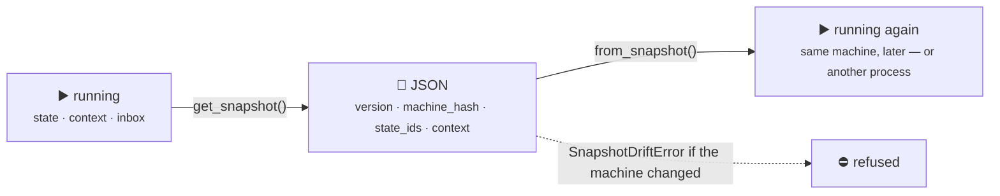
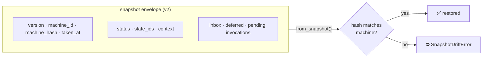

# Snapshots & State Restoration

Snapshots let you **capture** and **restore** a machine's state at any point in time. This implements the **Memento pattern**, enabling persistence, crash recovery, workflow checkpointing, and targeted testing.

## 📸 What are Snapshots?



A snapshot is a JSON string that captures the essential runtime state of an interpreter:

- **`status`** — the interpreter's lifecycle status (`"running"`, `"stopped"`, etc.)
- **`context`** — the full context dictionary (all mutable data)
- **`state_ids`** — the list of all currently active state IDs

You create a snapshot with `get_snapshot()` and restore from one with `from_snapshot()`.

## 📸 `get_snapshot()` — Capturing State

The `get_snapshot()` method returns a JSON string representing the interpreter's current state. Call it on any running interpreter at any time.

```python
from xstate_statemachine import create_machine, SyncInterpreter

config = {
    "id": "workflow",
    "initial": "step1",
    "context": {"progress": 0, "data": {}},
    "states": {
        "step1": {"on": {"NEXT": {"target": "step2", "actions": "updateProgress"}}},
        "step2": {"on": {"NEXT": {"target": "step3", "actions": "updateProgress"}}},
        "step3": {"on": {"NEXT": {"target": "step4", "actions": "updateProgress"}}},
        "step4": {"type": "final"}
    }
}

from xstate_statemachine import MachineLogic

logic = MachineLogic(
    actions={
        "updateProgress": lambda i, ctx, e, a: ctx.update(
            {"progress": ctx["progress"] + 25}
        )
    }
)

machine = create_machine(config, logic=logic)
interp = SyncInterpreter(machine).start()

# Advance to step2
interp.send("NEXT")
interp.context["data"]["step1_result"] = "validated"

# Capture a snapshot
snapshot_json = interp.get_snapshot()
print(snapshot_json)
```

**Output:**

```json
{
  "status": "running",
  "context": {
    "progress": 25,
    "data": {
      "step1_result": "validated"
    }
  },
  "state_ids": [
    "workflow.step2"
  ]
}
```

The snapshot is a standard JSON string — you can store it anywhere: files, databases, message queues, or environment variables.

```python
interp.stop()
```

## ♻️ `from_snapshot()` — Restoring State

The `from_snapshot()` class method creates a **new** interpreter instance pre-configured with the saved state. You provide the snapshot JSON string and the **same machine definition** that was used to create the original interpreter.

The restored context is deep-copied and merged over the machine's default context — defaults fill in any keys missing from the snapshot, while persisted values win on conflict — and the snapshot also carries any events that were deferred (`onUnhandled: "defer"`) at save time.

```python
import json

# Re-create the same machine definition
machine = create_machine(config, logic=logic)

# Restore from the snapshot
restored = SyncInterpreter.from_snapshot(snapshot_json, machine)

print(restored.current_state_ids)  # {'workflow.step2'}
print(restored.context["progress"])  # 25
print(restored.context["data"])  # {'step1_result': 'validated'}
print(restored.status)  # 'running'

# Continue from where we left off
restored.send("NEXT")  # step2 -> step3
print(restored.current_state_ids)  # {'workflow.step3'}
print(restored.context["progress"])  # 50

restored.send("NEXT")  # step3 -> step4 (final)
restored.stop()
```

> **Note:** `from_snapshot()` is a class method on both `SyncInterpreter` and `Interpreter`. Call it on the class you want to create:
> ```python
> restored_sync = SyncInterpreter.from_snapshot(snapshot_json, machine)
> restored_async = Interpreter.from_snapshot(snapshot_json, machine)
> ```

## ⚠️ Important Limitations

> **Warning:** `from_snapshot()` performs a **static restoration**. Be aware of these constraints:
>
> - **Entry actions are NOT re-run** — The restored interpreter is placed directly into the saved states without executing their `entry` actions.
> - **Services are NOT restarted** — Any `invoke` services that were running when the snapshot was taken are not re-invoked by default. Inspect what's dormant with `pending_invocations()`, or opt in to re-driving it with `from_snapshot(..., restart_services=True)` — see [Restoring Dormant Invocations](#restoring-dormant-invocations) below.
> - **Timers are NOT resumed by default** — a snapshot records that an `after` timer was pending, not how far along it was. After a static restore `interpreter.has_dormant_timers` is `True`. Pass `from_snapshot(..., restart_timers=True)` (defaults to the value of `restart_services`) to have `start()` re-arm every dormant timer **from zero** (0.8.1, #128). A timer that had already *fired* and was waiting in the priority lane **is** persisted and replays on restore (#107).
> - **`status` is not a liveness signal after a restore** — the restored object reports the persisted `"running"` immediately, before `start()` has re-invoked anything. Between `from_snapshot()` and `start()`, and after any static restore, check `has_dormant_invocations` / `has_dormant_timers` (#135).
> - **A snapshot must be taken from a settled interpreter** — mid-macrostep (while a transition's actions are still running) the configuration has no leaf, and `get_persisted_snapshot()` raises `SnapshotMidStepError` rather than persisting a blob that would restore as a permanently inert machine. Snapshot after `send(wait=True)` resolves, from an `on_transition` hook, or after `stop(drain=True)` (#102).
> - **Pending event data must be JSON-native** — a `Decimal` / `datetime` in a pending `DoneEvent.data` used to be silently stringified; `get_snapshot()` now raises `SnapshotSerializationError` instead of handing the restored handler a `str` (#131).
> - **Malformed snapshots are refused, typed** — a missing key, a non-object `context`, an unknown `status`, or a `running` snapshot with an empty configuration raises `SnapshotCorruptError` (#110).
> - **Restore with the clock you mean** — `from_snapshot(..., clock=SimulatedClock())` (0.8.1, #117); without it a restored machine ran on `RealClock`, which broke deterministic replay.
> - **Context is restored by value** — The context dictionary is deserialized from JSON. Non-serializable values (functions, class instances, file handles) will be lost or converted to strings.
> - **Machine definition must match** — The `machine` argument to `from_snapshot()` must have the same structure as the original. If state IDs have changed, restoration will fail with `StateNotFoundError`.

## 🔌 Restoring Dormant Invocations

`from_snapshot()`'s static restore means a machine snapshotted mid-`invoke` comes back parked: the restored configuration says the work is in flight, but no task is actually running it. That default is deliberate — restarting a non-idempotent action (an order placement, a charge) from scratch can be worse than leaving it parked — but it is no longer silent.

### `pending_invocations()` — what's dormant

`pending_invocations()` lists every `invoke` in the interpreter's active configuration that has no live service backing it. It's empty on a running (never-restored) machine, and empty again after a restore made with `restart_services=True`.

> **`status` is not a liveness signal after a restore.** A statically restored machine reports `status == "running"` — it *is* processing events — while every invoke it lists is dormant. A health check that trusts `status` alone will say "healthy" about an order that sits unfilled. Check `interpreter.has_dormant_invocations` (a `bool`, 0.8.1) or `pending_invocations()` instead. There is deliberately no separate `"restored"` status value: it would break every consumer that switches on the existing four.
>
> Two properties the whole recovery design rests on: after a static restore **entry actions do not re-run** and **services are not re-invoked**. That is what makes it safe to reconcile each pending invocation against the outside world (the venue, the payment provider) *before* deciding whether to restart it.

```python
import asyncio
from xstate_statemachine import create_machine, MachineLogic, Interpreter

OMS = {
    "id": "oms",
    "initial": "submitting",
    "context": {"acked": False},
    "states": {
        "submitting": {
            "invoke": {"src": "place", "id": "place", "onDone": "live"},
            "on": {"LEAVE": "idle"},
        },
        "live": {"entry": ["ack"]},
        "idle": {},
    },
}

async def place(interpreter, context, event):
    await asyncio.sleep(5.0)  # simulate a slow call
    return "ok"

def ack(interpreter, context, event, action_def):
    context["acked"] = True

logic = MachineLogic(actions={"ack": ack}, services={"place": place})

async def main():
    interp = await Interpreter(create_machine(OMS, logic=logic)).start()
    await asyncio.sleep(0.01)  # `place` has started, far from done
    snapshot = interp.get_snapshot()
    await interp.stop()

    restored = Interpreter.from_snapshot(snapshot, create_machine(OMS, logic=logic))
    print(restored.pending_invocations())
    # [PendingInvocation(state_id='oms.submitting', invoke_id='place', src='place')]

asyncio.run(main())
```

Each entry is a `PendingInvocation(state_id, invoke_id, src)` namedtuple — the state that owns the `invoke`, the invoke's id (explicit, or the parser's default), and the service key. Check this list first, then decide whether to re-drive the work.

### `restart_services=True` — re-invoking from scratch

Pass `restart_services=True` to `from_snapshot()` to have `start()` re-invoke every dormant `invoke` in the restored configuration. This runs the service **again, from the beginning** — it does not resume the original call — through the exact same path a normal state entry uses, so the restarted task is owner-registered and still gets cancelled if the state is exited.

```python
restored = Interpreter.from_snapshot(
    snapshot, create_machine(OMS, logic=logic), restart_services=True
)
await restored.start()
# ... service re-runs; eventually transitions oms.submitting -> oms.live
print(restored.pending_invocations())  # []
```

Because the service runs again rather than resuming, use this only for idempotent work, or gate it behind a client-supplied idempotency key (an order placement, for example, should carry one). This applies identically on both `Interpreter` (async) and `SyncInterpreter` (sync).

### `ImplementationMissingError` on a missing service

If the machine being restored into no longer registers the service a dormant `invoke` needs, `restart_services=True` raises `ImplementationMissingError` when `start()` tries to re-drive it — the same exception a live machine raises for an unregistered service:

<!-- doc-fragment -->
```python
from xstate_statemachine import ImplementationMissingError

bare = create_machine(OMS, logic=MachineLogic(actions={"ack": ack}))  # no 'place' service registered
restored = Interpreter.from_snapshot(snapshot, bare, restart_services=True)
try:
    await restored.start()
except ImplementationMissingError as exc:
    print(exc)  # "Service 'place' referenced by state 'oms.submitting' is not registered."
```

## ✉️ Snapshot Envelope



As of 0.8.0, `get_snapshot()` writes a versioned **envelope** around the fields described above. In addition to `status`, `context`, and `state_ids`, the JSON now carries:

- **`version`** — the integer payload *layout* version. It is bumped only when the shape of the snapshot itself changes, never on an ordinary package release, so a patch or minor upgrade of the library does not invalidate stored snapshots.
- **`machine_id`** — the `id` of the machine the snapshot was taken from.
- **`machine_hash`** — a 16-hex-character structural fingerprint of the machine (`MachineNode.structure_hash`). It covers states, transitions, guard/action **names**, invokes, and `after` delays — the parts of the machine that change *behavior*. It deliberately excludes `meta`, `description`, and key order, so editing a docstring or reordering a dict does not change the hash. Adding a guard, renaming a state, or changing a transition's target, on the other hand, does.
- **`taken_at`** — a Unix timestamp of when the snapshot was captured.
- **`pending_events`** — see [The Inbox: pending events](#the-inbox-pending-events) below. Since layout **v2** (0.8.1) every pending or deferred record carries a `kind` — `event`, `system`, `done`, `error` or `after` — so engine events (`DoneEvent`, `ErrorEvent`, a due `after`) and provenance round-trip instead of being silently dropped (#86, #87). An `ErrorEvent`'s exception is persisted as its `repr` and restored as a `RestoredError`. v1 snapshots restore unchanged; their engine-shaped plain events are re-derived by name at the restore boundary only.
- **`value`** — the hierarchical [`interpreter.value`](interpreters/#hierarchical-state-value) at the time of capture, included for convenience. Restore ignores it; it is derived fresh from `state_ids` every time.

**Unversioned 0.7.x snapshots restore unchanged.** A payload with no `version` key is treated as version 0 and accepted unconditionally — there is no breaking change for snapshots taken before 0.8.0.

### Restore-time checks

`from_snapshot()` now runs two checks before restoring a versioned snapshot:

- **`SnapshotVersionError`** — raised when the snapshot's `version` is *newer* than the library's `SNAPSHOT_VERSION`. A snapshot written by a newer release cannot be read safely, so it is refused rather than partially restored.
- **`SnapshotDriftError`** — raised when the snapshot's `machine_id` doesn't match the machine being restored into, or (when hash verification is on) the machine's `structure_hash` no longer matches `machine_hash`. This is exactly the "a guard was added, or a state was renamed since this snapshot was taken" case.

Pass `verify_machine_hash=False` to skip the hash check after you've migrated a snapshot to match a changed machine shape:

<!-- doc-fragment -->
```python
import json
from xstate_statemachine import create_machine, SyncInterpreter
from xstate_statemachine.exceptions import SnapshotDriftError

machine = create_machine(config)  # the CURRENT (changed) machine definition

try:
    restored = SyncInterpreter.from_snapshot(saved_snapshot_json, machine)
except SnapshotDriftError:
    # Migrate the payload to match the new machine shape.
    payload = json.loads(saved_snapshot_json)
    payload["context"].setdefault("new_field", None)
    migrated_json = json.dumps(payload)

    # The machine has changed on purpose -- skip the hash check.
    restored = SyncInterpreter.from_snapshot(
        migrated_json, machine, verify_machine_hash=False
    )
```

## 📥 The Inbox: pending events

The mailbox is now part of the snapshot. `interpreter.pending_events` exposes every event that was **accepted** (by `send()`) but not yet **processed**, in FIFO order; the same list is persisted under the snapshot's `pending_events` key and re-enqueued, in order, on restore. Child actors' inboxes are captured and restored **recursively**, so a parent's snapshot carries its children's queued-but-unprocessed events too.

```python
interp.send("STEP_1")
interp.send("STEP_2")
print(interp.pending_events)  # events not yet run through a transition
```

`drain_pending()` removes and returns every pending event **without processing it** — useful for a shutdown path that wants to persist accepted work durably instead of losing it:

```python
drained = interp.drain_pending()  # async: `await interp.drain_pending()`
```

`stop(drain=True)` asks the interpreter to process its inbox to empty before tearing down, so nothing the caller was told "yes" to (via `send()`) is silently discarded. The async `Interpreter.stop()` also accepts a `timeout=` (seconds) to bound how long it waits:

```python
await interp.stop(drain=True, timeout=5.0)  # async
interp.stop(drain=True)                     # sync
```

There are two shutdown patterns, depending on what you want:

- **Option A — finish queued work before stopping.** Call `stop(drain=True)` (with a `timeout=` on the async engine if you need an upper bound). Every event already accepted gets processed first.
- **Option B — persist with pending events still in it, then stop immediately.** Call `get_snapshot()` first (it captures `pending_events` as-is), then `stop()` with the default `drain=False`. The next restore re-enqueues those events instead of losing them.

By default (`drain=False`), a non-empty inbox at `stop()` time is now logged as a warning instead of being silently discarded.

## 💾 Persistence: Save to File

The simplest persistence pattern writes the snapshot to a JSON file:

```python
from pathlib import Path
from xstate_statemachine import create_machine, SyncInterpreter, MachineLogic

config = {
    "id": "onboarding",
    "initial": "welcome",
    "context": {"user": "alice", "steps_completed": []},
    "states": {
        "welcome": {"on": {"CONTINUE": "profile"}},
        "profile": {"on": {"CONTINUE": "preferences"}},
        "preferences": {"on": {"CONTINUE": "complete"}},
        "complete": {"type": "final"}
    }
}

machine = create_machine(config)
interp = SyncInterpreter(machine).start()

interp.send("CONTINUE")  # welcome -> profile
interp.context["steps_completed"].append("welcome")

# Save to file
snapshot = interp.get_snapshot()
Path("onboarding_state.json").write_text(snapshot)
interp.stop()

# --- Later, in a different process or after a restart ---

# Load from file
saved = Path("onboarding_state.json").read_text()
machine = create_machine(config)  # Same definition
restored = SyncInterpreter.from_snapshot(saved, machine)

print(restored.current_state_ids)  # {'onboarding.profile'}
print(restored.context["steps_completed"])  # ['welcome']

# Continue the workflow
restored.send("CONTINUE")  # profile -> preferences
restored.context["steps_completed"].append("profile")
restored.stop()
```

## 🗄️ Database Persistence: SQLite Example

For production systems, store snapshots in a database:

```python
import sqlite3
import json
from xstate_statemachine import create_machine, SyncInterpreter

# --- Database Setup ---
def init_db(db_path="machines.db"):
    conn = sqlite3.connect(db_path)
    conn.execute("""
        CREATE TABLE IF NOT EXISTS machine_snapshots (
            machine_id TEXT PRIMARY KEY,
            snapshot TEXT NOT NULL,
            updated_at TIMESTAMP DEFAULT CURRENT_TIMESTAMP
        )
    """)
    conn.commit()
    return conn

def save_snapshot(conn, machine_id, interpreter):
    """Save the interpreter's current state to the database."""
    snapshot = interpreter.get_snapshot()
    conn.execute(
        """INSERT OR REPLACE INTO machine_snapshots
           (machine_id, snapshot, updated_at)
           VALUES (?, ?, CURRENT_TIMESTAMP)""",
        (machine_id, snapshot)
    )
    conn.commit()
    print(f"Saved snapshot for '{machine_id}'")

def load_snapshot(conn, machine_id):
    """Load a saved snapshot from the database."""
    cursor = conn.execute(
        "SELECT snapshot FROM machine_snapshots WHERE machine_id = ?",
        (machine_id,)
    )
    row = cursor.fetchone()
    return row[0] if row else None

# --- Usage ---
config = {
    "id": "order-42",
    "initial": "placed",
    "context": {"items": ["widget"], "total": 29.99},
    "states": {
        "placed": {"on": {"CONFIRM": "confirmed"}},
        "confirmed": {"on": {"SHIP": "shipped"}},
        "shipped": {"on": {"DELIVER": "delivered"}},
        "delivered": {"type": "final"}
    }
}

conn = init_db()
machine = create_machine(config)
interp = SyncInterpreter(machine).start()

interp.send("CONFIRM")
save_snapshot(conn, "order-42", interp)
interp.stop()

# --- Later ---
saved_json = load_snapshot(conn, "order-42")
if saved_json:
    machine = create_machine(config)
    restored = SyncInterpreter.from_snapshot(saved_json, machine)
    print(f"Restored state: {restored.current_state_ids}")
    # {'order-42.confirmed'}
    restored.send("SHIP")
    save_snapshot(conn, "order-42", restored)
    restored.stop()

conn.close()
```

## ⚡ Async Snapshots

Snapshots work identically with the async `Interpreter`:

```python
import asyncio
from xstate_statemachine import create_machine, Interpreter

config = {
    "id": "asyncWorkflow",
    "initial": "phase1",
    "context": {"results": []},
    "states": {
        "phase1": {"on": {"ADVANCE": "phase2"}},
        "phase2": {"on": {"ADVANCE": "phase3"}},
        "phase3": {"type": "final"}
    }
}

async def main():
    machine = create_machine(config)
    interp = await Interpreter(machine).start()

    await interp.send("ADVANCE")
    await asyncio.sleep(0.1)  # Let the event process

    # Capture snapshot (synchronous method — no await needed)
    snapshot = interp.get_snapshot()
    await interp.stop()

    # Restore into an async interpreter
    machine = create_machine(config)
    restored = Interpreter.from_snapshot(snapshot, machine)
    print(restored.current_state_ids)  # {'asyncWorkflow.phase2'}
    print(restored.status)  # 'running'

asyncio.run(main())
```

## 🧪 Testing with Snapshots

Snapshots are powerful for testing because they let you jump directly to a specific state without replaying the full event sequence:

```python
import json
from xstate_statemachine import create_machine, SyncInterpreter, MachineLogic

config = {
    "id": "checkout",
    "initial": "cart",
    "context": {"items": [], "total": 0, "payment_status": None},
    "states": {
        "cart": {"on": {"PROCEED": "shipping"}},
        "shipping": {"on": {"CONFIRM_ADDRESS": "payment"}},
        "payment": {
            "on": {
                "PAY": {"target": "processing", "actions": "startPayment"}
            }
        },
        "processing": {
            "on": {
                "SUCCESS": "confirmed",
                "FAILURE": "payment"
            }
        },
        "confirmed": {"type": "final"}
    }
}

logic = MachineLogic(
    actions={
        "startPayment": lambda i, ctx, e, a: ctx.update(
            {"payment_status": "processing"}
        )
    }
)

# --- Test: Jump directly to the payment state ---
def test_payment_flow():
    """Test the payment flow without navigating through cart and shipping."""
    # Create a snapshot that puts us directly in the payment state
    snapshot = json.dumps({
        "status": "running",
        "context": {
            "items": [{"name": "Widget", "price": 29.99}],
            "total": 29.99,
            "payment_status": None
        },
        "state_ids": ["checkout.payment"]
    })

    machine = create_machine(config, logic=logic)
    interp = SyncInterpreter.from_snapshot(snapshot, machine)

    # Test: send PAY event
    interp.send("PAY")
    assert interp.context["payment_status"] == "processing"
    assert interp.current_state_ids == {"checkout.processing"}

    # Test: payment succeeds
    interp.send("SUCCESS")
    assert interp.current_state_ids == {"checkout.confirmed"}

    interp.stop()
    print("test_payment_flow PASSED")

def test_payment_failure_retry():
    """Test that payment failure returns to the payment state."""
    snapshot = json.dumps({
        "status": "running",
        "context": {"items": [], "total": 0, "payment_status": None},
        "state_ids": ["checkout.processing"]
    })

    machine = create_machine(config, logic=logic)
    interp = SyncInterpreter.from_snapshot(snapshot, machine)

    interp.send("FAILURE")
    assert interp.current_state_ids == {"checkout.payment"}

    interp.stop()
    print("test_payment_failure_retry PASSED")

test_payment_flow()
test_payment_failure_retry()
```

## 🏁 Complete Example: Long-Running Workflow with Checkpointing

This pattern saves a snapshot after each step, enabling crash recovery:

```python
from pathlib import Path
from xstate_statemachine import create_machine, SyncInterpreter, MachineLogic

CHECKPOINT_FILE = Path("workflow_checkpoint.json")

config = {
    "id": "dataProcessing",
    "initial": "ingesting",
    "context": {
        "records_ingested": 0,
        "records_transformed": 0,
        "records_loaded": 0,
        "errors": []
    },
    "states": {
        "ingesting": {
            "on": {
                "INGEST_DONE": {"target": "transforming", "actions": "markIngested"}
            }
        },
        "transforming": {
            "on": {
                "TRANSFORM_DONE": {"target": "loading", "actions": "markTransformed"}
            }
        },
        "loading": {
            "on": {
                "LOAD_DONE": {"target": "complete", "actions": "markLoaded"}
            }
        },
        "complete": {"type": "final"}
    }
}

logic = MachineLogic(
    actions={
        "markIngested": lambda i, ctx, e, a: ctx.update(
            {"records_ingested": e.payload.get("count", 0)}
        ),
        "markTransformed": lambda i, ctx, e, a: ctx.update(
            {"records_transformed": e.payload.get("count", 0)}
        ),
        "markLoaded": lambda i, ctx, e, a: ctx.update(
            {"records_loaded": e.payload.get("count", 0)}
        ),
    }
)

def checkpoint(interp):
    """Save current state to disk after each step."""
    CHECKPOINT_FILE.write_text(interp.get_snapshot())
    print(f"Checkpoint saved: {interp.current_state_ids}")

def resume_or_start():
    """Resume from checkpoint if available, otherwise start fresh."""
    machine = create_machine(config, logic=logic)

    if CHECKPOINT_FILE.exists():
        saved = CHECKPOINT_FILE.read_text()
        print("Resuming from checkpoint...")
        return SyncInterpreter.from_snapshot(saved, machine)
    else:
        print("Starting fresh...")
        return SyncInterpreter(machine).start()

# --- Main workflow ---
interp = resume_or_start()
current = interp.current_state_ids

# Only process steps that haven't been completed
if "dataProcessing.ingesting" in current:
    print("Running ingest phase...")
    interp.send("INGEST_DONE", count=1500)
    checkpoint(interp)

if "dataProcessing.transforming" in interp.current_state_ids:
    print("Running transform phase...")
    interp.send("TRANSFORM_DONE", count=1450)
    checkpoint(interp)

if "dataProcessing.loading" in interp.current_state_ids:
    print("Running load phase...")
    interp.send("LOAD_DONE", count=1450)
    checkpoint(interp)

print(f"Final context: {interp.context}")
interp.stop()

# Clean up checkpoint on success
if CHECKPOINT_FILE.exists():
    CHECKPOINT_FILE.unlink()
    print("Checkpoint cleaned up.")
```

## 🛟 Complete Example: Crash Recovery Pattern

```python
import json
import sys
from pathlib import Path
from xstate_statemachine import create_machine, SyncInterpreter, MachineLogic

class RecoverableWorkflow:
    """A workflow wrapper that automatically persists and recovers state."""

    def __init__(self, config, logic=None, storage_path="workflow_state.json"):
        self.config = config
        self.logic = logic
        self.storage_path = Path(storage_path)
        self.interp = None

    def start(self):
        """Start or resume the workflow."""
        machine = create_machine(self.config, logic=self.logic)

        if self.storage_path.exists():
            snapshot = self.storage_path.read_text()
            self.interp = SyncInterpreter.from_snapshot(snapshot, machine)
            print(f"Recovered workflow at state: {self.interp.current_state_ids}")
        else:
            self.interp = SyncInterpreter(machine).start()
            print(f"Started new workflow at state: {self.interp.current_state_ids}")

        return self

    def send(self, event_type, **payload):
        """Send an event and auto-save the state."""
        self.interp.send(event_type, **payload)
        self._save()
        return self

    def _save(self):
        """Persist current state to disk."""
        self.storage_path.write_text(self.interp.get_snapshot())

    def finish(self):
        """Stop the interpreter and clean up persistence."""
        self.interp.stop()
        if self.storage_path.exists():
            self.storage_path.unlink()
        print("Workflow completed and cleaned up.")

    @property
    def state(self):
        return self.interp.current_state_ids

    @property
    def context(self):
        return self.interp.context

# Usage
config = {
    "id": "deploy",
    "initial": "building",
    "context": {"version": "1.2.3", "status": "pending"},
    "states": {
        "building": {"on": {"BUILD_OK": "testing"}},
        "testing": {"on": {"TESTS_PASS": "deploying", "TESTS_FAIL": "failed"}},
        "deploying": {"on": {"DEPLOY_OK": "done"}},
        "done": {"type": "final"},
        "failed": {"type": "final"}
    }
}

workflow = RecoverableWorkflow(config).start()
workflow.send("BUILD_OK")
print(f"State: {workflow.state}")  # {'deploy.testing'}

# If the process crashes here, the next run will resume at 'testing'

workflow.send("TESTS_PASS")
workflow.send("DEPLOY_OK")
workflow.finish()
```
