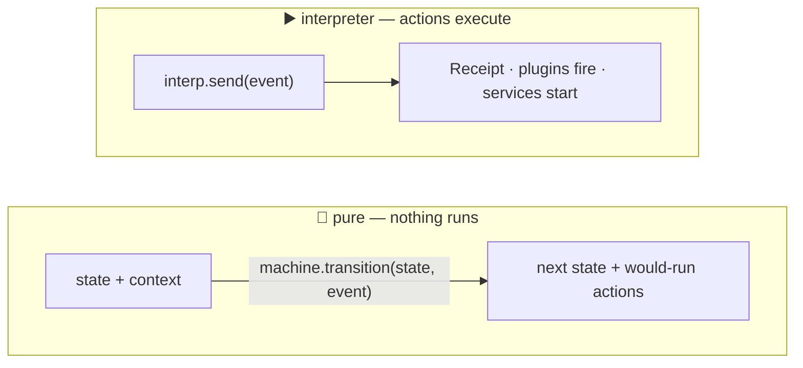

# Testing & The Pure API

Two toolkits make state machines pleasant to test: a **pure, side-effect-free
API** for asking "what would happen if…", and **waiting helpers** that replace
arbitrary `sleep()` calls with real conditions.

## 🧪 The Pure API



Sometimes you want to compute the next state *without running anything* — no
timers start, no services fire, nothing mutates. That is what the pure API is
for: unit tests, planning, and "preview the next step" UI.

> **Pure means pure, not fast.** Every call deep-copies context in and out so
> the snapshot you passed is never mutated. As of 0.8.0 that isolation costs
> roughly one real `send()` plus one context copy (see below); reach for it
> when you want side-effect-free steps, and drive a `SyncInterpreter` directly
> when you need raw throughput.

```python
from xstate_statemachine import (
    create_machine, initial_transition, pure_transition, get_next_snapshot,
)

config = {
    "id": "fetch",
    "initial": "idle",
    "context": {},
    "states": {
        "idle": {"on": {"GO": "done"}},
        "done": {"type": "final"},
    },
}
machine = create_machine(config)

snapshot, entry_actions = initial_transition(machine)
next_snapshot, actions = pure_transition(machine, snapshot, "GO")

print(snapshot.state_ids)          # {'fetch.idle'}
print(next_snapshot.state_ids)     # {'fetch.done'}
print(next_snapshot.status)        # 'done'
print([a.type for a in actions])   # the actions that WOULD have run
```

Both functions return a `(snapshot, actions)` tuple. If you only care about the
resulting state, `get_next_snapshot()` returns the snapshot alone:

```python
print(get_next_snapshot(machine, snapshot, "GO").state_ids)   # {'fetch.done'}
```

### `PureSnapshot`

| Member | Description |
|:--|:--|
| `.state_ids` | Set of active state ids |
| `.context` | The context dict |
| `.status` | `'active'`, `'done'` or `'error'` |
| `.output` | Machine output, once a top-level final state is reached |
| `.configuration` | `Set[str]` of every active state id, ancestors included (not just leaves) |
| `.matches(id)` | Test a state id, supporting nested paths |

Snapshots are immutable — each transition returns a new one, so you can branch
from the same starting point repeatedly:

```python
paid = get_next_snapshot(machine, start, "PAY")
cancelled = get_next_snapshot(machine, start, "CANCEL")   # `start` is unchanged
```

> **Note:** the pure API resolves guards and computes actions, but never
> **executes** them. Actions are returned for inspection.

As of 0.8.0, the pure API caches one probe interpreter per machine **per thread** instead of building a fresh one on every call (the cache is thread-local, so concurrent callers on different threads never share a probe), so a single pure-API call now costs roughly one real `send()` plus one context copy (previously about 4x that). Snapshots returned remain independent and immutable — branching from the same starting point still doesn't mutate it. If you hold on to an `actions` list returned from one call across later calls, it is now a copy: later calls cannot alias into or mutate a list you're still holding.

---

## ⏳ Waiting Helpers

Tests that `sleep(0.5)` and hope are slow and flaky. These helpers poll a real
predicate with a timeout instead.

### `wait_for` — async

<!-- doc-fragment -->
```python
import asyncio
from xstate_statemachine import (
    create_machine, Interpreter, MachineLogic, wait_for,
)

async def main():
    interp = await Interpreter(machine).start()
    await interp.send("FETCH")

    # Resolves as soon as the predicate is true; raises on timeout.
    await wait_for(interp, lambda s: s.matches("fetch.success"), timeout=2)

    print(interp.context["user"])
    await interp.stop()

asyncio.run(main())
```

### `wait_for_sync` — blocking

The same contract for `SyncInterpreter`, for use in Django views, Celery tasks,
CLI tools and plain tests:

<!-- doc-fragment -->
```python
from xstate_statemachine import wait_for_sync

wait_for_sync(interp, lambda s: s.matches("job.done"), timeout=5)
```

Both accept `timeout` (seconds, default `10.0`) and `poll_interval`
(default `0.005`).

### `send(wait=True)` — synchronous settlement

When you already know which single event you're waiting on, `wait_for` /
`wait_for_sync` are more than you need. Both `Interpreter.send` and
`SyncInterpreter.send` accept `wait=True`, which blocks/awaits until that
event's own macrostep — including anything it triggers — has fully settled,
and returns a `Receipt` describing the resulting state:

```python
import asyncio
from xstate_statemachine import create_machine, Interpreter, SyncInterpreter

config = {
    "id": "fetch",
    "initial": "idle",
    "context": {},
    "states": {
        "idle": {"on": {"GO": "done"}},
        "done": {"type": "final"},
    },
}

async def main():
    machine = create_machine(config)
    interp = await Interpreter(machine).start()
    receipt = await interp.send("GO", wait=True)
    assert receipt.state_ids == {"fetch.done"}
    await interp.stop()

asyncio.run(main())

# SyncInterpreter already answers inline; `wait=True` just returns the
# Receipt too, for API symmetry with the async engine.
sync_interp = SyncInterpreter(create_machine(config)).start()
receipt = sync_interp.send("GO", wait=True)
assert receipt.state_ids == {"fetch.done"}
```

A `Receipt` distinguishes **three** outcomes, not two (#84):

| `changed` | `deferred` | `error` | Meaning |
|---|---|---|---|
| `True` | `False` | `None` | processed; a transition ran |
| `False` | `False` | `None` | processed; a correct no-op (nothing handles it here) |
| `False` | **`True`** | `None` | **held** by `onUnhandled: "defer"` — *not yet processed*; do not read `changed` as a no-op |
| any | any | set | the step failed: an action raised, an unresolvable target, or a `RunawayChainError` |

Pass `priority=True` alongside `wait=True` (or use `send_priority()`) to jump
the queue for a bounded-latency question under backlog.

Without `wait=True` the same per-step outcome is readable afterwards on both
engines: `interp.last_transition_ok` and `interp.last_error` (0.9.0) report the
most recent step, so a fire-and-forget caller can still detect a failed one.

### `to_promise` — await completion

When you just want to run a machine to its final state and get the result:

<!-- doc-fragment -->
```python
from xstate_statemachine import to_promise

interp = await Interpreter(machine).start()
await interp.send("START")

output = await to_promise(interp)    # resolves when the machine is done
```

---

## 🧵 Testing with `SyncInterpreter`

For most tests the sync interpreter is the simplest option — no event loop, no
`async def`, no fixtures:

```python
def test_double_submit_cannot_double_charge():
    checkout = SyncInterpreter(create_machine(config, logic=logic)).start()

    checkout.send("SUBMIT")
    assert checkout.matches("checkout.charging")

    checkout.send("SUBMIT")                        # second click
    assert checkout.matches("checkout.charging")   # ...ignored
```

### Useful assertions

| Call | Asserts |
|:--|:--|
| `interp.matches("a.b")` | A state is active (supports nested paths) |
| `interp.can("SUBMIT")` | An event would actually do something right now |
| `interp.has_tag("busy")` | A tag is present on any active state |
| `interp.current_state_ids` | The exact active leaf set |
| `interp.context` | The live context |

> **Tip:** `can()` is the cleanest way to assert that an event is *correctly
> ignored* — it distinguishes "handled" from "silently dropped" without
> depending on state ids.

---

## ⏱️ Virtual Time with `SimulatedClock`

Machines with `after` timers or delayed sends don't have to make your tests slow. Every timer is scheduled through an injectable `Clock` (mirroring XState v5's `createActor(machine, { clock })`); swap in a `SimulatedClock` and advance virtual time instead of waiting on the wall clock.

```python
from xstate_statemachine import create_machine, SyncInterpreter, SimulatedClock

config = {
    "id": "order",
    "initial": "submitting",
    "states": {
        "submitting": {"after": {"30000": "timed_out"}, "on": {"ACK": "live"}},
        "live": {},
        "timed_out": {},
    },
}
machine = create_machine(config)

clock = SimulatedClock()
interp = SyncInterpreter(machine, clock=clock).start()

clock.increment(29_999)
assert interp.matches("order.submitting")   # not due yet

clock.increment(1)
assert interp.matches("order.timed_out")    # the 30 s timer just fired

interp.stop()
```

That test asserts a 30-second timeout without burning 30 seconds of real time.

### Async interpreters: `await` the increment

On the async `Interpreter`, `clock.increment(ms)` returns an awaitable — `await` it so the fired timer (and anything it triggers) has finished processing before you assert:

<!-- doc-fragment -->
```python
import asyncio
from xstate_statemachine import create_machine, Interpreter, SimulatedClock

async def main():
    clock = SimulatedClock()
    interp = await Interpreter(machine, clock=clock).start()
    await clock.increment(29_999)
    assert set(interp.current_state_ids) == {"order.submitting"}
    await clock.increment(1)
    assert set(interp.current_state_ids) == {"order.timed_out"}
    await interp.stop()

asyncio.run(main())
```

Calling `increment()`/`set()` inside a running event loop without `await` raises a `RuntimeWarning` at the next garbage collection rather than silently racing the loop — a forgotten `await` is a bug, not a flaky test.

### One clock, both engines

A `Clock` isn't tied to a single engine. Give a `SimulatedClock` to a `SyncInterpreter` and to an async `Interpreter` that invokes it (or vice versa) and one `increment()` call advances — and settles — both:

```python
clock = SimulatedClock()
sync_child = SyncInterpreter(create_machine(child_config), clock=clock).start()

async def main():
    parent = await Interpreter(create_machine(parent_config), clock=clock).start()
    await clock.increment(100)   # fires whatever is due on EITHER engine
    ...
    await parent.stop()
```

### Other `SimulatedClock` members

| Member | Behavior |
|:--|:--|
| `increment(ms)` | Advance virtual time by `ms`, firing due timers in order. Raises `ValueError` on a negative delta. |
| `set(ms)` | Jump to an absolute virtual time; raises `ValueError` if `ms` is before the current time. |
| `pending` | Number of live (uncancelled) timers still scheduled. |

Timers fire **one at a time**, re-reading the schedule between each — so a timer that itself schedules another timer inside the same `increment()` window (an `after` chain) fires in the correct order, and multiple timers due at different delays fire shortest-delay-first regardless of which state or actor registered them.

> **Note:** `SimulatedClock` is for tests. For real code, the default `RealClock` preserves normal wall-clock timing for both engines — see [Delayed Transitions § Controlling Time](../delayed-transitions/#controlling-time) for the full `Clock` API, including how a `SyncInterpreter` without a background thread advances its own timers via `pump()`.

---

## 🛠️ Tests and simulations from the CLI

Two `xsm` commands sit on top of the machinery described above:

```bash
# A pytest module RECORDED from the engine: the chart is run on a SimulatedClock
# with stub logic and the state after every reachable step becomes an assertion.
xsm gt checkout.json -t pythonic-class --with-tests

# Run the machine on a simulated clock -- live on a terminal, or scripted for CI
xsm simulate checkout.json
xsm sim checkout.json --events SUBMIT,+2001 --guards-false cartNotEmpty --json
```

The generated test file uses exactly the pattern from this page (`SyncInterpreter` + `SimulatedClock` + stub `MachineLogic`), so it is a good starting point to extend by hand. See [CLI Tool](../cli/) and the [companion templates](../cli-templates/#companion-templates).

## See Also

- [CLI Tool](../cli/) — `xsm simulate`, `--with-tests`
- [Interpreters](../interpreters/) — sync vs async, lifecycle
- [Snapshots](../snapshots/) — persistence and crash recovery
- [Plugins](../plugins/) — observing every transition
