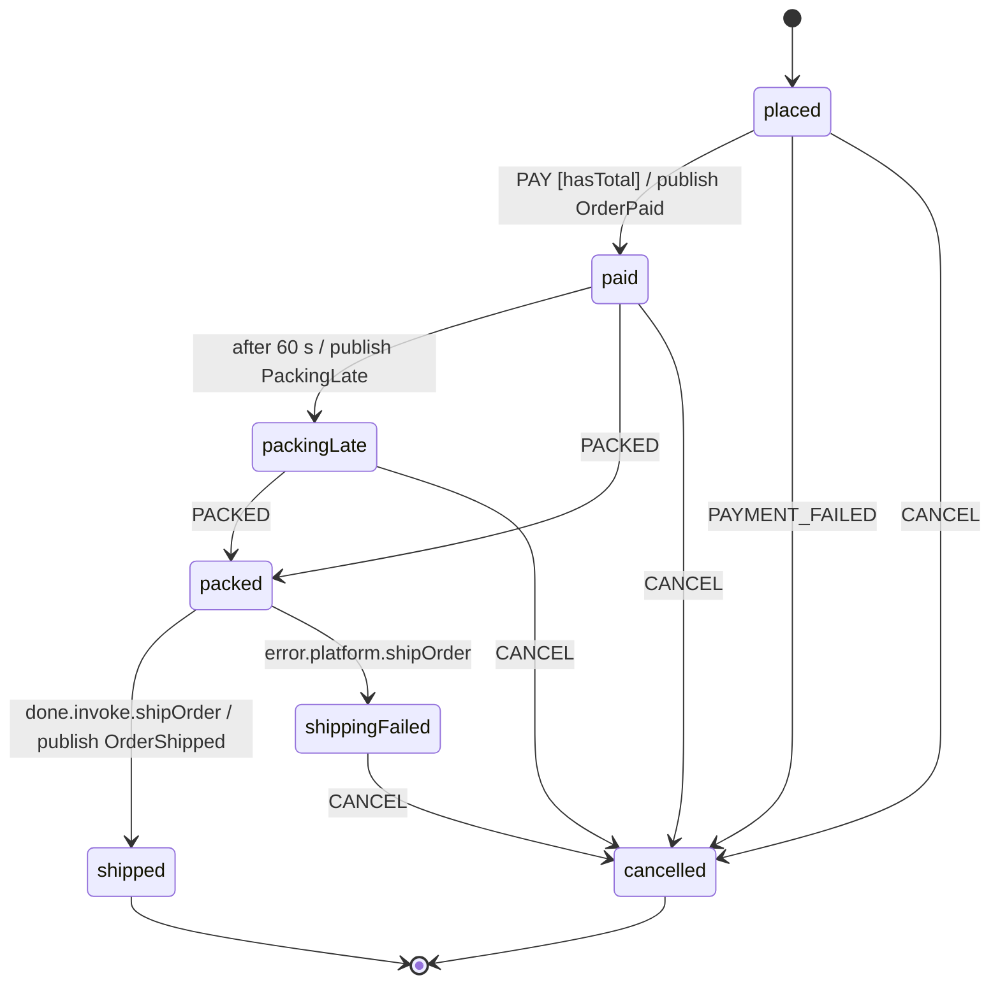
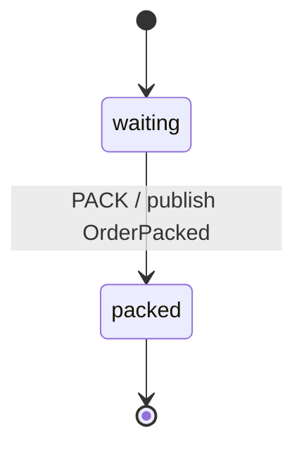

# EDA fulfilment — two statecharts that talk only through events

Order fulfilment across two charts that never call each other. Every
hand-off is an event on a broker. This is the worked example for three
guide pages that had no app yet: the
[event-driven core](../../../docs/_guide/integration-eda.md),
[brokers](../../../docs/_guide/integration-brokers.md) +
[Celery](../../../docs/_guide/integration-celery.md), and
[observability](../../../docs/_guide/integration-observability.md) +
the [inspector](../../../docs/_guide/integration-inspector.md).

It runs with **no external services**. State, outbox, inbox, dead letters
and audit log live in one SQLite file in a temp directory. The broker is
`SyncFakeBrokerAdapter`, or Redis Streams on `fakeredis`. Celery runs in
`task_always_eager` mode. Prometheus, OpenTelemetry and the inspector
write to in-memory sinks.

```
checkout ──xsm.order.PAY──▶ order: placed ─▶ paid ──OrderPaid──▶ warehouse: waiting ─PACK─▶ packed
                                              │                                           │
                                              │ after 60 s ─▶ packingLate (PackingLate)   │
                                              ▼                                           │
                          order: packed ◀──PACKED──────────────────────OrderPacked────────┘
                              │ invoke shipOrder (Celery task)
                              ▼
                          shipped ──OrderShipped──▶
```

| File | What it is |
|:--|:--|
| `machine.json` | The `order` chart: `placed → paid → packed → shipped \| cancelled`, `meta.publish` on the transitions that are integration events, an `after` escalation on `paid`, and `actionErrorPolicy: "fail"` so a poison `PAYMENT_FAILED` is not committed. |
| `warehouse.json` | The `warehouse` chart: `PACK` publishes `OrderPacked`. |
| `logic.py` | Actions, the `hasTotal` guard and the deterministic fake carrier. |
| `app.py` | `build_app()` wires everything; `select_broker()`, `instrument()` and `run_demo()`. |
| `celery_app.py` | JSON-only Celery app, `ship_order` via `celery_service`, `@statechart_task` `handle_order_event`, `DurableTimerScheduler`, `outbox_relay_task`. |
| `__main__.py` | `python -m eda_fulfilment [--broker fake\|redis-streams]`. |
| `tests/` | Plain pytest. The suites for optional extras skip cleanly without them. |

## Run it

```bash
pip install "xstate-statemachine[redis,celery,observability]" "fakeredis[lua]" opentelemetry-sdk
cd examples/integrations
python -m eda_fulfilment                          # fake broker
python -m eda_fulfilment --broker redis-streams   # Redis Streams on fakeredis
python -m pytest eda_fulfilment/tests -q
```

The demo places three orders, drives the choreography to `shipped`,
injects one poison message and redelivers one envelope. Then it prints the
counters: 9 transitions, 9 outbox rows = 9 published envelopes, 1 duplicate
answered from the inbox, 1 dead letter, plus the metric, span and
inspector-message counts.

Without Celery installed the app falls back to an in-process `shipOrder`
service. The core flow needs no extra at all.

From Python:

```python
import app

summary = app.run_demo("fake")
assert set(map(tuple, summary["orders"].values())) == {("order.shipped",)}
assert summary["outbox_rows"] == summary["published"] == 9
assert summary["dead_letters"] == 1 and summary["duplicates"] == 1
```

## The two charts

`xsm diagram machine.json -f mermaid`, with the `after` and `invoke` edges
(which the diagram export leaves out) added by hand:



`xsm diagram warehouse.json -f mermaid`:



## How each piece maps to the guides

| Piece | Where | Guide |
|:--|:--|:--|
| `Envelope`, `ChoreographyRouter` (type → `(machine, EVENT)`, instances keyed `<machine>:<subject>`) | `app.FulfilmentApp` | [EDA: choreography](../../../docs/_guide/integration-eda.md) |
| `OutboxPlugin` → `SQLiteOutboxStore` on the **same** `SQLiteStore`, `PessimisticLock` (the rows commit with the snapshot), `OutboxRelay` | `app.FulfilmentApp`, `pump()` | [EDA: outbox](../../../docs/_guide/integration-eda.md) |
| `SQLiteInbox` dedup on the envelope id, `max_attempts=3`, `SQLiteDeadLetterStore`, `xsm dlq` | `app.FulfilmentApp` | [EDA: dead letters](../../../docs/_guide/integration-eda.md) |
| `AuditPlugin` → `SQLiteLog` | `app.FulfilmentApp.transitions()` | [Persistence](../../../docs/_guide/persistence.md) |
| `SyncRedisStreamsBroker` (`prefix`, consumer group, `min_idle_ms`, `max_bytes`, `dead_letters`) | `app.select_broker()` | [Brokers: Redis Streams](../../../docs/_guide/integration-brokers.md) |
| `celery_service`, `statechart_task`, `DurableTimerScheduler`, `outbox_relay_task`, `assert_json_serializer` | `celery_app.py` | [Celery](../../../docs/_guide/integration-celery.md) |
| `PrometheusPlugin`, `OpenTelemetryPlugin` | `app.instrument()` | [Observability](../../../docs/_guide/integration-observability.md) |
| `InspectorPlugin(MemorySink)` with a context allow-list, `replay_messages` | `app.instrument()` | [Inspector](../../../docs/_guide/integration-inspector.md) |

> **Guarantees**
>
> - **At-least-once delivery plus inbox dedup.** The relay may publish a row
>   twice (crash between publish and `mark_sent`), and a broker may
>   redeliver. The consumer's `SQLiteInbox`, keyed on the envelope id,
>   answers a repeat with the original receipt, so there is one transition
>   (`test_duplicate_envelope_is_a_single_transition`).
> - **The outbox commits with the snapshot.** The outbox rows, inbox mark
>   and audit rows share the snapshot's SQLite transaction under
>   `PessimisticLock`. A failed step writes none of them.
> - **Per-subject order.** One subject (order id) is processed at a time,
>   in delivery order (`test_per_subject_order_is_preserved`).
> - **No exactly-once.** Side effects outside the store (the carrier call)
>   can run more than once. Make them idempotent. Here the tracking id is
>   derived from the order id.

> **Threat model**
>
> - **X0.4 size caps.** The broker adapters check inbound bytes
>   (`max_bytes`) *before* parsing. An oversize or undecodable message is
>   dead-lettered with reason `corrupt`, and its body is **not** stored
>   (`test_oversize_envelope_is_dead_lettered_as_corrupt`).
> - **X0.8 poison → DLQ.** A message that keeps failing is dead-lettered
>   after `max_attempts` and acked, so it never loops forever. The attempt
>   count survives a consumer crash (`test_crashed_consumer_is_reclaimed_with_attempts`).
>   `xsm dlq replay` is a dry run by default.
> - **Serializer refusal.** Every Celery entry point refuses an app that
>   accepts pickle or YAML (`test_pickle_config_is_refused`). A forged or
>   stale task id completing an invoke is ignored and reported through
>   `on_event_dropped`.
> - **Telemetry hygiene.** Metric labels are machine, state and declared
>   event names only, never an order id or a payload value. The inspector
>   sends only the allow-listed context keys.

## Switch to a real broker

`select_broker()` reads `EDA_BROKER` (`fake` or `redis-streams`). For
`redis-streams`, `REDIS_URL` points it at a real server
(`rediss://` for TLS). Without it, the app uses an in-process `fakeredis`:

```bash
EDA_BROKER=redis-streams REDIS_URL=redis://localhost:6379/0 python -m eda_fulfilment
```

Kafka, RabbitMQ, NATS and SQS adapters take the same place. They satisfy
the same `SyncBrokerAdapter` protocol (see the brokers guide's *choosing a
broker* table). For a real Celery worker, build the app with
`make_celery(eager=False)`, run a worker plus **exactly one** Beat process
with `xsm_deadlines_every(scheduler)`, and call `connect_signals()` so
completions are delivered durably.

## What is faked here

- **The broker.** `SyncFakeBrokerAdapter`, or `fakeredis` in place of a
  Redis server. The adapter code is the real one.
- **Celery.** It runs in `task_always_eager` mode with the `memory://`
  transport. No worker process, no result backend.
- **The carrier.** `ship_order` returns `TRK-<order id>`.
- **Time.** The `after` escalation is driven by `SimulatedClock` and an
  injected `now`. Nothing sleeps.
- **Exporters.** Prometheus scrapes a private `CollectorRegistry`, OTel
  spans go to an `InMemorySpanExporter`, and inspector messages go to a
  `MemorySink` (swap in `SseSink` / `JsonLinesSink` for a live view).
